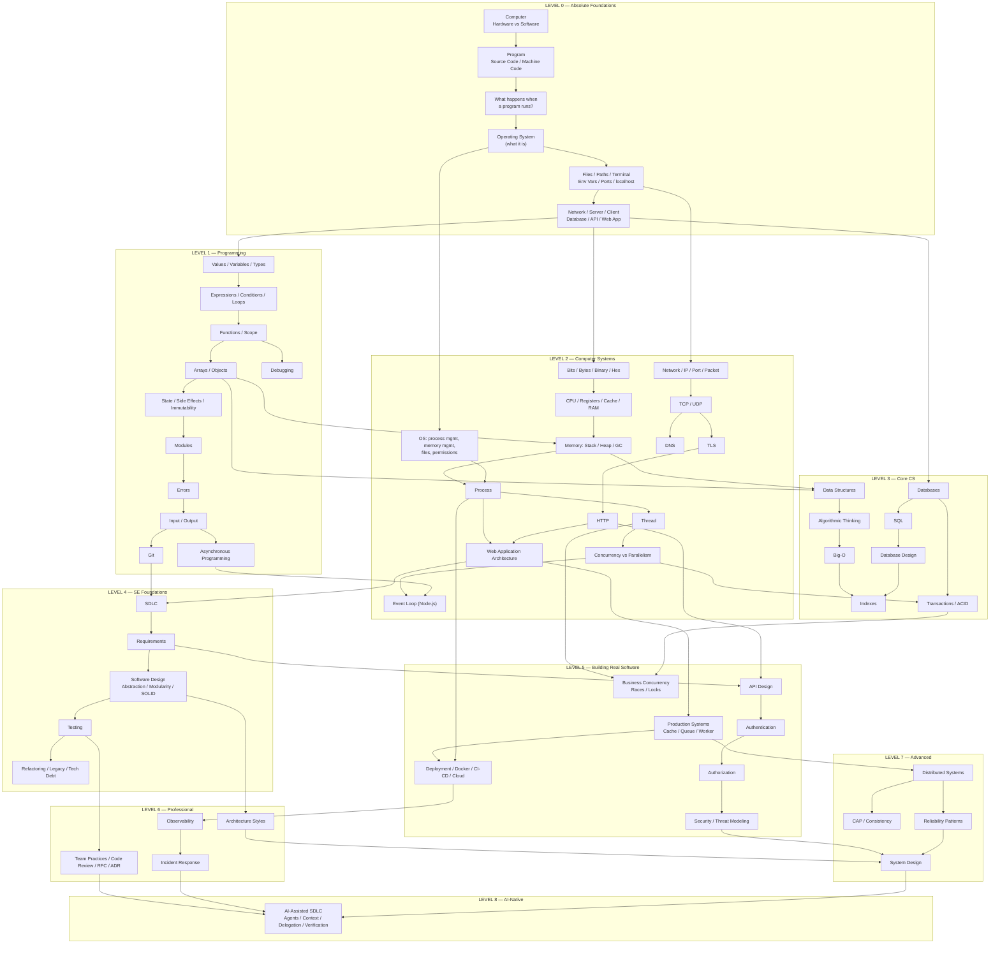

# خريطة الاعتمادية المعرفية والمتطلبات
# Prerequisite & Knowledge Dependency Graph

> **الغرض:** ألّا تجد نفسك فجأة أمام مفهوم مثل `Virtual Memory` أو `ACID` مبنيٍّ على شيء لم تتعلمه بعد.
> كل سهم في هذه الخريطة يعني: **"يجب أن تفهم المصدر قبل الهدف".**

---

## 1. القاعدة

```
إذا كان المفهوم B يعتمد على المفهوم A
     ⟹ نعلّم A أولًا، ونربط B به صراحةً.

لا مصطلح بدون تعريف.
لا تعريف بدون مثال.
لا مثال بدون تمرين.
```

---

## 2. الخريطة الكبرى (The Macro Graph)



---

## 3. سلاسل الاعتمادية التفصيلية (Detailed Dependency Chains)

هذه السلاسل هي **العقد الحرجة** — المفاهيم التي يسقط فيها معظم العصاميين لأنهم قفزوا فوق حلقة ناقصة.

### 3.1 Process (العملية)

```
What is a program?      برنامج = ملف فيه تعليمات
       ↓
What is memory?         ذاكرة = مكان مؤقت تعيش فيه البيانات أثناء التشغيل
       ↓
What does "run" mean?   التشغيل = نظام التشغيل يحمّل التعليمات إلى الذاكرة ويبدأ تنفيذها
       ↓
What is a process?      العملية = نسخة تعمل من برنامج، لها ذاكرتها الخاصة ورقم تعريف (PID)
       ↓
What is virtual memory? كل process ترى ذاكرة "وهمية" خاصة بها، ونظام التشغيل يترجمها إلى الذاكرة الحقيقية
       ↓
What is a thread?       خيط تنفيذ داخل process، يشارك ذاكرتها
       ↓
Concurrency             عدة مهام تتقدّم (ليس بالضرورة في نفس اللحظة)
       ↓
Parallelism             عدة مهام تُنفَّذ في نفس اللحظة فعلًا
       ↓
Race Condition          نتيجة تعتمد على ترتيب تنفيذ غير مضمون
```

### 3.2 HTTP

```
What is a network?      شبكة = حواسيب متصلة تستطيع تبادل البيانات
       ↓
Client / Server         من يطلب (client) ومن يجيب (server)
       ↓
IP address              عنوان الحاسوب على الشبكة
       ↓
Port                    "باب" مرقّم على الحاسوب يميّز البرنامج المستقبِل
       ↓
Packet                  البيانات تُقسَّم إلى حزم صغيرة
       ↓
TCP                     بروتوكول يضمن وصول الحزم كاملة وبالترتيب
       ↓
DNS                     ترجمة الاسم (example.com) إلى IP
       ↓
TLS                     تشفير الاتصال
       ↓
Request / Response      طلب نصّي → ردّ نصّي
       ↓
HTTP                    البروتوكول الذي يحدّد شكل الطلب والرد
       ↓
HTTP methods, headers, status codes, cookies, caching, auth
       ↓
REST API Design
```

### 3.3 Database Transactions (المعاملات)

```
Why not just files?     لماذا لا نخزّن كل شيء في ملفات؟ (البحث، التزامن، الفشل)
       ↓
Database                برنامج متخصص في تخزين البيانات واسترجاعها بأمان
       ↓
Tables / Rows / Columns
       ↓
Data modification       INSERT / UPDATE / DELETE
       ↓
Concurrent operations   مستخدمان يعدّلان نفس الصف في نفس الوقت
       ↓
Failure                 ماذا لو انطفأ الخادم في منتصف عملية من خطوتين؟
       ↓
Atomicity               "إما كل الخطوات أو لا شيء"
       ↓
Transaction             وحدة عمل ذرّية
       ↓
ACID                    Atomicity / Consistency / Isolation / Durability
       ↓
Isolation Levels / Locks / Optimistic Concurrency
       ↓
Distributed Transactions / Sagas / Idempotency   (Level 7)
```

### 3.4 Memory in JavaScript (الذاكرة)

```
Value                   قيمة: 5, "hello", true
       ↓
Variable                اسم يشير إلى قيمة
       ↓
Primitive vs Object     الأنواع البدائية تُنسخ بالقيمة، الكائنات تُنسخ بالمرجع
       ↓
Reference               المتغير يحمل "عنوان" الكائن لا الكائن نفسه
       ↓
Stack vs Heap           أين تعيش القيم البدائية وأين تعيش الكائنات
       ↓
Why const obj is mutable   const يثبّت المرجع، لا محتوى الكائن
       ↓
Garbage Collection      كيف تُحرَّر الذاكرة التي لم تعد مستخدمة
       ↓
Memory Leak             مرجع منسي يمنع التحرير
```

### 3.5 Git

```
What problem does Git solve?   "من غيّر ماذا، متى، ولماذا، وكيف أرجع؟"
       ↓
Repository                     مجلد يتتبّع تاريخه
       ↓
Working Tree / Staging / Commit
       ↓
History as a graph             كل commit يشير إلى أبيه
       ↓
Branch                         مؤشر متحرك إلى commit
       ↓
Merge / Rebase                 طريقتان لدمج التاريخ
       ↓
Remote / Push / Pull / PR
       ↓
Revert / Cherry-pick / Bisect
```

### 3.6 Authentication → Authorization → Security

```
Identity                       من أنت؟
       ↓
Authentication (AuthN)         إثبات الهوية (password, token, session)
       ↓
Session / Cookie / JWT         كيف يتذكّرك الخادم بين الطلبات؟ (يعتمد على HTTP)
       ↓
Authorization (AuthZ)          ما المسموح لك فعله؟
       ↓
Roles / Permissions / Tenancy
       ↓
Threat / Attacker / Asset / Trust Boundary
       ↓
OWASP: XSS, CSRF, SQLi, SSRF, IDOR
       ↓
Threat Modeling (STRIDE)
```

### 3.7 Distributed Systems

```
One server                     كل شيء في مكان واحد
       ↓
Two servers                    الآن الشبكة بينهما قد تفشل
       ↓
Network failure / Partial failure
       ↓
Timeouts / Retries
       ↓
Duplicate messages → Idempotency
       ↓
Replication → Consistency
       ↓
CAP (بشكل صحيح: عند حدوث partition، تختار بين consistency و availability)
       ↓
Load Balancing / Caching / Queues
       ↓
Reliability: circuit breakers, graceful degradation
       ↓
System Design process
```

---

## 4. كيف تستخدم هذه الخريطة؟

1. **قبل كل module** ستجد قسم "Prerequisites". قارنه بهذه الخريطة.
2. إذا وجدت مصطلحًا لا تفهمه، **لا تكمل**. ارجع إلى العقدة السابقة في السلسلة.
3. استخدم [`glossary.md`](../glossary.md) للبحث عن أي مصطلح وموقعه في الكورس.

---

## 5. العقد الأكثر إهمالًا عند العصاميين (Most-Skipped Nodes)

من تجربة تعليم مئات المتعلمين العصاميين، هذه هي الحلقات التي يُقفز فوقها عادةً، وتسبب ارتباكًا لاحقًا:

| العقدة المهملة | الأعراض | أين نعالجها |
|---|---|---|
| **Process** | لا يفهم لماذا `PORT already in use`، أو لماذا يحتاج `pm2`، أو ما يفعله Docker فعلًا | L0-M3, L2-M5 |
| **Reference vs Value** | bugs غامضة عند تعديل arrays/objects | L1-M6, L2-M3 |
| **Event Loop** | لا يفهم لماذا `await` في loop بطيء، أو لماذا الخادم "يتجمّد" | L1-M11, L2-M7 |
| **TCP vs HTTP** | يخلط بين "الاتصال" و"الطلب"، لا يفهم connection pools أو keep-alive | L2-M9, M12 |
| **Index** | لا يعرف لماذا الاستعلام بطيء مع كثرة البيانات | L3-M13 |
| **Transaction** | يكتب كود دفع (payment) بخطوتين منفصلتين بدون transaction | L3-M14 |
| **Requirements** | يبني الشيء الخطأ بشكل ممتاز | L4-M2 |
| **Trust Boundary** | يثق بأي بيانات تأتي من المستخدم | L5-M4 |
| **Idempotency** | webhook مكرر يسبب دفعًا مزدوجًا | L7-M2 |
