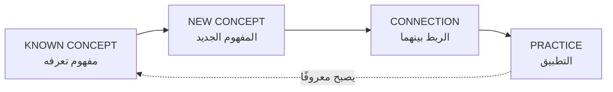
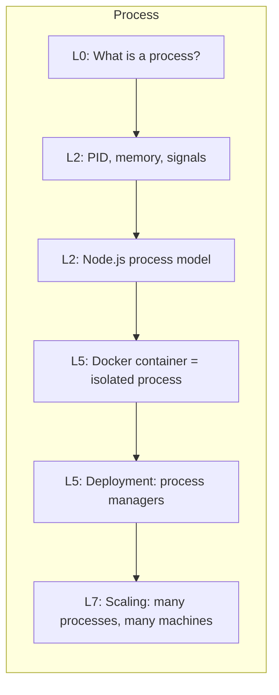
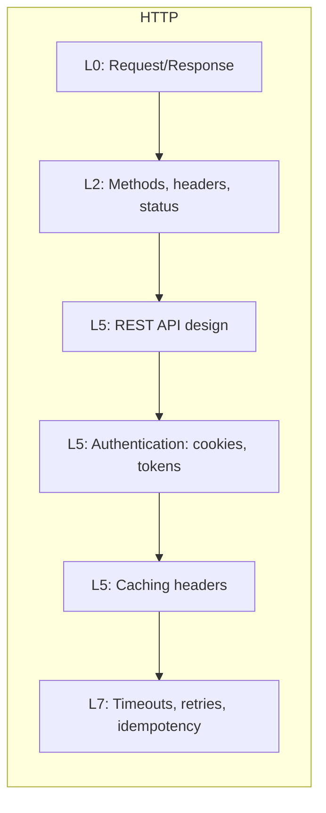
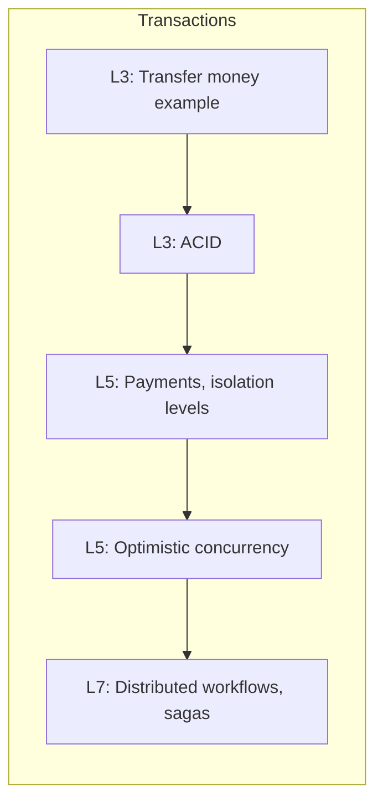

# استراتيجية التعلّم — Learning Strategy

> هذا الكورس ليس كتابًا تقرؤه. إنه **تدريب هندسي**. طريقة الاستخدام تحدد النتيجة.

---

## 1. الحلقة الأساسية: KNOWN → NEW → CONNECTION → PRACTICE

كل مفهوم في الكورس يُقدَّم بهذه الحلقة:



**مثال:**

| الخطوة | المحتوى |
|---|---|
| KNOWN | تعرف أن المتصفح يطلب صفحة من خادم |
| NEW | TCP: قبل إرسال الطلب، يُفتح "اتصال" مضمون بين الطرفين |
| CONNECTION | هذا هو سبب أن أول طلب لموقع أبطأ من الثاني (handshake)، وسبب وجود `keep-alive` |
| PRACTICE | افتح DevTools → Network → انظر إلى "Initial connection" في timing |

---

## 2. حلقة التفكير الهندسي (لا تخمين)

```
   ┌─────────────────────────────────────────────────────┐
   │                                                     │
   ▼                                                     │
OBSERVATION  →  EVIDENCE  →  HYPOTHESIS  →  EXPERIMENT  →  CONCLUSION
  (ملاحظة)       (دليل)        (فرضية)        (تجربة)        (استنتاج)
```

**ممنوع:** "أظن أن المشكلة في X، دعني أغيّر X وأرى."
**مطلوب:** "ألاحظ Y. الدليل: log/stack trace/metric. فرضيتي: X يسبب Y لأن Z. التجربة: إذا عطّلت X فيجب أن يختفي Y. النتيجة: …"

هذه الحلقة هي **نفسها** في:
- Debugging
- Performance tuning
- Incident response
- تقييم كود AI
- Design review

---

## 3. حلقة التصحيح (Debugging Loop) — من اليوم الأول

```
Observe → Hypothesize → Test → Fix → Verify
```

لن نؤجّل الـ debugging إلى "لاحقًا". من Module 1 في Level 1 ستقرأ stack traces وتضع breakpoints.

---

## 4. قواعد الاستخدام

### القاعدة 1: لا تتخطَّ المتطلبات
كل module يبدأ بـ **"Before learning this, you should understand…"**. إذا لم تفهم أحد المتطلبات، ارجع إليه. القفز فوق حلقة ناقصة هو **السبب الأول** للارتباك لاحقًا.

### القاعدة 2: اكتب الكود بيدك (المستويات 0–4)
لا تنسخ. لا تطلب من AI. اكتب، اكسر، أصلح. الهدف أن تبني **حدسًا** لا يمكن بناؤه بالقراءة.
AI يدخل بشكل منهجي في Level 8، عندما تصبح قادرًا على **التحقق** مما يكتبه.

### القاعدة 3: اكسر الأشياء عمدًا
كل module فيه **Debugging Exercise** بكود معطوب. لا تقرأ الحل قبل المحاولة.

### القاعدة 4: اسأل الأسئلة الستة
عند كل مفهوم جديد:

```
1. لماذا؟                        Why does this exist?
2. ما المشكلة التي يحلها؟          What problem does it solve?
3. ماذا يحدث إذا فشل؟             What happens if it fails?
4. ما المقايضات؟                  What are the tradeoffs?
5. أين يعمل هذا الكود؟            Where does this code run?
6. ما القيود؟                     What are the constraints?
```

### القاعدة 5: اشرح لشخص آخر
إذا لم تستطع شرح المفهوم بكلماتك دون النظر إلى المصدر، فأنت لم تتعلمه بعد.

### القاعدة 6: لا تحفظ، افهم
لن نطلب منك حفظ أي شيء. كل ما نطلبه هو أن تفهم **لماذا** الشيء هكذا. ما يُفهم لا يُنسى.

---

## 5. التقدّم المتباعد (Spaced Progression)

المفاهيم المهمة **تعود** في سياقات أعقد. هذا مقصود:







---

## 6. الروابط المتكررة (Recurring Connections)

في كل module نربط:

```
CS CONCEPT  →  SOFTWARE CONCEPT  →  REAL SYSTEM  →  PRODUCTION PROBLEM
(مفهوم علمي)   (مفهوم برمجي)       (نظام حقيقي)     (مشكلة إنتاج)
```

**مثال:**

| CS Concept | Software Concept | Real System | Production Problem |
|---|---|---|---|
| Hash Map O(1) lookup | JavaScript `Map`/`Set` | Redis cache | "Checking if user is blocked takes 2s with 1M users" → استخدم Set بدل Array |
| Process isolation | Container | Docker/Kubernetes | "Memory leak in one service crashed the whole server" → isolate processes |
| TCP connection cost | Connection pool | PostgreSQL pool | "Too many connections" error under load |
| Atomicity | Transaction | Payment service | "User charged but order not created" |

---

## 7. الأسئلة التي تسألها للذكاء الاصطناعي (وما لا تسأله)

**لا تسأل:**
```
✗ "اشرح لي كل شيء عن X"
✗ "اكتب لي الحل"
✗ "لماذا لا يعمل؟" (بدون سياق)
```

**اسأل:**
```
✓ "ما الدليل الذي يدعم أن المشكلة في X؟"
✓ "أي افتراض في هذا الكود قد يكون خاطئًا؟"
✓ "ما الـ edge cases التي لم أغطّها؟"
✓ "كيف أختبر هذا؟"
✓ "ما الثغرة الأمنية المحتملة هنا؟"
✓ "ما المقايضة بين الحل A و B في سياقي؟"
```

> AI يجب ألّا يحل محل تفكيرك. يجب أن يكون **محاورًا نقديًا** يسرّع تفكيرك.

---

## 8. نقاط التفتيش (Checkpoints)

بعد كل مستوى، أربعة اختبارات:

| النوع | الشكل |
|---|---|
| **Conceptual Check** | أسئلة "اشرح لماذا" بدون كود |
| **Coding Check** | مهمة صغيرة تكتبها بيدك |
| **Debugging Check** | نظام معطوب تصلحه بالمنهجية |
| **Architecture Check** | سؤال تصميمي تجيب عليه بـ assumptions / constraints / tradeoffs |

**لا تنتقل للمستوى التالي** قبل اجتياز الأربعة.

---

## 9. الجدول الزمني المقترح (Suggested Pace)

> **تحذير:** هذه أرقام إرشادية لمن يدرس 10–15 ساعة أسبوعيًا. السرعة لا تهم؛ العمق يهم.

| المستوى | المدة التقريبية | ملاحظة |
|---|---|---|
| Level 0 | 1–2 أسابيع | لا تستعجل، هذه الأسس |
| Level 1 | 4–6 أسابيع | اكتب كثيرًا |
| Level 2 | 4–6 أسابيع | أثقل مستوى مفاهيميًا |
| Level 3 | 4–6 أسابيع | |
| Level 4 | 3–5 أسابيع | |
| Level 5 | 6–8 أسابيع | مشروعان كبيران |
| Level 6 | 2–4 أسابيع | |
| Level 7 | 4–6 أسابيع | |
| Level 8 | 2–3 أسابيع | |
| Level 9 | 6–10 أسابيع | Capstone |
| **المجموع** | **~9–14 شهرًا** | |

---

## 10. علامات أنك تتعلم بالطريقة الصحيحة

```
✓ تستطيع شرح المفهوم بمثال من عندك (ليس من الكورس)
✓ تتعرف على المفهوم عندما تراه في كود أو مقال خارجي
✓ تكتشف أخطاء في كود AI لم تكن تلاحظها سابقًا
✓ تسأل "لماذا؟" قبل "كيف؟"
✓ تقول "لا أعرف، دعني أتحقق" بدل التخمين
✓ تستطيع ربط المفهوم بمشكلة إنتاج حقيقية
```
