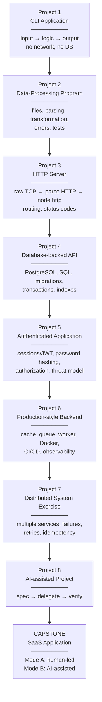

# تدرّج المشاريع — Project Progression

> كل مشروع يُبنى على ما قبله ويضيف طبقة واحدة من التعقيد. ابدأ صغيرًا جدًا.

---

## الخريطة



---

## Project 1 — CLI Application (Level 1)

**ماذا تبني:** أداة سطر أوامر لإدارة قائمة مهام (todo) محفوظة في ملف JSON.

```
$ todo add "Learn processes"
$ todo list
$ todo done 1
$ todo remove 1
```

**المفاهيم المطبّقة:** variables, functions, arrays, objects, modules, errors, file I/O, `process.argv`, Git.

**نموذج ذهني:** `Input → Program Logic → State → Output`

**معايير القبول (Acceptance Criteria):**
- Given ملف فارغ، When أضيف مهمة، Then تُحفظ وتظهر في `list`
- Given مهمة غير موجودة، When أنفّذ `done 99`، Then رسالة خطأ واضحة و exit code ≠ 0

**تحدي الـ debugging:** سنعطيك نسخة معطوبة فيها 3 أخطاء (syntax, logic, type).

---

## Project 2 — Data-Processing Program (Level 1)

**ماذا تبني:** برنامج يقرأ ملف CSV للمبيعات، يحوّله، ويُخرج تقريرًا.

```
input:  sales.csv  (10,000 rows)
output: report.json  { totalByRegion, topProducts, invalidRows }
```

**المفاهيم:** parsing, transformation (`map/filter/reduce`), validation, error handling, async file I/O, first unit tests.

**نموذج ذهني:** `Data → Transformation → Result`

**تحدي الأداء (preview):** ماذا يحدث مع 10,000,000 صف؟ (سنعود لهذا في Level 3 بعد Big-O وstreams).

---

## Project 3 — HTTP Server (Level 2)

**ماذا تبني:** خادم HTTP **من الصفر** على ثلاث مراحل:

1. **Raw TCP:** استقبل bytes على port 3000 واطبعها. شاهد شكل HTTP request الحقيقي.
2. **Parse HTTP:** استخرج method, path, headers, body بيدك. أعد response يدويًا.
3. **node:http:** أعد البناء بالمكتبة القياسية، وافهم ما كانت تخفيه.

**المفاهيم:** TCP, ports, HTTP structure, status codes, headers, routing, concurrency (connections متعددة), event loop.

**تحدي الـ debugging:** خادم "يتجمّد" عند طلب معين (blocking the event loop).

---

## Project 4 — Database-backed API (Level 3)

**ماذا تبني:** REST API لمتجر صغير: Users, Products, Orders, OrderItems على PostgreSQL.

**المفاهيم:** schema design, SQL (raw — بدون ORM أولًا), migrations, JOINs, indexes, transactions (إنشاء order مع items ذرّيًا), N+1 problem.

**تحدي:** الاستعلام بطيء مع 1M منتج → أضف index، اقرأ `EXPLAIN`.

**تحدي:** إنشاء order يفشل في المنتصف → اكتشف البيانات المعطوبة → أضف transaction.

---

## Project 5 — Authenticated Application (Level 5)

**ماذا تبني:** تطبيق Project 4 + تسجيل دخول، جلسات، صلاحيات.

**المفاهيم:** password hashing (bcrypt/argon2), sessions vs JWT, cookies (HttpOnly, Secure, SameSite), authorization (user owns order), rate limiting, input validation, threat model.

**تحديات الأمان:**
- مستخدم يغيّر `userId` في الطلب ويرى طلبات غيره (IDOR)
- reset token يُستخدم مرتين
- endpoint يسرّب stack trace

---

## Project 6 — Production-style Backend (Level 5)

**ماذا تبني:** Project 5 + cache (Redis) + queue + worker + Docker + CI/CD + logs/metrics.

**السيناريو:** المستخدم يرفع ملفًا → API يقبل الطلب فورًا → queue → worker يعالج → notification.

**المفاهيم:** caching & invalidation, background jobs, Docker Compose (app + db + redis + worker), GitHub Actions pipeline, structured logging, health checks, graceful shutdown.

**تحديات الفشل:** Redis غير متاح، worker ينهار في منتصف المعالجة، DB بطيئة.

---

## Project 7 — Distributed System Exercise (Level 7)

**ماذا تبني:** نظام طلبات مبسّط من 3 خدمات: Orders, Payments, Notifications — تتواصل عبر HTTP وqueue.

**المفاهيم:** partial failure, timeouts, retries with backoff, idempotency keys, duplicate webhook handling, circuit breaker, eventual consistency, distributed tracing.

**تحديات:** Payments بطيئة → Orders تتراكم. Webhook مكرر → دفع مزدوج. شبكة تنقطع → حالة غير متسقة.

---

## Project 8 — AI-assisted Engineering Project (Level 8)

**ماذا تبني:** ميزة جديدة على Project 6 (مثلًا: audit log + export) — لكن **AI يكتب الكود**.

**ما تقدّمه أنت:** specification, architecture constraints, acceptance criteria, tests **قبل** الكود، security requirements.

**ما تفعله بعد AI:** compile → typecheck → tests → behavior → security review → architecture review → human review.

**الهدف:** أن تكتشف **على الأقل 3 مشاكل** في كود AI وتوثّقها.

---

## Capstone — SaaS Application (Level 9)

انظر [`09-capstone-overview.md`](09-capstone-overview.md).
