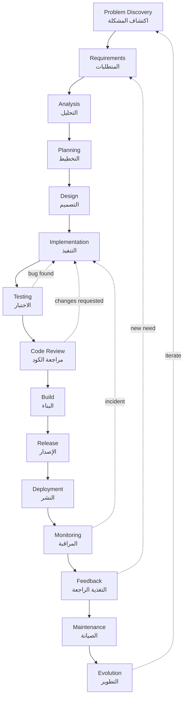

# تدرّج دورة حياة تطوير البرمجيات — SDLC Progression

> **SDLC** = Software Development Lifecycle = دورة حياة تطوير البرمجيات.
> هي **الإطار** الذي يحمل كل ما تتعلمه. نعيشها في كل مشروع، بتعقيد متزايد.

---

## 1. الدورة الكاملة



> **الواقع تكراري (Iterative).** الأسهم المنقّطة هي الطبيعي، لا الاستثناء.

---

## 2. كيف تتدرّج الدورة عبر المشاريع

| المرحلة | Project 1 (CLI) | Project 4 (DB API) | Project 6 (Production) | Capstone |
|---|---|---|---|---|
| **Discovery** | معطاة | معطاة | تحاور "عميلًا" | تكتشفها أنت |
| **Requirements** | 3 جمل | user stories | FR + NFR + constraints | وثيقة كاملة |
| **Analysis** | — | entities | threat model (basic) | threat model (STRIDE) |
| **Planning** | — | قائمة مهام | تقدير + مخاطر | milestones + ADRs |
| **Design** | دالة واحدة | schema + API | architecture diagram | full architecture + API + DB design |
| **Implementation** | بيدك | بيدك | بيدك | Mode A بيدك / Mode B AI |
| **Testing** | يدوي | unit + integration | + e2e + load | كامل |
| **Code Review** | self-review checklist | self-review | peer/AI review | formal review |
| **Build** | `tsc` | `npm run build` | Docker image | CI pipeline |
| **Release** | — | git tag | versioned image | release notes |
| **Deployment** | — | محلي | Docker Compose + cloud | cloud + CI/CD |
| **Monitoring** | — | — | logs + metrics | + traces + alerts |
| **Feedback** | — | — | simulated incidents | real iteration |
| **Maintenance** | — | — | fix under load | ongoing |
| **Evolution** | — | add feature | refactor to add feature | v2 |

---

## 3. المرحلة ↔ الوحدة الدراسية

| مرحلة SDLC | أين تتعلم أدواتها |
|---|---|
| Problem Discovery | L4-M1, L6-M8 (Product Thinking) |
| Requirements | L4-M2, L4-M3 |
| Analysis | L4-M5, L5-M5 (Threat Modeling) |
| Planning | L4-M4 (Estimation) |
| Design | L4-M5 → M9, L6-M9, L7-M6 |
| Implementation | L1 → L3, L5 |
| Testing | L4-M11 |
| Code Review | L6-M2 |
| Build | L5-M11 (Docker), L5-M12 (CI/CD) |
| Release / Deployment | L5-M10, M12, M13 |
| Monitoring | L6-M6 (Observability) |
| Feedback / Incidents | L6-M7 |
| Maintenance / Evolution | L4-M13 → M15 (Refactoring, Legacy, Debt) |

---

## 4. ما يميّز المهندس عن المبرمج في كل مرحلة

| المرحلة | المبرمج | المهندس |
|---|---|---|
| Requirements | "قال لي اعمل كذا" | "ما المشكلة الحقيقية؟ ما غير المذكور؟ ما معايير النجاح؟" |
| Design | يبدأ بالكود | يرسم الحدود والتدفقات والفشل أولًا |
| Implementation | يجعل الكود يعمل | يجعله يعمل، قابلًا للقراءة، للاختبار، وللتغيير |
| Testing | "جربته ويشتغل" | اختبارات آلية تثبت السلوك المتوقع وتحمي من الانحدار |
| Review | يدافع عن كوده | يبحث عن المخاطر في كوده وكود غيره |
| Deployment | "رفعته" | يعرف ما سيحدث إذا فشل النشر وكيف يرجع |
| Monitoring | ينتظر الشكاوى | يعرف من الـ dashboards قبل الشكوى |
| Evolution | يضيف فوق الموجود | يعيد الهيكلة ليبقى النظام قابلًا للتطوير |

---

## 5. SDLC في عصر الذكاء الاصطناعي (Preview لـ Level 8)

```
Phase            AI can help with…                        Human remains responsible for…
──────────────   ────────────────────────────────────────  ─────────────────────────────────
Discovery        synthesizing information                 understanding the real user/problem
Requirements     spotting ambiguities                      deciding what to build
Design           proposing options                         choosing, owning tradeoffs
Implementation   generating code                           correctness, architecture fit
Testing          generating tests                          what to test, test validity
Review           flagging potential issues                 final judgment
Documentation    drafting                                  accuracy
Operations       investigating incidents                   decisions under pressure
```
