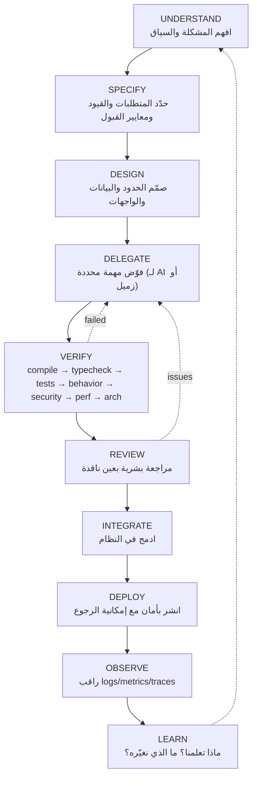

# مسار الهندسة في عصر الذكاء الاصطناعي — AI-Native Engineering Track

> **لماذا يأتي هذا المسار في Level 8 وليس Level 1؟**
> لأنك لا تستطيع **التحقق** مما لا تفهمه. AI يضاعف قدرة من يفهم، ويضاعف أخطاء من لا يفهم.

---

## 1. السؤال المركزي

> **"ما الذي يتغيّر عندما يستطيع AI توليد الكود؟"**

**ما لا يتغيّر:**
- الحاسوب ما زال يعمل بنفس الطريقة
- الشبكة ما زالت تفشل
- قاعدة البيانات ما زالت تحتاج index
- المستخدم ما زال يريد حل مشكلته
- أحدهم ما زال مسؤولًا عندما يسقط الإنتاج

**ما يتغيّر:**
- **كتابة** الكود تصبح أرخص
- **التحقق** من الكود يصبح أهم
- **التخصيص** (specification) يصبح المهارة الأساسية
- **الحكم الهندسي** يصبح الفارق

---

## 2. AI vs Software Engineering

```
AI يستطيع:                    مهندس البرمجيات يقرر:
──────────────                ─────────────────────────
إنتاج الكود                   ماذا يُبنى             (what)
اقتراح تصاميم                 كيف يُبنى              (how)
توليد اختبارات                لماذا                  (why)
صياغة وثائق                   تحت أي قيود            (constraints)
الإشارة لمشاكل محتملة          كيف يُتحقق منه         (validation)
                              كيف يُشغَّل             (operation)
                              من المسؤول              (ownership)
```

---

## 3. Vibe Coding ≠ Engineering

```
VIBE CODING:
  Prompt → Code → "Looks good" → Ship
                       ↑
              هنا تنتهي المسؤولية (خطأ)

ENGINEERING:
  Understand → Specify → Design → Delegate → Implement
  → Verify → Review → Deploy → Observe
                 ↑
        المسؤولية تمتد إلى الإنتاج
```

---

## 4. الحلقة المركزية: AI-Era Engineering Loop



---

## 5. الوحدات (Level 8)

| # | Module | السؤال الذي تجيب عليه |
|---|---|---|
| 8.1 | What Changes? | ما الذي يبقى وما الذي يتغيّر؟ |
| 8.2 | Vibe Coding vs Engineering | أين تنتهي المسؤولية؟ |
| 8.3 | AI-Assisted SDLC | كيف يدخل AI في كل مرحلة دون أن يملكها؟ |
| 8.4 | AI Agents | ما هو agent؟ tools, context, planning, execution, feedback, verification |
| 8.5 | Context Engineering | كيف تجعل AI يفهم مستودعك ومعماريتك وقواعدك؟ |
| 8.6 | AI Delegation | كيف تحوّل "ابنِ authentication" إلى مهمة هندسية محددة؟ |
| 8.7 | AI Verification | ما سلسلة التحقق الإلزامية؟ |
| 8.8 | AI Failure Modes | ما الأخطاء النمطية لـ AI؟ |
| 8.9 | AI Security | prompt injection, poisoning, tool permissions, secrets, destructive commands |
| 8.10 | Human-in-the-Loop | ما الذي **لا** يُفوَّض أبدًا؟ |
| 8.11 | The Loop | الحلقة الكاملة كممارسة يومية |

---

## 6. التفويض: سيئ مقابل جيد

**❌ سيئ:**
```
"Build authentication."
```

**✅ جيد:**
```markdown
## Task: Email/password authentication for the Orders API

### Context
- Repo: see ARCHITECTURE.md (layered: routes → services → repositories)
- Existing: `users` table (id, email, created_at). No password column yet.
- Stack: Node 20, TypeScript strict, Fastify, PostgreSQL via `pg`, no ORM.

### Requirements
- POST /auth/register {email, password} → 201, creates user
- POST /auth/login {email, password} → 200, sets HttpOnly session cookie
- POST /auth/logout → 204, invalidates session
- Passwords hashed with argon2id. Never log passwords.

### Constraints
- Follow existing error format in `src/http/errors.ts`
- Migration via `migrations/` folder convention (timestamped SQL)
- No new dependencies except `argon2`

### Security requirements
- Rate limit login: 5 attempts / 15 min / IP
- Session id: 32 random bytes, stored server-side in `sessions` table
- Cookie: HttpOnly, Secure, SameSite=Lax
- Generic error on wrong email OR password (no user enumeration)

### Acceptance criteria (Given/When/Then)
- Given a registered user, When they login with correct password, Then 200 + cookie set
- Given wrong password, When login, Then 401 with generic message
- Given 6 failed attempts, When 7th attempt, Then 429

### Tests required
- Unit: password hashing/verification
- Integration: register → login → access protected route → logout → denied

### Out of scope
- OAuth, password reset, MFA
```

---

## 7. سلسلة التحقق الإلزامية (Mandatory Verification Chain)

```
1. Compile          هل يُبنى؟
2. Typecheck        هل الأنواع صحيحة؟ (tsc --noEmit)
3. Tests            هل تمر؟ هل تختبر شيئًا فعلًا؟
4. Behavior         هل يفعل ما طُلب؟ (جرّبه بيدك)
5. Security         input validation? authz? secrets? injection?
6. Performance      N+1? unbounded loops? missing index?
7. Architecture     هل يتبع الحدود الموجودة؟ أم اخترع طبقة جديدة؟
8. Human Review     اقرأ كل سطر كأنه كتبه زميل جديد
```

---

## 8. ما لا يُفوَّض أبدًا بدون مراجعة بشرية صريحة

```
🛑 Database migrations         (فقدان بيانات لا يُستعاد)
🛑 Authentication / Authorization
🛑 Payments
🛑 Security-sensitive code
🛑 Production deployment
🛑 Destructive operations      (rm -rf, DROP TABLE, force push)
🛑 Infrastructure changes
```

---

## 9. المهارات الأعلى قيمة في عصر AI

```
Problem framing          صياغة المشكلة
Requirements             المتطلبات
Architecture             المعمارية
Debugging                التصحيح
Verification             التحقق
Testing                  الاختبار
Security                 الأمان
System thinking          التفكير النظامي
Tradeoffs                المقايضات
Communication            التواصل
Domain knowledge         معرفة المجال
Production ownership     ملكية الإنتاج
AI orchestration         توجيه الذكاء الاصطناعي
```

> لاحظ: **كتابة الكود** ليست في القائمة. ليس لأنها غير مهمة، بل لأنها أصبحت **الجزء الأرخص**.
