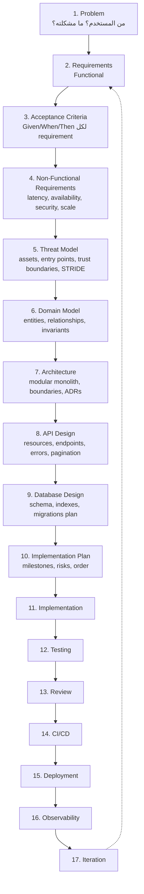

# مشروع التخرج — Capstone Overview

> تطبيق **SaaS** حقيقي، يُبنى مرتين مفاهيميًا: **Mode A** بقيادة بشرية كاملة، **Mode B** بمساعدة AI مع تحقق بشري كامل.

---

## 1. المنتج

**"TeamDocs"** — منصة لإدارة المستندات والمهام للفرق الصغيرة (multi-tenant).

> يمكنك استبدال الفكرة بأي SaaS آخر بشرط أن يحتوي على **كل** الميزات أدناه.

### الميزات الإلزامية

| الميزة | المفاهيم التي تختبرها |
|---|---|
| Authentication | sessions/JWT, hashing, rate limiting |
| Authorization | roles, permissions, resource ownership |
| Users & Organizations | multi-tenancy, tenant isolation |
| Roles & Permissions | RBAC, least privilege |
| Database | schema design, migrations, indexes |
| Transactions | invite flow, billing-like operations |
| Caching | permission cache, invalidation |
| Background Jobs | email sending, file processing, exports |
| Notifications | in-app + email, queue-driven |
| File Uploads | validation, storage, virus-scan hook, signed URLs |
| Webhooks | outgoing with retries + idempotency; incoming with signature verification |
| Audit Logs | append-only, who did what when |
| API | REST, pagination, versioning, idempotency keys |
| Testing | unit, integration, e2e, load |
| Security | threat model, OWASP coverage, secrets management |
| Observability | structured logs, metrics, traces, alerts |
| CI/CD | lint → typecheck → test → build → deploy |
| Deployment | containerized, HTTPS, DB, LB, env separation |

---

## 2. الترتيب الإلزامي (لا تبدأ بالكود)



**قاعدة صارمة:** الخطوات 1–10 تُنتج **وثائق** في مجلد `docs/`. لا سطر كود قبل اكتمالها ومراجعتها.

---

## 3. Mode A — Human-led

- تكتب كل شيء بيدك.
- AI مسموح **فقط** كـ: محاور نقدي ("ما الذي نسيته؟")، مرجع ("ما signature هذه الدالة؟").
- AI **ممنوع** من: كتابة كود الإنتاج، كتابة الاختبارات، اتخاذ قرارات تصميم.

**الهدف:** أن تثبت لنفسك أنك تستطيع.

---

## 4. Mode B — AI-assisted

- أنت تقدّم: specification, architecture, constraints, acceptance criteria, **tests أولًا**.
- AI ينفّذ أجزاء محددة (مثلًا: webhook delivery module، export job).
- أنت تتحقق: الـ 8 خطوات في سلسلة التحقق.
- توثّق **كل مشكلة** اكتشفتها في كود AI في `docs/ai-review-log.md`.

**الهدف:** أن تثبت أنك تستطيع توجيه AI **دون أن تفقد الملكية**.

---

## 5. المخرجات (Deliverables)

```
capstone/
├── docs/
│   ├── 01-problem.md
│   ├── 02-requirements.md
│   ├── 03-acceptance-criteria.md
│   ├── 04-nfr.md
│   ├── 05-threat-model.md
│   ├── 06-domain-model.md
│   ├── 07-architecture.md
│   ├── adr/
│   │   ├── 0001-modular-monolith.md
│   │   ├── 0002-session-auth.md
│   │   └── ...
│   ├── 08-api.md  (+ openapi.yaml)
│   ├── 09-database.md
│   ├── 10-implementation-plan.md
│   ├── runbook.md
│   ├── postmortems/
│   └── ai-review-log.md        (Mode B)
├── src/
├── tests/
├── migrations/
├── .github/workflows/
├── docker-compose.yml
└── README.md
```

---

## 6. معايير التقييم الذاتي

| المحور | السؤال |
|---|---|
| Requirements | هل كل feature مرتبطة بمشكلة مستخدم ومعيار قبول؟ |
| Security | هل يوجد threat model؟ هل كل تهديد له mitigation مطبّق ومختبر؟ |
| Data | هل يمكن أن يرى tenant بيانات tenant آخر بأي طريقة؟ |
| Reliability | ماذا يحدث إذا سقط Redis؟ الـ worker؟ مزوّد البريد؟ |
| Observability | هل تستطيع تتبّع طلب واحد من المتصفح حتى قاعدة البيانات؟ |
| Testing | هل تكسر الاختبارات عندما تكسر الكود عمدًا؟ |
| Evolution | هل تستطيع إضافة ميزة جديدة دون تعديل 10 ملفات غير مرتبطة؟ |
| AI (Mode B) | كم مشكلة اكتشفت في كود AI؟ (صفر = لم تراجع جيدًا) |
