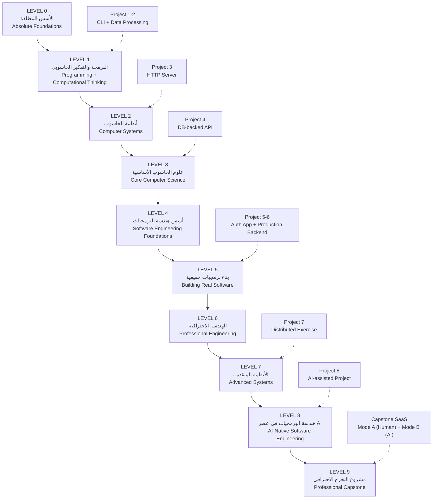

# من الصفر إلى مهندس برمجيات محترف في عصر الذكاء الاصطناعي
## From Beginner → Professional Software Engineer → AI-Native Software Engineer

> **لغة الشرح:** العربية — **المصطلحات التقنية:** English
> **اللغة البرمجية الأساسية:** TypeScript / JavaScript (مع SQL و Bash و Python و C عند الحاجة فقط)

---

## 📍 كيف تستخدم هذا المستودع؟

```
README.md                         ← أنت هنا: الخريطة الكاملة
00-course-overview/               ← خريطة المعرفة، الاستراتيجية، المنهج الكامل
level-0-absolute-foundations/     ← ابدأ من هنا إن لم تدرس علوم الحاسوب
level-1-programming/
level-2-computer-systems/
level-3-core-computer-science/
level-4-software-engineering-foundations/
level-5-building-real-software/
level-6-professional-engineering/
level-7-advanced-systems/
level-8-ai-native-engineering/
level-9-capstone/
projects/                         ← المشاريع الثمانية (تتدرج مع المستويات)
challenges/                       ← تحديات: debugging, architecture, security, failure...
glossary.md                       ← قاموس المصطلحات (عربي ↔ English)
```

**كل مستوى** يحتوي على `README.md` يجيب على ثلاثة أسئلة:
1. **أين أنا؟** (Where am I?)
2. **ماذا يجب أن أعرف الآن؟** (What should I know now?)
3. **ما التالي؟** (What comes next?)

---

## 1. لمن هذا الكورس؟ (Who is this course for?)

هذا الكورس مكتوب لشخص:

- **تعلّم البرمجة بنفسه** (Self-taught) ولم يدرس علوم الحاسوب أو هندسة البرمجيات في الجامعة.
- ربما **يستطيع كتابة كود تطبيقات** (React, Node, Python, …) وربما بنى تطبيقات بمساعدة الذكاء الاصطناعي.
- لكن عنده **فجوات حقيقية** في الأساسيات: كيف يعمل الحاسوب؟ ما هو الـ **Process**؟ ماذا يحدث فعلًا عند إرسال **HTTP request**؟ لماذا تكون قاعدة البيانات بطيئة؟ ما هو الـ **Race Condition**؟ كيف أصمّم نظامًا؟ كيف أعمل في فريق؟
- يريد أن يصبح **مهندس برمجيات حقيقيًا** (Software Engineer) يتحمّل مسؤولية برنامج يعمل في **الإنتاج** (Production)، لا مجرد شخص "يجعل الكود يعمل".

> **الهدف ليس:** "علّمني علوم الحاسوب."
> **الهدف هو:** "ابنِ المعرفة الأساسية، والحكم الهندسي (Engineering Judgment)، والمهارات العملية اللازمة لأصبح مهندس برمجيات حقيقيًا."

---

## 2. افتراضات البداية (Starting assumptions)

نفترض **فقط** أنك:

- تستخدم حاسوبًا بشكل يومي (تفتح متصفحًا، تحفظ ملفات).
- تستطيع قراءة الإنجليزية التقنية البسيطة (أسماء الدوال، رسائل الأخطاء).
- لديك فضول واستعداد لكتابة كود وتجريب أشياء تفشل.

**لا نفترض** أنك تعرف أي شيء مما يلي — سنشرحه كله من البداية:

| المجال | المصطلحات التي سنبدأها من الصفر |
|---|---|
| بنية الحاسوب | CPU, RAM, Memory, Binary, Cache, Storage |
| أنظمة التشغيل | Operating System, Process, Thread, Signals, Permissions |
| الشبكات | Network, IP, Port, TCP/IP, DNS, TLS, HTTP |
| قواعد البيانات | Database, SQL, Index, Transaction, ACID |
| علوم الحاسوب | Data Structures, Algorithms, Complexity (Big-O) |
| التزامن | Concurrency, Parallelism, Race Condition, Lock |
| الأنظمة الموزعة | Distributed Systems, Replication, CAP, Idempotency |
| هندسة البرمجيات | SDLC, Requirements, Architecture, Testing, Git, CI/CD |
| الأمان | Security, Authentication, Authorization, Threat Modeling |
| الإنتاج | Deployment, Observability, Incident Response |

---

## 3. ما الذي **لا** تحتاج أن تتقنه؟ (What you do NOT need to master)

جزء كبير من الطلاب العصاميين يشعر بالذنب لأنه "لم يدرس كل شيء". هذه قائمة صريحة بأشياء **لن نطلب منك إتقانها** — سنشرح فقط *ما هي، ولماذا توجد، وأين تهم*:

| الموضوع | لماذا لا تحتاج إتقانه الآن | ما يكفيك معرفته |
|---|---|---|
| بناء المترجمات (Compiler Construction) | تخصص دقيق | أن الـ compiler يحوّل source code إلى machine code على مراحل |
| البنية الدقيقة للمعالج (CPU Microarchitecture) | لا تؤثر على قراراتك اليومية | أن هناك تسلسل هرمي للذاكرة (cache → RAM → disk) وأنه يؤثر على الأداء |
| الخوارزميات النادرة (Obscure Algorithms) | لن تكتبها بيدك | متى تبحث عنها، وكيف تقرأ تعقيدها |
| الطرق العددية المتقدمة (Numerical Methods) | مجال علمي منفصل | أن الأعداد العشرية (floating point) غير دقيقة |
| أنماط التصميم النادرة (Obscure Design Patterns) | معظمها لا يُستخدم | 6 أنماط أساسية فقط (سنشرحها) |
| تفاصيل كل نظام فرعي في OS | عميق جدًا | المفاهيم: process, memory, files, permissions, networking |
| خوارزميات الإجماع الموزعة (Paxos, Raft) | تُستخدم داخل أدوات جاهزة | ما المشكلة التي تحلها، ومتى تحتاج أداة تطبّقها |

---

## 4. المستوى النهائي (Final skill level)

عند إنهاء الكورس يجب أن تستطيع:

```
✅ تشرح كيف يعمل الحاسوب وكيف يُنفَّذ البرنامج
✅ تشرح كيف تتحدث البرامج عبر الشبكة (TCP → TLS → HTTP)
✅ تشرح كيف تعمل قواعد البيانات (indexes, transactions, ACID)
✅ تفكّر في الخوارزميات والتعقيد (Big-O) بشكل عملي
✅ تفهم أنظمة التشغيل (process, thread, memory)
✅ تفكّر في التزامن (concurrency) وتكتشف race conditions
✅ تفهم الأنظمة الموزعة وأسباب فشلها
✅ تصمّم برمجيات وأنظمة (software design + system design)
✅ تبني، تختبر، تصحّح (debug)، تؤمّن، تراجع (review)، تنشر، تشغّل، وتطوّر البرمجيات
✅ تعمل في فريق هندسي (PRs, code review, RFCs, ADRs, incidents)
✅ تستخدم الذكاء الاصطناعي بفعالية وتقيّم كوده بنقد
✅ تتحمّل مسؤولية برنامج يعمل في الإنتاج
```

### سلّم النضج الهندسي (Software Engineer Maturity)

```
BEGINNER                 يستطيع كتابة كود
    ↓
DEVELOPER                يستطيع بناء ميزات (features)
    ↓
ENGINEER                 يستطيع التصميم والتحقق (design & verify)
    ↓
PROFESSIONAL ENGINEER    يستطيع تشغيل الأنظمة وتطويرها (operate & evolve)
    ↓
SENIOR-LEVEL THINKING    يفكّر في المقايضات والمخاطر والمعمارية والفشل
    ↓
AI-NATIVE ENGINEER       يوجّه الذكاء الاصطناعي بفعالية مع الاحتفاظ بالملكية الهندسية
```

---

## 5. خارطة الطريق: من مبتدئ إلى محترف (Beginner → Professional roadmap)



### المسار المفاهيمي (الصورة الكبيرة)

```
                 BEGINNER
                    │
                    ▼
          "What is a computer?"            ← Level 0
                    │
                    ▼
          "What is a program?"             ← Level 0
                    │
                    ▼
        "How does code execute?"           ← Level 1
                    │
                    ▼
              Memory / CPU                 ← Level 2
                    │
                    ▼
             Process / OS                  ← Level 2
                    │
                    ▼
             Network / HTTP                ← Level 2
                    │
                    ▼
              Database / SQL               ← Level 3
                    │
                    ▼
          Data Structures / Big-O          ← Level 3
                    │
                    ▼
         Software Design / Testing         ← Level 4
                    │
                    ▼
          Requirements + SDLC              ← Level 4
                    │
                    ▼
       Architecture / Security             ← Level 5-6
                    │
                    ▼
        Distributed Systems                ← Level 7
                    │
                    ▼
         Production Engineering            ← Level 6-7
                    │
                    ▼
        AI-Assisted Engineering            ← Level 8
                    │
                    ▼
              PROFESSIONAL SWE             ← Level 9
```

### نظام واحد (ONE SYSTEM)

كل ما ستتعلمه هو **طبقات لنظام واحد**. لا تتعلم "مواد منفصلة"، بل تتعلم طبقات تتراكب:

```
Computer            ← الآلة: CPU, RAM, Disk
   ↓
OS                  ← نظام التشغيل: يدير العمليات والذاكرة والملفات
   ↓
Runtime             ← بيئة التشغيل: Node.js, V8, Python interpreter
   ↓
Network             ← الشبكة: TCP, DNS, TLS, HTTP
   ↓
Application         ← تطبيقك: الكود الذي تكتبه
   ↓
Database            ← قاعدة البيانات: حيث تعيش البيانات
   ↓
Infrastructure      ← البنية التحتية: containers, load balancers, cloud
   ↓
Production          ← الإنتاج: المستخدمون الحقيقيون، الفشل الحقيقي
   ↓
SDLC                ← دورة حياة البرمجيات: كيف نبني ونطوّر
   ↓
Engineering         ← الهندسة: الحكم، المقايضات، الفريق
   ↓
AI-assisted Engineering  ← توجيه الذكاء الاصطناعي مع الاحتفاظ بالمسؤولية
```

---

## 6. خريطة الاعتمادية المعرفية (Knowledge dependency map)

> 📄 الخريطة الكاملة في: [`00-course-overview/01-knowledge-dependency-graph.md`](00-course-overview/01-knowledge-dependency-graph.md)

القاعدة الذهبية في هذا الكورس:

> **لن نستخدم مصطلحًا تقنيًا قبل أن نشرحه.**
> إذا كان مفهوم يعتمد على مفهوم آخر، نعلّم المتطلب أولًا.

مثال:

```
Database Transactions  تعتمد على:
  Database → Data Modification → Concurrent Operations → Failure → Atomicity → Transaction

HTTP  يعتمد على:
  Network → Client/Server → IP/Port → Request/Response → HTTP

Threads  تعتمد على:
  Program → Process → Execution → Thread

Git Branching  يعتمد على:
  What is version control → Why history matters → Commits → Branches
```

---

## 7. الأساسي مقابل الاختياري (Core vs optional)

> 📄 التفصيل الكامل: [`00-course-overview/02-core-vs-optional.md`](00-course-overview/02-core-vs-optional.md)

لكل موضوع نصنّف المطلوب إلى أربع درجات:

| الدرجة | المعنى |
|---|---|
| 🔴 **MUST MASTER** | لا يمكن تفويضها للذكاء الاصطناعي. تُقاس بها كفاءتك كمهندس. |
| 🟠 **SHOULD UNDERSTAND** | تحتاج فهمها لتتخذ قرارات صحيحة، لكن لست مضطرًا لتطبيقها يدويًا. |
| 🟡 **CONCEPTUAL AWARENESS** | تعرف ما هي ولماذا توجد ومتى تبحث عنها. |
| ⚪ **DEFER** | أجّلها. ستتعلمها إن احتجتها في مسارك. |

### ما **يجب** إتقانه (لا يُفوَّض للـ AI)

```
Debugging          Requirements       Architecture       HTTP
Databases          Security           Testing            Git
System Design      Concurrency        Failures           Observability
Software Lifecycle (SDLC)
```

---

## 8. خريطة فجوات المتعلّم العصامي (Self-taught knowledge gap map)

> 📄 التفصيل: [`00-course-overview/03-self-taught-gap-map.md`](00-course-overview/03-self-taught-gap-map.md)

| ما يعرفه العصامي عادةً | الفجوة الشائعة | أين نسدّها |
|---|---|---|
| يكتب JavaScript | لا يعرف ما يحدث في الذاكرة، ولماذا `const obj` قابل للتعديل | Level 2 |
| يستخدم `fetch()` | لا يعرف ما هو TCP أو DNS أو TLS، ولماذا الطلب بطيء | Level 2 |
| يستخدم ORM | لا يعرف ما هو index أو transaction أو لماذا الاستعلام بطيء | Level 3 |
| يستخدم `async/await` | لا يفهم الـ event loop أو الـ race condition | Level 1, 2, 5 |
| يبني features | لا يعرف كيف يكتب requirements أو يقدّر الوقت | Level 4 |
| يستخدم Git بأمر `push` | لا يفهم branches/rebase/bisect ولا يستطيع إصلاح تاريخ معطوب | Level 1 |
| ينشر على Vercel | لا يعرف ما هو process أو container أو load balancer | Level 5 |
| يستخدم AI لكتابة الكود | لا يستطيع التحقق منه أو اكتشاف ثغراته | Level 8 |

---

## 9. استراتيجية التعلّم (Learning strategy)

> 📄 التفصيل: [`00-course-overview/04-learning-strategy.md`](00-course-overview/04-learning-strategy.md)

### الحلقة الأساسية لكل مفهوم

```
KNOWN CONCEPT  →  NEW CONCEPT  →  CONNECTION  →  PRACTICE
   (ما تعرفه)      (الجديد)        (الربط)        (التطبيق)
```

### حلقة التفكير الهندسي (لا تخمّن أبدًا)

```
Observation → Evidence → Hypothesis → Experiment → Conclusion
  (ملاحظة)     (دليل)     (فرضية)      (تجربة)      (استنتاج)
```

### القواعد

1. **لا تتخطَّ المتطلبات.** كل module يبدأ بـ "قبل أن تتعلم هذا، يجب أن تفهم…".
2. **اكتب الكود بيدك** في المستويات 0–4. الـ AI يأتي في Level 8 بعد أن تصبح قادرًا على التحقق منه.
3. **اكسر الأشياء عمدًا.** كل مستوى فيه debugging challenges.
4. **اسأل دائمًا:** لماذا؟ ما المشكلة التي يحلّها هذا؟ ماذا يحدث إذا فشل؟ ما المقايضات؟ أين يعمل هذا الكود؟
5. **المفاهيم تعود.** الـ process يظهر في Level 2 ثم يعود في Node.js، Docker، Deployment، Scaling. هذا مقصود (Spaced Progression).

---

## 10. المنهج الكامل (Complete curriculum)

> 📄 القائمة الكاملة بكل module: [`00-course-overview/05-complete-curriculum.md`](00-course-overview/05-complete-curriculum.md)

| المستوى | العنوان | عدد الوحدات | المشروع |
|---|---|---|---|
| [Level 0](level-0-absolute-foundations/) | الأسس المطلقة — Absolute Foundations | 8 | — |
| [Level 1](level-1-programming/) | البرمجة والتفكير الحاسوبي — Programming | 16 | Project 1, 2 |
| [Level 2](level-2-computer-systems/) | أنظمة الحاسوب — Computer Systems | 13 | Project 3 |
| [Level 3](level-3-core-computer-science/) | علوم الحاسوب الأساسية — Core CS | 14 | Project 4 |
| [Level 4](level-4-software-engineering-foundations/) | أسس هندسة البرمجيات — SE Foundations | 16 | — |
| [Level 5](level-5-building-real-software/) | بناء برمجيات حقيقية — Building Real Software | 13 | Project 5, 6 |
| [Level 6](level-6-professional-engineering/) | الهندسة الاحترافية — Professional Engineering | 9 | — |
| [Level 7](level-7-advanced-systems/) | الأنظمة المتقدمة — Advanced Systems | 9 | Project 7 |
| [Level 8](level-8-ai-native-engineering/) | هندسة البرمجيات في عصر AI — AI-Native SE | 11 | Project 8 |
| [Level 9](level-9-capstone/) | مشروع التخرج — Capstone | 4 | Capstone SaaS |

---

## 11. تدرّج المشاريع (Project progression)

> 📄 التفصيل: [`00-course-overview/06-project-progression.md`](00-course-overview/06-project-progression.md)

```
Project 1   CLI Application                    ← Level 1
Project 2   Small Data-Processing Program      ← Level 1
Project 3   HTTP Server (from scratch)         ← Level 2
Project 4   Database-backed API                ← Level 3
Project 5   Authenticated Application          ← Level 5
Project 6   Production-style Backend           ← Level 5
Project 7   Distributed System Exercise        ← Level 7
Project 8   AI-assisted Engineering Project    ← Level 8
Capstone    SaaS Application (Mode A + B)      ← Level 9
```

---

## 12. تدرّج دورة حياة البرمجيات (SDLC progression)

> 📄 التفصيل: [`00-course-overview/07-sdlc-progression.md`](00-course-overview/07-sdlc-progression.md)

```
Problem Discovery → Requirements → Analysis → Planning → Design
→ Implementation → Testing → Code Review → Build → Release
→ Deployment → Monitoring → Feedback → Maintenance → Evolution
```

التطوير الحقيقي **تكراري** (Iterative) وليس خطًا مستقيمًا. سنعيش هذه الدورة في كل مشروع، بتعقيد متزايد.

---

## 13. مسار الهندسة في عصر الذكاء الاصطناعي (AI-native engineering track)

> 📄 التفصيل: [`00-course-overview/08-ai-native-track.md`](00-course-overview/08-ai-native-track.md)

الحلقة المركزية التي ستتعلمها في Level 8:

```
UNDERSTAND → SPECIFY → DESIGN → DELEGATE → VERIFY
→ REVIEW → INTEGRATE → DEPLOY → OBSERVE → LEARN
```

> **AI يستطيع إنتاج الكود.**
> **مهندس البرمجيات يقرر:** ماذا يُبنى، كيف، لماذا، تحت أي قيود، كيف يُتحقق منه، وكيف يُشغَّل.

---

## 14. مشروع التخرج (Final capstone)

> 📄 التفصيل: [`00-course-overview/09-capstone-overview.md`](00-course-overview/09-capstone-overview.md) و [`level-9-capstone/`](level-9-capstone/)

تطبيق **SaaS** حقيقي: authentication, authorization, users, organizations, roles, permissions, database, transactions, caching, background jobs, notifications, file uploads, webhooks, audit logs, API, testing, security, observability, CI/CD, deployment.

**لا يبدأ بالكود.** يبدأ بـ Problem → Requirements → Threat Model → Architecture → … → Deployment → Observability → Iteration.

---

## التحوّل المستهدف (The transformation)

```
BEFORE:  "أستطيع صنع تطبيق بمساعدة الذكاء الاصطناعي."

AFTER:   "أفهم الحواسيب، البرمجيات، الأنظمة، الممارسات الهندسية،
          المعمارية، الفشل، الأمان، والإنتاج —
          وأستطيع استخدام الذكاء الاصطناعي كمضاعف قوة."
```

---

## ▶️ ابدأ الآن

👉 [**Level 0 — Module 0: كيف تترابط الحواسيب والبرامج ومهندسو البرمجيات**](level-0-absolute-foundations/module-00-how-everything-fits-together.md)

---

### حالة الكورس (Course status)

| القسم | الحالة |
|---|---|
| 00 — Course Overview | ✅ |
| Level 0 — Absolute Foundations | ✅ |
| Level 1 — Programming | ✅ مكتمل (16 وحدة + Project 1–2 + Checkpoint 1) |
| Level 2 — Computer Systems | ✅ مكتمل (13 وحدة + Project 3 + Checkpoint 2) |
| Level 3 — Core Computer Science | ✅ مكتمل (14 وحدة + Project 4 + Checkpoint 3) |
| Level 4 — Software Engineering Foundations | ✅ مكتمل (16 وحدة + Checkpoint 4) |
| Level 5 – 9 | 🚧 (الفهارس جاهزة) |
| Projects / Challenges / Glossary | 🚧 |
