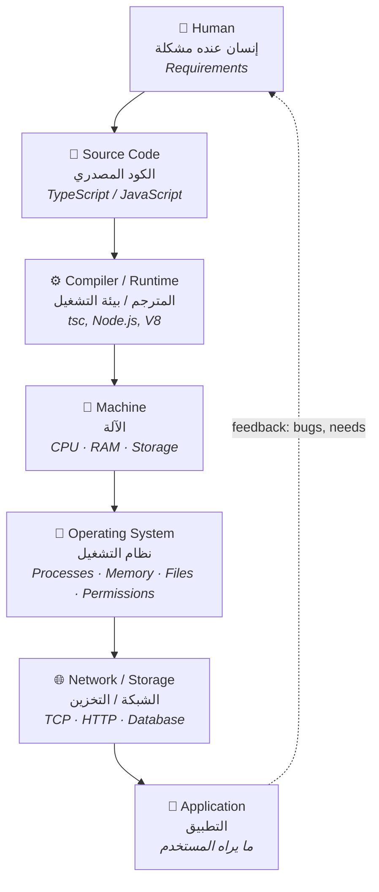
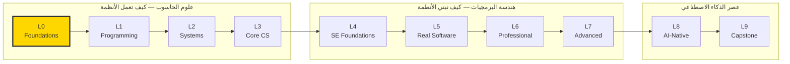
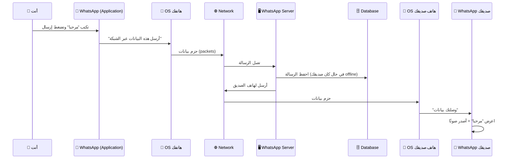

# Module 0 — كيف تترابط الحواسيب والبرامج ومهندسو البرمجيات
## How Computers, Programs, and Software Engineers Fit Together

> **المستوى:** Level 0 — Absolute Foundations
> **الموقع:** أنت في [1 من 8] في هذا المستوى
> **السابق:** — | **التالي:** [Module 0.1 — What is a Computer?](module-01-what-is-a-computer.md)

---

## 1. المتطلبات (Prerequisites)

> **قبل أن تتعلم هذا، يجب أن تفهم:**

لا شيء. هذه نقطة الصفر.

نفترض فقط أنك استخدمت حاسوبًا أو هاتفًا: فتحت تطبيقًا، كتبت نصًا، تصفّحت موقعًا.

---

## 2. أهداف التعلّم (Learning Objectives)

بعد هذه الوحدة ستستطيع:

- وصف **الطبقات** التي يمر بها الكود من رأس الإنسان حتى يعمل على جهاز المستخدم.
- التفريق بين **ما هو "علوم الحاسوب"** و**ما هو "هندسة البرمجيات"** ولماذا تحتاج الاثنين.
- شرح **ماذا يفعل مهندس البرمجيات فعلًا** (وليس فقط "يكتب كود").
- رسم الخريطة الذهنية الكبرى من الذاكرة.
- معرفة **أين أنت الآن** في رحلة من 10 مستويات، وما الذي سيأتي.

---

## 3. شرح للمبتدئ (Beginner Explanation)

### لنبدأ بقصة

تخيّل أن صديقك يملك مطعمًا صغيرًا، ويضيع وقته كل يوم في استقبال الطلبات عبر الهاتف وكتابتها على ورق. يقول لك:

> "أريد تطبيقًا يستقبل الطلبات بدل الهاتف."

بين هذه الجملة وبين تطبيق يعمل على هواتف الزبائن، هناك **رحلة طويلة من الطبقات**. لنمشِ فيها ببطء.

### الطبقة 1: الإنسان (Human)

كل شيء يبدأ بإنسان عنده **مشكلة** (problem). ليس "فكرة تطبيق"، بل مشكلة: *"الطلبات الهاتفية تضيّع وقتي وتسبب أخطاء".*

مهمتك الأولى **ليست** كتابة الكود. مهمتك فهم المشكلة: من يطلب؟ كم طلبًا في اليوم؟ ماذا يحدث إذا ضاع طلب؟ هل يدفع الزبون عبر التطبيق أم عند الاستلام؟

هذه هي **المتطلبات** (**Requirements**). سنتعلمها بعمق في Level 4.

### الطبقة 2: الكود المصدري (Source Code)

بعد الفهم، تكتب **تعليمات** للحاسوب بلغة يفهمها البشر والآلات معًا، مثل JavaScript أو Python. هذا النص يسمى **الكود المصدري** (**Source Code**).

مثلًا، هذا سطر كود مصدري:

```javascript
const total = price * quantity;
```

أنت تفهمه. لكن **الحاسوب لا يفهمه مباشرة**. الحاسوب في أعماقه لا يفهم إلا إشارات كهربائية: تيار موجود أو غير موجود، وهو ما نرمز له بـ `1` و `0`.

### الطبقة 3: المترجم أو بيئة التشغيل (Compiler / Runtime)

نحتاج **وسيطًا** يحوّل الكود المصدري إلى الشكل الذي تفهمه الآلة.

- أحيانًا يكون الوسيط **مترجمًا** (**Compiler**): يأخذ كل الكود دفعة واحدة، يحوّله إلى **كود آلة** (**Machine Code**)، ويعطيك ملفًا جاهزًا للتشغيل. مثل مترجم بشري يترجم كتابًا كاملًا ثم يسلّمه.
- أحيانًا يكون **مفسّرًا** (**Interpreter**): يقرأ الكود سطرًا سطرًا وينفّذه فورًا. مثل مترجم فوري في مؤتمر.
- وما يشغّل كودك ويوفّر له الخدمات أثناء التشغيل يسمى **بيئة التشغيل** (**Runtime**). مثل Node.js لـ JavaScript.

سنفصّل الفرق في [Module 0.2](module-02-programs-and-code.md). الآن يكفي أن تعرف: **بين كودك والآلة يوجد وسيط.**

### الطبقة 4: الآلة (Machine)

الآلة هي **العتاد** (**Hardware**): القطع المادية. أهم ثلاث قطع الآن:

- **المعالج** (**CPU** — Central Processing Unit): ينفّذ التعليمات. سريع جدًا وغبي جدًا: يفعل بالضبط ما يُقال له.
- **الذاكرة العشوائية** (**RAM** — Random Access Memory): مكان مؤقت وسريع تعيش فيه البيانات **أثناء** عمل البرنامج. تُمسح عند إطفاء الجهاز.
- **التخزين** (**Storage** — Disk/SSD): مكان دائم وأبطأ تبقى فيه الملفات حتى بعد الإطفاء.

### الطبقة 5: نظام التشغيل (Operating System)

لو كان كل برنامج يتعامل مع العتاد مباشرة، لكانت فوضى: برنامجان يكتبان في نفس مكان الذاكرة، برنامج يحتكر المعالج ولا يترك لغيره شيئًا.

**نظام التشغيل** (**OS** — Operating System) مثل Windows أو macOS أو Linux هو **المدير**: يقرّر أي برنامج يأخذ المعالج الآن، ويعطي كل برنامج ذاكرته الخاصة، ويدير الملفات، ويتحكم في من يستطيع فعل ماذا.

عندما "تشغّل" برنامجًا، نظام التشغيل هو من يحمّله إلى الذاكرة ويبدأ تنفيذه. النسخة العاملة من البرنامج تسمى **عملية** (**Process**). سنفصّل هذا في [Module 0.3](module-03-running-a-program.md).

### الطبقة 6: الشبكة والتخزين (Network / Storage)

تطبيق المطعم لا يعمل على جهاز واحد. هاتف الزبون يجب أن يرسل الطلب إلى حاسوب في مكان آخر. الحواسيب المتصلة ببعضها تشكّل **شبكة** (**Network**).

الحاسوب الذي ينتظر الطلبات ويجيب عليها يسمى **خادم** (**Server**). الجهاز الذي يطلب يسمى **عميل** (**Client**).

والطلبات يجب أن تُحفظ في مكان منظّم يمكن البحث فيه: هذا هو **قاعدة البيانات** (**Database**).

### الطبقة 7: التطبيق (Application)

كل الطبقات السابقة تخدم هدفًا واحدًا: **التطبيق** الذي يحل مشكلة صاحب المطعم. التطبيق هو ما يراه المستخدم ويتفاعل معه.

### الخريطة الكاملة

```
Human              ← إنسان عنده مشكلة
 ↓
Source Code        ← تعليمات مكتوبة بلغة برمجة
 ↓
Compiler / Runtime ← وسيط يحوّل/يشغّل الكود
 ↓
Machine            ← CPU + RAM + Storage
 ↓
Operating System   ← المدير: processes, memory, files, permissions
 ↓
Network / Storage  ← التواصل بين الأجهزة + حفظ البيانات
 ↓
Application        ← ما يراه المستخدم
```

> **كل مستوى في هذا الكورس هو تعمّق في طبقة أو أكثر من هذه الطبقات.**

---

## 4. النموذج الذهني (Mental Model)

### النموذج الأول: "الطبقات" (Layers)

كل طبقة **تخفي تعقيد** ما تحتها وتقدّم خدمة أبسط لما فوقها. أنت ككاتب JavaScript لا تفكر في الإشارات الكهربائية — لأن طبقات تحتك تتكفّل بذلك. هذا المبدأ اسمه **التجريد** (**Abstraction**) وسيعود مرارًا.

لكن — وهذا جوهر الكورس — **المهندس الحقيقي يعرف ماذا يحدث في الطبقات التي تحته**، حتى لو لم يكتب فيها. لأن:
- عندما يبطؤ البرنامج، السبب غالبًا في طبقة أدنى (ذاكرة، شبكة، قرص).
- عندما يفشل، الفشل غالبًا في الحدود بين الطبقات.
- عندما تصمّم، القيود تأتي من الطبقات الدنيا.

### النموذج الثاني: "علوم الحاسوب vs هندسة البرمجيات"

```
علوم الحاسوب (Computer Science)       تشرح: "كيف تعمل الأنظمة"
     ↓
     كيف يعمل المعالج، الذاكرة، الشبكة، قاعدة البيانات
     ما هي الخوارزمية، ما هو التعقيد
     لماذا هذا الحل أسرع من ذاك

هندسة البرمجيات (Software Engineering)  تشرح: "كيف يبني البشر الأنظمة ويطوّرونها"
     ↓
     كيف نفهم المتطلبات، نصمّم، نختبر، نراجع، ننشر، نشغّل
     كيف نعمل في فريق، كيف نغيّر كودًا عمره 5 سنوات بأمان
     كيف نتحمّل مسؤولية نظام يستخدمه آلاف الناس
```

**المبرمج العصامي** غالبًا تعلّم أدوات هندسة البرمجيات (frameworks، Git سطحيًا) **بدون** أساس علوم الحاسوب، و**بدون** عمق هندسة البرمجيات. هذا الكورس يبني الاثنين بالترتيب الصحيح.

### النموذج الثالث: "ماذا يفعل مهندس البرمجيات فعلًا؟"

```
    ما يظنه الناس                 ما يحدث فعلًا
    ─────────────                 ─────────────────────────────────────
    يكتب كود 100%                 يفهم المشكلة             ~20%
                                  يصمّم ويقرّر             ~15%
                                  يكتب كود                 ~25%
                                  يختبر ويصحّح (debug)     ~20%
                                  يراجع ويتواصل            ~10%
                                  ينشر ويراقب ويصلح        ~10%
```

> النسب تقريبية وتختلف بالدور والشركة، لكن الرسالة ثابتة: **كتابة الكود جزء، وليست الكل.**

---

## 5. الرسم التوضيحي (Visual Diagram)

### الخريطة الكبرى كطبقات



### "نظام واحد" — كيف تتراكب الطبقات في تطبيق حقيقي

```
┌─────────────────────────────────────────────────────────────┐
│  هاتف الزبون (Client)                                        │
│  ┌───────────────────────────────────────────────────────┐  │
│  │ Application: تطبيق المطعم (يعرض القائمة، يرسل الطلب)  │  │
│  ├───────────────────────────────────────────────────────┤  │
│  │ Runtime: المتصفح / محرك JavaScript                     │  │
│  ├───────────────────────────────────────────────────────┤  │
│  │ OS: iOS / Android                                      │  │
│  ├───────────────────────────────────────────────────────┤  │
│  │ Machine: CPU · RAM · Storage                           │  │
│  └───────────────────────────────────────────────────────┘  │
└──────────────────────────┬──────────────────────────────────┘
                           │
                           │  Network (الإنترنت)
                           │  "أريد طلب 2 بيتزا"
                           ▼
┌─────────────────────────────────────────────────────────────┐
│  الخادم (Server) — حاسوب في مركز بيانات                      │
│  ┌───────────────────────────────────────────────────────┐  │
│  │ Application: كود الخادم (يستقبل الطلب، يتحقق، يحفظ)    │  │
│  ├───────────────────────────────────────────────────────┤  │
│  │ Runtime: Node.js                                       │  │
│  ├───────────────────────────────────────────────────────┤  │
│  │ OS: Linux                                              │  │
│  ├───────────────────────────────────────────────────────┤  │
│  │ Machine: CPU · RAM · Storage                           │  │
│  └───────────────────────────────────────────────────────┘  │
└──────────────────────────┬──────────────────────────────────┘
                           │
                           │  "احفظ هذا الطلب"
                           ▼
┌─────────────────────────────────────────────────────────────┐
│  قاعدة البيانات (Database) — برنامج متخصص (غالبًا خادم آخر)  │
│  orders: [ {id: 1, items: ["pizza", "pizza"], total: 40} ]   │
└─────────────────────────────────────────────────────────────┘
```

> لاحظ: **نفس الطبقات** (Machine → OS → Runtime → Application) تتكرر على **كل** جهاز. الفرق فقط في الدور: client أم server.

### رحلة الكورس (أين أنت)



---

## 6. مثال بسيط (Simple Example)

**بدون كود.** افتح الآلة الحاسبة في جهازك واحسب `7 × 6`.

ما الذي حدث عبر الطبقات؟

| الطبقة | ما حدث |
|---|---|
| Human | أنت أردت معرفة ناتج 7×6 |
| Application | تطبيق الآلة الحاسبة استقبل ضغطاتك وعرض 42 |
| Runtime | لغة التطبيق (Swift/Kotlin/C++) كان لها بيئة تشغيل تدير الذاكرة والواجهة |
| OS | نظام التشغيل أعطى التطبيق وقتًا على المعالج ومساحة في الذاكرة، ومرّر له ضغطات الأزرار |
| Machine | المعالج نفّذ تعليمة ضرب فعلية على بتات تمثّل 7 و 6 |
| Network / Storage | **لم تُستخدم** — هذا برنامج محلي بالكامل. (لاحظ: ليس كل برنامج يحتاج شبكة) |

---

## 7. مثال كود (Code Example)

لن نشرح الكود بعد (هذا في Level 1). الهدف الآن فقط أن **ترى** كيف يبدو كل مستوى من "التعليمات"، لتشعر بالمسافة بين الإنسان والآلة.

### المستوى 1: ما يريده الإنسان
```
"احسب إجمالي الطلب: السعر مضروبًا في الكمية"
```

### المستوى 2: الكود المصدري (TypeScript) — يقرؤه البشر
```typescript
function calculateTotal(price: number, quantity: number): number {
  return price * quantity;
}

console.log(calculateTotal(20, 2)); // 40
```

### المستوى 3: ما يحدث داخل بيئة التشغيل (تمثيل مبسّط لـ "bytecode")
```
LoadParam   price      ← حمّل قيمة price
LoadParam   quantity   ← حمّل قيمة quantity
Multiply               ← اضربهما
Return                 ← أعد النتيجة
```
> هذا شكل وسيط بين الكود المصدري وكود الآلة. محرك V8 (داخل Node.js والمتصفح) ينتج شيئًا مشابهًا. لا تحفظه.

### المستوى 4: ما تنفّذه الآلة فعلًا (كود آلة — تمثيل)
```
10001011 01000101 11111000    ← mov  eax, [rbp-8]
00001111 10101111 01000101    ← imul eax, [rbp-12]
11000011                      ← ret
```
> أصفار وآحاد. هذا ما "يفهمه" المعالج. **أنت لن تكتب هذا أبدًا** — لكن يجب أن تعرف أنه موجود، وأن كل سطر كتبته ينتهي هنا.

### الخلاصة من المثال

```
Human intent          "احسب الإجمالي"
       ↓  (أنت تترجمه إلى)
Source code           price * quantity
       ↓  (الـ compiler/runtime يترجمه إلى)
Intermediate form     Multiply
       ↓  (ثم إلى)
Machine code          00001111 10101111 ...
       ↓  (المعالج ينفّذه)
Electricity           إشارات في الترانزستورات
```

---

## 8. مثال من العالم الحقيقي (Real-World Example)

### ماذا يحدث عندما ترسل رسالة WhatsApp؟



**لاحظ الطبقات:**
- أنت لم تفكر في الشبكة. **التجريد** أخفاها.
- تطبيق WhatsApp لم يتعامل مع بطاقة الشبكة مباشرة. **نظام التشغيل** أخفاها.
- الخادم احتاج **قاعدة بيانات** لأن صديقك قد يكون offline.
- لو انقطعت الشبكة في المنتصف، يجب أن يتعامل التطبيق مع ذلك (علامة الساعة ⏱ بدل ✓). هذا **التعامل مع الفشل** — جوهر هندسة البرمجيات.

---

## 9. مثال من الإنتاج (Production Example)

### قصة حقيقية نمطية: "التطبيق يعمل على جهازي لكن ليس عند العميل"

مبرمج عصامي بنى تطبيق المطعم. على حاسوبه كل شيء يعمل. رفعه إلى خادم. العميل يشتكي: "التطبيق بطيء ويتوقف أحيانًا".

المبرمج لا يعرف من أين يبدأ لأنه يرى التطبيق **كطبقة واحدة** ("الكود"). المهندس يرى **كل الطبقات** ويسأل في كل واحدة:

| الطبقة | السؤال الهندسي | ما قد يكون السبب |
|---|---|---|
| Application | هل الكود يفعل عملًا زائدًا؟ | حلقة تحسب نفس الشيء 1000 مرة |
| Runtime | هل بيئة التشغيل مضبوطة؟ | إصدار Node مختلف عن جهازه |
| OS | هل العملية تحصل على موارد كافية؟ | الخادم يشغّل 10 أشياء أخرى |
| Machine | هل الذاكرة ممتلئة؟ هل المعالج مشغول؟ | خادم بـ 512MB RAM والتطبيق يحتاج 1GB |
| Network | هل الاتصال بقاعدة البيانات بطيء؟ | قاعدة البيانات في قارة أخرى |
| Storage/Database | هل الاستعلام بطيء؟ | 100,000 طلب بدون index |

> **الدرس:** المشكلة "بطيء" لا معنى لها حتى تحدد **في أي طبقة**. وهذا مستحيل إذا كنت لا تعرف أن الطبقات موجودة.

بنهاية هذا الكورس ستتعامل مع هذا السيناريو بمنهجية: **Observe → Evidence → Hypothesis → Experiment → Conclusion**، طبقةً طبقة.

---

## 10. مفاهيم خاطئة شائعة (Common Misconceptions)

| ❌ المفهوم الخاطئ | ✅ الحقيقة |
|---|---|
| "البرمجة = كتابة كود" | كتابة الكود ~25% من العمل. الفهم والتصميم والاختبار والتشغيل هم الباقي. |
| "الحاسوب يفهم JavaScript" | الحاسوب يفهم فقط كود الآلة (أصفار وآحاد). JavaScript يُترجم عبر طبقات. |
| "الـ server جهاز خاص غالي الثمن" | الـ server **دور** لا نوع جهاز. حاسوبك المحمول يمكن أن يكون server. (سنفعل ذلك في Module 0.5!) |
| "لا أحتاج فهم ما تحت الكود، الـ framework يتكفّل" | الـ framework يخفي التعقيد **حتى يفشل**. عندها تحتاج فهم ما تحته. |
| "علوم الحاسوب نظرية بلا فائدة عملية" | كل bug غامض واجهته سببه على الأرجح مفهوم من علوم الحاسوب لم تتعلمه (ذاكرة، تزامن، شبكة). |
| "AI سيلغي الحاجة لهذا كله" | AI يكتب الكود. لكن من يحدد ما يُكتب، ويتحقق منه، ويتحمّل مسؤوليته في الإنتاج؟ هذا يحتاج كل ما في هذا الكورس. |
| "أنا متأخر لأني لم أدرس في الجامعة" | الجامعة تعطي الأساس في 4 سنوات مع كثير مما لا تحتاجه. هذا الكورس يعطيك ما تحتاجه فعلًا، بالترتيب الصحيح. |

---

## 11. أخطاء شائعة (Common Mistakes)

في هذه المرحلة الأخطاء ليست في الكود، بل في **طريقة التعلّم**:

1. **القفز إلى framework قبل فهم اللغة.** تتعلم React قبل أن تفهم ما هي الدالة أو الـ closure. النتيجة: تنسخ أنماطًا لا تفهمها.
2. **تخطّي "الأساسيات السهلة".** "أعرف ما هو الملف" — لكن هل تعرف ما هو الـ path المطلق مقابل النسبي؟ لماذا `./` تختلف عن `/`؟
3. **الاعتماد على AI قبل بناء القدرة على التحقق.** تحصل على كود يعمل ولا تعرف لماذا. عندما يفشل، أنت عاجز.
4. **تعلّم المصطلحات بدون المفاهيم.** تقول "microservices" و"Kubernetes" ولا تستطيع شرح ما هو الـ process.
5. **الخوف من terminal.** كل الأدوات الهندسية الحقيقية تعيش هناك. (Module 0.4 سيزيل هذا الخوف.)

---

## 12. تمرين تصحيح (Debugging Exercise)

لا كود بعد. لكن **منهجية التصحيح** تبدأ من اليوم الأول.

### السيناريو

صديقك يقول: *"الإنترنت لا يعمل عندي."*

هذه جملة مثل "التطبيق بطيء": **لا معنى لها حتى تحدد الطبقة**.

### المطلوب

اكتب **5 أسئلة** تسألها لتحديد الطبقة التي فيها المشكلة، مرتبة من الأسفل (Machine) إلى الأعلى (Application). لكل سؤال، اكتب ما تستنتجه من كل إجابة.

<details>
<summary>💡 إجابة نموذجية (افتحها بعد المحاولة)</summary>

| # | الطبقة | السؤال | إن كان "نعم" | إن كان "لا" |
|---|---|---|---|---|
| 1 | Machine | هل ضوء الـ Wi-Fi مضاء في الجهاز؟ | العتاد يعمل، انتقل للأعلى | مشكلة عتاد أو زر Wi-Fi مغلق |
| 2 | OS | هل يظهر الجهاز متصلًا بشبكة Wi-Fi في إعدادات النظام؟ | OS يرى الشبكة | مشكلة في كلمة السر أو الراوتر |
| 3 | Network (local) | هل تفتح صفحة إعدادات الراوتر (`192.168.1.1`)؟ | الشبكة المحلية تعمل | مشكلة بين الجهاز والراوتر |
| 4 | Network (internet) | هل يفتح موقع بالـ IP مباشرة (مثل `1.1.1.1`)؟ | الإنترنت يعمل، المشكلة في الأسماء (DNS) | مزوّد الخدمة أو الراوتر |
| 5 | Application | هل يفتح `google.com`؟ هل تطبيق معين فقط لا يعمل؟ | كل شيء يعمل، المشكلة في التطبيق المحدد | مشكلة DNS (سنتعلمه في L2) |

**الدرس:** هذا بالضبط ما ستفعله مع كل bug: **قسّم النظام إلى طبقات، واختبر كل طبقة بدليل**، لا بتخمين.

</details>

---

## 13. تمرين معماري (Architecture Exercise)

### السيناريو

صاحب المطعم يريد تطبيق الطلبات. ارسم (على ورقة أو نصًا) **ما الأجهزة والبرامج** التي ستشارك في رحلة طلب واحد من هاتف الزبون حتى شاشة المطبخ.

### أسئلة توجيهية

1. كم جهازًا يشارك على الأقل؟ (هاتف الزبون؟ خادم؟ شاشة المطبخ؟ قاعدة بيانات؟)
2. أيها "client" وأيها "server"؟ هل يمكن أن يكون جهاز واحد الاثنين معًا؟
3. ماذا يحدث إذا انقطع الإنترنت عن المطبخ لدقيقة؟ أين يجب أن يُحفظ الطلب حتى لا يضيع؟
4. هل يحتاج الزبون أن يرى "تم استلام طلبك"؟ من يرسل هذه الرسالة ومتى؟

لا توجد إجابة واحدة صحيحة. الهدف أن **تبدأ التفكير في الأنظمة كأجزاء تتواصل وتفشل**، لا ككتلة واحدة.

<details>
<summary>💡 رسم نموذجي</summary>

```
[📱 هاتف الزبون]  ──(1) إرسال طلب──▶  [🖥️ Server]  ──(2) حفظ──▶  [🗄️ Database]
      ▲                                    │
      │                                    │ (3) إشعار "طلب جديد"
   (5) "تم الاستلام"                        ▼
      │                              [📺 شاشة المطبخ]
      └────────────────────────────────────┘
                   (4) المطبخ يضغط "قبول"
```

- **أجهزة:** 4 على الأقل (قد تكون قاعدة البيانات والخادم على نفس الجهاز في البداية).
- **Client/Server:** الهاتف client للخادم. شاشة المطبخ client أيضًا. الخادم client لقاعدة البيانات! (الدور نسبي.)
- **انقطاع المطبخ:** الطلب **يجب** أن يُحفظ في قاعدة البيانات قبل إبلاغ الزبون بالاستلام. عندما يعود المطبخ يسحب الطلبات المعلّقة. (هذه أول لمحة عن **الموثوقية** — Reliability.)
- **"تم الاستلام":** يرسلها الخادم **بعد** الحفظ الناجح، لا قبله. (هذه أول لمحة عن **الترتيب والضمانات** — سنسميها لاحقًا durability.)

</details>

---

## 14. الصلة بعصر الذكاء الاصطناعي (AI-Era Relevance)

### لماذا هذه الخريطة أهم الآن مما كانت قبل AI؟

قبل AI، كان الجهل بالطبقات الدنيا يُكتشف بسرعة: لا تستطيع كتابة الكود أصلًا. اليوم، AI يكتب لك كودًا يعمل **ظاهريًا**، فيُخفي جهلك — حتى لحظة الفشل في الإنتاج.

```
بدون فهم الطبقات:               مع فهم الطبقات:
─────────────────               ─────────────────
AI يكتب كودًا                   AI يكتب كودًا
   ↓                               ↓
"يعمل!"                          "يعمل — لكن: أين يعمل؟ ماذا يحدث
   ↓                                إذا فشلت الشبكة؟ هل يحتاج index؟"
ينشره                              ↓
   ↓                             يتحقق، يعدّل، ينشر
يفشل في الإنتاج                     ↓
   ↓                             يراقب ويفهم ما يراه
لا يعرف أي طبقة                     ↓
   ↓                             يصلح بمنهجية
يسأل AI "لماذا لا يعمل؟"
   ↓
AI يخمّن (لا يملك الـ context)
   ↓
حلقة مفرغة
```

### ما الذي تتحقق منه في كود AI على مستوى "الخريطة الكبرى"؟

- **أين سيعمل هذا الكود؟** على المتصفح (client) أم الخادم (server)؟ AI أحيانًا يخلط (مثلًا: يضع secret في كود المتصفح).
- **أي طبقة يلمس؟** هل يكتب في الملفات؟ يفتح اتصال شبكة؟ يلمس قاعدة البيانات؟ كل طبقة لها أنماط فشل.
- **ما الذي يفترضه عن البيئة؟** إصدار Node؟ وجود متغيرات بيئة؟ نظام تشغيل معين؟

---

## 15. ما يجب إتقانه (Must Master) 🔴

- الخريطة السباعية: Human → Source Code → Compiler/Runtime → Machine → OS → Network/Storage → Application — **ترسمها من الذاكرة وتشرح كل طبقة بجملة.**
- الفرق بين **علوم الحاسوب** (كيف تعمل الأنظمة) و**هندسة البرمجيات** (كيف نبنيها ونطوّرها).
- مبدأ **"حدّد الطبقة قبل أن تصلح"** في التصحيح.

## 16. ما يجب فهمه (Should Understand) 🟠

- أن **التجريد** (Abstraction) يخفي التعقيد لكن لا يلغيه.
- أن **client/server** أدوار لا أنواع أجهزة.
- أن كتابة الكود جزء من عمل المهندس وليس كله.

## 17. ما يمكن تأجيله (Can Defer) ⚪

- كيف يبدو كود الآلة فعلًا وكيف يعمل المعالج داخليًا (Level 2 بشكل مفاهيمي، والأعمق مؤجّل للأبد).
- الفروق الدقيقة بين compiler و interpreter و JIT (Module 0.2 يكفي).
- أي شيء عن frameworks.

---

## 18. الخلاصة (Summary)

1. كل برنامج يمر برحلة: **إنسان → كود مصدري → مترجم/بيئة تشغيل → آلة → نظام تشغيل → شبكة/تخزين → تطبيق.**
2. كل طبقة **تخفي تعقيد** ما تحتها (تجريد). المهندس يعرف ما تحته حتى لو لم يكتبه.
3. **علوم الحاسوب** تشرح كيف تعمل الأنظمة. **هندسة البرمجيات** تشرح كيف يبنيها البشر ويطوّرونها. تحتاج الاثنين.
4. مهندس البرمجيات **يفهم، يصمّم، يكتب، يختبر، يراجع، ينشر، يراقب، ويتحمّل المسؤولية** — الكود جزء واحد.
5. **"بطيء" أو "لا يعمل" ليست تشخيصًا.** التشخيص يبدأ بتحديد الطبقة بدليل.
6. **client** و**server** أدوار. حاسوبك يمكن أن يكون الاثنين.
7. في عصر AI، فهم الطبقات هو ما يميّز من **يتحقق** عمّن **يأمل**.

---

## 19. مراجع رسمية (Official References)

- **How Computers Work (Khan Academy, intro series):** https://www.khanacademy.org/computing/computers-and-internet
- **MDN — "How the web works":** https://developer.mozilla.org/en-US/docs/Learn/Getting_started_with_the_web/How_the_Web_works
- **Node.js — "Introduction to Node.js":** https://nodejs.org/en/learn/getting-started/introduction-to-nodejs
- **SWEBOK (Software Engineering Body of Knowledge) — IEEE:** https://www.computer.org/education/bodies-of-knowledge/software-engineering — مرجع ثقيل؛ فقط لتعرف أن "هندسة البرمجيات" مجال موثّق له حدود معروفة.

---

## المصطلحات في هذه الوحدة (Terminology)

| العربية | English |
|---|---|
| حاسوب | Computer |
| عتاد | Hardware |
| برمجيات | Software |
| برنامج | Program |
| كود مصدري | Source Code |
| كود آلة | Machine Code |
| مترجم | Compiler |
| مفسّر | Interpreter |
| بيئة تشغيل | Runtime |
| المعالج | CPU (Central Processing Unit) |
| الذاكرة العشوائية | RAM (Random Access Memory) |
| تخزين | Storage |
| نظام تشغيل | Operating System (OS) |
| عملية | Process |
| شبكة | Network |
| خادم | Server |
| عميل | Client |
| قاعدة بيانات | Database |
| تطبيق | Application |
| تجريد | Abstraction |
| متطلبات | Requirements |
| علوم الحاسوب | Computer Science (CS) |
| هندسة البرمجيات | Software Engineering (SE) |
| تصحيح الأخطاء | Debugging |
| موثوقية | Reliability |

---

> **التالي:** [Module 0.1 — What is a Computer? Hardware vs Software](module-01-what-is-a-computer.md) — سنفتح الصندوق ونرى القطع.
