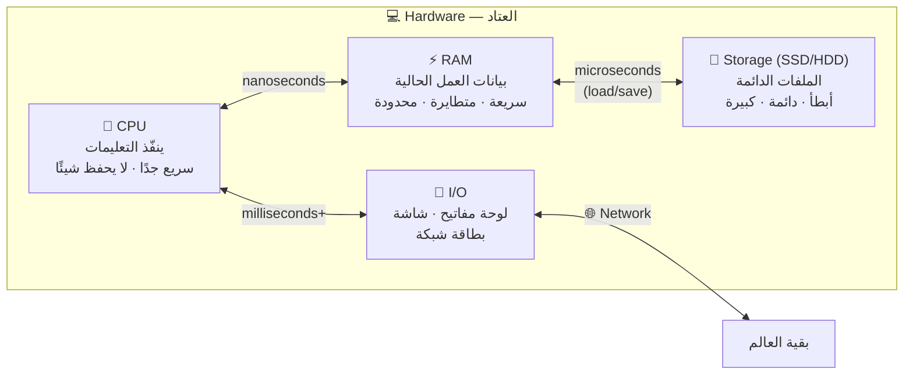
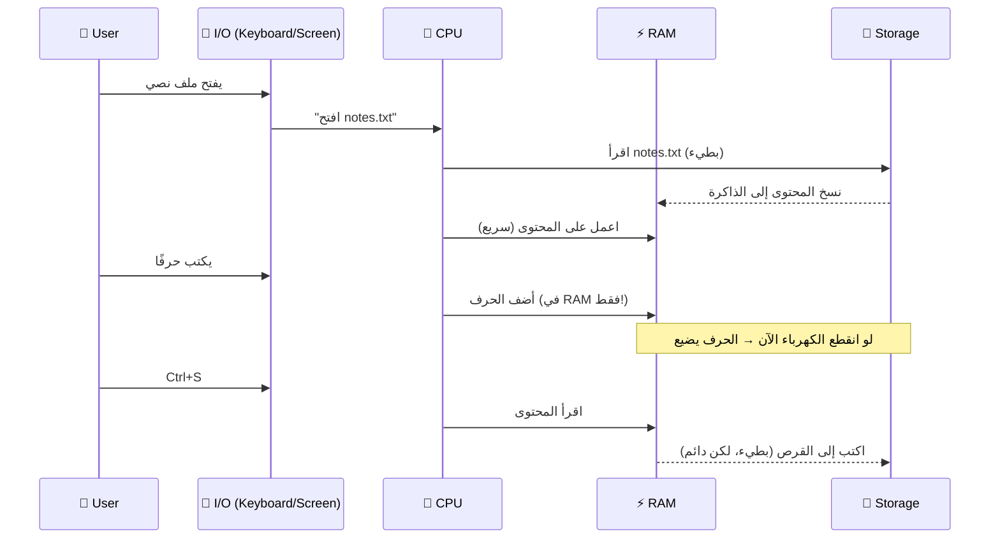

# Module 0.1 — ما هو الحاسوب؟ العتاد مقابل البرمجيات
## What is a Computer? Hardware vs Software

> **المستوى:** Level 0 — Absolute Foundations
> **الموقع:** أنت في [2 من 8] في هذا المستوى
> **السابق:** [Module 0 — How Everything Fits Together](module-00-how-everything-fits-together.md) | **التالي:** [Module 0.2 — Programs and Code](module-02-programs-and-code.md)

---

## 1. المتطلبات (Prerequisites)

> **قبل أن تتعلم هذا، يجب أن تفهم:**
- [ ] الخريطة السباعية (Human → … → Application) — من [Module 0](module-00-how-everything-fits-together.md)

---

## 2. أهداف التعلّم (Learning Objectives)

بعد هذه الوحدة ستستطيع:

- تعريف الحاسوب تعريفًا دقيقًا (ليس "جهاز له شاشة").
- التفريق بين **العتاد** (Hardware) و**البرمجيات** (Software) وشرح علاقتهما.
- تسمية المكوّنات الأربعة الأساسية (CPU, RAM, Storage, I/O) وشرح دور كل منها **بجملة واحدة**.
- شرح لماذا الفرق بين RAM و Storage **سيؤثر على كودك** لاحقًا.
- فهم أن الهاتف والخادم والسيارة الحديثة كلها "حواسيب" بنفس البنية.

---

## 3. شرح للمبتدئ (Beginner Explanation)

### ما هو الحاسوب؟

الحاسوب **آلة تنفّذ تعليمات على بيانات**.

هذا كل شيء. كل ما تراه — الألعاب، المتصفح، Netflix، ChatGPT — في جوهره: **تعليمات** (instructions) تعمل على **بيانات** (data).

```
   بيانات   +   تعليمات   →   نتيجة
   (Data)      (Instructions)  (Result)

   7, 6     +   "اضرب"      →   42
   صورة     +   "اقلب"      →   صورة مقلوبة
   نص       +   "ابحث عن X" →   المواقع التي فيها X
```

### العتاد مقابل البرمجيات

- **العتاد** (**Hardware**): كل ما يمكنك **لمسه**. المعالج، الذاكرة، القرص، الشاشة، لوحة المفاتيح.
- **البرمجيات** (**Software**): **التعليمات** التي تخبر العتاد ماذا يفعل. لا يمكنك لمسها. هي معلومات.

تشبيه: العتاد هو **المطبخ** (فرن، ثلاجة، أدوات). البرمجيات هي **الوصفة**. نفس المطبخ ينتج ألف طبق مختلف حسب الوصفة. ونفس الوصفة تُنفَّذ في مطابخ مختلفة.

> **المفتاح:** العتاد **عام الغرض** (general-purpose). لا يعرف شيئًا عن "متصفح" أو "لعبة". البرمجيات هي التي تعطيه الغرض.

### المكوّنات الأربعة

افتح أي حاسوب — محمول، هاتف، خادم ضخم — ستجد نفس الأدوار الأربعة:

#### 1. المعالج — CPU (Central Processing Unit)

**الدور:** ينفّذ التعليمات. واحدة تلو الأخرى، بسرعة مذهلة (مليارات في الثانية).

**تشبيه:** الطبّاخ. يقرأ خطوة من الوصفة، ينفّذها، يقرأ التالية. سريع جدًا لكنه **لا يفكر** — يفعل بالضبط ما تقوله الوصفة، حتى لو كانت خاطئة.

**لماذا يهمك:** عندما يكون برنامجك بطيئًا لأنه "يحسب كثيرًا"، فالمعالج هو العنق الزجاجي. (سنسميه لاحقًا **CPU-bound**.)

#### 2. الذاكرة العشوائية — RAM (Random Access Memory)

**الدور:** مكان **مؤقت وسريع جدًا** تعيش فيه البيانات والتعليمات **أثناء** عمل البرنامج.

**تشبيه:** **سطح الطاولة** في المطبخ. تضع عليه المكوّنات التي تعمل بها الآن. سريع الوصول، لكن مساحته محدودة، وعندما تنتهي (أو ينقطع الكهرباء) يُمسح كل شيء.

**خاصيتان حاسمتان:**
- **سريعة:** الوصول لأي خانة يستغرق نانوثوانٍ (أجزاء من مليار من الثانية).
- **متطايرة** (**Volatile**): تفقد محتواها عند انقطاع الكهرباء.

**لماذا يهمك:** كل متغير تكتبه في كودك يعيش هنا. عندما يقول لك أحدهم "البرنامج يستهلك ذاكرة كثيرة" أو "memory leak"، يقصد هذه.

#### 3. التخزين — Storage (Disk / SSD)

**الدور:** مكان **دائم وأبطأ** تبقى فيه الملفات حتى بعد إطفاء الجهاز.

**تشبيه:** **الثلاجة والخزانة**. تحفظ المكوّنات لأيام. لكن الوصول إليها أبطأ من سطح الطاولة: يجب أن تقوم، تفتح الباب، تبحث.

**خاصيتان:**
- **دائمة** (**Persistent**): تبقى بعد الإطفاء.
- **أبطأ بكثير** من RAM: الوصول يستغرق ميكروثوانٍ إلى ميلي‌ثوانٍ — أي **أبطأ بـ 1,000 إلى 100,000 مرة** من RAM.

**لماذا يهمك:** قراءة ملف أو الكتابة في قاعدة بيانات = لمس التخزين = بطيء نسبيًا. هذا سبب وجود الـ **cache** (سنتعلمه في Level 5) وسبب أن قواعد البيانات تستخدم **indexes** (Level 3).

#### 4. الإدخال/الإخراج — I/O (Input / Output)

**الدور:** كل ما يُدخل بيانات إلى الحاسوب أو يُخرجها منه: لوحة مفاتيح، فأرة، شاشة، **بطاقة الشبكة** (Network card)، منافذ USB.

**تشبيه:** باب المطبخ والنافذة. من هنا تدخل المكوّنات ويخرج الطعام.

**لماذا يهمك:** **الشبكة I/O**. كل طلب HTTP، كل استعلام لقاعدة بيانات على خادم آخر = I/O = **أبطأ من كل ما سبق** (ميلي‌ثوانٍ إلى ثوانٍ). عندما يقال "البرنامج ينتظر I/O" أو **I/O-bound**، هذا هو المقصود. وهذا هو السبب العميق لوجود **البرمجة غير المتزامنة** (asynchronous programming) التي ستتعلمها في Level 1.

### جدول السرعات (احفظ النسب لا الأرقام)

| المكوّن | زمن الوصول التقريبي | لو كانت دورة CPU = ثانية واحدة |
|---|---|---|
| CPU (تعليمة واحدة) | ~0.3 ns | 1 ثانية |
| RAM | ~100 ns | ~5 دقائق |
| SSD | ~100 µs | ~4 أيام |
| HDD (قرص دوّار) | ~10 ms | ~1 سنة |
| شبكة (نفس المدينة) | ~1 ms | ~1 شهر |
| شبكة (قارة أخرى) | ~150 ms | ~15 سنة |

> **هذا الجدول هو أحد أهم ما ستتعلمه في الكورس كله.** سيعود في: الذاكرة (L2)، الـ event loop (L2)، الـ indexes (L3)، الـ caching (L5)، الأداء (L7). كل قرار أداء تقريبًا هو محاولة لتجنّب الصفوف السفلية.

---

## 4. النموذج الذهني (Mental Model)

```
         ┌────────────────────────────────────────┐
         │              HARDWARE                   │
         │   (عام الغرض، لا يعرف ماذا يفعل)         │
         │                                        │
         │   CPU ←→ RAM ←→ Storage ←→ I/O         │
         │                                        │
         └────────────────┬───────────────────────┘
                          │ تُشغَّل عليه
         ┌────────────────┴───────────────────────┐
         │              SOFTWARE                   │
         │   (التعليمات التي تعطي العتاد غرضًا)      │
         │                                        │
         │   OS → Runtime → Applications          │
         └────────────────────────────────────────┘
```

**القاعدة الذهنية:** كلما ابتعدت البيانات عن المعالج، **أصبح الوصول إليها أبطأ وأكثر سعة وأكثر دوامًا**.

```
   قريب من CPU                                      بعيد عن CPU
   ◄──────────────────────────────────────────────────────────►
   سريع جدًا          سريع          بطيء          بطيء جدًا
   صغير جدًا          متوسط         كبير          لا نهائي
   متطاير            متطاير        دائم          دائم (على جهاز آخر)

   Registers/Cache    RAM           Storage       Network
```

---

## 5. الرسم التوضيحي (Visual Diagram)

### بنية الحاسوب (مبسّطة)



### دورة حياة بيانات برنامج بسيط



> **لاحظ:** "الحفظ" (save) هو حرفيًا **نقل من RAM إلى Storage**. لهذا يضيع عملك غير المحفوظ عند انقطاع الكهرباء.

---

## 6. مثال بسيط (Simple Example)

افتح **مدير المهام** (Task Manager على Windows، Activity Monitor على macOS، أو الأمر `top` على Linux). ستجد أعمدة:

- **CPU %**: كم من وقت المعالج يستهلكه كل برنامج.
- **Memory**: كم من RAM يستخدمه كل برنامج.
- **Disk**: كم يقرأ/يكتب على التخزين.
- **Network**: كم يرسل/يستقبل.

هذه هي المكوّنات الأربعة **تراها حيّة**. افتح متصفحك بـ 20 تبويبًا وشاهد Memory يرتفع. شغّل تحميل ملف وشاهد Network.

---

## 7. مثال كود (Code Example)

> **لماذا هذا الكود الآن؟** لن نشرح JavaScript بعد. الهدف فقط أن ترى أن **كودك يمكنه سؤال الحاسوب عن عتاده**. شغّله إن كان Node.js مثبتًا، أو اقرأه فقط.

```javascript
// hardware-info.js
// تشغيل: node hardware-info.js
const os = require("node:os");

console.log("CPU cores:", os.cpus().length);           // كم "طبّاخًا" في المعالج
console.log("CPU model:", os.cpus()[0].model);

const totalGB = (os.totalmem() / 1024 ** 3).toFixed(1);
const freeGB  = (os.freemem()  / 1024 ** 3).toFixed(1);
console.log(`RAM: ${freeGB} GB free of ${totalGB} GB`); // سطح الطاولة

console.log("OS:", os.type(), os.release());            // نظام التشغيل
console.log("Uptime (hours):", (os.uptime() / 3600).toFixed(1));
```

مخرجات محتملة:
```
CPU cores: 8
CPU model: Apple M1
RAM: 3.2 GB free of 16.0 GB
OS: Darwin 23.1.0
Uptime (hours): 52.3
```

**ماذا تلاحظ؟**
- `os.cpus().length` = 8 يعني أن المعالج فيه **8 أنوية** (cores) — 8 طبّاخين يمكنهم العمل معًا. هذا أساس **التوازي** (Parallelism) في Level 2.
- `freemem` أقل بكثير من `totalmem`: برامج أخرى تستخدم الذاكرة الآن.

### مثال ثانٍ: لمس RAM مقابل لمس Storage

```javascript
// ram-vs-disk.js
const fs = require("node:fs");

// 1) عمل في RAM فقط: نبني مصفوفة بمليون رقم
console.time("RAM: build 1M numbers");
const numbers = [];
for (let i = 0; i < 1_000_000; i++) numbers.push(i);
console.timeEnd("RAM: build 1M numbers");

// 2) عمل يلمس Storage: نكتب نفس البيانات إلى ملف ثم نقرأها
console.time("Disk: write + read 1M numbers");
fs.writeFileSync("numbers.txt", numbers.join("\n"));
const back = fs.readFileSync("numbers.txt", "utf8");
console.timeEnd("Disk: write + read 1M numbers");

fs.unlinkSync("numbers.txt"); // تنظيف
```

مخرجات نموذجية:
```
RAM: build 1M numbers: 12.4ms
Disk: write + read 1M numbers: 48.9ms
```

> الفرق هنا صغير لأن SSD الحديث سريع والملف صغير. لكن القاعدة ثابتة: **لمس التخزين أبطأ من لمس الذاكرة**، والفجوة تتسع مع كبر البيانات وكثرة العمليات. في Level 3 ستفهم لماذا قاعدة بيانات بلا index "تلمس التخزين" مليون مرة.

---

## 8. مثال من العالم الحقيقي (Real-World Example)

### لماذا يصبح هاتفك بطيئًا عندما تفتح تطبيقات كثيرة؟

1. كل تطبيق مفتوح يحجز جزءًا من **RAM**.
2. عندما تمتلئ RAM، نظام التشغيل يبدأ **نقل** بيانات التطبيقات غير النشطة إلى **Storage** (يسمى هذا swap أو paging).
3. عندما تعود لتطبيق، يجب إعادة تحميله من Storage إلى RAM — **أبطأ آلاف المرات**.
4. النتيجة: "التطبيق يعيد التحميل" أو يتجمّد لثانية.

نفس الشيء يحدث على **الخادم**: إذا استهلك برنامجك RAM أكثر مما هو متاح، يبدأ النظام بالـ swap ويصبح كل شيء بطيئًا جدًا — أو يقتل نظام التشغيل العملية (ستراها كـ `OOM Killed` — Out Of Memory — في Level 5 مع Docker).

---

## 9. مثال من الإنتاج (Production Example)

### "الخادم بطيء" — تشخيص بالمكوّنات الأربعة

فريق يشغّل API على خادم. المستخدمون يشتكون من البطء. المهندس يفتح أدوات المراقبة ويسأل **أي مكوّن مشبع؟**

| المكوّن | المقياس | القراءة | التفسير | الحل المحتمل |
|---|---|---|---|---|
| **CPU** | CPU utilization | 95% | الكود يحسب كثيرًا (ربما حلقة غير فعّالة أو تشفير ثقيل) | حسّن الخوارزمية (L3) أو أضف أنوية/خوادم |
| **RAM** | Memory used | 98% + swap نشط | memory leak أو بيانات أكبر من الذاكرة | أصلح الـ leak (L2) أو زد الذاكرة |
| **Storage** | Disk I/O wait | عالٍ | قاعدة بيانات تقرأ من القرص كثيرًا (لا index؟) | أضف index (L3) أو cache (L5) |
| **Network I/O** | Latency to DB | 150ms | قاعدة البيانات في منطقة جغرافية بعيدة | انقل DB قريبًا من الخادم |

> **الدرس:** "بطيء" له **أربعة أسباب جذرية محتملة على الأقل** على مستوى العتاد وحده. المهندس يقيس أولًا، ثم يصلح. المبرمج يخمّن.

هذه الفكرة ستصبح منهجية كاملة في Level 7 (Performance Engineering): **"What is the bottleneck?"**

---

## 10. مفاهيم خاطئة شائعة (Common Misconceptions)

| ❌ المفهوم الخاطئ | ✅ الحقيقة |
|---|---|
| "الذاكرة" تعني مساحة التخزين (مثل "هاتفي ذاكرته 128GB") | في الهندسة، **Memory = RAM** (مؤقتة). **Storage** = القرص (دائم). الخلط بينهما مصدر ارتباك دائم. 128GB هي storage. |
| "معالج أسرع = كل شيء أسرع" | فقط إذا كان البرنامج CPU-bound. معظم تطبيقات الويب **I/O-bound** (تنتظر الشبكة والقرص). معالج أسرع لن يسرّع الانتظار. |
| "RAM أكثر = أسرع دائمًا" | فقط إذا كانت RAM الحالية ممتلئة. RAM فارغة إضافية لا تضيف سرعة. |
| "الخادم (server) نوع خاص من الأجهزة" | الخادم حاسوب عادي بنفس المكوّنات الأربعة، فقط بمواصفات أعلى غالبًا وبدون شاشة. الهاتف أيضًا حاسوب كامل. |
| "البرمجيات شيء منفصل تمامًا عن العتاد" | البرمجيات **تعيش في العتاد**: على القرص كملفات، وفي RAM أثناء التشغيل، وفي CPU أثناء التنفيذ. |

---

## 11. أخطاء شائعة (Common Mistakes)

1. **تحميل ملف كامل في الذاكرة** دون التفكير في حجمه. ملف 10GB على خادم بـ 4GB RAM = انهيار. (الحل: streams — Level 1/2.)
2. **عدم التمييز بين "بطيء بسبب الحساب" و"بطيء بسبب الانتظار"**، فتحاول تحسين الكود بينما المشكلة في الشبكة.
3. **الافتراض أن جهاز التطوير = جهاز الإنتاج.** حاسوبك بـ 32GB RAM، الخادم بـ 1GB. يعمل عندك، ينهار هناك.
4. **تجاهل استهلاك الذاكرة لأن "الذاكرة رخيصة".** على خادم يخدم 10,000 مستخدم، كل ميغابايت لكل مستخدم = 10GB.

---

## 12. تمرين تصحيح (Debugging Exercise)

### السيناريو

برنامج يقرأ ملفًا كبيرًا ويعدّ سطوره. على جهازك يعمل في ثانيتين. على الخادم يستغرق 3 دقائق ثم ينهار برسالة:

```
FATAL ERROR: Reached heap limit Allocation failed - JavaScript heap out of memory
```

### الكود

```javascript
const fs = require("node:fs");
const content = fs.readFileSync("huge-log.txt", "utf8"); // ملف 6GB
const lines = content.split("\n");
console.log("Lines:", lines.length);
```

### الأسئلة

1. أي مكوّن من الأربعة هو المشكلة؟ ما الدليل في الرسالة؟
2. لماذا يعمل على جهازك ولا يعمل على الخادم؟ (فكّر في الفرق بين الجهازين.)
3. بدون كتابة كود: ما **الفكرة** التي تحل المشكلة؟ (تلميح: هل تحتاج الملف **كله** في الذاكرة لتعدّ سطوره؟)

<details>
<summary>💡 الحل</summary>

1. **RAM.** الدليل: `heap out of memory`. الـ heap جزء من RAM مخصص للبرنامج (ستفهمه في L2). `readFileSync` يحمّل الملف **كاملًا** (6GB) في RAM، ثم `split` ينشئ **نسخة ثانية** كمصفوفة سطور. أي ~12GB+.
2. جهازك فيه ربما 16–32GB RAM. الخادم ربما 2–4GB. **البيئة مختلفة.** هذا هو السبب الأول وراء "يعمل على جهازي".
3. **لا تحتاج الملف كله.** اقرأه **قطعة قطعة** (chunk by chunk) وعدّ `\n` في كل قطعة، ثم ارمِ القطعة. استهلاك الذاكرة يصبح ثابتًا (حجم القطعة) بغض النظر عن حجم الملف. هذا اسمه **streaming**. الكود:

```javascript
const fs = require("node:fs");
const readline = require("node:readline");

let count = 0;
const rl = readline.createInterface({ input: fs.createReadStream("huge-log.txt") });
rl.on("line", () => count++);
rl.on("close", () => console.log("Lines:", count));
```

**المنهجية التي استخدمناها:**
- **Observe:** ينهار على الخادم فقط، برسالة out of memory.
- **Evidence:** الرسالة تذكر heap/memory → مكوّن RAM.
- **Hypothesis:** الملف أكبر من RAM المتاحة على الخادم.
- **Experiment:** شغّل بملف صغير على الخادم → يعمل؟ إذًا الحجم هو السبب.
- **Conclusion:** غيّر الطريقة لتكون مستقلة عن حجم الملف.

</details>

---

## 13. تمرين معماري (Architecture Exercise)

### السيناريو

تصمّم نظامًا لمتجر إلكتروني. البيانات التالية موجودة. **قرّر لكل منها: أين يجب أن تعيش — RAM أم Storage أم كلاهما — ولماذا؟**

| البيانات | RAM؟ | Storage؟ | السبب |
|---|---|---|---|
| قائمة الطلبات التي أُنجزت العام الماضي (10M طلب) | | | |
| سلة التسوق الحالية لمستخدم يتصفح الآن | | | |
| أكثر 100 منتج مبيعًا (تُعرض على الصفحة الرئيسية لكل زائر) | | | |
| كلمات المرور (مشفّرة) للمستخدمين | | | |
| عدد الزوار المتصلين الآن | | | |

<details>
<summary>💡 إجابة نموذجية</summary>

| البيانات | RAM | Storage | السبب |
|---|---|---|---|
| طلبات العام الماضي | ❌ | ✅ | ضخمة، نادرًا تُقرأ، يجب أن تبقى للأبد. قاعدة بيانات. |
| سلة التسوق الحالية | ✅ (أساسي) | ✅ (نسخة) | تُقرأ وتُعدَّل كثيرًا وبسرعة → RAM. لكن إن أعاد الخادم التشغيل تضيع → احفظها أيضًا. (هذا تمهيد لمفهوم **cache + persistence**.) |
| أكثر 100 منتج | ✅ | ✅ | تُقرأ آلاف المرات في الدقيقة، تتغير نادرًا. احسبها من Storage مرة واحدة واحتفظ بها في RAM. **هذا هو الـ cache بالضبط.** |
| كلمات المرور | ❌ | ✅ | يجب ألّا تضيع أبدًا، وتُقرأ فقط عند تسجيل الدخول. (ولا تبقِها في RAM أكثر من اللازم لأسباب أمنية.) |
| عدد الزوار الآن | ✅ | ❌ | قيمة لحظية، لا قيمة لها بعد ثانية، لا بأس إن ضاعت عند إعادة التشغيل. |

**الدرس:** قرار "أين تعيش البيانات" هو أحد أقدم القرارات المعمارية وأهمها. معاييره: **كم تُقرأ؟ كم تُكتب؟ كم حجمها؟ هل يُقبل أن تضيع؟**

</details>

---

## 14. الصلة بعصر الذكاء الاصطناعي (AI-Era Relevance)

AI يكتب كودًا **لا يرى العتاد**. سيكتب لك بسعادة:

```javascript
const allUsers = await db.query("SELECT * FROM users"); // 50M صف
const active = allUsers.filter(u => u.active);
```

هذا يعمل في الاختبار (100 مستخدم) وينهار في الإنتاج (50M مستخدم = RAM ممتلئة).

**ما تتحقق منه في كود AI على مستوى العتاد:**
- هل يحمّل بيانات **بحجم غير محدود** في الذاكرة؟ (ملفات، نتائج استعلامات، ردود API)
- هل يفعل عملًا ثقيلًا على CPU في مكان يجب أن يبقى سريعًا؟
- هل يلمس التخزين/الشبكة داخل حلقة (loop)؟ (كل تكرار = انتظار بطيء)

**سؤال تسأله لـ AI بدل "هل هذا صحيح؟":**
> "ما استهلاك الذاكرة لهذا الكود إذا كانت النتيجة مليون صف؟ وأين يلمس القرص أو الشبكة؟"

---

## 15. ما يجب إتقانه (Must Master) 🔴

- التعريف: الحاسوب = آلة تنفّذ تعليمات على بيانات.
- Hardware (ملموس، عام الغرض) vs Software (تعليمات تعطي الغرض).
- الأدوار الأربعة: **CPU** (ينفّذ)، **RAM** (مؤقت سريع)، **Storage** (دائم أبطأ)، **I/O** (الداخل والخارج، ومنه الشبكة).
- **Memory ≠ Storage.** في الهندسة، Memory = RAM.
- القاعدة: الأبعد عن CPU = أبطأ + أكبر + أدوم.

## 16. ما يجب فهمه (Should Understand) 🟠

- نسب السرعات (RAM أسرع من SSD بآلاف المرات، والشبكة أبطأ من الجميع).
- CPU-bound vs I/O-bound كفكرة أولية.
- "الحفظ" = نقل من RAM إلى Storage.
- أن الهاتف والخادم والحاسوب المحمول لها نفس البنية.

## 17. ما يمكن تأجيله (Can Defer) ⚪

- Cache levels (L1/L2/L3)، registers — Level 2 بشكل مفاهيمي.
- كيف يعمل SSD داخليًا، أنواع RAM.
- Virtual memory, paging — Level 2 بشكل مفاهيمي.

---

## 18. الخلاصة (Summary)

1. الحاسوب **آلة تنفّذ تعليمات على بيانات**. كل شيء آخر تفاصيل.
2. **Hardware** = القطع. **Software** = التعليمات. العتاد عام الغرض، البرمجيات تعطيه الغرض.
3. أربعة أدوار في كل حاسوب: **CPU, RAM, Storage, I/O**.
4. **RAM** مؤقتة وسريعة. **Storage** دائم وأبطأ. في الهندسة "Memory" تعني RAM.
5. **كلما ابتعدت عن CPU، أصبح الوصول أبطأ.** الشبكة هي الأبطأ. هذا يفسّر: cache, index, async, streams.
6. "بطيء" له أسباب على مستوى كل مكوّن. **قِس قبل أن تصلح.**
7. البيئة (جهازك vs الخادم) تختلف في العتاد. "يعمل على جهازي" ليس دليلًا.

---

## 19. مراجع رسمية (Official References)

- **Node.js `os` module:** https://nodejs.org/api/os.html
- **Node.js `fs` module (streams):** https://nodejs.org/api/fs.html#filehandlecreatereadstreamoptions
- **"Latency Numbers Every Programmer Should Know" (Jeff Dean / Peter Norvig):** https://colin-scott.github.io/personal_website/research/interactive_latency.html — تصوّر تفاعلي لجدول السرعات.
- **Khan Academy — Computer hardware:** https://www.khanacademy.org/computing/computers-and-internet/xcae6f4a7ff015e7d:computers

---

## المصطلحات في هذه الوحدة (Terminology)

| العربية | English |
|---|---|
| عتاد | Hardware |
| برمجيات | Software |
| تعليمات | Instructions |
| بيانات | Data |
| المعالج | CPU (Central Processing Unit) |
| نواة (في المعالج) | Core |
| الذاكرة العشوائية | RAM (Random Access Memory) |
| متطاير | Volatile |
| دائم | Persistent |
| التخزين | Storage (Disk / SSD / HDD) |
| الإدخال/الإخراج | I/O (Input / Output) |
| بطاقة الشبكة | Network card / NIC |
| مقيَّد بالمعالج | CPU-bound |
| مقيَّد بالإدخال/الإخراج | I/O-bound |
| عنق الزجاجة | Bottleneck |
| تدفّق (قراءة قطعة قطعة) | Streaming |
| نفاد الذاكرة | Out of Memory (OOM) |

---

> **التالي:** [Module 0.2 — Programs, Source Code, Machine Code, Compilers, Interpreters, Runtimes](module-02-programs-and-code.md) — الآن وقد عرفنا الآلة، كيف نكلّمها؟
