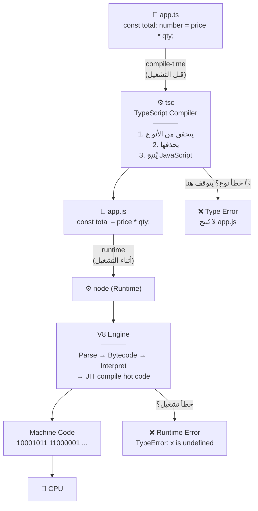
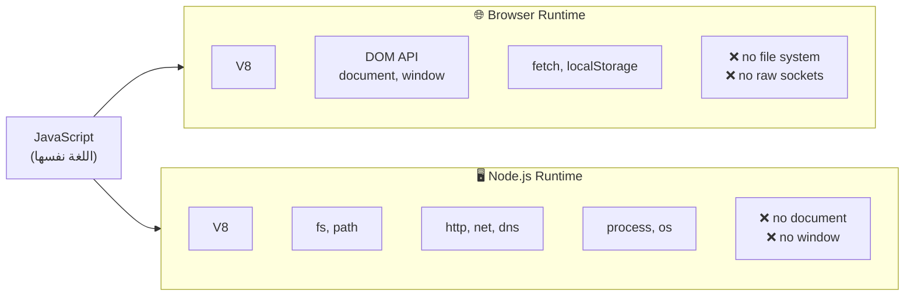

# Module 0.2 — البرامج، الكود المصدري، كود الآلة، المترجمات، المفسّرات، بيئات التشغيل
## Programs, Source Code, Machine Code, Compilers, Interpreters, Runtimes

> **المستوى:** Level 0 — Absolute Foundations
> **الموقع:** أنت في [3 من 8] في هذا المستوى
> **السابق:** [Module 0.1 — What is a Computer?](module-01-what-is-a-computer.md) | **التالي:** [Module 0.3 — Running a Program](module-03-running-a-program.md)

---

## 1. المتطلبات (Prerequisites)

> **قبل أن تتعلم هذا، يجب أن تفهم:**
- [ ] الحاسوب = آلة تنفّذ تعليمات على بيانات — [Module 0.1](module-01-what-is-a-computer.md)
- [ ] CPU ينفّذ التعليمات، RAM تحفظها مؤقتًا، Storage يحفظها دائمًا — [Module 0.1](module-01-what-is-a-computer.md)
- [ ] أن بين كودك والآلة "وسيطًا" — [Module 0](module-00-how-everything-fits-together.md)

---

## 2. أهداف التعلّم (Learning Objectives)

بعد هذه الوحدة ستستطيع:

- تعريف **البرنامج** (Program) و**الكود المصدري** (Source Code) و**كود الآلة** (Machine Code).
- شرح لماذا لا ينفّذ المعالج الكود المصدري مباشرة.
- التفريق بين **المترجم** (Compiler) و**المفسّر** (Interpreter) و**JIT**، ومعرفة أي منها يستخدم JavaScript/TypeScript/Python/C.
- تعريف **بيئة التشغيل** (Runtime) وشرح ما يفعله Node.js فعلًا.
- فهم ما يحدث عند كتابة `tsc` ثم `node`.

---

## 3. شرح للمبتدئ (Beginner Explanation)

### ما هو البرنامج؟

**البرنامج** (**Program**) هو **مجموعة تعليمات محفوظة** تخبر الحاسوب ماذا يفعل.

لاحظ كلمة "محفوظة": البرنامج **ملف** (أو ملفات) على التخزين. عندما لا يعمل، هو مجرد بيانات نائمة على القرص مثل أي صورة أو مستند. (ماذا يحدث عندما "يستيقظ"؟ هذا موضوع Module 0.3.)

### المشكلة: المعالج يفهم لغة واحدة فقط

في Module 0.1 قلنا إن المعالج ينفّذ تعليمات. لكن **أي** تعليمات؟

المعالج مصمَّم ليفهم مجموعة محددة جدًا من التعليمات البسيطة، مشفّرة كأرقام ثنائية. هذه هي **كود الآلة** (**Machine Code**). مثلًا، في معالجات Intel/AMD، التسلسل `10001011 11000001` يعني تقريبًا "انسخ محتوى الخانة A إلى الخانة B".

**لا أحد يكتب هكذا.** إنه مستحيل عمليًا لأي برنامج أكبر من بضعة أسطر.

### الحل: الكود المصدري + وسيط

نكتب بلغة يفهمها البشر — **لغة برمجة** (**Programming Language**) مثل JavaScript أو Python أو C. النص الذي نكتبه هو **الكود المصدري** (**Source Code**).

```javascript
// Source code — يقرؤه الإنسان
const total = price * quantity;
```

ثم نستخدم **برنامجًا وسيطًا** يحوّل الكود المصدري إلى شيء يستطيع المعالج تنفيذه. هناك **طريقتان** رئيسيتان:

### الطريقة 1: المترجم (Compiler)

**المترجم** (**Compiler**) يأخذ **كل** الكود المصدري، يحلله، ويُنتج **ملفًا جديدًا** يحتوي على كود آلة. هذا الملف الجديد يسمى **ملفًا تنفيذيًا** (**Executable**). بعدها، لا تحتاج المترجم ولا الكود المصدري لتشغيله.

```
source.c  ──[ compiler (gcc) ]──▶  program.exe  ──[ CPU ينفّذه مباشرة ]──▶  نتيجة
   (مرة واحدة، قبل التشغيل)              (كل مرة تشغّله)
```

**تشبيه:** ترجمة كتاب. المترجم يعمل أسابيع، ويسلّمك كتابًا مترجمًا. بعدها يقرأه أي شخص بدون المترجم.

**لغات تستخدم هذا:** C, C++, Rust, Go.

**المزايا:** سريع جدًا عند التشغيل (المعالج ينفّذ مباشرة). تُكتشف أخطاء كثيرة **قبل** التشغيل.
**العيوب:** خطوة إضافية قبل كل تجربة. الملف التنفيذي مرتبط بنوع معالج ونظام تشغيل محدد.

### الطريقة 2: المفسّر (Interpreter)

**المفسّر** (**Interpreter**) برنامج **يقرأ الكود المصدري أثناء التشغيل**، سطرًا سطرًا (تقريبًا)، وينفّذ كل سطر فورًا. لا يُنتج ملفًا تنفيذيًا.

```
source.py  ──[ interpreter (python) يقرأ وينفّذ مباشرة ]──▶  نتيجة
              (كل مرة تشغّله، المفسّر يجب أن يكون موجودًا)
```

**تشبيه:** مترجم فوري في مؤتمر. يترجم كل جملة لحظة سماعها. لا يوجد "كتاب مترجم" بعد المؤتمر.

**لغات تستخدم هذا (تقليديًا):** Python, Ruby, PHP, JavaScript (في بداياته).

**المزايا:** تجربة فورية. نفس الكود يعمل على أي جهاز عليه المفسّر.
**العيوب:** أبطأ (الترجمة تحدث في كل تشغيل). بعض الأخطاء لا تُكتشف حتى يصل التنفيذ إلى ذلك السطر.

### الطريقة 3 (الواقع الحديث): JIT — الجمع بين الاثنين

**JIT** (**Just-In-Time compilation**) = المفسّر يبدأ التنفيذ فورًا، لكنه **يراقب**: الأجزاء التي تتكرر كثيرًا (مثل حلقة تعمل مليون مرة) **يترجمها إلى كود آلة أثناء التشغيل** ويستخدم النسخة السريعة.

هذا ما يفعله **V8** — محرك JavaScript داخل Chrome و Node.js. لهذا JavaScript الحديثة سريعة بشكل مفاجئ.

```
source.js ──▶ [ V8: يفسّر فورًا ]──▶ نتيجة
                    │
                    └─ "هذه الدالة استُدعيت 10,000 مرة"
                       ──▶ ترجمها إلى machine code ──▶ استخدم النسخة السريعة
```

> **لا تحتاج تفاصيل JIT.** يكفي أن تعرف: JavaScript ليست "بطيئة لأنها مفسَّرة" — V8 يترجم الأجزاء الساخنة.

### ما هي بيئة التشغيل؟ (Runtime)

هنا يأتي مفهوم كثيرًا ما يُفهم خطأً.

**بيئة التشغيل** (**Runtime** أو **Runtime Environment**) = **كل ما يحتاجه برنامجك ليعمل، غير كودك أنت**:

1. **المحرك** الذي ينفّذ اللغة (V8 لـ JavaScript).
2. **المكتبات القياسية** (standard library): دوال جاهزة لقراءة الملفات، فتح اتصال شبكة، التعامل مع الوقت.
3. **إدارة الذاكرة**: حجز وتحرير الذاكرة تلقائيًا (garbage collection).
4. **الجسر إلى نظام التشغيل**: عندما يكتب كودك `fs.readFile`, بيئة التشغيل هي من يطلب من OS قراءة الملف فعلًا.

```
┌─────────────────────────────────────────────┐
│  Your code (app.js)                         │  ← ما تكتبه أنت
├─────────────────────────────────────────────┤
│  Runtime: Node.js                           │
│  ┌──────────┐ ┌───────────┐ ┌────────────┐  │
│  │ V8 engine│ │ std lib   │ │ event loop │  │  ← ما يوفّره لك
│  │ (يفهم JS)│ │ fs, http..│ │ libuv      │  │
│  └──────────┘ └───────────┘ └────────────┘  │
├─────────────────────────────────────────────┤
│  Operating System (Linux / macOS / Windows) │
├─────────────────────────────────────────────┤
│  Hardware (CPU / RAM / Disk / Network)      │
└─────────────────────────────────────────────┘
```

**مثال مهم:** JavaScript **اللغة** لا تعرف شيئًا عن الملفات أو الشبكة. **بيئة التشغيل** هي التي تضيف ذلك:
- في **المتصفح** (runtime)، JavaScript تحصل على `document`, `fetch`, `localStorage`.
- في **Node.js** (runtime)، JavaScript تحصل على `fs`, `http`, `process`.
- نفس اللغة، بيئتان مختلفتان، قدرات مختلفة.

### أين تقع TypeScript؟

**TypeScript** لغة فوق JavaScript تضيف **الأنواع** (types). لكن **لا يوجد محرك ينفّذ TypeScript مباشرة**. لذلك:

```
app.ts  ──[ tsc (TypeScript compiler) ]──▶  app.js  ──[ node (runtime) ]──▶  نتيجة
         1) يتحقق من الأنواع                         2) V8 يفسّر/يترجم JIT
         2) يحذف الأنواع ويُنتج JS
```

`tsc` هو **مترجم** بالمعنى التقني (يحوّل من لغة إلى أخرى)، لكنه لا يُنتج كود آلة — يُنتج JavaScript. هذا النوع يسمى **transpiler** (ترجمة من لغة عالية إلى لغة عالية أخرى). ثم Node.js يتولى الباقي.

> **الخلاصة العملية:** عندما ترى خطأ TypeScript، فهو **قبل التشغيل** (compile-time). عندما ترى خطأ في Node، فهو **أثناء التشغيل** (runtime). هذا الفرق سيوفر عليك ساعات في Level 1.

---

## 4. النموذج الذهني (Mental Model)

```
                    ┌──────────────────────┐
                    │     SOURCE CODE      │  نص يقرؤه البشر
                    │  (what you write)    │  .ts .js .py .c
                    └──────────┬───────────┘
                               │
              ┌────────────────┼────────────────┐
              ▼                ▼                ▼
       ┌────────────┐   ┌────────────┐   ┌────────────┐
       │  COMPILER  │   │INTERPRETER │   │    JIT     │
       │ ترجمة كاملة │   │ تنفيذ فوري  │   │  الاثنان   │
       │ قبل التشغيل │   │ سطرًا سطرًا  │   │            │
       └─────┬──────┘   └─────┬──────┘   └─────┬──────┘
             │                │                │
             ▼                ▼                ▼
       ┌────────────┐   ┌────────────┐   ┌────────────┐
       │ EXECUTABLE │   │  (لا ملف)  │   │  (لا ملف)  │
       │ machine    │   │  ينفّذ     │   │ ينفّذ + يترجم│
       │ code file  │   │  مباشرة    │   │ الأجزاء الحارة│
       └─────┬──────┘   └─────┬──────┘   └─────┬──────┘
             │                │                │
             └────────────────┼────────────────┘
                              ▼
                    ┌──────────────────────┐
                    │      CPU EXECUTES    │
                    │     MACHINE CODE     │
                    └──────────────────────┘

       C, Rust, Go       Python, Ruby       JavaScript (V8),
                         (classic)          Java (JVM), C# (.NET)
```

**القاعدة الذهنية:** **كل** كود ينتهي كود آلة. الفرق فقط: **متى** تحدث الترجمة (قبل التشغيل، أثناءه، أو مزيج) و**من** يفعلها.

---

## 5. الرسم التوضيحي (Visual Diagram)

### رحلة ملف TypeScript حتى المعالج



### المتصفح و Node.js: نفس اللغة، بيئتان



> هذا هو السبب في أن كودًا يعمل في المتصفح قد يفشل في Node والعكس: **اللغة واحدة، بيئة التشغيل مختلفة.**

---

## 6. مثال بسيط (Simple Example)

**تجربة ذهنية:** عندك وصفة طبخ بالفرنسية ولا تقرأ الفرنسية.

- **Compiler:** تعطي الوصفة لمترجم، يترجمها كاملة إلى العربية، يسلّمك ورقة. تطبخ من الورقة العربية. المرة القادمة لا تحتاجه.
- **Interpreter:** صديق يقرأ الفرنسية يقف بجانبك ويترجم كل خطوة لحظة وصولك إليها. كل مرة تطبخ، يجب أن يكون موجودًا.
- **JIT:** الصديق يترجم شفهيًا، لكنه يلاحظ أنك تكرر "اخفق البيض" 20 مرة، فيكتبها لك على ورقة لتقرأها أنت مباشرة.
- **Runtime:** المطبخ نفسه + الأدوات + الصديق + الكهرباء. الوصفة وحدها لا تطبخ شيئًا.

---

## 7. مثال كود (Code Example)

### مثال 1: نفس الخطأ، لحظتان مختلفتان

> **لماذا هذا مهم:** فهم "متى يُكتشف الخطأ" هو أول مهارة debugging.

**TypeScript — يُكتشف قبل التشغيل:**
```typescript
// price.ts
function calculateTotal(price: number, quantity: number): number {
  return price * quantity;
}

calculateTotal("20", 2);
//             ~~~~
// ❌ Compile-time error (من tsc، قبل أن يعمل أي شيء):
// Argument of type 'string' is not assignable to parameter of type 'number'.
```

**JavaScript — يُكتشف أثناء التشغيل (أو لا يُكتشف أبدًا!):**
```javascript
// price.js
function calculateTotal(price, quantity) {
  return price * quantity;
}

console.log(calculateTotal("20", 2));   // 40  ← JavaScript حوّل "20" إلى 20 بصمت
console.log(calculateTotal("abc", 2));  // NaN ← لا خطأ! فقط نتيجة غير منطقية
console.log(calculateTotal(undefined, 2).toFixed(2));
// ❌ Runtime error (من V8، أثناء التشغيل):
// TypeError: Cannot read properties of NaN... (أو مشابه)
```

> **الدرس:** المترجم (compiler) يكتشف فئة من الأخطاء **قبل** أن تصل للمستخدم. هذا أحد أهم أسباب استخدامنا TypeScript في هذا الكورس.

### مثال 2: ما الذي يفعله `tsc` فعلًا؟

```bash
# ملف المدخل
cat hello.ts
```
```typescript
const greet = (name: string): string => `Hello, ${name}!`;
console.log(greet("World"));
```
```bash
# ترجمة
npx tsc hello.ts

# الناتج: hello.js — لاحظ: الأنواع اختفت
cat hello.js
```
```javascript
const greet = (name) => `Hello, ${name}!`;
console.log(greet("World"));
```
```bash
# التشغيل بـ Node (runtime)
node hello.js
# Hello, World!
```

**ماذا تعلّمنا؟** TypeScript **لا يوجد أثناء التشغيل**. الأنواع تُحذف. لذلك لا يمكن لـ TypeScript حمايتك من بيانات خاطئة تأتي **من خارج برنامجك** (من المستخدم، من API، من ملف) — لأنها تصل أثناء التشغيل، بعد أن اختفت الأنواع. (هذا سبب وجود **input validation** — Level 5.)

### مثال 3: نفس الفكرة بلغة مترجمة (C) — للمقارنة فقط

> **لماذا C هنا؟** لترى ملفًا تنفيذيًا حقيقيًا يُنتَج. لن نستخدم C في الكورس بعد هذا إلا لتوضيح الذاكرة في Level 2.

```c
// hello.c
#include <stdio.h>
int main(void) {
    printf("Hello, World!\n");
    return 0;
}
```
```bash
gcc hello.c -o hello     # compile → ملف تنفيذي اسمه hello (machine code)
ls -la hello             # ملف ثنائي، ~16KB
./hello                  # CPU ينفّذه مباشرة، لا حاجة لـ gcc الآن
# Hello, World!

file hello
# hello: ELF 64-bit LSB executable, x86-64 ...  ← مرتبط بمعالج x86-64 ونظام Linux
```

لو نسخت `hello` إلى جهاز بمعالج ARM (مثل Mac M1) **لن يعمل** — كود آلة مختلف. أما `hello.js` فيعمل على أي جهاز عليه Node. هذه إحدى المقايضات الأساسية.

---

## 8. مثال من العالم الحقيقي (Real-World Example)

### لماذا تحتاج "تثبيت Node.js" لتشغيل مشروع JavaScript، بينما لعبة تحمّلها تعمل مباشرة؟

- **اللعبة** مكتوبة بـ C++ و**مترجمة** إلى ملف تنفيذي. كود الآلة موجود داخلها. تحتاج فقط نظام التشغيل الصحيح.
- **مشروع JavaScript** كود مصدري. يحتاج **بيئة تشغيل** (Node.js) موجودة على الجهاز لتفسيره. لهذا كل مشروع يقول "requires Node >= 18".

### لماذا يظهر الموقع بشكل مختلف قليلًا في متصفحات مختلفة؟

لأن كل متصفح **بيئة تشغيل مختلفة** لـ JavaScript و HTML و CSS: Chrome (V8)، Firefox (SpiderMonkey)، Safari (JavaScriptCore). اللغة واحدة، التنفيذ يختلف في التفاصيل.

---

## 9. مثال من الإنتاج (Production Example)

### الحادثة: "يعمل على جهازي، ينهار في الإنتاج" — بسبب بيئة التشغيل

فريق ينشر API مكتوبًا بـ TypeScript. على أجهزة المطورين Node 20. على الخادم Node 16 (لم يحدّثه أحد منذ سنتين).

الكود يستخدم:
```typescript
const result = data.findLast(item => item.active); // Array.prototype.findLast
```

- على Node 20: يعمل.
- على Node 16: `TypeError: data.findLast is not a function` — لأن `findLast` أُضيفت إلى V8 لاحقًا.
- TypeScript لم يحذّر، لأن إعداداته تقول "الهدف ES2023" الذي يملك `findLast`.

**التشخيص الهندسي:**
- **Observe:** يعمل محليًا، ينهار في الإنتاج، الخطأ `is not a function` على دالة قياسية.
- **Hypothesis:** اختلاف **بيئة التشغيل** (إصدار Node).
- **Experiment:** `node --version` على الخادم → 16.x.
- **Fix:** تثبيت الإصدار في ملف `.nvmrc` و`engines` في `package.json`، وتوحيده عبر Docker (Level 5).

> **الدرس:** الكود المصدري **لا يكفي** لتعريف البرنامج. **بيئة التشغيل جزء من البرنامج**. تثبيت إصداراتها جزء من الهندسة الاحترافية.

---

## 10. مفاهيم خاطئة شائعة (Common Misconceptions)

| ❌ المفهوم الخاطئ | ✅ الحقيقة |
|---|---|
| "JavaScript لغة مفسَّرة وبالتالي بطيئة" | V8 يستخدم JIT: الأجزاء الساخنة تُترجم إلى كود آلة. JavaScript الحديثة سريعة جدًا لمعظم الاستخدامات. |
| "TypeScript يحميني من البيانات الخاطئة أثناء التشغيل" | TypeScript **يختفي** بعد الترجمة. بيانات المستخدم/API تصل أثناء التشغيل بدون حماية. تحتاج validation. |
| "Node.js لغة برمجة" | Node.js **بيئة تشغيل** لـ JavaScript خارج المتصفح. اللغة هي JavaScript. |
| "الـ compiler يجعل الكود صحيحًا" | يكتشف فئة محددة من الأخطاء (أنواع، صياغة). لا يكتشف أخطاء المنطق: `price + quantity` بدل `price * quantity` يمر بنجاح. |
| "الملف التنفيذي يعمل على أي جهاز" | مرتبط بنوع المعالج (x86 vs ARM) ونظام التشغيل. لهذا تجد تنزيلات منفصلة لـ Windows/Mac/Linux، وIntel/Apple Silicon. |
| "البرنامج = الكود" | البرنامج = الكود **+** بيئة التشغيل **+** الإعدادات **+** الاعتماديات. (ستتعمق هذه الفكرة مع Docker في Level 5.) |

---

## 11. أخطاء شائعة (Common Mistakes)

1. **تجاهل أخطاء TypeScript بـ `any` أو `// @ts-ignore`** لأنها "تزعج". أنت تطفئ نظام الإنذار بدل إطفاء الحريق.
2. **عدم تثبيت إصدار Node** في المشروع (`.nvmrc`, `engines`). كل جهاز يشغّل إصدارًا مختلفًا.
3. **الخلط بين خطأ compile-time وخطأ runtime** عند طلب المساعدة: "الكود لا يعمل" — هل لم يُترجم أصلًا؟ أم ترجم وانهار عند التشغيل؟ هذان عالمان مختلفان.
4. **استخدام API من بيئة في بيئة أخرى**: `window.localStorage` في Node، أو `fs.readFile` في المتصفح.
5. **الاعتقاد أن `tsc` بلا أخطاء = البرنامج صحيح.** الأنواع تمنع فئة من الأخطاء، لا كلها.

---

## 12. تمرين تصحيح (Debugging Exercise)

### السيناريو

زميلك يرسل لك هذه الرسالة: *"الكود لا يعمل. ساعدني."* مع ملفين:

**`utils.ts`:**
```typescript
export function formatPrice(amount: number): string {
  return `$${amount.toFixed(2)}`;
}
```

**`main.ts`:**
```typescript
import { formatPrice } from "./utils";

const input = process.argv[2];           // ما يكتبه المستخدم في الطرفية
console.log(formatPrice(input));
```

وهذا ما يحدث:
```bash
$ npx tsc main.ts
main.ts:4:25 - error TS2345: Argument of type 'string | undefined' is not assignable to parameter of type 'number'.
```

### الأسئلة

1. هل هذا خطأ **compile-time** أم **runtime**؟ ما الدليل؟
2. ما الذي يحاول المترجم أن يقوله بالعربية البسيطة؟
3. لو تجاهل زميلك الخطأ (بـ `as any`) وشغّل `node main.js 15`، ماذا سيحدث؟ ولو شغّل `node main.js` بدون رقم؟
4. ما الإصلاح الصحيح؟

<details>
<summary>💡 الحل</summary>

1. **Compile-time.** الدليل: الرسالة من `tsc`، تبدأ بـ `error TS…`، ولم يُنتَج `main.js` أصلًا. لم يعمل أي سطر من البرنامج.

2. المترجم يقول: *"`process.argv[2]` قد يكون نصًا (string) أو لا شيء (undefined) — لأن المستخدم قد لا يكتب شيئًا. لكن `formatPrice` تطلب رقمًا (number). لا أستطيع ضمان أن هذا سينجح."* — وهو **محق تمامًا**.

3. مع `as any`:
   - `node main.js 15` → `input = "15"` (نص!) → `"15".toFixed(2)` → **Runtime error:** `TypeError: amount.toFixed is not a function`. (النصوص ليس لها `toFixed`.)
   - `node main.js` → `input = undefined` → **Runtime error:** `TypeError: Cannot read properties of undefined (reading 'toFixed')`.

   المترجم كان يحاول إنقاذك من **كلا** الخطأين.

4. الإصلاح الصحيح — **تحويل وتحقق** عند حدود البرنامج (حيث تدخل البيانات من الخارج):
```typescript
import { formatPrice } from "./utils";

const raw = process.argv[2];
if (raw === undefined) {
  console.error("Usage: node main.js <amount>");
  process.exit(1);
}

const amount = Number(raw);
if (Number.isNaN(amount)) {
  console.error(`"${raw}" is not a valid number`);
  process.exit(1);
}

console.log(formatPrice(amount)); // الآن amount من نوع number فعلًا
```

**الدرس المركزي:** الأنواع تحمي **داخل** برنامجك. عند **الحدود** (مدخلات المستخدم، الملفات، الشبكة) أنت مسؤول عن التحقق. هذه الفكرة ستصبح **Trust Boundary** في Level 5 (Security).

</details>

---

## 13. تمرين معماري (Architecture Exercise)

### السيناريو

تبني أداة سطر أوامر (CLI) ستوزّعها على 1,000 مستخدم غير تقنيين (محاسبين). لديك خياران:

- **خيار A:** تكتبها بـ TypeScript/Node.js.
- **خيار B:** تكتبها بـ Go (لغة مترجمة تُنتج ملفًا تنفيذيًا واحدًا).

**أجب بصيغة:** Assumption / Constraint / Tradeoff / Recommendation.

<details>
<summary>💡 إجابة نموذجية</summary>

- **Assumption:** المستخدمون لا يعرفون ما هو Node.js ولن يثبّتوه.
- **Constraint:** يجب أن تعمل الأداة على Windows و macOS.
- **Tradeoff A (Node):** تطوير أسرع لك (تعرف اللغة)، لكن كل مستخدم يحتاج تثبيت بيئة التشغيل بالإصدار الصحيح → دعم فني كبير. (يوجد حل وسط: أدوات مثل `pkg` تحزم Node داخل ملف تنفيذي، بحجم ~50MB.)
- **Tradeoff B (Go):** ملف تنفيذي واحد لكل نظام، لا تثبيت، حجم صغير. لكن تحتاج تعلّم لغة جديدة، وتترجم نسخة لكل (OS × CPU).
- **Recommendation based on context:** لمستخدمين غير تقنيين بأعداد كبيرة، **الملف التنفيذي المستقل** يقلل الاحتكاك جذريًا → B، أو A مع تحزيم. لو كان المستخدمون مطورين، A بلا تردد.

**الدرس:** "compiler vs interpreter" ليس سؤالًا أكاديميًا. إنه قرار **توزيع** (distribution) يؤثر على تجربة المستخدم.

</details>

---

## 14. الصلة بعصر الذكاء الاصطناعي (AI-Era Relevance)

### AI وأخطاء "البيئة"

AI يكتب كودًا بناءً على **ما رآه في التدريب**، لا على بيئتك. أخطاء نمطية:

- يستخدم API حديثًا (`Array.prototype.toSorted`) وأنت على Node 18 → runtime error.
- يستخدم API مهجورًا (`new Buffer()`) → تحذيرات أو ثغرات.
- يخلط بين بيئة المتصفح و Node (`fetch` كان غير موجود في Node < 18).
- يكتب TypeScript يمرّ بـ `any` في كل مكان، فيبدو "آمنًا" وهو ليس كذلك.

### ما تتحقق منه

```
□ هل كل API مستخدم موجود في إصدار بيئة التشغيل عندي؟  (node --version)
□ هل يمر tsc بدون any/ts-ignore مضافة؟
□ هل يتحقق من البيانات عند الحدود، أم يثق بالأنواع فقط؟
□ هل يفترض بيئة متصفح أم Node؟ هل هذا صحيح لمكان التشغيل؟
```

### سؤال جيد لـ AI

> "هذا الكود سيعمل على Node 18.17 وTypeScript 5.3 بـ strict mode. هل كل API مستخدم متاح في هذه الإصدارات؟ أين يصل input من الخارج ولا يُتحقق منه؟"

---

## 15. ما يجب إتقانه (Must Master) 🔴

- البرنامج = تعليمات محفوظة (ملف). الكود المصدري = ما يكتبه الإنسان. كود الآلة = ما ينفّذه المعالج.
- **Compile-time vs Runtime**: متى يُكتشف الخطأ، ومن يبلّغ عنه.
- **Runtime = المحرك + المكتبات + إدارة الذاكرة + الجسر إلى OS.** Node.js بيئة تشغيل وليست لغة.
- TypeScript **يختفي** بعد الترجمة؛ لا يحمي من بيانات الخارج.

## 16. ما يجب فهمه (Should Understand) 🟠

- Compiler (ترجمة كاملة مسبقة) vs Interpreter (تنفيذ فوري) وأمثلة اللغات.
- JIT كمزيج، وأن V8 يستخدمه.
- نفس اللغة في بيئتين مختلفتين (browser vs Node) تملك قدرات مختلفة.
- الملف التنفيذي مرتبط بالمعالج ونظام التشغيل.

## 17. ما يمكن تأجيله (Can Defer) ⚪

- كيف يعمل JIT داخليًا (inline caching, deoptimization).
- مراحل المترجم (lexing, parsing, AST, optimization) — بناء المترجمات تخصص منفصل.
- Bytecode، WebAssembly.

---

## 18. الخلاصة (Summary)

1. **البرنامج** تعليمات محفوظة. **الكود المصدري** للبشر. **كود الآلة** للمعالج. بينهما وسيط.
2. **Compiler** يترجم كل شيء مسبقًا ويُنتج ملفًا تنفيذيًا. **Interpreter** ينفّذ فورًا. **JIT** يجمعهما (V8).
3. **Runtime** = كل ما يحتاجه كودك ليعمل غير كودك. **Node.js بيئة تشغيل، JavaScript لغة.**
4. نفس اللغة في بيئتين = قدرات مختلفة (`fs` في Node، `document` في المتصفح).
5. **TypeScript → tsc → JavaScript → node.** الأنواع تُحذف. أخطاء الأنواع compile-time، أخطاء التنفيذ runtime.
6. المترجم يمنع فئة من الأخطاء، لا كلها. **تحقق من البيانات عند الحدود.**
7. **بيئة التشغيل جزء من البرنامج.** ثبّت إصدارها.

---

## 19. مراجع رسمية (Official References)

- **TypeScript Handbook — "TypeScript for JavaScript Programmers":** https://www.typescriptlang.org/docs/handbook/typescript-in-5-minutes.html
- **TypeScript — tsc CLI:** https://www.typescriptlang.org/docs/handbook/compiler-options.html
- **Node.js — "Differences between Node.js and the Browser":** https://nodejs.org/en/learn/getting-started/differences-between-nodejs-and-the-browser
- **V8 — "How V8 works" (blog, official):** https://v8.dev/blog
- **MDN — JavaScript engine & runtime concepts:** https://developer.mozilla.org/en-US/docs/Web/JavaScript/Event_loop (اقرأ فقط المقدمة الآن)

---

## المصطلحات في هذه الوحدة (Terminology)

| العربية | English |
|---|---|
| برنامج | Program |
| كود مصدري | Source Code |
| كود آلة | Machine Code |
| لغة برمجة | Programming Language |
| مترجم | Compiler |
| مفسّر | Interpreter |
| ترجمة في الوقت المناسب | JIT (Just-In-Time) compilation |
| محوّل بين لغات عالية | Transpiler |
| ملف تنفيذي | Executable |
| بيئة التشغيل | Runtime (Environment) |
| محرك (اللغة) | Engine (e.g., V8) |
| المكتبة القياسية | Standard Library |
| وقت الترجمة | Compile-time |
| وقت التشغيل | Runtime (as a moment) |
| خطأ نوع | Type Error |
| حدود البرنامج (حيث تدخل البيانات) | Boundary |
| التحقق من المدخلات | Input Validation |

---

> **التالي:** [Module 0.3 — What Happens When I Run a Program? OS, Process, Memory](module-03-running-a-program.md) — الملف على القرص نائم. ماذا يحدث لحظة الضغط على "تشغيل"؟
