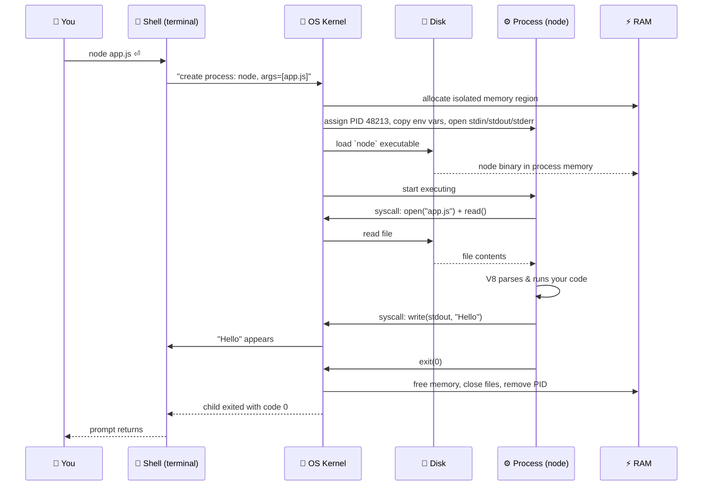
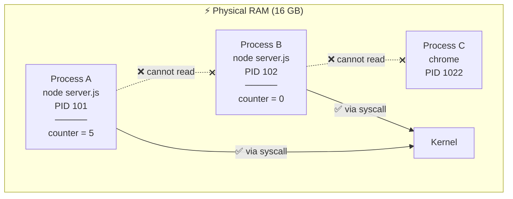

# Module 0.3 — ماذا يحدث عندما أشغّل برنامجًا؟ نظام التشغيل، العملية، الذاكرة
## What Happens When I Run a Program? OS, Process, Memory

> **المستوى:** Level 0 — Absolute Foundations
> **الموقع:** أنت في [4 من 8] في هذا المستوى
> **السابق:** [Module 0.2 — Programs and Code](module-02-programs-and-code.md) | **التالي:** [Module 0.4 — Files, Terminal, Shell](module-04-files-terminal-shell.md)

---

## 1. المتطلبات (Prerequisites)

> **قبل أن تتعلم هذا، يجب أن تفهم:**
- [ ] CPU ينفّذ، RAM مؤقتة سريعة، Storage دائم أبطأ — [Module 0.1](module-01-what-is-a-computer.md)
- [ ] البرنامج = ملف تعليمات على التخزين؛ بيئة التشغيل تنفّذه — [Module 0.2](module-02-programs-and-code.md)

---

## 2. أهداف التعلّم (Learning Objectives)

بعد هذه الوحدة ستستطيع:

- شرح ما يفعله **نظام التشغيل** (OS) ولماذا لا نستطيع العيش بدونه.
- التفريق بدقة بين **البرنامج** (Program) و**العملية** (Process): *"البرنامج كود. العملية نسخة تعمل."*
- وصف **الخطوات** التي تحدث من لحظة كتابة `node app.js` حتى ظهور المخرجات.
- شرح لماذا كل عملية لها **ذاكرتها الخاصة**، وماذا يعني ذلك عمليًا.
- فهم معنى **رقم العملية** (PID)، و**رمز الخروج** (exit code)، و**الملف** (file) بشكل أولي.

---

## 3. شرح للمبتدئ (Beginner Explanation)

### المشهد قبل التشغيل

عندك ملف `app.js` على القرص. هو **برنامج**: تعليمات نائمة. لا يفعل شيئًا. مثل وصفة في درج.

تكتب في الطرفية:
```bash
node app.js
```

وتضغط Enter. ما الذي يحدث فعلًا؟ لنمشِ خطوة خطوة، لكن أولًا نحتاج أن نعرف **من** ينفّذ هذه الخطوات.

### من هو المدير؟ نظام التشغيل

تخيّل حاسوبك **مبنى مكاتب**. المعالج هو الكهرباء، الذاكرة هي المكاتب والطاولات، القرص هو الأرشيف في القبو.

الآن، عشرات البرامج تريد العمل في نفس الوقت: المتصفح، Spotify، محرر الكود، برنامجك. لو تُرك كل برنامج ليفعل ما يشاء:
- برنامج يحتل كل الطاولات ولا يترك لغيره.
- برنامج يكتب فوق أوراق برنامج آخر.
- برنامج يحتكر الكهرباء.
- برنامج يقرأ أرشيفًا سريًا لا يحق له.

لذلك يوجد **مدير المبنى**: **نظام التشغيل** (**Operating System — OS**). Linux, macOS, Windows, Android, iOS كلها أنظمة تشغيل.

**مهام نظام التشغيل الأساسية:**

| المهمة | بالعربية | ماذا تعني عمليًا |
|---|---|---|
| **Process management** | إدارة العمليات | يقرر أي برنامج يأخذ المعالج الآن، ولكم من الوقت، ويبدّل بينها بسرعة (آلاف المرات في الثانية) حتى تبدو كلها تعمل معًا |
| **Memory management** | إدارة الذاكرة | يعطي كل برنامج منطقة ذاكرة **معزولة**، ويمنعه من لمس ذاكرة غيره |
| **File system** | نظام الملفات | ينظّم القرص إلى ملفات ومجلدات، ويوفّر طريقة موحدة لقراءتها وكتابتها |
| **Permissions** | الصلاحيات | يحدد من يستطيع قراءة/كتابة/تنفيذ ماذا |
| **Networking** | الشبكات | يدير بطاقة الشبكة ويوزّع البيانات الواردة على البرامج الصحيحة |
| **Devices** | الأجهزة | يتعامل مع لوحة المفاتيح، الشاشة، USB… ويعطي البرامج واجهة موحدة |

**القاعدة الذهبية:** **برنامجك لا يلمس العتاد مباشرة أبدًا.** يطلب من نظام التشغيل، ونظام التشغيل ينفّذ. هذا الطلب يسمى **استدعاء نظام** (**System Call** أو **syscall**). عندما يكتب كودك `fs.readFile(...)`, بيئة التشغيل (Node) تُجري syscall، ونظام التشغيل يقرأ القرص فعلًا.

```
Your code:     fs.readFile("data.txt")
                     ↓
Runtime (Node):  "يا نظام التشغيل، اقرأ لي هذا الملف"   ← syscall: open(), read()
                     ↓
OS:              يتحقق من الصلاحيات → يجد الملف على القرص → ينسخه إلى ذاكرة عمليتك
                     ↓
Your code:     يستلم المحتوى
```

### البرنامج مقابل العملية — أهم تمييز في هذه الوحدة

- **البرنامج** (**Program**): ملف على القرص. ساكن. **كود.**
- **العملية** (**Process**): **نسخة تعمل** من البرنامج، في الذاكرة، لها موارد خاصة. **كود + حالة + موارد.**

```
Program (الوصفة في الدرج)        Process (الطبخ الجاري في المطبخ)
──────────────────────────       ───────────────────────────────────
ملف على Storage                  موجود في RAM
ساكن، لا يفعل شيئًا              ينفّذ تعليمات الآن
نسخة واحدة                       يمكن تشغيل عدة نسخ من نفس البرنامج
لا رقم تعريف                     له رقم تعريف فريد (PID)
لا ذاكرة                         له ذاكرة خاصة معزولة
لا يبدأ ولا ينتهي                له دورة حياة: يبدأ → يعمل → ينتهي
```

**أمثلة:**
- `chrome.exe` على القرص = برنامج. **كل تبويب** مفتوح في Chrome = عملية منفصلة (لهذا انهيار تبويب لا يُسقط الباقي).
- `node` على القرص = برنامج. `node app.js` و`node worker.js` في نفس الوقت = **عمليتان** من نفس البرنامج.

### ماذا يحدث عند `node app.js` — خطوة خطوة

1. **الطرفية (Shell)** تقرأ ما كتبته وتطلب من نظام التشغيل: "شغّل البرنامج `node` ومرّر له `app.js` كمعامل."
2. **نظام التشغيل ينشئ عملية جديدة:**
   - يعطيها **رقم تعريف** فريدًا: **PID** (Process ID)، مثلًا `48213`.
   - يحجز لها **منطقة ذاكرة معزولة** في RAM.
   - ينسخ إليها **متغيرات البيئة** (environment variables — سنفصّلها في Module 0.4).
   - يفتح لها ثلاث قنوات افتراضية: **stdin** (مدخل)، **stdout** (مخرج)، **stderr** (مخرج الأخطاء) — موصولة بطرفيتك.
3. **يحمّل** الملف التنفيذي `node` من القرص إلى ذاكرة العملية.
4. **يسلّم المعالج** للعملية: "ابدأ التنفيذ من هنا."
5. **Node (بيئة التشغيل) يبدأ:** يقرأ `app.js` من القرص (syscall)، V8 يحلّله، يبدأ التنفيذ.
6. **كودك يعمل.** كل `console.log` = Node يطلب من OS الكتابة في stdout = يظهر في طرفيتك.
7. **ينتهي كودك.** Node يخبر OS: "انتهيت، رمز الخروج `0`."
8. **نظام التشغيل ينظّف:** يحرّر الذاكرة، يغلق الملفات المفتوحة، يحذف العملية. الـ PID يصبح متاحًا لعملية أخرى.

### ذاكرة العملية — لماذا معزولة؟

كل عملية ترى **ذاكرتها الخاصة** ولا تستطيع رؤية ذاكرة العمليات الأخرى. نظام التشغيل يفرض هذا بمساعدة المعالج.

**لماذا هذا مهم جدًا؟**
- **الأمان:** برنامج خبيث لا يستطيع قراءة كلمة المرور من ذاكرة متصفحك.
- **الاستقرار:** لو انهار برنامجك (bug)، لا يُفسد ذاكرة غيره. ينهار وحده.
- **البساطة:** كودك يتصرف كأنه وحده على الجهاز.

**النتيجة العملية التي ستواجهها كثيرًا:**
> متغير في عملية A **لا يمكن** قراءته من عملية B. إذا شغّلت خادمك مرتين (عمليتان)، فكل واحدة لها نسختها من `let counter = 0`. لتشارك البيانات بين عمليات، تحتاج **وسيطًا خارجيًا**: ملف، قاعدة بيانات، شبكة. (هذا سبب عميق لوجود Redis والـ databases — Level 5.)

### رمز الخروج (Exit Code)

عندما تنتهي العملية، تترك رقمًا واحدًا لنظام التشغيل: **رمز الخروج** (**Exit Code**).
- `0` = نجاح.
- أي رقم آخر (1–255) = فشل، والرقم يشير لنوعه.

هذا الرقم هو الطريقة **الوحيدة** الموحدة التي يعرف بها برنامج آخر (مثل CI/CD في Level 5) هل نجحت عمليتك. `process.exit(1)` في Node = "انتهيت بفشل".

### ما هو الملف؟ (نظرة أولى)

**الملف** (**File**) هو **تسلسل من البايتات** على التخزين، له **اسم** و**مسار**. نظام التشغيل لا يفهم "صورة" أو "مستند" — يرى بايتات فقط. **البرامج** هي التي تفسّر البايتات (ملف `.png` يفهمه عارض الصور، `.js` تفهمه Node). سنتعمق في Module 0.4.

---

## 4. النموذج الذهني (Mental Model)

### النموذج 1: OS = الوسيط الإلزامي

```
┌───────────────────────────────────────────────────────────────┐
│  USER SPACE (حيث تعيش برامجك)                                  │
│                                                               │
│   [Process: node app.js]   [Process: chrome]   [Process: code]│
│    PID 48213                PID 1022            PID 3301       │
│    ذاكرة معزولة              ذاكرة معزولة         ذاكرة معزولة    │
│         │                       │                   │          │
│         └──── syscalls ─────────┼───────────────────┘          │
│                                 ▼                              │
├───────────────────────────────────────────────────────────────┤
│  KERNEL SPACE (نواة نظام التشغيل)                              │
│   Process scheduler · Memory manager · File system             │
│   Network stack · Device drivers · Permissions                 │
├───────────────────────────────────────────────────────────────┤
│  HARDWARE: CPU · RAM · Disk · Network card                     │
└───────────────────────────────────────────────────────────────┘
```

> **الخط بين User Space و Kernel Space هو أهم خط في النظام.** لا يُعبَر إلا عبر syscalls. كل I/O (ملفات، شبكة) يعبره. وهذا العبور **له تكلفة** — سبب آخر لبطء I/O.

### النموذج 2: دورة حياة العملية

```
   Program on disk
         │
         │  "run" (OS creates process)
         ▼
   ┌───────────┐
   │  CREATED  │  PID assigned, memory allocated, env copied
   └─────┬─────┘
         ▼
   ┌───────────┐      ┌───────────┐
   │  RUNNING  │◄────►│  WAITING  │  (ينتظر I/O: قرص، شبكة، مستخدم)
   │ (on CPU)  │      │ (blocked) │
   └─────┬─────┘      └───────────┘
         │
         │  exit() / crash / killed
         ▼
   ┌───────────┐
   │ TERMINATED│  exit code returned, resources freed
   └───────────┘
```

> لاحظ حالة **WAITING**: معظم عمليات الويب تقضي معظم وقتها هنا — تنتظر الشبكة أو قاعدة البيانات. المعالج يخدم عمليات أخرى في هذه الأثناء. (هذا أساس **التزامن** في Level 2.)

### النموذج 3: عدة عمليات من برنامج واحد

```
   node (program, on disk — نسخة واحدة)
     │
     ├──▶ Process PID 101: node server.js     memory: { port: 3000, users: [...] }
     ├──▶ Process PID 102: node server.js     memory: { port: 3001, users: [...] }  ← نسخة مستقلة تمامًا!
     └──▶ Process PID 103: node worker.js     memory: { queue: [...] }
```

---

## 5. الرسم التوضيحي (Visual Diagram)

### تسلسل `node app.js`



### الذاكرة المعزولة



> **نفس البرنامج، عمليتان، `counter` مختلف.** لمشاركة `counter` بينهما، تحتاج شيئًا خارج الاثنين (ملف، قاعدة بيانات، Redis).

---

## 6. مثال بسيط (Simple Example)

**بدون كود:**

1. افتح الآلة الحاسبة. الآن توجد **عملية** لبرنامج الآلة الحاسبة.
2. افتح الآلة الحاسبة **مرة ثانية** (على macOS: `Cmd+N` أو من terminal؛ على Windows: اضغط الأيقونة مجددًا). الآن **عمليتان** من نفس البرنامج.
3. اكتب `5 + 5` في الأولى. الثانية لم تتأثر. **ذاكرتان معزولتان.**
4. افتح Task Manager / Activity Monitor. ستجد سطرين لـ "Calculator" بـ PID مختلفين.
5. أغلق إحداهما. العملية انتهت، الذاكرة تحررت. الأخرى تعمل.

هذا هو الفرق بين **برنامج** (ملف واحد على القرص) و**عملية** (نسخ تعمل، كل واحدة بذاكرتها).

---

## 7. مثال كود (Code Example)

### مثال 1: العملية تعرّف نفسها

```javascript
// whoami.js
// تشغيل: node whoami.js
console.log("PID:", process.pid);                    // رقم هذه العملية
console.log("Parent PID:", process.ppid);            // العملية التي شغّلتني (الـ shell غالبًا)
console.log("Program:", process.argv[0]);            // مسار node
console.log("Script:", process.argv[1]);             // مسار هذا الملف
console.log("Working dir:", process.cwd());          // المجلد الذي شُغّلت منه
console.log("Node version:", process.version);
console.log("Platform:", process.platform);          // linux / darwin / win32
console.log("Memory (MB):", (process.memoryUsage().rss / 1024 / 1024).toFixed(1));
```

مخرجات محتملة:
```
PID: 48213
Parent PID: 3301
Program: /usr/local/bin/node
Script: /home/user/whoami.js
Working dir: /home/user
Node version: v20.11.0
Platform: linux
Memory (MB): 42.3
```

> `process` كائن توفره **بيئة التشغيل** (Node) ليمثّل **العملية** التي يعمل فيها كودك. (في المتصفح لا يوجد `process` — بيئة مختلفة، تذكّر Module 0.2.)

### مثال 2: الذاكرة المعزولة — شغّل هذا مرتين في طرفيتين

```javascript
// counter.js
let counter = 0;

setInterval(() => {
  counter++;
  console.log(`PID ${process.pid}: counter = ${counter}`);
}, 1000);
```

```bash
# Terminal 1
node counter.js
# PID 5001: counter = 1
# PID 5001: counter = 2
# PID 5001: counter = 3

# Terminal 2 (في نفس الوقت)
node counter.js
# PID 5002: counter = 1    ← بدأ من صفر! لا يرى counter الأول
# PID 5002: counter = 2
```

> هذا هو **أول bug معماري** ستواجهه عندما تشغّل خادمك على أكثر من نسخة: "لماذا الـ rate limiter / الـ cache / الـ session لا يعمل؟" — لأنها في ذاكرة **عملية واحدة**. (Level 5 و 7.)

### مثال 3: رمز الخروج (Exit Code)

```javascript
// validate.js
const input = process.argv[2];

if (!input) {
  console.error("Error: no input provided");  // stderr
  process.exit(1);                            // فشل
}

console.log(`Got: ${input}`);                 // stdout
process.exit(0);                              // نجاح (الافتراضي أصلًا)
```

```bash
node validate.js hello
# Got: hello
echo $?        # يطبع رمز خروج آخر أمر
# 0

node validate.js
# Error: no input provided
echo $?
# 1
```

> `$?` في الـ shell = رمز خروج آخر عملية. أدوات CI/CD (Level 5) تعتمد عليه كليًا: `0` = الخطوة نجحت، غيره = أوقف الـ pipeline.

### مثال 4: دورة الحياة — إنشاء عملية من داخل عملية

```javascript
// parent.js
const { spawn } = require("node:child_process");

console.log(`Parent PID: ${process.pid}`);

// أنشئ عملية ابنة تشغّل node بملف آخر
const child = spawn("node", ["-e", "console.log('child PID:', process.pid); process.exit(3)"]);

child.stdout.on("data", (d) => process.stdout.write(`[child says] ${d}`));
child.on("exit", (code) => console.log(`Child exited with code ${code}`));
```

```
Parent PID: 6100
[child says] child PID: 6101
Child exited with code 3
```

> هذه هي الفكرة التي يُبنى عليها كل شيء من الـ shell إلى Docker إلى Kubernetes: **عمليات تنشئ عمليات وتراقب خروجها.**

---

## 8. مثال من العالم الحقيقي (Real-World Example)

### لماذا لا يُسقط انهيار تبويب في Chrome المتصفحَ كله؟

Chrome يشغّل **كل تبويب (وكل إضافة) في عملية منفصلة**. انهيار عملية = نظام التشغيل يحرّر ذاكرتها ويخبر العملية الأم (Chrome الرئيسي) = Chrome يعرض "Aw, Snap!" في ذلك التبويب فقط.

لو كان كل شيء في عملية واحدة، لأسقط bug في موقع واحد كل تبويباتك. **العزل** (isolation) هو ما يعطيك الاستقرار. نفس المبدأ تستخدمه الخوادم: عدة عمليات، انهيار واحدة لا يُسقط الخدمة.

### لماذا "أعد تشغيل الجهاز" يحل مشاكل كثيرة؟

لأن إعادة التشغيل **تقتل كل العمليات** وتحرّر كل الذاكرة وتبدأ من حالة نظيفة. أي عملية كانت عالقة في حالة فاسدة، أو تسرّب ذاكرة تراكمي، يختفي. (لكنه ليس حلًا هندسيًا — إنه إخفاء للأعراض. المهندس يسأل: **أي عملية** كانت المشكلة ولماذا؟)

---

## 9. مثال من الإنتاج (Production Example)

### الحادثة: "الخادم يتوقف كل بضعة أيام"

خدمة Node.js على خادم Linux. كل 3–4 أيام تتوقف. أحدهم يعيد تشغيلها يدويًا.

**التشخيص بالمفاهيم التي تعلمتها:**

| الخطوة | الفعل | النتيجة |
|---|---|---|
| Observe | `ps aux \| grep node` بعد التوقف | **لا توجد عملية.** إذًا العملية **انتهت**، لم تتجمد. |
| Evidence | سجل النظام: `dmesg \| grep -i kill` | `Out of memory: Killed process 4821 (node)` |
| Hypothesis | نظام التشغيل قتل العملية لأن ذاكرتها تجاوزت المتاح → **memory leak** تراكمي |
| Experiment | راقب `process.memoryUsage().rss` كل ساعة | يرتفع خطيًا 50MB/ساعة ولا ينزل |
| Conclusion | يوجد شيء يحتفظ بمراجع ولا يحررها (Level 2: GC & leaks) |
| Mitigation (فوري) | **process manager** (مثل `systemd` أو `pm2`) يعيد تشغيل العملية تلقائيًا عند الخروج | توقف الأعراض، لكن المشكلة باقية |
| Fix (حقيقي) | إيجاد الـ leak وإصلاحه | — |

**الدروس:**
1. "توقف" ≠ "تجمّد". **تحقق من حالة العملية أولًا.**
2. نظام التشغيل **يقتل** العمليات التي تهدد النظام. له الكلمة الأخيرة.
3. العملية **ستموت** يومًا ما (bug, OOM, نشر جديد). الهندسة الاحترافية تفترض ذلك وتصمّم له: process managers، health checks، عدة نسخ (Level 5–7).

---

## 10. مفاهيم خاطئة شائعة (Common Misconceptions)

| ❌ المفهوم الخاطئ | ✅ الحقيقة |
|---|---|
| "البرنامج والعملية نفس الشيء" | البرنامج ملف ساكن. العملية نسخة تعمل بذاكرة وPID. برنامج واحد → عمليات كثيرة. |
| "المتغيرات العامة (global) تُشارك بين كل نسخ الخادم" | كل عملية لها ذاكرتها. `global.cache` في العملية A غير مرئي للعملية B. |
| "نظام التشغيل شيء للمستخدمين، لا يهم المبرمج" | **كل** I/O يمر عبره. كل مشكلة أداء/ذاكرة/شبكة تلمسه. Docker وKubernetes هما في جوهرهما أدوات لإدارة العمليات. |
| "عندما ينتهي الكود، تنتهي العملية" | في Node، العملية تبقى حيّة ما دام هناك شيء ينتظر (timer, open server, pending promise). `setInterval` بدون `clearInterval` = عملية لا تنتهي. |
| "exit code تفصيل صغير" | هو **العقد** الوحيد بين عمليتك وبقية العالم (shell, CI, Docker). exit 0 عند الفشل = pipeline "ينجح" وينشر كودًا معطوبًا. |
| "الكود يتعامل مع القرص/الشبكة مباشرة" | أبدًا. يطلب من OS عبر syscalls. OS يتحقق من الصلاحيات وينفّذ. |

---

## 11. أخطاء شائعة (Common Mistakes)

1. **تخزين حالة مهمة في ذاكرة العملية** (sessions, counters, cache) ثم تشغيل أكثر من نسخة أو إعادة التشغيل → البيانات تختفي أو تتضارب.
2. **الخروج بـ exit code 0 عند الفشل** (مثلًا `catch (e) { console.log(e) }` بدون `process.exit(1)`) → الأتمتة تظن أن كل شيء بخير.
3. **ترك timers/connections مفتوحة** فلا تنتهي العملية ("لماذا لا يعود الـ prompt؟").
4. **افتراض أن العملية لن تموت.** لا معالجة لحالة إعادة التشغيل، لا حفظ للحالة.
5. **الكتابة في stdout بدل stderr للأخطاء** → عند توجيه المخرجات إلى ملف، تختلط الأخطاء بالنتائج.

---

## 12. تمرين تصحيح (Debugging Exercise)

### السيناريو

زميلك كتب سكربت نسخ احتياطي وربطه بـ cron (مجدول يومي). الـ cron يبلّغ "نجاح" كل يوم. بعد شهر اكتشفتم أن **لا نسخة احتياطية أُنشئت منذ 3 أسابيع**.

**`backup.js`:**
```javascript
const fs = require("node:fs");

try {
  const data = fs.readFileSync("/var/data/app.db");
  fs.writeFileSync(`/backups/app-${Date.now()}.db`, data);
  console.log("Backup done");
} catch (err) {
  console.log("Backup failed:", err.message);
}
```

### الأسئلة

1. لماذا يبلّغ cron "نجاح" بينما النسخ فشل؟ (فكّر: كيف يعرف cron أن العملية نجحت؟)
2. ما الخطأ الثاني المتعلق بـ stdout/stderr؟
3. أصلح السكربت.

<details>
<summary>💡 الحل</summary>

1. **Exit code.** عند الفشل، الـ `catch` يطبع رسالة ثم **ينتهي السكربت طبيعيًا** → exit code **`0`** → cron (وأي أتمتة) يفهم "نجاح". نظام التشغيل لا يقرأ رسائلك، يقرأ رمز الخروج فقط. (السبب الفعلي للفشل غالبًا: امتلأ قرص `/backups` أو تغيّرت الصلاحيات — لكن لم يُبلَّغ أحد.)

2. الخطأ يُطبع بـ `console.log` → **stdout**. يجب أن يذهب إلى **stderr** (`console.error`) ليُفصل عن المخرجات العادية وليُلتقط من أدوات المراقبة.

3. الإصلاح:
```javascript
const fs = require("node:fs");

try {
  const data = fs.readFileSync("/var/data/app.db");
  fs.writeFileSync(`/backups/app-${Date.now()}.db`, data);
  console.log("Backup done");
  process.exit(0);
} catch (err) {
  console.error("Backup failed:", err.message);  // stderr
  process.exit(1);                               // فشل صريح
}
```

**المنهجية:** Observe (لا نسخ رغم "نجاح") → Evidence (cron يقرأ exit code؛ السكربت يخرج بـ 0 دائمًا) → Hypothesis (الخطأ يُبتلع) → Experiment (شغّله يدويًا مع مسار خاطئ، تحقق من `$?`) → Fix.

**الدرس:** **العقد مع نظام التشغيل (exit code) أهم من الرسالة للإنسان.** في Level 5 (CI/CD) و Level 6 (Observability) ستبني على هذا.

</details>

---

## 13. تمرين معماري (Architecture Exercise)

### السيناريو

تبني خادم ويب بسيطًا يعدّ عدد الزوار ويعرضه: "أنت الزائر رقم N".

**النسخة الأولى:** `let visitors = 0;` في ذاكرة العملية، `visitors++` مع كل طلب.

الآن المدير يقول: "الحركة زادت، شغّل **4 نسخ** من الخادم خلف موزّع حمل (load balancer) يوزّع الطلبات بينها."

### الأسئلة

1. ماذا سيرى الزوار؟ لماذا؟
2. أين يجب أن يعيش `visitors` ليكون العدد صحيحًا عبر النسخ الأربع؟ اذكر 3 خيارات مع مقايضاتها.
3. ماذا يحدث للعدد عند إعادة تشغيل الخوادم في كل خيار؟

<details>
<summary>💡 إجابة نموذجية</summary>

1. **أربعة عدّادات مستقلة.** الزائر الأول يرى "1"، الثاني (يذهب لنسخة أخرى) يرى "1" أيضًا، الثالث قد يرى "2"… أرقام متضاربة وغير متزايدة. لأن كل عملية لها ذاكرتها المعزولة.

2. يجب أن يعيش **خارج العمليات الأربع**، في مكان مشترك:

| الخيار | المزايا | العيوب |
|---|---|---|
| **ملف مشترك** على القرص | بسيط | بطيء؛ 4 عمليات تكتب في نفس الملف في نفس اللحظة → تضارب (race condition — Level 5) |
| **قاعدة بيانات** (`UPDATE counters SET n = n + 1`) | دائم، آمن مع التزامن (transactions) | أبطأ من الذاكرة؛ حمل على DB لكل زيارة |
| **مخزن في الذاكرة مشترك** (Redis: `INCR visitors`) | سريع جدًا، ذرّي (atomic) | عملية إضافية يجب تشغيلها؛ قد يُفقد العدد إن سقط Redis بدون persistence |

3. **عند إعادة التشغيل:**
   - الذاكرة المحلية: يُصفّر. ❌
   - ملف/DB: يبقى. ✅
   - Redis: يبقى إن كان persistence مفعّلًا، وإلا يضيع.

**الدرس:** لحظة الانتقال من عملية واحدة إلى عدة عمليات هي **أول خطوة في الأنظمة الموزعة** (Level 7). كل حالة في ذاكرة العملية يجب أن تُسأل: "ماذا لو كانت هناك نسختان؟ ماذا لو أعيد التشغيل؟"

</details>

---

## 14. الصلة بعصر الذكاء الاصطناعي (AI-Era Relevance)

AI يكتب كودًا **يفترض عملية واحدة تعيش للأبد**:

```javascript
// نمط شائع في كود AI:
const cache = new Map();           // في ذاكرة العملية
const rateLimits = {};             // في ذاكرة العملية
let isProcessing = false;          // قفل في ذاكرة العملية
```

كلها تعمل في الاختبار (عملية واحدة) وتفشل بصمت في الإنتاج (عدة نسخ، إعادة تشغيل).

**ما تتحقق منه في كود AI على مستوى العملية:**
```
□ أي حالة (state) محفوظة في ذاكرة العملية؟ ماذا يحدث مع نسختين؟ مع إعادة تشغيل؟
□ هل exit codes صحيحة؟ هل الفشل يُبتلع في catch ويخرج بـ 0؟
□ هل الأخطاء تذهب إلى stderr؟
□ هل يترك timers/connections مفتوحة فلا تنتهي العملية؟
□ هل يتعامل مع إشارات الإيقاف (SIGTERM) بشكل لائق؟ (Level 2)
```

**سؤال جيد لـ AI:**
> "هذا الكود سيعمل كـ 3 نسخ خلف load balancer ويُعاد تشغيله عند كل نشر. أي جزء من الحالة سيتعطل؟"

---

## 15. ما يجب إتقانه (Must Master) 🔴

- **البرنامج كود على القرص. العملية نسخة تعمل في الذاكرة، لها PID وذاكرة معزولة ودورة حياة.**
- نظام التشغيل وسيط إلزامي: برنامجك لا يلمس العتاد، يطلب عبر **syscalls**.
- **كل عملية لها ذاكرتها.** مشاركة البيانات بين عمليات تحتاج وسيطًا خارجيًا.
- **Exit code:** 0 نجاح، غيره فشل. هو العقد مع الأتمتة.
- stdout للنتائج، stderr للأخطاء.

## 16. ما يجب فهمه (Should Understand) 🟠

- مهام OS الست: processes, memory, files, permissions, networking, devices.
- دورة حياة العملية: created → running ↔ waiting → terminated.
- أن العملية في Node تبقى حيّة ما دام هناك شيء ينتظر.
- أن OS قد **يقتل** عمليتك (OOM) وأن الهندسة تفترض موت العمليات.

## 17. ما يمكن تأجيله (Can Defer) ⚪

- Virtual memory, paging, page tables — Level 2 مفاهيميًا، والتفاصيل مؤجلة.
- Scheduling algorithms.
- Signals بالتفصيل (SIGTERM, SIGKILL, SIGINT) — Level 2.
- Threads — Level 2.

---

## 18. الخلاصة (Summary)

1. **نظام التشغيل** مدير المبنى: يدير العمليات والذاكرة والملفات والصلاحيات والشبكة والأجهزة. برنامجك يطلب منه عبر **syscalls**.
2. **البرنامج** ملف ساكن. **العملية** نسخة تعمل: كود + حالة + موارد + **PID**.
3. برنامج واحد → عمليات كثيرة، **كل واحدة بذاكرة معزولة**. متغير في عملية غير مرئي لأخرى.
4. `node app.js` = الـ shell يطلب من OS إنشاء عملية → OS يحجز ذاكرة ويعطي PID → يحمّل node → node يقرأ ملفك وينفّذه → ينتهي بـ **exit code** → OS ينظّف.
5. **Exit code 0 = نجاح.** هو ما تقرؤه الأتمتة، لا رسائلك.
6. العزل يعطي **أمانًا** و**استقرارًا**، لكنه يعني أن مشاركة الحالة تحتاج وسيطًا خارجيًا (ملف، DB، Redis).
7. العمليات **تموت**. صمّم على هذا الأساس.

---

## 19. مراجع رسمية (Official References)

- **Node.js `process` object:** https://nodejs.org/api/process.html
- **Node.js `process.exit()` and exit codes:** https://nodejs.org/api/process.html#exit-codes
- **Node.js `child_process`:** https://nodejs.org/api/child_process.html
- **Linux `man 7 process` / `man ps`:** متاح في أي طرفية Linux بـ `man ps`
- **The Linux Documentation Project — Processes (intro):** https://tldp.org/LDP/tlk/kernel/processes.html
- **Chromium — Multi-process Architecture:** https://www.chromium.org/developers/design-documents/multi-process-architecture/

---

## المصطلحات في هذه الوحدة (Terminology)

| العربية | English |
|---|---|
| نظام التشغيل | Operating System (OS) |
| النواة | Kernel |
| فضاء المستخدم / فضاء النواة | User Space / Kernel Space |
| استدعاء نظام | System Call (syscall) |
| عملية | Process |
| رقم العملية | PID (Process ID) |
| العملية الأم / الابنة | Parent / Child Process |
| إدارة العمليات | Process Management |
| إدارة الذاكرة | Memory Management |
| ذاكرة معزولة | Isolated Memory |
| عزل | Isolation |
| دورة حياة | Lifecycle |
| رمز الخروج | Exit Code |
| المدخل القياسي / المخرج القياسي / مخرج الأخطاء | stdin / stdout / stderr |
| متغيرات البيئة | Environment Variables |
| مدير العمليات | Process Manager (systemd, pm2) |
| نفاد الذاكرة (القتل بسببه) | OOM (Out Of Memory) Kill |
| تسرّب ذاكرة | Memory Leak |
| ملف | File |
| نظام الملفات | File System |
| صلاحيات | Permissions |

---

> **التالي:** [Module 0.4 — Files, Folders, Paths, Terminal, Shell, Environment Variables](module-04-files-terminal-shell.md) — حان وقت فتح الطرفية والعمل بيديك.
