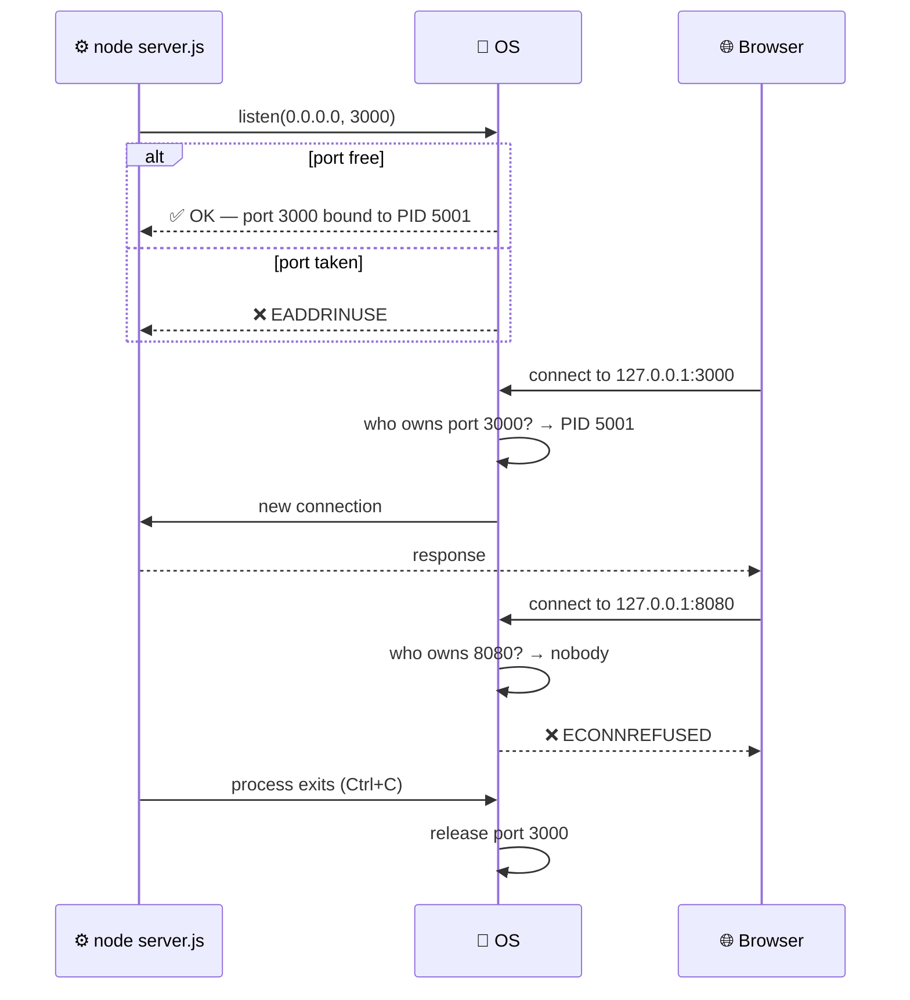
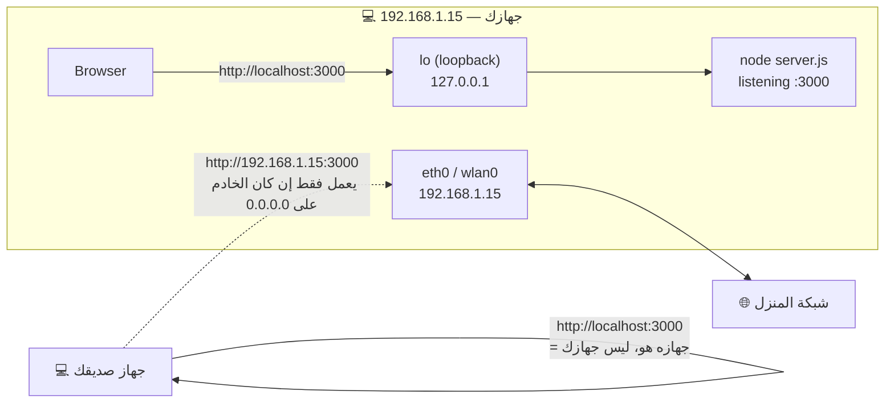

# Module 0.5 — العمليات، المنافذ، localhost، عنوان IP
## Processes, Ports, localhost, IP Address

> **المستوى:** Level 0 — Absolute Foundations
> **الموقع:** أنت في [6 من 8] في هذا المستوى
> **السابق:** [Module 0.4 — Files, Terminal, Shell](module-04-files-terminal-shell.md) | **التالي:** [Module 0.6 — Network, Client, Server, Browser](module-06-network-client-server.md)
> **⚠️ وحدة عملية:** ستشغّل أول خادم على جهازك.

---

## 1. المتطلبات (Prerequisites)

> **قبل أن تتعلم هذا، يجب أن تفهم:**
- [ ] العملية: نسخة تعمل من برنامج، لها PID، ذاكرة معزولة، وتُدار من OS — [Module 0.3](module-03-running-a-program.md)
- [ ] الطرفية، تشغيل الأوامر، متغيرات البيئة (`PORT`) — [Module 0.4](module-04-files-terminal-shell.md)
- [ ] I/O والشبكة أبطأ من الذاكرة — [Module 0.1](module-01-what-is-a-computer.md)

---

## 2. أهداف التعلّم (Learning Objectives)

بعد هذه الوحدة ستستطيع:

- شرح ما هو **عنوان IP** ولماذا يحتاجه كل جهاز على شبكة.
- شرح ما هو **المنفذ** (Port) ولماذا لا يكفي عنوان IP وحده.
- شرح معنى **localhost** و`127.0.0.1` ولماذا يعمل الخادم على جهازك بدون إنترنت.
- تشغيل خادم على port، **رؤية** العملية التي تملكه، وإيقافها.
- تشخيص خطأ `EADDRINUSE` بمنهجية (أي عملية تحتل المنفذ؟).
- فهم لماذا `0.0.0.0` مختلف عن `127.0.0.1` (وهذا ما يكسر Docker عند المبتدئين).

---

## 3. شرح للمبتدئ (Beginner Explanation)

### المشكلة: كيف تصل البيانات إلى **البرنامج الصحيح** على **الجهاز الصحيح**؟

تخيّل مدينة فيها آلاف المباني، وفي كل مبنى عشرات الشقق. لتوصيل رسالة تحتاج **عنوانين**:
1. **عنوان المبنى** → أي جهاز؟
2. **رقم الشقة** → أي برنامج داخل الجهاز؟

في الشبكات:
1. **عنوان المبنى = عنوان IP** (IP Address).
2. **رقم الشقة = المنفذ** (Port).

### عنوان IP (IP Address)

كل جهاز متصل بشبكة يحصل على **عنوان IP**: رقم فريد (داخل تلك الشبكة) يُستخدم لتوجيه البيانات إليه.

الشكل الشائع (**IPv4**): أربعة أرقام من 0–255 بينها نقاط:
```
192.168.1.15      ← جهازك في شبكة المنزل (عنوان خاص/داخلي)
142.250.80.46     ← أحد خوادم Google (عنوان عام على الإنترنت)
127.0.0.1         ← "أنا نفسي" (سنشرحه بعد قليل)
```

> يوجد **IPv6** بشكل أطول (`2001:db8::1`) لأن عناوين IPv4 نفدت. المفهوم واحد. (Level 2 يفصّل.)

**نقطة مهمة:** جهازك له عادةً عنوان **خاص** (private) داخل شبكة منزلك (`192.168.x.x`)، وراوتر المنزل له عنوان **عام** (public) على الإنترنت. العالم الخارجي يرى الراوتر، لا جهازك مباشرة. (لهذا "تشغيل خادم على جهازي" لا يجعله متاحًا للعالم تلقائيًا.)

### المنفذ (Port)

على جهاز واحد تعمل **عشرات العمليات** التي تستخدم الشبكة: المتصفح، Spotify، خادمك، Zoom. عندما تصل بيانات إلى عنوان IP جهازك، **كيف يعرف نظام التشغيل لأي عملية يسلّمها؟**

بـ**المنفذ** (**Port**): رقم من 0 إلى 65535. العملية التي تريد استقبال بيانات **تطلب من OS حجز منفذ** ("أنا أستمع على 3000"). أي بيانات تصل إلى `IP:3000` يسلّمها OS لتلك العملية.

**قاعدة صارمة:** **منفذ واحد ← عملية واحدة فقط** (على نفس العنوان) في نفس الوقت. مثل رقم شقة: لا يمكن لعائلتين في نفس الشقة. هذا سبب الخطأ الأشهر:

```
Error: listen EADDRINUSE: address already in use :::3000
```

= "عملية أخرى تستمع على 3000 بالفعل." غالبًا نسخة قديمة من خادمك نسيت إغلاقها.

**منافذ مشهورة (بالعُرف):**

| Port | الخدمة | ملاحظة |
|---|---|---|
| 80 | HTTP | المتصفح يستخدمه تلقائيًا لـ `http://` |
| 443 | HTTPS | المتصفح يستخدمه تلقائيًا لـ `https://` |
| 22 | SSH | الدخول عن بعد للخوادم |
| 5432 | PostgreSQL | قاعدة بيانات |
| 3306 | MySQL | قاعدة بيانات |
| 6379 | Redis | مخزن في الذاكرة |
| 3000, 8080, 5173 | — | أعراف للتطوير المحلي، لا شيء رسمي |

المنافذ 0–1023 "محجوزة" وتحتاج صلاحيات مدير لحجزها على Linux/macOS. لهذا نطوّر على 3000/8080.

### العنوان الكامل: IP + Port

```
http://142.250.80.46:443/search
       └──── IP ────┘ └┬┘
                      port
```

عندما تكتب `https://google.com` المتصفح يحوّل الاسم إلى IP (DNS — Level 2) ويستخدم 443 تلقائيًا. عندما تكتب `http://localhost:3000` فأنت تحدد الاثنين صراحةً.

### localhost و 127.0.0.1

**localhost** اسم خاص يعني **"هذا الجهاز نفسه"**. يُترجم دائمًا إلى عنوان IP الخاص `127.0.0.1` (أو `::1` في IPv6).

عندما يتصل برنامج بـ `127.0.0.1:3000`، البيانات **لا تغادر الجهاز أبدًا**. نظام التشغيل يوجّهها داخليًا إلى العملية التي تستمع على 3000. لهذا:
- يعمل خادمك المحلي **بدون إنترنت**.
- **لا أحد خارج جهازك** يستطيع الوصول إلى `localhost:3000` **الخاص بك** — `localhost` عند صديقك يعني **جهازه هو**.

```
┌─────────────── جهازك ────────────────┐
│                                       │
│  [Browser] ──▶ 127.0.0.1:3000 ──▶ [node server.js]
│                   (loopback)          │
│          البيانات تدور داخل الجهاز فقط  │
└───────────────────────────────────────┘
```

### 127.0.0.1 مقابل 0.0.0.0 — الفخ الذي يكسر Docker

عندما يحجز خادمك منفذًا، يحدد أيضًا **على أي عنوان** يستمع:

| يستمع على | من يستطيع الوصول |
|---|---|
| `127.0.0.1:3000` | فقط برامج **على نفس الجهاز** |
| `0.0.0.0:3000` | **أي واجهة شبكة** على الجهاز: المحلية + شبكة المنزل + (داخل Docker) الحاوية الأم |

خادم يستمع على `127.0.0.1` داخل حاوية Docker **لا يمكن الوصول إليه من خارج الحاوية** — لأن "الجهاز نفسه" هناك هو الحاوية. ستواجه هذا في Level 5. الآن يكفي أن تعرف: **`0.0.0.0` = "كل العناوين"، `127.0.0.1` = "أنا فقط".**

---

## 4. النموذج الذهني (Mental Model)

```
                  الإنترنت / الشبكة
                         │
                         ▼
   ┌─────────────────────────────────────────────────┐
   │  جهاز واحد — IP: 192.168.1.15                    │
   │                                                 │
   │   OS يستقبل البيانات ويقرأ رقم المنفذ:            │
   │                                                 │
   │   port 3000 ──▶ [Process: node server.js]  PID 5001
   │   port 5432 ──▶ [Process: postgres]        PID 812
   │   port 6379 ──▶ [Process: redis-server]    PID 820
   │   port 8080 ──▶ (لا أحد يستمع → connection refused)
   │                                                 │
   └─────────────────────────────────────────────────┘

   IP   = أي جهاز       (عنوان المبنى)
   Port = أي عملية      (رقم الشقة)
   منفذ واحد ← عملية واحدة
```

**ثلاثة أخطاء، ثلاثة معانٍ مختلفة تمامًا:**

| الخطأ | المعنى | الطبقة |
|---|---|---|
| `EADDRINUSE` | **أنت** تحاول الحجز، لكن عملية أخرى حجزت المنفذ | خادمك عند البدء |
| `ECONNREFUSED` | **أنت** تحاول الاتصال، الجهاز موجود، **لا عملية تستمع** على ذلك المنفذ | عميل يتصل |
| `ETIMEDOUT` | الاتصال لم يُجَب أصلًا — الجهاز غير موجود/جدار ناري/شبكة | شبكة |

> حفظ هذه الثلاثة سيوفر عليك ساعات.

---

## 5. الرسم التوضيحي (Visual Diagram)

### دورة حياة منفذ



### Loopback: البيانات لا تغادر الجهاز



---

## 6. مثال بسيط (Simple Example)

**بدون كتابة كود:** اعرف من يستخدم المنافذ على جهازك الآن.

```bash
# macOS / Linux:
lsof -i -P -n | grep LISTEN
# COMMAND    PID  USER   ... NAME
# postgres   812  user   ... TCP 127.0.0.1:5432 (LISTEN)
# node      5001  user   ... TCP *:3000 (LISTEN)        ← * تعني 0.0.0.0
# Spotify   2210  user   ... TCP 127.0.0.1:57621 (LISTEN)

# بديل على Linux:
ss -tlnp

# Windows (PowerShell):
netstat -ano | findstr LISTENING
```

كل سطر = **عملية** (PID) **تستمع** على **عنوان:منفذ**. هذه هي "الشقق المشغولة" في مبناك.

---

## 7. مثال كود (Code Example)

### مثال 1: أول خادم — وافهم كل سطر

```javascript
// server.js
const http = require("node:http");

const PORT = Number(process.env.PORT ?? 3000);   // من البيئة (Module 0.4) أو 3000
const HOST = process.env.HOST ?? "127.0.0.1";    // "أنا فقط" افتراضيًا

const server = http.createServer((req, res) => {
  console.log(`[PID ${process.pid}] ${req.method} ${req.url}`);
  res.end(`Hello from PID ${process.pid} on ${HOST}:${PORT}\n`);
});

server.listen(PORT, HOST, () => {
  console.log(`Listening on http://${HOST}:${PORT}`);
});

// معالجة أشهر خطأ بشكل مفهوم
server.on("error", (err) => {
  if (err.code === "EADDRINUSE") {
    console.error(`Port ${PORT} is already in use. Find it with: lsof -i :${PORT}`);
    process.exit(1);
  }
  throw err;
});
```

```bash
node server.js
# Listening on http://127.0.0.1:3000
```

افتح متصفحك على `http://localhost:3000` → `Hello from PID 5001 on 127.0.0.1:3000`.
أو من طرفية ثانية:
```bash
curl http://localhost:3000
# Hello from PID 5001 on 127.0.0.1:3000
```

> **ما حدث:** عمليتك (PID 5001) طلبت من OS حجز `127.0.0.1:3000`. المتصفح (عملية أخرى) اتصل بذلك العنوان. OS وجّه الاتصال إلى عمليتك. البيانات لم تغادر جهازك.

### مثال 2: أعد إنتاج `EADDRINUSE` وأصلحه بمنهجية

```bash
# Terminal 1
node server.js
# Listening on http://127.0.0.1:3000

# Terminal 2
node server.js
# Port 3000 is already in use. Find it with: lsof -i :3000
```

**التشخيص:**
```bash
lsof -i :3000          # من يحتل 3000؟
# COMMAND  PID  USER ... NAME
# node    5001  user ... TCP 127.0.0.1:3000 (LISTEN)

kill 5001              # اطلب من العملية الإنهاء (SIGTERM — بلطف)
# أو إن لم تستجب:
kill -9 5001           # اقتلها فورًا (SIGKILL — لا تنظيف)

# Windows: taskkill /PID 5001 /F
```

**أو** استخدم منفذًا آخر دون قتل شيء:
```bash
PORT=3001 node server.js
# Listening on http://127.0.0.1:3001
```

> **لا تكتب `kill -9` كأول خيار.** `kill` العادي يعطي العملية فرصة لإغلاق الملفات والاتصالات بشكل لائق (Level 2: signals, graceful shutdown).

### مثال 3: ECONNREFUSED — لا أحد يستمع

```bash
curl http://localhost:9999
# curl: (7) Failed to connect to localhost port 9999: Connection refused
```

```javascript
// client.js
const http = require("node:http");
http.get("http://127.0.0.1:9999", (res) => { /* ... */ })
  .on("error", (err) => console.error(err.code));   // ECONNREFUSED
```

> **اقرأ الخطأ:** الجهاز موجود (localhost دائمًا موجود)، لكن **لا عملية** على 9999. ليس "الشبكة مقطوعة" — بل "الشقة فارغة". في الإنتاج هذا يعني غالبًا: الخدمة لم تبدأ، أو انهارت، أو تستمع على منفذ آخر.

### مثال 4: 127.0.0.1 مقابل 0.0.0.0 — جرّب من جهاز آخر

```bash
# اعرف IP جهازك في شبكة المنزل:
# macOS:  ipconfig getifaddr en0
# Linux:  hostname -I
# Windows: ipconfig  (ابحث عن IPv4 Address)
# لنفترض: 192.168.1.15

# 1) استمع على 127.0.0.1 (الافتراضي في server.js)
node server.js
# من هاتفك (نفس Wi-Fi): http://192.168.1.15:3000 → ❌ لا يفتح (timeout/refused)

# 2) استمع على كل الواجهات
HOST=0.0.0.0 node server.js
# من هاتفك: http://192.168.1.15:3000 → ✅ Hello from PID ...
```

> هذا بالضبط ما يحدث في Docker: الحاوية "جهاز" آخر. خادم على `127.0.0.1` داخلها غير مرئي من الخارج. **عند النشر، استمع على `0.0.0.0`.** (محليًا، `127.0.0.1` أكثر أمانًا لأنه يمنع أجهزة شبكتك من الوصول.)

---

## 8. مثال من العالم الحقيقي (Real-World Example)

### لماذا تستطيع فتح `localhost:3000` و `localhost:5173` و `localhost:5432` معًا؟

لأنها **ثلاث عمليات** على **ثلاثة منافذ** على **نفس العنوان**. API الخاص بك على 3000، أداة تطوير الواجهة (Vite) على 5173، PostgreSQL على 5432. OS يوزّع كل اتصال حسب رقم المنفذ.

### لماذا يتصل تطبيق الواجهة بـ `http://localhost:3000/api` ويعمل عندك، ثم يفشل عند زميلك "رغم أن كل شيء مثبت"؟

لأن `localhost` عند زميلك = **جهازه**. إن لم يشغّل API على جهازه على 3000، فـ `ECONNREFUSED`. "يعمل عندي" لأن **عمليتك** تستمع على **جهازك**.

### لماذا تحتاج "port forwarding" في الراوتر لتستضيف لعبة من منزلك؟

لأن أصدقاءك يرون **عنوان الراوتر العام**، لا جهازك الخاص (`192.168.x.x`). يجب أن تخبر الراوتر: "أي شيء يصل إلى منفذ 25565 عندك، مرّره إلى 192.168.1.15:25565". نفس مفهوم IP+Port، على مستويين.

---

## 9. مثال من الإنتاج (Production Example)

### الحادثة: "الخدمة تعمل في الحاوية لكن الـ health check يفشل"

فريق ينشر API في Docker. السجلات تقول `Listening on http://127.0.0.1:8080`. موزّع الحمل (load balancer) يفحص `/health` ويحصل على `connection refused`. الخدمة تُعتبر ميتة وتُعاد تشغيلها في حلقة لا نهائية.

**التشخيص:**
- **Observe:** السجلات تقول "listening"؛ من خارج الحاوية `ECONNREFUSED`.
- **Evidence:** `127.0.0.1` في رسالة الاستماع. الـ LB يتصل من **خارج** الحاوية.
- **Hypothesis:** الخادم يستمع على loopback الخاص بالحاوية فقط، غير مرئي من الخارج.
- **Experiment:** `docker exec` داخل الحاوية → `curl localhost:8080/health` → ✅ يعمل. من الخارج → ❌. تأكيد.
- **Fix:** `HOST=0.0.0.0`. نشر. الـ health check ينجح.

**الدرس:** `ECONNREFUSED` مع "listening" في السجلات = **اسأل فورًا: على أي عنوان؟**

### الحادثة: "بعد النشر، النسخة القديمة ما زالت تجيب"

عملية النشر تشغّل الإصدار الجديد **قبل** إيقاف القديم على نفس المنفذ → الجديد يفشل بـ `EADDRINUSE` → السكربت يتجاهل الخطأ (exit code! Module 0.3) → القديم يستمر. المستخدمون يرون كودًا عمره أسبوعان.

**الفكرة الهندسية:** منفذ واحد ← عملية واحدة. للنشر بدون انقطاع تحتاج إمّا منفذًا مختلفًا + تبديل الموزّع، أو إيقاف لائق للقديم أولًا (Level 5: deployment strategies).

---

## 10. مفاهيم خاطئة شائعة (Common Misconceptions)

| ❌ المفهوم الخاطئ | ✅ الحقيقة |
|---|---|
| "localhost عنوان على الإنترنت" | يعني "هذا الجهاز". البيانات لا تغادر الجهاز. localhost عند أي شخص = جهازه هو. |
| "الخادم يعمل على localhost إذًا يستطيع العالم الوصول إليه" | لا. يحتاج: عنوان عام، استماع على 0.0.0.0، وفتح المنفذ في الجدار الناري/الراوتر. |
| "port 3000 شيء خاص بـ Node/React" | مجرد عُرف. أي رقم بين 1024–65535 يعمل. 80/443 هي المهمة فعلًا. |
| "EADDRINUSE يعني مشكلة في الكود" | يعني عملية أخرى تحتل المنفذ. الحل إداري (أوقفها أو غيّر المنفذ)، لا برمجي. |
| "ECONNREFUSED = الشبكة مقطوعة" | يعني الجهاز وصل الطلب و**رفضه** لأن لا أحد يستمع. "مقطوعة" تعطي timeout. |
| "الخادم (server) هو الجهاز" | الخادم **عملية** تستمع على منفذ. جهازك يشغّل خوادم عديدة الآن (DB, dev server, …). |
| "0.0.0.0 عنوان جهاز" | يعني "استمع على كل واجهات هذا الجهاز". لا تتصل **إلى** 0.0.0.0. |

---

## 11. أخطاء شائعة (Common Mistakes)

1. **نسيان إيقاف الخادم القديم** ثم الحيرة من `EADDRINUSE`. اعتد على `Ctrl+C` أو `lsof -i :PORT`.
2. **كتابة المنفذ ثابتًا في الكود** (`listen(3000)`) بدل `process.env.PORT`. منصات النشر تحدد المنفذ عبر البيئة.
3. **الاستماع على `127.0.0.1` في Docker/الإنتاج** → الخدمة غير مرئية.
4. **الاستماع على `0.0.0.0` محليًا بدون وعي** على Wi-Fi عام → أي شخص على الشبكة يصل إلى dev server الخاص بك.
5. **تجاهل حدث `error` على الخادم** → انهيار بـ stack trace غامض بدل رسالة واضحة.
6. **`kill -9` كرد فعل أول** → اتصالات تُقطع، ملفات لا تُغلق، بيانات قد تفسد.
7. **الخلط بين "المنفذ الذي يستمع عليه الخادم" و"المنفذ الذي يتصل منه العميل".** العميل يحصل على منفذ عشوائي مؤقت (ephemeral) لكل اتصال — Level 2.

---

## 12. تمرين تصحيح (Debugging Exercise)

### السيناريو

زميلك يرسل: *"الـ frontend لا يستطيع الوصول للـ backend. كل شيء يعمل عندي!"*

ما تراه على جهازك:
```bash
# شغّلت backend:
cd backend && node server.js
# Listening on http://127.0.0.1:3000

# شغّلت frontend في طرفية أخرى:
cd frontend && npm run dev
# Local: http://localhost:5173

# في المتصفح، console:
# GET http://localhost:3000/api/users net::ERR_CONNECTION_REFUSED
```

وأيضًا:
```bash
lsof -i :3000
# COMMAND  PID  USER ... NAME
# node    7788  user ... TCP 127.0.0.1:3000 (LISTEN)
```

وفي `backend/server.js`:
```javascript
const PORT = process.env.PORT || 3000;
server.listen(PORT, "127.0.0.1", () => console.log(`Listening on http://127.0.0.1:${PORT}`));
```

وفي `backend/.env` (الذي نسخته من زميلك):
```
PORT=3000
```

ثم تجرب:
```bash
curl http://localhost:3000/api/users
# curl: (7) Failed to connect to localhost port 3000: Connection refused
```

لكن:
```bash
curl http://127.0.0.1:3000/api/users
# [{"id":1,"name":"Ada"}]      ← يعمل!
```

### الأسئلة

1. `lsof` يقول إن 3000 مشغول بـ node، لكن `curl localhost:3000` يُرفض. كيف يمكن هذا؟ ما الفرق بين `localhost` و`127.0.0.1` على جهازك؟ (تلميح: IPv6.)
2. اقترح تجربة تؤكد الفرضية.
3. ما الإصلاحان الممكنان (أحدهما في الخادم، والآخر في العميل)؟ أيهما أفضل ولماذا؟

<details>
<summary>💡 الحل</summary>

1. **`localhost` قد يُترجم إلى `::1` (IPv6) أولًا، لا إلى `127.0.0.1` (IPv4).** الخادم يستمع على `127.0.0.1` **فقط** (IPv4). عندما يحاول curl/المتصفح `localhost` → يجرّب `::1:3000` → لا أحد يستمع هناك → `ECONNREFUSED`. (بعض الأدوات تعيد المحاولة بـ IPv4 تلقائيًا، وبعضها لا — لهذا "يعمل عند الزميل" الذي قد يكون نظامه يفضّل IPv4.)

2. **تجربة:**
   ```bash
   curl -4 http://localhost:3000/api/users   # أجبر IPv4 → يعمل؟
   curl -6 http://localhost:3000/api/users   # أجبر IPv6 → يُرفض؟
   getent hosts localhost                     # Linux: إلى ماذا يُترجم؟
   ```
   إن نجح `-4` وفشل `-6` → الفرضية مؤكدة.

3. **الإصلاحان:**
   - **في الخادم (الأفضل):** استمع على كل العناوين المحلية: `server.listen(PORT, "::")` (يغطي IPv6 وIPv4 على معظم الأنظمة) أو `"0.0.0.0"` + `"::1"`، أو ببساطة `server.listen(PORT)` بدون host (Node يختار `::` إن كان IPv6 متاحًا). وافق بين ما يستمع عليه الخادم وما يطلبه العملاء.
   - **في العميل:** غيّر `localhost` إلى `127.0.0.1` في إعدادات الواجهة. يعمل، لكنه يخفي المشكلة وسيعود الخطأ عند أول عميل آخر.

   **الأفضل:** إصلاح الخادم، لأن العملاء كثيرون ولا تتحكم فيهم كلهم.

**المنهجية:** Observe (مشغول + مرفوض) → Evidence (`127.0.0.1` يعمل، `localhost` لا) → Hypothesis (localhost ≠ 127.0.0.1 هنا؛ IPv6) → Experiment (`curl -4/-6`) → Fix.

**الدرس الأكبر:** "كل شيء يعمل عندي" يعني **البيئة مختلفة**، لا أنك مخطئ. ابحث عن الفرق.

</details>

---

## 13. تمرين معماري (Architecture Exercise)

### السيناريو

على جهاز تطوير واحد تريد تشغيل:
- API (Node) — يحتاج قاعدة بيانات وRedis
- Frontend dev server (Vite)
- PostgreSQL
- Redis
- أداة لمراقبة البريد (MailHog) لرؤية الإيميلات التي يرسلها التطبيق أثناء التطوير

### الأسئلة

1. ارسم جدول: اسم الخدمة، المنفذ، على أي عنوان تستمع (`127.0.0.1` أم `0.0.0.0`)، ولماذا.
2. أي الخدمات **يجب ألّا** تكون متاحة لأجهزة أخرى على شبكتك؟ ما الخطر؟
3. API يتصل بـ PostgreSQL. ما العنوان الذي يستخدمه؟ هل يتغير إذا نُقلت PostgreSQL إلى حاوية Docker؟ (فكّر: "localhost" من منظور من؟)

<details>
<summary>💡 إجابة نموذجية</summary>

1. | الخدمة | Port | يستمع على | السبب |
   |---|---|---|---|
   | PostgreSQL | 5432 | `127.0.0.1` | بيانات حساسة؛ فقط API على نفس الجهاز يحتاجه |
   | Redis | 6379 | `127.0.0.1` | لا مصادقة افتراضيًا؛ تعريضه للشبكة = أي شخص يقرأ/يمسح |
   | API | 3000 | `127.0.0.1` (أو `0.0.0.0` إن أردت اختباره من هاتفك) | قرار واعٍ |
   | Vite | 5173 | `127.0.0.1` (افتراضي Vite)، `--host` لتعريضه | نفسه |
   | MailHog UI | 8025 | `127.0.0.1` | أداة تطوير |
   | MailHog SMTP | 1025 | `127.0.0.1` | API يرسل إليه محليًا |

2. **PostgreSQL وRedis.** Redis بلا كلمة مرور افتراضيًا: أي جهاز على Wi-Fi المقهى يستطيع `FLUSHALL`. PostgreSQL قد تحتوي نسخة من بيانات حقيقية. **المبدأ: اعرض أقل ما يمكن** (least exposure).

3. محليًا: `postgres://localhost:5432/...`. **إذا نُقلت PostgreSQL إلى Docker و API بقي على جهازك:** ما زال `localhost:5432` يعمل **إذا** حُدد `-p 5432:5432` (Docker يمرّر منفذ الجهاز إلى الحاوية). **إذا نُقل API أيضًا إلى حاوية:** `localhost` داخل حاوية API = حاوية API نفسها، **ليست** PostgreSQL → `ECONNREFUSED`. يجب استخدام اسم خدمة PostgreSQL على شبكة Docker (مثل `postgres:5432`). **لهذا `DATABASE_URL` متغير بيئة لا ثابت في الكود** — يتغير بتغيّر "من أين أتصل".

</details>

---

## 14. الصلة بعصر الذكاء الاصطناعي (AI-Era Relevance)

AI يكتب خوادم تعمل في بيئته الذهنية، لا بيئتك:

```javascript
app.listen(3000);                        // أي host؟ أي env؟
app.listen(3000, "localhost");           // سيكسر Docker
fetch("http://localhost:3000/api");      // في كود frontend سيُنشر — localhost عند المستخدم = جهاز المستخدم!
```

**ما تتحقق منه:**
```
□ المنفذ من process.env.PORT؟
□ host مناسب للبيئة المستهدفة (0.0.0.0 للحاويات)؟
□ عناوين الخدمات (DB, Redis, API) من env وليس "localhost" ثابتًا؟
□ هل كود الواجهة يستدعي localhost (سيفشل عند أي مستخدم حقيقي)؟
□ هل يعالج EADDRINUSE برسالة واضحة أم ينهار بـ stack trace؟
```

**سؤال جيد لـ AI:**
> "هذا الخادم سيعمل داخل حاوية Docker خلف load balancer، والواجهة تُخدم من نطاق مختلف. ما الذي يجب أن يتغير في عناوين الاستماع والاتصال؟"

**مخاطر agents:** AI agent قد يشغّل `kill -9` على PID خاطئ، أو يفتح منفذًا على `0.0.0.0` على جهازك دون إخبارك. راجع أوامر الشبكة والعمليات قبل الموافقة.

---

## 15. ما يجب إتقانه (Must Master) 🔴

- **IP = أي جهاز. Port = أي عملية على الجهاز.** العنوان الكامل `IP:Port`.
- **منفذ واحد ← عملية واحدة.** `EADDRINUSE` = محجوز؛ ابحث عن العملية (`lsof -i :PORT`) وأوقفها أو غيّر المنفذ.
- **`localhost` = `127.0.0.1` = هذا الجهاز.** البيانات لا تغادره. localhost عند غيرك = جهازه.
- **`ECONNREFUSED`** = الجهاز موجود، لا عملية تستمع. **`ETIMEDOUT`** = لم يُجَب أصلًا.
- **`127.0.0.1` (أنا فقط) vs `0.0.0.0` (كل الواجهات).** الحاويات تحتاج `0.0.0.0`.
- المنفذ من `process.env.PORT`.

## 16. ما يجب فهمه (Should Understand) 🟠

- المنافذ المشهورة: 80, 443, 22, 5432, 3306, 6379.
- 0–1023 محجوزة وتحتاج صلاحيات.
- عنوان خاص (192.168.x.x) vs عام؛ لماذا لا يصل العالم إلى جهازك مباشرة.
- `kill` (لطيف) قبل `kill -9` (قاتل).
- أن `localhost` قد يُترجم إلى IPv6 `::1`.

## 17. ما يمكن تأجيله (Can Defer) ⚪

- IPv6 بالتفصيل، NAT، subnets — Level 2 مفاهيميًا.
- Ephemeral ports، TCP states (TIME_WAIT) — Level 2.
- جدران الحماية (firewalls) وإعدادها — Level 5.
- شبكات Docker بالتفصيل — Level 5.

---

## 18. الخلاصة (Summary)

1. **عنوان IP** يحدد الجهاز. **المنفذ** يحدد العملية داخله. معًا: `IP:Port`.
2. العملية **تطلب من OS حجز منفذ** للاستماع. **منفذ واحد ← عملية واحدة.** `EADDRINUSE` = محجوز.
3. **`localhost` / `127.0.0.1`** = هذا الجهاز نفسه. يعمل بلا إنترنت. غير مرئي لأحد سواك.
4. **`ECONNREFUSED`**: لا أحد يستمع. **`ETIMEDOUT`**: لا جواب. **`EADDRINUSE`**: محجوز. ثلاثة أخطاء، ثلاثة تشخيصات.
5. **`127.0.0.1`** = أنا فقط. **`0.0.0.0`** = كل الواجهات. **الحاويات والنشر تحتاج `0.0.0.0`.**
6. `lsof -i :PORT` / `ss -tlnp` تريك من يحتل ماذا. `kill PID` قبل `kill -9 PID`.
7. **الخادم عملية**، لا جهاز. جهازك يشغّل عدة خوادم الآن.

---

## 19. مراجع رسمية (Official References)

- **Node.js `net.Server.listen()`:** https://nodejs.org/api/net.html#serverlisten — اقرأ خاصة فقرة "host" و "::".
- **Node.js `http.createServer()`:** https://nodejs.org/api/http.html#httpcreateserveroptions-requestlistener
- **Node.js common system errors (EADDRINUSE, ECONNREFUSED…):** https://nodejs.org/api/errors.html#common-system-errors
- **IANA Service Name and Port Number Registry:** https://www.iana.org/assignments/service-names-port-numbers/service-names-port-numbers.xhtml
- **RFC 1122 (loopback 127.0.0.0/8) — للاطلاع فقط:** https://www.rfc-editor.org/rfc/rfc1122#section-3.2.1.3
- **`man lsof`, `man ss`, `man kill`** في طرفيتك.

---

## المصطلحات في هذه الوحدة (Terminology)

| العربية | English |
|---|---|
| عنوان IP | IP Address |
| منفذ | Port |
| الجهاز نفسه | localhost / loopback |
| واجهة الاسترجاع | Loopback interface (`lo`) |
| يستمع (على منفذ) | Listen (on a port) |
| حجز منفذ | Bind (a port) |
| اتصال | Connection |
| العنوان مستخدم بالفعل | `EADDRINUSE` |
| الاتصال مرفوض | `ECONNREFUSED` |
| انتهت مهلة الاتصال | `ETIMEDOUT` |
| كل الواجهات | `0.0.0.0` (all interfaces) |
| عنوان خاص / عام | Private / Public IP |
| إشارة إنهاء (لطيفة / قاتلة) | SIGTERM / SIGKILL |
| فحص الصحة | Health check |
| موزّع الحمل | Load Balancer |
| تمرير المنفذ | Port forwarding / Port mapping |
| أقل تعرّض | Least exposure |

---

> **التالي:** [Module 0.6 — Network, Client, Server, Browser](module-06-network-client-server.md) — الآن نخرج من الجهاز: كيف تتحدث الأجهزة؟
