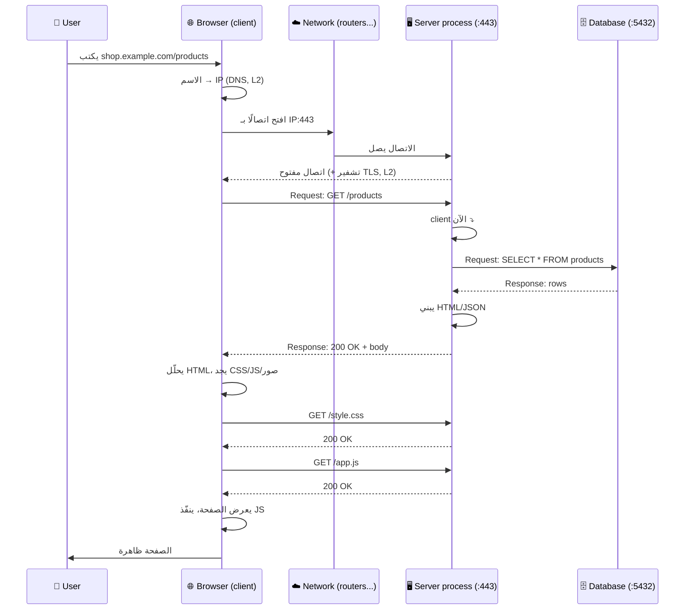
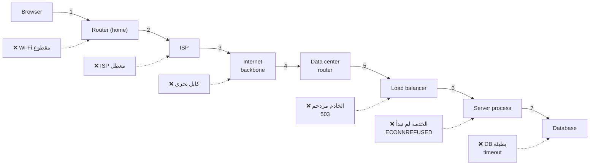

# Module 0.6 — الشبكة، العميل، الخادم، المتصفح
## Network, Client, Server, Browser

> **المستوى:** Level 0 — Absolute Foundations
> **الموقع:** أنت في [7 من 8] في هذا المستوى
> **السابق:** [Module 0.5 — Processes, Ports, localhost](module-05-processes-ports-localhost.md) | **التالي:** [Module 0.7 — Database, API, Web App](module-07-database-api-web-app.md)

---

## 1. المتطلبات (Prerequisites)

> **قبل أن تتعلم هذا، يجب أن تفهم:**
- [ ] IP = جهاز، Port = عملية، `IP:Port` عنوان كامل — [Module 0.5](module-05-processes-ports-localhost.md)
- [ ] الخادم عملية تستمع على منفذ؛ `localhost` هذا الجهاز — [Module 0.5](module-05-processes-ports-localhost.md)
- [ ] I/O الشبكة أبطأ شيء في الحاسوب — [Module 0.1](module-01-what-is-a-computer.md)
- [ ] بيئة التشغيل تحدد قدرات JavaScript (متصفح vs Node) — [Module 0.2](module-02-programs-and-code.md)

---

## 2. أهداف التعلّم (Learning Objectives)

بعد هذه الوحدة ستستطيع:

- تعريف **الشبكة** والفرق بين شبكة محلية و**الإنترنت**.
- شرح نموذج **العميل/الخادم** (Client/Server) وأن الدور نسبي.
- وصف **دورة الطلب/الاستجابة** (Request/Response) كنمط أساسي.
- شرح ما يفعله **المتصفح** فعلًا (ليس "يعرض مواقع").
- فهم أن الشبكة **تفشل** وأن هذا طبيعي، وما أنواع الفشل الأساسية.
- تتبّع رحلة طلب حقيقي من متصفحك إلى خادم وعودته (بالمفاهيم، قبل التفاصيل).

---

## 3. شرح للمبتدئ (Beginner Explanation)

### ما هي الشبكة؟

**الشبكة** (**Network**) = جهازان أو أكثر **متصلان** بحيث يستطيعان **تبادل البيانات**.

- هاتفك وحاسوبك على نفس Wi-Fi = شبكة محلية (**LAN** — Local Area Network).
- **الإنترنت** = **شبكة من الشبكات**: ملايين الشبكات المحلية مربوطة عبر أجهزة توجيه (**routers**) وكابلات تعبر المحيطات.

عندما ترسل بيانات من جهازك إلى خادم في قارة أخرى، تمر عبر **عشرات الأجهزة الوسيطة** (routers)، كل واحد يقرأ العنوان ويمرّرها للتالي، مثل البريد: مكتب محلي → مركز فرز → طائرة → مركز فرز → ساعي بريد.

**نتيجتان مهمتان:**
1. **الشبكة بطيئة** نسبيًا (ميلي‌ثوانٍ مقابل نانوثوانٍ للذاكرة). تذكّر جدول Module 0.1.
2. **الشبكة تفشل.** كابل يُقطع، راوتر يتعطل، جهاز مزدحم. **هذا ليس استثناء؛ هذا الطبيعي.** كل برنامج يستخدم الشبكة يجب أن يتوقع الفشل.

### العميل والخادم

في Module 0.5 قلنا إن الخادم **عملية تستمع على منفذ**. لنوسّع:

- **الخادم** (**Server**): عملية **تنتظر** طلبات وتجيب عليها. لا تبادر. مثل موظف استقبال.
- **العميل** (**Client**): عملية **تبادر** بإرسال طلب وتنتظر الرد. مثل الزائر.

```
Client                           Server
  │                                │
  │ ──── Request (طلب) ──────────▶ │
  │                                │  (يعالج)
  │ ◀─── Response (استجابة) ────── │
  │                                │
```

**الدور نسبي:**
- متصفحك **عميل** لخادم الموقع.
- خادم الموقع **عميل** لخادم قاعدة البيانات.
- خادم قاعدة البيانات قد يكون **عميلًا** لخدمة نسخ احتياطي.

نفس البرنامج قد يكون خادمًا وعميلًا في نفس اللحظة. **السؤال دائمًا: في هذا الاتصال المحدد، من يبادر ومن ينتظر؟**

### دورة الطلب/الاستجابة (Request/Response)

هذا **النمط الأساسي** لمعظم اتصالات الويب:

1. العميل **يفتح اتصالًا** بـ `IP:Port` الخادم.
2. العميل **يرسل طلبًا**: "أريد الصفحة الرئيسية" / "احفظ هذا الطلب" / "أعطني قائمة المستخدمين".
3. الخادم **يعالج**: يقرأ من قاعدة بيانات، يحسب، يتحقق.
4. الخادم **يرسل استجابة**: البيانات المطلوبة + رمز حالة (نجح؟ فشل؟ لماذا؟).
5. الاتصال يُغلق (أو يبقى لطلبات أخرى).

**ملاحظة أساسية:** الخادم **لا يستطيع إرسال شيء للعميل من تلقاء نفسه** في هذا النمط. فقط يجيب. (لإشعارات فورية مثل الدردشة، توجد أنماط أخرى — WebSockets — Level 5/7. الآن ركّز على الأساس.)

### ماذا يفعل المتصفح فعلًا؟

**المتصفح** (**Browser**) ليس "برنامجًا يعرض مواقع". هو **عميل HTTP** + **بيئة تشغيل JavaScript** + **محرك عرض** في برنامج واحد. عندما تكتب `example.com`:

1. **يحوّل الاسم إلى IP** (يسأل DNS — Level 2).
2. **يفتح اتصالًا** بذلك IP على port 443 (HTTPS).
3. **يتفاوض على التشفير** (TLS — Level 2).
4. **يرسل طلب HTTP**: "أعطني `/`".
5. **يستقبل الاستجابة**: نص HTML.
6. **يحلّل HTML** ويكتشف أنه يحتاج ملفات أخرى (CSS, صور, JavaScript) → **يرسل طلبات إضافية** لكل واحدة.
7. **يبني الصفحة** ويعرضها (محرك العرض — rendering engine).
8. **ينفّذ JavaScript** (بيئة تشغيل — V8 في Chrome). هذا الكود قد يرسل **طلبات إضافية** (`fetch`) للخادم دون إعادة تحميل الصفحة.

> موقع واحد "بسيط" = **عشرات الطلبات**. افتح DevTools → Network في أي موقع وشاهدها.

**نقطة أمنية مبكرة:** المتصفح يشغّل كودًا **من غرباء** (أي موقع تزوره). لذلك يفرض **قيودًا صارمة** على ما يستطيع JavaScript فعله (لا وصول للملفات، لا اتصالات عشوائية، لا قراءة بيانات مواقع أخرى — "same-origin policy"). هذا سبب أن JavaScript في المتصفح وفي Node مختلفان (Module 0.2)، وسبب وجود CORS (Level 2).

### أنواع فشل الشبكة (نظرة أولى)

| ماذا حدث | ما تراه | مثال |
|---|---|---|
| لم يصل الطلب | **Timeout** | كابل مقطوع، خادم مطفأ |
| وصل، لكن لا أحد يستمع | **Connection refused** | الخدمة لم تبدأ (Module 0.5) |
| وصل، الخادم أجاب "لا أستطيع" | **Error response** (5xx) | قاعدة البيانات معطلة |
| وصل، الخادم أجاب "طلبك خاطئ" | **Error response** (4xx) | صفحة غير موجودة، غير مصرّح |
| أُرسل الطلب، **لا تعرف** هل وصل | **Timeout بعد الإرسال** | **الأخطر**: هل نُفّذ الدفع أم لا؟ |

السطر الأخير هو **أصعب مشكلة في الأنظمة الموزعة** وسنعود إليه في Level 7 (idempotency). الآن، فقط لاحظ: **"لا أعرف" حالة حقيقية في الشبكات.**

---

## 4. النموذج الذهني (Mental Model)

### النموذج 1: الشبكة = بريد غير موثوق

```
   ✉️ ترسل رسالة                  ✉️ قد:
      ───────────▶                 ✅ تصل
                                   ⏱️ تتأخر
                                   ❌ تضيع
                                   🔁 تصل مرتين (!)
                                   🔀 تصل قبل رسالة أُرسلت قبلها (!)

   البرامج الجيدة تصمَّم لكل هذه الحالات.
   (TCP في Level 2 يحل بعضها. لا يحل كلها.)
```

### النموذج 2: الدور نسبي

```
   [Browser] ──client──▶ [Web Server] ──client──▶ [Database Server]
                            ▲ server                    ▲ server
                            │                           │
   نفس العملية (Web Server) خادم لليسار وعميل لليمين في نفس اللحظة.
```

### النموذج 3: الطبقات تتكرر على كل جهاز (من Module 0)

```
   Client Machine                       Server Machine
   ┌──────────────┐                     ┌──────────────┐
   │ Browser (app)│                     │ node (app)   │
   │ JS runtime   │                     │ Node runtime │
   │ OS           │ ◀═══ Network ═════▶ │ OS           │
   │ Hardware     │                     │ Hardware     │
   └──────────────┘                     └──────────────┘

   الطلب ينزل الطبقات عند العميل، يعبر الشبكة، يصعد الطبقات عند الخادم.
   الاستجابة تفعل العكس.
```

---

## 5. الرسم التوضيحي (Visual Diagram)

### رحلة طلب واحد (مبسّطة — Level 2 يفصّل كل خطوة)



### أين قد تفشل الرحلة؟



> سبعة قفزات على الأقل، كل واحدة نقطة فشل محتملة. **"الموقع لا يفتح" له 7+ أسباب مختلفة.** المهندس يحدد **أين** بدليل.

---

## 6. مثال بسيط (Simple Example)

**بدون كود — افتح DevTools:**

1. افتح أي موقع (مثلًا `https://developer.mozilla.org`).
2. اضغط `F12` (أو `Cmd+Option+I`) → تبويب **Network**.
3. أعد تحميل الصفحة (`F5`).
4. لاحظ:
   - **عدد الطلبات** في الأسفل (غالبًا 30–100+). صفحة واحدة = طلبات كثيرة.
   - **أول سطر** = طلب HTML الأساسي. انقر عليه → **Headers**: ترى `Request URL`, `Request Method: GET`, `Status Code: 200`.
   - عمود **Time**: كل طلب يستغرق عشرات/مئات الميلي‌ثواني. **هذه الشبكة.**
   - تبويب **Timing** في أي طلب: `DNS Lookup`, `Initial connection`, `SSL`, `Waiting (TTFB)`, `Content Download`. **هذه الخطوات في الرسم أعلاه، مقاسة.**
5. افصل Wi-Fi وأعد التحميل → **الفشل** بشكله الخام.

> هذا التبويب سيكون **أداتك اليومية** في Level 2 و5. تعوّد عليه.

---

## 7. مثال كود (Code Example)

### مثال 1: خادم وعميل على جهازك — ترى الطرفين

**الخادم:**
```javascript
// server.js
const http = require("node:http");

const products = [
  { id: 1, name: "Keyboard", price: 50 },
  { id: 2, name: "Mouse", price: 25 },
];

const server = http.createServer((req, res) => {
  console.log(`→ ${req.method} ${req.url} from ${req.socket.remoteAddress}:${req.socket.remotePort}`);

  if (req.url === "/products") {
    res.writeHead(200, { "Content-Type": "application/json" });
    res.end(JSON.stringify(products));
  } else {
    res.writeHead(404, { "Content-Type": "text/plain" });
    res.end("Not found\n");
  }
});

server.listen(3000, "127.0.0.1", () => console.log("Server listening on 127.0.0.1:3000"));
```

**العميل (Node — نفس اللغة، دور مختلف):**
```javascript
// client.js
// Node 18+ فيه fetch مدمج (قبلها: بيئة Node لم تكن تملكه — تذكّر Module 0.2)
async function main() {
  try {
    const res = await fetch("http://127.0.0.1:3000/products");
    console.log("Status:", res.status);                  // 200
    const data = await res.json();
    console.log("Products:", data);
  } catch (err) {
    // فشل الشبكة نفسه (لا استجابة إطلاقًا)
    console.error("Network failure:", err.cause?.code ?? err.message);  // ECONNREFUSED إن لم يعمل الخادم
  }
}
main();
```

```bash
# Terminal 1
node server.js
# Server listening on 127.0.0.1:3000

# Terminal 2
node client.js
# Status: 200
# Products: [ { id: 1, name: 'Keyboard', price: 50 }, { id: 2, name: 'Mouse', price: 25 } ]

# في Terminal 1 ظهر:
# → GET /products from 127.0.0.1:52344     ← العميل حصل على منفذ مؤقت عشوائي (52344)

# أوقف الخادم (Ctrl+C) وشغّل العميل مجددًا:
node client.js
# Network failure: ECONNREFUSED
```

**لاحظ:**
- **نفس اللغة، دوران.** `server.js` ينتظر؛ `client.js` يبادر.
- العميل حصل على **منفذ مؤقت** (52344) — OS يعطيه تلقائيًا. الخادم على منفذ **ثابت** (3000) ليعرفه العملاء.
- **نوعان من "الفشل"**: `404` استجابة (الخادم موجود وأجاب "غير موجود")، و`ECONNREFUSED` فشل شبكة (لا استجابة أصلًا). **الفرق جوهري**: الأول يُعالج بـ `if (res.status...)`, الثاني بـ `catch`.

### مثال 2: نفس العميل من المتصفح — نفس اللغة، بيئة أخرى، قيود أخرى

```html
<!-- index.html — افتحه مباشرة في المتصفح (file://) -->
<script>
  fetch("http://127.0.0.1:3000/products")
    .then(r => r.json())
    .then(data => console.log(data))
    .catch(err => console.error("Failed:", err.message));
</script>
```

في console المتصفح سترى غالبًا:
```
Access to fetch at 'http://127.0.0.1:3000/products' from origin 'null' has been blocked by CORS policy
```

**لماذا فشل هنا ونجح من Node؟** لأن **المتصفح يفرض قيودًا أمنية** (same-origin policy) لا يفرضها Node: صفحة من مصدر A لا تقرأ بيانات من مصدر B إلا بإذن B. هذا **ليس خطأ في كودك** — إنه المتصفح يحمي المستخدم. (الحل: الخادم يضيف header `Access-Control-Allow-Origin` — Level 2، HTTP.)

> **الدرس:** نفس `fetch`، نتيجتان مختلفتان، لأن **بيئة التشغيل** (Module 0.2) مختلفة. المتصفح عميل **غير موثوق بكوده** فيُقيَّد.

### مثال 3: Timeout — "لا أعرف" كحالة حقيقية

```javascript
// slow-server.js — خادم يتأخر 5 ثوانٍ (يحاكي قاعدة بيانات بطيئة)
const http = require("node:http");
http.createServer((req, res) => {
  setTimeout(() => res.end("finally!\n"), 5000);
}).listen(3000, "127.0.0.1");
```

```javascript
// impatient-client.js — عميل لا ينتظر أكثر من ثانيتين
async function main() {
  const controller = new AbortController();
  const timer = setTimeout(() => controller.abort(), 2000);   // مهلة 2s

  try {
    const res = await fetch("http://127.0.0.1:3000/", { signal: controller.signal });
    console.log(await res.text());
  } catch (err) {
    console.error("Gave up:", err.name);   // AbortError
    // ⚠️ السؤال المهم: هل الخادم نفّذ العملية أم لا؟ لا نعرف!
    //    لو كان الطلب "ادفع 100$"، هل دُفعت؟
  } finally {
    clearTimeout(timer);
  }
}
main();
```

> **بدون timeout، عميلك قد ينتظر للأبد.** مع timeout، تدخل منطقة "لا أعرف". كلاهما سيّئ؛ الثاني قابل للإدارة (Level 7: idempotency, retries). **القاعدة من اليوم: كل طلب شبكة له مهلة.**

---

## 8. مثال من العالم الحقيقي (Real-World Example)

### لماذا تعمل خرائط Google بدون إنترنت في بعض المناطق التي زرتها؟

لأن التطبيق (**العميل**) **خزّن** البيانات التي طلبها سابقًا (**cache**). عند انقطاع الشبكة، يستخدم النسخة المحلية بدل الطلب من **الخادم**. التصميم **يفترض فشل الشبكة** ويخطط له. (Level 5: Caching.)

### لماذا تظهر رسالة "جارٍ الإرسال…" في WhatsApp ثم ✓ ثم ✓✓؟

- **ساعة ⏱:** العميل أرسل، لم يصل تأكيد من الخادم بعد (شبكة بطيئة/مقطوعة).
- **✓:** الخادم استلم (الطلب نجح).
- **✓✓:** الخادم أوصلها لجهاز صديقك (طلب ثانٍ، من الخادم إلى عميل آخر).

التطبيق **يُظهر حالة الشبكة للمستخدم** بدل الكذب عليه. ولو أعدت الإرسال، لا تُرسل الرسالة مرتين — لأن لكل رسالة معرّفًا فريدًا والخادم يتجاهل المكرر (**idempotency** — Level 7). كل هذا تصميم حول فشل الشبكة.

---

## 9. مثال من الإنتاج (Production Example)

### الحادثة: "الدفع تم مرتين"

متجر إلكتروني. مستخدم يضغط "ادفع". الطلب يصل للخادم، الخادم يخصم من البطاقة، **لكن الاستجابة تضيع في الشبكة** (كابل مقطوع في اللحظة الخطأ). المتصفح ينتظر 30 ثانية، يعرض "خطأ في الشبكة". المستخدم يضغط "ادفع" مرة أخرى. **خصم ثانٍ.**

**التشخيص:**
- **Observe:** شكاوى خصم مزدوج، نادرة (0.1%).
- **Evidence:** سجلات الخادم تُظهر طلبي دفع لنفس السلة بفارق 30 ثانية؛ سجل الأول يُظهر الاستجابة أُرسلت لكن العميل لم يسجّل استلامها.
- **Hypothesis:** الاستجابة ضاعت بعد تنفيذ العملية؛ العميل أعاد المحاولة؛ الخادم لا يميّز المكرر.
- **Fix:**
  1. العميل يولّد **معرّف عملية فريد** (idempotency key) قبل أول محاولة ويرسله في كل إعادة.
  2. الخادم يحفظ المعرّف مع النتيجة؛ إن وصل نفس المعرّف مجددًا، يعيد **النتيجة المحفوظة** بدل تنفيذ العملية.
  3. زر "ادفع" يُعطَّل بعد الضغطة الأولى حتى يصل رد (نهائي أو timeout).

**الدرس:** الشبكة فيها حالة ثالثة غير "نجح/فشل": **"لا أعرف"**. التصميم الذي يتجاهلها ينتج أخطاء نادرة، مكلفة، ويصعب إعادة إنتاجها. هذا سبب وجود Level 7 بأكمله.

---

## 10. مفاهيم خاطئة شائعة (Common Misconceptions)

| ❌ المفهوم الخاطئ | ✅ الحقيقة |
|---|---|
| "الإنترنت = الويب" | الويب (HTTP/مواقع) **تطبيق واحد** على الإنترنت. البريد، الألعاب، SSH، DNS تطبيقات أخرى على نفس الشبكة. |
| "الخادم يرسل للعميل متى شاء" | في نمط request/response، الخادم **يجيب فقط**. الإشعارات الفورية تحتاج أنماطًا أخرى (WebSockets, SSE) أو العميل يسأل دوريًا (polling). |
| "فشل الطلب = لم يُنفَّذ" | قد يكون نُفّذ وضاعت الاستجابة. **"لا أعرف"** حالة حقيقية. |
| "المتصفح يعرض HTML فقط" | المتصفح: عميل HTTP + بيئة JavaScript + محرك عرض + صندوق رمل أمني + مدير cache + مدير cookies… |
| "`fetch` يعمل بنفس الطريقة في المتصفح وNode" | نفس الواجهة، قيود مختلفة (CORS في المتصفح فقط) وقدرات مختلفة. |
| "الشبكة السريعة تعني لا timeouts" | السرعة لا تمنع الانقطاع. **كل** طلب يحتاج مهلة. |
| "404 فشل شبكة" | 404 **استجابة ناجحة** تقول "غير موجود". الشبكة عملت تمامًا. فشل الشبكة = لا استجابة إطلاقًا. |

---

## 11. أخطاء شائعة (Common Mistakes)

1. **طلب شبكة بدون timeout.** العميل يعلّق للأبد؛ في خادم، كل طلب معلّق يستهلك موارد حتى ينهار.
2. **معاملة فشل الشبكة واستجابة الخطأ بنفس الطريقة** (كلاهما في `catch` واحد برسالة "حدث خطأ"). التشخيص يصبح مستحيلًا.
3. **عدم التحقق من `res.ok` / `res.status`** — `fetch` **لا يرمي خطأ** على 404 أو 500؛ فقط على فشل الشبكة. `await res.json()` على صفحة خطأ HTML ينفجر برسالة مضللة.
4. **إعادة المحاولة التلقائية لعمليات غير آمنة** (دفع، إرسال بريد) بدون idempotency key → تكرار.
5. **افتراض أن الخادم وصله الطلب لأن العميل أرسله.**
6. **كود واجهة يستدعي `localhost`** ويُنشر → يعمل عند المطور فقط (Module 0.5).

---

## 12. تمرين تصحيح (Debugging Exercise)

### السيناريو

تطبيق ويب يعرض قائمة منتجات. المستخدمون يبلّغون: *"أحيانًا تظهر الصفحة فارغة بدون رسالة خطأ."*

**كود الواجهة:**
```javascript
async function loadProducts() {
  try {
    const res = await fetch("/api/products");
    const products = await res.json();
    render(products);
  } catch (err) {
    console.log("error", err);
  }
}
```

**ما جمعته من الأدلة:**
- في console المستخدمين المتأثرين: `SyntaxError: Unexpected token '<', "<!DOCTYPE "... is not valid JSON`.
- في سجلات الخادم في نفس الأوقات: `GET /api/products 503` مع `upstream timeout`.
- الصفحة الفارغة لا تُظهر أي رسالة للمستخدم.

### الأسئلة

1. ما الذي حدث بالضبط، خطوة خطوة؟ لماذا `SyntaxError` وليس خطأ شبكة؟
2. هل هذا **فشل شبكة** أم **استجابة خطأ**؟ هل عالجها الكود بشكل صحيح؟
3. أعد كتابة `loadProducts` لتميّز بين: نجاح، استجابة خطأ من الخادم، فشل شبكة، وtimeout — مع رسالة مناسبة للمستخدم في كل حالة.

<details>
<summary>💡 الحل</summary>

1. **التسلسل:**
   - الخادم (أو موزّع الحمل أمامه) لم يستطع الوصول لقاعدة البيانات في الوقت المحدد → أرجع **503** مع **صفحة HTML** للخطأ (`<!DOCTYPE html>…`).
   - `fetch` **نجح** من منظور الشبكة (وصلت استجابة) → لم يرمِ خطأ.
   - الكود لم يتحقق من `res.status` وحاول `res.json()` على HTML → `SyntaxError` ("Unexpected token '<'").
   - الـ `catch` التقطه وطبعه في console فقط → **المستخدم لا يرى شيئًا**.

2. **استجابة خطأ** (503)، ليست فشل شبكة. الكود **لم يعالجها** — عاملها كأنها بيانات صالحة، ثم أخفى الانفجار.

3. **الإصلاح:**
```javascript
async function loadProducts() {
  const controller = new AbortController();
  const timer = setTimeout(() => controller.abort(), 8000);   // مهلة

  try {
    const res = await fetch("/api/products", { signal: controller.signal });

    // 1) استجابة وصلت لكنها خطأ
    if (!res.ok) {
      if (res.status >= 500) {
        showMessage("الخدمة تواجه مشكلة مؤقتة. حاول بعد قليل.");
      } else if (res.status === 401) {
        showMessage("انتهت جلستك. سجّل الدخول مجددًا.");
      } else {
        showMessage(`تعذّر تحميل المنتجات (${res.status}).`);
      }
      console.error("HTTP error", res.status, await res.text());
      return;
    }

    // 2) نجاح — لكن تحقق أن المحتوى JSON فعلًا
    const contentType = res.headers.get("content-type") ?? "";
    if (!contentType.includes("application/json")) {
      showMessage("استجابة غير متوقعة من الخادم.");
      console.error("Expected JSON, got", contentType);
      return;
    }

    render(await res.json());

  } catch (err) {
    // 3) لا استجابة إطلاقًا
    if (err.name === "AbortError") {
      showMessage("الخادم لا يستجيب. تحقق من اتصالك أو حاول لاحقًا.");   // timeout — "لا أعرف"
    } else {
      showMessage("لا يوجد اتصال بالشبكة.");                               // فشل شبكة
    }
    console.error("Network-level failure", err);
  } finally {
    clearTimeout(timer);
  }
}
```

**المنهجية:** Observe (صفحة فارغة) → Evidence (`SyntaxError` + 503 في السجلات **بنفس الوقت** — الربط بين دليلين من طبقتين) → Hypothesis (HTML خطأ عومل كـ JSON) → Experiment (أعد إنتاجه بإيقاف DB محليًا) → Fix (ميّز الحالات).

**الدرس:** **"فشل شبكة" و"استجابة خطأ" و"timeout" ثلاثة أشياء مختلفة**، تحتاج ثلاث معالجات، وثلاث رسائل. `catch` واحد يخفيها كلها.

</details>

---

## 13. تمرين معماري (Architecture Exercise)

### السيناريو

تصمّم ميزة "إشعار فوري عند وصول رسالة" في تطبيق دردشة ويب بسيط. تعرف فقط نمط **request/response** حتى الآن.

### الأسئلة

1. بما أن الخادم لا يستطيع "إرسال" للعميل من تلقاء نفسه في هذا النمط، كيف يمكن للعميل أن **يعرف** بوصول رسالة جديدة؟ اقترح حلًا بنمط request/response فقط.
2. ما **تكلفة** حلك على: الشبكة، الخادم، بطارية الهاتف؟ ماذا لو كان عندك مليون مستخدم؟
3. ما المقايضة بين "تحقق كل ثانية" و"تحقق كل 30 ثانية"؟
4. (تمهيد) هل تتخيل نمطًا آخر يحل المشكلة؟ صفه بكلماتك دون معرفة اسمه.

<details>
<summary>💡 إجابة نموذجية</summary>

1. **Polling (الاستطلاع الدوري):** العميل يسأل الخادم كل N ثانية: "هل عندك رسائل جديدة بعد الطابع الزمني X؟" الخادم يجيب بالجديد أو بقائمة فارغة.

2. **التكلفة:**
   - **الشبكة:** معظم الطلبات تعود فارغة = هدر. مليون مستخدم × طلب/ثانية = مليون طلب/ثانية **بلا فائدة غالبًا**.
   - **الخادم:** يجب أن يعالج كل طلب (اتصال، تحقق هوية، استعلام DB). مليون/ثانية = بنية تحتية ضخمة لـ "لا شيء جديد".
   - **البطارية:** إيقاظ الراديو كل ثانية يستنزفها.

3. **المقايضة:** **كل ثانية** = إشعار شبه فوري، تكلفة هائلة. **كل 30 ثانية** = تكلفة أقل 30 مرة، لكن تأخير حتى 30 ثانية (غير مقبول للدردشة، مقبول لـ "تحديث الطقس"). **لا توجد إجابة صحيحة بمعزل عن المتطلبات** (Level 4: Non-Functional Requirements — "ما الـ latency المقبولة؟").

4. **أنماط أخرى (بكلمات بسيطة):**
   - **"انتظر حتى يحدث شيء":** العميل يرسل طلبًا، والخادم **لا يجيب** حتى تصل رسالة (أو تنتهي مهلة طويلة)، ثم يجيب، والعميل يرسل طلبًا جديدًا فورًا. يقلل الطلبات الفارغة. (اسمه **long polling**.)
   - **"اترك الخط مفتوحًا":** العميل يفتح اتصالًا ويبقيه مفتوحًا؛ الطرفان يرسلان متى شاءا. (اسمه **WebSocket**.)
   - **"الخادم يبث":** اتصال مفتوح أحادي الاتجاه من الخادم للعميل. (اسمه **Server-Sent Events**.)

   كلها لها مقايضات (اتصالات مفتوحة = ذاكرة على الخادم، موزّعات حمل تحتاج دعمًا خاصًا…) — Level 5/7.

**الدرس:** نمط request/response **أساس** لكنه ليس الوحيد. وكل نمط يحمل تكلفة على **الشبكة والخادم والعميل**. التفكير في "مليون مستخدم" يكشف التكلفة فورًا (Level 7: Architecture Challenges).

</details>

---

## 14. الصلة بعصر الذكاء الاصطناعي (AI-Era Relevance)

AI يكتب كود شبكة **متفائلًا**:

```javascript
const data = await (await fetch(url)).json();   // لا timeout، لا فحص status، لا تمييز أخطاء
```

وغالبًا:
- بدون **timeout**.
- بدون فحص **`res.ok`**.
- **`catch` واحد** لكل شيء برسالة عامة.
- **إعادة محاولة** تلقائية لعمليات غير آمنة.
- `localhost` في كود يُنشر.

**ما تتحقق منه في أي كود شبكة من AI:**
```
□ هل لكل طلب timeout؟
□ هل يفحص res.ok/status قبل قراءة body؟
□ هل يميّز: نجاح / استجابة خطأ (4xx/5xx) / فشل شبكة / timeout؟
□ هل إعادة المحاولة (إن وُجدت) آمنة للعملية؟ (قراءة: نعم. دفع: لا بدون idempotency key.)
□ هل العناوين من env وليست localhost ثابتة؟
□ ما الذي يراه المستخدم في كل حالة فشل؟
```

**سؤال جيد لـ AI:**
> "في هذا الكود، ماذا يحدث بالضبط إذا: (أ) الخادم أعاد 503 بصفحة HTML، (ب) الشبكة انقطعت بعد إرسال الطلب، (ج) الخادم تأخر 60 ثانية؟ أرني كل مسار."

---

## 15. ما يجب إتقانه (Must Master) 🔴

- **الشبكة** أجهزة متصلة تتبادل بيانات؛ **الإنترنت** شبكة شبكات. **بطيئة وتفشل — هذا طبيعي.**
- **Client يبادر، Server ينتظر ويجيب. الدور نسبي.**
- **Request → Process → Response.** الخادم لا يبادر في هذا النمط.
- **ثلاثة أنواع فشل مختلفة:** استجابة خطأ (4xx/5xx — الشبكة عملت)، فشل شبكة (لا استجابة)، timeout ("لا أعرف"). كلٌّ يُعالج بشكل مختلف.
- **كل طلب شبكة له timeout.** `fetch` لا يرمي على 404/500؛ افحص `res.ok`.
- المتصفح = عميل HTTP + بيئة JS + محرك عرض + **قيود أمنية** (لهذا CORS).

## 16. ما يجب فهمه (Should Understand) 🟠

- صفحة واحدة = عشرات الطلبات. DevTools → Network يريك كل شيء.
- العميل يحصل على منفذ مؤقت عشوائي؛ الخادم على منفذ ثابت معروف.
- الطلب يعبر 7+ قفزات، كل واحدة نقطة فشل.
- "نُفّذ وضاعت الاستجابة" سبب حقيقي لأخطاء مكلفة (idempotency لاحقًا).
- Polling كأبسط حل للإشعارات وتكلفته.

## 17. ما يمكن تأجيله (Can Defer) ⚪

- DNS, TCP, TLS, HTTP بالتفصيل — **Level 2 كله**.
- CORS بالتفصيل — Level 2 (HTTP).
- WebSockets, SSE, long polling — Level 5/7.
- Routers, NAT, BGP — مفاهيميًا فقط إن احتجت.
- Idempotency, retries with backoff — Level 7.

---

## 18. الخلاصة (Summary)

1. **الشبكة** تربط أجهزة لتبادل بيانات. **الإنترنت** شبكة شبكات. الطلب يعبر قفزات كثيرة، كلها قد تفشل. **الفشل طبيعي، لا استثناء.**
2. **العميل يبادر، الخادم ينتظر ويجيب.** الدور نسبي: خادم الويب عميل لقاعدة البيانات.
3. النمط الأساسي: **Request → Process → Response.** الخادم لا يرسل من تلقاء نفسه.
4. **المتصفح** عميل HTTP + بيئة JavaScript + محرك عرض + صندوق رمل أمني. صفحة = عشرات الطلبات.
5. **ثلاثة أنواع فشل:** استجابة خطأ (الشبكة عملت)، فشل شبكة (لا استجابة)، timeout (**"لا أعرف"**). ميّزها في الكود وفي الرسائل.
6. **كل طلب له timeout.** `fetch` لا يرمي على 4xx/5xx — افحص `res.ok`.
7. "لا أعرف هل نُفّذ" مشكلة حقيقية تسبب تكرارًا (دفع مزدوج). الحل لاحقًا: idempotency.

---

## 19. مراجع رسمية (Official References)

- **MDN — How the web works:** https://developer.mozilla.org/en-US/docs/Learn/Getting_started_with_the_web/How_the_Web_works
- **MDN — Client-Server overview:** https://developer.mozilla.org/en-US/docs/Learn/Server-side/First_steps/Client-Server_overview
- **MDN — Fetch API (Using Fetch — Checking that the fetch was successful):** https://developer.mozilla.org/en-US/docs/Web/API/Fetch_API/Using_Fetch
- **MDN — AbortController:** https://developer.mozilla.org/en-US/docs/Web/API/AbortController
- **MDN — Same-origin policy:** https://developer.mozilla.org/en-US/docs/Web/Security/Same-origin_policy
- **Chrome DevTools — Network panel reference:** https://developer.chrome.com/docs/devtools/network
- **Node.js `http.request` / `fetch` (Node 18+):** https://nodejs.org/api/globals.html#fetch

---

## المصطلحات في هذه الوحدة (Terminology)

| العربية | English |
|---|---|
| شبكة | Network |
| شبكة محلية | LAN (Local Area Network) |
| الإنترنت | Internet |
| موجّه | Router |
| قفزة (بين موجّهين) | Hop |
| عميل | Client |
| خادم | Server |
| طلب | Request |
| استجابة | Response |
| دورة الطلب/الاستجابة | Request/Response cycle |
| متصفح | Browser |
| محرك العرض | Rendering engine |
| صندوق الرمل (عزل أمني) | Sandbox |
| سياسة المصدر الواحد | Same-origin policy |
| مشاركة الموارد عبر المصادر | CORS (Cross-Origin Resource Sharing) |
| مهلة | Timeout |
| فشل شبكة | Network failure |
| استجابة خطأ | Error response |
| رمز الحالة | Status code |
| منفذ مؤقت | Ephemeral port |
| استطلاع دوري | Polling |
| استطلاع طويل | Long polling |
| تخزين مؤقت | Cache |
| ثبات التكرار (نفس الطلب = نفس النتيجة) | Idempotency |
| زمن الاستجابة | Latency |

---

> **التالي:** [Module 0.7 — Database, API, Web Application: The Big Map](module-07-database-api-web-app.md) — آخر ثلاث كلمات في الخريطة، ثم نجمع كل شيء.
