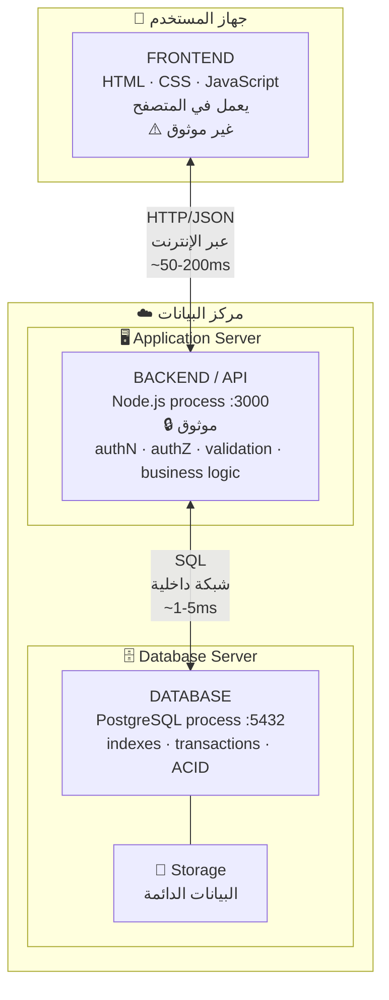
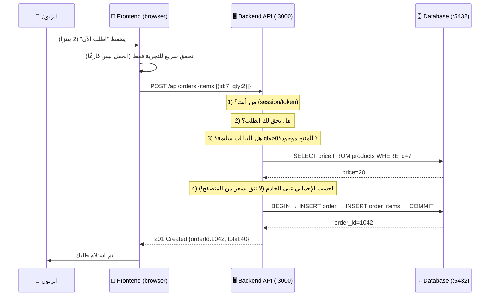

# Module 0.7 — قاعدة البيانات، الـ API، تطبيق الويب: الخريطة الكبرى
## Database, API, Web Application — The Big Map

> **المستوى:** Level 0 — Absolute Foundations
> **الموقع:** أنت في [8 من 8] في هذا المستوى
> **السابق:** [Module 0.6 — Network, Client, Server, Browser](module-06-network-client-server.md) | **التالي:** [Checkpoint 0](checkpoint-0.md)

---

## 1. المتطلبات (Prerequisites)

> **قبل أن تتعلم هذا، يجب أن تفهم:**
- [ ] RAM مؤقتة، Storage دائم؛ الملف بايتات — [Module 0.1](module-01-what-is-a-computer.md), [0.4](module-04-files-terminal-shell.md)
- [ ] كل عملية لها ذاكرة معزولة؛ مشاركة البيانات تحتاج وسيطًا خارجيًا — [Module 0.3](module-03-running-a-program.md)
- [ ] الخادم عملية تستمع على منفذ؛ Client/Server؛ Request/Response — [Module 0.5](module-05-processes-ports-localhost.md), [0.6](module-06-network-client-server.md)
- [ ] الخريطة السباعية من [Module 0](module-00-how-everything-fits-together.md)

---

## 2. أهداف التعلّم (Learning Objectives)

بعد هذه الوحدة ستستطيع:

- شرح **ما المشكلة التي تحلها قاعدة البيانات** ولماذا لا تكفي الملفات.
- تعريف **الـ API** تعريفًا دقيقًا (ليس "رابط يرجع JSON").
- وصف **تطبيق الويب** كمجموعة طبقات تتعاون: متصفح ↔ خادم ↔ قاعدة بيانات.
- **رسم الخريطة الكاملة** لتطبيق ويب حقيقي وشرح كل سهم فيها.
- معرفة **أين يعمل كل جزء من الكود** (في المتصفح أم على الخادم) ولماذا يهم ذلك.
- الربط بين **كل ما تعلمته في Level 0** في نظام واحد.

---

## 3. شرح للمبتدئ (Beginner Explanation)

### الجزء الأول: قاعدة البيانات — ما المشكلة؟

في Module 0.3 قلنا: متغيرات عمليتك **تختفي** عند انتهائها، و**لا تُشارك** مع عمليات أخرى. فأين نحفظ طلبات المطعم؟

**المحاولة الأولى: ملف.** `orders.json`. يعمل! حتى:

| المشكلة | ما يحدث مع ملف |
|---|---|
| **البحث** | "كل طلبات الزبون أحمد في مارس" → اقرأ الملف **كله** (ربما ملايين الطلبات) وصفِّ. بطيء جدًا. |
| **التزامن** (Concurrency) | زبونان يطلبان في نفس اللحظة → عمليتان تكتبان في نفس الملف → **إحداهما تمسح الأخرى** أو الملف يفسد. |
| **الفشل** | انقطع الكهرباء **أثناء** الكتابة → نصف الملف قديم ونصفه جديد → **بيانات فاسدة**. |
| **الحجم** | الملف أكبر من RAM → لا تستطيع تحميله أصلًا (Module 0.1). |
| **العلاقات** | الطلب يشير إلى زبون ومنتجات. تغيّر اسم المنتج → تحدّث كل طلب يحتويه؟ |
| **الوصول من عدة خوادم** | خادمان على جهازين مختلفين → أي ملف؟ |

**قاعدة البيانات** (**Database**) = **برنامج متخصص** (عملية، تستمع على منفذ — مثل PostgreSQL على 5432) مهمته الوحيدة: **تخزين البيانات واسترجاعها بأمان وسرعة، حتى مع آلاف المستخدمين المتزامنين، وحتى عند الفشل.**

تحل كل مشاكل الجدول:
- **البحث السريع:** عبر **فهارس** (indexes) — Level 3.
- **التزامن:** عبر **المعاملات** (transactions) و**الأقفال** (locks) — Level 3، 5.
- **الفشل:** عبر ضمانات **ACID** (إما تُحفظ العملية كاملة أو لا شيء) — Level 3.
- **الحجم:** تُدير القرص بذكاء ولا تحمّل كل شيء في RAM.
- **العلاقات:** عبر **الجداول** و**المفاتيح** (keys) — Level 3.
- **عدة خوادم:** هي خادم مستقل؛ الجميع يتصل بها عبر الشبكة.

**الفكرة الذهنية الآن:** قاعدة البيانات **خادم آخر**. تطبيقك **عميل** له. يتحدثان بلغة اسمها **SQL** (Level 3). كل ما تعرفه عن client/server وIP:Port ينطبق.

```
[Your app process] ──client──▶ [Database process :5432]
                   "احفظ هذا الطلب"
                   "أعطني طلبات أحمد"
```

> **لماذا لا نعيد اختراعها؟** لأن حل التزامن والفشل بشكل صحيح استغرق من البشرية 50 سنة. PostgreSQL نتيجة ذلك. استخدمها.

### الجزء الثاني: الـ API — ما هو فعلًا؟

**API** = **Application Programming Interface** = **واجهة برمجة التطبيقات**.

كلمة **واجهة** (**Interface**) هي المفتاح. الواجهة = **العقد** بين طرفين: "إذا طلبت مني X بهذا الشكل، أعطيك Y بهذا الشكل." ما يحدث **خلف** الواجهة ليس شأنك.

أمثلة من حياتك:
- **لوحة أزرار المصعد** واجهة: تضغط 5، يأخذك إلى 5. لا تعرف شيئًا عن المحركات.
- **قائمة المطعم** واجهة: تطلب "رقم 12"، يأتيك طبق. المطبخ مخفي.

في البرمجة، الـ API **بالمعنى العام** = أي عقد بين كودين:
- `fs.readFile(path)` هو API وفّرته Node: "أعطني مسارًا، أعطيك المحتوى." (ما يفعله مع OS مخفي.)
- `Array.prototype.map` هو API وفّرته JavaScript.
- دالة كتبتها أنت واستخدمها زميلك هي API.

**لكن في سياق الويب**، عندما يقول الناس "الـ API" يقصدون غالبًا **Web API**: **خادم** يستقبل **طلبات HTTP** على **مسارات** (URLs) محددة ويرد **ببيانات** (غالبًا JSON) بدل صفحات HTML.

```
Request:   GET /api/products/42
Response:  200 OK
           {"id": 42, "name": "Keyboard", "price": 50}
```

**لماذا نحتاج Web API منفصلًا عن "الموقع"؟** لأن **عملاء مختلفين** يحتاجون نفس البيانات بأشكال مختلفة:
- المتصفح يريد HTML (أو JavaScript يبني HTML من JSON).
- تطبيق الهاتف يريد JSON.
- شريك تجاري يريد JSON ليدمجه في نظامه.
- خدمة أخرى في شركتك تريد JSON.

**API واحد، عملاء كثيرون.** الواجهة ثابتة؛ ما خلفها قد يتغير بالكامل (قاعدة بيانات جديدة، لغة جديدة) دون أن يلاحظ العملاء — **إذا احتُرم العقد.**

> **API = عقد.** كسر العقد (تغيير شكل الاستجابة) يكسر كل العملاء. لهذا يوجد **versioning** (Level 5).

### الجزء الثالث: تطبيق الويب — جمع كل شيء

**تطبيق الويب** (**Web Application**) = برنامج يستخدمه الناس **عبر المتصفح** (أو تطبيق هاتف يتحدث لنفس الخادم)، منطقه وبياناته **على خادم**.

يتكون غالبًا من **ثلاث طبقات** تعمل في **أماكن مختلفة**:

| الطبقة | أين تعمل | ماذا تفعل | مثال |
|---|---|---|---|
| **Frontend** (الواجهة) | **في متصفح المستخدم** (عملية على جهازه) | تعرض، تستقبل تفاعل المستخدم، ترسل طلبات | HTML/CSS/JavaScript (React…) |
| **Backend** (الخلفية) | **على الخادم** (عملية على جهاز في مركز بيانات) | تستقبل الطلبات، تتحقق، تطبّق منطق العمل، تتحدث لقاعدة البيانات | Node.js/Express, Python/Django… |
| **Database** | **على الخادم** (عملية أخرى، غالبًا جهاز آخر) | تحفظ وتسترجع | PostgreSQL, MySQL… |

**السؤال الأهم في هذه الوحدة: أين يعمل هذا الكود؟**

| كود | يعمل في | النتيجة |
|---|---|---|
| `document.getElementById(...)` | المتصفح فقط | لا `document` في Node |
| `fs.readFile(...)` | الخادم فقط | المتصفح لا يصل للملفات |
| `process.env.DATABASE_URL` | الخادم فقط | **لو وضعته في كود الواجهة، يراه كل مستخدم** (View Source!) |
| التحقق "هل السعر > 0؟" | **يجب أن يكون على الخادم** | المستخدم يستطيع تعديل كود المتصفح وتخطّي أي تحقق في الواجهة |
| تنسيق التاريخ للعرض | المتصفح (مناسب) | لا خطر |

**القاعدة الذهبية:** **المتصفح في يد المستخدم. كل ما فيه مرئي وقابل للتعديل. لا تثق بأي شيء يأتي منه.** التحقق الحقيقي والأسرار ومنطق العمل الحساس **على الخادم دائمًا**. (هذه أول صياغة لـ **Trust Boundary** — Level 5.)

---

## 4. النموذج الذهني (Mental Model)

### الخريطة الكاملة لتطبيق ويب

```
┌─────────────────────────── جهاز المستخدم ───────────────────────────┐
│                                                                     │
│   Browser (process)                                                 │
│   ┌─────────────────────────────────────────────────────────┐       │
│   │ FRONTEND: HTML + CSS + JavaScript                        │       │
│   │  • يعرض الواجهة                                          │       │
│   │  • يستقبل النقر/الكتابة                                   │       │
│   │  • يرسل طلبات HTTP إلى الـ API                            │       │
│   │  ⚠️ غير موثوق: المستخدم يرى ويعدّل كل شيء هنا              │       │
│   └───────────────────────────┬─────────────────────────────┘       │
└───────────────────────────────┼─────────────────────────────────────┘
                                │ Network (HTTP over Internet)
                                │ Request: GET /api/orders
                                │ Response: 200 + JSON
                                ▼
┌─────────────────────────── مركز البيانات ────────────────────────────┐
│                                                                     │
│   Server machine(s)                                                 │
│   ┌─────────────────────────────────────────────────────────┐       │
│   │ BACKEND / API (process, listening :443 → :3000)          │       │
│   │  • يستقبل الطلب                                           │       │
│   │  • يتحقق من الهوية (من أنت؟) والصلاحية (هل يحق لك؟)        │       │
│   │  • يتحقق من المدخلات (هل البيانات سليمة؟)                   │       │
│   │  • يطبّق منطق العمل (احسب، قرّر)                            │       │
│   │  • يطلب/يحفظ في قاعدة البيانات                              │       │
│   │  • يبني الاستجابة                                          │       │
│   │  🔒 موثوق: الأسرار ومنطق العمل هنا                          │       │
│   └───────────────────────────┬─────────────────────────────┘       │
│                               │ Network (داخلي، سريع)                │
│                               │ "SELECT ... / INSERT ..."  (SQL)     │
│                               ▼                                     │
│   ┌─────────────────────────────────────────────────────────┐       │
│   │ DATABASE (process, listening :5432)                      │       │
│   │  • تخزين دائم على Storage                                 │       │
│   │  • بحث سريع (indexes)                                     │       │
│   │  • أمان مع التزامن (transactions)                          │       │
│   │  • ضمانات عند الفشل (ACID)                                │       │
│   └─────────────────────────────────────────────────────────┘       │
└─────────────────────────────────────────────────────────────────────┘
```

### الخريطة السباعية — الآن بالتفصيل

تذكّر Module 0. الآن كل كلمة لها معنى:

```
Human               ← صاحب المطعم + الزبائن (مستخدمون) + أنت (مهندس يفهم المتطلبات)
 ↓
Source Code         ← frontend (JS للمتصفح) + backend (TS/Node) + SQL (للـ DB)
 ↓
Compiler / Runtime  ← tsc → JS; المتصفح (V8) للواجهة؛ Node (V8) للخلفية؛ PostgreSQL تفسّر SQL
 ↓
Machine             ← جهاز المستخدم + خادم(ات) + جهاز قاعدة البيانات — كلٌّ بـ CPU/RAM/Storage
 ↓
Operating System    ← كل جهاز له OS يدير عمليات (browser, node, postgres)، ذاكرة، منافذ
 ↓
Network / Storage   ← HTTP بين متصفح وخادم؛ SQL بين خادم وDB؛ Storage تحت DB
 ↓
Application         ← تطبيق المطعم كما يراه المستخدم: نتيجة تعاون كل ما سبق
```

---

## 5. الرسم التوضيحي (Visual Diagram)

### الهيكل الكامل



### رحلة "إنشاء طلب" — كل طبقة بدورها



> **لاحظ الخطوة 4:** السعر يُقرأ من قاعدة البيانات **على الخادم**، لا يُؤخذ من الطلب. لو أخذناه من المتصفح، لعدّله المستخدم إلى `price: 0.01`. **هذه أول ثغرة أمنية ستفهمها**، وسببها عدم فهم "أين يعمل الكود ومن يتحكم فيه".

---

## 6. مثال بسيط (Simple Example)

**بدون كود — تتبّع تطبيق تستخدمه:**

افتح تطبيق توصيل طعام على هاتفك واطلب وجبة (أو تخيّل ذلك). حدّد لكل خطوة: **Frontend أم Backend أم Database؟**

| الخطوة | أين؟ |
|---|---|
| عرض قائمة المطاعم القريبة | FE يعرض؛ **Backend** حدّد "القريبة" من موقعك؛ **DB** خزّنت المطاعم |
| البحث عن "بيتزا" | FE يرسل؛ **Backend** يبحث؛ **DB** index على الاسم يجعله سريعًا |
| إضافة للسلة | غالبًا **FE** فقط (مؤقتًا في ذاكرة التطبيق) — أو Backend إن أردت السلة على كل أجهزتك |
| "ادفع" | **Backend** يتحقق من السعر، يتحدث لبوابة الدفع (خادم آخر!)، **DB** تحفظ الطلب في transaction |
| "السائق في الطريق — 12 دقيقة" | **Backend** يحسب؛ FE يعرض؛ تحديث دوري (polling/WebSocket من Module 0.6) |

> كل ميزة "بسيطة" = الطبقات الثلاث تتعاون. وكل طبقة لها مكان تشغيل وقيود مختلفة.

---

## 7. مثال كود (Code Example)

> **سنبني تطبيقًا كاملًا مصغّرًا: Frontend + API + "Database".** الـ "database" ملف JSON **عمدًا** لتشعر بمشاكله التي تحلها قاعدة بيانات حقيقية في Level 3. لا تقلق من تفاصيل الكود — ركّز على **أين يعمل كل جزء**.

### البنية
```
mini-shop/
├── server.js        ← BACKEND: يعمل على الخادم (Node)
├── db.json          ← "DATABASE": ملف (مؤقتًا)
└── public/
    └── index.html   ← FRONTEND: يُرسَل إلى المتصفح ويعمل هناك
```

### `db.json`
```json
{
  "products": [
    { "id": 1, "name": "Keyboard", "price": 50 },
    { "id": 2, "name": "Mouse", "price": 25 }
  ],
  "orders": []
}
```

### `server.js` — BACKEND
```javascript
const http = require("node:http");
const fs = require("node:fs");
const path = require("node:path");

const DB_PATH = path.join(__dirname, "db.json");            // Module 0.4: مسار من __dirname
const PORT = Number(process.env.PORT ?? 3000);              // Module 0.4: من البيئة

// --- "طبقة قاعدة البيانات" (مؤقتة: ملف) ---
const readDb  = () => JSON.parse(fs.readFileSync(DB_PATH, "utf8"));
const writeDb = (db) => fs.writeFileSync(DB_PATH, JSON.stringify(db, null, 2));
// ⚠️ مشكلتان ستحلّهما DB حقيقية: (1) طلبان متزامنان يكتبان معًا → ضياع بيانات
//                               (2) انقطاع أثناء الكتابة → ملف فاسد

const sendJson = (res, status, body) => {
  res.writeHead(status, { "Content-Type": "application/json" });
  res.end(JSON.stringify(body));
};

const server = http.createServer((req, res) => {
  console.log(`${req.method} ${req.url}`);

  // 1) تقديم الواجهة: نرسل ملف HTML إلى المتصفح — من هنا ينتقل الكود ليعمل "هناك"
  if (req.method === "GET" && req.url === "/") {
    res.writeHead(200, { "Content-Type": "text/html" });
    return res.end(fs.readFileSync(path.join(__dirname, "public", "index.html")));
  }

  // 2) API: قراءة المنتجات
  if (req.method === "GET" && req.url === "/api/products") {
    return sendJson(res, 200, readDb().products);
  }

  // 3) API: إنشاء طلب
  if (req.method === "POST" && req.url === "/api/orders") {
    let raw = "";
    req.on("data", (chunk) => (raw += chunk));
    req.on("end", () => {
      let body;
      try { body = JSON.parse(raw); } catch { return sendJson(res, 400, { error: "Invalid JSON" }); }

      // ✅ التحقق على الخادم — لا نثق بالمتصفح (Trust Boundary)
      const qty = Number(body.qty);
      const productId = Number(body.productId);
      if (!Number.isInteger(qty) || qty < 1 || qty > 100) return sendJson(res, 400, { error: "qty must be 1-100" });

      const db = readDb();
      const product = db.products.find((p) => p.id === productId);
      if (!product) return sendJson(res, 404, { error: "Product not found" });

      // ✅ السعر من "قاعدة البيانات"، لا من الطلب
      const order = { id: db.orders.length + 1, productId, qty, total: product.price * qty, createdAt: new Date().toISOString() };
      db.orders.push(order);
      writeDb(db);

      return sendJson(res, 201, order);
    });
    return;
  }

  sendJson(res, 404, { error: "Not found" });
});

server.listen(PORT, "127.0.0.1", () => console.log(`Backend on http://127.0.0.1:${PORT}`));
```

### `public/index.html` — FRONTEND (يعمل في المتصفح)
```html
<!DOCTYPE html>
<html lang="ar" dir="rtl">
<head><meta charset="utf-8"><title>Mini Shop</title></head>
<body>
  <h1>Mini Shop</h1>
  <ul id="products"></ul>
  <p id="msg"></p>

  <script>
    // ⚠️ هذا الكود يعمل في متصفح المستخدم. يراه ويعدّله من يشاء.
    //    لا أسرار هنا. لا منطق حساس هنا. فقط عرض وإرسال.

    async function load() {
      const res = await fetch("/api/products");          // مسار نسبي → نفس الخادم الذي أرسل الصفحة
      if (!res.ok) { msg.textContent = "تعذّر التحميل"; return; }
      const products = await res.json();
      products.forEach((p) => {
        const li = document.createElement("li");         // document موجود هنا فقط (بيئة المتصفح)
        li.textContent = `${p.name} — $${p.price} `;
        const btn = document.createElement("button");
        btn.textContent = "اطلب 2";
        btn.onclick = () => order(p.id, 2);
        li.append(btn);
        document.getElementById("products").append(li);
      });
    }

    async function order(productId, qty) {
      const res = await fetch("/api/orders", {
        method: "POST",
        headers: { "Content-Type": "application/json" },
        body: JSON.stringify({ productId, qty }),         // لاحظ: لا نرسل السعر — الخادم يحسبه
      });
      const data = await res.json();
      document.getElementById("msg").textContent =
        res.ok ? `تم الطلب #${data.id} — الإجمالي $${data.total}` : `خطأ: ${data.error}`;
    }

    load();
  </script>
</body>
</html>
```

### شغّله وتتبّع الطبقات
```bash
node server.js
# Backend on http://127.0.0.1:3000
```
افتح `http://localhost:3000`، اضغط "اطلب 2"، ثم:
- **في طرفية الخادم:** `GET /`, `GET /api/products`, `POST /api/orders` — ثلاث طلبات (Module 0.6).
- **في DevTools → Network:** نفس الطلبات من الجهة الأخرى.
- **في `db.json`:** الطلب محفوظ. أعد تشغيل الخادم → ما زال موجودًا (Storage دائم، Module 0.1).

### جرّب أن تكون مهاجمًا (مهم!)
في console المتصفح:
```javascript
fetch("/api/orders", { method: "POST", headers: { "Content-Type": "application/json" },
  body: JSON.stringify({ productId: 1, qty: 2, price: 0.01 }) }).then(r => r.json()).then(console.log);
// → { id: 2, productId: 1, qty: 2, total: 100, ... }   ← الخادم تجاهل price المزيّف ✅

fetch("/api/orders", { method: "POST", headers: { "Content-Type": "application/json" },
  body: JSON.stringify({ productId: 1, qty: -5 }) }).then(r => r.json()).then(console.log);
// → { error: "qty must be 1-100" }   ← التحقق على الخادم أمسكها ✅
```
> لو كان التحقق في الواجهة فقط، لنجح كلا الهجومين. **الواجهة في يد المستخدم.**

---

## 8. مثال من العالم الحقيقي (Real-World Example)

### لماذا يمكنك استخدام Twitter/X من المتصفح، وتطبيق iOS، وتطبيق Android، وأدوات خارجية؟

لأن هناك **API واحدًا** في الخلف. كل عميل واجهة مختلفة لنفس العقد: `GET /tweets`, `POST /tweets`. غيّروا قاعدة البيانات مرات عديدة؛ العملاء لم يلاحظوا — لأن **الواجهة** ثبتت.

### لماذا "View Source" في المتصفح يُظهر لك كود الواجهة لكن لا يُظهر كود الخادم أبدًا؟

لأن كود الواجهة **يُرسَل إلى جهازك ليعمل هناك** (المتصفح بيئة تشغيله). كود الخادم **يعمل على جهازهم** ولا يغادره؛ أنت ترى فقط **نتائجه** (الاستجابات). هذا هو الفرق الجوهري الذي يحدد أين توضع الأسرار والمنطق الحساس.

### لماذا تطلب بعض التطبيقات "لا يوجد اتصال" بينما تعرض بيانات قديمة؟

لأن الواجهة **خزّنت** آخر استجابات من API (cache في الهاتف)، وتعرضها عند فشل الشبكة (Module 0.6). الثلاث طبقات ما زالت موجودة؛ فقط الطبقة الوسطى غير متاحة الآن.

---

## 9. مثال من الإنتاج (Production Example)

### الحادثة: "السعر المجاني" — تحقق في الواجهة فقط

متجر إلكتروني: الواجهة تحسب الإجمالي وترسله مع الطلب. الخادم **يثق بالإجمالي** ويحفظه ويمرّره لبوابة الدفع.

مستخدم يفتح DevTools، يعدّل الطلب: `total: 1`. يشتري حاسوبًا بدولار. يُكتشف بعد أسبوع من المحاسبة.

**السبب الجذري:** عدم فهم **أين يعمل الكود ومن يتحكم فيه**. الواجهة "تحققت"، لكنها في يد المستخدم.

**الإصلاح:** الخادم **يعيد الحساب** من أسعار قاعدة البيانات، ويرفض أي اختلاف. الواجهة تحسب **للعرض فقط**.

> هذا النمط — "التحقق في المكان الخطأ" — من أكثر الثغرات شيوعًا، ويظهر بأشكال: تخطّي تسجيل الدخول، تعديل `userId`، تغيير `role: "admin"`. كلها نفس الدرس: **Trust Boundary** (Level 5).

### الحادثة: "ملف JSON كقاعدة بيانات" — في الإنتاج فعلًا

شركة ناشئة بدأت بـ `db.json` مثل مثالنا "مؤقتًا". بعد 6 أشهر و5,000 مستخدم:
- **تزامن:** طلبان في نفس اللحظة → أحدهما يختفي بصمت (كل عملية كتابة تستبدل الملف كاملًا).
- **فشل:** انقطاع أثناء الكتابة → ملف فاسد → الموقع لا يعمل حتى يُصلح يدويًا.
- **أداء:** كل طلب يقرأ 40MB من القرص.

**النقل إلى PostgreSQL** استغرق أسبوعين وفقدوا بعض البيانات. لو فهموا **ما المشكلة التي تحلها قاعدة البيانات** من البداية لاختاروها من اليوم الأول (إعدادها يستغرق ساعة).

---

## 10. مفاهيم خاطئة شائعة (Common Misconceptions)

| ❌ المفهوم الخاطئ | ✅ الحقيقة |
|---|---|
| "قاعدة البيانات = مكان لحفظ الملفات بشكل منظم" | قاعدة البيانات **برنامج** يحل التزامن والفشل والبحث والعلاقات. التخزين أسهل جزء. |
| "API = رابط يرجع JSON" | API **عقد** بين طرفين. JSON/HTTP طريقة شائعة لتطبيقه. `fs.readFile` أيضًا API. |
| "التحقق في الواجهة كافٍ" | الواجهة في يد المستخدم. التحقق فيها **للتجربة** فقط. التحقق الحقيقي على الخادم. |
| "Frontend و Backend نفس البرنامج" | برنامجان منفصلان، **يعملان على جهازين مختلفين**، بلغة قد تكون واحدة (JavaScript). |
| "متغيرات البيئة في كود الواجهة سرية" | أي شيء يصل للمتصفح **عام**. أدوات البناء التي تحقن `VITE_*` أو `NEXT_PUBLIC_*` تحذرك لهذا. |
| "الملف أبسط من قاعدة البيانات للبداية" | أبسط **للقراءة فقط بمستخدم واحد**. مع أول مستخدمين متزامنين يصبح أعقد (وأخطر) بكثير. |
| "Backend = الخادم" | Backend **عملية** على الخادم. الخادم (الجهاز) يشغّل عادةً عدة عمليات (API, DB, cache…). |

---

## 11. أخطاء شائعة (Common Mistakes)

1. **وضع أسرار في كود الواجهة** (مفاتيح API، كلمات مرور قاعدة البيانات). أي شيء في المتصفح عام.
2. **الثقة ببيانات محسوبة في الواجهة** (الإجمالي، الخصم، الدور).
3. **منطق العمل مكرر في الطبقتين** بشكل غير متسق (الواجهة تسمح بـ 100 والخادم بـ 50).
4. **ملف كقاعدة بيانات** لأي شيء فيه أكثر من كاتب واحد.
5. **كسر عقد الـ API** (إعادة تسمية حقل) دون إبلاغ العملاء أو إصدار نسخة جديدة.
6. **الخلط بين "لا يعمل" في الطبقات**: خطأ في الواجهة؟ في الـ API؟ في قاعدة البيانات؟ في الشبكة بينها؟ — بدون تحديد الطبقة، لا تشخيص.

---

## 12. تمرين تصحيح (Debugging Exercise)

### السيناريو

تطبيق Mini Shop بعد أن أضاف زميلك "تحسينات". المستخدمون يبلّغون: *"أحيانًا أطلب ويختفي الطلب — لا يظهر في سجل طلباتي رغم رسالة النجاح."*

**ما تعرفه:**
- يحدث فقط في أوقات الذروة (طلبات كثيرة في نفس الثانية).
- لا أخطاء في سجلات الخادم. كل الطلبات `201 Created`.
- `db.json` في النهاية يحتوي **أقل** من عدد الطلبات التي سجّلها الخادم كـ 201.

**الكود ذو الصلة (مبسّط):**
```javascript
// معالج POST /api/orders
const db = readDb();                 // 1) اقرأ الملف كاملًا
db.orders.push(newOrder);            // 2) أضف في الذاكرة
writeDb(db);                         // 3) اكتب الملف كاملًا
sendJson(res, 201, newOrder);
```

### الأسئلة

1. أي **طبقة** فيها المشكلة: Frontend، Backend، أم "Database" (الملف)؟ ما الدليل؟
2. ارسم ما يحدث عندما يصل **طلبان** في نفس اللحظة تقريبًا، خطوة بخطوة (1-2-3 لكل منهما متداخلة). أين يضيع الطلب؟
3. لماذا "لا أخطاء في السجلات"؟ ما نوع هذا الـ bug (هل سيظهر في الاختبار بمستخدم واحد)؟
4. ما الحل الحقيقي؟ (ليس "أصلح الكود" — بل ما **الأداة** التي صُممت لهذه المشكلة؟)

<details>
<summary>💡 الحل</summary>

1. **طبقة التخزين** ("Database" = الملف) — وتحديدًا طريقة الـ Backend في التعامل معها. الدليل: الخادم سجّل 201 (نجح من وجهة نظره)، لكن الملف النهائي ينقصه طلبات. البيانات ضاعت **بين** الخادم والملف.

2. **التداخل:**
   ```
   الزمن →
   Request A: readDb() → {orders:[1,2]}
   Request B: readDb() → {orders:[1,2]}          ← قرأ نفس الحالة القديمة
   Request A: push(3) → [1,2,3] → writeDb         ← الملف: [1,2,3]
   Request B: push(4) → [1,2,4] → writeDb         ← الملف: [1,2,4]  ❌ الطلب 3 اختفى!
   Request A: 201 ✅     Request B: 201 ✅
   ```
   كلاهما قرأ `[1,2]`، كلاهما كتب نسخته الكاملة، **الأخير يمسح الأول**. (في Node مع I/O متزامن قد لا يحدث بهذا الشكل بالضبط، لكن مع `fs.promises` أو عدة عمليات أو أي تأخير، يحدث حتمًا.)

3. لا أخطاء لأن **كل خطوة نجحت فرديًا**: القراءة نجحت، الكتابة نجحت. الخطأ في **التفاعل بين عمليتين متزامنتين**. اسمه **Race Condition** (حالة سباق). **لا يظهر في الاختبار بمستخدم واحد** — يظهر فقط تحت التزامن. هذا ما يجعله من أخطر الأخطاء (Level 5: Concurrency).

4. **قاعدة بيانات حقيقية.** `INSERT INTO orders ...` في PostgreSQL **ذرّي** و**آمن تحت التزامن** بالتصميم: آلاف الـ INSERT المتزامنة لا تمسح بعضها. هذه بالضبط **المشكلة التي تحلها قاعدة البيانات** من القسم 3. (حلول "ترقيعية" مثل قفل الملف ممكنة لكنها تعيد اختراع جزء صغير من قاعدة بيانات بشكل أسوأ.)

**المنهجية:** Observe (يختفي في الذروة فقط) → Evidence (201 لكن الملف ناقص؛ "الذروة" = تزامن) → Hypothesis (read-modify-write غير ذرّي) → Experiment (أرسل 50 طلبًا متزامنًا بسكربت، عدّ الناتج) → Conclusion (race condition في طبقة التخزين) → Fix (أداة مصممة للتزامن).

</details>

---

## 13. تمرين معماري (Architecture Exercise)

### السيناريو

صاحب المطعم من Module 0 عاد. يريد الآن:
1. تطبيق للزبائن (طلب + تتبّع).
2. شاشة للمطبخ (الطلبات الواردة).
3. لوحة للمدير (تقارير المبيعات).
4. لاحقًا: تطبيق هاتف للسائقين.

### الأسئلة

1. كم **frontend** تحتاج؟ كم **backend/API**؟ كم **database**؟ ارسم.
2. لكل قرار من هذه، **أين يعمل**:
   - حساب سعر الطلب مع الخصومات
   - "إخفاء زر الإلغاء بعد أن يبدأ المطبخ التحضير"
   - "المدير فقط يرى التقارير"
   - تنسيق الأرقام بالعملة المحلية
3. لماذا يكون **API واحد** لكل الواجهات أفضل من API لكل واجهة؟ ومتى يكون العكس؟
4. ما البيانات التي **يجب ألّا** تصل أبدًا إلى تطبيق الزبون حتى لو كانت في نفس قاعدة البيانات؟

<details>
<summary>💡 إجابة نموذجية</summary>

1. **4 frontends** (زبون ويب، مطبخ، مدير، سائق موبايل) — **API واحد** — **database واحدة.**
   ```
   [Customer Web] ─┐
   [Kitchen Screen]─┼──▶ [ API (:443) ] ──▶ [ PostgreSQL ]
   [Admin Panel]   ─┤
   [Driver App]    ─┘
   ```
   كل الواجهات تتحدث لنفس العقد، وقاعدة بيانات واحدة هي "مصدر الحقيقة" (source of truth).

2. | القرار | أين | لماذا |
   |---|---|---|
   | حساب السعر والخصومات | **Backend** | مال = لا ثقة بالعميل |
   | إخفاء زر الإلغاء | **الاثنان**: الواجهة تخفي الزر (تجربة)، **الخادم يرفض** الإلغاء إن بدأ التحضير (الحقيقة) | إخفاء الزر لا يمنع `fetch` يدويًا |
   | المدير فقط يرى التقارير | **Backend** يتحقق من الدور قبل إرجاع البيانات؛ الواجهة تخفي الرابط فقط | إخفاء الرابط ليس حماية |
   | تنسيق العملة | **Frontend** | عرض فقط، لا خطر، ويختلف بلغة المستخدم |

3. **API واحد:** منطق العمل في مكان واحد (تغيير قاعدة الخصم = تغيير واحد)، أمان في مكان واحد، بيانات متسقة. **العكس** (APIs متخصصة): عندما تختلف احتياجات العملاء جذريًا (الموبايل يحتاج بيانات مضغوطة جدًا، الـ admin يحتاج تقارير ثقيلة) — وحتى حينها غالبًا "طبقة تكييف" فوق API مشترك (BFF pattern — Level 6/7). **ابدأ بواحد.**

4. **يجب ألّا تصل للزبون:** هامش الربح لكل طبق، بيانات زبائن آخرين، ملاحظات المطبخ الداخلية، أجور السائقين، أي حقل إداري. **ليس لأنها في جدول آخر** — بل لأن **الـ API يقرر ما يُرجع لكل دور**. نفس قاعدة البيانات، استجابات مختلفة حسب من يسأل (Level 5: Authorization).

**الدرس:** "أين يعمل الكود؟" و"من يتحكم في ذلك المكان؟" سؤالان يحددان نصف قرارات المعمارية والأمان.

</details>

---

## 14. الصلة بعصر الذكاء الاصطناعي (AI-Era Relevance)

AI ممتاز في توليد **تطبيقات كاملة** بثلاث طبقات في دقائق. وهذا بالضبط ما يجعل هذه الوحدة حاسمة: **ستحصل على كود كثير بسرعة، ولن تعرف أين تنظر** ما لم تفهم الطبقات.

**أنماط AI الخطرة هنا:**
```javascript
// في كود الواجهة (!):
const SUPABASE_SERVICE_KEY = "eyJ...";            // سر في المتصفح

// في الـ API:
const total = req.body.total;                      // يثق بالإجمالي من العميل
db.query(`SELECT * FROM users WHERE id = ${req.params.id}`);  // لا تحقق + SQL injection (Level 5)

// "قاعدة بيانات":
fs.writeFileSync("data.json", JSON.stringify(all)); // ملف تحت تزامن
```

**ما تتحقق منه في أي تطبيق ويب من AI:**
```
□ لكل سر: هل يمكن أن يصل للمتصفح؟ (ابحث في مجلد الواجهة وملفات .env.public)
□ لكل قرار مالي/أمني: هل يُحسب/يُتحقق على الخادم؟ أم يُؤخذ من الطلب؟
□ لكل endpoint: من يستطيع استدعاءه؟ هل يتحقق من الهوية والصلاحية؟
□ التخزين: قاعدة بيانات حقيقية أم ملف/ذاكرة عملية؟
□ هل الواجهة تستدعي localhost؟ (Module 0.5)
□ هل حدود الـ API (العقد) موثّقة؟ ما الذي يكسر العملاء إذا تغيّر؟
```

**سؤال جيد لـ AI:**
> "لكل ملف في هذا المشروع: هل يعمل في المتصفح أم على الخادم؟ أي بيانات من المتصفح يثق بها الخادم دون تحقق؟ ما الذي سيحدث لو أرسلت `total: 0` يدويًا؟"

---

## 15. ما يجب إتقانه (Must Master) 🔴

- **قاعدة البيانات تحل:** البحث السريع، التزامن، الفشل، الحجم، العلاقات، الوصول من عدة خوادم. **الملف لا يحل أيًّا منها** مع أكثر من كاتب واحد.
- **قاعدة البيانات خادم آخر**؛ تطبيقك عميل له.
- **API = عقد (واجهة).** Web API = خادم HTTP يرد ببيانات. كسر العقد يكسر العملاء.
- **الطبقات الثلاث وأين تعمل:** Frontend في المتصفح (غير موثوق)، Backend على الخادم (موثوق)، Database على الخادم.
- **"أين يعمل هذا الكود؟"** يحدد: الأسرار، التحقق، منطق العمل.
- **لا تثق بأي شيء من المتصفح.** التحقق الحقيقي على الخادم.

## 16. ما يجب فهمه (Should Understand) 🟠

- Race condition في read-modify-write كمثال أول للتزامن.
- API واحد لعدة عملاء كنمط افتراضي.
- الواجهة تتحقق **للتجربة**، الخادم يتحقق **للحقيقة** — الاثنان معًا.
- الخريطة السباعية بتفاصيلها الآن.

## 17. ما يمكن تأجيله (Can Defer) ⚪

- SQL، جداول، فهارس، معاملات — Level 3.
- تصميم REST بالتفصيل، versioning — Level 5.
- Authentication/Authorization بالتفصيل — Level 5.
- SQL injection وبقية OWASP — Level 5.
- BFF، GraphQL، microservices — Level 6/7.

---

## 18. الخلاصة (Summary)

1. **قاعدة البيانات** برنامج متخصص يحل ما لا تحله الملفات: بحث سريع، تزامن آمن، ضمانات عند الفشل، حجم، علاقات، مشاركة بين خوادم. هي **خادم آخر** وتطبيقك عميله.
2. **API = عقد.** في الويب: خادم HTTP يرد ببيانات (JSON). واجهة ثابتة تخدم عملاء كثيرين وتخفي ما خلفها.
3. **تطبيق الويب = ثلاث طبقات في مكانين:** Frontend في **متصفح المستخدم**، Backend وDatabase على **الخادم**.
4. **المتصفح في يد المستخدم:** كل ما فيه مرئي وقابل للتعديل. **لا أسرار، لا ثقة.** التحقق ومنطق العمل الحساس على الخادم.
5. **"أين يعمل هذا الكود؟"** السؤال الذي يحدد نصف قرارات الأمان والمعمارية.
6. **Race condition** يظهر فقط تحت التزامن، بلا أخطاء في السجلات. قاعدة البيانات صُممت له.
7. **كل Level 0 نظام واحد:** إنسان → كود → بيئة تشغيل → آلة → OS → شبكة/تخزين → تطبيق. الآن تعرف كل كلمة.

---

## 19. مراجع رسمية (Official References)

- **MDN — Introduction to the server side:** https://developer.mozilla.org/en-US/docs/Learn/Server-side/First_steps/Introduction
- **MDN — Client-side vs server-side (Website security — Validation):** https://developer.mozilla.org/en-US/docs/Learn/Server-side/First_steps/Website_security
- **MDN — Web APIs (المعنى العام للـ API):** https://developer.mozilla.org/en-US/docs/Learn/JavaScript/Client-side_web_APIs/Introduction
- **PostgreSQL — "What is PostgreSQL?":** https://www.postgresql.org/docs/current/intro-whatis.html
- **PostgreSQL — Concurrency Control (للاطلاع على حجم المشكلة فقط):** https://www.postgresql.org/docs/current/mvcc-intro.html
- **OWASP — Input Validation Cheat Sheet (مقدمة فقط):** https://cheatsheetseries.owasp.org/cheatsheets/Input_Validation_Cheat_Sheet.html
- **Node.js `http` — Anatomy of an HTTP Transaction:** https://nodejs.org/en/learn/modules/anatomy-of-an-http-transaction

---

## المصطلحات في هذه الوحدة (Terminology)

| العربية | English |
|---|---|
| قاعدة بيانات | Database |
| تزامن | Concurrency |
| معاملة | Transaction |
| فهرس | Index |
| قفل | Lock |
| واجهة | Interface |
| واجهة برمجة التطبيقات | API (Application Programming Interface) |
| عقد | Contract |
| إصدار (الواجهة) | Versioning |
| تطبيق ويب | Web Application |
| الواجهة الأمامية | Frontend |
| الخلفية | Backend |
| منطق العمل | Business Logic |
| حدود الثقة | Trust Boundary |
| مصدر الحقيقة | Source of Truth |
| حالة سباق | Race Condition |
| اقرأ-عدّل-اكتب | Read-Modify-Write |
| ذرّي | Atomic |
| التحقق من المدخلات | Input Validation |
| التحقق من الهوية | Authentication (AuthN) |
| التحقق من الصلاحية | Authorization (AuthZ) |
| دور | Role |
| حقن SQL | SQL Injection |

---

> **التالي:** [Checkpoint 0](checkpoint-0.md) — اختبر نفسك قبل الانتقال إلى Level 1. لا تتخطَّه.
