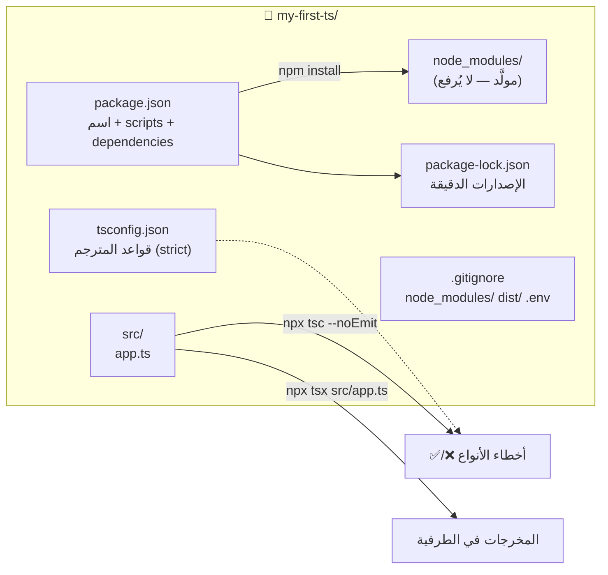

# Module 1.0 — تجهيز البيئة: Node.js و TypeScript والمحرر
## Setting Up: Node.js, TypeScript, Editor

> **المستوى:** Level 1 — Programming + Computational Thinking
> **الموقع:** أنت في [1 من 16] في هذا المستوى
> **السابق:** [Checkpoint 0](../level-0-absolute-foundations/checkpoint-0.md) | **التالي:** [Module 1.1 — Values, Variables, Types](module-1.1-values-variables-types.md)
> **⚠️ وحدة عملية:** في نهايتها يجب أن يعمل عندك ملف TypeScript بأمر واحد، وتضع breakpoint وتوقف البرنامج عنده.

---

## 1. المتطلبات (Prerequisites)

> **قبل أن تتعلم هذا، يجب أن تفهم:**
- [ ] Runtime (Node) ≠ لغة؛ `tsc` يحوّل TS → JS؛ compile-time vs runtime — [L0-M0.2](../level-0-absolute-foundations/module-02-programs-and-code.md)
- [ ] الطرفية، المسارات، `PATH`، متغيرات البيئة — [L0-M0.4](../level-0-absolute-foundations/module-04-files-terminal-shell.md)
- [ ] exit codes — [L0-M0.3](../level-0-absolute-foundations/module-03-running-a-program.md)

---

## 2. أهداف التعلّم (Learning Objectives)

- تثبيت Node.js (LTS) وفهم ما ثبّتَّه فعلًا (ثلاثة برامج: `node`, `npm`, `npx`).
- إنشاء مشروع TypeScript بإعداد **strict** وفهم كل سطر في `tsconfig.json` الذي تستخدمه.
- تشغيل ملف `.ts` بطريقتين: **تحقق أنواع** (`tsc --noEmit`) و**تنفيذ** (`tsx`).
- ضبط VS Code: formatter، وتشغيل **debugger** مع breakpoint — لأن الـ debugging يبدأ من اليوم الأول.
- معرفة ما هو `package.json` و`node_modules` و`package-lock.json` ولماذا لا يُرفع `node_modules` إلى Git.

---

## 3. شرح للمبتدئ (Beginner Explanation)

### ما الذي نثبّته ولماذا؟

من Level 0 تعرف: JavaScript لغة، **Node.js بيئة تشغيل** لها خارج المتصفح، و**TypeScript** طبقة أنواع فوقها تُحذف قبل التشغيل. لذلك نحتاج:

| الأداة | ما هي | لماذا |
|---|---|---|
| **Node.js** | بيئة التشغيل (V8 + مكتبات + event loop) | لتنفيذ JavaScript على جهازك |
| **npm** | مدير الحزم (Package Manager) يأتي مع Node | لتنزيل مكتبات (packages) الآخرين وتشغيل سكربتات المشروع |
| **npx** | يأتي مع npm | لتشغيل أداة من حزمة دون تثبيتها عالميًا |
| **typescript** (حزمة) | المترجم `tsc` | للتحقق من الأنواع وتحويل TS → JS |
| **tsx** (حزمة) | مشغّل TS مباشر | لتشغيل `.ts` بأمر واحد أثناء التطوير دون خطوة ترجمة يدوية |
| **VS Code** | محرر | إكمال تلقائي + أخطاء الأنواع لحظيًا + debugger مدمج |

### ما هو "المشروع" (Project)؟

مجلد فيه ملف **`package.json`**: بطاقة تعريف تقول اسم المشروع، الحزم التي يعتمد عليها (**dependencies**)، والأوامر المختصرة (**scripts**). عند `npm install`، تُنزَّل الحزم إلى مجلد **`node_modules/`** (قد يصبح ضخمًا — مئات الميغابايت — لذلك **لا يُرفع إلى Git**؛ يُعاد توليده من `package.json`). ملف **`package-lock.json`** يثبّت **الإصدارات الدقيقة** التي نُزّلت، حتى يحصل زميلك على نفسها بالضبط (تذكّر من L0: بيئة التشغيل جزء من البرنامج).

### لماذا `strict` منذ اليوم الأول؟

TypeScript بدون `strict` يسمح بـ `any` ضمني ويتغاضى عن `null`. أي أنك تدفع ثمن كتابة الأنواع بلا الحماية. **`strict: true`** يجعل المترجم يمسك الأخطاء التي صُمم لمسكها. ستشعر أنه "يزعجك" في البداية؛ هذا شعور نظام إنذار يعمل.

---

## 4. النموذج الذهني (Mental Model)

```
   أنت تكتب            تحقق (compile-time)            تنفيذ (runtime)
   ─────────           ─────────────────────           ─────────────────
   app.ts  ───────▶   npx tsc --noEmit   ─── ✅ ───▶   npx tsx app.ts
                      (يقرأ tsconfig.json)              (يحذف الأنواع ويشغّل بـ Node)
                            │
                            └── ❌ أخطاء أنواع → أصلحها قبل أن تشغّل
```

**قاعدة العمل اليومي:** احفظ → انظر إلى الخط الأحمر في المحرر → شغّل. الأخطاء التي يمسكها المحرر **لا تصل** إلى التشغيل.

---

## 5. الرسم التوضيحي (Visual Diagram)



---

## 6. مثال بسيط (Simple Example)

**التثبيت والتحقق:**

```bash
# 1) ثبّت Node LTS من nodejs.org (أو عبر nvm/fnm — موصى به لإدارة الإصدارات)
node --version     # v20.x أو v22.x
npm --version
npx --version

# 2) أنشئ المشروع
mkdir my-first-ts && cd my-first-ts
npm init -y                               # ينشئ package.json
npm install --save-dev typescript tsx     # أدوات تطوير (devDependencies)
npx tsc --init --strict --target es2023 --module nodenext --moduleResolution nodenext --outDir dist --rootDir src
mkdir src
```

**`tsconfig.json` (الأسطر التي تهمك):**
```jsonc
{
  "compilerOptions": {
    "target": "es2023",             // أي إصدار JS يُنتج (Node 22 يفهم es2023: toSorted, findLast...)
    "module": "nodenext",           // نظام الوحدات (import/export) بأسلوب Node
    "moduleResolution": "nodenext",
    "rootDir": "src",               // أين الكود المصدري
    "outDir": "dist",               // أين يُكتب JS الناتج (إن ترجمت)
    "strict": true,                 // ⬅ كل الفحوصات الصارمة
    "noUncheckedIndexedAccess": true, // ⬅ arr[i] و obj[key] نوعهما T | undefined — يجبرك على الفحص (ستشكره في M1.3/M1.5)
    "esModuleInterop": true,
    "skipLibCheck": true
  },
  "include": ["src"]
}
```

في `package.json` اجعل المشروع ESM وأضف scripts:
```jsonc
{
  "type": "module",
  "scripts": {
    "dev": "tsx src/app.ts",
    "typecheck": "tsc --noEmit",
    "build": "tsc",
    "start": "node dist/app.js"
  }
}
```

**`.gitignore`:**
```
node_modules/
dist/
.env
```

---

## 7. مثال كود (Code Example)

**`src/app.ts`:**
```typescript
// أول برنامج: يستقبل اسمًا من سطر الأوامر ويحيّي
const name: string = process.argv[2] ?? "World";   // ?? = إن كان undefined استخدم "World"
const greeting: string = `Hello, ${name}!`;
console.log(greeting);
console.log(`Node ${process.version}, PID ${process.pid}`);  // من Level 0
```

```bash
npm run typecheck      # لا مخرجات = لا أخطاء ✅
npm run dev -- Ada     # Hello, Ada!  (-- يمرّر ما بعده للسكربت)
npm run build && npm start   # يترجم إلى dist/app.js ثم يشغّله بـ node مباشرة
```

**اجعل المترجم يمسك خطأ عمدًا:**
```typescript
const age: number = "25";   // ❌ Type 'string' is not assignable to type 'number'
```
`npm run typecheck` → خطأ. لاحظ أن المحرر أظهر الخط الأحمر **قبل** أن تشغّل أي شيء.

### إعداد VS Code والـ debugger

1. ثبّت امتداد **ESLint** و**Prettier** (اختياري الآن)، وفعّل *Format On Save*.
2. أنشئ `.vscode/launch.json`:
```jsonc
{
  "version": "0.2.0",
  "configurations": [
    {
      "type": "node",
      "request": "launch",
      "name": "Debug current TS file",
      "runtimeExecutable": "npx",
      "runtimeArgs": ["tsx"],
      "program": "${file}",
      "args": ["Ada"],
      "console": "integratedTerminal",
      "skipFiles": ["<node_internals>/**"]
    }
  ]
}
```
3. افتح `src/app.ts`، انقر يسار رقم السطر `const greeting` → نقطة حمراء (**breakpoint**). اضغط `F5`. البرنامج **يتوقف** هناك. في لوحة *Variables* ترى `name = "Ada"`. اضغط `F10` (Step Over) سطرًا سطرًا.

> هذه الحركة — إيقاف البرنامج والنظر داخله — هي أهم أداة ستستخدمها في الكورس كله. تدرّب عليها الآن قبل أن تحتاجها تحت ضغط.

---

## 8. مثال من العالم الحقيقي (Real-World Example)

افتح أي مشروع مفتوح المصدر بـ TypeScript على GitHub (مثلًا `fastify/fastify`). ستجد نفس الملفات: `package.json` (scripts: `test`, `build`, `lint`)، `tsconfig.json`، `.gitignore` يستثني `node_modules`. **البنية التي صنعتها للتو هي نفسها التي تستخدمها شركات ضخمة** — بإضافات فقط.

---

## 9. مثال من الإنتاج (Production Example)

**"يعمل على جهازي" — بسبب `node_modules`:** فريق لم يرفع `package-lock.json`. كل مطور حصل على إصدارات مختلفة قليلًا من الحزم. على خادم الإنتاج، `npm install` نزّل إصدارًا جديدًا من مكتبة فيه تغيير كاسر → انهار النشر. **الحل:** رفع `package-lock.json` دائمًا واستخدام `npm ci` (يثبّت **بالضبط** ما في الـ lock) في CI/الإنتاج بدل `npm install`.

---

## 10. مفاهيم خاطئة شائعة (Common Misconceptions)

| ❌ | ✅ |
|---|---|
| "tsx يجعل TypeScript يعمل في Node" | tsx **يحذف الأنواع** ويمرّر JS لـ Node. لا يتحقق من الأنواع! لذلك تحتاج `tsc --noEmit` بجانبه. |
| "`npm install -g` أفضل، أثبّت مرة واحدة" | التثبيت العالمي يسبب اختلاف إصدارات بين المشاريع. ثبّت محليًا، شغّل بـ `npx`. |
| "`node_modules` جزء من مشروعي يجب رفعه" | مولَّد من `package.json` + lock. يُستثنى دائمًا. |
| "`strict` للمحترفين، سأفعّله لاحقًا" | تفعيله لاحقًا يعني إصلاح مئات الأخطاء دفعة واحدة. فعّله من السطر الأول. |

---

## 11. أخطاء شائعة (Common Mistakes)

1. نسيان `"type": "module"` ثم الحيرة من أخطاء `import`/`require`.
2. تشغيل `tsc` بلا `--noEmit` فتمتلئ `src/` بملفات `.js` بجانب `.ts`.
3. تحرير `package-lock.json` يدويًا.
4. استخدام `any` لإسكات أول خطأ أنواع. (ستتعلم البديل في M1.15.)
5. عدم تجربة الـ debugger "لأن `console.log` يكفي" — سيكلفك ساعات في M1.11 (async).

---

## 12. تمرين تصحيح (Debugging Exercise)

```bash
$ npm run dev
> tsx src/app.ts
Error [ERR_MODULE_NOT_FOUND]: Cannot find module '/home/user/my-first-ts/src/utils' imported from /home/user/my-first-ts/src/app.ts
```
`src/app.ts` فيه: `import { add } from "./utils";` والملف `src/utils.ts` موجود.

<details><summary>💡 الحل</summary>

في وضع ESM مع `module: nodenext`، **الاستيراد يجب أن يذكر الامتداد كما سيكون بعد الترجمة**: `import { add } from "./utils.js";` (نعم `.js` حتى والملف `.ts` — لأن ما يعمل في النهاية هو JS). Observe (module not found) → Evidence (المسار بلا امتداد، الوضع ESM) → Hypothesis (قاعدة الامتداد) → Experiment (أضف `.js`) → ✅.
</details>

---

## 13. تمرين معماري (Architecture Exercise)

لماذا نفصل `typecheck` عن `dev`؟ ما المقايضة بين (أ) التحقق من الأنواع في كل تشغيل (أبطأ، أمان أعلى) و(ب) التشغيل السريع بـ tsx والتحقق منفصلًا (أسرع، قد تنسى)؟ أين تضع التحقق الإلزامي بحيث **لا يمكن** نسيانه؟ (تلميح: Level 5 — CI.)

---

## 14. الصلة بعصر الذكاء الاصطناعي (AI-Era Relevance)

AI سيقترح عليك إعدادات `tsconfig` بخيارات لا تفهمها، أو يضيف `"strict": false` "لحل" أخطاء. **القاعدة:** لا تقبل سطرًا في ملف إعداد لا تستطيع شرح ما يفعله. اسأل: *"ما الذي يتغير في سلوك المترجم بهذا الخيار، وما الخطر إن حذفته؟"*

---

## 15–17. ما يجب إتقانه / فهمه / تأجيله

- 🔴 **Master:** إنشاء مشروع، `strict`، الفرق بين typecheck والتنفيذ، breakpoint في VS Code، `.gitignore` لـ `node_modules`.
- 🟠 **Understand:** `package-lock.json` و`npm ci`، ESM والامتداد `.js` في الاستيراد، ما يفعله tsx.
- ⚪ **Defer:** bundlers (esbuild/webpack)، monorepos، ESLint rules بالتفصيل، `paths` aliases.

---

## 18. الخلاصة (Summary)

1. Node بيئة التشغيل، npm مدير الحزم، `tsc` المترجم، tsx المشغّل السريع.
2. المشروع = `package.json` + `tsconfig.json` + `src/`. `node_modules` مولَّد ولا يُرفع.
3. **`strict: true` منذ اليوم الأول.**
4. **typecheck** (`tsc --noEmit`) و**run** (`tsx`) خطوتان مختلفتان؛ الأولى تمسك الأخطاء قبل التشغيل.
5. تعلّمت وضع breakpoint — ستستخدمه في كل وحدة قادمة.

---

## 19. مراجع رسمية (Official References)

- Node.js downloads & release schedule: https://nodejs.org/en/about/previous-releases
- TypeScript — tsconfig reference: https://www.typescriptlang.org/tsconfig
- TypeScript — `strict`: https://www.typescriptlang.org/tsconfig#strict
- npm — `package.json`: https://docs.npmjs.com/cli/configuring-npm/package-json
- npm — `npm ci`: https://docs.npmjs.com/cli/commands/npm-ci
- tsx: https://tsx.is/
- VS Code — Node.js debugging: https://code.visualstudio.com/docs/nodejs/nodejs-debugging

---

## المصطلحات (Terminology)

| العربية | English |
|---|---|
| مدير الحزم | Package Manager (npm) |
| حزمة / مكتبة | Package / Library |
| اعتمادية | Dependency |
| اعتمادية تطوير | devDependency |
| ملف القفل | Lock file |
| سكربت (في package.json) | Script |
| وضع صارم | Strict mode |
| نقطة توقف | Breakpoint |
| تخطّي السطر / الدخول فيه | Step Over / Step Into |
| وحدات ES | ESM (ECMAScript Modules) |

> **التالي:** [Module 1.1 — Values, Variables, Types](module-1.1-values-variables-types.md)
