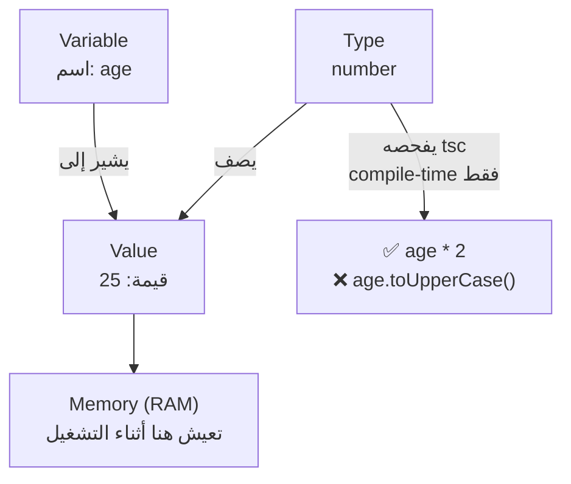
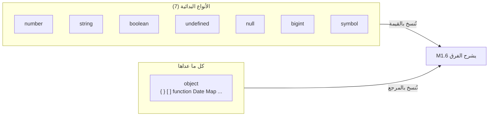

# Module 1.1 — القيم، المتغيرات، الأنواع
## Values, Variables, Types

> **المستوى:** Level 1 — Programming + Computational Thinking
> **الموقع:** [2 من 16]
> **السابق:** [Module 1.0 — Setup](module-1.0-setup.md) | **التالي:** [Module 1.2 — Expressions & Conditions](module-1.2-expressions-conditions.md)

---

## 1. المتطلبات (Prerequisites)

- [ ] RAM = مكان مؤقت تعيش فيه بيانات البرنامج — [L0-M0.1](../level-0-absolute-foundations/module-01-what-is-a-computer.md)
- [ ] compile-time vs runtime، الأنواع تُحذف قبل التشغيل — [L0-M0.2](../level-0-absolute-foundations/module-02-programs-and-code.md)
- [ ] تشغيل ملف `.ts` بـ `tsx` والتحقق بـ `tsc --noEmit` — [M1.0](module-1.0-setup.md)

---

## 2. أهداف التعلّم

- التفريق بين **القيمة** (value)، **المتغير** (variable)، و**النوع** (type).
- استخدام `const` افتراضيًا و`let` عند الحاجة، ومعرفة لماذا `var` مهجور.
- تسمية الأنواع البدائية السبعة في JavaScript ومعرفة متى تستخدم كلًّا منها.
- فهم `undefined` مقابل `null` ولماذا كلاهما موجود.
- كتابة **type annotations** في TypeScript ومعرفة متى يستنتجها المترجم وحده (**inference**).
- اكتشاف **التحويل الضمني** (implicit coercion) وتجنّبه.

---

## 3. شرح للمبتدئ

### القيمة (Value)

**القيمة** معلومة واحدة: `42`، `"Ahmed"`، `true`. كل قيمة تعيش في مكان ما في **RAM** أثناء التشغيل (Level 0). البرنامج في جوهره: قيم تدخل، قيم تتحوّل، قيم تخرج.

### المتغير (Variable)

**المتغير اسم يشير إلى قيمة.** تشبيه: **صندوق بملصق**. الملصق هو الاسم (`age`)، ما بداخله هو القيمة (`25`).

```typescript
let age = 25;        // صندوق اسمه age، فيه 25
age = 26;            // غيّرنا ما بداخل الصندوق
```

**نوعان من الصناديق في JavaScript الحديثة:**

| الكلمة | المعنى | متى |
|---|---|---|
| `const` | **الاسم يشير إلى نفس القيمة دائمًا** — لا إعادة إسناد | **افتراضيًا** (90% من الحالات) |
| `let` | يمكن إعادة الإسناد | عندما تحتاج فعلًا تغيير ما يشير إليه الاسم (عدّاد، تجميع) |
| `var` | قديم، قواعد نطاق غريبة | **لا تستخدمه** |

> لماذا `const` افتراضيًا؟ لأن كل متغير **لا يتغير** هو شيء أقل تحتاج تتبّعه في رأسك عند قراءة الكود. (وتنبيه مبكر: `const` يمنع **إعادة الإسناد**، لا يمنع تعديل **محتوى** كائن — سنفهم السبب في M1.6 وبعمق في L2-M3.)

### النوع (Type)

**النوع** يحدد **ما هي القيمة وما يمكن فعله بها**. `42` رقم: تستطيع ضربه. `"42"` نص: تستطيع معرفة طوله. ضرب نص؟ لا معنى له.

JavaScript فيها **7 أنواع بدائية** (primitive) + **الكائنات** (objects — M1.6):

| النوع | أمثلة | ملاحظات |
|---|---|---|
| `number` | `42`, `3.14`, `-7`, `NaN`, `Infinity` | رقم واحد للأعداد الصحيحة والعشرية. **عشري غير دقيق:** `0.1 + 0.2 === 0.30000000000000004`. **لا تخزن المال كـ number عشري** — استخدم أصغر وحدة (سنتات) كعدد صحيح. |
| `string` | `"hi"`, `'hi'`, `` `hi ${name}` `` | نص. غير قابل للتغيير (immutable): كل "تعديل" ينتج نصًا جديدًا. |
| `boolean` | `true`, `false` | نعم/لا. |
| `undefined` | `undefined` | "لا قيمة **بعد**" — متغير أُعلن ولم يُسند، خاصية غير موجودة، دالة لا تُرجع شيئًا. **تعطيه اللغة تلقائيًا.** |
| `null` | `null` | "لا قيمة **عمدًا**" — **أنت** تضعه لتقول "فارغ قصدًا". |
| `bigint` | `9007199254740993n` | أعداد صحيحة ضخمة. نادر. |
| `symbol` | `Symbol("id")` | معرّفات فريدة. نادر للمبتدئ. |

**القاعدة العملية لـ `undefined` و`null`:** `undefined` = غياب غير مقصود / افتراضي اللغة. `null` = غياب مقصود. في كودك، تعامل مع الاثنين بـ `??` و`?.` (M1.6).

### الأنواع في TypeScript: ملاحظات وقت الترجمة

TypeScript يضيف **تعليقًا توضيحيًا** (annotation) للنوع:

```typescript
let age: number = 25;
const name: string = "Ahmed";
let isActive: boolean = true;
```

لكن المترجم **ذكي**: إن أسندت قيمة فورًا، **يستنتج** النوع (**type inference**):

```typescript
let age = 25;          // TypeScript يعرف: number
age = "26";            // ❌ Type 'string' is not assignable to type 'number'
```

**متى تكتب النوع صراحةً؟** عندما لا توجد قيمة أولية، وفي **معاملات الدوال** و**ما تُرجعه** (M1.4) — أي عند **الحدود** بين أجزاء الكود. داخل الدالة، دع الاستنتاج يعمل.

### التحويل الضمني (Coercion) — فخ JavaScript

JavaScript تحوّل الأنواع **بصمت**:
```javascript
"5" + 3      // "53"   (رقم تحوّل إلى نص والتصق)
"5" - 3      // 2      (نص تحوّل إلى رقم!)
"5" * "2"    // 10
true + 1     // 2
[] + {}      // "[object Object]"
```
هذا سبب رئيسي لأخطاء غامضة. **TypeScript يمنع معظمها** عند الترجمة. وعند الحدود (مدخلات المستخدم، التي تصل دائمًا كنصوص) **حوّل صراحةً**: `Number("5")`, `String(5)`, `Boolean(x)`.

---

## 4. النموذج الذهني

```
   name  ───────▶  "Ahmed"          (متغير = ملصق يشير إلى قيمة في RAM)
   age   ───────▶   25
   age   ───────▶   26              (let: الملصق انتقل لقيمة أخرى)

   const PI ─────▶  3.14159         (const: الملصق مثبّت على هذه القيمة)

   Type = "ما هذا الشيء وماذا يحق لي أن أفعل به"
   TypeScript يتحقق من "ماذا يحق" قبل التشغيل، ثم يختفي.
```

---

## 5. الرسم التوضيحي





---

## 6. مثال بسيط

```typescript
const city = "Tlemcen";          // string (مستنتج)
let temperature = 31;            // number
let isRaining = false;           // boolean
let forecast;                    // ❌ any ضمني في strict؟ لا — نوعه 'any' ويحذّرك noImplicitAny إن استُخدم
let humidity: number | undefined; // ✅ صراحةً: رقم أو لم يُحدد بعد

temperature = temperature + 1;   // 32
isRaining = true;
city = "Oran";                   // ❌ Cannot assign to 'city' because it is a constant
```

---

## 7. مثال كود

```typescript
// src/values.ts — شغّله: npx tsx src/values.ts
// 1) typeof: اسأل القيمة عن نوعها وقت التشغيل
console.log(typeof 42);            // "number"
console.log(typeof "42");          // "string"
console.log(typeof true);          // "boolean"
console.log(typeof undefined);     // "undefined"
console.log(typeof null);          // "object"  ← خطأ تاريخي في JavaScript، احفظه كاستثناء
console.log(typeof {});            // "object"
console.log(typeof []);            // "object"  ← المصفوفة كائن

// 2) الأعداد العشرية غير دقيقة
console.log(0.1 + 0.2);            // 0.30000000000000004
console.log(0.1 + 0.2 === 0.3);    // false
// المال: خزّنه بالسنتات (عدد صحيح)
const priceCents = 1999;           // 19.99$
const total = priceCents * 3;      // 5997 — دقيق
console.log((total / 100).toFixed(2)); // "59.97" للعرض فقط

// 3) النصوص غير قابلة للتغيير
const s = "hello";
const upper = s.toUpperCase();     // نص جديد
console.log(s, upper);             // hello HELLO — الأصل لم يتغير

// 4) التحويل الصريح عند الحدود (مدخلات = نصوص دائمًا)
const raw = process.argv[2] ?? "0";   // string
const n = Number(raw);                // number أو NaN
if (Number.isNaN(n)) {
  console.error(`"${raw}" is not a number`);
  process.exit(1);
}
console.log(n * 2);

// 5) undefined vs null
let notYet: string | undefined;       // لم يُحدد بعد
let cleared: string | null = null;    // فارغ عمدًا
console.log(notYet, cleared);         // undefined null
```

---

## 8. مثال من العالم الحقيقي

نموذج تسجيل في موقع: حقل "العمر" يصل من المتصفح **كنص** `"25"` دائمًا (HTTP ينقل نصوصًا — L0-M0.6). إن قارنت `age > 18` بدون تحويل، JavaScript ستحوّل ضمنيًا وقد تنجح… حتى يأتي `"25 سنة"` → `NaN > 18` → `false` بصمت. **حوّل وتحقق عند الحدود.**

---

## 9. مثال من الإنتاج

**حادثة "الفاتورة بـ 0.1 + 0.2":** نظام فوترة يجمع مبالغ عشرية بـ `number`. بعد آلاف العمليات، الإجمالي ينحرف بسنتات، والمحاسبة لا تطابق البنك. **السبب:** تمثيل الأعداد العشرية الثنائي غير دقيق (L2-M2.1 يشرح لماذا). **الحل:** تخزين المال كعدد صحيح بأصغر وحدة، أو نوع `DECIMAL` في قاعدة البيانات (L3).

---

## 10. مفاهيم خاطئة شائعة

| ❌ | ✅ |
|---|---|
| "`const` يعني القيمة ثابتة" | يعني **الاسم لا يُعاد إسناده**. `const arr = []; arr.push(1)` صحيح (M1.6). |
| "`null` و`undefined` نفس الشيء" | `undefined` تعطيه اللغة (غياب غير مقصود)؛ `null` تضعه أنت (غياب مقصود). `null == undefined` صحيح بـ `==` لكن `===` يفرّق. |
| "TypeScript يحمي من `"25"` القادمة من المستخدم" | الأنواع تُحذف وقت التشغيل. المدخلات الخارجية تحتاج تحويلًا وتحققًا. |
| "`typeof null === 'object'` يعني null كائن" | خطأ تاريخي في اللغة. `null` نوع بدائي. |

## 11. أخطاء شائعة

1. `let` في كل مكان "احتياطًا". استخدم `const` حتى يشتكي المترجم.
2. المقارنة بـ `==` (تحويل ضمني). استخدم `===` دائمًا (M1.2).
3. تخزين المال كعدد عشري.
4. `let x;` بلا نوع ولا قيمة ثم استخدامه لاحقًا — اكتب `let x: T | undefined`.
5. التعامل مع `process.argv` أو `JSON.parse` كأنها تعطي النوع الذي تريده.

---

## 12. تمرين تصحيح

```typescript
const price = process.argv[2];
const qty = process.argv[3];
console.log("Total:", price * qty);
```
`npx tsc --noEmit` يشتكي. وإن تجاهلت وشغّلت `npx tsx` مع `10 3` تحصل على `30`، لكن مع `10 abc` تحصل `NaN`، ومع `10` فقط تحصل `NaN` أيضًا. اشرح الثلاثة وأصلح.

<details><summary>💡 الحل</summary>

- tsc: `process.argv[i]` نوعه `string | undefined`؛ ضرب نصوص غير مسموح — المترجم محق.
- `10 3`: تحويل ضمني `"10" * "3" = 30` — "نجاح" بالصدفة.
- `10 abc`: `"abc"` → `NaN`. `10` فقط: `undefined` → `NaN`.
- الإصلاح: تحقق من الوجود، حوّل بـ `Number`، افحص `Number.isNaN`، واخرج بـ exit 1 مع رسالة.

```typescript
const [rawPrice, rawQty] = process.argv.slice(2);
if (rawPrice === undefined || rawQty === undefined) { console.error("Usage: total <price> <qty>"); process.exit(1); }
const price = Number(rawPrice), qty = Number(rawQty);
if (Number.isNaN(price) || Number.isNaN(qty)) { console.error("price and qty must be numbers"); process.exit(1); }
console.log("Total:", price * qty);
```
</details>

## 13. تمرين معماري

تصمّم تمثيل "درجة الحرارة" في تطبيق طقس: `number` فقط؟ `{ value: number, unit: "C" | "F" }`؟ نص `"31°C"`؟ لكل خيار: ما الذي يسهل؟ ما الـ bug الذي يسمح به؟ (تلميح: مركبة Mars Climate Orbiter ضاعت بسبب خلط وحدات.)

## 14. الصلة بعصر AI

AI يكتب `let` حيث يكفي `const`، ويستخدم `number` للمال، ويثق بـ `JSON.parse` كأنه يعيد النوع المطلوب. **تحقق:** هل كل `let` ضروري؟ هل المبالغ أعداد صحيحة؟ أين تدخل البيانات من الخارج وهل تُحوَّل وتُفحص؟

## 15–17. Master / Understand / Defer

- 🔴 **Master:** value/variable/type؛ `const` افتراضيًا؛ الأنواع البدائية السبعة؛ `undefined` vs `null`؛ التحويل الصريح عند الحدود؛ `===`.
- 🟠 **Understand:** inference ومتى تكتب النوع؛ لماذا `0.1+0.2≠0.3`؛ النصوص immutable.
- ⚪ **Defer:** `bigint`/`symbol` بالتفصيل؛ تمثيل IEEE-754 (L2).

## 18. الخلاصة

1. **القيمة** معلومة في RAM؛ **المتغير** اسم يشير إليها؛ **النوع** يصف ما هي وما يُفعل بها.
2. `const` افتراضيًا، `let` عند الحاجة، `var` أبدًا.
3. 7 أنواع بدائية + الكائنات. `number` واحد للكل وغير دقيق عشريًا — المال بالسنتات.
4. `undefined` غياب تلقائي؛ `null` غياب مقصود.
5. TypeScript يستنتج؛ اكتب الأنواع عند الحدود؛ تُحذف وقت التشغيل → حوّل وتحقق من المدخلات الخارجية.
6. التحويل الضمني فخ؛ استخدم `===` والتحويل الصريح.

## 19. مراجع رسمية

- MDN — JavaScript data types and data structures: https://developer.mozilla.org/en-US/docs/Web/JavaScript/Data_structures
- MDN — `const`, `let`: https://developer.mozilla.org/en-US/docs/Web/JavaScript/Reference/Statements/const
- MDN — Number (floating point): https://developer.mozilla.org/en-US/docs/Web/JavaScript/Reference/Global_Objects/Number
- TypeScript Handbook — Everyday Types: https://www.typescriptlang.org/docs/handbook/2/everyday-types.html
- TypeScript — Type Inference: https://www.typescriptlang.org/docs/handbook/type-inference.html

## المصطلحات

| العربية | English |
|---|---|
| قيمة | Value |
| متغير | Variable |
| نوع | Type |
| نوع بدائي | Primitive type |
| إسناد / إعادة إسناد | Assignment / Reassignment |
| استنتاج النوع | Type inference |
| تعليق النوع | Type annotation |
| تحويل ضمني | Implicit coercion |
| تحويل صريح | Explicit conversion |
| غير قابل للتغيير | Immutable |
| ليس رقمًا | NaN (Not a Number) |

> **التالي:** [Module 1.2 — Expressions, Operators, Conditions](module-1.2-expressions-conditions.md)
