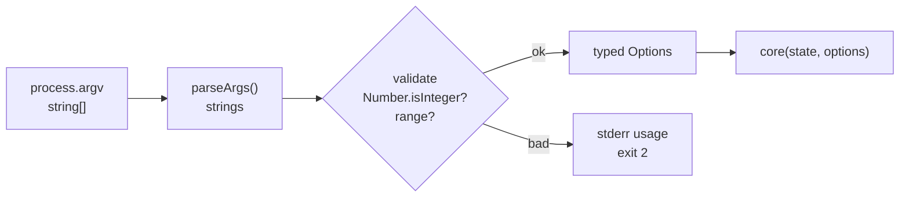
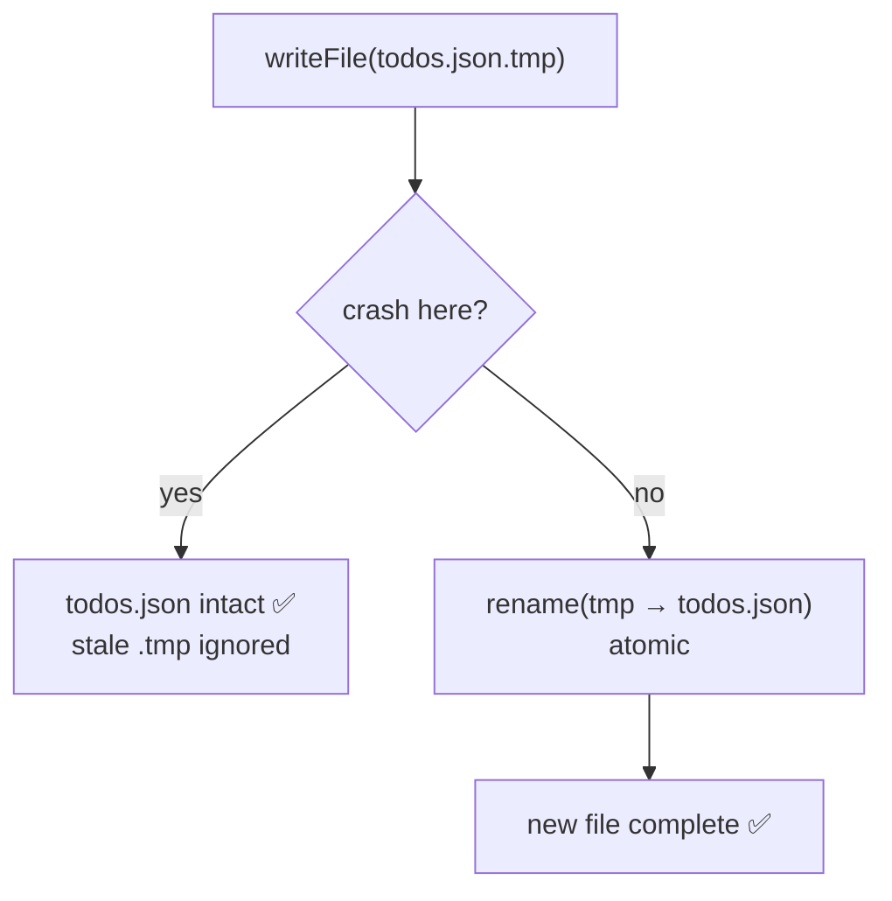

# Module 1.10 — الإدخال والإخراج
## Input/Output: argv, stdin/stdout, files, JSON, CSV

> **المستوى:** Level 1 | **الموقع:** [11 من 16]
> **السابق:** [M1.9 — Errors](module-1.9-errors.md) | **التالي:** [M1.11 — Async & the Event Loop](module-1.11-async-event-loop.md)

---

## 1. المتطلبات
- [ ] الملفات والمسارات وcwd وstdin/stdout/stderr — [L0-M0.4](../level-0-absolute-foundations/module-04-files-terminal-shell.md)
- [ ] JSON وحدوده — [M1.6](module-1.6-objects-references.md)
- [ ] الأخطاء وResult — [M1.9](module-1.9-errors.md)
- [ ] نواة/قشرة — [M1.7](module-1.7-state-side-effects-immutability.md)

## 2. أهداف التعلّم
- قراءة الوسائط `process.argv` ومتغيرات البيئة والتعامل معها كـ `string | undefined`.
- قراءة/كتابة الملفات بـ `node:fs/promises`، وبناء المسارات بـ `node:path`.
- قراءة stdin سطرًا سطرًا (أنابيب الـ shell).
- تحليل وتسلسل **JSON** و**CSV** (مع المصائد: الفواصل داخل الاقتباسات، BOM، أسطر Windows).
- تطبيق مبدأ **التحقق على الحدود**: كل ما يأتي من الخارج `unknown` حتى يُفحص.
- الكتابة الآمنة: الكتابة الذرية (write-to-temp-then-rename).

---

## 3. شرح للمبتدئ

### كل I/O = عبور حدود الثقة
داخل برنامجك الأنواع مضمونة (TypeScript). **خارجه** — ملفات، وسائط، شبكة، مستخدم — لا شيء مضمون. كل بايت يدخل هو `unknown` حتى **تحوّله وتتحقق منه**. هذا الخيط رافقك منذ L0؛ هنا تطبّقه فعليًا.

### 1) الوسائط: `process.argv`

```typescript
// node dist/main.js add "buy milk" --priority 2
process.argv
// ["/usr/bin/node", "/path/dist/main.js", "add", "buy milk", "--priority", "2"]
const args = process.argv.slice(2);     // ["add", "buy milk", "--priority", "2"]
```
كلها **نصوص**. `"2"` ليست 2. ومع `noUncheckedIndexedAccess` كل `args[i]` هو `string | undefined` — وهذا صحيح: المستخدم قد لا يمرّرها.

Node 18.3+ يملك محللًا مدمجًا:
```typescript
import { parseArgs } from "node:util";
const { values, positionals } = parseArgs({
  allowPositionals: true,
  options: { priority: { type: "string", short: "p" }, verbose: { type: "boolean", short: "v" } },
});
// positionals: ["add", "buy milk"], values: { priority: "2", verbose: undefined }
```
ما زال `priority` نصًا → حوّل وتحقق (`Number`, `Number.isInteger`, المدى).

### 2) متغيرات البيئة
```typescript
const port = process.env.PORT;        // string | undefined
```
نفس القاعدة: `undefined` إن غاب. القرار **fail fast** (L0-M0.4): إن كان إلزاميًا، افشل عند الإقلاع برسالة واضحة، لا بعد ساعة.

### 3) الملفات: `node:fs/promises` و`node:path`

```typescript
import { readFile, writeFile, mkdir, rename, stat } from "node:fs/promises";
import path from "node:path";

const dataDir = path.join(import.meta.dirname, "..", "data");     // مسار نسبي للملف الحالي، لا لـ cwd
await mkdir(dataDir, { recursive: true });                        // أنشئ إن لم يوجد (لا خطأ إن وُجد)

const file = path.join(dataDir, "todos.json");
const text = await readFile(file, "utf8");                        // بدون "utf8" تحصل على Buffer (بايتات)
await writeFile(file, JSON.stringify(data, null, 2) + "\n");
```

- **`path.join`** لا `"a" + "/" + "b"`: يتعامل مع `/` و`\` والفواصل المكررة.
- **`import.meta.dirname`** (Node 20.11+) = مجلد الملف الحالي؛ `process.cwd()` = من أين شُغّل البرنامج. الخلط بينهما bug كلاسيكي "يعمل من مجلد المشروع فقط".
- النسخ المتزامنة (`readFileSync`) موجودة؛ مقبولة لسكربت صغير يقرأ ملف إعدادات عند الإقلاع. في خادم: **لا** — تجمّد الكل (M1.11).
- `await` هنا: "انتظر انتهاء القرص دون تجميد البرنامج" — التفاصيل في M1.11؛ الآن اكتبها كما هي.

### 4) stdin — القراءة من الأنبوب

```typescript
import { createInterface } from "node:readline";
const rl = createInterface({ input: process.stdin });
let count = 0;
for await (const line of rl) {        // سطرًا سطرًا، دون تحميل الملف كله (streaming — L0)
  if (line.trim() !== "") count++;
}
console.log(count);
```
```bash
cat big.log | npx tsx src/count-lines.ts
npx tsx src/count-lines.ts < big.log
```
هكذا تصبح أداتك جزءًا من خط أنابيب Unix (L0-M0.4): `grep ERROR app.log | npx tsx src/summarize.ts`.

### 5) JSON — القراءة الآمنة

```typescript
const raw: unknown = JSON.parse(text);       // لا تكتب as Config هنا
// ثم تحقق (M1.9 parseConfig) أو استخدم مخططًا (schema) — M1.15
```
الكتابة: `JSON.stringify(v, null, 2)` + سطر جديد في النهاية (اتفاق الملفات النصية).

### 6) CSV — يبدو بسيطًا، وليس كذلك

```
product,qty,unit_cents,region
Mouse,3,2500,West
"Keyboard, Mechanical",1,7900,East      ← فاصلة داخل اقتباس!
"Monitor ""27in""",1,32000,West          ← اقتباس مزدوج مهرَّب
```
`line.split(",")` **يكسر** السطر الثالث. المصائد: فواصل داخل اقتباسات، اقتباسات مهرَّبة بـ `""`، أسطر `\r\n` من Windows، **BOM** (`\uFEFF` بايتات خفية في بداية ملفات Excel)، صفوف فارغة، عدد أعمدة مختلف.

قاعدة: محلل بسيط يكفي لـ CSV **تتحكم أنت في إنتاجه**؛ لملفات من الخارج استخدم مكتبة مختبرة (`csv-parse`) — ذكر المشكلة أهم من إعادة اختراع الحل. Project 2 يطلب منك كتابة محلل مصغّر يتعامل مع الاقتباسات، لتفهم لماذا المكتبات موجودة.

### 7) الكتابة الآمنة (atomic write)
إن انقطع التيار أثناء `writeFile(todos.json)`، قد يبقى الملف **نصف مكتوب** = JSON تالف = بياناتك ضاعت. الحل الكلاسيكي:
```typescript
const tmp = file + ".tmp";
await writeFile(tmp, content);
await rename(tmp, file);           // rename ذرّي على معظم أنظمة الملفات: إمّا القديم كاملًا أو الجديد كاملًا
```

---

## 4. النموذج الذهني

```
          ┌──────────── program (typed) ────────────┐
argv ───▶ │ parse+validate │   core (pure)   │ format │ ──▶ stdout / file
env  ───▶ │   (unknown →   │                 │        │ ──▶ stderr (errors)
stdin ──▶ │     typed)     │                 │        │
files ──▶ └────────────────┴─────────────────┴────────┘
                 ↑ الحدود: هنا فقط التحويل والتحقق
```

- كل الوارد: نص/بايت → حوّل → تحقق → نوع.
- cwd ≠ dirname. `path.join` دائمًا.
- stdin سطرًا سطرًا = streaming.
- اكتب لمؤقت ثم `rename`.

## 5. الرسم التوضيحي





## 6. مثال بسيط

```typescript
// src/echo-args.ts
import { parseArgs } from "node:util";
const { values, positionals } = parseArgs({ allowPositionals: true, options: { upper: { type: "boolean", short: "u" } } });
const text = positionals.join(" ");
if (!text) { console.error("usage: echo-args [-u] <words...>"); process.exit(2); }
console.log(values.upper ? text.toUpperCase() : text);
console.error(`(cwd=${process.cwd()}, HOME=${process.env.HOME ?? "?"})`);   // معلومات تشخيصية → stderr
```
```bash
npx tsx src/echo-args.ts -u hello world 2>/dev/null   # HELLO WORLD (أخفينا stderr)
```

## 7. مثال كود

```typescript
// src/csv-summary.ts — اقرأ CSV من ملف أو stdin، تحقق، لخّص، اكتب JSON ذرّيًا
import { readFile, writeFile, rename } from "node:fs/promises";
import { createInterface } from "node:readline";
import { parseArgs } from "node:util";

type Sale = { product: string; qty: number; unitCents: number; region: string };
type Result<T> = { ok: true; value: T } | { ok: false; error: string };

// محلل CSV مصغّر يحترم الاقتباسات ("a, b" و "" المهرَّب)
export function parseCsvLine(line: string): string[] {
  const out: string[] = []; let cur = ""; let inQ = false;
  for (let i = 0; i < line.length; i++) {
    const ch = line[i];
    if (inQ) {
      if (ch === '"' && line[i + 1] === '"') { cur += '"'; i++; }
      else if (ch === '"') inQ = false;
      else cur += ch;
    } else if (ch === '"') inQ = true;
    else if (ch === ",") { out.push(cur); cur = ""; }
    else cur += ch;
  }
  out.push(cur);
  return out;
}

export function toSale(cols: string[], lineNo: number): Result<Sale> {
  const [product, qtyS, unitS, region] = cols;
  if (cols.length !== 4) return { ok: false, error: `line ${lineNo}: expected 4 columns, got ${cols.length}` };
  const qty = Number(qtyS), unitCents = Number(unitS);
  if (!product) return { ok: false, error: `line ${lineNo}: empty product` };
  if (!Number.isInteger(qty) || qty <= 0) return { ok: false, error: `line ${lineNo}: bad qty "${qtyS}"` };
  if (!Number.isInteger(unitCents) || unitCents < 0) return { ok: false, error: `line ${lineNo}: bad unit_cents "${unitS}"` };
  if (!region) return { ok: false, error: `line ${lineNo}: empty region` };
  return { ok: true, value: { product, qty, unitCents, region } };
}

async function* readLines(file?: string): AsyncGenerator<string> {
  if (file) { for (const l of (await readFile(file, "utf8")).split(/\r?\n/)) yield l; }   // \r?\n: Windows/Unix
  else for await (const l of createInterface({ input: process.stdin })) yield l;
}

async function main(): Promise<number> {
  const { values, positionals } = parseArgs({ allowPositionals: true, options: { out: { type: "string", short: "o" } } });
  const input = positionals[0];
  const sales: Sale[] = []; const errors: string[] = [];
  let lineNo = 0;

  for await (let line of readLines(input)) {
    lineNo++;
    if (lineNo === 1) { line = line.replace(/^\uFEFF/, ""); continue; }   // BOM + header
    if (line.trim() === "") continue;
    const r = toSale(parseCsvLine(line), lineNo);
    r.ok ? sales.push(r.value) : errors.push(r.error);
  }

  for (const e of errors) console.error(e);
  if (sales.length === 0) { console.error("no valid rows"); return 1; }

  const revenue = sales.reduce((s, x) => s + x.qty * x.unitCents, 0);
  const report = { rows: sales.length, rejected: errors.length, revenueCents: revenue };

  if (values.out) {
    const tmp = values.out + ".tmp";
    await writeFile(tmp, JSON.stringify(report, null, 2) + "\n");
    await rename(tmp, values.out);
  } else console.log(JSON.stringify(report, null, 2));
  return errors.length > 0 ? 3 : 0;      // 3 = "نجح جزئيًا" (اتفاق خاص بأداتنا، موثّق في --help)
}

process.exit(await main());
```

```bash
printf 'product,qty,unit_cents,region\nMouse,3,2500,West\n"Keyboard, Mech",1,7900,East\nBad,x,1,West\n' > sales.csv
npx tsx src/csv-summary.ts sales.csv -o report.json; echo "exit=$?"
# line 4: bad qty "x"      (stderr)
# exit=3
cat report.json              # {"rows":2,"rejected":1,"revenueCents":15400}
cat sales.csv | npx tsx src/csv-summary.ts 2>/dev/null   # نفس التقرير على stdout
```

لاحظ الحدود: `parseCsvLine` و`toSale` **نقيتان وقابلتان للاختبار** بلا ملفات؛ `readLines`/`main` هما القشرة.

## 8. مثال من العالم الحقيقي
`git`, `npm`, `docker` — كلها CLI تقرأ argv/env/ملفات وتكتب stdout/stderr برموز خروج. ملفات CSV من Excel/البنوك/المحاسبة = الواقع اليومي لمعالجة البيانات. وكل خادم HTTP (Project 3) هو نفس النمط: بايتات من الشبكة → تحقق → نواة → بايتات للخارج.

## 9. مثال من الإنتاج
**حادثة "الـ BOM غير المرئي":** تقرير شهري من نظام مالي بصيغة CSV. المحلل يقارن `cols[0] === "product"` للتحقق من الترويسة → فشل دائمًا بعد ترقية النظام المصدر. السبب: الملف الجديد يبدأ بـ `\uFEFF` (BOM) غير المرئي → العمود الأول `"\uFEFFproduct"`. ثلاثة أيام من "لكن الملف يبدو صحيحًا!" **الدرس:** انظر إلى **البايتات** عند الشك (`xxd file | head`)، لا إلى ما يعرضه المحرر.

## 10. مفاهيم خاطئة شائعة

| ❌ | ✅ |
|---|---|
| "`argv[2]` رقم إن كتب المستخدم رقمًا" | دائمًا نص؛ حوّل وتحقق. |
| "`__dirname` موجود في ESM" | لا؛ `import.meta.dirname`. |
| "المسار النسبي نسبي لملفي" | نسبي لـ **cwd** (من أين شغّلت). |
| "`split(",")` يحلّل CSV" | يكسر مع الاقتباسات. |
| "readFileSync أبسط فلماذا async؟" | في سكربت صغير مقبول؛ في خادم يجمّد كل الطلبات. |

## 11. أخطاء شائعة
1. نسيان `"utf8"` → `Buffer` بدل نص (`JSON.parse` يعمل بالصدفة أحيانًا… وأحيانًا لا).
2. `JSON.parse(text) as Config` بلا تحقق.
3. كتابة التقرير إلى stdout **مع** رسائل التشخيص → تلوّث الأنبوب. التشخيص على stderr.
4. عدم إغلاق/انتظار الكتابة قبل `process.exit` (الملف فارغ!). انتظر `await writeFile` ثم اخرج.
5. تجاهل `\r` من ملفات Windows → آخر عمود فيه `\r` خفي.

## 12. تمرين تصحيح

```typescript
import { readFileSync, writeFileSync } from "node:fs";
const data = JSON.parse(readFileSync("data/todos.json"));
data.todos.push({ title: process.argv[2] });
writeFileSync("data/todos.json", JSON.stringify(data));
```
يعمل من مجلد المشروع، وينهار بـ `ENOENT` من أي مجلد آخر؛ ومرة أعاد ملفًا فارغًا بعد انقطاع كهرباء؛ و`title` أحيانًا `undefined` في الملف… اشرح الثلاثة وأصلح.

<details><summary>💡 الحل</summary>

1. **`ENOENT` من مجلد آخر:** `"data/todos.json"` نسبي لـ cwd. استخدم `path.join(import.meta.dirname, "..", "data", "todos.json")`.
2. **ملف فارغ بعد انقطاع:** `writeFileSync` مباشرة على الملف الأصلي؛ الانقطاع في المنتصف يترك ملفًا مبتورًا. اكتب إلى `.tmp` ثم `rename`.
3. **`title: undefined`:** `process.argv[2]` قد يكون `undefined` ولم يُتحقق منه؛ `JSON.stringify` يحذف الحقل → كائن `{}` في الملف. تحقق وافشل مبكرًا (exit 2 مع usage).
4. إضافة: `readFileSync` بلا `"utf8"`، و`JSON.parse` بلا تحقق (`data.todos` قد لا توجد)، و`push` يعدّل في مكانه (مقبول هنا لأن `data` محلية، لكن الأفضل بناء جديد).
</details>

## 13. تمرين معماري
أداة CLI تعالج ملف CSV بحجم 20 GB على جهاز بذاكرة 8 GB. `readFile` كاملًا مستحيل. صمّم: كيف تقرأ (streaming)؟ كيف تتعامل مع صف يمتد على سطرين (اقتباس يحوي `\n`)؟ أين تضع حد الأخطاء المقبولة؟ كيف تجعلها قابلة للاستئناف من الصف N (تذكر M1.3)؟ ما الذي يجب أن يظهر على stdout وما على stderr ليعمل في أنبوب؟

## 14. الصلة بعصر AI
AI يكتب `JSON.parse(x) as T`، `split(",")` للـ CSV، ومسارات نسبية لـ cwd، ويطبع كل شيء على stdout. **تحقق:** كل مدخل خارجي — أين يُتحقق منه؟ هل الـ CSV يحترم الاقتباسات؟ هل الكتابة ذرّية؟ هل stderr/stdout مفصولان؟ اطلب: *"عامل كل مدخل كـ unknown وتحقق منه؛ اكتب ذرّيًا؛ التشخيص على stderr."*

## 15–17. Master / Understand / Defer
- 🔴 `argv`/`env` نصوص → تحويل + تحقق؛ `readFile/writeFile` مع `utf8`؛ `path.join` + `import.meta.dirname` vs `cwd`؛ stdin سطرًا سطرًا؛ JSON آمن؛ stdout للنتيجة/stderr للتشخيص؛ exit codes.
- 🟠 `parseArgs`؛ مصائد CSV (اقتباسات، BOM، `\r\n`)؛ الكتابة الذرّية؛ متى Sync مقبول.
- ⚪ Streams API الكاملة (`pipeline`, Transform)؛ ترميزات غير UTF-8؛ أقفال الملفات؛ مكتبات CSV.

## 18. الخلاصة
1. **كل مدخل خارجي `unknown`** حتى يُحوَّل ويُتحقق — على الحدود فقط.
2. `argv`/`env` نصوص وقد تغيب.
3. المسارات: `path.join`؛ `import.meta.dirname` ≠ `cwd`.
4. stdin سطرًا سطرًا = أداة تعمل في الأنابيب.
5. CSV ليس `split(",")`.
6. اكتب لمؤقت ثم `rename`؛ النتيجة على stdout، التشخيص على stderr، رمز خروج ذو معنى.

## 19. مراجع رسمية
- Node.js — `process.argv`: https://nodejs.org/api/process.html#processargv
- Node.js — `util.parseArgs`: https://nodejs.org/api/util.html#utilparseargsconfig
- Node.js — File system (promises): https://nodejs.org/api/fs.html#promises-api
- Node.js — `path`: https://nodejs.org/api/path.html
- Node.js — `readline` async iteration: https://nodejs.org/api/readline.html#rlsymbolasynciterator
- RFC 4180 — CSV: https://www.rfc-editor.org/rfc/rfc4180

## المصطلحات
| العربية | English |
|---|---|
| إدخال/إخراج | I/O (Input/Output) |
| وسائط سطر الأوامر | Command-line arguments (`argv`) |
| موضعي / خيار | Positional / Option (flag) |
| الإدخال/الإخراج/الخطأ القياسي | stdin / stdout / stderr |
| تدفّق | Streaming |
| ترميز | Encoding (UTF-8) |
| علامة ترتيب البايت | BOM (Byte Order Mark) |
| كتابة ذرّية | Atomic write |
| مخزن بايتات | Buffer |
| تحقق على الحدود | Validate at the boundary |
| مولّد غير متزامن | Async generator |

> **التالي:** [Module 1.11 — Async & the Event Loop](module-1.11-async-event-loop.md)
