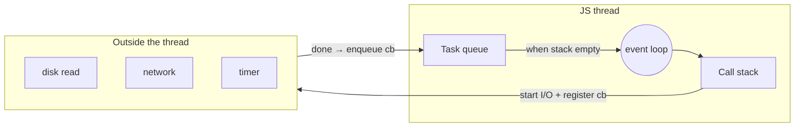
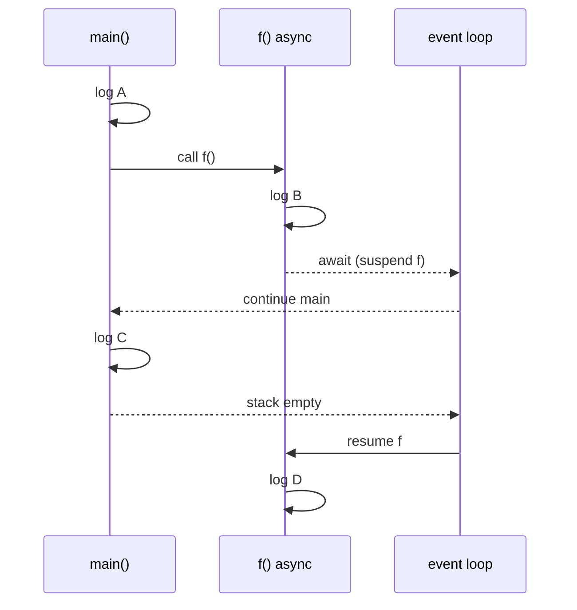

# Module 1.11 — اللاتزامن وحلقة الأحداث
## Async: Promises, async/await, the Event Loop

> **المستوى:** Level 1 | **الموقع:** [12 من 16]
> **السابق:** [M1.10 — I/O](module-1.10-io.md) | **التالي:** [M1.12 — Debugging](module-1.12-debugging.md)

---

## 1. المتطلبات
> **قبل أن تتعلم هذا، يجب أن تفهم:**
- [ ] جدول الكمون: RAM نانوثانية، قرص ميكرو/ملّي، شبكة ملّي — [L0-M0.3](../level-0-absolute-foundations/module-03-running-a-program.md)، [L0-M0.6](../level-0-absolute-foundations/module-06-network-client-server.md)
- [ ] الدوال كقيم، الإغلاقات، callbacks — [M1.4](module-1.4-functions-scope-closures.md)
- [ ] الأخطاء وtry/catch — [M1.9](module-1.9-errors.md)

## 2. أهداف التعلّم
- شرح **لماذا** يوجد اللاتزامن: I/O أبطأ من CPU بآلاف المرات، والخيط الواحد لا يجب أن ينتظر.
- وصف **حلقة الأحداث** (event loop) بنموذج ذهني صحيح: مكدس + طابور + "انتظر خارج المحرك".
- استخدام **Promise** و`async/await` وقراءة الترتيب الفعلي للتنفيذ.
- التفريق بين **تسلسلي** (`await` واحد تلو الآخر) و**متزامن** (`Promise.all`)، ومتى يُستخدم كل.
- التعامل مع أخطاء async (`try/catch` حول `await`، `.catch`، unhandled rejection).
- التعرف على **حجب الحلقة** (blocking) ومهلة الطلبات وتسرّب الـ Promise غير المنتظرة.

---

## 3. شرح للمبتدئ

### المشكلة
`await readFile(...)` ظهرت في M1.10 بلا شرح. حان الوقت.

تذكّر الأرقام (L0): جمع رقمين ~1 نانوثانية. قراءة من القرص ~100 ميكروثانية (100,000 ضعف). طلب شبكة ~50 ملّي ثانية (50,000,000 ضعف). لو **وقف** المعالج ينتظر الشبكة، لأضاع 50 مليون "فرصة عمل". في خادم يخدم آلاف الطلبات، الانتظار الأعمى يعني: طلب واحد بطيء = **كل** الطلبات تنتظر.

### الحل في JavaScript: خيط واحد لا ينتظر أبدًا

JavaScript تنفّذ كودك على **خيط واحد** (single thread). كيف تخدم آلاف الطلبات؟ **بألا تنتظر داخل الخيط.** عندما تطلب شيئًا بطيئًا (ملف، شبكة، مؤقّت):
1. تسلّم الطلب لـ **النظام** (Node/libuv/نظام التشغيل) الذي يعمل خارج خيطك.
2. تسجّل "عندما ينتهي، نادِ هذه الدالة" (**callback**).
3. **تكمل** تنفيذ ما بعده فورًا.
4. عندما ينتهي العمل البطيء، يوضع الـ callback في **طابور** (queue).
5. **حلقة الأحداث** (event loop): كلما **فرغ مكدس الاستدعاء** (M1.4)، تأخذ أول callback من الطابور وتنفّذه.

```typescript
console.log("1");
setTimeout(() => console.log("3 (after ≥0ms)"), 0);
console.log("2");
// 1, 2, 3 — حتى مع 0ms! لأن الـ callback ينتظر فراغ المكدس
```

هذه هي إجابة سؤال "لماذا الـ callbacks في حلقة `var i` طبعت 3,3,3" (M1.4): نُفّذت **بعد** انتهاء الحلقة كلها.

### Promise — "وعد بقيمة لاحقًا"

الـ callbacks تتداخل بقبح (callback hell). **Promise** = كائن يمثل عملية ستنتهي لاحقًا بـ **نجاح (fulfilled بقيمة)** أو **فشل (rejected بسبب)**.

```typescript
const p: Promise<string> = readFile("a.txt", "utf8");    // تبدأ القراءة فورًا؛ p "معلّقة" (pending)
p.then(text => console.log(text.length))                 // عند النجاح
 .catch(err => console.error("failed", err))             // عند الفشل
 .finally(() => console.log("done either way"));
```

### `async` / `await` — نفس Promise بصياغة متسلسلة

```typescript
async function countChars(path: string): Promise<number> {   // async → تعيد Promise دائمًا
  const text = await readFile(path, "utf8");                  // await: "علّق هذه الدالة حتى يُحل الوعد، وأطلق الخيط"
  return text.length;                                         // القيمة تُغلَّف في Promise<number>
}
```

**`await` لا يجمّد البرنامج.** يجمّد **هذه الدالة** فقط ويعيد التحكم لحلقة الأحداث؛ عندما تجهز القيمة، تُستأنف الدالة من حيث توقفت (نعم، هذا closure يحفظ متغيراتها). لذلك خادم بـ `await` واحد لقراءة DB يستمر في خدمة طلبات أخرى في الأثناء.

### الترتيب الفعلي — تتبّعه مرة واحدة بعناية

```typescript
async function f() {
  console.log("B");
  await null;                 // حتى await لقيمة جاهزة يؤجّل ما بعده
  console.log("D");
}
console.log("A");
f();
console.log("C");
// A, B, C, D
```
`f()` تعمل **بشكل متزامن حتى أول `await`** (تطبع B)، ثم تعلّق وتعود → تُطبع C → المكدس فرغ → تُستأنف f → D.

### تسلسلي vs متزامن (concurrent)

```typescript
// ❌ تسلسلي: 3 طلبات × 200ms = 600ms
const a = await fetchUser(1);
const b = await fetchUser(2);
const c = await fetchUser(3);

// ✅ متزامن: الثلاثة "في الهواء" معًا → ~200ms
const [a, b, c] = await Promise.all([fetchUser(1), fetchUser(2), fetchUser(3)]);
```
`Promise.all` يفشل كله إن فشل واحد. `Promise.allSettled` يعيد نتائج الجميع (نجاح/فشل) — مناسب لـ "حاول الكل وأبلغ". لا تطلق 10,000 طلب معًا: الخادم البعيد سيرفض؛ حدّد **التزامن** (concurrency limit) بدفعات (تمرين).

### الأخطاء في async

```typescript
try {
  const text = await readFile("missing.json", "utf8");
} catch (e) {                               // رفض الوعد يصبح استثناءً عند await ✅
  if ((e as NodeJS.ErrnoException).code === "ENOENT") { /* ... */ }
  else throw e;
}
```
**المصيدة:** Promise بلا `await` ولا `.catch` → إن فشلت = **unhandled rejection** → Node 15+ **يُسقط العملية** (exit 1). غالبًا بسبب نسيان `await`:
```typescript
saveToDisk(data);          // ❌ نسيت await: الخطأ يضيع/يُسقط العملية، والدالة تكمل قبل الحفظ
await saveToDisk(data);    // ✅
```
TypeScript يساعد: نوع `Promise<void>` مُهمل = علامة. (قاعدة ESLint `no-floating-promises` تكشفه آليًا — L4.)

### حجب الحلقة (Blocking) — الخطيئة الكبرى في Node

حلقة الأحداث تنفّذ callback **واحدًا** في كل مرة. إن استغرق callback ثانية كاملة (حلقة ثقيلة، `readFileSync` لملف ضخم، JSON.parse لـ 200MB)، فـ **لا شيء آخر** يحدث لثانية: لا طلبات، لا مؤقّتات. هذا الفرق بين "خادم يخدم 10,000 طلب/ثانية" و"خادم متجمد".
- I/O → async دائمًا.
- حساب ثقيل (CPU-bound، L0) → قسّمه، أو worker threads (L2-M6).

### المهلات (timeouts) — من L0 إلى الكود
```typescript
const res = await fetch(url, { signal: AbortSignal.timeout(5000) });   // ارمِ بعد 5 ثوانٍ
```
الوعد الذي **لا يُحلّ أبدًا** أسوأ من الذي يفشل: الدالة معلّقة للأبد وذاكرتها محجوزة. كل انتظار خارجي يحتاج مهلة.

---

## 4. النموذج الذهني

```
   ┌──────────── JS thread ────────────┐      ┌──── outside (Node/OS) ────┐
   │  Call Stack  (ينفّذ واحدًا فقط)      │      │ disk, network, timers      │
   │  ↑ يأخذ callback عندما يفرغ         │ ◀──── │ "انتهيت" → callback → queue│
   │  Callback Queue  [cb1][cb2]...      │      └───────────────────────────┘
   └───────────────────────────────────┘
   Event loop: while(true){ if(stack empty) run(queue.shift()) }

   await = "علّق هذه الدالة فقط، أطلق الخيط، استأنفني لاحقًا"
   Promise.all = انطلق معًا؛ await تلو await = واحد بعد الآخر
   callback طويل = الكل متجمد
```

## 5. الرسم التوضيحي

```mermaid
gantt
    title sequential vs concurrent (200ms each)
    dateFormat X
    axisFormat %L
    section await one by one
    user1 :0, 200
    user2 :200, 400
    user3 :400, 600
    section Promise.all
    user1 :0, 200
    user2 :0, 200
    user3 :0, 200
```







## 6. مثال بسيط

```typescript
const sleep = (ms: number) => new Promise<void>(r => setTimeout(r, ms));

console.time("seq");
await sleep(100); await sleep(100); await sleep(100);
console.timeEnd("seq");                                  // ~300ms

console.time("par");
await Promise.all([sleep(100), sleep(100), sleep(100)]);
console.timeEnd("par");                                  // ~100ms
```

## 7. مثال كود

```typescript
// src/fetch-many.ts — جلب عدة URLs بتزامن محدود، مهلة، وتقرير نجاح/فشل
type Outcome = { url: string; ok: true; ms: number; bytes: number } | { url: string; ok: false; ms: number; error: string };

async function fetchOne(url: string, timeoutMs: number): Promise<Outcome> {
  const start = performance.now();
  try {
    const res = await fetch(url, { signal: AbortSignal.timeout(timeoutMs) });
    const text = await res.text();
    const ms = Math.round(performance.now() - start);
    if (!res.ok) return { url, ok: false, ms, error: `HTTP ${res.status}` };     // تذكّر: 500 ليس استثناء! (L0-M0.6)
    return { url, ok: true, ms, bytes: text.length };
  } catch (e) {
    const ms = Math.round(performance.now() - start);
    const msg = e instanceof Error ? (e.name === "TimeoutError" ? "timeout" : e.message) : String(e);
    return { url, ok: false, ms, error: msg };
  }
}

// تزامن محدود: N "عمّال" يسحبون من طابور مشترك
async function mapLimit<T, R>(items: readonly T[], limit: number, fn: (x: T) => Promise<R>): Promise<R[]> {
  const results: R[] = new Array(items.length);
  let next = 0;
  async function worker() {
    while (next < items.length) {
      const i = next++;                       // آمن: خيط واحد، لا await بين القراءة والكتابة
      results[i] = await fn(items[i]!);
    }
  }
  await Promise.all(Array.from({ length: Math.min(limit, items.length) }, worker));
  return results;
}

const urls = process.argv.slice(2);
if (urls.length === 0) { console.error("usage: fetch-many <url>..."); process.exit(2); }

const outcomes = await mapLimit(urls, 3, u => fetchOne(u, 4000));
for (const o of outcomes) console.log(o.ok ? `✔ ${o.url} ${o.ms}ms ${o.bytes}B` : `✘ ${o.url} ${o.ms}ms ${o.error}`);
process.exit(outcomes.every(o => o.ok) ? 0 : 1);
```

```bash
npx tsx src/fetch-many.ts https://example.com https://httpbin.org/status/500 http://localhost:9 https://httpbin.org/delay/10
# ✔ https://example.com 180ms 1256B
# ✘ https://httpbin.org/status/500 210ms HTTP 500
# ✘ http://localhost:9 3ms fetch failed          (ECONNREFUSED — L0-M0.5)
# ✘ https://httpbin.org/delay/10 4001ms timeout
```

لاحظ السطر `const i = next++`: "آمن لأنه لا `await` بين القراءة والكتابة". هذه قاعدة Node الذهبية للحالة المشتركة: **الكود بين `await`ين يعمل دون انقطاع** — لكن أي `await` هو نقطة قد يتغير فيها العالم (race من L0-M0.7!).

## 8. مثال من العالم الحقيقي
- المتصفح: لو كان `fetch` يجمّد، لتجمّدت الصفحة كلها عند كل طلب. نفس حلقة الأحداث.
- خادم Node واحد يخدم آلاف الاتصالات المتزامنة لأن معظم وقته **انتظار** DB/شبكة — وهو لا ينتظر.
- أي "spinner" يدور بينما تُحمَّل البيانات = الخيط حر لرسم الـ spinner.

## 9. مثال من الإنتاج
**حادثة "الخادم الذي توقف كل ليلة في 02:00":** مهمة ليلية في **نفس عملية** الخادم تقرأ تقريرًا 300MB بـ `readFileSync` ثم `JSON.parse`. 4 ثوانٍ من الحجب الكامل → كل الطلبات في تلك الثواني انتظرت → موازن الحمل اعتبر الخادم ميتًا → أخرجه من الخدمة → تدفّق الحمل على الخوادم الأخرى → تساقطت تباعًا. **السبب الجذري:** حجب حلقة الأحداث. **الإصلاح:** عملية منفصلة للمهام الثقيلة (L5-M9 queues/workers) + streaming parse. **الدرس:** "4 ثوانٍ فقط" في Node = 4 ثوانٍ من **لا شيء**.

## 10. مفاهيم خاطئة شائعة

| ❌ | ✅ |
|---|---|
| "async يعني يعمل على خيط آخر" | كودك على خيط واحد؛ **الانتظار** هو ما يحدث خارجه. |
| "await يجمّد البرنامج" | يعلّق **الدالة الحالية** فقط. |
| "setTimeout(…, 0) ينفّذ فورًا" | بعد فراغ المكدس على الأقل. |
| "Promise.all تنفّذ بالتوازي على عدة أنوية" | **تزامن** (concurrency) للانتظار، لا **توازي** (parallelism) للحساب. CPU-bound لا يستفيد. |
| "Node بطيء لأنه خيط واحد" | ممتاز لـ I/O-bound؛ ضعيف لـ CPU-bound بلا workers. |

## 11. أخطاء شائعة
1. نسيان `await` → floating promise، تنفيذ بترتيب خاطئ، أخطاء تُسقط العملية.
2. `await` داخل `for` حيث يصلح `Promise.all` (بطء ×N)… أو `Promise.all` على 10,000 عنصر (إغراق).
3. `forEach(async ...)` — لا ينتظر شيئًا. استخدم `for...of` مع `await` أو `Promise.all(map)`.
4. انتظار بلا مهلة.
5. `readFileSync`/حلقة ثقيلة داخل معالج طلب.
6. افتراض أن الحالة لم تتغير **عبر** `await`.

## 12. تمرين تصحيح

```typescript
import { writeFile } from "node:fs/promises";

async function saveAll(items: string[]) {
  items.forEach(async (item, i) => {
    await writeFile(`out/${i}.txt`, item);
  });
  console.log("all saved");
}
await saveAll(["a", "b", "c"]);
process.exit(0);
// يطبع "all saved" ولا تُكتب أي ملفات (أو بعضها). لماذا؟
```

<details><summary>💡 الحل</summary>

`forEach` **لا ينتظر** الدوال async التي يستدعيها؛ يستدعيها كلها ويعود فورًا → تُطبع "all saved" بينما الكتابات "في الهواء" → `process.exit(0)` يقتل العملية قبل أن تكتمل. (ولو فشلت كتابة، لكان unhandled rejection.)

```typescript
async function saveAll(items: string[]) {
  await Promise.all(items.map((item, i) => writeFile(`out/${i}.txt`, item)));   // متزامن ومنتظَر
  // أو تسلسليًا: for (const [i, item] of items.entries()) await writeFile(...)
  console.log("all saved");
}
```
وأضف: إن فشل `out/` بعدم الوجود → `mkdir(..., { recursive: true })` أولًا (M1.10).
</details>

## 13. تمرين معماري
خدمة تستقبل طلب "ولّد تقرير PDF" يستغرق 30 ثانية CPU. اسأل: ماذا يحدث لحلقة الأحداث لو ولّدته داخل معالج الطلب؟ صمّم بديلًا: الطلب يعيد `202 Accepted` + معرّف فورًا؛ من ينفّذ العمل الثقيل (عملية/عامل)؟ كيف يعرف العميل أن التقرير جاهز (polling؟ webhook؟) ماذا لو مات العامل في المنتصف؟ (هذا تصميم L5-M9 وL7؛ الآن حدّد المشكلة والقيود.)

## 14. الصلة بعصر AI
AI ينسى `await` ويستخدم `forEach(async)` ويطلق `Promise.all` على آلاف العناصر ويترك fetch بلا مهلة. **تحقق:** ابحث عن استدعاءات تعيد Promise دون `await`/`return`/`.catch`؛ كل `forEach` مع `async`؛ كل `fetch` بلا `signal`. فعّل `@typescript-eslint/no-floating-promises` (L4) ليصطادها آليًا.

## 15. ما يجب إتقانه (Must Master) 🔴
- 🔴 لماذا async (الكمون)؛ خيط واحد + حلقة أحداث (مكدس/طابور/خارج)؛ Promise states؛ `async/await`؛ ترتيب A-B-C-D؛ `try/catch` حول `await`؛ `Promise.all` vs تسلسلي؛ نسيان `await`؛ الحجب؛ المهلات.

## 16. ما يجب فهمه (Should Understand) 🟠
- 🟠 `allSettled`؛ تزامن محدود؛ "آمن بين await-ين"؛ unhandled rejection تُسقط العملية؛ concurrency ≠ parallelism.

## 17. ما يمكن تأجيله (Can Defer) ⚪
- ⚪ microtasks vs macrotasks بالتفصيل؛ `process.nextTick`؛ worker threads (L2-M6)؛ streams backpressure؛ AbortController المركّب.

## 18. الخلاصة
1. I/O أبطأ من CPU بآلاف المرات؛ **لا تنتظر داخل الخيط**.
2. خيط واحد + حلقة أحداث: الانتظار يحدث خارج JS؛ الـ callbacks تُنفَّذ عندما يفرغ المكدس.
3. Promise = قيمة لاحقة؛ `await` يعلّق **الدالة** لا البرنامج.
4. تسلسلي عند الاعتماد، `Promise.all` عند الاستقلال، **بحدّ** للتزامن.
5. `await` كل Promise أو تعامل مع رفضه؛ المنسية تُسقط العملية.
6. لا تحجب الحلقة؛ كل انتظار خارجي يحتاج مهلة؛ العالم قد يتغير عبر كل `await`.

## 19. مراجع رسمية
- MDN — Using promises: https://developer.mozilla.org/en-US/docs/Web/JavaScript/Guide/Using_promises
- MDN — async function: https://developer.mozilla.org/en-US/docs/Web/JavaScript/Reference/Statements/async_function
- MDN — Event loop: https://developer.mozilla.org/en-US/docs/Web/JavaScript/Event_loop
- Node.js — The Node.js Event Loop: https://nodejs.org/en/learn/asynchronous-work/event-loop-timers-and-nexttick
- Node.js — Don't block the event loop: https://nodejs.org/en/learn/asynchronous-work/dont-block-the-event-loop
- MDN — `AbortSignal.timeout`: https://developer.mozilla.org/en-US/docs/Web/API/AbortSignal/timeout_static

## المصطلحات
| العربية | English |
|---|---|
| لاتزامن | Asynchronous (async) |
| حلقة الأحداث | Event loop |
| خيط واحد | Single-threaded |
| طابور المهام | Task queue |
| وعد | Promise |
| معلّق / محقَّق / مرفوض | Pending / Fulfilled / Rejected |
| تزامن / توازي | Concurrency / Parallelism |
| حجب | Blocking |
| وعد عائم | Floating promise |
| رفض غير معالج | Unhandled rejection |
| مهلة | Timeout |
| حد التزامن | Concurrency limit |
| مرتبط بالإدخال/الإخراج / بالمعالج | I/O-bound / CPU-bound |

> **التالي:** [Module 1.12 — Debugging as a Method](module-1.12-debugging.md)
