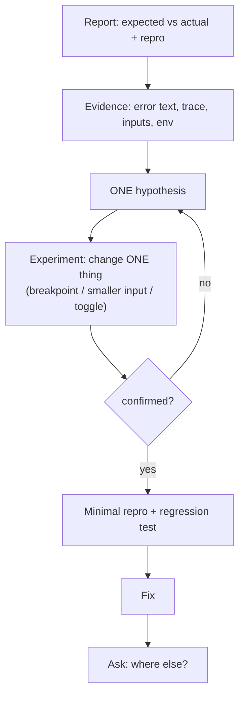
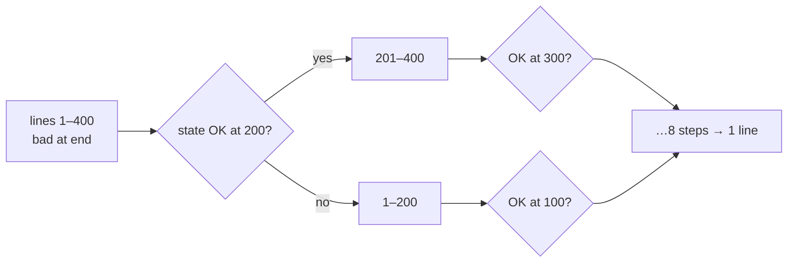

# Module 1.12 — التصحيح كمنهج
## Debugging as a Method: debugger, bisecting, reading errors

> **المستوى:** Level 1 | **الموقع:** [13 من 16]
> **السابق:** [M1.11 — Async & Event Loop](module-1.11-async-event-loop.md) | **التالي:** [M1.13 — Git I](module-1.13-git-1.md)

---

## 1. المتطلبات
> **قبل أن تتعلم هذا، يجب أن تفهم:**
- [ ] المنهج العلمي للتصحيح Observe→Evidence→Hypothesis→Experiment→Conclusion — [L0-M0.2](../level-0-absolute-foundations/module-02-programs-and-code.md)
- [ ] breakpoint/F5/F10 من الإعداد — [M1.0](module-1.0-setup.md)
- [ ] stack trace — [M1.4](module-1.4-functions-scope-closures.md)؛ الأخطاء — [M1.9](module-1.9-errors.md)؛ async — [M1.11](module-1.11-async-event-loop.md)

## 2. أهداف التعلّم
- تحويل "لا يعمل" إلى **تقرير قابل للتحقيق**: المتوقع، الفعلي، خطوات إعادة الإنتاج الدنيا.
- استخدام المصحّح باحتراف: breakpoints شرطية، Watch، Call Stack، Step Into/Over/Out، logpoints.
- قراءة رسائل الخطأ الشائعة في JS/TS/Node **وترجمتها إلى سبب محتمل**.
- تطبيق **التنصيف** (bisecting): تقليص مساحة البحث بالنصف في كل خطوة (في الكود، البيانات، الزمن).
- تصحيح الكود غير المتزامن (async stack traces، "من استدعى هذا؟").
- كتابة **أصغر مثال يعيد الإنتاج** (minimal reproduction) وإضافة اختبار يمنع العودة (تمهيد L4).

---

## 3. شرح للمبتدئ

### التصحيح ليس تخمينًا؛ هو تحقيق

المبتدئ يغيّر أشياء عشوائيًا حتى "يعمل". المحترف يُجيب أولًا عن ثلاثة أسئلة:
1. **ما المتوقع؟** (بدقة: "يُطبع 300")
2. **ما الفعلي؟** (بدقة: "يُطبع 0، بلا خطأ")
3. **ما أصغر خطوات تعيد إنتاجه كل مرة؟** (reproduction)

بلا (3) أنت تطارد شبحًا. bug "يحدث أحيانًا" يعني لم تجد المتغير المخفي بعد (الترتيب، الوقت، البيانات، البيئة، التزامن).

ثم الدورة من L0: **لاحظ → اجمع أدلة → افترض فرضية واحدة قابلة للدحض → جرّب تجربة تؤكدها أو تنفيها → استنتج.** فرضية واحدة في كل مرة. غيّر شيئًا **واحدًا** في كل تجربة.

### المصحّح (Debugger) — أداتك الأولى، لا `console.log`

`console.log` جيد لسؤال واحد سريع. المصحّح يجيب عن **كل** الأسئلة دون تعديل الكود:

| أداة | ماذا تفعل | متى |
|---|---|---|
| **Breakpoint** | توقف هنا | "ما قيم المتغيرات في هذه النقطة؟" |
| **Conditional breakpoint** (كليك يمين → Edit) | توقف فقط إذا `i === 4999` أو `user.id === "abc"` | الـ bug في الدورة رقم 5000 |
| **Logpoint** | اطبع تعبيرًا دون توقف ودون تعديل الكود | تتبع في حلقة سريعة |
| **Step Over (F10)** | نفّذ السطر وانتقل للتالي | المرور العادي |
| **Step Into (F11)** | ادخل الدالة المستدعاة | "ماذا يحدث داخلها؟" |
| **Step Out (Shift+F11)** | أكمل الدالة الحالية وعد للمستدعي | دخلت دالة مكتبة بالخطأ |
| **Call Stack** | من استدعى من | "كيف وصلنا هنا؟" |
| **Watch** | راقب تعبيرًا (`cart.items.length`) في كل توقف | تتبع قيمة عبر الزمن |
| **Debug Console** | نفّذ كودًا في سياق التوقف | "ماذا لو ناديت `f(x)` الآن؟" |
| **Break on exceptions** (Caught/Uncaught) | توقف عند الرمي | "أين بالضبط يُرمى؟" |

**مهارة اليوم:** عند أي سلوك غريب، ردّ فعلك الأول = **breakpoint + F5**، لا `console.log`.

### قاموس رسائل الخطأ → السبب المحتمل

| الرسالة | الترجمة | ابحث عن |
|---|---|---|
| `TypeError: Cannot read properties of undefined (reading 'x')` | شيء هو `undefined` وحاولت `.x` عليه | من أين جاء الـ `undefined`؟ `find` بلا نتيجة؟ `argv`؟ مفتاح خاطئ؟ (M1.2 narrowing) |
| `TypeError: x is not a function` | `x` ليس دالة | اسم خاطئ، نسيت import، أو `x` كان Promise (نسيت await) |
| `ReferenceError: y is not defined` | لا متغير بهذا الاسم في النطاق | إملاء، نطاق (M1.4)، نسيت الاستيراد |
| `SyntaxError: Unexpected token` | المحلل تاه | قوس/فاصلة؛ JSON غير صالح إن كانت من `JSON.parse` |
| `RangeError: Maximum call stack size exceeded` | استدعاء ذاتي بلا نهاية | recursion بلا شرط توقف |
| `ERR_MODULE_NOT_FOUND` | المسار/الامتداد | `.js` (M1.8)، اسم ملف |
| `EADDRINUSE` / `ECONNREFUSED` / `ENOENT` / `EACCES` | منفذ مشغول / لا أحد يسمع / لا ملف / لا أذونات | L0-M0.5، M1.10 |
| `UnhandledPromiseRejection` | Promise فشل بلا catch | نسيت await/catch (M1.11) |
| `TS2322: Type 'X' is not assignable to type 'Y'` | وعدك للنوع مخالف | اقرأ "X" و"Y" حرفيًا؛ غالبًا `| undefined` |
| `TS2532: Object is possibly 'undefined'` | TS محق | افحص قبل الاستخدام |

القاعدة: **اقرأ الرسالة كاملة، ثم السطر الأول من stack trace الذي يشير إلى ملفك أنت** (لا إلى `node:internal` أو `node_modules`).

### التنصيف (Bisecting) — اقسم المشكلة نصفين

لا تعرف أين الـ bug بين 400 سطر؟ ضع breakpoint/تحققًا في **المنتصف**: هل الحالة صحيحة هنا؟ نعم → الـ bug في النصف الثاني. لا → الأول. كرّر: 400 → 200 → 100 → … → 8 خطوات تكفي. ينطبق على:
- **الكود:** أين تفسد القيمة؟
- **البيانات:** ملف 10,000 سطر يفشل؟ جرّب النصف الأول. ثم نصفه. ستجد السطر المجرم في ~14 خطوة.
- **الزمن/التغييرات:** كان يعمل الأسبوع الماضي؟ `git bisect` (M1.14) يجد الـ commit المسبب آليًا.

### تصحيح async

- Node يعرض **async stack traces**: السطور `at async f (...)` تريك سلسلة الـ `await`. تأكد من قراءتها كلها.
- bug "يعمل أحيانًا"؟ اشتبه في **ترتيب** العمليات غير المتزامنة أو حالة تتغير عبر `await` (M1.11). اطبع طابعًا زمنيًا + معرّف العملية في logpoints.
- مع breakpoint داخل `async`، لوحة Call Stack تُظهر الإطارات غير المتزامنة أيضًا.

### أصغر مثال يعيد الإنتاج + اختبار

عندما تجد الـ bug: **لا تصلحه فورًا.** أولًا اكتب أصغر كود/مدخل يعيد إنتاجه (10 أسطر، لا 400). فائدتان: (1) تتأكد أنك فهمت السبب فعلًا، لا عرضًا؛ (2) يصبح **اختبارًا** يمنع عودته (regression test — L4-M11). ثم أصلح، ثم تأكد أن المثال لم يعد يفشل.

وأخيرًا اسأل: **"أين أيضًا يمكن أن يوجد نفس الخطأ؟"** الـ bug نادرًا ما يكون وحيدًا.

---

## 4. النموذج الذهني

```
"لا يعمل"  →  متوقع / فعلي / خطوات إعادة إنتاج
           →  Observe → Evidence → Hypothesis(واحدة) → Experiment(تغيير واحد) → Conclusion
           →  breakpoint أولًا، console.log ثانيًا
           →  اقرأ الرسالة + أول سطر من ملفك في الـ trace
           →  نصّف: كود / بيانات / تاريخ
           →  أصغر مثال → اختبار → إصلاح → "أين أيضًا؟"
```

## 5. الرسم التوضيحي





## 6. مثال بسيط

```typescript
// ضع breakpoint على السطر الذي فيه total += ... ثم Watch: total, p
const prices = [1200, 350, undefined as unknown as number, 99];
let total = 0;
for (const p of prices) total += p;
console.log(total);   // NaN — في أي دورة أصبح NaN؟ (الجواب يظهر في Watch فورًا)
```

## 7. مثال كود

ملف `.vscode/launch.json` مُحسَّن للتصحيح (يبني على M1.0):

```json
{
  "version": "0.2.0",
  "configurations": [
    {
      "name": "Debug current TS file",
      "type": "node",
      "request": "launch",
      "runtimeExecutable": "npx",
      "runtimeArgs": ["tsx", "${file}"],
      "args": [],
      "cwd": "${workspaceFolder}",
      "console": "integratedTerminal",
      "skipFiles": ["<node_internals>/**", "${workspaceFolder}/node_modules/**"]
    },
    {
      "name": "Debug with args",
      "type": "node",
      "request": "launch",
      "runtimeExecutable": "npx",
      "runtimeArgs": ["tsx", "src/csv-summary.ts"],
      "args": ["sales.csv", "-o", "report.json"],
      "cwd": "${workspaceFolder}",
      "console": "integratedTerminal",
      "skipFiles": ["<node_internals>/**"]
    }
  ]
}
```
- `skipFiles` يجعل Step Into يتخطى كود Node والمكتبات → تبقى في كودك.
- من الطرفية: `node --inspect-brk --import tsx src/x.ts` ثم "Attach" من VS Code أو `chrome://inspect`.

تدريب موجّه على bug async حقيقي:
```typescript
// src/race.ts — "الرصيد أحيانًا خاطئ" (تذكّر read-modify-write من L0-M0.7)
const sleep = (ms: number) => new Promise<void>(r => setTimeout(r, ms));
let balance = 100;
async function withdraw(amount: number, label: string) {
  const current = balance;                 // 1) اقرأ
  await sleep(10);                         // 2) "استشارة قاعدة البيانات" — نقطة يتغير فيها العالم
  if (current >= amount) balance = current - amount;   // 3) اكتب بناءً على قراءة قديمة
  console.log(label, "→ balance", balance);
}
await Promise.all([withdraw(80, "A"), withdraw(50, "B")]);
console.log("final", balance);   // متوقع 20 (أحدهما يُرفض)؛ فعلي 50 — سُحب 130 من 100!
```
ضع **logpoint** على السطر 3 بالنص `{label} read {current} writes {current - amount}` وشغّل. سترى أن كلاهما قرأ 100. هذا race condition أمام عينيك — والحل (قفل/معاملة ذرّية) في L3-M14 وL5-M6؛ هنا الهدف **رؤيته** بالأدوات.

## 8. مثال من العالم الحقيقي
مهندس دعم في شركة SaaS: "العميل يقول التقرير فارغ" → يطلب: أي تقرير، أي حساب، أي وقت، لقطة شاشة، هل يتكرر؟ → يستخرج نفس المدخلات → يعيد الإنتاج محليًا → breakpoint → السبب. 80% من وقت المهندسين الحقيقي هو هذا، لا كتابة كود جديد.

## 9. مثال من الإنتاج
**حادثة "الاختفاء الذي استغرق 3 أيام":** طلبات بعض المستخدمين تُرفض بـ 400 دون سبب. ثلاثة مهندسين خمّنوا (الكاش؟ الإصدار؟ المتصفح؟) وغيّروا أشياء. اليوم الثالث: مهندسة طلبت **المدخل الخام** (raw request body) لحالة فاشلة واحدة، نصّفت الحقول حتى بقي حقل واحد: اسم العميل يحوي حرفًا بعرض صفر من النسخ من Word. **الدرس:** يوم من التخمين أغلى من ساعة من جمع الأدلة والتنصيف.

## 10. مفاهيم خاطئة شائعة

| ❌ | ✅ |
|---|---|
| "المصحّح للمحترفين؛ console.log أسرع" | المصحّح أسرع من الدقيقة الثالثة فصاعدًا، ولا يترك آثارًا في الكود. |
| "الخطأ في المكتبة/Node/الحاسوب" | في 99.9% الخطأ في كودك أو فهمك. ابدأ من هناك. |
| "إن اختفى الـ bug فقد أُصلح" | إن لم تفهم **لماذا** اختفى، سيعود. |
| "غيّر عدة أشياء دفعة واحدة لتوفير الوقت" | لن تعرف أيها أصلح أو أفسد. |

## 11. أخطاء شائعة
1. قراءة أول 5 كلمات من الخطأ فقط.
2. النظر إلى سطر في `node_modules` بدل أول سطر من ملفك.
3. `console.log(obj)` لكائن يتغير لاحقًا (المرجع! M1.6) → ترى القيمة النهائية لا اللحظية. استخدم `structuredClone` أو breakpoint.
4. نسيان حفظ الملف/إعادة التشغيل ثم "لم يتغير شيء".
5. تصحيح نسخة مبنية قديمة (`dist/`) بينما تعدّل `src/`.

## 12. تمرين تصحيح

```typescript
// src/grades.ts — "متوسط الدرجات خاطئ لبعض الطلاب فقط"
type Student = { name: string; grades: number[] };
const students: Student[] = [
  { name: "A", grades: [80, 90] },
  { name: "B", grades: [] },
  { name: "C", grades: [70, 75, 80] },
];
function average(xs: number[]) { return xs.reduce((s, x) => s + x) / xs.length; }
for (const s of students) console.log(s.name, average(s.grades));
// A 85 ✅ ، ثم ينهار: TypeError: Reduce of empty array with no initial value
// بعد "إصلاح" بإضافة 0 كقيمة أولية → B NaN
```
طبّق المنهج: اكتب المتوقع/الفعلي، ضع breakpoint شرطيًا `s.name === "B"`، وأصلح **التصميم** لا العرض.

<details><summary>💡 الحل</summary>

- **المتوقع:** متوسط لكل طالب، أو رسالة "لا درجات". **الفعلي:** استثناء لـ B (reduce بلا قيمة أولية على مصفوفة فارغة — M1.5)، وبعد الترقيع: `0/0 = NaN`.
- الفرضية: الحالة الحدية "مصفوفة فارغة" غير معرّفة في التصميم. التجربة: breakpoint شرطي يؤكد `xs.length === 0`.
- الإصلاح الصحيح يجعل الحالة **صريحة في التوقيع**:
```typescript
function average(xs: readonly number[]): number | undefined {
  if (xs.length === 0) return undefined;
  return xs.reduce((s, x) => s + x, 0) / xs.length;
}
for (const s of students) { const a = average(s.grades); console.log(s.name, a === undefined ? "no grades" : a.toFixed(1)); }
```
- "أين أيضًا؟" أي دالة أخرى تقسم على `length`؟ أي `reduce` بلا قيمة أولية؟ ابحث في المشروع.
- أصغر إعادة إنتاج: `average([])` → اجعلها اختبارًا.
</details>

## 13. تمرين معماري
يصلك تقرير: "التطبيق بطيء أحيانًا في الصباح". لا رسالة خطأ. صمّم **عملية تحقيق**: ما الأدلة التي تحتاجها (سجلات بطوابع زمنية، أزمنة الطلبات، حمل الخادم، مهام مجدولة)؟ كيف تنصّف الزمن (أي ساعة؟ أي يوم؟ منذ أي نشر؟) كيف تعيد الإنتاج شيئًا "أحيانًا"؟ ماذا تضيف للنظام **الآن** ليكون التحقيق القادم أسهل (تمهيد observability L6-M6)؟

## 14. الصلة بعصر AI
AI ممتاز في **اقتراح فرضيات** من رسالة خطأ، وسيئ في **التحقق** منها — سيقترح 5 أسباب بثقة متساوية، وبعضها خاطئ. استخدمه لتوسيع قائمة الفرضيات، ثم **جرّب بنفسك بالمصحّح**. أعطه: الرسالة كاملة، أول سطر من ملفك في الـ trace، المدخل الخام، أصغر إعادة إنتاج — لا "لا يعمل". ولا تدعه "يصلح" ما لم تفهم سببه؛ غالبًا سيخفي العرض.

## 15. ما يجب إتقانه (Must Master) 🔴
- 🔴 متوقع/فعلي/إعادة إنتاج؛ دورة الفرضية-التجربة بتغيير واحد؛ breakpoint/Step/Call Stack/Watch؛ قاموس الأخطاء الأساسية؛ قراءة أول سطر من ملفك؛ التنصيف؛ أصغر إعادة إنتاج.

## 16. ما يجب فهمه (Should Understand) 🟠
- 🟠 breakpoints شرطية وlogpoints؛ `skipFiles`؛ Break on exceptions؛ async traces؛ "أين أيضًا؟"؛ تحويل الإعادة إلى اختبار.

## 17. ما يمكن تأجيله (Can Defer) ⚪
- ⚪ `--inspect` عن بُعد؛ heap snapshots/CPU profiles (L7-M8)؛ `git bisect` (M1.14)؛ تصحيح في الإنتاج بالسجلات والتتبع (L6-M6).

## 18. الخلاصة
1. التصحيح **تحقيق**: متوقع، فعلي، إعادة إنتاج — ثم فرضية واحدة وتجربة واحدة.
2. **المصحّح أولًا**: breakpoint، Step، Call Stack، Watch، شروط، logpoints.
3. اقرأ الرسالة كاملة + أول سطر من **ملفك** في الـ trace؛ احفظ القاموس.
4. **نصّف** الكود/البيانات/الزمن.
5. في async: اشتبه في الترتيب وفي الحالة عبر `await`.
6. أصغر إعادة إنتاج → اختبار → إصلاح → "أين أيضًا؟"

## 19. مراجع رسمية
- VS Code — Debugging: https://code.visualstudio.com/docs/editor/debugging
- VS Code — Node.js debugging: https://code.visualstudio.com/docs/nodejs/nodejs-debugging
- Node.js — Debugging guide: https://nodejs.org/en/learn/getting-started/debugging
- MDN — JavaScript error reference: https://developer.mozilla.org/en-US/docs/Web/JavaScript/Reference/Errors

## المصطلحات
| العربية | English |
|---|---|
| تصحيح | Debugging |
| إعادة إنتاج | Reproduction (repro) |
| نقطة توقف (شرطية) | (Conditional) Breakpoint |
| نقطة تسجيل | Logpoint |
| خطوة فوق/داخل/خارج | Step Over / Into / Out |
| مراقبة | Watch |
| تنصيف | Bisecting |
| أصغر مثال يعيد الإنتاج | Minimal reproduction |
| اختبار انحدار | Regression test |
| حالة سباق | Race condition |
| حالة حدية | Edge case |
| السبب الجذري | Root cause |

> **التالي:** [Module 1.13 — Git I: Snapshots, Commits, Branches](module-1.13-git-1.md)
