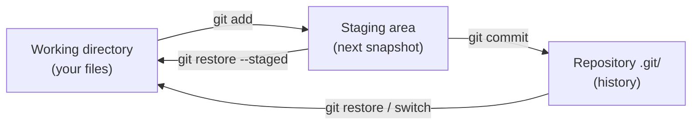
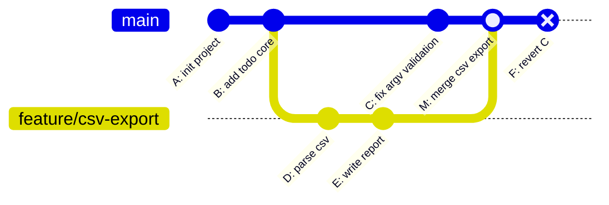

# Module 1.13 — Git I: اللقطات، الالتزامات، الفروع
## Git I: Snapshots, Commits, Branches

> **المستوى:** Level 1 | **الموقع:** [14 من 16]
> **السابق:** [M1.12 — Debugging](module-1.12-debugging.md) | **التالي:** [M1.14 — Git II](module-1.14-git-2.md)

---

## 1. المتطلبات
> **قبل أن تتعلم هذا، يجب أن تفهم:**
- [ ] الطرفية، المسارات، الملفات المخفية — [L0-M0.4](../level-0-absolute-foundations/module-04-files-terminal-shell.md)
- [ ] فكرة اللقطة الثابتة — [M1.7](module-1.7-state-side-effects-immutability.md)

## 2. أهداف التعلّم
- شرح **ما يخزّنه Git فعلًا** (لقطات كاملة مرتبطة، لا "فروقات")، و**لماذا** (التاريخ لا يُفسد).
- فهم المناطق الثلاث: **Working directory → Staging (index) → Repository**.
- الدورة اليومية: `status`, `diff`, `add -p`, `commit`, `log`.
- كتابة **رسائل commit** مفيدة و**التزامات صغيرة ذرّية**.
- إنشاء/تبديل/دمج **فروع** (branches) وفهم أن الفرع مجرد مؤشر.
- التراجع الآمن: `restore`, `revert`, وقراءة `reflog` كشبكة أمان.
- `.gitignore` ولماذا `node_modules` و`.env` لا يُلتزمان أبدًا.

---

## 3. شرح للمبتدئ

### المشكلة التي يحلها Git
`project-final-v2-REAL-fixed.zip`. تعرفها. والأسوأ: "كان يعمل أمس، ماذا غيّرت؟" و"زميلي وأنا عدّلنا نفس الملف". **Git** = نظام **تحكم بالإصدارات** (version control): يحفظ تاريخ مشروعك كسلسلة **لقطات** (snapshots) يمكنك العودة إليها ومقارنتها والتفرّع منها والدمج بينها.

### ما يخزّنه Git: لقطات، لا فروقات

كل **commit** = لقطة كاملة لكل الملفات (مضغوطة بذكاء؛ الملفات غير المتغيرة تُشارَك) + رسالة + المؤلف + الوقت + **مؤشر إلى الـ commit السابق** (parent). كل commit يُسمّى بـ **hash** (مثل `a1b2c3d…`) محسوب من محتواه **ومن أبيه**. لذلك:
- لا يمكن تعديل commit قديم دون تغيير hash كل ما بعده → **التاريخ غير قابل للتزوير بصمت** (الثبات من M1.7 حرفيًا).
- "الفرق" (diff) يُحسب عند الطلب بمقارنة لقطتين.

### المناطق الثلاث

```
Working directory  ──git add──▶  Staging area (index)  ──git commit──▶  Repository (.git/)
 ملفاتك كما تراها                "ما سأضمّه في اللقطة القادمة"             التاريخ الدائم
```
لماذا منطقة وسطى؟ لتختار **ما** يدخل في الـ commit. عدّلت 5 ملفات لسببين مختلفين؟ اصنع commit-ين نظيفين بدل واحد مختلط.

### الدورة اليومية

```bash
git init                       # مرة واحدة: أنشئ مستودعًا (مجلد .git/ مخفي)
git status                     # ما الذي تغيّر؟ ما المُدرَج (staged)؟   ← اكتبها 50 مرة يوميًا
git diff                       # الفروقات غير المُدرَجة (working vs staging)
git diff --staged              # ما سيدخل الـ commit (staging vs last commit)
git add src/core/todo.ts       # أدرج ملفًا
git add -p                     # أدرج **أجزاء** (hunks) تفاعليًا — أداة الالتزامات النظيفة
git commit -m "Add done action to todo reducer"
git log --oneline --graph --all   # التاريخ كرسم
git show HEAD                  # ماذا في آخر commit
```

**`HEAD`** = "أين أنا الآن" (عادة آخر commit في الفرع الحالي).

### رسائل commit جيدة

```
Reject negative quantities in cart reducer        ← سطر موضوع: فعل أمر، ≤ 50 حرفًا، ماذا تغيّر
                                                  ← سطر فارغ
Quantities <= 0 were silently accepted and produced negative
totals (see incident in M0.7). Validation now happens in the
reducer so every entry point (CLI, HTTP later) is covered.
```
الموضوع يقول **ماذا**؛ الجسم يقول **لماذا** (الكود نفسه يقول كيف). بعد 6 أشهر، "لماذا" هو ما ستبحث عنه.

**commit ذرّي:** تغيير واحد منطقي، يبني ويعمل. "أصلحت bug + أعدت تسمية 20 ملفًا + غيّرت التنسيق" = 3 commits. لماذا؟ المراجعة أسهل، `revert` ممكن لواحد دون الآخر، و`bisect` (M1.14) يجد المسبب بدقة.

### الفروع (Branches) — مؤشرات رخيصة

**الفرع** = مؤشر متحرك إلى commit. إنشاؤه = كتابة 41 بايتًا. لا نسخ للملفات.

```bash
git switch -c feature/csv-export     # أنشئ وانتقل
# ... commits ...
git switch main                      # عد إلى main (ملفاتك تتغير فعليًا على القرص!)
git merge feature/csv-export         # ادمج الفرع في main
git branch -d feature/csv-export     # احذف المؤشر (الـ commits باقية في التاريخ)
```

نوعا الدمج:
- **Fast-forward:** إن لم يتحرك `main` منذ التفرّع، يُحرَّك مؤشره فقط للأمام. لا commit جديد.
- **Merge commit:** إن تحرك كلاهما، يُنشأ commit له **أبوان**. إن غيّر الاثنان نفس الأسطر → **تعارض** (conflict) تحله يدويًا (M1.14).

لماذا نتفرّع؟ لتجرّب/تبني ميزة **دون كسر `main`** الذي يجب أن يبقى صالحًا دائمًا. فرع لكل مهمة.

### التراجع — ثلاث أدوات لثلاث حالات

| الحالة | الأمر | ملاحظة |
|---|---|---|
| أفسدت ملفًا ولم أُدرجه | `git restore <file>` | **يمحو** تعديلاتك غير المحفوظة؛ لا تراجع عنه |
| أدرجته بالخطأ | `git restore --staged <file>` | يُخرجه من staging فقط؛ التعديل باقٍ |
| commit خاطئ **وقد شاركته** | `git revert <hash>` | يُنشئ commit جديدًا يعكسه؛ التاريخ لا يُمحى (آمن) |
| آخر commit وأريد تعديله (لم أشاركه) | `git commit --amend` | يستبدل الـ commit (hash جديد) |
| "ضاع commit!" | `git reflog` | سجل كل مكان كان فيه HEAD؛ شبه مستحيل أن تفقد commit مُلتزمًا |

**قاعدة ذهبية:** ما لم يُدفع/يُشارك (M1.14) يمكنك إعادة كتابته. ما شوركَ → `revert` فقط.

### `.gitignore`

```gitignore
node_modules/      # يُعاد بناؤه بـ npm ci من package-lock.json (M1.0)
dist/              # مخرجات البناء
.env               # أسرار! (L0-M0.4) — التزم .env.example بدلًا منه
*.log
.DS_Store
```
ما دخل التاريخ **يبقى فيه** حتى بعد حذفه في commit لاحق. سرّ التُزم مرة = سرّ مكشوف؛ غيّره فورًا.

---

## 4. النموذج الذهني

```
commit = لقطة كاملة + رسالة + parent    (hash من المحتوى + الأب → تاريخ ثابت)
branch = مؤشر متحرك إلى commit          HEAD = أين أنا

working ──add──▶ staging ──commit──▶ history
   restore ◀──    restore --staged ◀──

main:     A──B──C──────M        M = merge commit (أبوان: C و E)
                \     /
feature:         D──E

revert = commit يعكس آخر (آمن للمشترك)   reflog = شبكة الأمان
```

## 5. الرسم التوضيحي





## 6. مثال بسيط

```bash
mkdir demo && cd demo && git init
echo "hello" > a.txt
git add a.txt && git commit -m "Add a.txt"
echo "world" >> a.txt
git status            # modified: a.txt
git diff              # +world
git add -p            # اعرض الـ hunk، اضغط y
git commit -m "Append world to a.txt"
git log --oneline     # سطران
git restore a.txt     # (لا شيء يحدث؛ لا تعديلات غير محفوظة)
```

## 7. مثال كود

سيناريو كامل على مشروع todo من M1.8:

```bash
# 1) تهيئة مع تجاهل صحيح من أول commit
git init
printf 'node_modules/\ndist/\n.env\n*.log\n' > .gitignore
git add .gitignore package.json package-lock.json tsconfig.json src
git status                                   # تأكد أن node_modules غير مذكور
git commit -m "Bootstrap todo CLI with strict TypeScript setup"

# 2) فرع للميزة
git switch -c feature/remove-action
# ... عدّل src/core/todo.ts و src/main.ts ...
git add -p                                   # أدرج تغيير النواة فقط
git commit -m "Add remove action to todo reducer"
git add src/main.ts
git commit -m "Wire remove command in CLI"

# 3) في الأثناء، إصلاح عاجل على main
git switch main
# ... أصلح bug في src/io/storage.ts ...
git commit -am "Return initial state when todos file is missing"   # -a: أدرج كل المتتبَّع المعدَّل

# 4) ادمج
git merge feature/remove-action             # merge commit (كلاهما تحرك)
git log --oneline --graph                    # شاهد الشكل
git branch -d feature/remove-action

# 5) اكتشفت أن إصلاح storage أخطأ — وقد شاركته بالفعل
git revert HEAD~1                            # commit جديد يعكسه؛ التاريخ محفوظ

# 6) "أين كنت قبل الدمج؟"
git reflog | head                            # كل حركة HEAD مع hash؛ git switch -c rescue <hash> إن لزم
```

تمرين عملي إلزامي: نفّذ السيناريو حرفيًا على مشروعك، وارسم رسم `git log --graph` بيدك قبل أن تنظر إليه.

## 8. مثال من العالم الحقيقي
"تتبّع التغييرات" في Word، "سجل الإصدارات" في Google Docs — نفس الفكرة لملف واحد. Git يفعلها لآلاف الملفات، مع فروع ودمج وآلاف المساهمين (نواة Linux: ~1.3M commit). وكل ما تستخدمه من npm مُدار بـ Git.

## 9. مثال من الإنتاج
**حادثة "المفتاح الذي عاش في التاريخ":** مطوّر التزم `.env` بمفتاح AWS، لاحظ بعد دقيقة، حذف الملف والتزم مجددًا، ودفع. روبوتات تمسح GitHub وجدت المفتاح في commit قديم خلال **دقائق**؛ الفاتورة: آلاف الدولارات من خوادم تعدين. **الدرس:** الحذف اللاحق لا يمحو التاريخ؛ `.gitignore` **قبل** أول commit، وأي سرّ لمس Git = مُسرَّب → أبطله فورًا.

## 10. مفاهيم خاطئة شائعة

| ❌ | ✅ |
|---|---|
| "Git يخزّن الفروقات" | يخزّن لقطات؛ الفروقات تُحسب عند الطلب. |
| "الفرع نسخة من المجلد" | مؤشر 41 بايتًا؛ التبديل يعيد كتابة ملفاتك في نفس المجلد. |
| "`commit` يحفظ على GitHub" | محلي بالكامل؛ المشاركة في M1.14. |
| "حذفت الملف والتزمت → اختفى" | باقٍ في كل commit سابق. |
| "`git add .` دائمًا" | يُدرج كل شيء بما فيه ما لا تريده؛ `add -p` أو أسماء محددة. |

## 11. أخطاء شائعة
1. commit واحد ضخم "WIP" أو "fix" أو "changes".
2. التزام `node_modules`/`dist`/`.env`.
3. `git restore` على ملف فيه ساعة عمل غير محفوظة.
4. العمل مباشرة على `main` لكل شيء.
5. الخوف من Git → عدم الالتزام إطلاقًا حتى "ينتهي" العمل (فتفقد كل شيء). **التزم صغيرًا ومبكرًا.**

## 12. تمرين تصحيح

```bash
$ git status
On branch main
Changes not staged for commit:
  modified:   src/core/todo.ts
Untracked files:
  src/core/money.ts
$ git commit -m "Add money helpers"
On branch main
Changes not staged for commit: ...
nothing added to commit but untracked files present
$ git log --oneline
f3a1c2d Add money helpers      # ← هذا الـ commit قديم من أمس!
```
الزميل يقول: "التزمت money.ts لكنه ليس في التاريخ." ما الذي حدث فعلًا، ولماذا الرسالة مضللة؟

<details><summary>💡 الحل</summary>

لم يحدث commit جديد أصلًا: الملف **untracked** و`todo.ts` **غير مُدرَج** → staging فارغ → `git commit` رفض ("nothing added to commit"). رسالة الـ log هي commit **أمس** بنفس العنوان صدفة. العلاج: `git add src/core/money.ts` (وربما `add -p src/core/todo.ts` إن كان جزءًا من نفس التغيير المنطقي، أو commit منفصل)، ثم `git commit`. **عادة:** `git status` قبل وبعد كل commit، و`git log -1 --stat` للتأكد مما دخل.
</details>

## 13. تمرين معماري
فريق من 4 يعمل على todo CLI. اقترح **اتفاقية فروع ورسائل**: ما اسم الفرع لميزة؟ لإصلاح؟ هل يُسمح بالالتزام مباشرة على `main`؟ ما الحد الأقصى لحجم commit؟ ما قالب الرسالة؟ ماذا يجب أن يكون صحيحًا دائمًا على `main` (يبني؟ يمر typecheck؟). اكتب الاتفاقية في 10 أسطر — ستعيد استخدامها في L6-M2.

## 14. الصلة بعصر AI
وكلاء AI يلتزمون بالنيابة عنك — غالبًا commit واحد ضخم برسالة عامة. **أنت** المسؤول عن التاريخ: اطلب commits صغيرة بموضوع واضح وجسم يشرح **لماذا**، راجع `git diff --staged` **قبل** السماح بالالتزام، وتأكد من `.gitignore` قبل أن يلمس الوكيل المشروع (الأسرار!). التاريخ النظيف هو ما سيسمح لك — وللـ AI — بفهم المشروع بعد شهور.

## 15. ما يجب إتقانه (Must Master) 🔴
- 🔴 لقطات + parent + hash؛ المناطق الثلاث؛ `status/diff/add -p/commit/log`؛ رسائل جيدة وcommits ذرّية؛ `switch -c`/`merge`/`branch -d`؛ `restore` vs `revert`؛ `.gitignore` قبل أول commit.

## 16. ما يجب فهمه (Should Understand) 🟠
- 🟠 fast-forward vs merge commit؛ `--amend` للمحلي فقط؛ `reflog`؛ `HEAD~n`؛ `show`/`log --stat`.

## 17. ما يمكن تأجيله (Can Defer) ⚪
- ⚪ internals (blobs/trees/objects)؛ `rebase -i`؛ `stash`؛ hooks؛ `bisect` (M1.14)؛ signing commits.

## 18. الخلاصة
1. Git يحفظ **لقطات** مرتبطة بأبيها؛ التاريخ ثابت وغير قابل للتزوير بصمت.
2. Working → Staging → Repository؛ `add -p` يصنع commits نظيفة.
3. commit = تغيير منطقي واحد، رسالة تقول **ماذا** و**لماذا**.
4. الفرع مؤشر رخيص؛ فرع لكل مهمة؛ `main` صالح دائمًا.
5. `restore` للمحلي غير المحفوظ (مدمّر)، `revert` للمشارَك (آمن)، `reflog` شبكة الأمان.
6. `.gitignore` قبل أول commit؛ ما دخل التاريخ بقي فيه.

## 19. مراجع رسمية
- Pro Git (كتاب رسمي مجاني) — Getting Started & Basics: https://git-scm.com/book/en/v2
- Pro Git — Branching: https://git-scm.com/book/en/v2/Git-Branching-Branches-in-a-Nutshell
- git-scm — `git restore`: https://git-scm.com/docs/git-restore
- git-scm — `git revert`: https://git-scm.com/docs/git-revert
- git-scm — `gitignore`: https://git-scm.com/docs/gitignore
- GitHub — gitignore templates (Node): https://github.com/github/gitignore/blob/main/Node.gitignore

## المصطلحات
| العربية | English |
|---|---|
| التحكم بالإصدارات | Version control |
| مستودع | Repository |
| التزام | Commit |
| لقطة | Snapshot |
| مجلد العمل / منطقة الإدراج | Working directory / Staging area (index) |
| بصمة | Hash |
| أب | Parent |
| فرع | Branch |
| رأس | HEAD |
| دمج (تقدّم سريع) | Merge (fast-forward) |
| تعارض | Conflict |
| عكس | Revert |
| سجل المراجع | Reflog |
| ذرّي | Atomic |

> **التالي:** [Module 1.14 — Git II: Remotes, Pull Requests, Conflicts, Bisect](module-1.14-git-2.md)
