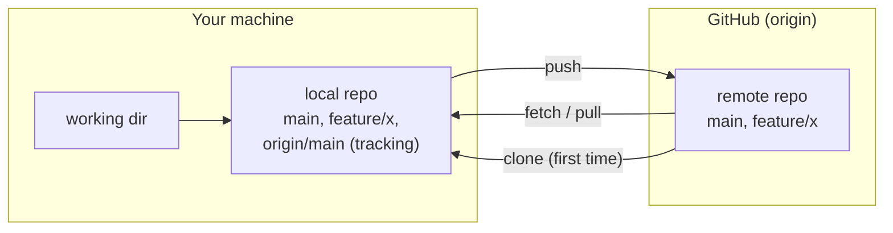
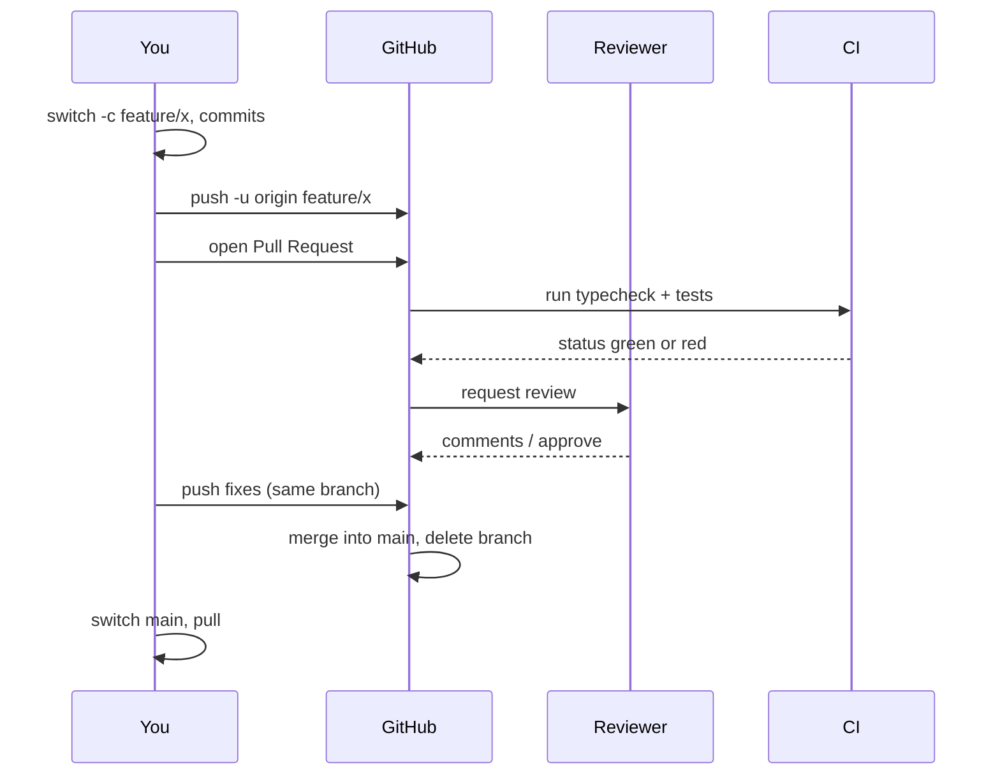
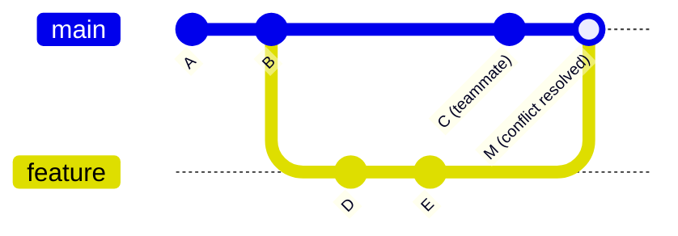

# Module 1.14 — Git II: المستودعات البعيدة، طلبات الدمج، التعارضات، التنصيف
## Git II: Remotes, Pull Requests, Conflicts, Bisect

> **المستوى:** Level 1 | **الموقع:** [15 من 16]
> **السابق:** [M1.13 — Git I](module-1.13-git-1.md) | **التالي:** [M1.15 — TypeScript Types](module-1.15-typescript-types.md)

---

## 1. المتطلبات
- [ ] commits، فروع، merge، revert — [M1.13](module-1.13-git-1.md)
- [ ] العميل/الخادم والشبكة — [L0-M0.6](../level-0-absolute-foundations/module-06-network-client-server.md)

## 2. أهداف التعلّم
- فهم **remote** كنسخة أخرى من المستودع (GitHub مجرد مضيف)، و`origin/main` كـ "آخر ما رأيته هناك".
- الدورة: `clone`, `fetch`, `pull`, `push`؛ ولماذا `push` قد يُرفض.
- سير العمل بـ **Pull Request** (PR): فرع → push → PR → مراجعة → دمج.
- **حل التعارضات** بثقة وبطريقة منهجية.
- الفرق `merge` vs `rebase` وقاعدة "لا rebase لما شوركَ".
- استخدام `git bisect` لإيجاد الـ commit الذي أدخل bug — تطبيق التنصيف من M1.12.
- `stash`، `tag`، و`.gitattributes` الأساسي للأسطر.

---

## 3. شرح للمبتدئ

### Remote = نسخة أخرى، لا "المصدر"

Git **موزّع** (distributed): مستودعك المحلي كامل (كل التاريخ). GitHub/GitLab يستضيف **نسخة أخرى** متفق عليها كنقطة لقاء. اسمها الافتراضي **`origin`**.

```bash
git clone https://github.com/you/todo-cli.git     # انسخ المستودع كاملًا (تاريخه كله) + اضبط origin
git remote -v                                      # اعرض الـ remotes
```

بعد الـ clone لديك فرعان مهمان: `main` (محلي، تحرّكه أنت) و`origin/main` (**remote-tracking branch**: "آخر ما رأيت `main` عليه في origin عند آخر اتصال"). `origin/main` **لا يتحدث وحده**؛ يتحدث عند `fetch`.

### fetch / pull / push

```bash
git fetch                  # اجلب كل الجديد من origin إلى origin/* — لا يلمس ملفاتك (آمن دائمًا)
git log main..origin/main  # ماذا لديهم وليس لديّ؟
git merge origin/main      # ادمجه في فرعي
git pull                   # = fetch + merge (أو rebase حسب الإعداد)
git push                   # أرسل commits فرعي إلى origin
git push -u origin feature/x   # أول مرة: اربط الفرع المحلي بالبعيد (-u)
```

**لماذا يُرفض `push`؟** `! [rejected] ... non-fast-forward`: فرعك البعيد تحرّك (زميل دفع) وفرعك لا يحتوي commits-ه. Git يرفض **حمايةً** من محو عمل الغير. الحل: `git pull` (ادمج أو rebase)، حُلّ التعارضات إن وُجدت، ثم `push`. **لا تستخدم `--force` على فرع مشترك أبدًا** (`--force-with-lease` على فرعك الشخصي فقط).

### سير العمل بـ Pull Request

```
1. git switch -c feature/csv-export          فرع من main محدّث
2. commits صغيرة                              (M1.13)
3. git push -u origin feature/csv-export
4. افتح PR على GitHub: "ادمج feature/csv-export → main"
   - عنوان = ماذا؛ وصف = لماذا + كيف تختبر + لقطات/مخرجات
5. CI يبني ويفحص (L5-M12) + زميل يراجع (L6-M2)
6. تعديلات → commits جديدة على نفس الفرع → PR يتحدّث تلقائيًا
7. دمج (merge / squash / rebase حسب سياسة الفريق) → احذف الفرع
8. محليًا: git switch main && git pull && git branch -d feature/csv-export
```
الـ PR ليس ميزة Git؛ هو **طقس مراجعة** فوق الفروع: نقطة توقف إجبارية حيث يرى شخص آخر كودك قبل أن يصبح `main`. حتى لو تعمل وحدك: PR على نفسك = لحظة مراجعة ذاتية.

### التعارضات (Conflicts) — بلا ذعر

التعارض يحدث فقط عندما يغيّر فرعان **نفس الأسطر** (أو أحدهما يحذف ملفًا والآخر يعدّله). Git يترك علامات:

```typescript
function total(cart: Cart): number {
<<<<<<< HEAD
  return cart.items.reduce((s, i) => s + i.qty * i.unitCents, 0);
=======
  const sub = cart.items.reduce((s, i) => s + i.qty * i.unitCents, 0);
  return Math.round(sub * (100 - cart.couponPercent) / 100);
>>>>>>> feature/coupons
}
```
`HEAD` = نسختك (الفرع الذي تدمج **فيه**)؛ ما بعد `=======` = النسخة الواردة. المنهج:
1. `git status` → قائمة الملفات المتعارضة.
2. لكل ملف: افهم **نية** كل طرف (ليس "أيهما أحتفظ به" بل "ما الصحيح بعد الجمع؟"). غالبًا الجواب **مزيج**.
3. احذف العلامات، اكتب النسخة النهائية.
4. `npm run typecheck` و شغّل البرنامج — التعارض "النظيف" قد يكون منطقيًا خاطئًا.
5. `git add <file>` ثم `git commit` (أو `git rebase --continue`).
6. ضاع الوضع؟ `git merge --abort` / `git rebase --abort` يعيدك لما قبل.

VS Code يعرض أزرار Accept Current/Incoming/Both؛ **Both** ليس دائمًا صحيحًا — فكّر.

### merge vs rebase

```
قبل:      main: A──B──C          feature: A──B──D──E

merge:    main: A──B──C──M       (M له أبوان؛ التاريخ يحكي ما حدث فعلًا)
                      \ /
                   D──E

rebase:   feature: A──B──C──D'──E'   (أُعيدت كتابة D و E فوق C؛ hash جديد؛ تاريخ خطي)
```
- **merge:** صادق، آمن، لكن الرسم يتشعب.
- **rebase:** خطي ونظيف، لكنه **يعيد كتابة التاريخ** (hashes جديدة). القاعدة الحديدية: **لا تعمل rebase لـ commits دفعتها وبنى عليها آخرون.** على فرعك الشخصي قبل فتح/أثناء PR: مقبول وشائع (`git pull --rebase` لتحديث فرعك فوق `main`).
- **squash merge** (في GitHub): PR كله → commit واحد على `main`. يناسب فرق تريد `main` بسيطًا.

### `git bisect` — التنصيف الآلي عبر الزمن

"كان يعمل في الإصدار 1.4، معطّل الآن، بينهما 300 commit." بدل قراءتها:

```bash
git bisect start
git bisect bad                 # الحالي سيئ
git bisect good v1.4           # ذاك كان جيدًا
# Git ينقلك إلى commit في المنتصف. اختبر (npm run typecheck && npx tsx src/main.ts ...):
git bisect good   # أو  git bisect bad
# كرّر ~8 مرات (log2 300 ≈ 8.2) → "abc123 is the first bad commit"
git bisect reset

# آليًا بالكامل إن كان لديك أمر يعيد 0 عند النجاح:
git bisect run npm test
```
لهذا كانت الـ commits **الذرّية** مهمة: الـ commit المذنب صغير فيُقرأ في دقيقة.

### أدوات صغيرة مفيدة

```bash
git stash                 # خبّئ تعديلاتك غير المحفوظة مؤقتًا (لتبديل فرع بسرعة)
git stash pop             # أعدها
git tag -a v1.0.0 -m "First release" && git push origin v1.0.0    # علامة ثابتة على commit
git log --oneline --graph --all --decorate
git blame src/core/todo.ts            # من غيّر كل سطر ومتى (لإيجاد الـ commit والسياق، لا للّوم)
```
`.gitattributes` بسطر `* text=auto eol=lf` يمنع فوضى `\r\n`/`\n` بين Windows وغيره (تذكّر M1.10).

---

## 4. النموذج الذهني

```
local repo  ◀── clone ── origin (GitHub)
main        (أحرّكه أنا)
origin/main (آخر ما رأيته هناك؛ يتحدث بـ fetch فقط)

fetch = اجلب (آمن)   pull = fetch + merge/rebase   push = أرسل (يُرفض إن تأخرت)
PR = فرع + مراجعة + دمج
conflict = نفس الأسطر من طرفين → افهم النيتين → اكتب الصحيح → typecheck → add → commit
rebase يعيد الكتابة → ليس لما شوركَ
bisect = تنصيف التاريخ: log2(n) خطوات
```

## 5. الرسم التوضيحي







## 6. مثال بسيط

```bash
# محاكاة زميل: مستودعان محليان يتشاركان "remote" محليًا (لا حاجة لإنترنت)
git init --bare /tmp/remote.git
git clone /tmp/remote.git /tmp/alice && git clone /tmp/remote.git /tmp/bob

cd /tmp/alice && echo "const a = 1;" > x.ts && git add . && git commit -m "Add x" && git push -u origin main
cd /tmp/bob   && git pull && echo "const b = 2;" >> x.ts && git commit -am "Bob adds b" && git push
cd /tmp/alice && echo "const c = 3;" >> x.ts && git commit -am "Alice adds c"
git push        # ! [rejected] non-fast-forward  ← لأن bob دفع أولًا
git pull        # CONFLICT في x.ts (نفس السطر الأخير)
# حُلّه: أبقِ b و c معًا، ثم:
git add x.ts && git commit -m "Merge origin/main, keep both b and c" && git push
```

## 7. مثال كود

```bash
# سيناريو bisect كامل على todo CLI
# العرض: "done 2" لم يعد يعلّم المهمة. آخر إصدار معروف صحيح: tag v0.3.0

cat > /tmp/check.sh <<'EOF'
#!/usr/bin/env bash
set -e
rm -f /tmp/t.json
export TODO_FILE=/tmp/t.json
npx tsx src/main.ts add "a" >/dev/null
npx tsx src/main.ts add "b" >/dev/null
npx tsx src/main.ts done 2 >/dev/null
grep -q '"done": true' /tmp/t.json      # exit 0 إن وُجدت مهمة منجزة، 1 إن لا
EOF
chmod +x /tmp/check.sh

git bisect start
git bisect bad HEAD
git bisect good v0.3.0
git bisect run /tmp/check.sh
# ... بعد ~log2(N) تشغيلات:
# 7e2f1a9 is the first bad commit
#   Refactor id parsing in CLI
git show 7e2f1a9             # اقرأ الـ diff الصغير: Number(arg) أصبح parseInt(arg, 2) بالخطأ → "2" في النظام الثنائي = NaN
git bisect reset
```
لاحظ كيف تضافرت الأدوات: commits ذرّية (M1.13) + نص اختبار + exit codes (L0/M1.9) + التنصيف (M1.12).

## 8. مثال من العالم الحقيقي
كل مشروع مفتوح المصدر: fork → فرع → PR → مراجعة → CI → دمج. آلاف المساهمين لا يلتقون أبدًا؛ البروتوكول هو ما ينسّقهم. وفي الشركات: "لا كود يصل `main` إلا عبر PR مع مراجعة واحدة على الأقل وCI أخضر" — قاعدة شبه عالمية.

## 9. مثال من الإنتاج
**حادثة `--force` يوم الجمعة:** مطوّر عمل rebase على فرع مشترك ثم `git push --force` "لتنظيف التاريخ". ثلاثة زملاء فقدوا يومَي عمل مدفوعَين على نفس الفرع (استُعيدت بعد ساعات عبر `reflog` على أجهزتهم). **الدرس:** لا rebase/force لما شوركَ؛ فعّل **branch protection** على `main` (منع force-push، إلزام PR).

## 10. مفاهيم خاطئة شائعة

| ❌ | ✅ |
|---|---|
| "GitHub هو Git" | GitHub **مضيف** لمستودعات Git + أدوات (PR, Issues, Actions). |
| "`pull` آمن دائمًا" | قد يُنشئ merge commit أو تعارضًا؛ `fetch` ثم انظر، ثم ادمج. |
| "التعارض يعني أن أحدهم أخطأ" | يعني فقط أن اثنين لمسا نفس الأسطر؛ طبيعي. |
| "Accept Both يحل التعارض" | يُزيل العلامات؛ قد يترك كودًا مكررًا أو متناقضًا. اقرأ وفكّر وافحص. |
| "rebase أفضل دائمًا لأنه أنظف" | على المشترك خطر؛ على الشخصي مقبول. |

## 11. أخطاء شائعة
1. `git push --force` على فرع مشترك.
2. حل التعارض دون تشغيل typecheck/البرنامج.
3. فرع عمره شهر → تعارضات هائلة. **حدّث من `main` يوميًا** (`pull --rebase` أو merge).
4. PR بـ 60 ملفًا؛ لا أحد يراجعه فعلًا. صغّر.
5. `commit -am` يُدرج ملفات لم تقصدها (راجع `status` أولًا).

## 12. تمرين تصحيح

```bash
$ git pull
Auto-merging src/main.ts
CONFLICT (content): Merge conflict in src/main.ts
$ code src/main.ts      # ضغط "Accept Both Changes" وحفظ
$ git add . && git commit -m "merge" && git push
$ npx tsx src/main.ts add x
SyntaxError: Identifier 'FILE' has already been declared
```
ماذا حدث؟ وكيف كان يجب التعامل؟

<details><summary>💡 الحل</summary>

الطرفان أضافا تعريفًا لـ `const FILE = ...` (أحدهما من env والآخر ثابت). "Accept Both" أبقى **السطرين** → تعريف مكرر → SyntaxError. وقد **دُفع** الكود المكسور. التعامل الصحيح: فهم النيتين (قابلية الضبط عبر env + قيمة افتراضية) → سطر واحد `const FILE = process.env.TODO_FILE ?? "todos.json"` → `npm run typecheck` → تشغيل → ثم commit برسالة تشرح القرار. والآن: commit إصلاح جديد (لا force).
</details>

## 13. تمرين معماري
فريق 6 أشخاص، نشر للإنتاج مرتين أسبوعيًا. صمّم استراتيجية الفروع: فرع واحد `main` دائم الصلاحية مع فروع قصيرة (trunk-based)؟ أم `develop` + `release/*` + `hotfix/*` (Git Flow)؟ لكل خيار: متى تظهر التعارضات؟ كم يعيش الفرع؟ كيف تُصلح bug عاجلًا في الإنتاج؟ ماذا يحمي `main` (PR إلزامي؟ CI؟ عدد المراجعين؟). اكتب Assumption/Constraint/Tradeoff/Risk/Recommendation.

## 14. الصلة بعصر AI
وكلاء AI يفتحون PRs الآن. **لا تدمج PR لم تقرأه** — عنوانه الجميل ليس دليلًا. راجع الـ diff كما تراجع لزميل مبتدئ: ماذا تغيّر خارج نطاق المهمة؟ هل عُدّل `.gitignore`/الأسرار/إعدادات CI؟ وعلّم الـ AI اتفاقية الفريق (أسماء فروع، حجم PR، قالب الرسالة) في ملف تعليمات بالمستودع (L8-M5). `bisect` يبقى سلاحك عندما "يعمل الكود الذي ولّده AI… حتى لا يعمل".

## 15–17. Master / Understand / Defer
- 🔴 remote/origin/`origin/main`؛ `clone/fetch/pull/push`؛ لماذا يُرفض push؛ دورة PR؛ حل التعارض منهجيًا + typecheck؛ لا force على المشترك.
- 🟠 merge vs rebase vs squash؛ `pull --rebase` على فرعك؛ `bisect` (يدوي وrun)؛ `stash`/`tag`/`blame`؛ `.gitattributes` للأسطر.
- ⚪ `rebase -i` للتنظيف قبل PR؛ cherry-pick؛ submodules/worktrees؛ signed commits؛ monorepo tooling.

## 18. الخلاصة
1. Remote نسخة أخرى؛ `origin/main` يتحدث بـ `fetch` فقط.
2. `push` يُرفض عندما تتأخر — حمايةً لعمل الغير؛ `pull` ثم `push`؛ **لا force على المشترك**.
3. PR = فرع + مراجعة + CI + دمج؛ صغّر الـ PRs وحدّث فرعك يوميًا.
4. التعارض: افهم النيتين، اكتب الصحيح، **افحص**، ثم أدرج والتزم.
5. rebase يعيد الكتابة → للشخصي فقط.
6. `bisect` + commits ذرّية + اختبار يعيد exit code = إيجاد المذنب في log2(n) خطوات.

## 19. مراجع رسمية
- Pro Git — Remote Branches: https://git-scm.com/book/en/v2/Git-Branching-Remote-Branches
- Pro Git — Basic Merge Conflicts: https://git-scm.com/book/en/v2/Git-Branching-Basic-Branching-and-Merging
- Pro Git — Rebasing (and its perils): https://git-scm.com/book/en/v2/Git-Branching-Rebasing
- git-scm — `git bisect`: https://git-scm.com/docs/git-bisect
- GitHub Docs — About pull requests: https://docs.github.com/en/pull-requests/collaborating-with-pull-requests/proposing-changes-to-your-work-with-pull-requests/about-pull-requests
- GitHub Docs — Resolving merge conflicts: https://docs.github.com/en/pull-requests/collaborating-with-pull-requests/addressing-merge-conflicts/resolving-a-merge-conflict-using-the-command-line

## المصطلحات
| العربية | English |
|---|---|
| مستودع بعيد | Remote |
| فرع تتبّع بعيد | Remote-tracking branch |
| استنساخ / جلب / سحب / دفع | Clone / Fetch / Pull / Push |
| طلب دمج | Pull Request (PR) |
| مراجعة الكود | Code review |
| تعارض | Merge conflict |
| إعادة الأساس | Rebase |
| دمج مضغوط | Squash merge |
| دفع قسري | Force push |
| حماية الفرع | Branch protection |
| تنصيف | Bisect |
| إخفاء مؤقت | Stash |
| وسم | Tag |

> **التالي:** [Module 1.15 — TypeScript Types: Thinking in Types](module-1.15-typescript-types.md)
