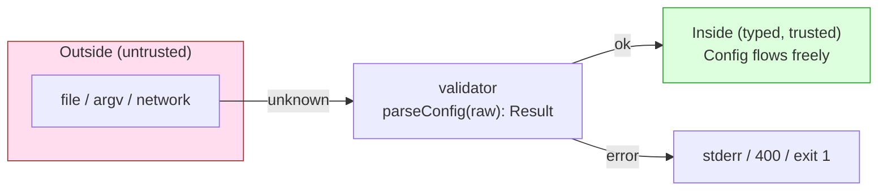
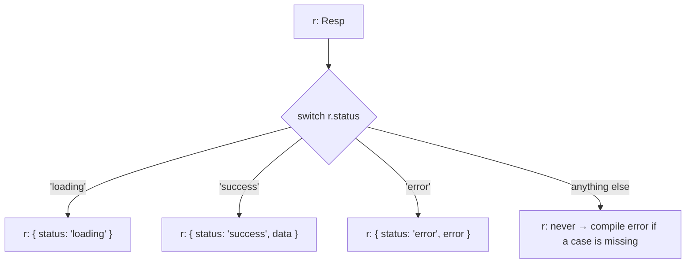
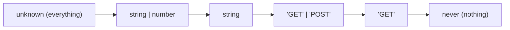

# Module 1.15 — TypeScript: التفكير بالأنواع
## TypeScript Types: unions, narrowing, generics, unknown, validation at boundaries

> **المستوى:** Level 1 | **الموقع:** [16 من 16]
> **السابق:** [M1.14 — Git II](module-1.14-git-2.md) | **التالي:** [Projects 1–2](../projects/project-1-cli/README.md) ثم [Checkpoint 1](checkpoint-1.md)

---

## 1. المتطلبات
- [ ] الأنواع البدائية والاستدلال — [M1.1](module-1.1-values-variables-types.md)
- [ ] narrowing الأولي — [M1.2](module-1.2-expressions-conditions.md)
- [ ] `type` للكائنات، `Record`, `readonly` — [M1.6](module-1.6-objects-references.md)، [M1.7](module-1.7-state-side-effects-immutability.md)
- [ ] Result والـ `unknown` في catch — [M1.9](module-1.9-errors.md)
- [ ] "الأنواع تُمحى وقت التشغيل" — [M1.0](module-1.0-setup.md)

## 2. أهداف التعلّم
- التفكير في النوع كـ **مجموعة من القيم الممكنة**، والاستفادة من ذلك في التصميم.
- استخدام **الاتحادات** (unions) و**الأنواع الحرفية** (literal types) و**الاتحادات المميَّزة** (discriminated unions) لجعل الحالات المستحيلة غير قابلة للتمثيل.
- إتقان **التضييق** (narrowing): `typeof`, `in`, `instanceof`, حراس الأنواع المخصّصة، `satisfies`، وفحص الشمولية بـ `never`.
- كتابة **generics** بسيطة (`Result<T>`, `mapLimit<T, R>`) وفهم متى تحتاجها.
- التفريق بين `unknown` (آمن) و`any` (إطفاء الفحص)، واستبدال `as` بالتحقق.
- بناء **محقّق على الحدود** يحوّل `unknown` إلى نوع موثوق (يدويًا، ولمحة عن zod).
- قراءة الأنواع المساعدة: `Partial`, `Pick`, `Omit`, `ReturnType`, `keyof`.

---

## 3. شرح للمبتدئ

### النوع = مجموعة قيم

- `boolean` = `{true, false}` (قيمتان).
- `number` = كل الأرقام.
- `"GET"` (نوع حرفي) = مجموعة بعنصر واحد.
- `"GET" | "POST"` = مجموعة بعنصرين. `|` تعني **اتحاد** (union): "إحدى هذه".
- `string | undefined` = كل النصوص **أو** `undefined`.
- `never` = المجموعة الفارغة (لا قيمة ممكنة). `unknown` = كل شيء.

لماذا هذا التصوّر مفيد؟ لأن **تصميم الأنواع = تحديد ما هو ممكن**. كلما ضيّقت المجموعة إلى ما هو **صحيح فعلًا**، قلّت الحالات التي يجب أن تفحصها أو تنساها.

```typescript
// ❌ واسع: أي نص؛ "GTE" مقبول؛ كل دالة تفحص
function request(method: string) {}
// ✅ ضيق: المترجم يرفض "GTE" قبل التشغيل
type Method = "GET" | "POST" | "PUT" | "DELETE";
function request(method: Method) {}
```

### الاتحادات المميَّزة — اجعل المستحيل غير قابل للتمثيل

```typescript
// ❌ كل الحقول اختيارية → حالات متناقضة ممكنة: { status: "success", error: "x" }
type Resp = { status: string; data?: User; error?: string };

// ✅ كل حالة شكل خاص بها، وحقل مميِّز (discriminant) يربط بينهما
type Resp =
  | { status: "loading" }
  | { status: "success"; data: User }
  | { status: "error"; error: string };

function render(r: Resp): string {
  switch (r.status) {
    case "loading": return "…";
    case "success": return r.data.name;      // هنا فقط data موجودة — TS يعرف
    case "error":   return r.error;          // وهنا فقط error
  }
}
```
رأيت هذا في `Action` (M1.7) و`Result` (M1.9) و`Outcome` (M1.11). هو **أهم نمط تصميمي** في TypeScript.

**فحص الشمولية:** أضف حالة `{ status: "empty" }` وانسَ `case` لها؟ مع `strict`، الدالة قد لا تعيد قيمة → خطأ. ولجعل القصد صريحًا:
```typescript
default: { const _exhaustive: never = r; return _exhaustive; }   // إن بقيت حالة، r ليس never → خطأ ترجمة
```

### التضييق — كل أداة وحالتها

```typescript
function describe(x: string | number | string[] | Date | null): string {
  if (x === null) return "null";                       // مساواة
  if (typeof x === "string") return x.toUpperCase();  // typeof للبدائيات
  if (typeof x === "number") return x.toFixed(2);
  if (Array.isArray(x)) return x.join(",");            // دوال فحص مدمجة
  if (x instanceof Date) return x.toISOString();       // instanceof للكائنات ذات class
  return x;                                            // هنا x: never — غطّينا كل شيء
}

// in للتمييز بين أشكال الكائنات
type Cat = { meow(): void }; type Dog = { bark(): void };
function speak(a: Cat | Dog) { "meow" in a ? a.meow() : a.bark(); }

// حارس نوع مخصّص (type predicate): دالة تعلّم TS شيئًا
function isNonEmpty(s: string | undefined): s is string { return s !== undefined && s.length > 0; }
const names = ["a", undefined, "b"].filter(isNonEmpty);   // string[] ✅ (بدون الحارس: (string|undefined)[])
```

**`satisfies`** (TS 4.9+): "تأكد أن هذا يطابق النوع، لكن احتفظ بالنوع الأدق المستنتَج":
```typescript
const routes = { home: "/", user: "/u/:id" } satisfies Record<string, string>;
routes.home;      // النوع "/" (حرفي) وليس string — و TS فحص أن كل القيم نصوص
```

### Generics — دوال وأنواع "بمعامل نوع"

رأيت `Result<T>` و`mapLimit<T, R>`. **Generic** = نوع أو دالة تأخذ **النوع كمعامل** لتعمل مع أي نوع **دون فقدان المعلومات**:

```typescript
// ❌ بلا generic: نفقد النوع
function firstAny(xs: any[]): any { return xs[0]; }
// ✅ T يُستنتج من الاستدعاء
function first<T>(xs: readonly T[]): T | undefined { return xs[0]; }
const n = first([1, 2, 3]);        // number | undefined
const s = first(["a"]);            // string | undefined

type Result<T, E = string> = { ok: true; value: T } | { ok: false; error: E };
type Page<T> = { items: T[]; total: number; nextCursor?: string };

// قيد على المعامل: T يجب أن يملك id
function byId<T extends { id: number }>(xs: readonly T[], id: number): T | undefined {
  return xs.find(x => x.id === id);
}
```
متى تكتب generic؟ عندما تجد نفسك تنسخ نفس الدالة لـ `number` ثم `string` ثم `User`، أو عندما تريد **تمرير** النوع من المدخل إلى المخرج (`first`, `map`). لا تبدأ بها؛ ابدأ ملموسًا ثم عمّم عند التكرار.

### `unknown` vs `any` vs `as`

| | `any` | `unknown` | `as T` |
|---|---|---|---|
| ماذا يفعل | **يطفئ** الفحص لهذه القيمة وكل ما يلمسها | "لا أعرف؛ **افحص قبل الاستخدام**" | "**ثق بي**، هذا T" — بلا فحص |
| متى | شبه أبدًا | لكل مدخل خارجي (`JSON.parse`, `catch`, استجابات) | نادرًا، بعد تحقق فعلي؛ أو `as const` |

```typescript
const raw: unknown = JSON.parse(text);
raw.port;                        // ❌ Object is of type 'unknown' — جيد! يجبرك على الفحص
if (typeof raw === "object" && raw !== null && "port" in raw && typeof raw.port === "number") {
  raw.port;                      // ✅ number
}
```
`as` **لا يحوّل** شيئًا وقت التشغيل (الأنواع تُمحى). `JSON.parse(x) as Config` = وعد كاذب إن كان الملف خاطئًا؛ الانفجار يأتي لاحقًا في مكان بعيد (ضد fail fast).

### المحقّق على الحدود — تحويل `unknown` إلى ثقة

```typescript
type Config = { port: number; dbUrl: string; features: readonly string[] };

function parseConfig(raw: unknown): Result<Config> {
  if (typeof raw !== "object" || raw === null) return { ok: false, error: "expected object" };
  const o = raw as Record<string, unknown>;          // ← الـ as الوحيد المقبول: "كائن بمفاتيح مجهولة"
  const { port, dbUrl, features } = o;
  if (typeof port !== "number" || !Number.isInteger(port) || port < 1 || port > 65535) return { ok: false, error: "port: integer 1..65535" };
  if (typeof dbUrl !== "string" || dbUrl === "") return { ok: false, error: "dbUrl: non-empty string" };
  if (!Array.isArray(features) || !features.every((f): f is string => typeof f === "string")) return { ok: false, error: "features: string[]" };
  return { ok: true, value: { port, dbUrl, features } };   // الآن نوع Config حقيقي، مُثبت وقت التشغيل
}
```
الأنواع تحمي **الداخل**؛ المحقّق يحمي **الحدود**. معًا يُغلق الفراغ الذي سببه "الأنواع تُمحى".

**مكتبات المخططات (schema)** مثل zod تختصر هذا:
```typescript
import { z } from "zod";
const ConfigSchema = z.object({ port: z.number().int().min(1).max(65535), dbUrl: z.string().min(1), features: z.array(z.string()) });
type Config = z.infer<typeof ConfigSchema>;          // النوع مشتق من المخطط — مصدر واحد للحقيقة
const r = ConfigSchema.safeParse(JSON.parse(text));  // { success: true, data } | { success: false, error }
```
ستستخدمها بكثافة من Project 4 فصاعدًا؛ هنا اكتب المحقّق يدويًا مرة لتفهم ما تفعله.

### الأنواع المساعدة — القاموس الصغير

```typescript
type User = { id: number; name: string; email: string; role: "admin" | "viewer" };
type UserPatch = Partial<User>;                 // كل الحقول اختيارية (لـ PATCH)
type UserPublic = Omit<User, "email">;          // بدون email
type UserRef = Pick<User, "id" | "name">;       // id و name فقط
type Role = User["role"];                       // "admin" | "viewer" (indexed access)
type UserKeys = keyof User;                     // "id" | "name" | "email" | "role"
type Ids = ReadonlyArray<User["id"]>;
type Loader = () => Promise<User>;
type Loaded = Awaited<ReturnType<Loader>>;      // User
```
لا تحفظها؛ اعرف أنها موجودة وارجع إليها.

### `interface` vs `type` — القرار
كلاهما يصف الأشكال. `interface` قابلة للـ `extends` والدمج التصريحي؛ `type` تصف أيضًا الاتحادات والحرفيات والدوال. **قاعدة الكورس:** `type` افتراضيًا (أعمّ)؛ `interface` عندما تصمّم عقدًا سيُنفَّذ بـ `class` (L4). لا تجادل حولها.

---

## 4. النموذج الذهني

```
النوع = مجموعة قيم.   ضيّقها إلى "الصحيح فقط".
union A | B  = إحداهما        discriminated union = لكل حالة شكلها + حقل مميِّز
narrowing: ===, typeof, in, instanceof, Array.isArray, حارس "x is T"
never = لا شيء بقي (شمولية)   unknown = افحص أولًا    any = أطفأت الحماية
Generic<T> = مرّر النوع عبر الدالة بدل فقدانه
الأنواع تحمي الداخل؛ المحقّق (unknown → Result<T>) يحمي الحدود
as = وعد بلا فحص؛ استبدله بتحقق
```

## 5. الرسم التوضيحي







## 6. مثال بسيط

```typescript
type Shape = { kind: "circle"; r: number } | { kind: "rect"; w: number; h: number };
const area = (s: Shape): number => s.kind === "circle" ? Math.PI * s.r ** 2 : s.w * s.h;
console.log(area({ kind: "circle", r: 1 }).toFixed(2), area({ kind: "rect", w: 2, h: 3 }));   // 3.14 6
// area({ kind: "rect", r: 1 })  ❌ خطأ ترجمة: الحالة المتناقضة غير قابلة للتمثيل
```

## 7. مثال كود

```typescript
// src/todo-types.ts — إعادة تصميم أنواع Project 1 بما تعلمته
export type TodoId = number & { readonly __brand: "TodoId" };   // branded type: رقم، لكن لا يُخلط بأي رقم
export const asTodoId = (n: number): TodoId => n as TodoId;      // الـ as الوحيد: داخل "مصنع" محكوم

export type Todo = { readonly id: TodoId; readonly title: string; readonly done: boolean; readonly due?: string };
export type State = { readonly todos: readonly Todo[]; readonly nextId: number };

export type Command =
  | { kind: "add"; title: string; due?: string }
  | { kind: "done"; id: TodoId }
  | { kind: "remove"; id: TodoId }
  | { kind: "list"; filter: "all" | "pending" | "done" };

export type Result<T, E = string> = { ok: true; value: T } | { ok: false; error: E };

// الحد: argv (string | undefined)[] → Command موثوق
export function parseCommand(argv: readonly (string | undefined)[]): Result<Command> {
  const [cmd, a, b] = argv;
  switch (cmd) {
    case "add":
      if (!a) return { ok: false, error: "add: title required" };
      if (b !== undefined && Number.isNaN(Date.parse(b))) return { ok: false, error: `add: bad date "${b}"` };
      return { ok: true, value: { kind: "add", title: a, due: b } };
    case "done":
    case "remove": {
      const n = Number(a);
      if (!Number.isInteger(n) || n <= 0) return { ok: false, error: `${cmd}: positive integer id required` };
      return { ok: true, value: { kind: cmd, id: asTodoId(n) } };     // cmd هنا "done" | "remove" — مضيَّق
    }
    case "list": {
      const f = a ?? "all";
      if (f !== "all" && f !== "pending" && f !== "done") return { ok: false, error: `list: filter must be all|pending|done` };
      return { ok: true, value: { kind: "list", filter: f } };          // f مضيَّق إلى الاتحاد الحرفي
    }
    default:
      return { ok: false, error: `unknown command "${cmd ?? ""}"` };
  }
}

// الحد الثاني: JSON من الملف → State موثوق
export function parseState(raw: unknown): Result<State> {
  if (typeof raw !== "object" || raw === null) return { ok: false, error: "state: expected object" };
  const o = raw as Record<string, unknown>;
  if (!Array.isArray(o.todos) || typeof o.nextId !== "number") return { ok: false, error: "state: bad shape" };
  const todos: Todo[] = [];
  for (const [i, t] of o.todos.entries()) {
    if (typeof t !== "object" || t === null) return { ok: false, error: `todos[${i}]: expected object` };
    const x = t as Record<string, unknown>;
    if (typeof x.id !== "number" || typeof x.title !== "string" || typeof x.done !== "boolean") return { ok: false, error: `todos[${i}]: bad fields` };
    if (x.due !== undefined && typeof x.due !== "string") return { ok: false, error: `todos[${i}]: due must be string` };
    todos.push({ id: asTodoId(x.id), title: x.title, done: x.done, ...(x.due !== undefined ? { due: x.due } : {}) });
  }
  return { ok: true, value: { todos, nextId: o.nextId } };
}

// النواة: شمولية مضمونة
export function apply(state: State, c: Command): State {
  switch (c.kind) {
    case "add":    return { todos: [...state.todos, { id: asTodoId(state.nextId), title: c.title, done: false, ...(c.due ? { due: c.due } : {}) }], nextId: state.nextId + 1 };
    case "done":   return { ...state, todos: state.todos.map(t => t.id === c.id ? { ...t, done: true } : t) };
    case "remove": return { ...state, todos: state.todos.filter(t => t.id !== c.id) };
    case "list":   return state;
    default: { const _never: never = c; return _never; }
  }
}
```

ما الذي تغيّر عن M1.7؟ (1) أمر `list` كحالة صريحة بفلتر حرفي؛ (2) `TodoId` لا يُخلط بـ `nextId` أو أي رقم آخر؛ (3) **حدّان** (argv، ملف) يحوّلان `unknown` إلى أنواع موثوقة؛ (4) `never` يضمن أن إضافة أمر جديد تُجبرك على تنفيذه.

## 8. مثال من العالم الحقيقي
كل API حديث يوثّق استجاباته كاتحادات مميَّزة (`type: "card" | "bank_transfer"` في Stripe). كل إطار واجهة يعرّف الحالة `idle | loading | success | error`. وكل فريق TypeScript ناضج لديه قاعدة: "**لا `any` ولا `as` في مراجعة الكود إلا بتبرير مكتوب**".

## 9. مثال من الإنتاج
**حادثة "الحقل الاختياري الذي لم يكن اختياريًا":** نوع `Order = { shippingAddress?: Address }` لأن "الطلبات الرقمية لا تحتاج عنوانًا". مع الوقت، 7 أماكن تفعل `order.shippingAddress!.city` (علامة `!` = "ثق بي، ليست undefined"). طلب رقمي دخل مسار الشحن → انهيار في الإنتاج. **إعادة التصميم:** `Order = { kind: "physical"; shippingAddress: Address } | { kind: "digital" }` — الآن مسار الشحن يقبل `Extract<Order, {kind: "physical"}>` فقط، والمترجم يمنع الـ bug في 7 أماكن دفعة واحدة. **الدرس:** كل `?` وكل `!` سؤال تصميم: هل هذه حالتان مختلفتان متنكّرتان في شكل واحد؟

## 10. مفاهيم خاطئة شائعة

| ❌ | ✅ |
|---|---|
| "TypeScript يتحقق من البيانات وقت التشغيل" | يُمحى بالكامل؛ المحقّق مسؤوليتك. |
| "`as` يحوّل النوع" | يُسكت المترجم فقط. |
| "`any` مقبول مؤقتًا" | ينتشر: كل ما يلمسه يصبح `any`. استخدم `unknown`. |
| "Generics متقدمة؛ أتجنبها" | تستخدمها منذ M1.5 (`Array<T>`, `Promise<T>`)؛ كتابتها تأتي عند التكرار. |
| "الحقول الاختيارية `?` مرنة وجيدة" | غالبًا تخفي حالات مختلفة؛ فكّر في اتحاد مميَّز. |

## 11. أخطاء شائعة
1. `JSON.parse(x) as T` / `res.json() as T` / `!` بلا تحقق.
2. اتحاد بلا حقل مميِّز → تضييق بـ `in` هش.
3. `switch` بلا `never` في `default` → حالة منسية بصمت.
4. `string` حيث يصلح اتحاد حرفي.
5. generic مبكر معقّد لا يحتاجه أحد (`<T extends Record<K, V>, K extends keyof T, V>` لدالة تُستدعى مرة).
6. تعطيل `strict`/إضافة `// @ts-ignore` لإسكات خطأ محق.

## 12. تمرين تصحيح

```typescript
type Payment = { method: string; cardLast4?: string; iban?: string; amountCents: number };

function describe(p: Payment): string {
  if (p.method === "card") return `Card •••• ${p.cardLast4!.slice(-4)}`;
  return `Transfer from ${p.iban}`;
}
const api: any = JSON.parse('{"method":"crad","amountCents":"1200"}');
console.log(describe(api));             // "Transfer from undefined"
console.log(api.amountCents + 100);     // "1200100"
```
ثلاث فئات من المشاكل. أعد تصميم النوع والحدود.

<details><summary>💡 الحل</summary>

1. **النوع واسع:** `method: string` قبل `"crad"`؛ الحقول الاختيارية سمحت ببطاقة بلا `cardLast4` (لذلك `!`)، ومسار "كل ما ليس card هو تحويل" خاطئ. → اتحاد مميَّز:
```typescript
type Payment = { amountCents: number } & (
  | { method: "card"; cardLast4: string }
  | { method: "transfer"; iban: string });
```
2. **`any` على الحد:** أطفأ كل الحماية؛ `amountCents` نص → ضمّ نصوص (M1.1). → `const raw: unknown = JSON.parse(...)` + `parsePayment(raw): Result<Payment>` يفحص `method` بالاتحاد الحرفي و`typeof amountCents === "number"`.
3. **`!` و`slice(-4)`** يخفيان الحالة الفاسدة بدل رفضها. مع النوع الجديد، `describe` تعمل بـ `switch (p.method)` + `never` بلا `!`.

النتيجة: `"crad"` يُرفض على الحد برسالة واضحة (fail fast) بدل "Transfer from undefined" في الإنتاج.
</details>

## 13. تمرين معماري
صمّم أنواع نظام طلبات: الطلب يمرّ بـ `draft → submitted → paid → shipped → delivered` أو `cancelled` (من draft/submitted/paid فقط). لكل حالة بيانات خاصة (paid له `paymentId`، shipped له `trackingNo`). اكتب الأنواع بحيث: (1) لا يمكن أن يوجد `trackingNo` على طلب `draft`؛ (2) دالة `ship(order)` تقبل `paid` فقط **بالنوع**؛ (3) الانتقالات غير المسموحة خطأ ترجمة. ارسم الآلة (state machine) بـ Mermaid. ما الذي لا تستطيع الأنواع ضمانه (وقت التشغيل، التزامن)، وأين يُحسم ذلك (L3-M14، L5)؟

## 14. الصلة بعصر AI
AI يُسكت المترجم بـ `any`/`as`/`!`/`@ts-ignore` لأن "يعمل". **قاعدتك:** `grep -rn "any\|as \|!\.\|ts-ignore" src/` بعد كل جلسة؛ كل نتيجة تحتاج تبريرًا. اطلب: *"اتحادات مميَّزة بدل حقول اختيارية؛ `unknown` + محقّق على كل حد؛ `never` في `default`؛ لا `as` إلا داخل مصنع موثّق."* الأنواع الجيدة هي أيضًا **أفضل برومبت**: AI يولّد كودًا أدق عندما تكون الأنواع ضيقة ومعبّرة.

## 15–17. Master / Understand / Defer
- 🔴 النوع كمجموعة؛ unions + literals؛ **الاتحاد المميَّز** + `switch` + `never`؛ أدوات التضييق؛ `unknown` vs `any` vs `as`؛ محقّق يدوي على الحدود؛ generics بسيطة (`Result<T>`, `first<T>`)؛ `readonly`.
- 🟠 حراس `x is T`؛ `satisfies`؛ `Partial/Pick/Omit/keyof/ReturnType`؛ branded types؛ `interface` vs `type`؛ لمحة zod.
- ⚪ conditional/mapped/template literal types؛ variance؛ declaration files `.d.ts`؛ overloads؛ decorators.

## 18. الخلاصة
1. النوع مجموعة قيم؛ **ضيّقها إلى الصحيح فقط**.
2. **الاتحاد المميَّز** يجعل الحالات المستحيلة غير قابلة للتمثيل؛ `never` يضمن الشمولية.
3. التضييق يحوّل الفحص وقت التشغيل إلى معرفة وقت الترجمة.
4. `unknown` على كل حد؛ **محقّق** يحوّله إلى `Result<T>`؛ `as`/`any`/`!` إنذار.
5. Generics تمرّر النوع بدل فقده؛ اكتبها عند التكرار.
6. الأنواع تحمي الداخل، المحقّق يحمي الحدود، والاثنان معًا يُغلقان فجوة "الأنواع تُمحى".

## 19. مراجع رسمية
- TypeScript Handbook — Everyday Types: https://www.typescriptlang.org/docs/handbook/2/everyday-types.html
- TypeScript Handbook — Narrowing: https://www.typescriptlang.org/docs/handbook/2/narrowing.html
- TypeScript Handbook — Generics: https://www.typescriptlang.org/docs/handbook/2/generics.html
- TypeScript Handbook — Utility Types: https://www.typescriptlang.org/docs/handbook/utility-types.html
- TypeScript — `satisfies` (4.9 release notes): https://www.typescriptlang.org/docs/handbook/release-notes/typescript-4-9.html
- Zod — docs: https://zod.dev

## المصطلحات
| العربية | English |
|---|---|
| اتحاد | Union type |
| نوع حرفي | Literal type |
| اتحاد مميَّز / حقل مميِّز | Discriminated union / Discriminant |
| تضييق | Narrowing |
| حارس نوع | Type guard / Type predicate |
| فحص الشمولية | Exhaustiveness check (`never`) |
| نوع عام / معامل نوع | Generic / Type parameter |
| قيد | Constraint (`extends`) |
| تأكيد نوع | Type assertion (`as`) |
| مجهول / أي | `unknown` / `any` |
| محقّق / مخطط | Validator / Schema |
| نوع موسوم | Branded type |
| أنواع مساعدة | Utility types |

> **التالي:** [Project 1 — CLI Todo](../projects/project-1-cli/README.md) → [Project 2 — Data Processing](../projects/project-2-data-processing/README.md) → [Checkpoint 1](checkpoint-1.md)
