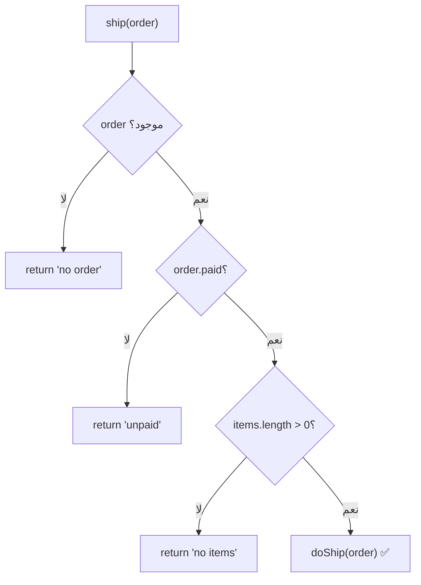
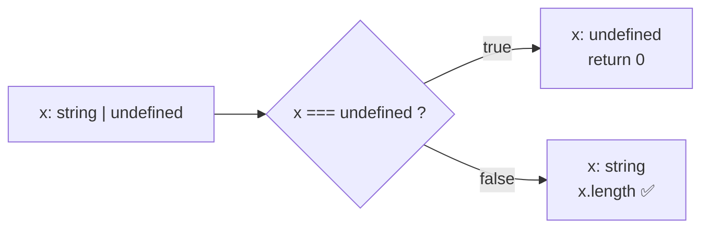

# Module 1.2 — التعابير، العوامل، الشروط
## Expressions, Operators, Conditions

> **المستوى:** Level 1 | **الموقع:** [3 من 16]
> **السابق:** [M1.1 — Values, Variables, Types](module-1.1-values-variables-types.md) | **التالي:** [M1.3 — Loops](module-1.3-loops.md)

---

## 1. المتطلبات
- [ ] القيم والأنواع البدائية، `===`، التحويل الضمني — [M1.1](module-1.1-values-variables-types.md)

## 2. أهداف التعلّم
- التفريق بين **التعبير** (expression — ينتج قيمة) و**الجملة** (statement — تفعل شيئًا).
- استخدام العوامل الحسابية والمقارنة والمنطقية، وفهم `===` مقابل `==`.
- شرح **truthiness/falsiness** وقائمة القيم الـ falsy الست… واستخدام `??` و`||` بشكل صحيح.
- كتابة `if / else if / else`، `switch`، والعامل الثلاثي، واختيار المناسب.
- تطبيق **الرجوع المبكر** (early return) و**شروط الحراسة** (guard clauses) لتقليل التعشيش.
- فهم كيف يضيّق TypeScript الأنواع داخل الشروط (**narrowing** — نظرة أولى).

---

## 3. شرح للمبتدئ

### تعبير مقابل جملة

- **التعبير** (**Expression**): أي شيء **يُقيَّم إلى قيمة**. `2 + 3`، `age >= 18`، `name.length`، `getUser()`.
- **الجملة** (**Statement**): تعليمة **تفعل شيئًا** ولا تُستخدم كقيمة. `let x = 5;`، `if (...) {...}`، `return x;`.

تشبيه: التعبير **سؤال له جواب** ("كم 2+3؟" → 5). الجملة **أمر** ("ضع 5 في الصندوق x").

### العوامل (Operators)

| الفئة | العوامل | ملاحظة |
|---|---|---|
| حسابية | `+ - * / % **` | `%` باقي القسمة (`7 % 3 = 1`)، `**` أس. `/` دائمًا عشري (`7/2 = 3.5`). |
| مقارنة | `=== !== < > <= >=` | **`===` دائمًا.** `==` يحوّل الأنواع ضمنيًا (`"1" == 1` true). |
| منطقية | `&& \|\| !` | و / أو / ليس. **تُقيَّم بكسل** (short-circuit): `a && b` لا يُقيّم `b` إن كان `a` falsy. |
| التجميع الصفري | `??` | `a ?? b` = `b` فقط إن كان `a` هو `null` أو `undefined`. |
| ثلاثي | `cond ? x : y` | تعبير شرطي (له قيمة). |
| إسناد مركّب | `+= -= *= ??=` | `x += 1` = `x = x + 1`. |

### Truthiness — "ما يُعتبر صحيحًا"

عندما تضع **غير boolean** في شرط، JavaScript تحوّله. **ست قيم فقط falsy:**
```
false   0   ""   null   undefined   NaN      (و 0n)
```
**كل شيء آخر truthy** — بما فيه `"0"`, `"false"`, `[]`, `{}`.

هذا مصدر bug كلاسيكي:
```javascript
const discount = 0;
const applied = discount || 10;   // 10 ❌ — صفر خصم صحيح لكنه falsy!
const applied2 = discount ?? 10;  // 0  ✅ — ?? يفحص null/undefined فقط
```
**القاعدة:** للقيم الافتراضية استخدم `??`. استخدم `||` فقط عندما تريد فعلًا اعتبار `0` و`""` "فارغًا".

### الشروط

```typescript
if (score >= 90) {
  grade = "A";
} else if (score >= 80) {
  grade = "B";
} else {
  grade = "C";
}
```

**`switch`** عندما تقارن قيمة واحدة بعدة احتمالات ثابتة:
```typescript
switch (method) {
  case "GET":  handleRead(); break;     // لا تنسَ break وإلا "يسقط" للحالة التالية
  case "POST": handleCreate(); break;
  default:     reject();
}
```

**العامل الثلاثي** للاختيار البسيط بين قيمتين:
```typescript
const label = isActive ? "Active" : "Inactive";
```
لا تعشّش ثلاثيًا داخل ثلاثي — يصبح غير مقروء.

### الرجوع المبكر (Early Return)

**التعشيش العميق** (nested ifs) أكثر ما يجعل الكود صعب القراءة. الحل: **تحقق من الحالات السيئة أولًا واخرج.**

```typescript
// ❌ متعشّش
function ship(order) {
  if (order) {
    if (order.paid) {
      if (order.items.length > 0) {
        return doShip(order);
      } else { return "no items"; }
    } else { return "unpaid"; }
  } else { return "no order"; }
}

// ✅ شروط حراسة (guard clauses)
function ship(order) {
  if (!order) return "no order";
  if (!order.paid) return "unpaid";
  if (order.items.length === 0) return "no items";
  return doShip(order);          // المسار السعيد في النهاية، بلا تعشيش
}
```

### التضييق (Narrowing) — TypeScript يفهم شروطك

```typescript
function len(x: string | undefined): number {
  if (x === undefined) return 0;   // بعد هذا السطر، TS يعرف أن x: string
  return x.length;                 // ✅ لا خطأ
}
```
المترجم **يتتبع الشروط** ويضيّق النوع. هذا ما يجعل `string | undefined` آمنًا بدل أن يكون مزعجًا. (M1.15 يعمّق.)

---

## 4. النموذج الذهني

```
   Expression  →  value           (2+3 → 5,  a>b → true/false)
   Statement   →  action          (if, let, return)

   Condition = expression يُحوَّل إلى boolean
   falsy: false 0 "" null undefined NaN     |   كل ما عداها truthy

   ||  : "أول truthy"                ??  : "أول غير null/undefined"

   Guard clauses: اخرج مبكرًا من الحالات السيئة → المسار السعيد مسطّح
```

## 5. الرسم التوضيحي





## 6. مثال بسيط

> جرّب هذا في ملف **`.js`** أو في `node` REPL: TypeScript سيرفض بعض هذه الأسطر عمدًا ("This comparison appears to be unintentional") — وهذا بحد ذاته درس: المترجم يصطاد المقارنات العبثية قبل التشغيل.

```javascript
const a = 7, b = 2;
console.log(a / b, a % b, a ** b);          // 3.5 1 49
console.log(a > b && b > 0);                // true
console.log(!(a === b));                    // true
console.log("5" == 5, "5" === 5);           // true false  ← لهذا ===
console.log(0 || "default", 0 ?? "default"); // "default" 0
console.log("" || "x", "" ?? "x");          // "x" ""
```

## 7. مثال كود

```typescript
// src/http-status.ts — تصنيف رمز حالة HTTP (من L0-M0.6)
type Category = "info" | "success" | "redirect" | "client-error" | "server-error" | "invalid";

function categorize(status: number): Category {
  // شروط حراسة أولًا
  if (!Number.isInteger(status)) return "invalid";
  if (status < 100 || status > 599) return "invalid";

  // المسار الرئيسي
  if (status < 200) return "info";
  if (status < 300) return "success";
  if (status < 400) return "redirect";
  if (status < 500) return "client-error";
  return "server-error";
}

function shouldRetry(status: number): boolean {
  // switch لقيم ثابتة محددة
  switch (status) {
    case 408: // Request Timeout
    case 429: // Too Many Requests
    case 502:
    case 503:
    case 504:
      return true;
    default:
      return false;
  }
}

const raw = process.argv[2];
// مصيدة: Number("") === 0 وليس NaN! لذلك نفحص الغياب/الفراغ صراحةً قبل التحويل
const status = raw === undefined || raw.trim() === "" ? NaN : Number(raw);
if (Number.isNaN(status)) { console.error("Usage: http-status <code>"); process.exit(1); }

const cat = categorize(status);
console.log(`${status} → ${cat}${shouldRetry(status) ? " (retryable)" : ""}`);
```

```bash
npx tsx src/http-status.ts 503   # 503 → server-error (retryable)
npx tsx src/http-status.ts 404   # 404 → client-error
npx tsx src/http-status.ts 999   # 999 → invalid
```

## 8. مثال من العالم الحقيقي
كل زر "متاح/معطّل" في واجهة، كل "إن لم يسجّل الدخول → اذهب لصفحة الدخول"، كل قاعدة "الشحن مجاني فوق 50$" = شروط. والـ `shouldRetry` أعلاه هو حرفيًا منطق تستخدمه مكتبات HTTP الحقيقية (L7-M2).

## 9. مثال من الإنتاج
**حادثة الخصم الصفري:** `const discount = user.discount || DEFAULT_DISCOUNT;` — مستخدمون لهم خصم `0` عمدًا (موظفون محظورون من الخصم) حصلوا على الخصم الافتراضي 10%. شهران قبل اكتشافها في المحاسبة. **السبب:** `||` مع falsy صحيح. **الإصلاح:** `??`. **الدرس:** الفرق بين "غير موجود" و"صفر" فرق **عمل** (business)، والكود يجب أن يعكسه.

## 10. مفاهيم خاطئة شائعة

| ❌ | ✅ |
|---|---|
| "`==` و`===` تقريبًا نفس الشيء" | `==` يحوّل الأنواع بقواعد غريبة (`[] == false` true). `===` فقط. |
| "`||` للقيم الافتراضية" | `||` يستبدل `0` و`""` أيضًا. `??` للافتراضيات. |
| "`[]` و`{}` فارغان إذًا falsy" | كلاهما **truthy**. افحص `.length === 0` أو `Object.keys(o).length`. |
| "else ضروري بعد كل if" | مع early return، `else` غالبًا زائد ويزيد التعشيش. |

## 11. أخطاء شائعة
1. `if (x = 5)` (إسناد بدل مقارنة) — TypeScript يحذّر غالبًا؛ `===` يحميك.
2. نسيان `break` في `switch`.
3. تعشيش 3+ مستويات بدل شروط حراسة.
4. `if (arr)` لفحص مصفوفة فارغة.
5. شروط معقدة بلا أسماء: `if (u.a && !u.b || u.c > 3 && !d)` → استخرج إلى `const canEdit = ...`.

## 12. تمرين تصحيح

```typescript
function fee(amountCents: number, isMember: boolean, coupon?: number) {
  let fee = amountCents * 0.03;
  if (isMember == "true") fee = 0;
  const discount = coupon || 500;
  return fee - discount > 0 ? fee - discount : 0;
}
console.log(fee(10000, true));      // متوقع 0، يطبع 0؟ جرّب
console.log(fee(10000, false, 0));  // متوقع 300، يطبع 0!
```
ثلاثة أخطاء على الأقل. جدها.

<details><summary>💡 الحل</summary>

1. `isMember == "true"`: مقارنة boolean بنص؛ `true == "true"` → `false` دائمًا. الأعضاء يدفعون رسومًا. TypeScript strict يرفض هذا أصلًا (`This comparison appears to be unintentional`). الإصلاح: `if (isMember)`.
2. `coupon || 500`: كوبون `0` (لا كوبون) يصبح 500 خصم. استخدم `coupon ?? 0` — والافتراضي المنطقي لغياب كوبون هو **صفر خصم**، لا 500.
3. `amountCents * 0.03` قد ينتج كسورًا من السنت؛ قرّب: `Math.round(...)`.
4. اسم المتغير `fee` يطغى على اسم الدالة `fee` (shadowing) — يعمل لكنه مربك.

```typescript
function fee(amountCents: number, isMember: boolean, couponCents: number = 0): number {
  if (isMember) return 0;
  const base = Math.round(amountCents * 0.03);
  return Math.max(0, base - couponCents);
}
```
</details>

## 13. تمرين معماري
قواعد تسعير متجر: عضو → 0 رسوم؛ غير عضو → 3%؛ كوبون يُخصم؛ فوق 500$ شحن مجاني؛ يوم الجمعة ضعف نقاط الولاء. اكتبها كـ `if` متسلسلة ثم اسأل: ماذا يحدث عند إضافة القاعدة العاشرة؟ كيف تجعل كل قاعدة **وحدة مستقلة** قابلة للاختبار؟ (تمهيد لـ Strategy pattern في L4-M9.)

## 14. الصلة بعصر AI
AI يحب `||` للافتراضيات ويعشّش `if` بعمق. **تحقق:** كل `||` — هل `0`/`""` قيمة صالحة هنا؟ كل `if` متعشّش — هل يمكن قلبه إلى guard clause؟ اسأل: *"ما القيم الحدية (0, "", null, undefined, NaN) لكل شرط هنا، وما سلوك الكود معها؟"*

## 15–17. Master / Understand / Defer
- 🔴 expression vs statement؛ `===`؛ falsy الست؛ `??` vs `||`؛ guard clauses؛ `switch` مع `break`.
- 🟠 short-circuit evaluation؛ narrowing الأولي؛ `Math.round` مع العشري.
- ⚪ قواعد `==` الكاملة (لن تستخدمه)؛ `switch(true)` patterns؛ pattern matching proposals.

## 18. الخلاصة
1. **التعبير** ينتج قيمة؛ **الجملة** تفعل شيئًا.
2. `===` دائمًا. `&&`/`||` تُقيَّم بكسل.
3. **ست قيم falsy فقط**؛ `[]` و`{}` truthy.
4. `??` للافتراضيات، `||` فقط إن أردت استبدال `0`/`""` أيضًا.
5. **شروط الحراسة + الرجوع المبكر** تقتل التعشيش.
6. TypeScript يضيّق الأنواع داخل الشروط — استخدم ذلك بدل `as`.

## 19. مراجع رسمية
- MDN — Expressions and operators: https://developer.mozilla.org/en-US/docs/Web/JavaScript/Guide/Expressions_and_operators
- MDN — Equality comparisons and sameness: https://developer.mozilla.org/en-US/docs/Web/JavaScript/Equality_comparisons_and_sameness
- MDN — Falsy: https://developer.mozilla.org/en-US/docs/Glossary/Falsy
- MDN — Nullish coalescing `??`: https://developer.mozilla.org/en-US/docs/Web/JavaScript/Reference/Operators/Nullish_coalescing
- TypeScript — Narrowing: https://www.typescriptlang.org/docs/handbook/2/narrowing.html

## المصطلحات
| العربية | English |
|---|---|
| تعبير | Expression |
| جملة | Statement |
| عامل | Operator |
| تقييم بكسل | Short-circuit evaluation |
| صحيح-شبه / خاطئ-شبه | Truthy / Falsy |
| التجميع الصفري | Nullish coalescing (`??`) |
| شرط حراسة | Guard clause |
| رجوع مبكر | Early return |
| تعشيش | Nesting |
| تضييق النوع | Type narrowing |
| تظليل الاسم | Shadowing |

> **التالي:** [Module 1.3 — Loops & Iteration](module-1.3-loops.md)
