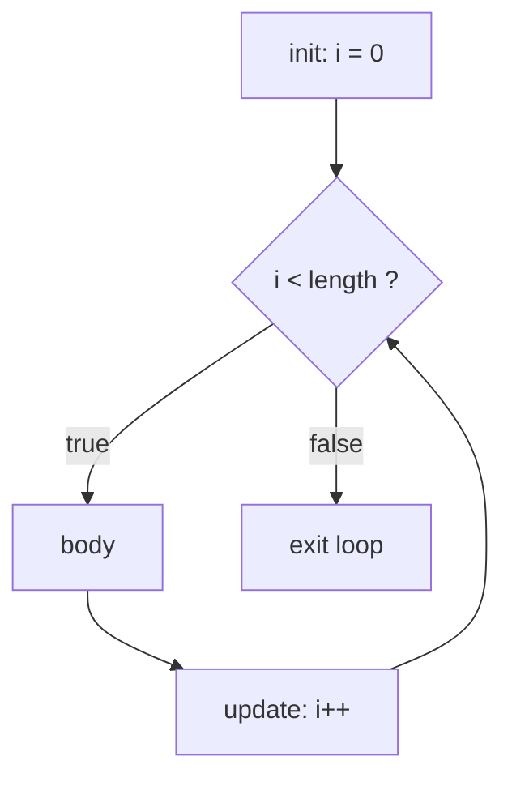
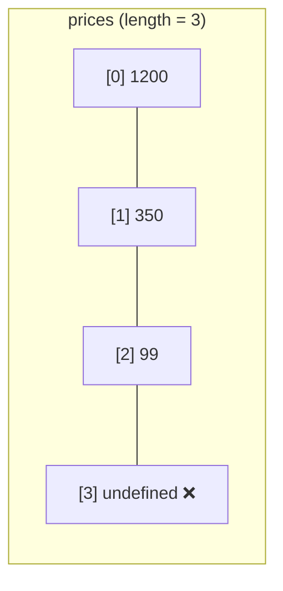

# Module 1.3 — الحلقات والتكرار
## Loops & Iteration

> **المستوى:** Level 1 | **الموقع:** [4 من 16]
> **السابق:** [M1.2 — Expressions & Conditions](module-1.2-expressions-conditions.md) | **التالي:** [M1.4 — Functions, Scope, Closures](module-1.4-functions-scope-closures.md)

---

## 1. المتطلبات
> **قبل أن تتعلم هذا، يجب أن تفهم:**
- [ ] الشروط والتعابير المنطقية — [M1.2](module-1.2-expressions-conditions.md)
- [ ] فكرة أن المعالج ينفذ تعليمة تلو الأخرى — [L0-M0.3](../level-0-absolute-foundations/module-03-running-a-program.md)

## 2. أهداف التعلّم
- كتابة `for`, `while`, `for...of` واختيار الأنسب.
- استخدام `break` و`continue` بوعي.
- التعرف على **الحلقة اللانهائية** وأسبابها، و**الخطأ بواحد** (off-by-one).
- فهم أن الحلقة هي **تكرار حالة متغيرة** — وأن تتبعها يدويًا (trace) مهارة أساسية.
- ملاحظة أولى عن **التكلفة**: حلقة داخل حلقة = عمل يتضاعف (تمهيد لـ Big-O في L3).

---

## 3. شرح للمبتدئ

الحاسوب ممتاز في شيء واحد: **تكرار نفس الخطوات ملايين المرات بلا ملل.** الحلقة هي طريقة قول "كرّر هذا حتى…".

### الأنواع الثلاثة التي تحتاجها

**1. `for...of` — "لكل عنصر في مجموعة"** (الأكثر استخدامًا، الأقل أخطاءً):
```typescript
const prices = [1200, 350, 99];
let total = 0;
for (const p of prices) {
  total += p;
}
console.log(total); // 1649
```

**2. `for` الكلاسيكية — عندما تحتاج العدّاد/الفهرس (index):**
```typescript
for (let i = 0; i < prices.length; i++) {
  console.log(i, prices[i]);     // 0 1200 / 1 350 / 2 99
}
```
ثلاثة أجزاء: **التهيئة** `let i = 0`؛ **الشرط** `i < prices.length` (يُفحص **قبل** كل دورة)؛ **التحديث** `i++` (بعد كل دورة).

**3. `while` — "كرّر ما دام شرط صحيحًا" (لا تعرف عدد المرات مسبقًا):**
```typescript
let attempts = 0;
while (!connected && attempts < 5) {
  connected = tryConnect();
  attempts++;
}
```

### `break` و`continue`
- `break` — اخرج من الحلقة فورًا.
- `continue` — تخطَّ باقي هذه الدورة وانتقل للتالية.

```typescript
for (const line of lines) {
  if (line.startsWith("#")) continue;   // تجاهل التعليقات
  if (line === "END") break;            // توقف عند العلامة
  process(line);
}
```

### الخطأ بواحد (Off-by-one)

أشهر bug في تاريخ البرمجة. مصفوفة من 3 عناصر فهارسها `0, 1, 2`. `prices[3]` هو `undefined`.
- `i <= prices.length` ❌ (دورة زائدة).
- `i < prices.length` ✅.
- لذلك `for...of` أأمن: لا فهارس = لا off-by-one.

### الحلقة اللانهائية

```typescript
let i = 0;
while (i < 10) {
  console.log(i);
  // نسينا i++ → i يبقى 0 → لا تنتهي أبدًا
}
```
البرنامج "يتجمد" ويستهلك 100% CPU (تذكر CPU-bound في L0). أوقفه بـ `Ctrl+C`. **كل حلقة `while` يجب أن تملك شيئًا يتغير يقرّبها من النهاية.**

### التتبع اليدوي (Tracing) — مهارة لا يتجاوزها محترف

لفهم حلقة، **ارسم جدولًا** بقيم المتغيرات في كل دورة:

```typescript
let sum = 0;
for (let i = 1; i <= 4; i++) { sum += i * i; }
```
| الدورة | `i` | `i*i` | `sum` بعد |
|---|---|---|---|
| 1 | 1 | 1 | 1 |
| 2 | 2 | 4 | 5 |
| 3 | 3 | 9 | 14 |
| 4 | 4 | 16 | 30 |
| فحص | 5 | — | الشرط `5 <= 4` false → خروج |

أو ضع **breakpoint** داخل الحلقة واضغط F5 ثم F10 وراقب المتغيرات — نفس الجدول، آليًا (M1.0).

### الحلقة المتداخلة والتكلفة

```typescript
for (const a of users)        // 1000 مستخدم
  for (const b of users)      // × 1000
    if (a.email === b.email && a !== b) duplicates.push(a);
```
هذا مليون مقارنة. مع 100,000 مستخدم → **10 مليار**. الحاسوب سريع، لكن ليس بلا حدود. في L3 ستتعلم أن هذا `O(n²)` وأن Map تحلّه بـ `O(n)`. الآن فقط **لاحظ**: حلقة داخل حلقة = حذار.

---

## 4. النموذج الذهني

```
for...of  →  "لكل عنصر"            (الافتراضي)
for (;;)  →  "أحتاج الفهرس i"       (تهيئة; شرط; تحديث)
while     →  "ما دام…"              (عدد مجهول — تأكد من التقدّم!)

كل حلقة = حالة تتغير + شرط يُفحص كل دورة + نهاية مضمونة
off-by-one: الفهارس تبدأ من 0 → آخر فهرس = length - 1
```

## 5. الرسم التوضيحي





## 6. مثال بسيط

```typescript
// جدول الضرب 1..5 (حلقة متداخلة بسيطة)
for (let r = 1; r <= 5; r++) {
  let row = "";
  for (let c = 1; c <= 5; c++) row += String(r * c).padStart(4);
  console.log(row);
}
```

## 7. مثال كود

```typescript
// src/log-stats.ts — تحليل سطور log: عدّ حسب المستوى، أول ERROR، إيقاف عند حد
const lines = [
  "# server log",
  "INFO  boot",
  "INFO  listening :3000",
  "WARN  slow query 1200ms",
  "ERROR db timeout",
  "INFO  retry ok",
  "ERROR payment failed",
];

let info = 0, warn = 0, error = 0;
let firstErrorLine = -1;
const MAX_ERRORS = 2;

for (let i = 0; i < lines.length; i++) {
  const line = lines[i];
  if (line === undefined || line.startsWith("#")) continue;   // تخطّي التعليقات

  if (line.startsWith("INFO")) info++;
  else if (line.startsWith("WARN")) warn++;
  else if (line.startsWith("ERROR")) {
    error++;
    if (firstErrorLine === -1) firstErrorLine = i + 1;         // رقم السطر للبشر يبدأ من 1
    if (error >= MAX_ERRORS) { console.log(`stopping at line ${i + 1}: too many errors`); break; }
  }
}

console.log({ info, warn, error, firstErrorLine });
// { info: 3, warn: 1, error: 2, firstErrorLine: 5 }
```

لاحظ `line === undefined`: مع `noUncheckedIndexedAccess` (من tsconfig في M1.0) النوع هو `string | undefined`، والشرط يضيّقه (M1.2).

## 8. مثال من العالم الحقيقي
- Excel: "اجمع العمود" = حلقة.
- خادم الويب: `while (true) { const req = await accept(); handle(req); }` — **حلقة لا نهائية مقصودة**؛ لا تنتهي لأن الخادم يجب أن يبقى حيًا. (الفرق عن bug: هي تنتظر `await`، لا تحرق CPU — M1.11.)
- محرك الألعاب: game loop 60 مرة/ثانية.

## 9. مثال من الإنتاج
**حادثة "الفوترة المضاعفة":** حلقة شهرية تمرّ على المشتركين وتسحب المبلغ. شرط الحلقة `i <= subscribers.length` → الدورة الأخيرة `subscribers[length]` = `undefined` → استثناء → **إعادة تشغيل المهمة من البداية** → سُحب من كل المشتركين مرتين. درسان: off-by-one، و**عدم إعادة تنفيذ عمليات غير idempotent** (L0-M0.6، L7).

## 10. مفاهيم خاطئة شائعة

| ❌ | ✅ |
|---|---|
| "`for...in` للمصفوفات" | `for...in` يمرّ على **المفاتيح كنصوص** ويتضمن خصائص موروثة. للمصفوفات: `for...of`. |
| "تعديل المصفوفة أثناء المرور عليها آمن" | حذف عناصر داخل `for...of` يقفز فوق عناصر. ابنِ مصفوفة جديدة (M1.5 `filter`). |
| "`i++` و`++i` مختلفان في الحلقة" | في جزء التحديث لا فرق عمليًا. |

## 11. أخطاء شائعة
1. `<=` بدل `<` مع `.length`.
2. `while` بلا تقدّم → حلقة لا نهائية.
3. `var i` بدل `let i` → `i` تتسرب خارج الحلقة (ومشكلة closures — M1.4).
4. `break` داخل حلقة داخلية يُنهي الداخلية فقط (استخدم label أو استخرج دالة و`return`).
5. عمل مكلف داخل الشرط: `for (let i = 0; i < expensive().length; i++)` يستدعي `expensive()` **كل دورة**.

## 12. تمرين تصحيح

```typescript
// يُفترض أن يعيد أول فهرس لـ target، أو -1
function indexOf(items: number[], target: number): number {
  let i = 0;
  while (i <= items.length) {
    if (items[i] === target) return i;
  }
  return -1;
}
console.log(indexOf([5, 8, 13], 13));
console.log(indexOf([5, 8, 13], 99));
```
الاستدعاء الأول لا يُرجع أبدًا. لماذا؟ وما الخطأ الثاني الذي سيظهر بعد إصلاح الأول؟

<details><summary>💡 الحل</summary>

1. لا `i++` داخل `while` → `i` يبقى 0 → `items[0] === 13` false للأبد → **حلقة لا نهائية** (البرنامج يتجمد، CPU 100%).
2. بعد إضافة `i++`: الشرط `i <= items.length` يفحص `items[3]` = `undefined`؛ لا ينهار هنا لكنه off-by-one سيصبح bug عند البحث عن `undefined` أو مع مصفوفات أخرى. الصحيح `<`.

```typescript
function indexOf(items: number[], target: number): number {
  for (let i = 0; i < items.length; i++) {
    if (items[i] === target) return i;
  }
  return -1;
}
```
(وفي الواقع `items.indexOf(target)` موجودة — M1.5.)
</details>

## 13. تمرين معماري
مهمة ليلية تمرّ على مليون سجل وترسل بريدًا لكل من انتهى اشتراكه. اسأل: إن انهارت في السجل 600,000، ماذا يحدث عند إعادة التشغيل؟ كيف تجعلها **قابلة للاستئناف** (resumable)؟ هل تحمّل المليون في الذاكرة أم تعالج دفعات (batches)؟ (تذكر streaming من L0.) اكتب Assumptions/Constraints/Tradeoffs/Risks/Recommendation.

## 14. الصلة بعصر AI
AI يكتب الحلقات بسرعة لكنه يخطئ في الحدود ويعشّش حلقات بلا وعي بالتكلفة. **تحقق:** تتبّع أول وآخر دورة يدويًا؛ ابحث عن حلقة داخل حلقة واسأل "كم مرة مع بيانات حقيقية؟"؛ ابحث عن `while` بلا تقدّم واضح.

## 15. ما يجب إتقانه (Must Master) 🔴
- 🔴 `for...of`, `for`, `while`؛ `break/continue`؛ off-by-one؛ التتبع اليدوي والجدول؛ breakpoint داخل حلقة.

## 16. ما يجب فهمه (Should Understand) 🟠
- 🟠 حلقة متداخلة = تكلفة مضاعفة؛ الفرق `for...in` / `for...of`؛ خادم = حلقة لا نهائية مقصودة.

## 17. ما يمكن تأجيله (Can Defer) ⚪
- ⚪ labeled break؛ `do...while`؛ generators/iterators protocol (M1.5 لمحة، L3).

## 18. الخلاصة
1. `for...of` افتراضيًا؛ `for` للفهرس؛ `while` للعدد المجهول.
2. كل حلقة: حالة تتغير + شرط + **نهاية مضمونة**.
3. الفهارس من 0 إلى `length - 1`؛ `<` لا `<=`.
4. تتبّع بالجدول أو بالـ debugger — لا تخمّن.
5. حلقة داخل حلقة = راقب الحجم.

## 19. مراجع رسمية
- MDN — Loops and iteration: https://developer.mozilla.org/en-US/docs/Web/JavaScript/Guide/Loops_and_iteration
- MDN — `for...of`: https://developer.mozilla.org/en-US/docs/Web/JavaScript/Reference/Statements/for...of
- MDN — Off-by-one (glossary): https://developer.mozilla.org/en-US/docs/Glossary/Off-by-one_error

## المصطلحات
| العربية | English |
|---|---|
| حلقة | Loop |
| تكرار | Iteration |
| فهرس | Index |
| عدّاد | Counter |
| خطأ بواحد | Off-by-one error |
| حلقة لا نهائية | Infinite loop |
| تتبّع | Trace / Tracing |
| حلقة متداخلة | Nested loop |
| دفعة | Batch |
| قابل للاستئناف | Resumable |

> **التالي:** [Module 1.4 — Functions, Scope, Closures](module-1.4-functions-scope-closures.md)
