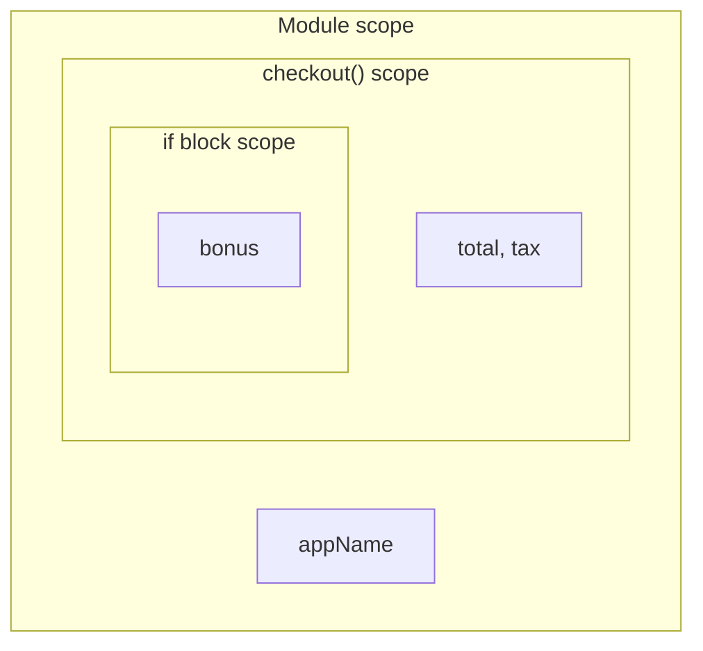
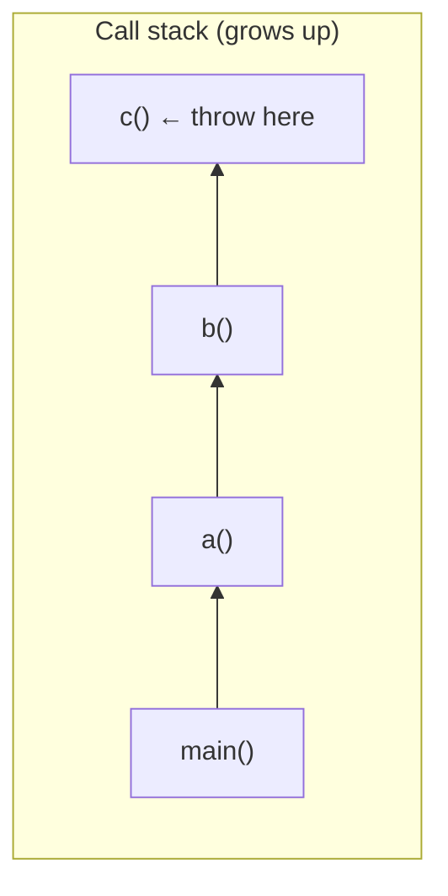
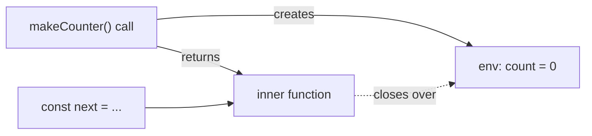

# Module 1.4 — الدوال، النطاق، الإغلاقات
## Functions, Scope, Closures

> **المستوى:** Level 1 | **الموقع:** [5 من 16]
> **السابق:** [M1.3 — Loops](module-1.3-loops.md) | **التالي:** [M1.5 — Arrays](module-1.5-arrays.md)

---

## 1. المتطلبات
- [ ] المتغيرات والأنواع — [M1.1](module-1.1-values-variables-types.md)
- [ ] الشروط والحلقات — [M1.2](module-1.2-expressions-conditions.md), [M1.3](module-1.3-loops.md)
- [ ] فكرة "المكدس" stack كمنطقة ذاكرة — [L0-M0.3](../level-0-absolute-foundations/module-03-running-a-program.md) (سنعمّقها)

## 2. أهداف التعلّم
- تعريف دالة واستدعاؤها، والتفريق بين **المعامل** (parameter) و**الوسيط** (argument) و**القيمة المعادة** (return value).
- كتابة توقيع (signature) مع أنواع في TypeScript، ومعاملات اختيارية وافتراضية.
- شرح **النطاق** (scope): أين يُرى المتغير، ولماذا `let`/`const` block-scoped.
- شرح **مكدس الاستدعاء** (call stack) وقراءة stack trace.
- فهم **الإغلاق** (closure) وأنه السبب في أن دالة "تتذكر" متغيرات محيطها.
- تمييز **الدالة النقية** (pure function) ولماذا نفضّلها.

---

## 3. شرح للمبتدئ

### لماذا الدوال؟
كتبت في M1.3 كودًا يعدّ سطور log. لو احتجته في 5 أماكن، هل تنسخه 5 مرات؟ ثم تصحّح bug في 5 أماكن؟ **الدالة** = تسمية قطعة كود وإعطاؤها مدخلات ومخرجات، لتُستدعى من أي مكان.

```typescript
//        المعاملات (parameters) مع أنواعها       نوع المُعاد
function area(width: number, height: number): number {
  return width * height;        // return يُنهي الدالة ويُعيد القيمة
}

const a = area(3, 4);           // 3 و 4 = الوسائط (arguments) → a = 12
```

- **Parameter**: الاسم في التعريف (`width`). **Argument**: القيمة الفعلية في الاستدعاء (`3`).
- دالة بلا `return` تعيد `undefined` (نوعها `void` في TS).
- **التوقيع** (signature) = الاسم + أنواع المعاملات + نوع المعاد. التوقيع هو **العقد** (contract): ما تحتاجه وما تَعِد به.

### ثلاث طرق للكتابة
```typescript
function f1(x: number): number { return x * 2; }            // declaration
const f2 = function (x: number): number { return x * 2; };  // expression
const f3 = (x: number): number => x * 2;                    // arrow (الأقصر)
```
الفرق المهم الوحيد الآن: الدوال **قيم** — يمكن تخزينها في متغير، تمريرها لدالة أخرى، وإعادتها من دالة. هذا ما يجعل `arr.map(f3)` ممكنًا (M1.5).

### معاملات اختيارية وافتراضية
```typescript
function greet(name: string, greeting: string = "Hello"): string {
  return `${greeting}, ${name}!`;
}
greet("Sara");            // "Hello, Sara!"
greet("Sara", "Salam");   // "Salam, Sara!"

function log(msg: string, level?: string) {   // ? = اختياري → نوعه string | undefined
  console.log(`[${level ?? "INFO"}] ${msg}`);
}
```

### النطاق (Scope): أين "يُرى" المتغير؟

```typescript
const appName = "shop";               // global/module scope: يُرى في كل مكان في الملف

function checkout(total: number) {    // function scope: total, tax يُريان داخل الدالة فقط
  const tax = total * 0.19;
  if (total > 100) {
    const bonus = 5;                  // block scope: bonus يُرى داخل { } هذه فقط
  }
  // console.log(bonus);  ❌ ReferenceError: bonus is not defined
  return total + tax;
}
// console.log(tax);      ❌ غير مرئي هنا
```

**القاعدة:** الداخل يرى الخارج؛ الخارج لا يرى الداخل. كل `{ }` (دالة، `if`، `for`) تصنع نطاقًا جديدًا لـ `let`/`const`. (`var` يتجاهل كتل `if`/`for` — سبب آخر لعدم استخدامه.)

### مكدس الاستدعاء (Call Stack)

عندما تستدعي دالة، يضع المحرك **إطارًا** (frame) على المكدس يحوي معاملاتها ومتغيراتها المحلية. عند `return` يُزال الإطار. الدالة التي تستدعي دالة تستدعي دالة = إطارات مكدسة.

```typescript
function c() { throw new Error("boom"); }
function b() { c(); }
function a() { b(); }
a();
```
```
Error: boom
    at c (src/x.ts:1:22)   ← أعلى المكدس: أين حدث
    at b (src/x.ts:2:16)   ← من استدعى c
    at a (src/x.ts:3:16)
    at <anonymous> (src/x.ts:4:1)
```
هذا **stack trace** — تقرؤه **من الأعلى** (مكان الانفجار) **إلى الأسفل** (من أوصلنا إليه). في VS Code: لوحة CALL STACK في وضع التصحيح تريك نفس الشيء حيًا.

**Stack overflow:** دالة تستدعي نفسها بلا توقف → إطارات لا تنتهي → `RangeError: Maximum call stack size exceeded`. (الاستدعاء الذاتي المقصود = recursion، L3.)

### الإغلاق (Closure) — الدالة تتذكر محيطها

```typescript
function makeCounter() {
  let count = 0;                       // متغير محلي في makeCounter
  return function () {                 // دالة داخلية
    count++;
    return count;
  };
}

const next = makeCounter();            // makeCounter انتهت… لكن count لم يُمحَ!
console.log(next(), next(), next());   // 1 2 3
const other = makeCounter();
console.log(other());                  // 1  ← عدّاد مستقل
```

ما حدث: الدالة الداخلية **تشير** إلى `count`. طالما أحد يحمل الدالة الداخلية (`next`)، يبقى `count` حيًا في الذاكرة (على heap، لا stack). **الإغلاق = دالة + المتغيرات التي كانت حولها عند إنشائها.**

لماذا يهمك الآن؟
1. كل callback تمرّه (في `setTimeout`, `.map`, معالجات الأحداث) هو إغلاق يرى متغيراتك.
2. يفسّر الـ bug الكلاسيكي مع `var` في الحلقات (تمرين التصحيح).
3. هو الأساس لـ "الحالة الخاصة" (private state) قبل أن تتعلم classes.

### الدالة النقية (Pure Function)

دالة **نقية** إذا:
1. نفس المدخلات → **دائمًا** نفس المخرجات.
2. **لا آثار جانبية** (side effects): لا تعدّل شيئًا خارجها، لا تطبع، لا تكتب ملفًا، لا تقرأ الوقت.

```typescript
const add = (a: number, b: number) => a + b;             // ✅ نقية
let total = 0;
const addToTotal = (x: number) => { total += x; };       // ❌ تعدّل خارجها
const now = () => Date.now();                            // ❌ مخرج مختلف كل مرة
```
الدوال النقية **سهلة الاختبار والفهم والتوازي**. القاعدة العملية: **اجعل قلب المنطق نقيًا، وادفع الآثار الجانبية (I/O) إلى الأطراف.** (M1.7 يعمّق.)

---

## 4. النموذج الذهني

```
function name(params): ReturnType { body; return value; }
         ↑ العقد (signature)                   ↑ الوفاء به

Scope:  { الداخل يرى الخارج }  — الخارج لا يرى الداخل
Stack:  كل استدعاء = إطار؛ return = إزالة الإطار؛ stack trace = الإطارات من الأعلى
Closure: دالة + البيئة التي وُلدت فيها (المتغيرات تبقى حية ما دامت الدالة حية)
Pure:   مدخلات → مخرجات، لا شيء آخر
```

## 5. الرسم التوضيحي







## 6. مثال بسيط

```typescript
function clamp(value: number, min: number, max: number): number {
  if (value < min) return min;   // guard clauses من M1.2
  if (value > max) return max;
  return value;
}
console.log(clamp(15, 0, 10), clamp(-3, 0, 10), clamp(7, 0, 10)); // 10 0 7
```

## 7. مثال كود

```typescript
// src/pricing.ts — دوال نقية صغيرة + دالة مركّبة + إغلاق لإعدادات

export function applyDiscount(cents: number, percent: number): number {
  if (percent < 0 || percent > 100) throw new RangeError(`bad percent ${percent}`);
  return Math.round(cents * (100 - percent) / 100);
}

export function addTax(cents: number, ratePercent: number): number {
  return Math.round(cents * (100 + ratePercent) / 100);
}

// دالة تعيد دالة: "مصنع" مسعّر مهيّأ لبلد معيّن (closure فوق taxRate)
export function makePricer(taxRate: number) {
  return (cents: number, discountPercent = 0): number =>
    addTax(applyDiscount(cents, discountPercent), taxRate);
}

const priceDZ = makePricer(19);
const priceFR = makePricer(20);
console.log(priceDZ(10000));      // 11900
console.log(priceDZ(10000, 10));  // 10710
console.log(priceFR(10000, 10));  // 10800
```

لاحظ: `applyDiscount` و`addTax` **نقيتان** → يمكن اختبارهما بجدول مدخلات/مخرجات دون أي إعداد. `makePricer` يستخدم closure لحمل `taxRate` بدل تمريره في كل مرة.

## 8. مثال من العالم الحقيقي
`Array.prototype.map`, `setTimeout(cb, ms)`, `server.on("request", handler)` — كلها **تستقبل دوالًا**. و`handler` الذي تكتبه يرى `db` و`config` من الملف عبر الإغلاق — لهذا لا تحتاج تمريرها.

## 9. مثال من الإنتاج
**حادثة "الإعدادات المجمّدة":** فريق أنشأ `const limiter = makeRateLimiter(config.limit)` عند الإقلاع. لاحقًا غيّروا `config.limit` ديناميكيًا وتساءلوا لماذا لا يتغير شيء. **السبب:** الإغلاق التقط **قيمة** `config.limit` (رقم بدائي) لحظة الاستدعاء، لا مرجعًا حيًا. **الدرس:** افهم ما يلتقطه الإغلاق بالضبط: متغيرًا (حيًا) أم نسخة قيمة؟ (M1.6 عن المراجع.)

## 10. مفاهيم خاطئة شائعة

| ❌ | ✅ |
|---|---|
| "الدالة تُنفّذ عند تعريفها" | تُنفّذ عند **استدعائها** `f()`. `f` وحدها = القيمة (الدالة نفسها). |
| "المتغير المحلي يُمحى دائمًا بعد return" | إن التقطه إغلاق يبقى حيًا. |
| "arrow function مجرد اختصار" | غالبًا نعم، لكن تختلف في `this` (L4 مع classes). |
| "كلما قلّ عدد الدوال كان أسرع" | التأثير مهمل؛ الوضوح والاختبار أهم بمراحل. |

## 11. أخطاء شائعة
1. نسيان `return` → `undefined`.
2. نسيان الأقواس: `const x = f;` بدل `f()`.
3. دالة تفعل 5 أشياء (اسمها `processAndSaveAndNotify`) — قسّمها.
4. الاعتماد على متغيرات خارجية خفية بدل تمريرها كمعاملات.
5. معاملات كثيرة بوضعية (positional): `create(a, b, true, false, null)` → مرّر كائن (M1.6).

## 12. تمرين تصحيح

```javascript
// ملف .js عمدًا (TS كان سيحذّر)
for (var i = 0; i < 3; i++) {
  setTimeout(function () { console.log("i =", i); }, 10);
}
// متوقع: i = 0, i = 1, i = 2
// فعلي:   i = 3, i = 3, i = 3
```
لماذا؟ وما الإصلاحان؟

<details><summary>💡 الحل</summary>

`var` function-scoped → **متغير `i` واحد** تشترك فيه الدورات الثلاث. الـ callbacks إغلاقات فوق **نفس** `i`. تُنفّذ بعد انتهاء الحلقة (M1.11)، وحينها `i === 3`.

الإصلاح 1: `let i` → كل دورة تحصل على `i` **جديدًا** خاصًا بها (block scope)، فكل إغلاق يلتقط نسخته. الإصلاح 2 (قديم): لفّ الجسم بدالة تستقبل `i` كمعامل (IIFE). **الدرس:** `const`/`let` ليست أناقة؛ تمنع فئة كاملة من الـ bugs.
</details>

## 13. تمرين معماري
لديك دالة `sendInvoice(order)` تحسب الضريبة، تنسّق PDF، ترسل بريدًا، وتسجّل في DB. اقترح تقسيمها: أي الأجزاء يمكن أن تكون **نقية** (قابلة للاختبار بلا شبكة/قرص)؟ وأي الأجزاء "أطراف" (I/O)؟ ارسم مخططًا: core pure ← → shell with side effects. (هذا نمط "functional core, imperative shell".)

## 14. الصلة بعصر AI
AI يولّد دوالًا بسرعة — عادةً **طويلة وغير نقية**. **تحقق:** هل للدالة مسؤولية واحدة؟ هل تعتمد على متغيرات خارجية خفية؟ اطلب: *"قسّم هذه إلى دوال نقية + طبقة I/O رقيقة واكتب اختبارات للنقية."* واقرأ كل stack trace بنفسك قبل لصقه للـ AI — غالبًا السطر الأول يكفيك.

## 15–17. Master / Understand / Defer
- 🔴 تعريف/استدعاء؛ parameter vs argument؛ signature كعقد؛ scope (الداخل يرى الخارج)؛ قراءة stack trace؛ ما الإغلاق ولماذا `let` في الحلقات؛ ما الدالة النقية.
- 🟠 الدوال كقيم (higher-order)؛ معاملات افتراضية/اختيارية؛ functional core / imperative shell؛ stack overflow.
- ⚪ `this` وارتباطه؛ `arguments` object؛ currying؛ recursion (L3-M7).

## 18. الخلاصة
1. الدالة = اسم + عقد (signature) + جسم. `return` يُعيد ويُنهي.
2. الدوال **قيم**: تُخزَّن وتُمرَّر وتُعاد.
3. النطاق: الداخل يرى الخارج فقط. `let`/`const` block-scoped.
4. كل استدعاء إطار على المكدس؛ stack trace يُقرأ من الأعلى.
5. الإغلاق = دالة + بيئتها؛ يبقي المتغيرات حية.
6. اجعل القلب نقيًا وادفع الآثار الجانبية للأطراف.

## 19. مراجع رسمية
- MDN — Functions: https://developer.mozilla.org/en-US/docs/Web/JavaScript/Guide/Functions
- MDN — Closures: https://developer.mozilla.org/en-US/docs/Web/JavaScript/Closures
- MDN — Scope (glossary): https://developer.mozilla.org/en-US/docs/Glossary/Scope
- MDN — Call stack: https://developer.mozilla.org/en-US/docs/Glossary/Call_stack
- TypeScript — More on Functions: https://www.typescriptlang.org/docs/handbook/2/functions.html

## المصطلحات
| العربية | English |
|---|---|
| دالة | Function |
| معامل / وسيط | Parameter / Argument |
| قيمة معادة | Return value |
| توقيع | Signature |
| دالة سهمية | Arrow function |
| نطاق | Scope |
| نطاق الكتلة | Block scope |
| مكدس الاستدعاء | Call stack |
| إطار | Stack frame |
| تتبع المكدس | Stack trace |
| إغلاق | Closure |
| دالة نقية | Pure function |
| أثر جانبي | Side effect |
| دالة عليا | Higher-order function |
| دالة رد نداء | Callback |

> **التالي:** [Module 1.5 — Arrays & Transformations](module-1.5-arrays.md)
