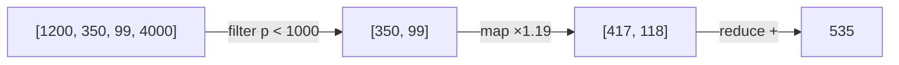
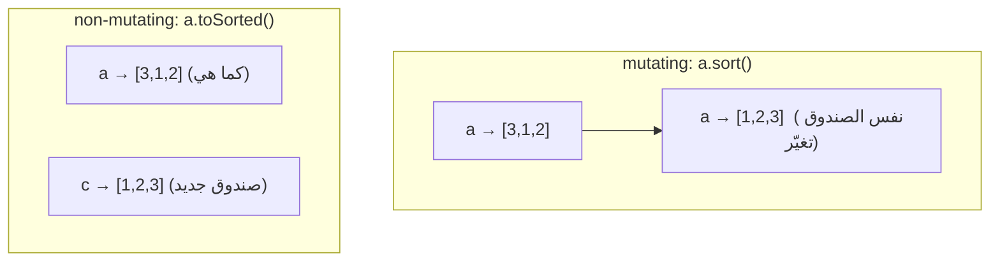

# Module 1.5 — المصفوفات والتحويلات
## Arrays & Transformations (map / filter / reduce)

> **المستوى:** Level 1 | **الموقع:** [6 من 16]
> **السابق:** [M1.4 — Functions, Scope, Closures](module-1.4-functions-scope-closures.md) | **التالي:** [M1.6 — Objects & References](module-1.6-objects-references.md)

---

## 1. المتطلبات
- [ ] الحلقات والفهارس — [M1.3](module-1.3-loops.md)
- [ ] الدوال كقيم، arrow functions، الدوال النقية — [M1.4](module-1.4-functions-scope-closures.md)

## 2. أهداف التعلّم
- إنشاء المصفوفات والوصول للعناصر وفهم `length` والفهارس.
- التمييز بين الدوال **المحوِّلة في مكانها** (mutating: `push`, `splice`, `sort`) و**المُعيدة لمصفوفة جديدة** (`map`, `filter`, `slice`, `toSorted`).
- استخدام `map` / `filter` / `reduce` / `find` / `some` / `every` بطلاقة، وقراءة سلسلة منها.
- اختيار بين حلقة صريحة وسلسلة تحويلات.
- تمييز المصفوفة في TypeScript: `number[]`, `string[]`, `readonly`، و`noUncheckedIndexedAccess`.

---

## 3. شرح للمبتدئ

### ما المصفوفة؟
**المصفوفة** (**array**) = قائمة مرتّبة من القيم، كل قيمة لها **فهرس** يبدأ من 0.

```typescript
const scores: number[] = [90, 75, 60];
scores[0];        // 90
scores.length;    // 3
scores[scores.length - 1];   // 60 (الأخير)  — أو scores.at(-1)
```

### تعديل في المكان vs إعادة جديدة — الفكرة الأهم في هذا الموديول

| تعدّل المصفوفة الأصلية (**mutating**) | تعيد مصفوفة **جديدة** (الأصلية لا تتغير) |
|---|---|
| `push`, `pop`, `shift`, `unshift` | `map`, `filter`, `slice`, `concat` |
| `splice`, `sort`, `reverse` | `toSorted`, `toReversed`, `toSpliced` (Node 20+) |
| `arr[i] = x` | `[...arr, x]` (spread) |

لماذا يهم؟ لأن المصفوفة **مرجع** (reference، M1.6): إن مرّرتها لدالة وعدّلتها الدالة في مكانها، **تغيّرت عند المستدعي أيضًا** دون أن يعلم. القاعدة في هذا الكورس: **فضّل غير المعدِّلة** إلا عند الحاجة الواضحة.

```typescript
const a = [3, 1, 2];
const b = a.sort();          // ❌ a أصبحت [1,2,3] أيضًا! (و b === a)
const c = a.toSorted();      // ✅ a كما هي، c جديدة
```

### الثلاثي الذهبي: map / filter / reduce

كل واحدة **تستقبل دالة** (M1.4) وتطبقها على العناصر:

```typescript
const prices = [1200, 350, 99, 4000];

// map: حوّل كل عنصر → مصفوفة بنفس الطول
const withTax = prices.map(p => Math.round(p * 1.19));   // [1428, 417, 118, 4760]

// filter: أبقِ ما يحقق الشرط → مصفوفة أقصر أو مساوية
const cheap = prices.filter(p => p < 1000);              // [350, 99]

// reduce: اطوِ المصفوفة إلى قيمة واحدة (المجمّع acc يبدأ بـ 0)
const total = prices.reduce((acc, p) => acc + p, 0);     // 5649
```

تتبّع `reduce` بالجدول (M1.3):
| دورة | `acc` قبل | `p` | `acc` بعد |
|---|---|---|---|
| 1 | 0 | 1200 | 1200 |
| 2 | 1200 | 350 | 1550 |
| 3 | 1550 | 99 | 1649 |
| 4 | 1649 | 4000 | 5649 |

### الأدوات المساعدة

```typescript
prices.find(p => p > 1000);        // 1200  (أول عنصر يحقق) — أو undefined
prices.findIndex(p => p > 1000);   // 0
prices.some(p => p > 3000);        // true  (هل يوجد واحد على الأقل؟)
prices.every(p => p > 0);          // true  (هل الكل؟)
prices.includes(99);               // true
prices.indexOf(99);                // 2
prices.slice(1, 3);                // [350, 99]  (من 1 إلى قبل 3؛ لا تعدّل)
[..."abc"];                        // ["a","b","c"]  spread
["x", "y"].join(", ");             // "x, y"
"a,b,c".split(",");                // ["a","b","c"]
```

### السلسلة (Chaining)

```typescript
const report = orders
  .filter(o => o.status === "paid")
  .map(o => o.totalCents)
  .reduce((sum, c) => sum + c, 0);
```
تُقرأ كجملة: "الطلبات المدفوعة ← مبالغها ← مجموعها". **أوضح من حلقة** عندما يكون كل خطوة تحويلًا بسيطًا. استخدم **حلقة** عندما تحتاج `break` مبكرًا، أو عدة نتائج من مرور واحد، أو أداءً على مصفوفات ضخمة.

### الفرز (sort) — مصيدة

```typescript
[10, 9, 1].sort();                 // [1, 10, 9] ❌  يفرز كنصوص افتراضيًا!
[10, 9, 1].toSorted((a, b) => a - b);   // [1, 9, 10] ✅ دالة مقارنة: سالب = a قبل b
names.toSorted((a, b) => a.localeCompare(b));   // نصوص بشكل صحيح
```

### المصفوفة في TypeScript

```typescript
const xs: number[] = [];
xs.push("a");              // ❌ خطأ نوع
const first = xs[0];       // النوع: number | undefined  (بفضل noUncheckedIndexedAccess)
if (first !== undefined) { first.toFixed(2); }

function sum(values: readonly number[]) {  // readonly: الدالة تَعِد بعدم التعديل
  // values.push(1);  ❌
  return values.reduce((a, b) => a + b, 0);
}
```

---

## 4. النموذج الذهني

```
array = صندوق مرتّب [0][1][2]...[length-1]

map     : n → n       (حوّل كل واحد)
filter  : n → ≤ n     (أبقِ بعضها)
reduce  : n → 1       (اطوِ إلى قيمة)
find    : n → واحد أو undefined
some/every : n → boolean

Mutating (push/sort/splice) يغيّر الأصل  |  Non-mutating (map/filter/toSorted) يعيد جديدًا
→ فضّل الجديد؛ المصفوفة مرجع مشترك
```

## 5. الرسم التوضيحي





## 6. مثال بسيط

```typescript
const words = ["kiwi", "apple", "fig", "banana"];
console.log(words.map(w => w.length));                        // [4,5,3,6]
console.log(words.filter(w => w.length > 3));                 // ["kiwi","apple","banana"]
console.log(words.toSorted((a, b) => a.length - b.length));   // ["fig","kiwi","apple","banana"]
console.log(words.find(w => w.startsWith("b")));              // "banana"
console.log(words.reduce((longest, w) => w.length > longest.length ? w : longest, ""));  // "banana"
```

## 7. مثال كود

```typescript
// src/sales.ts — تمهيد لمشروع 2: من صفوف مبيعات إلى تقرير
type Sale = { product: string; qty: number; unitCents: number; region: string };

const sales: Sale[] = [
  { product: "Mouse",    qty: 3, unitCents: 2500,  region: "West" },
  { product: "Keyboard", qty: 1, unitCents: 7900,  region: "East" },
  { product: "Mouse",    qty: 2, unitCents: 2500,  region: "East" },
  { product: "Monitor",  qty: 1, unitCents: 32000, region: "West" },
];

const revenue = sales.reduce((sum, s) => sum + s.qty * s.unitCents, 0);

// تجميع حسب المنتج (reduce إلى كائن) — M1.6 يشرح الكائنات أكثر
const byProduct = sales.reduce<Record<string, number>>((acc, s) => {
  acc[s.product] = (acc[s.product] ?? 0) + s.qty * s.unitCents;   // ?? لأن المفتاح قد لا يوجد بعد
  return acc;
}, {});

const topProduct = Object.entries(byProduct)             // [["Mouse",12500],["Keyboard",7900],...]
  .toSorted((a, b) => b[1] - a[1])[0];                   // الأعلى أولًا → أول عنصر

const westOnly = sales.filter(s => s.region === "West").map(s => s.product);

console.log({ revenue, byProduct, topProduct, westOnly });
// revenue: 52400, byProduct: { Mouse: 12500, Keyboard: 7900, Monitor: 32000 },
// topProduct: ["Monitor", 32000], westOnly: ["Mouse","Monitor"]
```

ملاحظة على `topProduct`: نوعه `[string, number] | undefined` لأن المصفوفة قد تكون فارغة — TypeScript يذكّرك بالتعامل مع "لا مبيعات".

## 8. مثال من العالم الحقيقي
كل قائمة في أي تطبيق: رسائل، منتجات، نتائج بحث. "اعرض المنتجات المتاحة مرتبة بالسعر" = `filter` ثم `toSorted` ثم `map` إلى عناصر واجهة. وأي استجابة API تعيد قائمة هي مصفوفة JSON.

## 9. مثال من الإنتاج
**حادثة "الترتيب المقلوب للمستخدمين":** دالة `getTopUsers(users)` فعلت `users.sort(...)` ثم أعادت أول 10. لكن `users` كانت المصفوفة **المخبأة (cached)** المشتركة بين كل الطلبات → كل استدعاء أعاد ترتيب الذاكرة المشتركة، وطلبات متزامنة رأت قوائم نصف مرتّبة. **الإصلاح:** `toSorted` (أو `[...users].sort`). **الدرس:** mutation على بيانات مشتركة = bugs يصعب إعادة إنتاجها.

## 10. مفاهيم خاطئة شائعة

| ❌ | ✅ |
|---|---|
| "`sort()` يرتب الأرقام" | يرتب **كنصوص**. مرّر دالة مقارنة دائمًا. |
| "`map` لتنفيذ شيء لكل عنصر" | `map` **للتحويل** ويعيد مصفوفة؛ للتنفيذ فقط استخدم `for...of` (أو `forEach`). |
| "`filter` يعدّل المصفوفة" | يعيد جديدة؛ الأصلية كما هي. |
| "`arr.length = 0` غريب" | في الواقع يفرّغ المصفوفة في مكانها (mutating). |
| "`reduce` دائمًا أوضح" | لا. للتجميعات البسيطة نعم؛ للمنطق المعقد، حلقة أوضح. |

## 11. أخطاء شائعة
1. نسيان القيمة الأولية في `reduce` → مع مصفوفة فارغة ينفجر `TypeError`.
2. `arr[arr.length]` (خارج النطاق) بدل `arr.length - 1`.
3. `find` يعيد `undefined` — استخدمه مباشرة دون فحص.
4. حذف عناصر أثناء `for...of` بـ `splice` → قفز عناصر. استخدم `filter`.
5. `includes` مع كائنات (يقارن المراجع لا المحتوى — M1.6).

## 12. تمرين تصحيح

```typescript
const ids = [3, 11, 2];
const sorted = ids.sort();
const biggest = sorted[sorted.length - 1];
const doubled = ids.map(x => x * 2);
console.log({ biggest, ids, doubled });
// متوقع: biggest 11, ids [3,11,2], doubled [6,22,4]
// فعلي:   biggest 3,  ids [11,2,3], doubled [22,4,6]
```

<details><summary>💡 الحل</summary>

1. `sort()` بلا مقارن → ترتيب نصي: `"11" < "2" < "3"` → `[11, 2, 3]`؛ لذلك "الأكبر" 3.
2. `sort` **عدّل `ids` في مكانها** → `ids` و`doubled` تأثرا.

```typescript
const sorted = ids.toSorted((a, b) => a - b);   // [2, 3, 11]، ids سليمة
const biggest = sorted.at(-1);                   // 11 (نوعه number | undefined)
```
</details>

## 13. تمرين معماري
ملف مبيعات بـ 50 مليون صف. سلسلة `.filter().map().reduce()` تُنشئ مصفوفتين وسيطتين بحجم عشرات الملايين. اسأل: كم ذاكرة؟ هل تكفي حلقة واحدة تحسب كل شيء في مرور واحد؟ هل يجب أصلًا تحميل الملف كله (تذكّر streaming في L0-M0.3)؟ قارن: وضوح السلسلة vs كفاءة الحلقة الواحدة؛ متى تختار أيًا منهما؟

## 14. الصلة بعصر AI
AI يستخدم `sort` في المكان و`reduce` معقّدًا و`forEach` بدل `map` كثيرًا. **تحقق:** هل تُعدَّل مصفوفة قادمة من خارج الدالة؟ هل لكل `reduce` قيمة أولية؟ هل `sort` له مقارن؟ وإن كانت السلسلة أطول من 4 خطوات اطلب أسماء وسيطة (`const paidOrders = ...`).

## 15–17. Master / Understand / Defer
- 🔴 إنشاء/فهرسة/`length`؛ mutating vs non-mutating؛ `map/filter/reduce/find/some/every`؛ `sort` مع مقارن؛ `toSorted`؛ spread `[...a]`.
- 🟠 `reduce` إلى كائن (grouping)؛ `Object.entries`؛ `readonly number[]`؛ متى الحلقة أوضح.
- ⚪ `flatMap`, `Array.from({length})`, typed arrays, iterators/generators (L3).

## 18. الخلاصة
1. المصفوفة قائمة مرتّبة بفهارس من 0؛ وهي **مرجع مشترك**.
2. **فضّل غير المعدِّلة**: `map/filter/slice/toSorted`؛ احذر `sort/splice/push` على بيانات لا تملكها.
3. `map` تحوّل، `filter` تنتقي، `reduce` تطوي (مع قيمة أولية!).
4. `sort()` بلا مقارن يرتّب نصيًا.
5. `find`/`[i]` قد يعيدان `undefined` — TypeScript يذكّرك؛ تعامل معه.

## 19. مراجع رسمية
- MDN — Array: https://developer.mozilla.org/en-US/docs/Web/JavaScript/Reference/Global_Objects/Array
- MDN — Copying vs mutating methods: https://developer.mozilla.org/en-US/docs/Web/JavaScript/Reference/Global_Objects/Array#copying_methods_and_mutating_methods
- MDN — `Array.prototype.reduce`: https://developer.mozilla.org/en-US/docs/Web/JavaScript/Reference/Global_Objects/Array/reduce
- MDN — `toSorted`: https://developer.mozilla.org/en-US/docs/Web/JavaScript/Reference/Global_Objects/Array/toSorted

## المصطلحات
| العربية | English |
|---|---|
| مصفوفة | Array |
| فهرس | Index |
| معدِّل في المكان | Mutating (in-place) |
| غير معدِّل | Non-mutating / Copying |
| تحويل | Transformation (map) |
| ترشيح | Filter |
| طيّ / تجميع | Reduce / Fold |
| مجمّع | Accumulator |
| سلسلة استدعاءات | Method chaining |
| نشر | Spread (`...`) |
| دالة مقارنة | Comparator |
| للقراءة فقط | Readonly |

> **التالي:** [Module 1.6 — Objects & References](module-1.6-objects-references.md)
