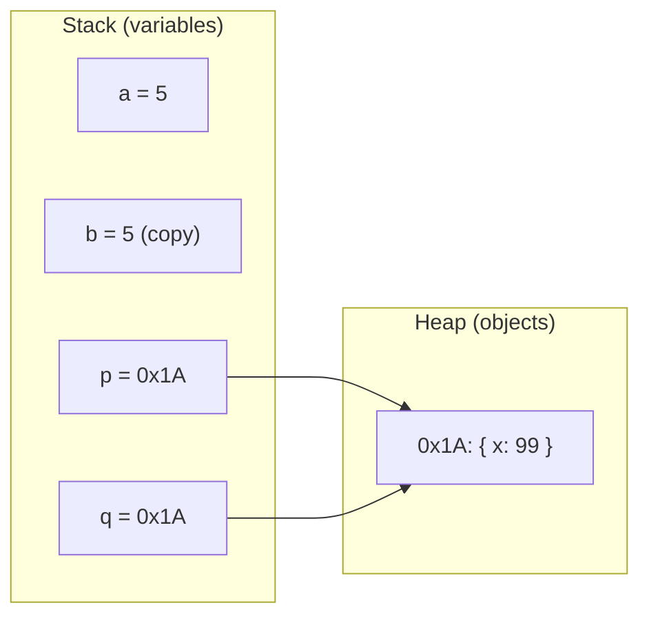
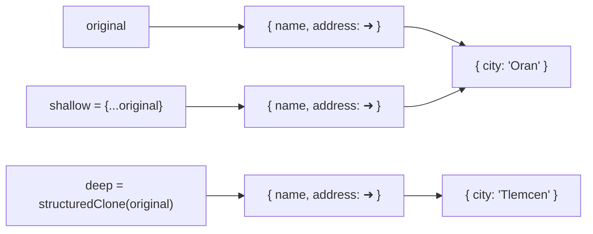

# Module 1.6 — الكائنات والمراجع
## Objects & References (value vs reference, JSON)

> **المستوى:** Level 1 | **الموقع:** [7 من 16]
> **السابق:** [M1.5 — Arrays](module-1.5-arrays.md) | **التالي:** [M1.7 — State, Side Effects, Immutability](module-1.7-state-side-effects-immutability.md)

---

## 1. المتطلبات
- [ ] الأنواع البدائية — [M1.1](module-1.1-values-variables-types.md)
- [ ] المصفوفات وفكرة mutating — [M1.5](module-1.5-arrays.md)
- [ ] الذاكرة كصناديق بعناوين — [L0-M0.3](../level-0-absolute-foundations/module-03-running-a-program.md)

## 2. أهداف التعلّم
- إنشاء **كائن** (object) والوصول لخصائصه (dot / bracket)، وإضافة/حذف خصائص.
- شرح الفرق الحاسم: **البدائيات تُنسخ بالقيمة، الكائنات تُشارك بالمرجع**.
- تمييز **النسخ السطحي** (shallow copy) من **العميق** (deep copy)، و`structuredClone`.
- استخدام **optional chaining** `?.` و**destructuring** و**spread** للكائنات.
- التحويل من/إلى **JSON** وفهم حدوده.
- وصف شكل الكائن في TypeScript بـ `type` / `interface`.

---

## 3. شرح للمبتدئ

### ما الكائن؟
المصفوفة قائمة بفهارس رقمية. **الكائن** مجموعة من **أزواج مفتاح → قيمة** بأسماء:

```typescript
const user = {
  id: 42,
  name: "Sara",
  email: "sara@example.com",
  tags: ["admin", "beta"],       // قيمة يمكن أن تكون مصفوفة
  address: { city: "Tlemcen" },  // أو كائنًا آخر (تداخل)
};

user.name;             // "Sara"       (dot)
user["email"];         // بالأقواس — مفيد عندما يكون المفتاح في متغير
user.address.city;     // "Tlemcen"
user.age = 30;         // ❌ في TypeScript: Property 'age' does not exist (الشكل محدد)
```

في TypeScript، شكل الكائن **نوع**:
```typescript
type User = {
  id: number;
  name: string;
  email: string;
  tags: string[];
  address?: { city: string };    // ? = اختيارية → قد تكون undefined
};
```
(`interface User {...}` تفعل نفس الشيء هنا؛ الفرق تفصيلي — M1.15.)

### أهم فكرة في هذا الموديول: القيمة مقابل المرجع

```typescript
// بدائي: نسخ بالقيمة
let a = 5;
let b = a;      // b تحصل على نسخة
b = 6;
console.log(a); // 5  ✅ لم تتأثر

// كائن: مشاركة بالمرجع
const p = { x: 1 };
const q = p;    // q تحصل على **عنوان نفس الصندوق** لا نسخة
q.x = 99;
console.log(p.x); // 99 ❗ تغيّر p أيضًا
```

لماذا؟ المتغير الذي يحمل كائنًا لا يحمل الكائن نفسه؛ يحمل **مرجعًا** (reference = عنوان في الذاكرة heap). `q = p` ينسخ **العنوان**. الصندوقان يشيران لنفس المكان.

نفس الشيء عند تمرير كائن لدالة:
```typescript
function rename(u: User) { u.name = "X"; }   // تعدّل الكائن الأصلي عند المستدعي!
```
وهذا بالضبط لماذا كانت `sort()` خطيرة في M1.5: المصفوفات كائنات.

**`const` لا تجمّد الكائن.** `const p` تمنع `p = شيء آخر`، لا تمنع `p.x = 99`. للتجميد السطحي: `Object.freeze(p)` (M1.7).

### المساواة

```typescript
{ x: 1 } === { x: 1 }      // false! صندوقان مختلفان
p === q                    // true  نفس الصندوق
```
`===` على الكائنات يقارن **العناوين**، لا المحتوى. لمقارنة المحتوى: قارن الحقول يدويًا أو بمكتبة.

### النسخ: سطحي vs عميق

```typescript
const original = { name: "Sara", address: { city: "Tlemcen" } };

const shallow = { ...original };          // spread: نسخة سطحية
shallow.name = "Lina";                    // ✅ original.name لا يزال "Sara"
shallow.address.city = "Oran";            // ❗ original.address.city أصبح "Oran"!
// لأن address نفسه مرجع نُسخ عنوانه فقط

const deep = structuredClone(original);   // نسخة عميقة (Node 17+)
deep.address.city = "Algiers";            // ✅ original لا يتأثر
```

**السطحي** ينسخ المستوى الأول فقط. المداخل تبقى مشتركة. `structuredClone` ينسخ كل شيء (لكنه لا ينسخ الدوال).

### أدوات يومية

```typescript
// Destructuring: استخرج حقولًا إلى متغيرات
const { name, email } = user;
const { address: { city } = { city: "?" } } = user;   // مع افتراضي

// في معاملات الدوال — بديل المعاملات الوضعية الكثيرة (M1.4)
function createUser({ name, email, role = "viewer" }: { name: string; email: string; role?: string }) { /*...*/ }
createUser({ name: "Ali", email: "a@x.dz" });

// Spread لإنشاء كائن معدَّل دون لمس الأصل (أساس M1.7)
const updated = { ...user, name: "Sara B." };

// Optional chaining: آمن عند undefined/null
user.address?.city;          // undefined بدل انهيار إن لم يوجد address
user.address?.city ?? "N/A"; // مع افتراضي

// التجول في الكائن
Object.keys(user);           // ["id","name",...]
Object.values(user);
Object.entries(user);        // [["id",42],["name","Sara"],...]
"email" in user;             // true
delete (user as any).tags;   // حذف (نادرًا؛ غالبًا أنشئ كائنًا جديدًا بدون الحقل)
```

### JSON — الكائن كنص

**JSON** (JavaScript Object Notation) = صيغة نصية لتمثيل البيانات، هي اللغة المشتركة بين الخادم والمتصفح والملفات (رأيتها في L0-M0.6/0.7).

```typescript
const text = JSON.stringify(user);              // كائن → نص
const back = JSON.parse(text) as unknown;       // نص → قيمة (نوعها مجهول!)
JSON.stringify(user, null, 2);                  // مع تنسيق للقراءة
```

حدود JSON (مهمة):
- لا `undefined` (يُحذف)، لا `Date` (يصبح نصًا)، لا `Map/Set`، لا دوال، لا `bigint` (ينفجر)، لا مراجع دائرية.
- `JSON.parse` يعيد `any` — **كذبة**؛ عامله كـ `unknown` و**تحقق** قبل الاستخدام (خيط "التحقق على الحدود" — M1.10، M1.15).

---

## 4. النموذج الذهني

```
المتغير يحمل:  بدائي  → القيمة نفسها (نسخ عند الإسناد)
               كائن   → عنوان صندوق في heap (مشاركة عند الإسناد)

p ──┐
    ├──→ { x: 1 }      q = p  ينسخ السهم، لا الصندوق
q ──┘

{...o}  ينسخ المستوى الأول (الأسهم الداخلية تبقى مشتركة)
structuredClone(o)  ينسخ كل المستويات
=== على كائنات = نفس السهم؟
JSON = نص؛ parse → unknown → تحقق
```

## 5. الرسم التوضيحي





## 6. مثال بسيط

```typescript
const cfg = { port: 3000, debug: false };
const copy = cfg;              // نفس الكائن
const clone = { ...cfg };      // كائن جديد
copy.port = 4000;
console.log(cfg.port, clone.port);           // 4000 3000
console.log(cfg === copy, cfg === clone);    // true false
console.log(JSON.stringify(clone));          // {"port":3000,"debug":false}
```

## 7. مثال كود

```typescript
// src/cart.ts — سلة مشتريات: التعديل بإنشاء كائنات جديدة، لا بتغيير الأصل
type Item = { sku: string; qty: number; unitCents: number };
type Cart = { items: readonly Item[]; couponPercent: number };

function addItem(cart: Cart, item: Item): Cart {
  const existing = cart.items.find(i => i.sku === item.sku);
  const items = existing
    ? cart.items.map(i => i.sku === item.sku ? { ...i, qty: i.qty + item.qty } : i)
    : [...cart.items, item];
  return { ...cart, items };                      // سلة جديدة؛ القديمة لم تُلمس
}

function total(cart: Cart): number {
  const sub = cart.items.reduce((s, i) => s + i.qty * i.unitCents, 0);
  return Math.round(sub * (100 - cart.couponPercent) / 100);
}

const empty: Cart = { items: [], couponPercent: 0 };
const c1 = addItem(empty, { sku: "MOUSE", qty: 1, unitCents: 2500 });
const c2 = addItem(c1, { sku: "MOUSE", qty: 2, unitCents: 2500 });
const c3 = { ...c2, couponPercent: 10 };

console.log(empty.items.length, c1.items[0]?.qty, c2.items[0]?.qty);  // 0 1 3
console.log(total(c2), total(c3));                                     // 7500 6750

// JSON round-trip (حفظ/تحميل — Project 1)
const saved = JSON.stringify(c3);
const loaded = JSON.parse(saved) as Cart;   // "as" وعدٌ منك؛ M1.10 يعلّمك التحقق الفعلي
console.log(total(loaded));                 // 6750
```

لاحظ: `empty` و`c1` و`c2` ثلاث **لقطات** مستقلة. يمكنك "التراجع" (undo) بمجرد الاحتفاظ بالقديمة. هذا جوهر M1.7.

## 8. مثام من العالم الحقيقي
كل استجابة API (`{ "id": 1, "name": ... }`)، كل ملف إعدادات `package.json`، كل سجل في قاعدة بيانات documents — كائنات/JSON. وكل bug من نوع "غيّرت هذا هنا فتغيّر هناك دون سبب" = مشاركة مرجع.

## 9. مثال من الإنتاج
**حادثة "الإعدادات الافتراضية الملوَّثة":** `const DEFAULTS = { headers: {} }`؛ كل طلب يفعل `const opts = { ...DEFAULTS }; opts.headers.Authorization = token;`. النسخ سطحي → `headers` **مشترك** بين كل الطلبات → طلب المستخدم A أُرسل بتوكن المستخدم B. تسريب أمني حقيقي من سطر واحد. **الإصلاح:** `{ ...DEFAULTS, headers: { ...DEFAULTS.headers } }` أو `structuredClone`، والأفضل: `Object.freeze` على الثوابت المشتركة.

## 10. مفاهيم خاطئة شائعة

| ❌ | ✅ |
|---|---|
| "`const obj` يعني لا يمكن تغيير محتواه" | يمنع إعادة الإسناد فقط. المحتوى قابل للتغيير. |
| "`{...o}` نسخة كاملة" | سطحية؛ المداخل مشتركة. |
| "`===` يقارن محتوى الكائنات" | يقارن المراجع. |
| "`JSON.parse` يعيد النوع الذي أريده" | يعيد `any`؛ تحقق بنفسك. |
| "تمرير كائن لدالة = نسخة" | تمرير **المرجع**؛ الدالة قد تعدّل الأصل. |

## 11. أخطاء شائعة
1. تعديل معامل كائن داخل دالة (mutation خفية).
2. استخدام `JSON.parse(JSON.stringify(o))` للنسخ العميق → يفقد `Date`/`undefined`. استخدم `structuredClone`.
3. `obj.a.b.c` بلا `?.` عندما قد يغيب مستوى.
4. مفاتيح ديناميكية بلا نوع: `Record<string, T>` + `?? default`.
5. الاعتماد على ترتيب المفاتيح في الكائن.

## 12. تمرين تصحيح

```typescript
const DEFAULT_SETTINGS = { theme: "light", notifications: { email: true, sms: false } };

function settingsFor(userPrefs: { theme?: string; sms?: boolean }) {
  const s = { ...DEFAULT_SETTINGS };
  if (userPrefs.theme) s.theme = userPrefs.theme;
  if (userPrefs.sms !== undefined) s.notifications.sms = userPrefs.sms;
  return s;
}

const a = settingsFor({ sms: true });
const b = settingsFor({});
console.log(b.notifications.sms);   // متوقع false، فعلي true!
```

<details><summary>💡 الحل</summary>

`{ ...DEFAULT_SETTINGS }` سطحي → `s.notifications` هو **نفس** كائن `DEFAULT_SETTINGS.notifications`. الاستدعاء الأول عدّل الافتراضي المشترك؛ الثاني ورثه ملوّثًا.

إصلاح: لا تعدّل؛ ابنِ جديدًا:
```typescript
function settingsFor(userPrefs: { theme?: string; sms?: boolean }) {
  return {
    ...DEFAULT_SETTINGS,
    theme: userPrefs.theme ?? DEFAULT_SETTINGS.theme,
    notifications: { ...DEFAULT_SETTINGS.notifications, sms: userPrefs.sms ?? DEFAULT_SETTINGS.notifications.sms },
  };
}
```
وأضف `Object.freeze` (عميقًا أو بـ `as const`) على `DEFAULT_SETTINGS` ليكشف أي تعديل عرضي مبكرًا.
</details>

## 13. تمرين معماري
خدمة تستقبل JSON من 3 عملاء مختلفين (موبايل قديم يرسل `price` كنص، ويب يرسله رقمًا، شريك خارجي يرسل حقولًا زائدة). صمّم "حدًا" (boundary) واحدًا: أين تحوّل؟ أين تتحقق؟ ما شكل الكائن **الداخلي** الموحّد بعد الحد؟ ماذا يحدث لو تسرّب كائن غير متحقق منه للداخل؟ (الإجابة في M1.10 و M1.15، وهذا هو نمط "parse, don't validate".)

## 14. الصلة بعصر AI
AI كثيرًا ما يعدّل كائنات ممرّرة في مكانها وينسخ سطحيًا ويثق بـ `JSON.parse` كأنه آمن. **تحقق:** ابحث عن `param.x = ...` داخل دوال؛ عن spread لكائن فيه تداخل؛ عن `as SomeType` بعد `parse`. اسأل: *"هل تُعدَّل أي بيانات مشتركة هنا؟ أرني كل نقطة mutation."*

## 15–17. Master / Understand / Defer
- 🔴 إنشاء/وصول/تعديل؛ **القيمة vs المرجع**؛ `===` يقارن المراجع؛ shallow vs deep؛ spread/destructuring/`?.`؛ JSON stringify/parse وحدوده؛ `type` لوصف الشكل.
- 🟠 `structuredClone`؛ `Object.freeze`؛ `Record<string, T>`؛ `Object.entries`؛ لماذا `JSON.parse` خطر.
- ⚪ prototypes/`__proto__`؛ getters/setters؛ `Map`/`Set`/`WeakMap` (L3-M1/2)؛ classes (L4).

## 18. الخلاصة
1. الكائن = مفاتيح → قيم؛ شكله نوع في TS.
2. **البدائي يُنسخ؛ الكائن يُشارك بالمرجع.** الإسناد والتمرير ينسخان السهم.
3. `const` لا تجمّد المحتوى؛ `===` لا يقارن المحتوى.
4. spread نسخ سطحي؛ `structuredClone` عميق.
5. فضّل إنشاء كائن جديد (`{...o, x}`) على تعديل الأصل.
6. JSON نص بحدود؛ `parse` → `unknown` → تحقق.

## 19. مراجع رسمية
- MDN — Working with objects: https://developer.mozilla.org/en-US/docs/Web/JavaScript/Guide/Working_with_objects
- MDN — Destructuring: https://developer.mozilla.org/en-US/docs/Web/JavaScript/Reference/Operators/Destructuring_assignment
- MDN — Optional chaining: https://developer.mozilla.org/en-US/docs/Web/JavaScript/Reference/Operators/Optional_chaining
- MDN — `structuredClone`: https://developer.mozilla.org/en-US/docs/Web/API/Window/structuredClone
- MDN — JSON: https://developer.mozilla.org/en-US/docs/Web/JavaScript/Reference/Global_Objects/JSON
- TypeScript — Object Types: https://www.typescriptlang.org/docs/handbook/2/objects.html

## المصطلحات
| العربية | English |
|---|---|
| كائن | Object |
| خاصية / مفتاح | Property / Key |
| مرجع | Reference |
| نسخ بالقيمة / بالمرجع | Copy by value / by reference |
| كومة | Heap |
| نسخة سطحية / عميقة | Shallow / Deep copy |
| تفكيك | Destructuring |
| تسلسل اختياري | Optional chaining (`?.`) |
| تسلسل / إلغاء تسلسل | Serialize / Deserialize |
| JSON | JavaScript Object Notation |
| تجميد | Freeze |
| حد / حدود النظام | Boundary |

> **التالي:** [Module 1.7 — State, Side Effects, Immutability](module-1.7-state-side-effects-immutability.md)
