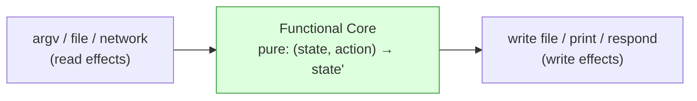
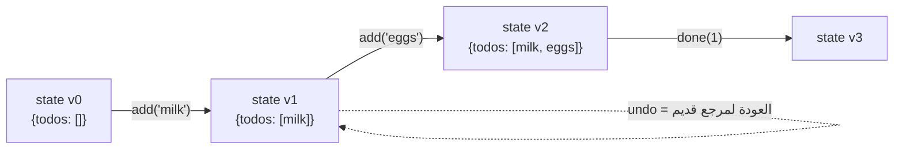

# Module 1.7 — الحالة، الآثار الجانبية، الثبات
## State, Side Effects, Immutability

> **المستوى:** Level 1 | **الموقع:** [8 من 16]
> **السابق:** [M1.6 — Objects & References](module-1.6-objects-references.md) | **التالي:** [M1.8 — Modules](module-1.8-modules.md)

---

## 1. المتطلبات
- [ ] الدوال النقية والآثار الجانبية (تعريف أولي) — [M1.4](module-1.4-functions-scope-closures.md)
- [ ] المراجع والنسخ، spread — [M1.6](module-1.6-objects-references.md)
- [ ] mutating vs non-mutating في المصفوفات — [M1.5](module-1.5-arrays.md)

## 2. أهداف التعلّم
- تعريف **الحالة** (state) ولماذا هي **المصدر الأول لتعقيد البرامج**.
- تصنيف الآثار الجانبية (side effects) والتعرف عليها في الكود.
- تطبيق **الثبات** (immutability): تحديث بإنشاء قيم جديدة، `readonly`, `as const`, `Object.freeze`.
- تنظيم الكود كـ **نواة نقية + قشرة بآثار** (functional core, imperative shell).
- فهم العلاقة: حالة مشتركة قابلة للتغيير + تزامن = bugs يصعب إعادة إنتاجها (تمهيد L2/L5).

---

## 3. شرح للمبتدئ

### ما الحالة؟
**الحالة** (**state**) = كل البيانات التي **يتذكرها** البرنامج وتتغير بمرور الوقت: سلة المشتريات، هل المستخدم مسجّل، عدد المحاولات، محتوى ملف todo. برنامج بلا حالة = آلة حاسبة: نفس المدخل نفس المخرج. معظم البرامج المفيدة **ذات حالة**.

المشكلة: كلما زاد عدد الأماكن التي **تقرأ وتكتب** نفس الحالة، زادت الطرق التي يمكن أن تنكسر بها. سؤال "لماذا قيمة `cart.total` خاطئة؟" يصبح "من بين 14 مكانًا يعدّل `cart`، أيها فعل هذا ومتى؟"

### الآثار الجانبية — اعرفها لتحكمها
**الأثر الجانبي** = أي شيء تفعله الدالة **غير** حساب قيمتها المعادة:

| نوع | أمثلة |
|---|---|
| تعديل حالة خارجية | `total += x`، `arr.push(...)`، `user.name = ...` |
| I/O | طباعة، قراءة/كتابة ملف، طلب شبكة، قاعدة بيانات |
| الزمن والعشوائية | `Date.now()`, `Math.random()` |
| رمي استثناء | `throw` |

الآثار الجانبية **ليست شرًا** — بدونها لا يفعل برنامجك شيئًا مرئيًا. الهدف: **حصرها** في أماكن معروفة، لا نثرها في كل مكان.

### الثبات (Immutability) — "لا تغيّر؛ أنشئ جديدًا"

قيمة **ثابتة** (immutable) لا تتغير بعد إنشائها. التحديث = **قيمة جديدة**. النصوص في JS ثابتة أصلًا:
```typescript
const s = "abc";
s.toUpperCase();     // تعيد "ABC" جديدة؛ s لا تزال "abc"
```
نطبّق نفس الفكرة على الكائنات والمصفوفات **بالاتفاق** (JS لا يفرضها):

```typescript
// ❌ تعديل في المكان
function markDone(todo: Todo) { todo.done = true; return todo; }

// ✅ ثابت: كائن جديد
function markDone(todo: Todo): Todo { return { ...todo, done: true }; }

// ❌                                    ✅
todos.push(newTodo);                     const next = [...todos, newTodo];
todos.splice(i, 1);                      const next = todos.filter(t => t.id !== id);
todos[i].title = "x";                    const next = todos.map(t => t.id === id ? { ...t, title: "x" } : t);
```

ما الفائدة؟
1. **لا مفاجآت عن بعد:** إن لم يُعدَّل شيء، فلا يمكن لمكان آخر أن يفسده.
2. **التاريخ مجانًا:** كل نسخة قديمة لا تزال صالحة → undo، مقارنة قبل/بعد، سجلات تدقيق.
3. **كشف التغيير رخيص:** `prev === next` يكفي لمعرفة "هل تغيّر شيء؟" (أساس React وغيره).
4. **آمن مع التزامن:** لا أحد يعدّل تحت قدميك.

التكلفة: نسخ أكثر (عادة مهمل؛ المحركات محسّنة للكائنات الصغيرة). للمصفوفات الضخمة في حلقات ساخنة قد تختار mutation **محليًا** داخل دالة لا يراها أحد — وهذا مقبول.

### أدوات TypeScript للثبات

```typescript
type Todo = { readonly id: number; readonly title: string; readonly done: boolean };
const t: Todo = { id: 1, title: "x", done: false };
t.done = true;                 // ❌ Cannot assign to 'done' because it is a read-only property

const CONFIG = { port: 3000, hosts: ["a", "b"] } as const;   // كل شيء readonly وحرفي
CONFIG.hosts.push("c");        // ❌

type Settings = Readonly<{ theme: string }>;                  // نوع مساعد
function f(xs: readonly number[]) {}                          // لا تعدّل ما تستقبل
```
تذكير: `readonly` **وقت الترجمة فقط** (الأنواع تُمحى — M1.0). `Object.freeze(o)` يمنع التعديل **وقت التشغيل** (سطحيًا؛ يرمي في strict mode).

### نواة نقية + قشرة بآثار

```
┌───────────────────────── Imperative Shell ─────────────────────────┐
│  read file / argv / network   →   [ Functional Core ]  →  write / print │
│  (الآثار الجانبية هنا فقط)        (دوال نقية: state → state)              │
└────────────────────────────────────────────────────────────────────┘
```

النواة: دوال `(state, action) => newState` نقية، قابلة للاختبار بجدول. القشرة: رقيقة، تحمّل الحالة، تستدعي النواة، تحفظ النتيجة. **Project 1** (CLI todo) سيُبنى هكذا حرفيًا.

### لماذا هذا كله تمهيد لأشياء أكبر
- **L2/L5:** حالة مشتركة قابلة للتغيير + عدة خيوط/طلبات متزامنة = **race conditions** (رأيت واحدة في L0-M0.7). الثبات يزيل نصف المشكلة.
- **L4:** الاختبار سهل عندما تكون النواة نقية.
- **React/Redux وأمثالها:** مبنية حرفيًا على `state → newState`.

---

## 4. النموذج الذهني

```
State  = ما يتذكره البرنامج ويتغير
Effect = ما تفعله الدالة غير إعادة قيمة (كتابة، طباعة، شبكة، وقت، throw)

Mutable:   update = غيّر الصندوق         (كل من يحمل السهم يرى التغيير)
Immutable: update = اصنع صندوقًا جديدًا   (القديم يبقى صالحًا)

Core (pure): (state, input) → newState
Shell (effects): load → core → save
```

## 5. الرسم التوضيحي





## 6. مثال بسيط

```typescript
const counter = { value: 0 };
const inc = (c: { readonly value: number }) => ({ value: c.value + 1 });   // نقية

const c1 = inc(counter);
const c2 = inc(c1);
console.log(counter.value, c1.value, c2.value);   // 0 1 2 — ثلاث لقطات
```

## 7. مثال كود

```typescript
// src/todo-core.ts — نواة نقية لمشروع 1
export type Todo = { readonly id: number; readonly title: string; readonly done: boolean };
export type State = { readonly todos: readonly Todo[]; readonly nextId: number };

export type Action =
  | { type: "add"; title: string }
  | { type: "done"; id: number }
  | { type: "remove"; id: number };

export const initialState: State = { todos: [], nextId: 1 };

export function reduce(state: State, action: Action): State {
  switch (action.type) {
    case "add":
      return {
        todos: [...state.todos, { id: state.nextId, title: action.title, done: false }],
        nextId: state.nextId + 1,
      };
    case "done":
      return { ...state, todos: state.todos.map(t => t.id === action.id ? { ...t, done: true } : t) };
    case "remove":
      return { ...state, todos: state.todos.filter(t => t.id !== action.id) };
  }
}
```

```typescript
// src/todo-shell.ts — القشرة: الآثار الجانبية فقط
import { readFileSync, writeFileSync, existsSync } from "node:fs";
import { reduce, initialState, type State, type Action } from "./todo-core.js";

const FILE = "todos.json";
const load = (): State => existsSync(FILE) ? (JSON.parse(readFileSync(FILE, "utf8")) as State) : initialState;
const save = (s: State) => writeFileSync(FILE, JSON.stringify(s, null, 2));

const [cmd, arg] = process.argv.slice(2);
let action: Action;
if (cmd === "add" && arg) action = { type: "add", title: arg };
else if (cmd === "done" && arg) action = { type: "done", id: Number(arg) };
else if (cmd === "remove" && arg) action = { type: "remove", id: Number(arg) };
else { console.error("usage: todo add <title> | done <id> | remove <id>"); process.exit(2); }

const before = load();
const after = reduce(before, action);
save(after);
for (const t of after.todos) console.log(`${t.done ? "✔" : " "} ${t.id}. ${t.title}`);
```

اختبر النواة بلا ملفات على الإطلاق:
```typescript
const s1 = reduce(initialState, { type: "add", title: "milk" });
const s2 = reduce(s1, { type: "done", id: 1 });
console.log(initialState.todos.length, s1.todos[0]?.done, s2.todos[0]?.done);  // 0 false true
```

(`switch` بلا `default` هنا مقصود: مع `strict`، إن أضفت نوع Action جديدًا ونسيت حالته، TypeScript يشتكي أن الدالة قد لا تعيد قيمة — **exhaustiveness check**، M1.15.)

## 8. مثال من العالم الحقيقي
- Git نفسه: كل commit **لقطة ثابتة**؛ "التعديل" = لقطة جديدة تشير للقديمة. لهذا التاريخ لا يُفسد (M1.13).
- React: `setState(prev => ({...prev, x}))` — الثبات هو ما يجعل الواجهة تعرف ماذا تعيد رسمه.
- المحاسبة: لا أحد "يعدّل" قيدًا؛ يُضاف قيد تصحيحي. دفتر الأستاذ **append-only** — ثبات عمره قرون.

## 9. مثال من الإنتاج
**حادثة "الطلب الذي غيّر طلب غيره":** خدمة تحتفظ بـ `let currentOrder` على مستوى الوحدة (module-level state) "للراحة". طلبان متزامنان (M1.11) تداخلا: الأول وضع طلبه، انتظر DB، الثاني **استبدل** `currentOrder`، عاد الأول وأكمل **بطلب الثاني**. فاتورة عميل وصلت لآخر. **السبب:** حالة مشتركة قابلة للتغيير عبر طلبات. **الإصلاح:** لا حالة على مستوى الوحدة للطلبات؛ مرّر الحالة كمعامل. **الدرس:** "العالمي القابل للتغيير" أخطر تركيبة في البرمجة.

## 10. مفاهيم خاطئة شائعة

| ❌ | ✅ |
|---|---|
| "الثبات = بطء" | الفرق مهمل في 99% من الحالات؛ وعند الحاجة، mutation **محلية** داخل دالة نقية من الخارج مقبولة. |
| "الآثار الجانبية سيئة" | ضرورية؛ المطلوب **حصرها** لا إلغاؤها. |
| "`readonly` يحمي وقت التشغيل" | وقت الترجمة فقط. `Object.freeze` للتشغيل (سطحي). |
| "الحالة العالمية مريحة لمشروع صغير" | المشاريع الصغيرة تكبر؛ والـ bug أصعب في اكتشافه كلما تأخر. |

## 11. أخطاء شائعة
1. `let` على مستوى الوحدة تحمل حالة طلب/مستخدم.
2. دالة "نقية" تستدعي `Date.now()` في داخلها → غير قابلة للاختبار. مرّر الوقت كمعامل.
3. spread سطحي على كائن متداخل والظن أنه ثابت (M1.6).
4. خلط القراءة من الملف والمنطق والطباعة في دالة واحدة.
5. `arr.sort()`/`reverse()` على حالة مشتركة.

## 12. تمرين تصحيح

```typescript
const seen: string[] = [];
function isDuplicate(email: string): boolean {
  if (seen.includes(email)) return true;
  seen.push(email);
  return false;
}
// اختبار 1
console.log(isDuplicate("a@x"), isDuplicate("a@x"));   // false true ✅
// اختبار 2 (في نفس العملية، بعد الأول)
console.log(isDuplicate("a@x"));                        // متوقع false (اختبار جديد)… فعلي true ❌
```
الاختبار الثاني يفشل فقط إذا جرى بعد الأول. لماذا؟ وكيف تعيد التصميم؟

<details><summary>💡 الحل</summary>

`seen` **حالة مشتركة على مستوى الوحدة** تتسرب بين الاستدعاءات/الاختبارات → نتيجة الدالة تعتمد على التاريخ لا على مدخلاتها (غير نقية). bug "يظهر فقط بترتيب معيّن" = بصمة الحالة المشتركة.

إعادة التصميم: اجعل الحالة **صريحة** ومُمرَّرة:
```typescript
function checkDuplicate(seen: ReadonlySet<string>, email: string): { duplicate: boolean; seen: ReadonlySet<string> } {
  if (seen.has(email)) return { duplicate: true, seen };
  return { duplicate: false, seen: new Set([...seen, email]) };
}
```
أو إن أردت كائنًا بحالة داخلية، اصنعه بـ closure/`makeDeduper()` (M1.4) ليحصل كل اختبار على نسخة جديدة. (`Set` = مجموعة بلا تكرار — L3-M2؛ هنا يكفي أن `has` أسرع من `includes`.)
</details>

## 13. تمرين معماري
نظام حجز مقاعد: 100 مقعد، آلاف المستخدمين يضغطون "احجز" في نفس الثانية. الحالة "المقاعد المتبقية" **مشتركة** حتمًا. اسأل: أين تعيش هذه الحالة (ذاكرة العملية؟ قاعدة بيانات؟)؟ ماذا يحدث مع عمليتين (processes) للخادم؟ كيف يمنع الثبات وحده الحجز المزدوج — أم لا يكفي؟ (الجواب الكامل: transactions L3-M14 وأقفال L5-M6. الآن: حدد المشكلة بدقة.)

## 14. الصلة بعصر AI
AI يميل لمتغيرات عالمية و`push` و`sort` في المكان لأن "الأمثلة على الإنترنت" كذلك. **اطلب صراحة:** *"بدون mutation؛ نواة نقية `(state, action) => state` + قشرة I/O منفصلة؛ `readonly` على الأنواع."* ثم **تحقق:** ابحث عن `let` على مستوى الوحدة، وعن `.push(`/`.sort(`/`= ` على معاملات.

## 15–17. Master / Understand / Defer
- 🔴 ما الحالة؛ تصنيف الآثار الجانبية؛ تحديث بإنشاء جديد (spread/map/filter)؛ `readonly`/`as const`؛ core/shell؛ لماذا الحالة العالمية خطرة.
- 🟠 `Object.freeze` وحدوده؛ نمط `reduce(state, action)`؛ exhaustiveness في `switch`؛ تمرير الوقت/العشوائية كمعاملات.
- ⚪ مكتبات immutability (Immer)، persistent data structures، event sourcing (L7).

## 18. الخلاصة
1. **الحالة** هي مصدر التعقيد الأول؛ قلّل من يملكها ومن يعدّلها.
2. الآثار الجانبية ضرورية — **احصرها** في القشرة.
3. **الثبات:** لا تعدّل؛ أنشئ جديدًا. يمنح أمانًا وتاريخًا وكشف تغيير رخيصًا.
4. `readonly` للترجمة، `Object.freeze` للتشغيل (سطحي).
5. نواة نقية `(state, action) → state` + قشرة I/O = هيكل Project 1.
6. حالة مشتركة قابلة للتغيير + تزامن = أخطر تركيبة.

## 19. مراجع رسمية
- MDN — Immutable (glossary): https://developer.mozilla.org/en-US/docs/Glossary/Immutable
- MDN — `Object.freeze`: https://developer.mozilla.org/en-US/docs/Web/JavaScript/Reference/Global_Objects/Object/freeze
- TypeScript — `readonly` and `as const`: https://www.typescriptlang.org/docs/handbook/2/objects.html#readonly-properties
- TypeScript — Narrowing / exhaustiveness: https://www.typescriptlang.org/docs/handbook/2/narrowing.html#exhaustiveness-checking

## المصطلحات
| العربية | English |
|---|---|
| حالة | State |
| أثر جانبي | Side effect |
| ثبات / غير قابل للتغيير | Immutability / Immutable |
| قابل للتغيير | Mutable |
| تعديل | Mutation |
| حالة مشتركة | Shared state |
| حالة عالمية | Global state |
| نواة نقية / قشرة آمرة | Functional core / Imperative shell |
| مخفِّض | Reducer |
| لقطة | Snapshot |
| إلحاق فقط | Append-only |
| فحص الشمولية | Exhaustiveness check |

> **التالي:** [Module 1.8 — Modules: Organizing Code](module-1.8-modules.md)
