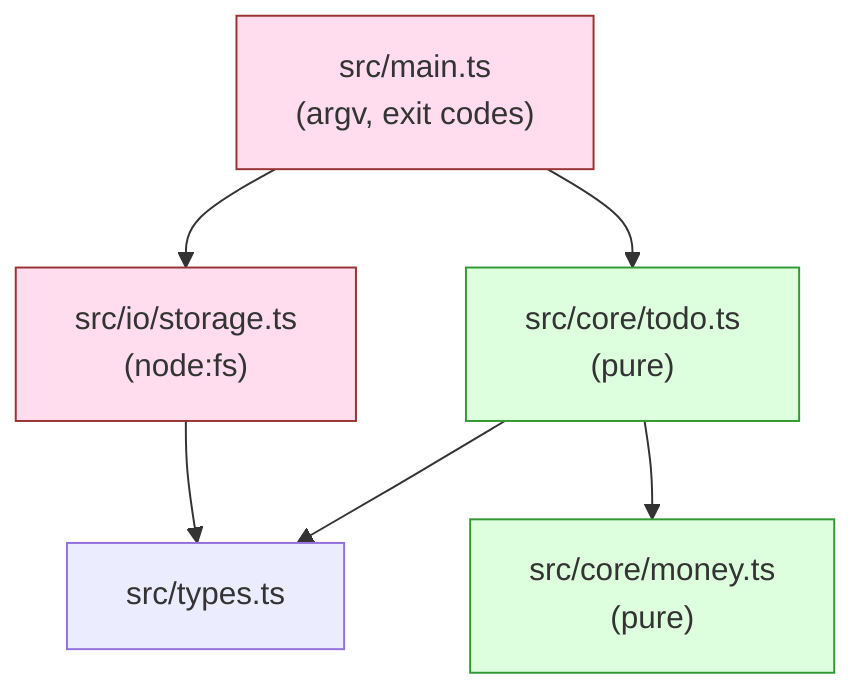
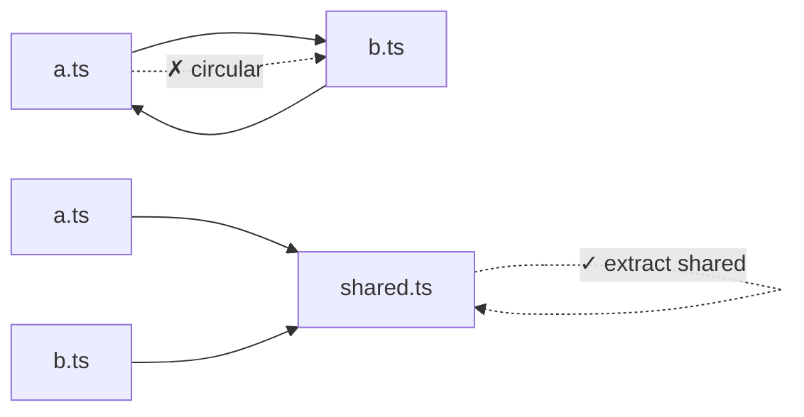

# Module 1.8 — الوحدات: تنظيم الكود
## Modules: import / export, project structure

> **المستوى:** Level 1 | **الموقع:** [9 من 16]
> **السابق:** [M1.7 — State, Side Effects, Immutability](module-1.7-state-side-effects-immutability.md) | **التالي:** [M1.9 — Errors](module-1.9-errors.md)

---

## 1. المتطلبات
> **قبل أن تتعلم هذا، يجب أن تفهم:**
- [ ] إعداد المشروع، ESM، `.js` في الاستيراد — [M1.0](module-1.0-setup.md)
- [ ] الدوال والنطاق — [M1.4](module-1.4-functions-scope-closures.md)
- [ ] نواة/قشرة — [M1.7](module-1.7-state-side-effects-immutability.md)

## 2. أهداف التعلّم
- تقسيم برنامج إلى **وحدات** (modules) بـ `export` / `import`.
- التمييز بين named export و default export، واستيراد الأنواع `import type`.
- فهم أن لكل وحدة **نطاقها الخاص** وأنها تُقيَّم **مرة واحدة** (singleton).
- التعرف على **الاعتماديات** (dependencies) واتجاهها، و**الاعتماد الدائري** وأضراره.
- تنظيم مشروع صغير بطريقة قابلة للنمو (`src/`, فصل core/shell).
- فهم الفرق ESM vs CommonJS بما يكفي لقراءة رسائل الخطأ.

---

## 3. شرح للمبتدئ

### لماذا الوحدات؟
ملف واحد بـ 2000 سطر = لا أحد يعرف ماذا يعتمد على ماذا. **الوحدة** (**module**) = ملف يملك **نطاقه الخاص**، يُظهر للعالم فقط ما يختار (`export`) ويطلب ما يحتاجه (`import`). الباقي **خاص** تلقائيًا.

```typescript
// src/money.ts
export function formatCents(cents: number): string {
  return (cents / 100).toFixed(2) + " DZD";
}
export const ZERO = 0;
function helper() { /* خاص: غير مُصدَّر → لا يُرى خارج الملف */ }
```

```typescript
// src/main.ts
import { formatCents, ZERO } from "./money.js";    // named imports — لاحظ .js (M1.0)
console.log(formatCents(123456));                 // "1234.56 DZD"
```

### أشكال التصدير والاستيراد

```typescript
// named (المفضّل: أسماء صريحة، إعادة التسمية ممكنة، أدوات الـ IDE تحبها)
export function a() {}
export const b = 1;
import { a, b as bee } from "./m.js";
import * as m from "./m.js";          // كل الصادرات تحت اسم واحد: m.a()

// default (واحد لكل ملف؛ الاسم عند الاستيراد حر — مصدر ارتباك)
export default function main() {}
import whatever from "./m.js";

// الأنواع فقط (تُمحى عند الترجمة — صريحة أفضل)
import type { User } from "./types.js";
import { reduce, type State } from "./core.js";

// إعادة تصدير (لبناء "واجهة" مجلد)
export { formatCents } from "./money.js";
```

**قاعدة الكورس:** named exports دائمًا. default فقط عندما تفرضه مكتبة/إطار.

### الوحدة تُقيَّم مرة واحدة

```typescript
// src/config.ts
console.log("loading config");
export const config = { port: Number(process.env.PORT ?? 3000) };
```
مهما استوردتها 10 ملفات، تُطبع `"loading config"` **مرة واحدة**، والجميع يحصل على **نفس الكائن** `config`. هذا مفيد (إعدادات مشتركة، اتصال DB واحد) و**خطر** (حالة مشتركة قابلة للتغيير — M1.7!). إن صدّرت `let` أو كائنًا قابلًا للتعديل، فقد صنعت متغيرًا عالميًا متنكّرًا.

### الاعتماديات واتجاهها

`main.ts` يستورد `shell.ts` الذي يستورد `core.ts` الذي لا يستورد أحدًا. هذا **رسم اعتماديات** (dependency graph) وله اتجاه. القاعدة الذهبية:

> **الأشياء المستقرة/النقية في الأسفل، الأشياء المتغيرة/ذات الآثار في الأعلى. الأسفل لا يعرف الأعلى.**

النواة (`todo-core.ts`) لا تستورد `node:fs` ولا تعرف أن هناك CLI. لذلك يمكن إعادة استخدامها من خادم HTTP لاحقًا (Project 3) دون تعديل.

### الاعتماد الدائري (Circular dependency)
`a.ts` يستورد `b.ts` و`b.ts` يستورد `a.ts`. قد "يعمل" وقد يعطيك `undefined` غامضًا عند الإقلاع حسب ترتيب التقييم. **علامة تصميم خاطئ:** إمّا أن الملفين وحدة واحدة، أو هناك شيء مشترك يجب استخراجه لملف ثالث يستوردانه كلاهما.

### هيكل مشروع صغير يكبر بسلام

```
my-app/
├── package.json            "type": "module", scripts
├── tsconfig.json
├── src/
│   ├── main.ts             نقطة الدخول: تحلّل argv، تستدعي shell
│   ├── core/               نقية: لا fs، لا network، لا console
│   │   ├── todo.ts
│   │   └── money.ts
│   ├── io/                 قشرة: ملفات، شبكة، طباعة
│   │   └── storage.ts
│   └── types.ts            أنواع مشتركة
└── tests/                  (L4 — لكن ابدأ المجلد الآن)
```
ليست قاعدة مقدسة؛ المهم: **حدود واضحة بين النقي وذي الآثار**، وأن اسم الملف يقول ما فيه.

### ESM مقابل CommonJS — ما يكفي لقراءة الأخطاء

| | ESM (نستخدمه) | CommonJS (القديم) |
|---|---|---|
| الصيغة | `import x from "./x.js"` / `export` | `const x = require("./x")` / `module.exports` |
| التفعيل | `"type": "module"` أو `.mts` | الافتراضي في Node بدون type |
| الامتداد في المسار | **مطلوب** (`./x.js`) | اختياري |
| `__dirname` | غير موجود → `import.meta.dirname` (Node 20.11+) | موجود |
| `require` | غير معرّف | معرّف |

أخطاء ستراها: `ERR_REQUIRE_ESM` (مكتبة ESM تُستدعى بـ require)، `Cannot use import statement outside a module` (نسيت `"type": "module"`)، `ERR_MODULE_NOT_FOUND` (نسيت `.js`). الآن تعرف كيف تقرأها.

وحدات Node المدمجة تُستورد بالبادئة `node:`: `import { readFile } from "node:fs/promises";` — البادئة تمنع الالتباس مع حزم npm بنفس الاسم.

---

## 4. النموذج الذهني

```
module = ملف + نطاق خاص + واجهة (exports)
import  = "أحتاج هذه من تلك"   → سهم في رسم الاعتماديات
الوحدة تُقيَّم مرة واحدة → الصادر كائنٌ مشترك (احذر الحالة)

اتجاه الاعتماد:  main → io/shell → core
                 core لا يعرف أحدًا فوقه
دائرة = رائحة تصميم
```

## 5. الرسم التوضيحي





## 6. مثال بسيط

```typescript
// src/greet.ts
export const greet = (name: string) => `Salam, ${name}!`;
export const shout = (s: string) => s.toUpperCase();

// src/main.ts
import { greet, shout } from "./greet.js";
console.log(shout(greet("Sara")));   // SALAM, SARA!
```

## 7. مثال كود

إعادة تنظيم M1.7 إلى وحدات بحدود واضحة:

```typescript
// src/types.ts
export type Todo = { readonly id: number; readonly title: string; readonly done: boolean };
export type State = { readonly todos: readonly Todo[]; readonly nextId: number };
export type Action = { type: "add"; title: string } | { type: "done"; id: number } | { type: "remove"; id: number };
```

```typescript
// src/core/todo.ts — لا يستورد إلا الأنواع
import type { State, Action } from "../types.js";
export const initialState: State = { todos: [], nextId: 1 };
export function reduce(state: State, action: Action): State { /* كما في M1.7 */ return state; }
export const pending = (s: State) => s.todos.filter(t => !t.done);
```

```typescript
// src/io/storage.ts — الآثار الجانبية (ملفات)
import { readFile, writeFile } from "node:fs/promises";
import type { State } from "../types.js";
import { initialState } from "../core/todo.js";

export async function load(path: string): Promise<State> {
  try { return JSON.parse(await readFile(path, "utf8")) as State; }
  catch (e) { if ((e as NodeJS.ErrnoException).code === "ENOENT") return initialState; throw e; }
}
export const save = (path: string, s: State) => writeFile(path, JSON.stringify(s, null, 2));
```

```typescript
// src/main.ts — التركيب فقط
import { reduce } from "./core/todo.js";
import { load, save } from "./io/storage.js";
import type { Action } from "./types.js";

const FILE = process.env.TODO_FILE ?? "todos.json";
const [cmd, arg] = process.argv.slice(2);
const action: Action | undefined =
  cmd === "add" && arg ? { type: "add", title: arg } :
  cmd === "done" && arg ? { type: "done", id: Number(arg) } :
  cmd === "remove" && arg ? { type: "remove", id: Number(arg) } : undefined;

if (!action) { console.error("usage: todo add <title> | done <id> | remove <id>"); process.exit(2); }

const next = reduce(await load(FILE), action);     // top-level await متاح في ESM
await save(FILE, next);
console.log(`${next.todos.length} todos`);
```

(`async/await` و`try/catch` يُشرحان في M1.9 و M1.11 — هنا فقط لاحظ **من يستورد من**.)

## 8. مثال من العالم الحقيقي
`node_modules` = آلاف الوحدات بنفس الآلية. `import express from "express"` يحلّ الاسم من `node_modules/express/package.json`. وكل إطار (Next, Nest…) يفرض هيكل مجلدات — الآن تفهم **لماذا**: اتجاه الاعتماد وحدود المسؤولية.

## 9. مثال من الإنتاج
**حادثة "الاتصال الذي أُنشئ 40 مرة":** مطوّر وضع `createDbConnection()` داخل دالة مُصدَّرة تُستدعى من كل وحدة بدل تصديرها كقيمة على مستوى الوحدة. 40 اتصالًا بقاعدة البيانات في كل عملية → الحد الأقصى للاتصالات امتلأ → انهيار. **الدرس:** "الوحدة تُقيَّم مرة واحدة" ميزة تصميمية لـ **الموارد المشتركة** (اتصال، إعدادات)؛ استخدمها بوعي — واحذرها للحالة القابلة للتغيير.

## 10. مفاهيم خاطئة شائعة

| ❌ | ✅ |
|---|---|
| "الاستيراد ينسخ الوحدة" | يعطيك **مرجعًا** لنفس النسخة الوحيدة. |
| "`.js` في مسار ملف `.ts` خطأ" | صحيح ومطلوب في ESM؛ TS يفهمه. |
| "ملف لكل دالة" | قسّم حسب **المسؤولية**، لا العدد. |
| "default export أنظف" | يفقدك إعادة التسمية الآلية والـ autocomplete؛ named أفضل. |
| "مجلد `utils` لكل شيء" | `utils` يصبح مكبّ نفايات؛ سمِّ بالمجال (`money`, `dates`). |

## 11. أخطاء شائعة
1. نسيان `.js` → `ERR_MODULE_NOT_FOUND`.
2. تصدير `let` أو كائن قابل للتعديل ثم الاستغراب من "تغيّر من مكان آخر".
3. النواة تستورد `node:fs` "مؤقتًا".
4. اعتماد دائري بين `a` و`b`.
5. `import x from "./x"` بدون امتداد يعمل في tsx ولا يعمل بعد `tsc` → يعمل في dev وينهار في prod.

## 12. تمرين تصحيح

```typescript
// src/counter.ts
export let count = 0;
export function increment() { count++; }

// src/main.ts   ❌ (تمرين: هل يُترجَم؟)
import { count, increment } from "./counter.js";
increment(); increment();
console.log(count);          // يطبع 2؟ أم 0؟
count = 5;                   // خطأ ترجمة؟
```

<details><summary>💡 الحل</summary>

يطبع **2**: استيراد ESM هو **رابط حي** (live binding) للمتغير نفسه، لا نسخة. و`count = 5` **خطأ**: `Cannot assign to 'count' because it is an import` — يمكنك القراءة فقط؛ التعديل يجب أن يمرّ عبر دالة الوحدة.

لكن الدرس الأهم: `export let` = حالة عالمية قابلة للتغيير (M1.7). التصميم الأفضل: `makeCounter()` يعيد نسخة مستقلة لكل من يحتاجها، أو نواة نقية `(n) => n + 1`.
</details>

## 13. تمرين معماري
مشروعك سيصبح: CLI (Project 1) + خادم HTTP (Project 3) يشتركان في نفس منطق todo. ارسم رسم الاعتماديات المستهدف: أي ملفات مشتركة؟ أي ملفات خاصة بكل واجهة؟ هل يجوز لـ `core` أن يعرف "HTTP status 404"؟ أين تعيش رسائل الخطأ الموجّهة للمستخدم؟ اكتب قواعد "من يستورد من" في 5 أسطر.

## 14. الصلة بعصر AI
AI يضع كل شيء في ملف واحد أو ينشئ `utils.ts` عملاقًا، وينسى `.js`، ويخلط core بـ I/O. **أعطه الهيكل** في البرومبت (`core/` نقي، `io/` للآثار، named exports، `.js`). ثم **تحقق:** `grep -r "node:fs" src/core` يجب أن يعيد لا شيء.

## 15. ما يجب إتقانه (Must Master) 🔴
- 🔴 `export`/`import` named؛ `import type`؛ `.js`؛ النطاق الخاص للوحدة؛ تُقيَّم مرة واحدة؛ اتجاه الاعتماد core ← io ← main؛ قراءة أخطاء ESM.

## 16. ما يجب فهمه (Should Understand) 🟠
- 🟠 live bindings؛ الاعتماد الدائري ولماذا؛ `node:` prefix؛ `import.meta.dirname`؛ هيكل المجلدات.

## 17. ما يمكن تأجيله (Can Defer) ⚪
- ⚪ dynamic `import()`؛ barrel files وأضرارها على الأداء؛ package exports map؛ monorepos.

## 18. الخلاصة
1. الوحدة = ملف بنطاق خاص؛ تُظهر ما تريد بـ `export`.
2. named exports + `import type` + `.js` دائمًا.
3. الوحدة **تُقيَّم مرة واحدة** → ما تصدّره مشترك؛ لا تصدّر حالة قابلة للتغيير.
4. الاعتماد **له اتجاه**: النقي في الأسفل لا يعرف الأعلى.
5. الدائرة رائحة تصميم؛ استخرج المشترك.
6. الهيكل يخدم الحدود: `core/` نقي، `io/` للآثار، `main` للتركيب.

## 19. مراجع رسمية
- MDN — JavaScript modules: https://developer.mozilla.org/en-US/docs/Web/JavaScript/Guide/Modules
- Node.js — ECMAScript modules: https://nodejs.org/api/esm.html
- Node.js — `node:` imports: https://nodejs.org/api/esm.html#node-imports
- TypeScript — Modules reference: https://www.typescriptlang.org/docs/handbook/modules/reference.html

## المصطلحات
| العربية | English |
|---|---|
| وحدة | Module |
| تصدير / استيراد | Export / Import |
| تصدير مسمّى / افتراضي | Named / Default export |
| اعتمادية | Dependency |
| رسم الاعتماديات | Dependency graph |
| اعتماد دائري | Circular dependency |
| رابط حي | Live binding |
| نقطة الدخول | Entry point |
| وحدة مدمجة | Built-in module |
| وحدات ES / CommonJS | ESM / CommonJS |
| نسخة وحيدة | Singleton |

> **التالي:** [Module 1.9 — Errors: Exceptions, Result, Fail Fast](module-1.9-errors.md)
