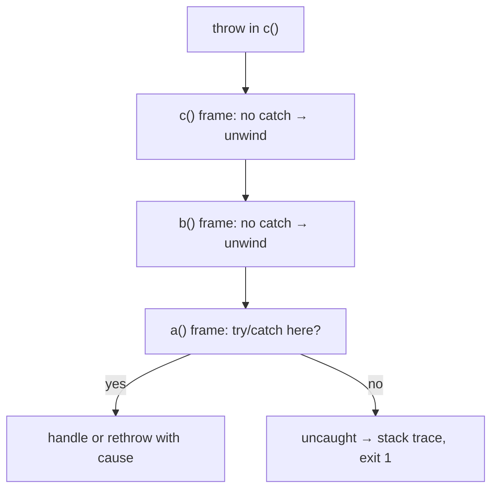
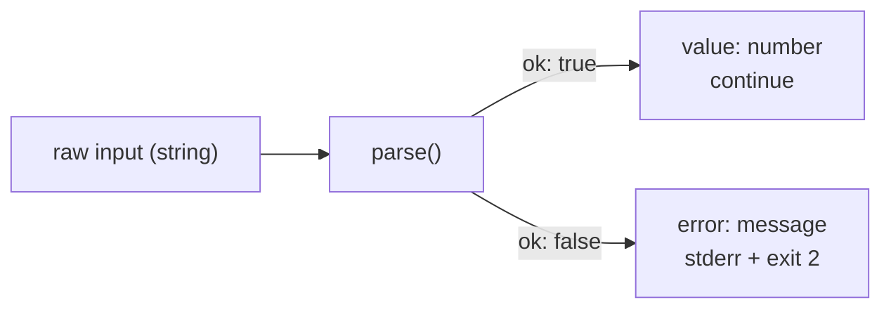

# Module 1.9 — الأخطاء: الاستثناءات، النتائج، الفشل المبكر
## Errors: Exceptions, Result types, Fail Fast

> **المستوى:** Level 1 | **الموقع:** [10 من 16]
> **السابق:** [M1.8 — Modules](module-1.8-modules.md) | **التالي:** [M1.10 — Input/Output](module-1.10-io.md)

---

## 1. المتطلبات
- [ ] مكدس الاستدعاء وقراءة stack trace — [M1.4](module-1.4-functions-scope-closures.md)
- [ ] رموز الخروج، stdout vs stderr — [L0-M0.3](../level-0-absolute-foundations/module-03-running-a-program.md)
- [ ] فكرة fail-fast مع الإعدادات — [L0-M0.4](../level-0-absolute-foundations/module-04-files-terminal-shell.md)

## 2. أهداف التعلّم
- التمييز بين **الخطأ المتوقع** (expected: ملف غير موجود، إدخال سيئ) و**الخلل البرمجي** (bug: null غير متوقع).
- استخدام `throw` / `try` / `catch` / `finally` بشكل صحيح، وقراءة الاستثناء كـ `unknown`.
- تصميم أنواع أخطاء مخصّصة (`class AppError extends Error`) وسلسلة الأسباب (`cause`).
- فهم **نوع النتيجة** (Result type) كبديل صريح للاستثناءات، ومتى تفضّله.
- تطبيق **الفشل المبكر** (fail fast) وعدم **ابتلاع الأخطاء**.
- ربط الأخطاء بـ exit codes و stderr في برامج CLI.

---

## 3. شرح للمبتدئ

### الفشل جزء طبيعي من البرنامج
الملف غير موجود. المستخدم كتب "abc" بدل رقم. الشبكة انقطعت (L0-M0.6). **البرنامج المحترف ليس الذي لا يفشل، بل الذي يفشل بوضوح وفي المكان الصحيح.**

### نوعان مختلفان من "الخطأ"

| | **خطأ متوقع** (expected failure) | **خلل** (bug / programmer error) |
|---|---|---|
| مثال | ملف مفقود، JSON غير صالح، 404، مهلة | `undefined is not a function`، off-by-one، نسيان `await` |
| من يسببه | العالم الخارجي / المستخدم | نحن |
| ما نفعله | نتعامل معه: رسالة مفيدة، إعادة محاولة، قيمة افتراضية | **لا** نتعامل معه؛ نجعله ينفجر بصوت عالٍ ونصلح الكود |

الخلط بينهما يُنتج كارثتين: ابتلاع الـ bugs بـ `catch {}` فارغ (فتختفي حتى تنفجر في مكان أبعد)، أو إسقاط البرنامج بسبب ملف مفقود كان يمكن إنشاؤه.

### الآلية 1: الاستثناءات (Exceptions)

```typescript
function parsePort(raw: string): number {
  const n = Number(raw);
  if (!Number.isInteger(n) || n < 1 || n > 65535) {
    throw new RangeError(`invalid port: "${raw}"`);   // throw: أوقف وارمِ
  }
  return n;
}

try {
  const port = parsePort(process.argv[2] ?? "");
  console.log("port", port);
} catch (err) {                        // err نوعه unknown — لا تفترض أنه Error
  if (err instanceof RangeError) {
    console.error(err.message);        // رسالة للمستخدم → stderr
    process.exit(2);                   // exit code ≠ 0
  }
  throw err;                           // ليس لنا؟ أعد رميه — لا تبتلعه
} finally {
  // يُنفَّذ دائمًا (نجاح أو فشل): إغلاق ملف، تحرير مورد
}
```

كيف يعمل `throw`؟ يُوقف الدالة **فورًا**، ويصعد عبر **مكدس الاستدعاء** (M1.4) إطارًا إطارًا حتى يجد `catch`. إن لم يجد: **uncaught exception** → Node يطبع stack trace ويخرج برمز 1. هذا ليس سيئًا دائمًا — للـ bugs هذا بالضبط ما نريد (fail fast).

**ارمِ كائنات `Error` دائمًا** (`throw new Error("...")` لا `throw "..."`) لتحصل على stack trace و`message`.

### أخطاء مخصّصة و`cause`

```typescript
export class AppError extends Error {
  constructor(message: string, public readonly code: string, options?: { cause?: unknown }) {
    super(message, options);
    this.name = "AppError";
  }
}
export class NotFoundError extends AppError {
  constructor(what: string) { super(`${what} not found`, "NOT_FOUND"); this.name = "NotFoundError"; }
}

// تغليف خطأ منخفض المستوى بخطأ ذي معنى مع الاحتفاظ بالأصل
try { JSON.parse(text); }
catch (e) { throw new AppError("config file is not valid JSON", "BAD_CONFIG", { cause: e }); }
```
(`class` تُشرح في L4؛ هنا يكفي: "نوع خطأ له اسم وكود". `cause` يحفظ السلسلة: *ماذا حدث → بسبب ماذا*.)

لماذا الأكواد (`"NOT_FOUND"`)؟ لأن الرسائل للبشر تتغير؛ الكود للبرنامج ليقرر (`if (e.code === "NOT_FOUND") return 404`).

### الآلية 2: نوع النتيجة (Result) — الفشل كقيمة

الاستثناء **خفي في التوقيع**: `parsePort(raw: string): number` لا يخبرك أنه قد يرمي. البديل: **اجعل الفشل جزءًا من القيمة المعادة**:

```typescript
type Result<T, E = string> = { ok: true; value: T } | { ok: false; error: E };

function parsePortR(raw: string): Result<number> {
  const n = Number(raw);
  if (!Number.isInteger(n) || n < 1 || n > 65535) return { ok: false, error: `invalid port "${raw}"` };
  return { ok: true, value: n };
}

const r = parsePortR("80a");
if (r.ok) console.log(r.value);        // TS يضيّق: هنا r.value موجود
else console.error(r.error);           // وهنا r.error
```

| | الاستثناءات | Result |
|---|---|---|
| ظاهر في التوقيع؟ | ❌ | ✅ (المترجم يجبرك على الفحص) |
| مناسب لـ | bugs، فشل نادر، عبور طبقات كثيرة | فشل **متوقع ومتكرر** في التحقق/التحليل |
| التكلفة | سهل النسيان | كتابة أكثر قليلًا |

**قاعدة عملية في هذا الكورس:** Result للتحقق من المدخلات والتحليل (parsing) على الحدود؛ استثناءات لما لا تستطيع/لا تريد معالجته هنا.

### الفشل المبكر (Fail Fast) وعدم الابتلاع

```typescript
// ❌ ابتلاع: الخطأ اختفى، والبرنامج يكمل بحالة فاسدة
try { config = loadConfig(); } catch {}

// ❌ "معالجة" صورية: طباعة ثم متابعة كأن شيئًا لم يكن
catch (e) { console.log(e); }

// ✅ إمّا تعالجه فعلًا (قيمة افتراضية مبرّرة / إعادة محاولة / رسالة وخروج)
// ✅ أو تتركه يصعد (لا تكتب catch أصلًا) / تعيد رميه مغلّفًا بـ cause
```
**اكتشاف الخطأ في السطر 10 أرخص بألف مرة من اكتشاف آثاره في السطر 10,000 بعد ساعة.** التحقق على الحدود (M1.1, M1.6) هو تطبيق لهذا المبدأ.

### في CLI: الاتفاق

- نجاح → stdout، رمز 0.
- فشل متوقع → رسالة واضحة على **stderr**، رمز 1–2 (الاتفاق الشائع: 2 لخطأ استخدام/وسائط).
- bug → اتركه ينفجر مع stack trace (يُخرج Node رمز 1).

---

## 4. النموذج الذهني

```
expected failure  → عالجه (رسالة/افتراضي/إعادة محاولة) أو أعده كـ Result
bug               → لا تمسكه؛ دعه ينفجر مبكرًا؛ أصلح الكود

throw يصعد المكدس حتى أول catch        (غير مرئي في التوقيع)
Result = { ok: true, value } | { ok: false, error }   (مرئي، إجباري الفحص)

catch (e: unknown) → افحص instanceof → عالج أو أعد الرمي مع cause
لا catch فارغ. لا console.log ثم متابعة.
```

## 5. الرسم التوضيحي





## 6. مثال بسيط

```typescript
function safeDivide(a: number, b: number): Result<number> {
  if (b === 0) return { ok: false, error: "division by zero" };
  return { ok: true, value: a / b };
}
for (const [a, b] of [[10, 2], [1, 0]] as const) {
  const r = safeDivide(a, b);
  console.log(r.ok ? `${a}/${b} = ${r.value}` : `${a}/${b} failed: ${r.error}`);
}
```

## 7. مثال كود

```typescript
// src/load-config.ts — طبقات: Result على الحدود، استثناءات مغلّفة في الداخل، exit code في main
import { readFileSync } from "node:fs";

type Result<T, E = string> = { ok: true; value: T } | { ok: false; error: E };
type Config = { port: number; dbUrl: string };

class ConfigError extends Error {
  constructor(msg: string, options?: { cause?: unknown }) { super(msg, options); this.name = "ConfigError"; }
}

function readText(path: string): string {
  try {
    return readFileSync(path, "utf8");
  } catch (e) {
    const code = (e as NodeJS.ErrnoException).code;
    if (code === "ENOENT") throw new ConfigError(`config file not found: ${path}`, { cause: e });
    throw e;                       // أي شيء آخر (أذونات…) ليس شأننا هنا
  }
}

function parseConfig(text: string): Result<Config> {
  let raw: unknown;
  try { raw = JSON.parse(text); } catch { return { ok: false, error: "config is not valid JSON" }; }

  if (typeof raw !== "object" || raw === null) return { ok: false, error: "config must be an object" };
  const o = raw as Record<string, unknown>;
  if (typeof o.port !== "number" || !Number.isInteger(o.port)) return { ok: false, error: "port must be an integer" };
  if (typeof o.dbUrl !== "string" || o.dbUrl === "") return { ok: false, error: "dbUrl must be a non-empty string" };
  return { ok: true, value: { port: o.port, dbUrl: o.dbUrl } };
}

function main(): number {
  const path = process.argv[2];
  if (!path) { console.error("usage: load-config <path>"); return 2; }

  let text: string;
  try { text = readText(path); }
  catch (e) {
    if (e instanceof ConfigError) { console.error(e.message); return 1; }
    throw e;                       // bug أو خطأ نظام غير متوقع → ينفجر مع stack trace
  }

  const cfg = parseConfig(text);
  if (!cfg.ok) { console.error(`invalid config: ${cfg.error}`); return 1; }

  console.log(`listening on ${cfg.value.port}, db=${cfg.value.dbUrl}`);
  return 0;
}

process.exit(main());
```

```bash
echo '{"port": 3000, "dbUrl": "postgres://x"}' > ok.json
echo '{"port": "3000"}' > bad.json
npx tsx src/load-config.ts ok.json;  echo "exit=$?"    # listening... exit=0
npx tsx src/load-config.ts bad.json; echo "exit=$?"    # invalid config: port must be an integer  exit=1
npx tsx src/load-config.ts nope.json; echo "exit=$?"   # config file not found  exit=1
npx tsx src/load-config.ts;          echo "exit=$?"    # usage  exit=2
```

## 8. مثال من العالم الحقيقي
- متصفحك: صفحة 404 (متوقع) vs "Aw, Snap!" (bug/crash).
- Git: `fatal: not a git repository` رسالة واضحة + exit 128، لا stack trace.
- كل API محترم يعيد `{ error: { code: "NOT_FOUND", message } }` — Result عبر الشبكة.

## 9. مثال من الإنتاج
**حادثة "البيانات الصامتة":** مهمة استيراد تقرأ 1M صف؛ كل صف داخل `try { ... } catch (e) { /* skip bad rows */ }`. تغيّر شكل الملف المصدر → **كل** الصفوف أصبحت "bad" → المهمة "نجحت" (exit 0) باستيراد 0 صف. أسبوعان بلا بيانات قبل أن يلاحظ أحد. **الدرس:** الابتلاع بلا عدّ ولا حدّ = كارثة صامتة. عالج: عدّ الصفوف الفاشلة، سجّل أول N سببًا، وافشل إن تجاوزت النسبة حدًا.

## 10. مفاهيم خاطئة شائعة

| ❌ | ✅ |
|---|---|
| "try/catch حول كل شيء = كود آمن" | غالبًا = أخطاء مخفية. امسك فقط ما تعرف كيف تعالجه. |
| "`catch (e)` يضمن أن `e` هو Error" | أي قيمة يمكن رميها؛ `e: unknown`؛ افحص `instanceof`. |
| "الاستثناءات للتحكم بالتدفق العادي" | لا؛ هي للاستثنائي. التحقق المتكرر → Result/شروط. |
| "الطباعة = معالجة" | الطباعة ثم المتابعة تخفي الخطأ كأنه عولج. |

## 11. أخطاء شائعة
1. `catch {}` فارغ.
2. `throw "string"` → لا stack trace.
3. التقاط خطأ عام (`catch (e)`) ثم افتراض نوعه.
4. فقدان الأصل عند إعادة الرمي (بدون `cause`).
5. استثناء داخل `async` بدون `await`/`.catch` → unhandled rejection (M1.11).
6. `process.exit()` من أعماق الكود بدل إعادة الحالة إلى `main`.

## 12. تمرين تصحيح

```typescript
function getUserAge(json: string): number {
  try {
    const u = JSON.parse(json);
    return u.profile.age;
  } catch (e) {
    console.log("error", e);
    return 0;
  }
}
console.log(getUserAge('{"profile":{"age":30}}'));   // 30
console.log(getUserAge('{"profile":null}'));          // 0  ← هل هذا صحيح؟
console.log(getUserAge('not json'));                  // 0  ← وهذا؟
```
ما مشكلة إعادة `0`؟ وما الذي تخفيه `catch` هنا؟

<details><summary>💡 الحل</summary>

1. `0` **قيمة صالحة لعمر**؛ المستدعي لا يستطيع تمييز "عمر صفر" من "فشل". خطأ متوقع (JSON سيئ) **ليس** قيمة بيانات.
2. الـ `catch` يبتلع **نوعين مختلفين**: JSON غير صالح (متوقع) و`Cannot read properties of null` (بيانات بشكل مختلف — ربما bug في المصدر). كلاهما يُطبع بـ `console.log` (stdout!) ويختفي.
3. `u` نوعه `any` → لا حماية.

إعادة التصميم: `Result<number>` مع رسالة محددة لكل حالة، أو `throw` خطأ مخصّص ليقرر المستدعي:
```typescript
function getUserAge(json: string): Result<number> {
  let raw: unknown;
  try { raw = JSON.parse(json); } catch { return { ok: false, error: "invalid JSON" }; }
  const age = (raw as any)?.profile?.age;     // مؤقتًا؛ M1.15 يعطيك التحقق الكامل
  return typeof age === "number" ? { ok: true, value: age } : { ok: false, error: "missing profile.age" };
}
```
</details>

## 13. تمرين معماري
خدمة دفع تستدعي بنكًا خارجيًا. صنّف كل حالة: البنك رفض البطاقة؛ مهلة الشبكة؛ البنك أعاد JSON بشكل غير متوقع؛ bug في حساب المبلغ عندنا. لكل واحدة: متوقع أم bug؟ تُعاد للمستخدم أم تُسجَّل فقط؟ تُعاد المحاولة؟ (تذكّر idempotency من L0-M0.6.) ما شكل "واجهة الأخطاء" بين طبقة البنك وطبقة الأعمال — استثناءات أم Result؟ برّر.

## 14. الصلة بعصر AI
AI يحب `try { ... } catch (e) { console.log(e) }` حول كل شيء، و`return null` عند الفشل. **تحقق:** هل كل `catch` إمّا يعالج فعلًا أو يعيد الرمي؟ هل تُفرَّق الأخطاء المتوقعة عن الـ bugs؟ هل للفشل كود يمكن للبرنامج استخدامه؟ اطلب: *"لا catch صامت؛ Result للتحقق؛ أخطاء مخصّصة مع code وcause."*

## 15–17. Master / Understand / Defer
- 🔴 متوقع vs bug؛ `throw/try/catch/finally`؛ `e: unknown` + `instanceof`؛ ارمِ `Error` فقط؛ لا ابتلاع؛ Result الأساسي؛ stderr + exit codes.
- 🟠 أخطاء مخصّصة بـ `code` و`cause`؛ متى Result ومتى استثناء؛ `main(): number` ثم `process.exit`.
- ⚪ `Error.captureStackTrace`؛ مكتبات Result (neverthrow)؛ error boundaries في الواجهات؛ unhandled rejection handlers (M1.11).

## 18. الخلاصة
1. **متوقع** → عالجه بوضوح. **bug** → دعه ينفجر مبكرًا وأصلحه.
2. `throw` يصعد المكدس؛ `catch (e: unknown)` ثم `instanceof`.
3. ارمِ `Error` (أو نوعًا منه) مع `code` و`cause`.
4. **Result** يجعل الفشل مرئيًا في التوقيع — للتحقق والتحليل على الحدود.
5. **لا catch فارغ، لا طباعة-ثم-متابعة.**
6. CLI: stderr للأخطاء، exit code ≠ 0، 2 لخطأ الاستخدام.

## 19. مراجع رسمية
- MDN — Control flow and error handling: https://developer.mozilla.org/en-US/docs/Web/JavaScript/Guide/Control_flow_and_error_handling
- MDN — `Error` (incl. `cause`): https://developer.mozilla.org/en-US/docs/Web/JavaScript/Reference/Global_Objects/Error
- Node.js — Errors: https://nodejs.org/api/errors.html
- TypeScript — `useUnknownInCatchVariables`: https://www.typescriptlang.org/tsconfig/#useUnknownInCatchVariables

## المصطلحات
| العربية | English |
|---|---|
| استثناء | Exception |
| رمي / التقاط | Throw / Catch |
| خطأ متوقع | Expected failure |
| خلل برمجي | Bug / Programmer error |
| استثناء غير ملتقط | Uncaught exception |
| فكّ المكدس | Stack unwinding |
| سبب (سلسلة الأخطاء) | Cause (error chaining) |
| نوع النتيجة | Result type |
| الفشل المبكر | Fail fast |
| ابتلاع الخطأ | Swallowing errors |
| رمز الخروج | Exit code |

> **التالي:** [Module 1.10 — Input/Output: Files, argv, stdin, JSON/CSV](module-1.10-io.md)
