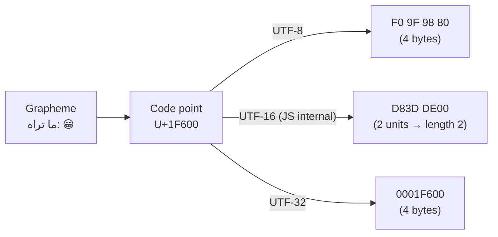
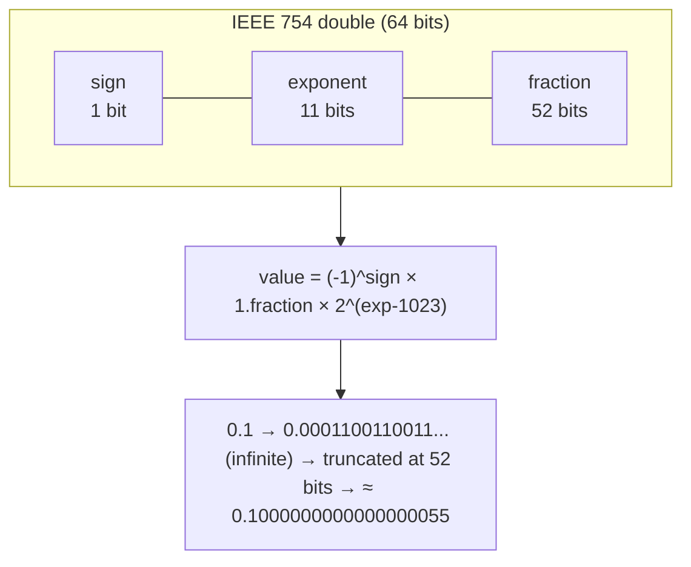
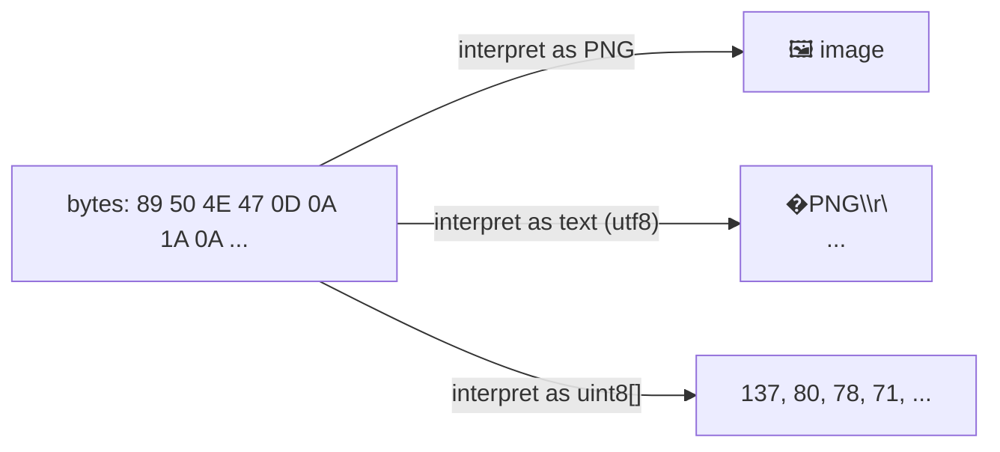

# Module 2.1 — البتات والبايتات وتمثيل البيانات
## Bits, Bytes, Binary, Hex, Integers, Floats, Text (ASCII/UTF-8), Buffer

> **المستوى:** Level 2 | **الموقع:** [1 من 13]
> **السابق:** [Checkpoint 1](../level-1-programming/checkpoint-1.md) | **التالي:** [M2.2 — CPU, Cache, RAM](module-2.2-cpu-cache-ram.md)

---

## 1. المتطلبات
- [ ] الحاسوب = CPU + RAM + Storage، وأن كل شيء "كهرباء" — [L0-M0.1](../level-0-absolute-foundations/module-01-what-is-a-computer.md)
- [ ] `0.1 + 0.2 !== 0.3` والمال بالسنتات (رأيت **الأثر**؛ هنا **السبب**) — [L1-M1.1](../level-1-programming/module-1.1-values-variables-types.md)
- [ ] `Buffer` ظهر عند `readFile` بلا `"utf8"`، وBOM — [L1-M1.10](../level-1-programming/module-1.10-io.md)

## 2. أهداف التعلّم
- شرح البت والبايت ولماذا الحاسوب ثنائي، والتحويل بين ثنائي/عشري/ست عشري يدويًا لأعداد صغيرة.
- تمثيل الأعداد الصحيحة (بما فيها السالبة بـ two's complement) وفهم **الفيض** (overflow) و`Number.MAX_SAFE_INTEGER` و`BigInt`.
- شرح IEEE 754 بما يكفي لتفسير `0.1 + 0.2`، `NaN`، `Infinity`، ولماذا السنتات.
- التفريق بين **الحرف** (character)، **نقطة الترميز** (code point)، **البايتات** (encoding) — ASCII → Unicode → UTF-8.
- استخدام `Buffer`/`TextEncoder` في Node لرؤية البايتات، وتشخيص أخطاء الترميز (mojibake، BOM، `length` خادع).
- فهم أن الصورة/الصوت/الملف التنفيذي = بايتات + **اتفاق تفسير** (format).

---

## 3. شرح للمبتدئ

### لماذا ثنائي؟
الدائرة الكهربائية تميّز بسهولة بين حالتين موثوقتين: جهد عالٍ/منخفض، مفتوح/مغلق. حالتان = **بت** (bit = binary digit): `0` أو `1`. كل شيء في الحاسوب — أرقامك، نصوصك، هذه الصفحة — **ترتيبات من البتات مع اتفاق على معناها**. لا يوجد "رقم" أو "حرف" داخل الذاكرة؛ يوجد بتات، و**البرنامج يقرر** كيف يفسّرها.

### البايت والعدّ
- **بايت** (byte) = 8 بتات = 256 قيمة ممكنة (0..255). وحدة العنونة الأساسية في الذاكرة.
- KB/MB/GB: اصطلاحًا 1000× (أقراص، شبكات) أو 1024× (`KiB`, `MiB` — الذاكرة). الخلط يفسّر "اشتريت 1TB ووجدت 931GB".

**العد الثنائي** مثل العشري لكن بأساس 2: كل خانة تساوي ضعف سابقتها.
```
  128  64  32  16   8   4   2   1
    0   1   0   1   1   0   1   0   = 64+16+8+2 = 90
```
**الست عشري** (hex، أساس 16، أرقام `0-9 A-F`) اختصار مريح: كل رقم hex = 4 بتات بالضبط، فالبايت = رقمان hex. `0x5A` = `0101 1010` = 90. لهذا تراه في الألوان `#FF8800`، عناوين الذاكرة، hashes في Git، و`xxd`.

```typescript
(90).toString(2)      // "1011010"
(90).toString(16)     // "5a"
parseInt("5a", 16)    // 90
0b1011010 === 0x5a    // true — JS يفهم البادئتين
```

### الأعداد الصحيحة: الحجم محدود

في لغة مثل C، `int` = 32 بت = 4,294,967,296 قيمة. وقّعتها (signed) بـ **two's complement**: أعلى بت = إشارة، والمدى −2³¹..2³¹−1. أضف 1 إلى الحد الأقصى → **يلتف** (wraps) إلى الحد الأدنى. هذا **الفيض** (integer overflow): سبب حوادث شهيرة (صاروخ Ariane 5، عدّاد مشاهدات YouTube الذي "انكسر" عند 2³¹).

في JavaScript كل `number` هو **عدد عشري 64 بت** (IEEE 754 double) — حتى "الأعداد الصحيحة". النتيجة:
- الأعداد الصحيحة دقيقة فقط حتى `Number.MAX_SAFE_INTEGER` = 2⁵³−1 = 9,007,199,254,740,991. بعدها تفقد الدقة: `2**53 + 1 === 2**53` → `true`!
- معرّفات (IDs) من قواعد البيانات بـ 64 بت (مثل Twitter snowflake) **تنكسر** في JS إن عوملت كـ `number`. استخدم `string` أو `BigInt`.
- `BigInt` (`123n`) صحيح بلا حدود؛ لا يُخلط مع `number` في العمليات، ولا يدعمه `JSON.stringify`.

**العمليات البتّية** (`&`, `|`, `^`, `~`, `<<`, `>>`) تعمل على 32 بت فقط في JS. تظهر في الأعلام (flags)، الأذونات (`chmod 755` = `rwxr-xr-x` = `111 101 101`)، الأقنعة الشبكية (M2.8).

### الأعداد العشرية: IEEE 754 — لماذا `0.1 + 0.2 !== 0.3`

العدد العشري يُخزَّن كـ **إشارة × (1.كسر) × 2^أس** — "تدوين علمي ثنائي" في 64 بت: 1 بت إشارة، 11 بت أس، 52 بت كسر.

المشكلة: `0.1` في الثنائي = `0.0001100110011…` **لا نهائي** (مثل ⅓ = 0.333… في العشري). يُقطع عند 52 بت → تُخزَّن قيمة **قريبة** من 0.1 لا 0.1 نفسها. اجمع تقريبين تحصل على تقريب ثالث لا يطابق تقريب 0.3. ليست bug في JavaScript — نفس الشيء في Python وJava وC. **لذلك المال بالسنتات الصحيحة** (L1-M1.1)، ولذلك لا تقارن عشريين بـ `===` بل بـ `Math.abs(a - b) < EPSILON`.

قيم خاصة: `Infinity` (`1/0`)، `-Infinity`، `NaN` ("ليس عددًا": `0/0`, `Number("x")`؛ `NaN !== NaN` — استخدم `Number.isNaN`)، و`-0` (نعم موجود).

### النصوص: الحرف ≠ البايت

ثلاث طبقات يجب فصلها في رأسك:
1. **الحرف/الحرف المرئي** (grapheme): ما تراه — `أ`, `é`, `😀`, `👨‍👩‍👧`.
2. **نقطة الترميز** (code point): رقم عالمي لكل رمز في **Unicode** — `A` = U+0041، `أ` = U+0623، `😀` = U+1F600. Unicode **جدول أرقام** (≈150k رمز)، لا بايتات بعد.
3. **الترميز** (encoding): كيف تُكتب نقطة الترميز كبايتات. **UTF-8** هو المعيار: 1 بايت لـ ASCII (`A` = `41`)، 2 للعربية (`أ` = `D8 A3`)، 3 لمعظم الآسيوية، 4 للإيموجي (`😀` = `F0 9F 98 80`). متوافق مع ASCII القديم (7 بت، 128 رمزًا)؛ لهذا انتصر.

```typescript
const s = "أهلا 😀";
s.length                                  // 7 — وحدات UTF-16 (JS تخزّن النصوص داخليًا بـ UTF-16؛ الإيموجي = وحدتان)
[...s].length                             // 6 — نقاط ترميز
Buffer.byteLength(s, "utf8")              // 13 — بايتات على القرص/الشبكة
Buffer.from(s, "utf8")                    // <Buffer d8 a3 d9 87 d9 84 d8 a7 20 f0 9f 98 80>
"😀".length                               // 2  ← أشهر مفاجأة
"😀".codePointAt(0)?.toString(16)         // "1f600"
```
الدرس: **"طول النص" له ثلاث إجابات** حسب الطبقة. حقل "الاسم ≤ 50" في DB بـ **بايتات**؟ أم أحرفًا؟ `s.slice(0, 1)` قد يقطع الإيموجي إلى نصفين (surrogate) وينتج `�`.

### أخطاء الترميز التي ستراها
| العرض | السبب |
|---|---|
| `أهلا` بدل `أهلا` (**mojibake**) | بايتات UTF-8 فُسّرت كـ Latin-1/Windows-1252 |
| `����` | بايتات لا تصلح في الترميز المفترض |
| `` في بداية الملف | BOM (`EF BB BF`) فُسّر كأحرف (L1-M1.10) |
| `length` خاطئ، قطع نص يفسد الإيموجي | الخلط بين الطبقات الثلاث |
| نص عربي "مكسور" في قاعدة بيانات | عمود بترميز `latin1` بدل `utf8mb4` |

القاعدة: **كل تحويل نص ↔ بايتات يحتاج ترميزًا صريحًا** (`"utf8"`)، وكل حد (ملف، شبكة، DB) يجب أن يتفق على UTF-8.

### كل شيء بايتات + اتفاق
ملف PNG = بايتات تبدأ بـ `89 50 4E 47` (توقيع) ثم كتل بتنسيق معروف. JPEG يبدأ بـ `FF D8`. ملف تنفيذي ELF بـ `7F 45 4C 46`. **الامتداد مجرد اسم** (L0-M0.4)؛ ما يحدد النوع هو البايتات و**اتفاق التفسير** (format spec). `xxd file | head` يريك الحقيقة.

---

## 4. النموذج الذهني

```
بتات ──(اتفاق)──▶ معنى
  00000000 01011010      = 90 (unsigned)  = 'Z' (ASCII)  = جزء من لون  = ...
                          ↑ البرنامج يقرر التفسير

integers: حجم محدود → overflow        JS number: double 64-bit → دقيق حتى 2^53
floats:   تقريب ثنائي → 0.1 ليس 0.1    → المال بالسنتات، لا === على عشريين
text:     grapheme → code point (Unicode) → bytes (UTF-8)
          length له 3 إجابات؛ كل حد يحتاج ترميزًا صريحًا
```

## 5. الرسم التوضيحي







## 6. مثال بسيط

```typescript
// الأساسات: تحويلات ورؤية البايتات
console.log((255).toString(2), (255).toString(16), 0xff, 0b11111111);   // 11111111 ff 255 255
console.log(2 ** 53, 2 ** 53 + 1, Number.isSafeInteger(2 ** 53 + 1));   // 9007199254740992 9007199254740992 false
console.log(9007199254740993n + 1n);                                      // 9007199254740994n
console.log(0.1 + 0.2, (0.1 + 0.2).toFixed(20));                          // 0.30000000000000004 0.30000000000000004441
console.log(Buffer.from("Z"), Buffer.from("أ"), Buffer.from("😀"));        // <Buffer 5a> <Buffer d8 a3> <Buffer f0 9f 98 80>
```

## 7. مثال كود

```typescript
// src/inspect-bytes.ts — أداة تشخيص ترميز: اعرض الطبقات الثلاث لأي نص أو ملف
import { readFile } from "node:fs/promises";

function layers(label: string, s: string) {
  const utf8 = Buffer.from(s, "utf8");
  console.log(`\n== ${label}`);
  console.log(`  text          : ${JSON.stringify(s)}`);
  console.log(`  .length (UTF-16 units): ${s.length}`);
  console.log(`  code points   : ${[...s].length}   ${[...s].map(c => "U+" + c.codePointAt(0)!.toString(16).toUpperCase().padStart(4, "0")).join(" ")}`);
  console.log(`  graphemes     : ${[...new Intl.Segmenter("ar", { granularity: "grapheme" }).segment(s)].length}`);
  console.log(`  UTF-8 bytes   : ${utf8.length}   ${utf8.toString("hex").match(/../g)?.join(" ")}`);
}

layers("ascii", "Hi!");
layers("arabic", "أهلا");
layers("emoji", "😀");
layers("family (ZWJ sequence)", "👨‍👩‍👧");
layers("e + combining acute", "e\u0301");          // يبدو كـ é لكنه نقطتا ترميز

// قطع آمن حسب نقاط الترميز، لا وحدات UTF-16
const safeSlice = (s: string, n: number) => [...s].slice(0, n).join("");
console.log("\nslice:", JSON.stringify("😀x".slice(0, 1)), "vs", JSON.stringify(safeSlice("😀x", 1)));   // "\ud83d" vs "😀"

// mojibake عمدًا: اكتب UTF-8 واقرأه كـ latin1
const bytes = Buffer.from("أهلا", "utf8");
console.log("mojibake:", bytes.toString("latin1"));                       // أهلا
console.log("fixed   :", Buffer.from(bytes.toString("latin1"), "latin1").toString("utf8"));   // أهلا

// توقيع ملف (magic bytes)
const file = process.argv[2];
if (file) {
  const head = (await readFile(file)).subarray(0, 8);
  const hex = head.toString("hex").toUpperCase();
  const kind = hex.startsWith("89504E47") ? "PNG" : hex.startsWith("FFD8") ? "JPEG" : hex.startsWith("7F454C46") ? "ELF" : hex.startsWith("EFBBBF") ? "UTF-8 text with BOM" : "unknown";
  console.log(`\n${file}: ${hex} → ${kind}`);
}
```

## 8. مثال من العالم الحقيقي
- عدّاد مشاهدات "Gangnam Style" تجاوز 2³¹ (2,147,483,647) فاضطر YouTube لتحويله إلى 64 بت.
- معرّفات تغريدات Twitter تُرسل في JSON كـ `id_str` **نص** إلى جانب `id` رقم — لأن JS يفسد الرقم.
- كل مرة رأيت `é` بدل `é` في بريد أو موقع = UTF-8 مقروء كـ Latin-1.
- حدّ 160 حرفًا في SMS: 160 بـ GSM-7، لكن **70 فقط** إن احتوت الرسالة حرفًا عربيًا (UCS-2) — ترميز مختلف، سعة مختلفة.

## 9. مثال من الإنتاج
**حادثة "الاسم الذي كسر قاعدة البيانات":** عمود `name VARCHAR(50)` في MySQL بترميز `utf8` (الذي هو في MySQL **3 بايتات كحد أقصى**، ليس UTF-8 كاملًا). مستخدم أدخل إيموجي (4 بايتات) → `Incorrect string value` → فشل التسجيل لكل من اسمه فيه إيموجي أو بعض الأحرف الصينية. **السبب:** الخلط بين "utf8" كاسم و UTF-8 الحقيقي (`utf8mb4` في MySQL). **الدرس:** الترميز قرار على **كل** حد، واسمه قد يكذب — تحقق بالبايتات.

## 10. مفاهيم خاطئة شائعة

| ❌ | ✅ |
|---|---|
| "الحاسوب يخزّن الأرقام والحروف" | يخزّن بتات؛ المعنى اتفاق البرنامج. |
| "`s.length` = عدد الأحرف" | = وحدات UTF-16؛ الإيموجي 2؛ الأحرف المركّبة أكثر. |
| "0.1 + 0.2 bug في JavaScript" | خاصية IEEE 754 في كل اللغات. |
| "Unicode هو ترميز" | Unicode **جدول أرقام**؛ UTF-8/16/32 ترميزات له. |
| "الـ int في JS 32 بت" | `number` double 64 بت؛ البتّية فقط 32 بت؛ الآمن حتى 2⁵³. |
| "الامتداد يحدد النوع" | البايتات الأولى (magic) + التنسيق تحدده. |

## 11. أخطاء شائعة
1. معرّف 64 بت من API كـ `number` → آخر رقمين يتغيران بصمت.
2. `s.slice(0, n)` لقطع نص عرضي → إيموجي مكسور.
3. قراءة/كتابة ملف بلا ترميز صريح؛ أو DB بترميز غير utf8mb4.
4. `parseInt("08")` بدون أساس في كود قديم؛ `parseInt` يقبل قمامة لاحقة (L1 Project 2).
5. مقارنة عشريين بـ `===`؛ `toFixed` **قبل** الحساب.
6. `JSON.stringify` مع `BigInt` → `TypeError`.

## 12. تمرين تصحيح

```typescript
// خدمة قسائم: الرمز = 6 أحرف؛ الرصيد بالدولار؛ المعرّف من نظام خارجي
const coupon = JSON.parse('{"id": 9007199254740993, "code": "ABC😀12", "balance": 19.99}');
if (coupon.code.length !== 6) throw new Error("code must be 6 chars");      // يرمي! لماذا؟
console.log(coupon.id);                                                       // 9007199254740992 ❓
const after = coupon.balance - 19.98;
if (after === 0.01) console.log("ok"); else console.log("mismatch", after);   // mismatch 0.010000000000001563
```

<details><summary>💡 الحل</summary>

1. **`length`**: `"ABC😀12".length === 7` لأن الإيموجي وحدتا UTF-16. المطلوب على الأرجح 6 **رموز** → `[...code].length`، أو (أفضل) حدّد الأحرف المسموحة بتعبير نمطي `^[A-Z0-9]{6}$` فيرفض الإيموجي أصلًا.
2. **`id`**: 9007199254740993 > 2⁵³ → `JSON.parse` حوّله إلى أقرب double = …992. **لا يمكن إصلاحه بعد الـ parse**؛ يجب أن يرسله المصدر كنص، أو تستخدم `JSON.parse` مع reviver/مكتبة تدعم BigInt. عامل المعرّفات دائمًا كـ `string`.
3. **المال**: عشري. حوّل إلى سنتات على الحد: `Math.round(balance * 100)` ثم كل الحساب بالصحيح.
</details>

## 13. تمرين معماري
تصمّم حقل "اسم العرض" لمنصة عالمية: ما الحد — بايتات أم نقاط ترميز أم graphemes؟ (DB يحسب بايتات، الواجهة تعرض graphemes، الـ API يفحص… ماذا؟) كيف تمنع أسماء بأحرف غير مرئية (zero-width) أو خادعة (homoglyphs: `а` السيريلية vs `a`)؟ أين يُطبَّق **التطبيع** (NFC normalization) ولماذا يجب أن يحدث **قبل** المقارنة والتخزين؟ اكتب ACTRR.

## 14. الصلة بعصر AI
AI يستخدم `.length` و`.slice` و`parseFloat` و`number` للمعرّفات بلا تردد. **تحقق** في أي كود يلمس نصوصًا من مستخدمين أو أرقامًا من أنظمة خارجية: الطبقة الصحيحة للطول؟ المعرّفات نصوص؟ المال صحيح؟ الترميز صريح على كل حد؟ وعندما يصفه الـ AI بـ "تحويل بسيط إلى UTF-8" اسأل: من أي ترميز؟

## 15–17. Master / Understand / Defer
- 🔴 بت/بايت/ثنائي/hex؛ `number` = double، 2⁵³، `BigInt` للمعرّفات الكبيرة؛ لماذا `0.1+0.2`؛ الطبقات الثلاث للنص و`length` الثلاثي؛ UTF-8 صريح على كل حد؛ `Buffer.from/toString`.
- 🟠 two's complement والفيض؛ البتّية 32 بت؛ `NaN`/`Infinity`/`-0`؛ BOM وmojibake وإصلاحه؛ magic bytes؛ `Intl.Segmenter`؛ تطبيع NFC.
- ⚪ تفاصيل IEEE 754 (subnormals، rounding modes)؛ UTF-16 surrogates بالتفصيل؛ endianness (يعود في M2.8/2.9)؛ ترميزات قديمة.

## 18. الخلاصة
1. كل شيء بتات + **اتفاق تفسير**؛ البرنامج يقرر المعنى.
2. الأعداد الصحيحة محدودة الحجم؛ في JS الآمن حتى 2⁵³ — المعرّفات الكبيرة نصوص/BigInt.
3. العشري تقريب ثنائي؛ لا `===` بين عشريين؛ المال بالسنتات.
4. النص: grapheme → code point → bytes؛ `length` له ثلاث إجابات.
5. UTF-8 في كل مكان، **صريحًا**؛ `utf8` في MySQL ليس UTF-8.
6. عند الشك: انظر إلى البايتات (`Buffer`, `xxd`).

## 19. مراجع رسمية
- MDN — Number (IEEE 754, MAX_SAFE_INTEGER): https://developer.mozilla.org/en-US/docs/Web/JavaScript/Reference/Global_Objects/Number
- MDN — BigInt: https://developer.mozilla.org/en-US/docs/Web/JavaScript/Reference/Global_Objects/BigInt
- MDN — Strings and UTF-16: https://developer.mozilla.org/en-US/docs/Web/JavaScript/Reference/Global_Objects/String#utf-16_characters_unicode_code_points_and_grapheme_clusters
- Node.js — Buffer: https://nodejs.org/api/buffer.html
- Unicode Consortium — UTF-8 FAQ: https://www.unicode.org/faq/utf_bom.html
- "What Every Programmer Should Know About Floating-Point": https://floating-point-gui.de/

## المصطلحات
| العربية | English |
|---|---|
| بت / بايت | Bit / Byte |
| ثنائي / ست عشري | Binary / Hexadecimal |
| فيض | Overflow |
| متمم ثنائي | Two's complement |
| عدد عشري (فاصلة عائمة) | Floating point (IEEE 754) |
| أقصى عدد صحيح آمن | `Number.MAX_SAFE_INTEGER` |
| عدد صحيح كبير | BigInt |
| حرف مرئي / نقطة ترميز / ترميز | Grapheme / Code point / Encoding |
| يونيكود | Unicode |
| نص مشوّه | Mojibake |
| علامة ترتيب البايت | BOM |
| بايتات التوقيع | Magic bytes |
| تطبيع | Normalization (NFC) |
| مخزن بايتات | Buffer |

> **التالي:** [Module 2.2 — CPU, Registers, Cache, RAM, Storage](module-2.2-cpu-cache-ram.md)
