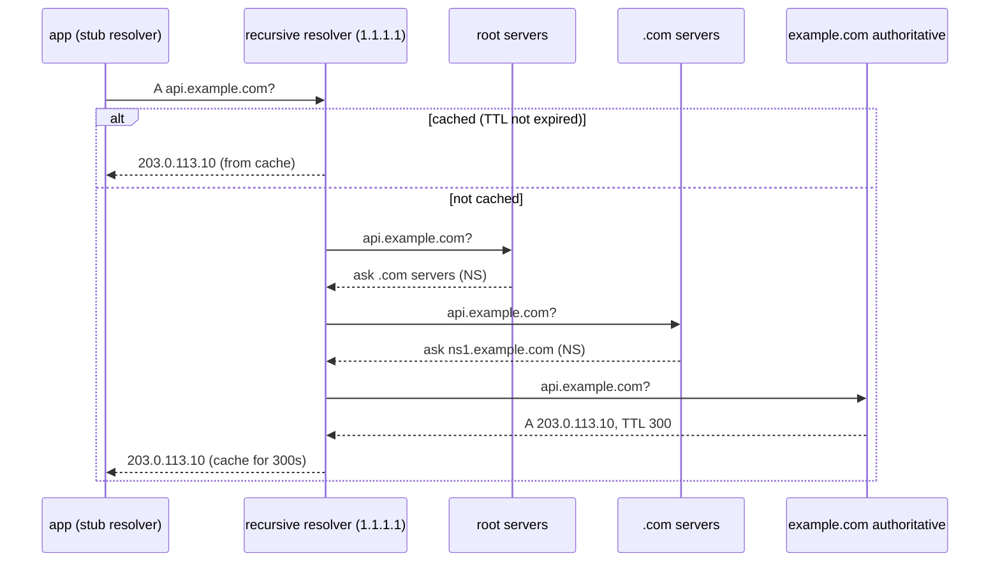
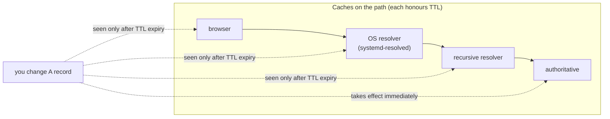
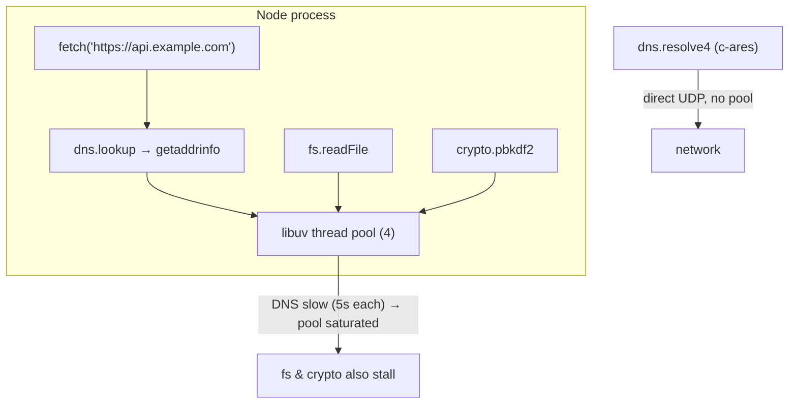

# Module 2.10 — DNS: من الاسم إلى العنوان
## DNS: resolvers, hierarchy, record types, TTL/caching, failure modes, Node specifics

> **المستوى:** Level 2 | **الموقع:** [10 من 13]
> **السابق:** [M2.9 — TCP & UDP](module-2.9-tcp-udp.md) | **التالي:** [M2.11 — TLS](module-2.11-tls.md)

---

## 1. المتطلبات
- [ ] IP، المنافذ، UDP vs TCP — [M2.8](module-2.8-networking-from-zero.md)، [M2.9](module-2.9-tcp-udp.md)
- [ ] thread pool لـ libuv (`dns.lookup`) — [M2.6](module-2.6-threads.md)
- [ ] URL وأجزاؤه — [L0-M0.6](../level-0-absolute-foundations/module-06-network-client-server.md)

## 2. أهداف التعلّم
- شرح DNS كـ **قاعدة بيانات موزّعة هرمية**: Root → TLD → Authoritative، ودور **الـ resolver** (العودي) والـ **cache** في كل طبقة.
- قراءة أنواع السجلات: **A, AAAA, CNAME, MX, TXT, NS, SOA, SRV** ومتى يُستخدم كلٌّ.
- فهم **TTL** كعقد كاش: لماذا تغيير DNS "يأخذ وقتًا"، وكيف تخطّط لهجرة بلا توقف.
- تشخيص أعطال DNS: `ENOTFOUND`, `EAI_AGAIN`, `SERVFAIL`, `NXDOMAIN`، والفرق بين `dns.lookup` (getaddrinfo، thread pool، `/etc/hosts`) و`dns.resolve` (شبكة مباشرة) في Node.
- معرفة ما يحدث لـ DNS داخل Docker/Kubernetes، ومخاطر DNS الأمنية (cache poisoning، DNS rebinding) وDoH/DoT وDNSSEC كوعي.
- استخدام `dig`, `nslookup`, `resolvectl`, `/etc/hosts`, `/etc/resolv.conf`.

---

## 3. شرح للمبتدئ

### المشكلة
TCP (M2.9) يحتاج IP وجهة. البشر يتذكرون `api.example.com`. DNS (Domain Name System) هو الترجمة — **لكنه ليس قائمة واحدة في مكان واحد**: مئات الملايين من الأسماء، تتغير باستمرار، ويجب أن تجيب في ms من أي مكان. الحل: **توزيع هرمي + كاش في كل مكان**.

### الهرم
اقرأ الاسم من اليمين: `api.example.com.` (النقطة الأخيرة = **الجذر**، تُحذف عادة).
1. **Root servers** (13 "اسمًا" منطقيًا، مئات النسخ بـ anycast): لا يعرفون `example.com`، لكن يعرفون من يدير **`.com`**.
2. **TLD servers** (`.com`, `.org`, `.dz`): يعرفون **خوادم الأسماء** (NS) المسؤولة عن `example.com`.
3. **Authoritative servers** لـ `example.com` (حيث تضع أنت سجلاتك: Cloudflare/Route53/…): يعرفون الجواب الفعلي: `api.example.com → 203.0.113.10`.

من يمشي هذا الطريق؟ **الـ resolver العودي** (recursive resolver): خادم DNS مزوّد الإنترنت، أو `1.1.1.1`/`8.8.8.8`، أو داخل شركتك. جهازك (**stub resolver**) يسأله فقط "ما عنوان api.example.com؟" وهو يسأل الهرم نيابةً عنك **ويخزّن** كل خطوة.

### الكاش و TTL: السبب في "التغيير يأخذ 24 ساعة"
كل سجل يحمل **TTL** (ثوانٍ): "يحق لك تخزين هذا الجواب لهذه المدة". الكاش في **كل** طبقة: المتصفح، OS (systemd-resolved)، الـ resolver، وحتى داخل تطبيقك (Java شهيرة بتخزين للأبد). لذلك عندما تغيّر `A` من IP قديم إلى جديد:
- من سبق وسأل خلال TTL يستمر على **القديم** حتى ينتهي.
- "الانتشار" (propagation) ليس دفعًا؛ هو **انتهاء صلاحية كاشات** متفرقة.

**وصفة الهجرة بلا توقف**: (1) قبل أيام: اخفض TTL من 3600 إلى 60. (2) انتظر TTL القديم كاملًا (حتى يحمل الجميع القيمة الجديدة للـ TTL). (3) غيّر السجل. (4) أبقِ **الخادم القديم يعمل** (أو يعيد التوجيه) حتى يتوقف وصول حركة إليه. (5) أعد TTL للأعلى. من يقفز للخطوة 3 مباشرة يحصل على "نصف المستخدمين على القديم" لساعات.

**Negative caching**: الجواب "غير موجود" (NXDOMAIN) يُخزَّن أيضًا (بـ TTL من سجل SOA). لهذا بعد إنشاء نطاق فرعي جديد قد تظل ترى "غير موجود" دقائق إن سألت قبل أن تنشئه.

### أنواع السجلات
| النوع | المعنى | مثال |
|---|---|---|
| **A** | اسم → IPv4 | `api.example.com → 203.0.113.10` (يمكن عدة = توزيع بدائي) |
| **AAAA** | اسم → IPv6 | `→ 2001:db8::10` |
| **CNAME** | اسم → **اسم آخر** (اسم مستعار) | `www → example.com`، `app → xyz.herokudns.com`. لا يجوز على الجذر (`example.com`) مع سجلات أخرى؛ لذلك "ALIAS/ANAME" عند المزوّدين. |
| **NS** | من هي الخوادم الموثوقة لهذا النطاق | تفويض (delegation) |
| **MX** | خوادم البريد + أولوية | `10 mail.example.com` |
| **TXT** | نص حر: إثبات ملكية، SPF/DKIM/DMARC للبريد، تحديات ACME لـ TLS | `v=spf1 include:_spf.google.com ~all` |
| **SOA** | بيانات النطاق (الرقم التسلسلي، TTL السلبي) | |
| **SRV** | خدمة → مضيف+**منفذ**+أولوية | `_sip._tcp` ، اكتشاف خدمات داخل K8s |
| **PTR** | IP → اسم (عكسي) | تحقق البريد، السجلات |

### أوضاع الفشل التي ستراها في Node
| الخطأ | المعنى | الشبهة |
|---|---|---|
| `ENOTFOUND` / `NXDOMAIN` | الاسم غير موجود (جواب موثوق: "لا يوجد") | خطأ إملائي، سجل لم يُنشأ، بيئة خاطئة (`db` بدل `db.internal`) |
| `EAI_AGAIN` | **فشل مؤقت**: الـ resolver لم يرد في الوقت | DNS الشبكة معطّل، `resolv.conf` خاطئ في الحاوية، UDP محجوب |
| `SERVFAIL` | الـ resolver فشل في الحصول على جواب | خوادم authoritative معطّلة، DNSSEC مكسور |
| `ETIMEDOUT` بعد نجاح DNS | DNS أعطى IP لكن TCP فشل | **IP قديم في الكاش** بعد هجرة؛ أو جدار ناري |

**DNS على UDP** (M2.9): سؤال/جواب بلا مصافحة؛ إن تجاوز الجواب ~1,200 بايت أو احتاج موثوقية (نقل منطقة) → TCP :53. و**DNS يفشل بصمت نسبيًا**: الكاش يخفي العطل حتى تنتهي الـ TTLs ثم ينهار كل شيء دفعة واحدة — حوادث "انقطاع الإنترنت" الكبرى (Dyn 2016، Facebook 2021 حيث اختفت سجلات NS بسبب BGP) هي أعطال DNS.

### Node: `dns.lookup` vs `dns.resolve` — فرق يسبّب حوادث
- **`dns.lookup(host)`** (ما يستخدمه `fetch`, `http.request`, `net.connect` افتراضيًا): يستدعي **`getaddrinfo`** من OS = يحترم `/etc/hosts`، `/etc/resolv.conf`، كاش OS، ترتيب IPv4/IPv6. لكنه **متزامن في libc** → يعمل في **thread pool libuv** (4 خيوط، M2.6). **إن تعطّل DNS وبدأت الاستعلامات تأخذ 5 ثوانٍ، تمتلئ الخيوط الأربعة وتتوقف كل عمليات `fs`/`crypto` معها** — عرض غريب: "القرص بطيء" بينما المشكلة DNS.
- **`dns.resolve4(host)`**: يتحدث مع خادم DNS مباشرة على الشبكة (c-ares)، غير محجوب، **لا يقرأ `/etc/hosts`** ولا كاش OS. مناسب لأدوات التشخيص والتحكم الدقيق، لا كبديل عام.
- **Node لا يخزّن DNS** افتراضيًا: كل `fetch` إلى اسم جديد (أو بعد إغلاق الاتصال) = `getaddrinfo` من جديد. مع keep-alive (M2.9) تقلّ الاستعلامات كثيرًا؛ وإلا فكّر في كاش بـ TTL (`cacheable-lookup`) أو اضبط كاش OS.
- `localhost`: منذ Node 17 يُفضَّل ترتيب OS (`verbatim`)، فقد تحصل على `::1` (IPv6) بينما خادمك يستمع على `127.0.0.1` فقط → `ECONNREFUSED` المحيّر. استمع على `::`/`0.0.0.0` أو اطلب `127.0.0.1` صراحة (L0-M0.5 يعود).

### DNS داخل Docker و Kubernetes
- Docker Compose: خادم DNS مدمج (`127.0.0.11`) يحل **أسماء الخدمات** (`db`, `redis`) إلى IPs الحاويات. من خارج الشبكة لا تعمل الأسماء.
- Kubernetes: CoreDNS؛ `service.namespace.svc.cluster.local`؛ `ndots:5` في `resolv.conf` يجعل كل اسم خارجي قصير يُجرَّب 5 مرات بلواحق داخلية أولًا (بطء غامض → استخدم FQDN بنقطة أخيرة أو اضبط ndots).
- الاسم يُحل إلى **ClusterIP** ثابت؛ الـ Service يوزّع على Pods — لذلك كاش DNS طويل في العميل غالبًا غير ضار داخل K8s لكنه ضار خارجها (IPs موازنات الحمل تتغير).

### الأمن (وعي)
- **Cache poisoning**: حقن جواب مزيّف في resolver → يذهب المستخدمون لخادم المهاجم. **DNSSEC** يوقّع السجلات لمنعه (اعتماد جزئي).
- **DNS rebinding**: موقع خبيث يجعل `evil.com` يُحل إلى IP عام ثم بعد ثوانٍ إلى `192.168.1.1` ليخترق أجهزة شبكتك عبر متصفحك → فحص رأس `Host` في خوادمك الداخلية + `isPrivate` (M2.8) بعد الحل لا قبله.
- **DoH/DoT** (DNS over HTTPS/TLS): يشفّر استعلاماتك عن مزوّد الإنترنت؛ لا يغيّر ما يراه الخادم.
- **TLS (M2.11) هو ما يمنع** DNS مزيفًا من إيذائك فعليًا: حتى لو وُجِّهت إلى IP خاطئ، الشهادة لن تطابق الاسم.

---

## 4. النموذج الذهني

```
اسم → stub (جهازك) → recursive resolver (يسأل ويخزّن) → Root → TLD → Authoritative (سجلاتك)
كل طبقة كاش بـ TTL → "الانتشار" = انتهاء كاشات → هجرة: اخفض TTL قبلها بـ TTL كامل، أبقِ القديم حيًا
سجلات: A/AAAA (IP)، CNAME (اسم→اسم)، NS (تفويض)، MX، TXT (إثباتات/بريد)، SRV (منفذ)، SOA، PTR
أخطاء: ENOTFOUND (غير موجود) | EAI_AGAIN (مؤقت: resolver لا يرد) | SERVFAIL | TCP timeout بعد DNS = IP قديم
Node: lookup = getaddrinfo (hosts، كاش OS، thread pool ← عطل DNS يحجب fs/crypto!) | resolve = شبكة مباشرة
Docker 127.0.0.11 أسماء الخدمات | K8s CoreDNS + ndots | localhost قد يكون ::1
أمن: poisoning→DNSSEC، rebinding→Host check + isPrivate بعد الحل، DoH يخفي عن ISP؛ TLS هو الحارس الفعلي
```

## 5. الرسم التوضيحي







## 6. مثال بسيط

```bash
dig +short api.github.com                 # الجواب فقط
dig api.github.com                        # كامل: ANSWER section مع TTL (راقبه ينقص عند التكرار = كاش الـ resolver)
dig +trace example.com                    # المشي في الهرم: root → .com → authoritative
dig example.com NS; dig example.com MX; dig example.com TXT
dig @1.1.1.1 example.com                  # اسأل resolver محددًا (قارن الكاشات)
dig -x 1.1.1.1                            # PTR عكسي
dig nonexistent-xyz.example.com           # status: NXDOMAIN
cat /etc/resolv.conf                      # من يسأل جهازك (nameserver، search، options ndots)
cat /etc/hosts                            # تجاوزات محلية (localhost، وأحيانًا سبب "يعمل عندي فقط")
resolvectl query example.com              # (systemd) يعرض الكاش والمصدر
```

## 7. مثال كود

```typescript
// src/dns-lab.ts — lookup vs resolve، قياس التكلفة، التعامل مع الأخطاء، وكاش بسيط بـ TTL
import dns from "node:dns/promises";
import { lookup } from "node:dns";
import { promisify } from "node:util";

const lookupAsync = promisify(lookup);
const HOST = process.argv[2] ?? "example.com";

// 1) lookup (getaddrinfo: hosts + OS cache + pool) vs resolve4 (شبكة مباشرة + TTL)
console.time("lookup  "); const l = await lookupAsync(HOST, { all: true }); console.timeEnd("lookup  ");
console.log("  lookup  →", l.map(a => `${a.address} (v${a.family})`).join(", "));
console.time("resolve4"); const r = await dns.resolve4(HOST, { ttl: true }); console.timeEnd("resolve4");
console.log("  resolve4 →", r.map(a => `${a.address} ttl=${a.ttl}s`).join(", "));
console.log("  resolver servers:", dns.getServers().join(", "));

// 2) سجلات أخرى (بعضها قد لا يوجد — هذا طبيعي)
for (const type of ["AAAA", "CNAME", "NS", "MX", "TXT"] as const) {
  try { const v = await dns.resolve(HOST, type); console.log(`  ${type.padEnd(5)} →`, JSON.stringify(v).slice(0, 120)); }
  catch (e) { console.log(`  ${type.padEnd(5)} → ${(e as NodeJS.ErrnoException).code}`); }   // ENODATA = الاسم موجود بلا هذا النوع
}

// 3) أوضاع الفشل
for (const h of ["this-name-does-not-exist-xyz.example.com", "localhost"]) {
  try { const a = await lookupAsync(h); console.log(`  ${h} → ${a.address} (family ${a.family})${a.address === "::1" ? "  ← IPv6! خادم على 127.0.0.1 فقط سيرفض" : ""}`); }
  catch (e) { const err = e as NodeJS.ErrnoException; console.log(`  ${h} → ${err.code}  (${err.code === "ENOTFOUND" ? "جواب موثوق: غير موجود" : err.code === "EAI_AGAIN" ? "مؤقت: الـ resolver لا يرد — أعد المحاولة" : err.message})`); }
}

// 4) كاش DNS بسيط يحترم TTL (نمط لعملاء HTTP كثيفة بلا keep-alive؛ مع keep-alive تحتاجه أقل)
const cache = new Map<string, { ips: string[]; expires: number }>();
async function cachedResolve(host: string) {
  const hit = cache.get(host);
  if (hit && hit.expires > Date.now()) return { ips: hit.ips, fromCache: true };
  const recs = await dns.resolve4(host, { ttl: true });
  const ttl = Math.max(1, Math.min(...recs.map(x => x.ttl)));          // احترم أصغر TTL (ولا تخزّن للأبد!)
  cache.set(host, { ips: recs.map(x => x.address), expires: Date.now() + ttl * 1000 });
  return { ips: recs.map(x => x.address), fromCache: false, ttl };
}
console.log("\n  cachedResolve #1", await cachedResolve(HOST));
console.log("  cachedResolve #2", await cachedResolve(HOST));
```

## 8. مثال من العالم الحقيقي
- شهادة Let's Encrypt بتحدي DNS-01 = سجل TXT `_acme-challenge.example.com` يثبت أنك تملك النطاق (M2.11).
- البريد: SPF/DKIM/DMARC سجلات TXT؛ MX يحدد خادم الاستقبال. "بريدنا يذهب إلى spam" = غالبًا DNS.
- CDN (Cloudflare): CNAME `www` إلى شبكتهم؛ هم يعيدون IPs قريبة منك جغرافيًا (GeoDNS/anycast).
- Failover بـ DNS (Route53 health checks): يحوّل السجل عند تعطل منطقة — لكن بسرعة TTL فقط؛ لذلك TTL 60s للنقاط الحرجة.

## 9. مثال من الإنتاج
**حادثة "الملفات بطيئة بعد انقطاع DNS":** خدمة ترفع صورًا إلى S3 وتقرأ قوالب من القرص. انقطع resolver الشركة 10 دقائق. المتوقع: فشل طلبات S3. الملاحظ: **قراءات القرص المحلية** تأخذ 20 ثانية وفحص الصحة (يقرأ ملفًا!) يفشل → موازن الحمل يسحب كل الخوادم → انقطاع كامل. السبب: `dns.lookup` → `getaddrinfo` على thread pool (4 خيوط)؛ كل استعلام ينتظر مهلة 5s × محاولتين؛ طلبات S3 المتزامنة أشبعت الخيوط الأربعة؛ `fs.readFile` اصطفّ خلفها. الإصلاحات: (1) keep-alive لاتصالات S3 (استعلامات DNS أقل بـ 100×)، (2) `UV_THREADPOOL_SIZE=16`، (3) فحص صحة لا يعتمد على pool (`/health` يعيد حالة في الذاكرة)، (4) مهلة DNS أقصر في `resolv.conf` (`options timeout:1 attempts:2`). **الدرس:** DNS ليس "قبل الشبكة" فحسب — في Node هو مورد مشترك مع القرص والتشفير.

## 10. مفاهيم خاطئة شائعة

| ❌ | ✅ |
|---|---|
| "غيّرت DNS، ينتشر خلال 24–48 ساعة" | ينتهي الكاش حسب TTL **الذي كان** قبل التغيير؛ خطّط بخفض TTL مسبقًا. |
| "CNAME على الجذر مثل أي سجل" | غير مسموح مع سجلات أخرى (SOA/NS موجودة دائمًا)؛ استخدم ALIAS/ANAME المزوّد أو A. |
| "DNS على UDP فقط" | TCP عند الأجوبة الكبيرة/نقل المناطق؛ حجب TCP 53 يكسر أشياء غامضة. |
| "`localhost` = 127.0.0.1 دائمًا" | قد يُحل إلى `::1`؛ استمع على كليهما أو اطلب IP صراحة. |
| "Node يخزّن DNS" | لا، افتراضيًا كل اتصال جديد يستعلم؛ keep-alive أو كاش صريح. |
| "DNS آمن لأنه داخلي" | poisoning/rebinding حقيقية؛ TLS والتحقق من `Host` هما الدفاع. |

## 11. أخطاء شائعة
1. تخزين DNS للأبد في التطبيق (أو `Map` بلا TTL) → بعد هجرة المزوّد، خادمك يطلب IPs ميتة بينما البقية بخير.
2. TTL 86400 على سجلات تحتاج failover سريعًا.
3. `fetch` كثيف بلا keep-alive → آلاف `getaddrinfo` + thread pool مشبع.
4. الاعتماد على أسماء Docker Compose من خارج الشبكة (أو العكس: `localhost` من داخل حاوية للوصول إلى حاوية أخرى).
5. تجاهل `EAI_AGAIN` كخطأ دائم بدل إعادة المحاولة بـ backoff.
6. نسيان `ndots` في K8s → كل طلب خارجي يجرّب 5 أسماء داخلية أولًا.

## 12. تمرين تصحيح

```
# بعد نقل قاعدة البيانات إلى مزوّد جديد (غيّرنا سجل A لـ db.internal.example.com منذ ساعتين):
# - 3 من 5 خوادم API تعمل. 2 تعطي: Error: connect ETIMEDOUT 10.20.0.15:5432
# - على الخادمين المعطّلين: dig db.internal.example.com → 10.30.0.8 (الجديد، صحيح!)
# - node -e "require('dns').lookup('db.internal.example.com', console.log)" → 10.20.0.15 (القديم!)
```
dig يعطي الجديد وNode يعطي القديم على **نفس الجهاز**. أين الكاش؟ ولماذا 3 خوادم فقط سليمة؟

<details><summary>💡 الحل</summary>

1. `dig` يسأل الـ resolver مباشرة (مثل `dns.resolve`) → جديد. `dns.lookup` → `getaddrinfo` → **كاش OS** (systemd-resolved/nscd) أو **`/etc/hosts`**! تحقق: `grep db.internal /etc/hosts` — غالبًا أحدهم أضاف سطرًا "مؤقتًا" يومًا ما على خادمين. أو `resolvectl query` يُظهر كاش OS بقيمة قديمة بـ TTL طويل.
2. إن كان `/etc/hosts`: احذف السطر. إن كان كاش OS: `resolvectl flush-caches`. ولو كان الاتصال DB **pool دائمًا** مفتوحًا من قبل الهجرة، فإن pool لا يعيد الاستعلام أبدًا حتى تُغلق الاتصالات — إعادة تشغيل أو إعادة إنشاء pool.
3. **3 سليمة**: أُعيد تشغيلها بعد التغيير (نشر) أو لا تملك سطر hosts. "يعمل على بعض الخوادم" = ابحث عن اختلاف محلي (hosts، كاش، إصدار).
4. درس المنهج: `ETIMEDOUT` إلى IP محدد → **اسأل أولًا من أين جاء هذا IP** قبل لوم الشبكة. وللمستقبل: الهجرة بوصفة TTL، وفحص الفروق بين الخوادم (`/etc/hosts` في إدارة الإعدادات لا باليد).
</details>

## 13. تمرين معماري
صمّم استراتيجية DNS لمنتج SaaS: نطاق رئيسي + `api.` + `app.` + نطاقات مخصّصة للعملاء (`app.customer.com` عبر CNAME إليك). ما TTLs لكل سجل ولماذا؟ كيف تتحقق من ملكية نطاق العميل (TXT)؟ كيف تصدر TLS لنطاقاتهم (M2.11 يشرح ACME)؟ ما خطة failover بين منطقتين (TTL، فحوص صحة، ماذا يحدث لمستخدم لديه كاش قديم)؟ كيف تحمي خوادمك من DNS rebinding؟ ACTRR.

## 14. الصلة بعصر AI
AI يقول "انتظر 24–48 ساعة للانتشار" ويقترح `/etc/hosts` كحل سريع وينسى أن يذكره لاحقًا. عند أي هجرة اطلب منه **خطة TTL بتواريخ**، وعند أعطال "تعمل على بعض الخوادم" اطلب قائمة **الفروق المحلية الممكنة** (hosts، كاش OS، resolv.conf، إصدار Node وسلوك `localhost`). أعطه مخرجات `dig` و`resolvectl` الحقيقية.

## 15–17. Master / Understand / Defer
- 🔴 الهرم والـ resolver العودي والكاش بـ TTL؛ "الانتشار" = انتهاء كاشات ووصفة الهجرة؛ A/AAAA/CNAME/NS/TXT؛ `ENOTFOUND` vs `EAI_AGAIN`؛ `lookup` (getaddrinfo، hosts، pool) vs `resolve`؛ `localhost` قد يكون `::1`؛ عطل DNS في Node يحجب pool.
- 🟠 MX/SRV/SOA/PTR؛ negative caching؛ DNS على TCP؛ Docker/K8s DNS وndots؛ كاش بـ TTL في التطبيق؛ GeoDNS/anycast؛ failover بـ DNS وحدوده.
- ⚪ DNSSEC بالتفصيل؛ DoH/DoT؛ نقل المناطق (AXFR)؛ EDNS؛ تشغيل خادم DNS موثوق بنفسك.

## 18. الخلاصة
1. DNS قاعدة بيانات **موزّعة هرمية** (Root → TLD → Authoritative) يمشيها resolver عودي **ويخزّن** كل شيء بـ TTL.
2. تغيير السجل فوري عند المصدر؛ ما يبطئ هو **الكاشات** — خطّط بخفض TTL قبل الهجرة وأبقِ القديم حيًا.
3. A/AAAA للعناوين، CNAME للأسماء المستعارة، NS للتفويض، TXT للإثباتات، MX للبريد، SRV للمنافذ.
4. `ENOTFOUND` نهائي؛ `EAI_AGAIN` مؤقت؛ TCP timeout بعد DNS ناجح = اسأل من أين جاء IP.
5. في Node: `lookup` يمرّ بـ `/etc/hosts` وكاش OS و**thread pool** (عطل DNS يبطّئ القرص!)؛ `resolve` يسأل الشبكة مباشرة.
6. DNS ليس آمنًا بذاته؛ TLS (التالي) هو ما يجعل الوصول للعنوان الخاطئ غير مؤذٍ.

## 19. مراجع رسمية
- RFC 1034/1035 — Domain Names: https://www.rfc-editor.org/rfc/rfc1034
- Node.js — `dns` module (`lookup` vs `resolve`, implementation considerations): https://nodejs.org/api/dns.html#implementation-considerations
- Cloudflare Learning — What is DNS?: https://www.cloudflare.com/learning/dns/what-is-dns/
- Linux man-pages — `resolv.conf(5)`, `getaddrinfo(3)`: https://man7.org/linux/man-pages/man5/resolv.conf.5.html
- Docker — Container networking & embedded DNS: https://docs.docker.com/engine/network/
- Kubernetes — DNS for Services and Pods: https://kubernetes.io/docs/concepts/services-networking/dns-pod-service/

## المصطلحات
| العربية | English |
|---|---|
| نظام أسماء النطاقات | DNS |
| محلّل عودي / محلّل طرفي | Recursive resolver / Stub resolver |
| خوادم الجذر / نطاق المستوى الأعلى | Root servers / TLD |
| خادم موثوق | Authoritative server |
| تفويض | Delegation |
| سجل (A, AAAA, CNAME, …) | Record |
| اسم مستعار | Alias (CNAME) |
| مدة الصلاحية (الكاش) | TTL |
| الانتشار | Propagation |
| تخزين سلبي | Negative caching |
| اسم غير موجود | NXDOMAIN |
| اسم نطاق مؤهل بالكامل | FQDN |
| تسميم الكاش | Cache poisoning |
| إعادة ربط DNS | DNS rebinding |
| DNS عبر HTTPS/TLS | DoH / DoT |

> **التالي:** [Module 2.11 — TLS](module-2.11-tls.md)
