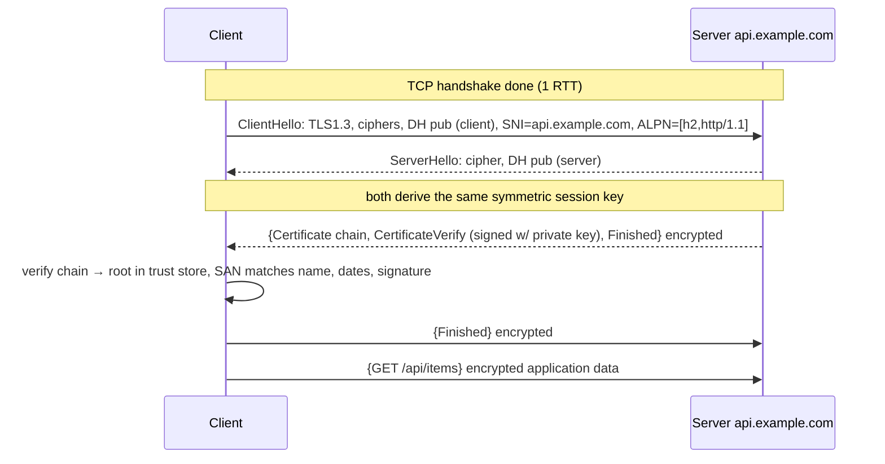
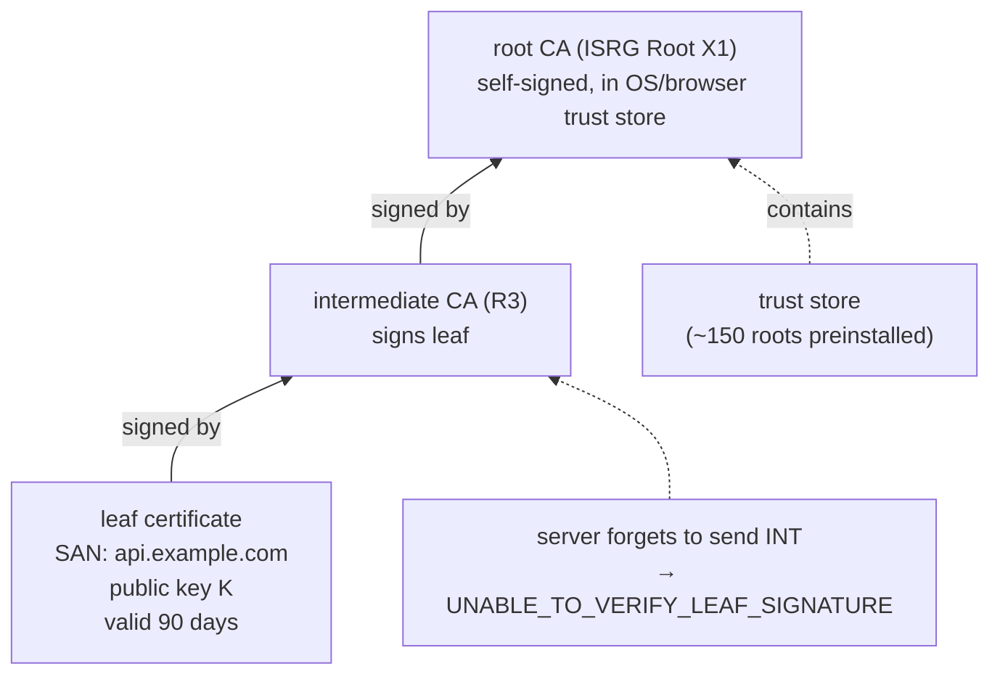
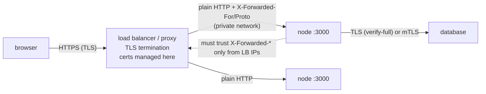

# Module 2.11 — TLS: كيف تثق بخادم لم تقابله قط
## TLS: encryption vs authentication, certificates & CAs, handshake, HTTPS, mTLS, common failures

> **المستوى:** Level 2 | **الموقع:** [11 من 13]
> **السابق:** [M2.10 — DNS](module-2.10-dns.md) | **التالي:** [M2.12 — HTTP](module-2.12-http.md)

---

## 1. المتطلبات
> **قبل أن تتعلم هذا، يجب أن تفهم:**
- [ ] TCP والمصافحة وتكلفة RTT — [M2.9](module-2.9-tcp-udp.md)
- [ ] DNS ولماذا ليس آمنًا — [M2.10](module-2.10-dns.md)
- [ ] البايتات وhex وBuffer — [M2.1](module-2.1-bits-bytes-encoding.md)
- [ ] Trust Boundary: Frontend غير موثوق — [L0-M0.7](../level-0-absolute-foundations/module-07-database-api-web-app.md)

## 2. أهداف التعلّم
- التمييز بين **ثلاث ضمانات** مختلفة: **السرية** (encryption)، **السلامة** (integrity)، **الهوية** (authentication) — ولماذا التشفير بلا هوية عديم القيمة (man-in-the-middle).
- شرح **التشفير المتماثل** vs **غير المتماثل** (مفتاح عام/خاص) و**التوقيع** و**الـ hash**، بما يكفي لفهم ما يفعله TLS (لا لتنفيذه).
- وصف **الشهادة** (certificate): ماذا تربط (اسم ↔ مفتاح عام)، من يوقّعها (**CA**)، **سلسلة الثقة** حتى الجذر في مخزن OS/المتصفح، وماذا يتحقق العميل منه (الاسم، التاريخ، السلسلة، الإبطال).
- رسم **مصافحة TLS 1.3** (1 RTT) ومكانها بعد TCP وقبل HTTP، وما **SNI** و**ALPN**.
- تشخيص الأخطاء الشائعة: `UNABLE_TO_VERIFY_LEAF_SIGNATURE`, `CERT_HAS_EXPIRED`, `ERR_TLS_CERT_ALTNAME_INVALID`, `SELF_SIGNED_CERT_IN_CHAIN`، ولماذا `rejectUnauthorized: false` جريمة.
- فهم Let's Encrypt/ACME، إنهاء TLS عند proxy، mTLS، وما **لا** يحميه TLS.

---

## 3. شرح للمبتدئ

### ثلاث مشكلات، لا واحدة
على الشبكة (M2.8) كل موجّه وشبكة Wi-Fi ومزوّد إنترنت **يرى** حزمك و**يستطيع تعديلها** و**يستطيع انتحال** الوجهة (DNS مزيّف، M2.10). الأمان يحتاج ثلاث ضمانات:
1. **السرية** (confidentiality): لا أحد في الوسط يقرأ. → **تشفير**.
2. **السلامة** (integrity): لا أحد يعدّل بايتًا دون أن يُكتشف. → **MAC/AEAD** (تشفير مصادَق).
3. **الهوية** (authentication): أنا أتحدث فعلًا مع `bank.com` لا مع من يدّعي ذلك. → **شهادات وتوقيعات**.

**الفخ الذهني الأكبر**: "مشفّر = آمن". تشفير قناة مع **المهاجم نفسه** (man-in-the-middle, MITM) مشفّر تمامًا... وعديم القيمة. الهوية هي ما يجعل التشفير ذا معنى. لذلك `rejectUnauthorized: false` (= "لا تتحقق من الهوية") يلغي 2 من 3 ضمانات ويترك "تشفيرًا" مع مجهول.

### أدوات التشفير بأقل ما يلزم
- **Hash** (SHA-256): دالة أحادية الاتجاه: أي مدخل → 32 بايت ثابتة؛ تغيير بت واحد يغيّر كل شيء؛ لا يمكن العكس ولا إيجاد تصادم عمليًا. يُستخدم للبصمات والتوقيع و(بإضافات) كلمات السر (L5-M2: ليس SHA مباشرة!).
- **تشفير متماثل** (AES-GCM, ChaCha20-Poly1305): **مفتاح واحد** للتشفير وفك التشفير. سريع جدًا (GB/s، بتسريع عتادي). المشكلة: كيف يتفق طرفان لم يلتقيا على مفتاح سري عبر قناة يتنصّت عليها الجميع؟
- **تشفير غير متماثل** (RSA, ECDSA, X25519): **زوج مفاتيح**: عام (تنشره) وخاص (لا يغادر خادمك). ما يُشفَّر بالعام يُفَكّ بالخاص فقط. و**التوقيع**: ما يُوقَّع بالخاص يتحقق منه أي أحد بالعام → إثبات أن صاحب الخاص هو من كتب هذا. بطيء (آلاف العمليات/ثانية لا ملايين).
- **تبادل مفاتيح** (Diffie-Hellman / ECDHE): طرفان يتبادلان قيمًا عامة ويحسب كلٌّ منهما **نفس السر** الذي لا يستطيع المتنصّت حسابه. مفتاح **مؤقّت** لكل جلسة → **Forward secrecy**: سرقة مفتاح الخادم الخاص لاحقًا لا تفكّ تسجيلات الماضي.

**TLS يجمعها**: غير متماثل للهوية وتبادل مفتاح (مرة، في المصافحة) → متماثل لكل البيانات بعدها (سريع).

### الشهادة: من يضمن من؟
المفتاح العام وحده لا يثبت شيئًا — المهاجم له مفتاح عام أيضًا. **الشهادة** (X.509) وثيقة تقول: "المفتاح العام `K` يخص **الاسم** `api.example.com` (حقل **SAN**)، صالحة من X إلى Y، **ويوقّع** على ذلك `R3` (Let's Encrypt)". لماذا تثق بـ R3؟ لأن شهادته موقّعة من `ISRG Root X1`، و**هذه الجذر موجودة مسبقًا في مخزن الثقة** (trust store) لنظام تشغيلك/متصفحك (~150 جذرًا) — ثقة **مُثبَّتة مسبقًا** ومُدارة بسياسات صارمة (CA/Browser Forum، Certificate Transparency logs العامة).

العميل يتحقق من: (1) **السلسلة** كاملة حتى جذر موثوق (الخادم يجب أن يرسل الوسيطة! أشهر خطأ)، (2) **الاسم** الذي طلبتَه يطابق SAN (wildcard `*.example.com` يغطي مستوى واحدًا فقط)، (3) **التاريخ** (شهادات Let's Encrypt 90 يومًا — جدّد آليًا أو ستنقطع)، (4) **الإبطال** (OCSP/CRL — ضعيف عمليًا، ⚪)، (5) توقيعات صحيحة.

كيف تحصل على شهادة؟ **ACME** (Let's Encrypt): تثبت التحكم بالنطاق (ملف على `http://…/.well-known/acme-challenge/` أو سجل TXT، M2.10) → تحصل على شهادة مجانًا، وتجدّد كل 60 يومًا آليًا (certbot/caddy/traefik أو موازن الحمل السحابي يفعل كل هذا).

### المصافحة (TLS 1.3): ماذا يحدث في ذلك الـ RTT
بعد اكتمال مصافحة TCP (M2.9):
```
Client → ClientHello: الإصدارات، الخوارزميات المدعومة، قيمة DH العامة، SNI = "api.example.com", ALPN = [h2, http/1.1]
Server → ServerHello: الخوارزمية المختارة، قيمة DH العامة  ← الآن للطرفين مفتاح متماثل مشترك
         {Certificate, CertificateVerify (توقيع بالمفتاح الخاص يثبت ملكيته), Finished}  ← مشفّر
Client: يتحقق من السلسلة/الاسم/التاريخ/التوقيع → Finished
         → بيانات التطبيق (HTTP) مشفّرة
```
- **1 RTT** (TLS 1.2 كان 2؛ TLS 1.3 مع resumption يمكن 0-RTT بقيود). المجموع مع TCP: 2 RTT قبل أول بايت HTTP؛ QUIC يدمجهما في 1 (M2.9).
- **SNI** (Server Name Indication): العميل يرسل الاسم **بنص صريح** في ClientHello حتى يعرف خادم يستضيف 100 موقع أي شهادة يقدّم. (ECH يشفّره، ⚪.) → اسم الموقع الذي تزوره **مرئي** لمزوّدك حتى مع HTTPS؛ المسار والمحتوى لا.
- **ALPN**: الاتفاق على بروتوكول التطبيق (HTTP/2 أم 1.1) داخل المصافحة بلا رحلة إضافية.
- **Session resumption**: تذكرة من جلسة سابقة تختصر المصافحة.

### الأخطاء التي ستراها في Node وما تعنيه
| الخطأ | المعنى | الإصلاح الصحيح | الإصلاح الخاطئ |
|---|---|---|---|
| `UNABLE_TO_VERIFY_LEAF_SIGNATURE` / `UNABLE_TO_GET_ISSUER_CERT_LOCALLY` | السلسلة ناقصة (الخادم لم يرسل الوسيطة) أو CA غير معروفة | أصلح الخادم (fullchain.pem)؛ أو أضف CA الشركة بـ `NODE_EXTRA_CA_CERTS` | `rejectUnauthorized:false` |
| `SELF_SIGNED_CERT_IN_CHAIN` | شهادة ذاتية التوقيع (بيئة تطوير، أو **proxy شركة يفكّ TLS**) | ثق بتلك CA صراحةً عبر `NODE_EXTRA_CA_CERTS=/path/corp-ca.pem` | نفسه |
| `CERT_HAS_EXPIRED` | انتهت (أو ساعة الجهاز خاطئة!) | جدّد؛ راقب انتهاء الشهادات (تنبيه قبل 14 يومًا) | نفسه |
| `ERR_TLS_CERT_ALTNAME_INVALID` | الاسم المطلوب ليس في SAN (طلبت IP أو `internal.local` وشهادة لـ `example.com`) | اطلب بالاسم الصحيح / أصدر شهادة بالاسم | نفسه |
| `ECONNRESET` أثناء المصافحة / `EPROTO` | عدم توافق إصدار/خوارزميات، أو المنفذ ليس TLS (http على 443) | تحقق بـ `openssl s_client` | — |

`rejectUnauthorized: false` / `NODE_TLS_REJECT_UNAUTHORIZED=0` = "اقبل أي شهادة من أي أحد" = MITM مفتوح. **مقبول فقط** في اختبار محلي مؤقت، ويُراجَع كخطأ أمني حرج في أي كود إنتاج (L5-M4). البديل الصحيح دائمًا: اجعل العميل يثق بالـ CA الصحيحة.

### أين ينتهي TLS؟ (TLS termination)
في الإنتاج غالبًا **لا يتحدث Node بـ TLS مباشرة**: موازن حمل/proxy (nginx, Caddy, ALB, Cloudflare) **ينهي** TLS (يفكّه) ويمرّر HTTP عاديًا إلى Node داخل الشبكة الخاصة. المزايا: إدارة شهادات مركزية، تسريع، HTTP/2/3 مجانًا. **النتائج**: (1) داخل الشبكة الخاصة الحركة **غير مشفّرة** — قرار ثقة واعٍ (أو mTLS/service mesh داخليًا، L7)؛ (2) Node يرى `http://` ويجب أن يقرأ `X-Forwarded-Proto`/`X-Forwarded-For` **من proxy موثوق فقط** (وإلا ينتحل العميل IP، L5-M4)؛ (3) روابط مطلقة/كوكيز `Secure` تعتمد على معرفة أن الأصل HTTPS.

### mTLS: الهوية في الاتجاهين
TLS العادي: الخادم يثبت هويته؛ العميل مجهول (يُصادَق لاحقًا بكلمة سر/token في HTTP). **mTLS** (mutual): العميل أيضًا يقدّم شهادة؛ الخادم يرفض من لا يملك واحدة موقّعة من CA داخلية. يُستخدم بين الخدمات (service-to-service)، في service meshes، ولأجهزة IoT. أقوى من API keys لأن المفتاح الخاص لا يُرسَل أبدًا.

### ما لا يحميه TLS
- **الخادم نفسه**: البيانات مفكوكة هناك؛ ثغرة في كودك أو DB مسرّبة لا علاقة لها بـ TLS.
- **البيانات الوصفية**: IP الوجهة، SNI، الحجم والتوقيت.
- **العميل المخترق**: امتداد متصفح/برمجية خبيثة تقرأ قبل التشفير.
- **منطقك**: "الطلب جاء عبر HTTPS" لا يعني أنه موثوق (Trust Boundary من L0-M0.7 كما هي).
- **الشهادة المزيفة من CA مخترقة**: نادر لكنه حدث (DigiNotar 2011)؛ Certificate Transparency يكشفه.

---

## 4. النموذج الذهني

```
ثلاث ضمانات: سرية (تشفير) + سلامة (AEAD) + هوية (شهادة+توقيع) — بلا هوية = تشفير مع المهاجم (MITM)
أدوات: hash (بصمة) | متماثل (سريع، مفتاح واحد) | غير متماثل (عام/خاص، توقيع) | ECDHE (سر مشترك مؤقت → forward secrecy)
شهادة = (اسم SAN ↔ مفتاح عام) موقّعة من CA → سلسلة → جذر في trust store؛ تحقق: سلسلة، اسم، تاريخ، توقيع
ACME/Let's Encrypt: أثبت التحكم (HTTP/TXT) → 90 يومًا → جدّد آليًا
Handshake 1.3: ClientHello(SNI, ALPN, DH) → ServerHello(DH) + {cert, verify, finished} → 1 RTT → HTTP مشفّر
أخطاء = سلسلة ناقصة | self-signed/proxy | منتهية/ساعة | اسم لا يطابق — الحل: ثق بالـ CA الصحيحة، أبدًا rejectUnauthorized:false
Termination عند proxy → داخلي غير مشفّر (قرار واعٍ) + X-Forwarded-* من proxy موثوق فقط | mTLS للخدمات
لا يحمي: الخادم، البيانات الوصفية، العميل المخترق، منطقك
```

## 5. الرسم التوضيحي







## 6. مثال بسيط

```bash
# افحص خادمًا حقيقيًا: السلسلة، الاسم، التاريخ، الإصدار، ALPN
openssl s_client -connect example.com:443 -servername example.com -alpn h2 </dev/null 2>/dev/null \
  | openssl x509 -noout -subject -issuer -dates -ext subjectAltName
# Verify return code: 0 (ok) في مخرجات s_client الكاملة = السلسلة سليمة

# ماذا يحدث عند طلب الاسم الخاطئ (IP بدل الاسم)؟
curl -v https://93.184.215.14/ 2>&1 | grep -iE "subject|SSL certificate problem|altname"   # لا يطابق SAN

# شهادة ذاتية التوقيع للتطوير (أو استخدم mkcert لتُثبّت CA محلية يثق بها متصفحك)
openssl req -x509 -newkey ec -pkeyopt ec_paramgen_curve:prime256v1 -nodes -days 30 \
  -keyout dev-key.pem -out dev-cert.pem -subj "/CN=localhost" -addext "subjectAltName=DNS:localhost,IP:127.0.0.1"

# أين مخزن الثقة؟
ls /etc/ssl/certs | wc -l          # Debian/Ubuntu (ca-certificates)؛ Node يحمل مخزنه المدمج + NODE_EXTRA_CA_CERTS
```

## 7. مثال كود

```typescript
// src/tls-lab.ts — خادم HTTPS بشهادة ذاتية، وثلاثة عملاء: يفشل (صحيح)، يثق بالـ CA الصحيحة (صحيح)، يعطّل التحقق (خطأ!)
// يحتاج dev-cert.pem/dev-key.pem من القسم 6 (SAN يشمل localhost و127.0.0.1)
import https from "node:https";
import tls from "node:tls";
import { readFileSync } from "node:fs";

const cert = readFileSync("dev-cert.pem"), key = readFileSync("dev-key.pem");

const server = https.createServer({ cert, key, minVersion: "TLSv1.2" }, (req, res) => {
  const sock = req.socket as tls.TLSSocket;
  res.setHeader("content-type", "application/json");
  res.end(JSON.stringify({ protocol: sock.getProtocol(), cipher: sock.getCipher().name, alpn: sock.alpnProtocol, sni: (sock as tls.TLSSocket & { servername?: string }).servername ?? null }));
});
await new Promise<void>(r => server.listen(0, "127.0.0.1", r));
const port = (server.address() as { port: number }).port;

type Opts = { label: string; ca?: Buffer; rejectUnauthorized?: boolean; host?: string };
function get({ label, ca, rejectUnauthorized = true, host = "localhost" }: Opts) {
  return new Promise<void>(resolve => {
    const req = https.get({ host: "127.0.0.1", port, path: "/", servername: host, ca, rejectUnauthorized }, res => {
      let body = ""; res.on("data", c => body += c); res.on("end", () => { console.log(`✅ ${label}: ${body}`); resolve(); });
    });
    req.on("error", (e: NodeJS.ErrnoException) => { console.log(`❌ ${label}: ${e.code ?? e.message}`); resolve(); });
  });
}

await get({ label: "default trust store (self-signed unknown)" });              // ❌ DEPTH_ZERO_SELF_SIGNED_CERT — هذا السلوك الصحيح
await get({ label: "trust OUR ca explicitly (ca: dev-cert)", ca: cert });        // ✅ الطريقة الصحيحة: ثق بالـ CA المحددة فقط
await get({ label: "wrong name (SAN has localhost, asked api.example.com)", ca: cert, host: "api.example.com" });   // ❌ ERR_TLS_CERT_ALTNAME_INVALID
await get({ label: "rejectUnauthorized:false — NEVER in prod", rejectUnauthorized: false });   // ✅ يعمل… مع أي أحد، بما فيهم المهاجم

// معلومات الشهادة من جهة العميل (ما يراه المتصفح في القفل)
const peer = await new Promise<tls.PeerCertificate>(r => { const s = tls.connect({ host: "127.0.0.1", port, servername: "localhost", ca: cert }, () => { r(s.getPeerCertificate()); s.end(); }); });
console.log("\npeer cert:", { subject: peer.subject, san: peer.subjectaltname, from: peer.valid_from, to: peer.valid_to, fingerprint: peer.fingerprint256.slice(0, 23) + "…" });
const daysLeft = Math.floor((new Date(peer.valid_to).getTime() - Date.now()) / 86_400_000);
console.log(`days until expiry: ${daysLeft}  ${daysLeft < 14 ? "⚠️ renew now (alert threshold)" : ""}`);
server.close();
```

## 8. مثال من العالم الحقيقي
- القفل في المتصفح = السلسلة صحّت والاسم طابق. **لا يعني** أن الموقع صادق — موقع تصيّد له شهادة Let's Encrypt صالحة تمامًا.
- شبكة الشركة بـ "SSL inspection": proxy يفكّ TLS ويعيد تشفيره بشهادة CA الشركة المثبّتة على أجهزتها → في Node: `SELF_SIGNED_CERT_IN_CHAIN` حتى تضيف `NODE_EXTRA_CA_CERTS`. (وهذا MITM "شرعي" — يوضح أن الهوية هي كل شيء.)
- PostgreSQL: `sslmode=require` يشفّر **بلا** تحقق هوية (MITM ممكن!)؛ `verify-full` هو الآمن. نفس درس `rejectUnauthorized`.
- HSTS: رأس يأمر المتصفح بعدم زيارة الموقع إلا عبر HTTPS — يمنع هجوم "التنزيل إلى HTTP" (M2.12).

## 9. مثال من الإنتاج
**حادثة "الموبايل فقط يفشل":** بعد تجديد الشهادة، المتصفحات على الحواسيب تعمل؛ تطبيق Android وسكربتات Node تفشل بـ `UNABLE_TO_VERIFY_LEAF_SIGNATURE`. السبب: المهندس وضع `cert.pem` (الورقة فقط) بدل `fullchain.pem` (الورقة + الوسيطة). المتصفحات الحديثة **تجلب الوسيطة الناقصة بنفسها** (AIA fetching) أو كانت تخزّنها من موقع سابق — فأخفت الخطأ؛ Node وAndroid لا يفعلان. "الإصلاح" المقترح في أول PR: `rejectUnauthorized: false` في عميل Node. رُفض؛ الإصلاح: fullchain + اختبار آلي بعد كل تجديد (`openssl s_client … | grep "Verify return code: 0"`) + مراقبة انتهاء الشهادة. **الدرس:** "يعمل في المتصفح" ليس دليل صحة TLS؛ اختبر بعميل صارم.

## 10. مفاهيم خاطئة شائعة

| ❌ | ✅ |
|---|---|
| "مشفّر = آمن" | بلا تحقق هوية = مشفّر مع مجهول. الهوية أولًا. |
| "القفل = موقع موثوق" | = الاتصال سليم مع صاحب هذا الاسم. الاسم نفسه قد يكون `paypa1.com`. |
| "`rejectUnauthorized:false` حل للتطوير فقط، لا ضرر" | ينتقل إلى الإنتاج دائمًا. استخدم mkcert/CA محلية موثوقة بدلًا منه. |
| "HTTPS يخفي أي موقع أزور" | SNI وIP ظاهران؛ المسار والمحتوى مخفيان. |
| "الشهادة ذاتية التوقيع غير آمنة" | آمنة تمامًا **إن وزّعتها وثق بها العملاء صراحةً** (داخليًا)؛ غير آمنة إن قبلتَ "أي" شهادة. |
| "TLS داخل الشبكة الخاصة مضيعة" | قرار ثقة؛ شبكات "خاصة" اختُرقت كثيرًا. على الأقل للـ DB وبين المناطق. |

## 11. أخطاء شائعة
1. تقديم الورقة بلا الوسيطة (fullchain).
2. لا مراقبة لانتهاء الشهادات → انقطاع كل 90 يومًا.
3. `NODE_TLS_REJECT_UNAUTHORIZED=0` في Dockerfile "مؤقتًا".
4. الثقة بـ `X-Forwarded-For` من أي مصدر → انتحال IP وتجاوز rate limits.
5. مفتاح خاص في Git أو في صورة Docker.
6. طلب الخدمة بـ IP بدل الاسم ثم تعطيل التحقق لأن "الاسم لا يطابق".
7. `sslmode=require` للـ DB بدل `verify-full`.

## 12. تمرين تصحيح

```
# خدمة Node تستدعي API شريك: تعمل من حاسوب المطور، تفشل في الإنتاج (حاوية Alpine):
Error: unable to get local issuer certificate  (code: UNABLE_TO_GET_ISSUER_CERT_LOCALLY)
# المطور: "أضفت rejectUnauthorized:false وعمل. هل أدمج؟"
# openssl s_client -connect partner-api.com:443 -servername partner-api.com </dev/null | grep -E "Verify|depth"
depth=0 CN = partner-api.com
verify error:num=20:unable to get local issuer certificate
depth=1 CN = Partner Internal CA
```
ثلاثة أسئلة: ما السبب الفعلي؟ لماذا يعمل على جهاز المطور؟ ما الإصلاح الذي تقبله في المراجعة؟

<details><summary>💡 الحل</summary>

1. **السبب**: الشريك يستخدم **CA خاصة** ("Partner Internal CA") غير موجودة في أي مخزن ثقة عام. السلسلة سليمة حتى تلك CA، لكنها ليست جذرًا موثوقًا لدى Node/Alpine.
2. **على جهاز المطور**: سبق أن ثبّت شهادة CA الشريك في مخزن OS عند الإعداد (أو لديه `NODE_EXTRA_CA_CERTS` في `.bashrc` ونسي). "يعمل عندي" = فرق في trust store.
3. **الإصلاح المقبول**: احصل على شهادة CA الشريك عبر **قناة موثوقة** (وثائقهم/بريد موقّع، لا من اتصال TLS نفسه!)، تحقق من بصمتها، ضعها في الصورة (`COPY partner-ca.pem /etc/ssl/…` + `NODE_EXTRA_CA_CERTS`) أو مرّرها بـ `ca:` لعميل هذا الشريك **فقط** (لا تثق بها عالميًا). ارفض `rejectUnauthorized:false`: يسمح لأي MITM بانتحال الشريك وقراءة/تعديل كل الطلبات (بيانات دفع؟). أضف اختبار تكامل يتحقق من الاتصال بالشريك في CI بالصورة نفسها.
4. للمستقبل: اسأل الشريك لماذا CA خاصة لواجهة عامة؛ أو اطلب mTLS صريحًا إن كان القصد تقييد العملاء.
</details>

## 13. تمرين معماري
نظامك: متصفح → CDN → موازن حمل → 3 خدمات Node → PostgreSQL + Redis، في منطقتين. أين ينتهي TLS؟ هل تعيد تشفير CDN→موازن، موازن→Node، Node→DB؟ من يصدر الشهادات الداخلية ويجدّدها (CA داخلية؟ mesh؟) وما دورتها؟ كيف تمنع انتحال `X-Forwarded-For`؟ كيف تراقب الانتهاء وتختبر السلاسل بعد كل تجديد؟ ما تكلفة الأداء (مصافحات، CPU) وكيف تخففها (keep-alive, resumption)؟ ACTRR.

## 14. الصلة بعصر AI
أول اقتراح لأي خطأ TLS من AI (ومن Stack Overflow) هو `rejectUnauthorized: false` / `NODE_TLS_REJECT_UNAUTHORIZED=0`. اعتبر ظهوره في كود مولَّد **علامة حمراء تلقائية**. اطلب بدلًا منه: *"حدّد الـ CA الناقصة وأضفها بشكل محدود النطاق."* وفي المراجعة، ابحث عن `rejectUnauthorized`, `NODE_TLS_REJECT`, `sslmode=require`, `verify=False` (Python), `-k` (curl) — كلها نفس الخطأ.

## 15. ما يجب إتقانه (Must Master) 🔴
- 🔴 الضمانات الثلاث ولماذا الهوية شرط لمعنى التشفير؛ شهادة = اسم↔مفتاح موقّعة من CA → سلسلة → trust store؛ ما يتحقق منه العميل؛ ACME/90 يومًا/تجديد آلي؛ المصافحة 1 RTT ومكانها؛ جدول الأخطاء والإصلاح الصحيح؛ **لا `rejectUnauthorized:false` أبدًا**؛ termination وX-Forwarded-* من proxy موثوق فقط.

## 16. ما يجب فهمه (Should Understand) 🟠
- 🟠 متماثل vs غير متماثل vs hash vs ECDHE/forward secrecy؛ SNI/ALPN/resumption؛ `NODE_EXTRA_CA_CERTS`؛ mTLS؛ `verify-full` للـ DB؛ `openssl s_client`؛ Certificate Transparency؛ HSTS.

## 17. ما يمكن تأجيله (Can Defer) ⚪
- ⚪ رياضيات RSA/ECC؛ OCSP stapling/CRLs؛ ECH؛ تفاصيل مجموعات التشفير؛ TLS 1.2 handshake؛ HSMs؛ إعداد CA داخلية (step-ca/Vault) بالتفصيل.

## 18. الخلاصة
1. الأمان = **سرية + سلامة + هوية**؛ التشفير بلا هوية = قناة مشفّرة مع المهاجم.
2. الشهادة تربط **اسمًا** بمفتاح عام بتوقيع **CA**؛ الثقة تنتقل عبر سلسلة إلى جذر مثبّت مسبقًا.
3. العميل يتحقق من السلسلة والاسم والتاريخ والتوقيع — وأخطاء TLS هي فشل أحدها؛ أصلح السبب، لا تعطّل التحقق.
4. مصافحة TLS 1.3 = 1 RTT بعد TCP؛ SNI ظاهر؛ ALPN يختار HTTP/2.
5. Let's Encrypt/ACME تجعل الشهادات مجانية وقصيرة العمر → **الأتمتة والمراقبة** إلزاميتان.
6. TLS غالبًا ينتهي عند proxy؛ قرّر بوعي ما يُشفَّر داخليًا، وثق بـ `X-Forwarded-*` من proxy موثوق فقط.
7. TLS لا يحمي الخادم ولا منطقك ولا العميل المخترق — هو طبقة نقل آمنة، لا أكثر.

## 19. مراجع رسمية
- RFC 8446 — TLS 1.3: https://www.rfc-editor.org/rfc/rfc8446
- Node.js — `tls` module (incl. `NODE_EXTRA_CA_CERTS`, `rejectUnauthorized`): https://nodejs.org/api/tls.html
- Let's Encrypt — How it works (ACME): https://letsencrypt.org/how-it-works/
- MDN — Transport Layer Security: https://developer.mozilla.org/en-US/docs/Web/Security/Transport_Layer_Security
- Cloudflare Learning — What happens in a TLS handshake?: https://www.cloudflare.com/learning/ssl/what-happens-in-a-tls-handshake/
- mkcert — شهادات تطوير موثوقة محليًا: https://github.com/FiloSottile/mkcert
- SSL Labs — Server Test (افحص إعداد خادمك): https://www.ssllabs.com/ssltest/

## المصطلحات
| العربية | English |
|---|---|
| سرية / سلامة / مصادقة (هوية) | Confidentiality / Integrity / Authentication |
| هجوم الوسيط | Man-in-the-middle (MITM) |
| دالة تجزئة | Hash function |
| تشفير متماثل / غير متماثل | Symmetric / Asymmetric encryption |
| مفتاح عام / خاص | Public / Private key |
| توقيع رقمي | Digital signature |
| تبادل مفاتيح | Key exchange (ECDHE) |
| السرية الأمامية | Forward secrecy |
| شهادة | Certificate (X.509) |
| سلطة إصدار الشهادات | Certificate Authority (CA) |
| شهادة وسيطة / جذر | Intermediate / Root certificate |
| سلسلة الثقة | Chain of trust |
| مخزن الثقة | Trust store |
| الاسم البديل للموضوع | SAN (Subject Alternative Name) |
| إشارة اسم الخادم | SNI |
| تفاوض بروتوكول التطبيق | ALPN |
| استئناف الجلسة | Session resumption |
| إنهاء TLS | TLS termination |
| TLS متبادل | mTLS |
| ذاتية التوقيع | Self-signed |
| شفافية الشهادات | Certificate Transparency |

> **التالي:** [Module 2.12 — HTTP](module-2.12-http.md)
