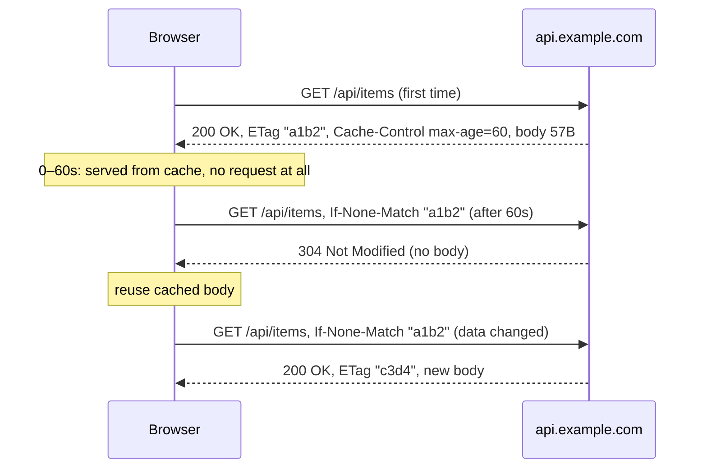
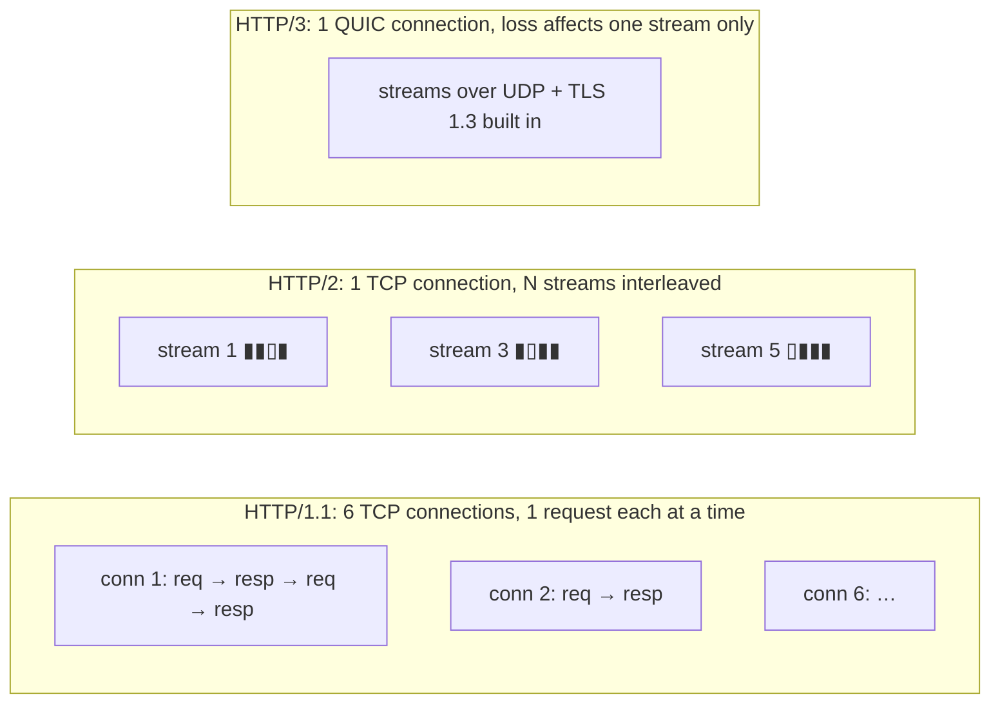
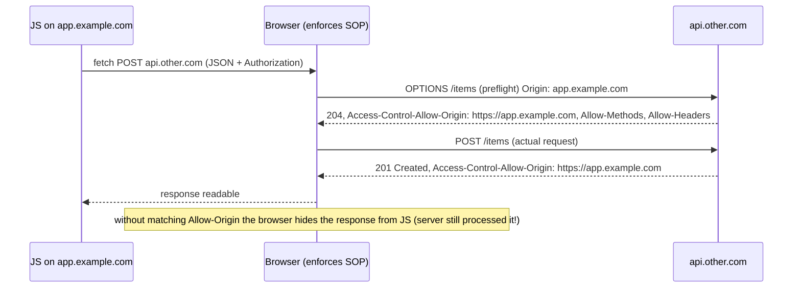

# Module 2.12 — HTTP: البروتوكول الذي ستعيش معه
## HTTP: request/response anatomy, methods, status codes, headers, bodies, caching, cookies, CORS, HTTP/1.1 vs 2 vs 3

> **المستوى:** Level 2 | **الموقع:** [12 من 13]
> **السابق:** [M2.11 — TLS](module-2.11-tls.md) | **التالي:** [M2.13 — Web App Architecture](module-2.13-web-app-architecture.md)

---

## 1. المتطلبات
> **قبل أن تتعلم هذا، يجب أن تفهم:**
- [ ] العميل/الخادم، URL، `fetch` و`res.ok` — [L0-M0.6](../level-0-absolute-foundations/module-06-network-client-server.md)
- [ ] TCP تيار + التأطير + keep-alive — [M2.9](module-2.9-tcp-udp.md)
- [ ] TLS/ALPN/termination — [M2.11](module-2.11-tls.md)
- [ ] UTF-8، JSON، Buffer — [M2.1](module-2.1-bits-bytes-encoding.md)، [L1-M1.10](../level-1-programming/module-1.10-io.md)

## 2. أهداف التعلّم
- قراءة وكتابة رسالة HTTP/1.1 **بالبايتات**: سطر الطلب، الترويسات، السطر الفارغ، الجسم؛ `Content-Length` vs `Transfer-Encoding: chunked` (تأطير HTTP فوق تيار TCP).
- استخدام **الطرق** (methods) بدلالاتها: آمنة/idempotent/قابلة للكاش، و**رموز الحالة** بعائلاتها واستخدام الصحيح منها.
- فهم الترويسات الأساسية: `Host`, `Content-Type`, `Accept`, `Authorization`, `Cookie/Set-Cookie`, `Cache-Control/ETag`, `Location`, `X-Forwarded-*`, و**لماذا الكوكيز تجعل CSRF ممكنًا** وCORS موجودًا.
- شرح **الكاش** HTTP (`Cache-Control`, `ETag`/`If-None-Match` → 304) كأكبر رافعة أداء مجانية.
- مقارنة **HTTP/1.1** (اتصال لكل طلب، head-of-line) و**HTTP/2** (تعدد إرسال، ضغط ترويسات) و**HTTP/3** (QUIC)، وما يتغير لك كمهندس.
- تشخيص بـ `curl -v` وDevTools Network، والتعرف على حدود الحجم والمهلات وHTTP smuggling كوعي.

---

## 3. شرح للمبتدئ

### HTTP = نص فوق TCP (في 1.1)
بعد TCP (M2.9) وTLS (M2.11)، يرسل العميل **نصًا** (ASCII في الترويسات، أي بايتات في الجسم):

```
GET /api/items?limit=2 HTTP/1.1\r\n            ← سطر الطلب: method  path  version
Host: api.example.com\r\n                      ← إلزامي في 1.1 (خادم واحد يستضيف مواقع كثيرة؛ قارن SNI)
Accept: application/json\r\n
Authorization: Bearer eyJ...\r\n
User-Agent: curl/8.5\r\n
\r\n                                           ← سطر فارغ = نهاية الترويسات
```
والخادم يرد:
```
HTTP/1.1 200 OK\r\n                            ← سطر الحالة: version  code  reason
Content-Type: application/json; charset=utf-8\r\n
Content-Length: 57\r\n                         ← التأطير! بعد السطر الفارغ اقرأ 57 بايتًا بالضبط
Cache-Control: private, max-age=60\r\n
Date: Thu, 02 Oct 2026 10:00:00 GMT\r\n
\r\n
{"items":[{"id":1,"name":"Pen"},{"id":2,"name":"Ink"}]}
```
**لاحظ**: `\r\n` (CRLF) لا `\n`؛ الترويسات **غير حساسة لحالة الأحرف**؛ القيم ASCII (UTF-8 في الترويسات غير آمن — لهذا تُرمَّز أسماء الملفات في `Content-Disposition`). **التأطير** (M2.9): إما `Content-Length` (بايتات، لا أحرف! — M2.1: `Buffer.byteLength` لا `string.length`)، أو **`Transfer-Encoding: chunked`** (أجزاء كلٌّ بطوله hex ثم `0\r\n\r\n` للنهاية — للتدفق حين لا تعرف الحجم مسبقًا)، أو إغلاق الاتصال (1.0). **خطأ في `Content-Length` = عميل ينتظر للأبد أو يقرأ بداية الطلب التالي كجسم** (وهذا أساس HTTP request smuggling ⚪).

**Keep-alive**: في 1.1 الاتصال يبقى مفتوحًا لطلبات متتالية (افتراضيًا)؛ `Connection: close` يغلقه. الطلبات على اتصال واحد **متسلسلة**: لا ترسل الثاني قبل اكتمال رد الأول (pipelining ميت عمليًا) → **head-of-line blocking** على مستوى HTTP → المتصفحات تفتح ~6 اتصالات لكل مضيف.

### الطرق: دلالات، لا مجرد أسماء
| Method | المعنى | آمنة؟ (لا تغيّر) | **Idempotent؟** (تكرارها = مرة) | جسم؟ | قابلة للكاش؟ |
|---|---|---|---|---|---|
| **GET** | اجلب تمثيل المورد | ✅ | ✅ | لا (تجاهله) | ✅ |
| **HEAD** | مثل GET بلا جسم | ✅ | ✅ | لا | ✅ |
| **POST** | أرسل بيانات للمعالجة / أنشئ موردًا تابعًا | ❌ | **❌** | نعم | نادرًا |
| **PUT** | استبدل المورد كاملًا في هذا URL | ❌ | ✅ | نعم | ❌ |
| **PATCH** | عدّل جزئيًا | ❌ | ليس بالضرورة | نعم | ❌ |
| **DELETE** | احذف | ❌ | ✅ (الحذف الثاني = 404/204، نفس الحالة النهائية) | نادرًا | ❌ |
| **OPTIONS** | ما المسموح؟ (CORS preflight) | ✅ | ✅ | لا | ❌ |

**لماذا idempotency مهمة الآن** (وليس في L5 فقط): الشبكة تفشل (M2.8/2.9). إن انقطع الاتصال بعد إرسال `POST /payments` وقبل الرد، **لا يعرف العميل** هل نُفّذ. إعادة PUT/DELETE آمنة بالتعريف؛ إعادة POST قد تكرّر الدفع. لذلك: المتصفحات والـ proxies **تعيد تلقائيًا** الطلبات idempotent فقط، و**Idempotency-Key** (L0-M0.6) يجعل POST آمن الإعادة. كسر الدلالات (GET يحذف!) يعني أن crawler أو prefetch المتصفح سيحذف بياناتك — حدث فعلًا.

### رموز الحالة: الرقم الأول يكفي للآلة، الباقي للبشر
| العائلة | المعنى | التي تحتاجها فعلًا |
|---|---|---|
| **1xx** | معلوماتي | `101 Switching Protocols` (WebSocket) |
| **2xx** | نجاح | `200 OK`، `201 Created` (+`Location`)، `202 Accepted` (مهمة غير متزامنة)، `204 No Content` (DELETE) |
| **3xx** | إعادة توجيه | `301` دائم (الكاش يحفظه!)، `302/303` مؤقت (يحوّل POST إلى GET)، `307/308` تحفظ الطريقة، **`304 Not Modified`** (كاش) |
| **4xx** | **خطأ العميل** — لا تعِد المحاولة بلا تغيير | `400` طلب سيئ، `401` **غير مصادَق** (من أنت؟)، `403` **غير مخوَّل** (أعرفك، ممنوع)، `404`، `405` طريقة غير مسموحة، `409` تعارض، `413` جسم كبير، `415` نوع غير مدعوم، `422` فشل تحقق دلالي، **`429` كثير جدًا** (+`Retry-After`) |
| **5xx** | **خطأ الخادم** — قد تعيد (إن كان idempotent) | `500` عام، `502` proxy لم يصل للخلفية، **`503` غير متاح** (صيانة/حمل، +`Retry-After`)، `504` مهلة الخلفية |

قواعد: **401 vs 403** هو الفرق بين authN وauthZ (L0-M0.7). **لا تعِد 200 مع `{"error":...}`** — تكسر الكاش والـ proxies والمراقبة والعملاء. **4xx لا تُعاد؛ 5xx/429 تُعاد بـ backoff** (سياسة إعادة المحاولة تُقرأ من الرمز). `502/503/504` من موازن الحمل غالبًا = خادمك ميت/بطيء/يُغلق (M2.5).

### الترويسات التي تغيّر سلوك الأنظمة
- **`Content-Type`**: كيف تفسّر الجسم. `application/json; charset=utf-8`، `application/x-www-form-urlencoded` (نماذج HTML)، `multipart/form-data` (ملفات)، `text/html`. **الخادم لا يثق بها عمياء** (ملف `.exe` بـ `image/png`).
- **`Accept`** / **`Accept-Encoding: gzip, br`** (الضغط: JSON 10× أصغر مجانًا — فعّله عند proxy) / `Accept-Language`.
- **`Authorization: Bearer <token>`** أو `Basic base64(user:pass)` (base64 ≠ تشفير! M2.1). لا تُرسَل تلقائيًا؛ أنت تضيفها → **محصّنة ضد CSRF**.
- **`Cookie` / `Set-Cookie`**: الحالة في بروتوكول عديم الحالة. المتصفح **يرفقها تلقائيًا** مع كل طلب لذلك النطاق — راحة وخطر: موقع خبيث يجعل متصفحك يرسل `POST bank.com/transfer` **بكوكيز البنك** = **CSRF**. الدفاعات: `SameSite=Lax/Strict`، `HttpOnly` (لا JS)، `Secure` (HTTPS فقط)، CSRF tokens (L5-M2/M4).
- **`Host`** / **`X-Forwarded-For/Proto/Host`** (من proxy موثوق فقط — M2.11) / **`Via`**.
- **`Location`** (201/3xx)، **`Retry-After`** (429/503)، **`Content-Disposition`** (تنزيل)، **`Range`/`206`** (استئناف تنزيل، فيديو).
- أمنية: `Strict-Transport-Security` (HSTS)، `Content-Security-Policy`، `X-Content-Type-Options: nosniff` (L5-M4).

### الكاش: أكبر تسريع مجاني
الطلب الأسرع هو الذي لا يحدث. HTTP يملك نظام كاش قياسيًا تنفّذه المتصفحات وCDNs وproxies **بلا كود منك**:
- **`Cache-Control`** في الرد: `max-age=3600` (صالح ساعة بلا سؤال)، `public` (CDN يخزّن) / `private` (المتصفح فقط — بيانات مستخدم)، `no-cache` (**خزّن لكن تحقق** قبل الاستخدام — اسم مضلّل!)، `no-store` (لا تخزّن أبدًا — بيانات حساسة)، `immutable` (للملفات ذات hash في الاسم: `app.3f9a.js` → `max-age=31536000, immutable`)، `stale-while-revalidate`.
- **التحقق الشرطي**: الخادم يرسل **`ETag: "a1b2"`** (بصمة التمثيل) أو `Last-Modified`؛ العميل لاحقًا يرسل `If-None-Match: "a1b2"`؛ إن لم يتغير، الخادم يرد **`304 Not Modified` بلا جسم** → توفير النطاق، ليس المعالجة (ما لم تحسب ETag رخيصًا من إصدار الصف).
- **`Vary: Accept-Encoding, Authorization`**: مفتاح الكاش يتضمن هذه الترويسات (وإلا خدمتَ ردّ مستخدم لآخر! — حادثة كلاسيكية: `Vary` ناقص + CDN = تسريب بيانات).
- GET فقط افتراضيًا؛ POST لا يُخزَّن.

### HTTP/2 و HTTP/3: نفس الدلالات، نقل مختلف
| | HTTP/1.1 | HTTP/2 (2015) | HTTP/3 (2022) |
|---|---|---|---|
| الصيغة | نص | **ثنائي**: frames | ثنائي |
| الاتصالات | ~6 لكل مضيف، طلب واحد في كل مرة | **اتصال واحد، تيارات متعددة** (multiplexing) | اتصال QUIC واحد |
| Head-of-line | على مستوى HTTP | حُلّ في HTTP، **بقي في TCP** (حزمة ضائعة توقف كل التيارات) | **حُلّ** (تيارات QUIC مستقلة، M2.9) |
| الترويسات | تُكرَّر نصًا في كل طلب (كوكيز 4KB × 100 طلب!) | **HPACK** مضغوطة | QPACK |
| TLS | اختياري | عمليًا إلزامي (ALPN `h2`) | مدمج (TLS 1.3) |
| الإنشاء | TCP 1 RTT + TLS 1 RTT | نفسه | **1 RTT** (أو 0) |
| التبديل بين شبكات | ينقطع | ينقطع | **هجرة الاتصال** |

**ما لا يتغير**: الطرق، الرموز، الترويسات، الدلالات، الكاش، الكوكيز، CORS — كودك في Express/Fastify لا يتغير. **ما يتغير لك**: (1) لا داعي لـ "تجميع" الملفات/domain sharding، (2) proxy/CDN ينهي HTTP/2/3 ويتحدث 1.1 إلى Node غالبًا (M2.11 termination)، (3) `node:http2` موجود لكن نادر الاستخدام مباشرة، (4) `curl --http2`/`--http3` وDevTools عمود Protocol للتحقق.

### CORS: لماذا يرفض المتصفح ما يقبله curl
المتصفح يفرض **سياسة المصدر الواحد** (same-origin policy): JS من `app.example.com` لا يقرأ ردود `api.other.com` — لحماية المستخدم (وإلا قرأ أي موقع بريدك عبر كوكيزك). **CORS** = الخادم يسمح صراحةً: `Access-Control-Allow-Origin: https://app.example.com` (+ `Allow-Methods/Headers/Credentials`). للطلبات "غير البسيطة" (JSON بـ `Content-Type: application/json`، أو `Authorization`) المتصفح يرسل **preflight `OPTIONS`** أولًا. **ملاحظتان حاسمتان**: CORS حماية **للمستخدم في المتصفح** لا للخادم (curl يتجاوزه كليًا — لا تعتبره أمانًا)؛ و`Allow-Origin: *` مع `Allow-Credentials: true` ممنوع (ولو أمكن لكان كارثة).

---

## 4. النموذج الذهني

```
HTTP/1.1 = نص: request-line/status-line + headers + \r\n\r\n + body (Content-Length بايتات | chunked | close)
Methods: دلالات → GET آمن+idempotent+cacheable | PUT/DELETE idempotent | POST لا → Idempotency-Key | لا تكسرها
Status: 2xx ✓ | 3xx (301 دائم يُخزَّن، 304 كاش) | 4xx خطأك لا تعِد (401 من؟ 403 ممنوع، 429 أبطئ) | 5xx خطأهم أعِد بحذر (502/503/504 = الخلفية)
Headers: Content-Type (لا تثق) | Authorization (لا CSRF) | Cookie (تلقائي → CSRF → SameSite/HttpOnly/Secure) | X-Forwarded-* من proxy فقط
Cache: Cache-Control (max-age/public/private/no-cache≠no-store/immutable) + ETag/If-None-Match → 304 + Vary
1.1 (6 اتصالات، HOL) → 2 (تيارات، HPACK، HOL في TCP) → 3 (QUIC، 1 RTT، هجرة) — الدلالات ثابتة
CORS = المتصفح يحمي المستخدم؛ الخادم يسمح صراحةً؛ ليس أمانًا للخادم
```

## 5. الرسم التوضيحي







## 6. مثال بسيط

```bash
# HTTP الخام عبر TCP — اكتب الطلب بنفسك (هذا ما سيستقبله خادمك في Project 3)
printf 'GET / HTTP/1.1\r\nHost: example.com\r\nConnection: close\r\n\r\n' | nc example.com 80 | head -20

# curl -v: الطلب (>) والرد (<) والترويسات؛ -i للترويسات فقط؛ -I = HEAD
curl -v https://httpbin.org/get 2>&1 | grep -E '^(>|<) '
curl -i -X POST https://httpbin.org/post -H 'Content-Type: application/json' -d '{"a":1}'
curl -I https://httpbin.org/cache/60                              # Cache-Control, ETag
curl -i https://httpbin.org/status/429                            # Retry-After
curl -sI https://cloudflare.com | head -1; curl -sI --http2 https://cloudflare.com | head -1   # HTTP/1.1 vs HTTP/2
curl -i -L https://httpbin.org/redirect/2                         # -L يتبع 3xx، شاهد Location
curl -i https://httpbin.org/get -H 'Origin: https://evil.com'     # الخادم قد يرد بـ Allow-Origin؛ curl لا يبالي — CORS للمتصفح فقط
```

## 7. مثال كود

```typescript
// src/http-semantics.ts — خادم بـ node:http يطبّق: التأطير/حد الجسم، دلالات الطرق والرموز، ETag/304، Cache-Control، CORS، 429 — بلا framework
import { createServer, type IncomingMessage, type ServerResponse } from "node:http";
import { createHash } from "node:crypto";

type Item = { id: number; name: string; version: number };
const items = new Map<Item["id"], Item>([[1, { id: 1, name: "Pen", version: 1 }], [2, { id: 2, name: "Ink", version: 1 }]]);
let nextId = 3;
const ALLOWED_ORIGINS = new Set(["https://app.example.com", "http://localhost:5173"]);
const MAX_BODY = 1 << 20;                                              // 1MB: حد الجسم = حماية الذاكرة وحلقة الأحداث (M2.3/M2.7)

const etagOf = (data: unknown) => `"${createHash("sha1").update(JSON.stringify(data)).digest("base64url").slice(0, 16)}"`;
const send = (res: ServerResponse, status: number, body?: unknown, headers: Record<string, string> = {}) => {
  const buf = body === undefined ? undefined : Buffer.from(JSON.stringify(body));   // بايتات لا أحرف
  res.writeHead(status, { ...(buf ? { "content-type": "application/json; charset=utf-8", "content-length": String(buf.length) } : {}), ...headers });
  res.end(buf);
};
async function readJson(req: IncomingMessage): Promise<unknown> {
  if (!/^application\/json\b/i.test(req.headers["content-type"] ?? "")) throw Object.assign(new Error("Unsupported Media Type"), { status: 415 });
  const declared = Number(req.headers["content-length"] ?? 0);
  if (declared > MAX_BODY) throw Object.assign(new Error("Payload Too Large"), { status: 413 });
  const chunks: Buffer[] = []; let size = 0;
  for await (const c of req) { size += (c as Buffer).length; if (size > MAX_BODY) throw Object.assign(new Error("Payload Too Large"), { status: 413 }); chunks.push(c as Buffer); }   // chunked بلا Content-Length أيضًا محدود
  try { return JSON.parse(Buffer.concat(chunks).toString("utf8")); } catch { throw Object.assign(new Error("Malformed JSON"), { status: 400 }); }
}

// rate limit بدائي في الذاكرة (L5-M8 يحوّله إلى Redis): 20 طلبًا/10 ثوانٍ لكل IP
const buckets = new Map<string, { n: number; reset: number }>();
function rateLimited(ip: string) { const now = Date.now(); const b = buckets.get(ip); if (!b || b.reset < now) { buckets.set(ip, { n: 1, reset: now + 10_000 }); return 0; } if (++b.n > 20) return Math.ceil((b.reset - now) / 1000); return 0; }

const server = createServer(async (req, res) => {
  const url = new URL(req.url ?? "/", "http://localhost");
  const origin = req.headers.origin;
  if (origin && ALLOWED_ORIGINS.has(origin)) { res.setHeader("access-control-allow-origin", origin); res.setHeader("vary", "Origin"); res.setHeader("access-control-allow-credentials", "true"); }
  if (req.method === "OPTIONS") { res.setHeader("access-control-allow-methods", "GET,POST,PUT,DELETE"); res.setHeader("access-control-allow-headers", "content-type,authorization,if-none-match"); res.setHeader("access-control-max-age", "600"); return send(res, 204); }

  const ip = req.socket.remoteAddress ?? "?";                      // خلف proxy: X-Forwarded-For من proxy موثوق فقط (M2.11)
  const wait = rateLimited(ip); if (wait) return send(res, 429, { error: "Too Many Requests" }, { "retry-after": String(wait) });

  try {
    const m = url.pathname.match(/^\/items(?:\/(\d+))?$/);
    if (!m) return send(res, 404, { error: "Not Found" });
    const id = m[1] ? Number(m[1]) : undefined;

    if (req.method === "GET" && id === undefined) {                 // مجموعة: كاش عام قصير + ETag
      const list = [...items.values()]; const etag = etagOf(list);
      if (req.headers["if-none-match"] === etag) return send(res, 304, undefined, { etag });
      return send(res, 200, list, { etag, "cache-control": "public, max-age=5, stale-while-revalidate=30" });
    }
    if (req.method === "GET" && id !== undefined) { const it = items.get(id); if (!it) return send(res, 404, { error: "Not Found" }); const etag = etagOf(it); if (req.headers["if-none-match"] === etag) return send(res, 304, undefined, { etag }); return send(res, 200, it, { etag, "cache-control": "private, no-cache" }); }   // no-cache = تحقق دائمًا (304 رخيص)
    if (req.method === "POST" && id === undefined) {                // ليس idempotent → Idempotency-Key (L5) ؛ هنا 201 + Location
      const body = await readJson(req) as Partial<Item>;
      if (typeof body.name !== "string" || !body.name.trim()) return send(res, 422, { error: "name required" });
      const it: Item = { id: nextId++, name: body.name.trim(), version: 1 }; items.set(it.id, it);
      return send(res, 201, it, { location: `/items/${it.id}` });
    }
    if (req.method === "PUT" && id !== undefined) {                 // idempotent: نفس الجسم مرتين = نفس الحالة؛ If-Match يمنع lost update (L0-M0.7!)
      const cur = items.get(id); if (!cur) return send(res, 404, { error: "Not Found" });
      const ifMatch = req.headers["if-match"]; if (ifMatch && ifMatch !== etagOf(cur)) return send(res, 412, { error: "Precondition Failed: resource changed" });
      const body = await readJson(req) as Partial<Item>; if (typeof body.name !== "string") return send(res, 422, { error: "name required" });
      const it: Item = { id, name: body.name, version: cur.version + 1 }; items.set(id, it); return send(res, 200, it, { etag: etagOf(it) });
    }
    if (req.method === "DELETE" && id !== undefined) { items.delete(id); return send(res, 204); }   // idempotent: الحذف الثاني أيضًا 204
    return send(res, 405, { error: "Method Not Allowed" }, { allow: id === undefined ? "GET, POST, OPTIONS" : "GET, PUT, DELETE, OPTIONS" });
  } catch (e) {
    const err = e as Error & { status?: number };
    if (err.status && err.status < 500) return send(res, err.status, { error: err.message });
    console.error(err); return send(res, 500, { error: "Internal Server Error" });   // لا تسرّب التفاصيل (L5-M4)
  }
});
server.requestTimeout = 30_000; server.headersTimeout = 10_000; server.keepAliveTimeout = 5_000;   // مهلات = دفاع ضد slowloris
const PORT = Number(process.env.PORT ?? 3000);
server.listen(PORT, () => console.log(`http-semantics on :${PORT}`));
```
جرّب: `curl -i localhost:3000/items` (لاحظ ETag) ثم `curl -i localhost:3000/items -H 'If-None-Match: "<etag>"'` → 304؛ `curl -i -X POST localhost:3000/items -d '{"name":"X"}'` → 415 (بلا Content-Type!) ثم مع `-H 'Content-Type: application/json'` → 201 + Location؛ `curl -i -X PUT localhost:3000/items/1 -H 'Content-Type: application/json' -H 'If-Match: "wrong"' -d '{"name":"Y"}'` → 412؛ كرر 25 مرة بسرعة → 429 + Retry-After.

## 8. مثال من العالم الحقيقي
- DevTools → Network: عمود Status/Protocol/Size ("(disk cache)" = لم يحدث طلب؛ 304 = طلب صغير)، تبويب Headers لكل طلب. أفضل معلّم لـ HTTP.
- CDNs (Cloudflare/CloudFront) تعتمد كليًا على `Cache-Control`/`Vary`/`ETag` التي ترسلها **أنت**؛ `private` أو `no-store` يمرّ من خلالها.
- `npm install`: HTTP مع ETag وكاش محلي؛ `git clone` عبر HTTPS: HTTP POST بتدفق chunked.
- WebSocket يبدأ بـ HTTP `GET` + `Upgrade: websocket` → `101` ثم يصبح الاتصال TCP ثنائي الاتجاه بتأطيره الخاص (M2.9).

## 9. مثال من الإنتاج
**حادثة "المستخدم يرى بيانات مستخدم آخر":** API يرد على `GET /me` بـ `Cache-Control: public, max-age=300` (قالب نُسخ من endpoint عام) وبلا `Vary: Authorization`. CDN خزّن أول رد ثم **خدمه لكل من طلب `/me`** لخمس دقائق → تسريب بيانات شخصية. لم يظهر في الاختبار (لا CDN محليًا). الإصلاح الفوري: `Cache-Control: private, no-store` لكل ما يعتمد على المستخدم + purge الكاش؛ الدائم: إعداد افتراضي `no-store` في middleware ويُفتح الكاش صراحةً لكل endpoint عام فقط + اختبار يفحص ترويسات الكاش على المسارات المصادَقة. **الدرس:** ترويسات الكاش **قرارات أمنية**؛ الافتراضي الآمن ثم افتح بوعي.

## 10. مفاهيم خاطئة شائعة

| ❌ | ✅ |
|---|---|
| "REST = JSON فوق HTTP" | REST أسلوب معماري (L5-M1)؛ ما يهم هنا: احترم دلالات الطرق/الرموز/الكاش — هذا ما تفهمه البنية التحتية. |
| "200 مع `{success:false}` مقبول" | يكسر الكاش، المراقبة، إعادة المحاولة، العملاء. الرمز هو العقد الآلي. |
| "`no-cache` = لا تخزّن" | = خزّن وتحقق (304). `no-store` = لا تخزّن. |
| "CORS يحمي API من المواقع الخبيثة" | يحمي **المستخدم**؛ الخادم ينفّذ الطلب على أي حال؛ الحماية الحقيقية: authN/authZ/CSRF tokens. |
| "HTTP/2 يحتاج تغيير كودي" | الدلالات ثابتة؛ proxy ينهيه غالبًا. ما يتغير: أنماط التحسين. |
| "`Content-Length` = `string.length`" | بايتات UTF-8؛ `Buffer.byteLength`. العربية 2 بايت/حرف (M2.1). |
| "POST آمن لأنه ليس في URL" | يُسجَّل في proxies ويُعاد ويُخزَّن بنفس القدر؛ TLS هو ما يخفي. |

## 11. أخطاء شائعة
1. لا حد لحجم الجسم ولا مهلات → DoS سهل (slowloris، أجسام ضخمة).
2. GET بأثر جانبي (حذف/تعديل) → prefetch/crawlers تدمّر.
3. `Cache-Control: public` على ردود مصادَقة أو بلا `Vary`.
4. `301` للتجارب (المتصفح يخزّنه شبه دائمًا) — استخدم `302/307` حتى تتأكد.
5. الثقة بـ `Content-Type`/`X-Forwarded-For` من العميل.
6. `Allow-Origin: *` مع كوكيز، أو عكس `Origin` بلا قائمة سماح.
7. 500 لكل خطأ (401/403/404/409/422/429 لها معانٍ تُقرأ آليًا).
8. حساب ETag بتحميل الجسم كاملًا عندما يمكن استخدام إصدار/`updated_at`.

## 12. تمرين تصحيح

```
# تطبيق SPA على app.example.com يستدعي api.example.com. المشاكل المبلّغة:
# (1) المتصفح: "CORS error" على POST /orders؛ لكن curl ينجح و(!!) الطلب يُسجَّل في DB.
# (2) بعد النشر، المستخدمون ما زالوا يرون القائمة القديمة لساعة؛ curl يعطي الجديدة.
# (3) زر "حذف" يعمل مرة؛ الضغطة الثانية تعطي خطأ أحمر "404" للمستخدم.
# (4) الـ proxy يسجّل أحيانًا: "client sent Content-Length 120 but body was 300 bytes"
```
اربط كل عرض بسببه وأصلحه.

<parameter name="x">
<details><summary>💡 الحل</summary>

1. **CORS**: الخادم لا يرد بـ `Access-Control-Allow-Origin` المطابق (أو preflight `OPTIONS` يعيد 404/401 لأن middleware المصادقة يعترضه). المتصفح **أخفى الرد** عن JS لكن الخادم **نفّذ** الطلب — دليل حي أن CORS ليس حماية للخادم. الإصلاح: معالجة `OPTIONS` قبل المصادقة، قائمة سماح للأصول، `Vary: Origin`. (وإن كان الطلب الفعلي لا يحتاج أن ينفَّذ بلا مصادقة، فالمشكلة الأعمق أن `/orders` قبل الطلب أصلًا — راجع authN.)
2. **كاش قديم ساعة**: `GET /items` يرسل `Cache-Control: max-age=3600` (أو CDN بإعداد افتراضي) — curl لا يملك كاشًا فيرى الجديد. الإصلاح: `max-age` قصير + `ETag` (304 رخيص)، أو `no-cache`؛ وللملفات الثابتة استخدم أسماء بـ hash + `immutable` بدل كاش طويل على مسارات ثابتة الاسم. Purge CDN الآن.
3. **الحذف الثاني 404**: `DELETE` idempotent دلاليًا؛ الواجهة تتعامل مع 404 كخطأ. خياران: الخادم يعيد `204` حتى لو غير موجود (idempotent بالكامل)، أو الواجهة تعامل 404 بعد DELETE كنجاح. والأهم: لماذا ضغطتان؟ الزر لا يُعطَّل أثناء الطلب (L1-M1.11 السباق) — أصلحه أيضًا.
4. **Content-Length خاطئ**: الخادم/العميل يحسب `str.length` لا `Buffer.byteLength` — أسماء عربية (2–3 بايت/حرف) تجعل الجسم أكبر من المعلن → proxy يقطع/يرفض، أو أسوأ (smuggling). الإصلاح: `Buffer.byteLength(body, "utf8")` أو دع المكتبة تحسب؛ أضف اختبارًا بنص غير ASCII.
</details>

## 13. تمرين معماري
صمّم سياسة HTTP لمنتجك وثبّتها في middleware واحد: الافتراضيات (مهلات، حد جسم، `no-store`، ترويسات أمنية)، قواعد الكاش لثلاث فئات (أصول ثابتة بـ hash، بيانات عامة، بيانات مستخدم)، ETag من `updated_at`/`version` بدل hash الجسم، خريطة الأخطاء → رموز (تحقق/تعارض/مصادقة/تخويل/حد معدل) وشكل الجسم الموحّد، سياسة إعادة المحاولة لعملاء الواجهة (أي رموز، backoff، Idempotency-Key على POST)، وقائمة CORS. ما الذي يحتاج `Vary`؟ كيف تختبر الكاش آليًا؟ ACTRR.

## 14. الصلة بعصر AI
AI يولّد APIs تعيد 200 لكل شيء، `Access-Control-Allow-Origin: *` دائمًا، وبلا حدود حجم أو مهلات أو ترويسات كاش. عند توليد أي endpoint اطلب صراحةً: *"رموز حالة دلالية، حد جسم ومهلات، `Cache-Control` صريح (الافتراضي `no-store`)، CORS بقائمة سماح."* وفي المراجعة افحص: `res.status(200)` في مسارات الخطأ، `"*"` في CORS، غياب `Content-Length` الصحيح، GET بأثر جانبي. وبالمقابل، أعطه `curl -v` كاملًا لتشخيص سريع — يقرأ الترويسات أفضل من معظم البشر.

## 15. ما يجب إتقانه (Must Master) 🔴
- 🔴 بنية الرسالة بالبايتات والتأطير (`Content-Length` بالبايتات، chunked)؛ جدول الطرق (آمن/idempotent/كاش) ولماذا idempotency مهمة الآن؛ عائلات الرموز والمهمة منها (401/403/404/409/422/429/5xx)؛ `Content-Type`/`Authorization`/`Cookie` وCSRF؛ الكاش: `Cache-Control` + ETag/304 + `Vary`؛ CORS للمتصفح لا للخادم؛ 1.1 vs 2 vs 3 ماذا يتغير وما لا.

## 16. ما يجب فهمه (Should Understand) 🟠
- 🟠 keep-alive وHOL؛ 301 vs 302/307/308؛ `no-cache` vs `no-store`؛ `If-Match`/412 للتحديث المتزامن؛ `Range`/206؛ ضغط gzip/br؛ مهلات الخادم وslowloris؛ WebSocket upgrade؛ `Retry-After`؛ قراءة DevTools Network.

## 17. ما يمكن تأجيله (Can Defer) ⚪
- ⚪ HTTP request smuggling بالتفصيل؛ HTTP/2 server push (ميت)؛ 103 Early Hints؛ `node:http2` مباشرة؛ content negotiation المتقدمة؛ HTTP signatures.

## 18. الخلاصة
1. HTTP/1.1 نص فوق TCP: سطر + ترويسات + سطر فارغ + جسم مؤطَّر بـ `Content-Length` (بايتات!) أو chunked.
2. الطرق **دلالات** تفهمها البنية التحتية: GET آمن وقابل للكاش، PUT/DELETE idempotent، POST لا → Idempotency-Key.
3. الرموز عقد آلي: 4xx خطأك (لا تعِد)، 5xx/429 أعِد بحذر؛ 401 ≠ 403؛ لا 200 للأخطاء.
4. الكوكيز تُرسَل تلقائيًا → CSRF؛ `Authorization` لا → محصّن. الكاش قرار أمني: افتراضي `no-store` وافتح بوعي، مع `Vary`.
5. ETag/304 و`Cache-Control` = أسرع طلب هو الذي لا يحدث.
6. HTTP/2/3 تغيّر النقل لا الدلالات؛ proxy ينهيها غالبًا. CORS يحمي المستخدم في المتصفح فقط.

## 19. مراجع رسمية
- RFC 9110 — HTTP Semantics: https://www.rfc-editor.org/rfc/rfc9110
- RFC 9111 — HTTP Caching: https://www.rfc-editor.org/rfc/rfc9111
- RFC 9112 / 9113 / 9114 — HTTP/1.1, HTTP/2, HTTP/3: https://www.rfc-editor.org/rfc/rfc9112
- MDN — HTTP (headers, status codes, caching, CORS): https://developer.mozilla.org/en-US/docs/Web/HTTP
- MDN — HTTP caching: https://developer.mozilla.org/en-US/docs/Web/HTTP/Caching
- Node.js — `http` module (timeouts, `IncomingMessage`, `ServerResponse`): https://nodejs.org/api/http.html
- web.dev — HTTP cache: https://web.dev/articles/http-cache

## المصطلحات
| العربية | English |
|---|---|
| سطر الطلب / سطر الحالة | Request line / Status line |
| ترويسة | Header |
| جسم | Body |
| ترميز النقل المجزّأ | Chunked transfer encoding |
| طريقة (آمنة / idempotent) | Method (safe / idempotent) |
| رمز الحالة | Status code |
| إعادة توجيه | Redirect |
| وسم الكيان | ETag |
| طلب شرطي | Conditional request |
| توجيهات الكاش | Cache-Control directives |
| كعكة | Cookie |
| تزوير الطلب عبر المواقع | CSRF |
| سياسة المصدر الواحد | Same-origin policy |
| مشاركة الموارد عبر المصادر | CORS |
| طلب استباقي | Preflight request |
| تعدد الإرسال (HTTP/2) | Multiplexing |
| ضغط الترويسات | HPACK / QPACK |
| حجب رأس الطابور | Head-of-line blocking |
| تهريب طلبات HTTP | HTTP request smuggling |
| ترقية (WebSocket) | Upgrade |

> **التالي:** [Module 2.13 — Web Application Architecture end-to-end](module-2.13-web-app-architecture.md)
