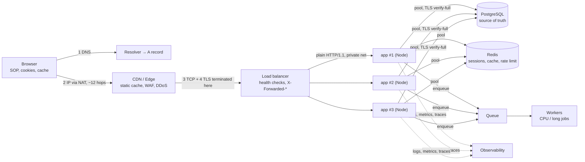
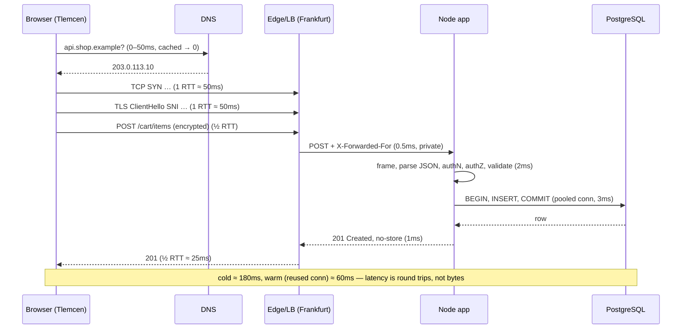
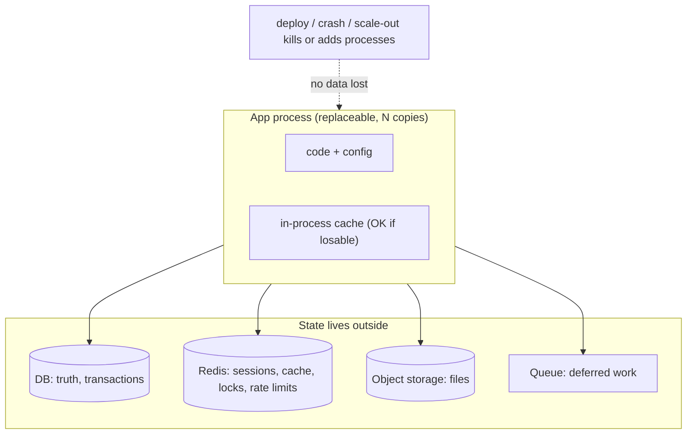

# Module 2.13 — معمارية تطبيق الويب من طرف إلى طرف
## Web Application Architecture end-to-end: one request through every layer you learned in Level 2

> **المستوى:** Level 2 | **الموقع:** [13 من 13]
> **السابق:** [M2.12 — HTTP](module-2.12-http.md) | **التالي:** [Project 3 — HTTP Server](../projects/project-3-http-server/README.md) ثم [Checkpoint 2](checkpoint-2.md)

---

## 1. المتطلبات
- [ ] **كل وحدات Level 2** — هذه الوحدة تربطها، لا تضيف مفاهيم جديدة كثيرة.
- [ ] خريطة Frontend/Backend/DB وTrust Boundary — [L0-M0.7](../level-0-absolute-foundations/module-07-database-api-web-app.md)

## 2. أهداف التعلّم
- تتبّع **طلب واحد** من ضغطة زر إلى صف في قاعدة البيانات والعودة، وتسمية **كل طبقة** وما قد يفشل فيها وأي وحدة تشرحها.
- تجميع **ميزانية زمن** (latency budget) لطلب: أين تذهب الـ 300ms فعلًا، وما الذي يمكن حذفه.
- رسم المعمارية القياسية الحديثة: متصفح → DNS → CDN/edge → TLS termination/موازن حمل → reverse proxy → عمليات التطبيق (N) → pool اتصالات → DB/كاش/طابور، ومكان **الحالة** في كل منها.
- التمييز بين **عديم الحالة** (stateless) و**ذو حالة** (stateful) ولماذا يُدفع بالحالة إلى الأطراف (DB/Redis) ليمكن تكرار خوادم التطبيق.
- اشتقاق **قائمة مراجعة إنتاج** للطبقات (مهلات في كل قفزة، keep-alive، حدود، إغلاق رشيق، مراقبة) من المبادئ لا من الحفظ.
- التعرف على **حدود الثقة** الكاملة في المسار ومن يرى ماذا (نص صريح vs مشفّر).

---

## 3. شرح للمبتدئ

### القصة: المستخدم يضغط "أضف إلى السلة"
نتتبّع `POST https://api.shop.example/cart/items` من حاسوب في تلمسان إلى خادم في فرانكفورت وقاعدة بيانات بجانبه. في كل خطوة: ما يحدث، ما قد يفشل، وأين تعلّمته.

**0. في المتصفح (قبل أي شبكة)**
JS يستدعي `fetch(url, {method:"POST", body: JSON.stringify(...)})`. المتصفح: يفحص **سياسة المصدر الواحد** → إن كان الأصل مختلفًا، **preflight OPTIONS** أولًا (M2.12). يرفق **الكوكيز** تلقائيًا (SameSite؟) ويضيف `Content-Length` **بالبايتات** (M2.1). يفحص كاش HTTP (POST لا يُخزَّن). يبحث عن **اتصال موجود** لنفس المضيف (keep-alive/HTTP2 pool) — إن وُجد، يقفز إلى الخطوة 5.
- يفشل: CORS، JS محجوب (حلقة أحداث المتصفح، M2.7)، أو المتصفح offline.

**1. DNS** (M2.10): `api.shop.example` → stub resolver → كاش OS → recursive resolver → … → `A 203.0.113.10` TTL 60. ~0–50ms (0 إن مخزّن).
- يفشل: `ENOTFOUND` (اسم خاطئ)، `EAI_AGAIN` (resolver معطّل)، IP قديم بعد هجرة.

**2. IP/التوجيه** (M2.8): الحزم تغادر عبر Wi-Fi → router (**NAT**: المصدر يصبح IP عام) → ISP → ~12 قفزة → مركز بيانات. RTT تلمسان↔فرانكفورت ≈ **45–60ms**. كل رحلة ذهاب وإياب تدفع هذا.
- يفشل: timeout (جدار ناري/مسار)، ضياع حزم (Wi-Fi سيئ → TCP يبطّئ).

**3. TCP** (M2.9): SYN/SYN-ACK/ACK = **1 RTT ≈ 50ms**. ثم slow start (أول رحلات محدودة الحجم).
- يفشل: `ECONNREFUSED` (لا مستمع)، `ETIMEDOUT` (رُمي)، backlog ممتلئ (خادم محجوب).

**4. TLS** (M2.11): ClientHello بـ **SNI** `api.shop.example` + ALPN `h2` → شهادة (Let's Encrypt، fullchain) → تحقق السلسلة/الاسم/التاريخ → **1 RTT ≈ 50ms** (0 مع resumption). من هنا كل شيء مشفّر؛ ISP يرى: IP الوجهة + SNI + الأحجام فقط.
- يفشل: شهادة منتهية/سلسلة ناقصة/اسم لا يطابق؛ ساعة الجهاز خاطئة.

**5. الحافة: CDN / WAF / موازن الحمل** — هنا **ينتهي TLS** غالبًا (M2.11). الـ edge: يصدّ هجمات DDoS، يفرض rate limits، يخدم الأصول الثابتة من الكاش (`Cache-Control: immutable`)، ويمرّر POST (غير قابل للكاش) إلى **موازن الحمل** الذي يختار واحدة من N عمليات تطبيق (round-robin / least-connections) بناءً على **health checks** (`/health` من M2.5). يضيف `X-Forwarded-For/Proto` (M2.11: ثق بها من هنا فقط). يتحدث مع الخلفية غالبًا بـ **HTTP/1.1 عادي** على شبكة خاصة (M2.8 CIDR خاص، security groups).
- يفشل: `502` (الخلفية رفضت)، `503` (لا نسخ صحية — كلها تُغلق أو محجوبة)، `504` (الخلفية تجاوزت مهلة الموازن — عادة 30–60s، **يجب أن تكون مهلاتك أقصر منها**).

**6. عملية التطبيق (Node)** — كل ما في M2.2–2.7:
- النواة تستقبل الحزم (**مقاطعة** → مخزن سوكت → **epoll** يعلّم fd جاهزًا، M2.4/2.7). libuv توقظ **حلقة الأحداث** في مرحلة poll.
- `node:http` **يؤطّر** الطلب من تيار TCP (M2.9/2.12): ترويسات حتى `\r\n\r\n`، ثم `Content-Length` بايتًا (مع **حد حجم** و**مهلة ترويسات**).
- middleware: يفكّ JSON (**بايتات UTF-8 → نص → كائن** M2.1؛ **يحجب الحلقة** بقدر حجمه M2.7)، يتحقق من الجلسة/التوكن (**authN**)، يتحقق أن المستخدم يملك هذه السلة (**authZ**)، يتحقق من المدخلات **(الواجهة غير موثوقة، L0-M0.7)**.
- منطق العمل: `cart.items.push(...)` — في **الكومة** (M2.3)، على **خيط JS واحد** (M2.6)، بلا data race لكن مع **logical race** عبر `await` (L1-M1.11) إن لم تحمِ القراءة-التعديل-الكتابة.
- يفشل: حلقة محجوبة (lag → كل الطلبات بطيئة)، OOM (V8 أو OOM killer، M2.3/2.4)، `EMFILE`، استثناء غير ملتقط → العملية تخرج → الموازن يرى health فاشلًا → ينقل الحركة؛ المنظّم يعيد التشغيل (M2.5). **لهذا N ≥ 2 دائمًا.**

**7. من التطبيق إلى قاعدة البيانات** — نفس الطبقات مرة أخرى، داخليًا:
DNS داخلي (`db.internal` → ClusterIP، M2.10) → TCP (1 RTT **محلي** ≈ 0.5ms — لكن **pool اتصالات** يلغيه ويحترم حد DB) → TLS (`verify-full`، M2.11) → بروتوكول PostgreSQL (ثنائي، length-prefix، M2.9) → **معاملة**: `SELECT … FOR UPDATE` / `INSERT` (L3 يشرح الداخل) → النتيجة. زمن الاستعلام 1–5ms إن كان **مفهرسًا** (L3)؛ القرص SSD 100µs لكل قراءة غير مخزّنة (M2.2).
- يفشل: pool مستنفد (طلبات تنتظر — "DB بطيئة" وهي ليست كذلك)، قفل/deadlock في DB، `ECONNRESET` عند إعادة تشغيل DB، `ETIMEDOUT` بعد تغيير security group.

**8. العودة**: `201 Created` + `Location` + جسم JSON (**بايتات**، `Content-Length` صحيح) + `Cache-Control: no-store` (بيانات مستخدم! M2.12) → TCP (قد يحتاج أكثر من حزمة؛ slow start) → الموازن (يضيف ترويسات، يضغط gzip) → TLS → NAT → المتصفح: يفكّ، يفحص `res.ok`، يحدّث الواجهة. **إجمالي**: DNS 0–50 + TCP 50 + TLS 50 + طلب/رد 50 + معالجة 10 = **~160–210ms** لطلب جسمه 200 بايت — **الرحلات لا البايتات** (M2.9). مع اتصال مُعاد الاستخدام: **~60ms**. مع خادم في الجزائر/المغرب: ~20ms. مع HTTP/3: رحلة أقل.

### المعمارية القياسية (وأين الحالة)
```
[Browser] → [DNS] → [CDN/Edge: static cache, WAF, TLS] → [Load balancer: health, routing, TLS term]
          → [Reverse proxy per host (nginx) اختياري] → [App × N (stateless!)]
          → [Connection pools] → [DB (الحقيقة)] [Redis (جلسات/كاش/rate limit)] [Queue → Workers (CPU/طويل)]
          → [Object storage (ملفات)] [Observability: logs/metrics/traces]
```
القاعدة المركزية: **خوادم التطبيق عديمة الحالة** — لا جلسات في الذاكرة، لا ملفات على القرص المحلي، لا كاش يُعتمد على صحته، لا عدّادات. لماذا؟ لأن: (1) الموازن قد يرسل الطلب التالي لنسخة أخرى؛ (2) النشر يقتل العملية (M2.5)؛ (3) `cluster` = N عمليات بلا ذاكرة مشتركة (M2.7). الحالة تذهب إلى: **DB** (مصدر الحقيقة، معاملات)، **Redis** (سريع، قابل للفقد: جلسات/كاش/قفل/rate limit)، **Object storage** (ملفات)، **Queue** (عمل مؤجَّل). ما لا يحتاج أن يكون حقيقة عالمية يمكن أن يبقى في العملية (كاش قوالب، إعدادات).

### حدود الثقة على طول المسار
| القطعة | من يتحكم | ما تثق به منها |
|---|---|---|
| المتصفح/العميل | المستخدم (أو المهاجم) | **لا شيء**: كل مدخل يُتحقق، كل سعر يُحسب في الخادم، authZ لكل مورد |
| الشبكة العامة | الجميع | لا شيء — TLS فقط يجعلها غير مهمة |
| الحافة/الموازن | أنت/مزوّدك | `X-Forwarded-*` **من IPs الموازن فقط** |
| الشبكة الخاصة | أنت | أكثر، لكن ليس كليًا: TLS للـ DB، مصادقة بين الخدمات (L7 mTLS) |
| التطبيق ↔ DB | أنت | استعلامات **مُعاملة** (parameterized) دائمًا — SQL injection لا يبالي بحدود الشبكة (L3/L5) |

### قائمة مراجعة الإنتاج المشتقة من Level 2
ليست للحفظ — كل بند يأتي من وحدة:
- **مهلة في كل قفزة**، وكل داخلية أقصر من الخارجية (عميل 10s > موازن 30s؟ لا: عميل 30s > موازن 25s > تطبيق 20s > DB 10s) [M2.9, M2.12, M2.5].
- **keep-alive + pools** للخارج (DB/Redis/APIs) [M2.9, M2.10].
- **حدود**: حجم جسم، عدد اتصالات، `ulimit -n`، حجم heap مقابل حد الحاوية [M2.3, M2.4, M2.12].
- **إغلاق رشيق** + `/health` و`/ready` + N ≥ 2 [M2.5].
- **لا حجب للحلقة**: JSON/regex/Sync/حساب → workers/طابور؛ راقب lag [M2.7, M2.6].
- **DNS TTL قصير للنقاط الحرجة**، لا كاش DNS أبدي [M2.10].
- **TLS**: fullchain، تجديد آلي، مراقبة انتهاء، `verify-full` داخليًا، لا `rejectUnauthorized:false` [M2.11].
- **HTTP**: دلالات صحيحة، `no-store` افتراضيًا، `Vary`، CORS بقائمة، Idempotency-Key على POST الحساسة [M2.12].
- **ترميز**: UTF-8 صريح في كل حد (DB، ترويسات، ملفات)، BigInt/نص للمعرّفات الكبيرة، سنتات للمال [M2.1].
- **مراقبة**: RSS/heap، fds، lag، p50/p99 لكل قفزة، أخطاء بالرمز، إعادة إرسال TCP [كلها؛ L6-M6].

---

## 4. النموذج الذهني

```
Browser(SOP/CORS/cookies) → DNS(cache/TTL) → IP/NAT/routing(RTT!) → TCP(1 RTT) → TLS(1 RTT, SNI) →
Edge/LB(TLS term, health, X-Forwarded-*) → App×N(epoll→loop→framing→parse→authN/authZ→logic) →
pool → DB/Redis/Queue → back (bytes, Content-Length, no-store)
الزمن = عدد الرحلات × RTT + معالجة؛ أعد استخدام الاتصالات؛ قرّب الخادم
App stateless؛ الحالة في DB (حقيقة) / Redis (سريع قابل للفقد) / storage / queue
ثقة: العميل 0 | الشبكة 0 (TLS) | الموازن: X-Forwarded من IPs معروفة | داخلي: TLS + استعلامات مُعاملة
كل قفزة: مهلة (الداخلي أقصر) + حد + مراقبة
```

## 5. الرسم التوضيحي







## 6. مثال بسيط

```bash
# قِس ميزانية الزمن بنفسك: curl يفصل كل مرحلة
curl -o /dev/null -s -w 'dns %{time_namelookup}s | tcp %{time_connect}s | tls %{time_appconnect}s | first byte %{time_starttransfer}s | total %{time_total}s | http %{http_version} | remote %{remote_ip}\n' https://www.cloudflare.com/
# كرّره مع keep-alive (طلبان على نفس الاتصال): الثاني بلا dns/tcp/tls
curl -o /dev/null -o /dev/null -s -w 'total %{time_total}s\n' https://www.cloudflare.com/ https://www.cloudflare.com/
# قارن خادمًا بعيدًا بقريب (RTT) — الرحلات تظهر مباشرة
ping -c 3 www.cloudflare.com | tail -1
```

## 7. مثال كود

```typescript
// src/trace-request.ts — عميل HTTP يقيس كل طبقة لطلب واحد (DNS/TCP/TLS/TTFB/total) باستخدام أحداث السوكت،
// ثم يثبت أثر إعادة استخدام الاتصال. نفس القياسات التي تضيفها لاحقًا إلى observability (L6-M6).
import https from "node:https";
import type { TLSSocket } from "node:tls";

type Timing = { dns?: number; tcp?: number; tls?: number; ttfb?: number; total?: number; reused: boolean; remote?: string; http?: string; alpn?: string | false | null };

function timedGet(url: string, agent: https.Agent): Promise<Timing> {
  return new Promise((resolve, reject) => {
    const t0 = performance.now(); const t: Timing = { reused: false };
    const req = https.get(url, { agent }, res => {
      t.ttfb = performance.now() - t0; t.http = res.httpVersion;
      res.resume(); res.on("end", () => { t.total = performance.now() - t0; resolve(t); });
    });
    req.on("socket", (s: TLSSocket) => {
      t.reused = !s.connecting && s.readyState === "open";                   // سوكت من pool الـ agent = لا DNS/TCP/TLS
      s.once("lookup", () => { t.dns = performance.now() - t0; });
      s.once("connect", () => { t.tcp = performance.now() - t0; t.remote = s.remoteAddress; });
      s.once("secureConnect", () => { t.tls = performance.now() - t0; t.alpn = s.alpnProtocol; });
    });
    req.setTimeout(10_000, () => req.destroy(new Error("timeout")));        // مهلة في كل قفزة — دائمًا
    req.on("error", reject);
  });
}

const fmt = (ms?: number) => ms === undefined ? "   —  " : `${ms.toFixed(0).padStart(4)}ms`;
const url = process.argv[2] ?? "https://www.cloudflare.com/";
const agent = new https.Agent({ keepAlive: true, maxSockets: 1 });

console.log(`GET ${url}\n      reused   dns     tcp     tls    ttfb   total   proto`);
for (let i = 1; i <= 3; i++) {
  const t = await timedGet(url, agent);
  console.log(`#${i}   ${String(t.reused).padEnd(6)} ${fmt(t.dns)} ${fmt(t.tcp)} ${fmt(t.tls)} ${fmt(t.ttfb)} ${fmt(t.total)}  HTTP/${t.http}${t.alpn ? " alpn=" + t.alpn : ""}  ${t.remote ?? ""}`);
}
agent.destroy();
console.log("\n#1 يدفع DNS+TCP+TLS (رحلتان+)؛ #2/#3 يعيدان الاتصال: الفرق هو ثمن الرحلات — وهو ما يوفّره pool/keep-alive في خادمك نحو DB وAPIs.");
```

## 8. مثال من العالم الحقيقي
- "لماذا الموقع أسرع في أوروبا منه في الجزائر؟": RTT. CDN للأصول الثابتة يحل جزءًا؛ API لا بد أن يكون قريبًا أو أن تقلّل الرحلات (HTTP/2، تجميع الطلبات، كاش).
- "عمل على staging، فشل في الإنتاج": staging بنسخة واحدة = جلسات في الذاكرة تعمل؛ الإنتاج N نسخ = تسجيل خروج عشوائي. **الحالة في الذاكرة** هي المتهم الأول.
- أثناء النشر ترى 502 لثوانٍ = لا إغلاق رشيق أو `/ready` لا يسبق إغلاق المنفذ (M2.5).
- فاتورة السحابة: Data transfer بين مناطق — تصميم بلا وعي بالطبقات = طلب يعبر المحيط 3 مرات.

## 9. مثال من الإنتاج
**حادثة "الموقع بطيء، كل المكونات سليمة":** p95 = 2.4s، بينما: DB p95 4ms، CPU التطبيق 15%، lag حلقة الأحداث 3ms، الموازن سليم. كل لوحة خضراء. التتبّع الموزّع (L6-M6) كشف أن طلبًا واحدًا من الواجهة = **14 استدعاء API متسلسلًا** (`await` واحدًا تلو الآخر، L1-M1.11) وكل استدعاء يفتح **اتصالًا جديدًا** (بلا keep-alive من الواجهة لأن `Connection: close` مضاف عن طريق الخطأ في proxy) = 14 × (TCP + TLS + طلب) × 55ms RTT ≈ 2.3s. "كل شيء سليم" لأن كل مكون قاس **نفسه**؛ لا أحد قاس **الرحلات**. الإصلاح: keep-alive (−2 رحلة لكل استدعاء)، HTTP/2 على الحافة (تعدد إرسال)، endpoint مجمّع (14 → 2)، `Promise.all` حيث لا ترابط. p95 → 180ms. **الدرس:** زمن الاستجابة ملك للمسار كاملًا، لا لمكوّن؛ عدّ الرحلات.

## 10. مفاهيم خاطئة شائعة

| ❌ | ✅ |
|---|---|
| "خادم أسرع = موقع أسرع" | إن كان الزمن رحلات شبكة، معالج أسرع لا يغيّر شيئًا. قِس أين يذهب الزمن. |
| "الشبكة الخاصة = موثوقة" | أقل عداءً؛ ليست موثوقة. TLS للـ DB، مصادقة بين الخدمات، استعلامات مُعاملة. |
| "تكرار الخادم ×2 = ضعف السعة" | فقط إن كان عديم الحالة وكان الاختناق فيه لا في DB/قفل مشترك. |
| "CDN يسرّع API" | يسرّع ما يُخزَّن (GET عام) وينهي TLS أقرب للمستخدم؛ POST يمرّ إلى الأصل كاملًا. |
| "موازن الحمل يحميني من انهيار نسخة" | فقط مع health checks صادقة + إغلاق رشيق + N ≥ 2 + عدم وجود حالة في الذاكرة. |
| "p50 ممتاز = الأداء ممتاز" | p99 هو ما يراه 1 من 100 طلب — وكل مستخدم يرسل عشرات الطلبات، فمعظمهم يرى p99 أحيانًا. |

## 11. أخطاء شائعة
1. مهلة التطبيق أطول من مهلة الموازن → 504 للعميل بينما التطبيق يكمل العمل (ويكرره العميل!).
2. حالة في ذاكرة العملية (جلسات، كاش يُعتمد عليه، عدّادات rate limit) مع N > 1.
3. 14 طلبًا متسلسلًا من الواجهة حيث يكفي 1–2.
4. `Connection: close` أو agent بلا keep-alive نحو خدمات داخلية.
5. استدعاء DB/خدمات في حلقة بدل دفعة.
6. حد pool أكبر من حد DB (× N نسخ!) → DB ترفض اتصالات.
7. الثقة بـ `X-Forwarded-For` من أي مصدر → تجاوز rate limit وتزوير سجلات.

## 12. تمرين تصحيح

```
# بعد ترقية من نسخة واحدة إلى 3 نسخ خلف موازن:
# (1) المستخدمون "يُسجَّل خروجهم عشوائيًا".
# (2) ملفات رفعها المستخدم "تختفي" أحيانًا (404 على /uploads/x.png في طلب تالٍ).
# (3) حد المعدل 100/دقيقة صار عمليًا 300/دقيقة.
# (4) أثناء كل نشر: ~40 خطأ 502 في السجلات.
# (5) السجلات تُظهر أن كل الطلبات من IP 10.0.1.5 (IP الموازن).
```
سبب واحد مشترك لأربعة منها، وآخر مستقل. اشرح واقترح الإصلاح لكل بند.

<details><summary>💡 الحل</summary>

- **السبب المشترك (1,2,3)**: **حالة في العملية/القرص المحلي** — كانت غير مرئية بنسخة واحدة. (1) الجلسات في `Map` بالذاكرة → الطلب يذهب لنسخة أخرى لا تعرف الجلسة → Redis للجلسات (أو JWT بحذر، L5-M2). (2) الملفات على القرص المحلي للنسخة التي استقبلت الرفع → Object storage (S3-متوافق) + URL ثابت. (3) عدّاد rate limit في ذاكرة كل نسخة → 3 عدّادات مستقلة → Redis بـ `INCR` + TTL (L5-M8). (الحل المؤقت الشائع "sticky sessions" يخفي المشكلة ويكسر التوزيع والنشر — ارفضه إلا كجسر قصير.)
- **(4) 502 عند النشر**: لا إغلاق رشيق / لا `/ready` يُفشَل قبل إغلاق المنفذ / الموازن يرسل طلبات لنسخة تُغلق [M2.5]. الإصلاح: وصفة الإغلاق الست + فترة سماح أطول من فحص الصحة + rolling deploy واحدة تلو الأخرى.
- **(5) IP الموازن في السجلات**: التطبيق يقرأ `socket.remoteAddress`؛ يجب قراءة `X-Forwarded-For` **لكن فقط عندما يأتي الطلب من IPs الموازن** (`trust proxy` بقائمة) [M2.11]. وهذا يفسّر أيضًا لماذا rate limit حسب IP كان يحسب الجميع كمستخدم واحد — أو العكس حسب الإعداد.
- التحقق بعد الإصلاح: اختبار بـ 3 نسخ محليًا (Compose) قبل الإنتاج؛ قتل نسخة أثناء حمل والتأكد من صفر أخطاء.
</details>

## 13. تمرين معماري
صمّم، بالاعتماد على Level 2 فقط، معمارية لمتجر إلكتروني يخدم 50k مستخدم/يوم في شمال إفريقيا وأوروبا، مع رفع صور المنتجات وتوليد فواتير PDF: أين تضع كل مكوّن (منطقة؟ CDN؟)، كم نسخة تطبيق ولماذا، أين كل نوع حالة، ما سلسلة المهلات من المتصفح إلى DB بالأرقام، ما ميزانية الزمن المستهدفة لطلب "أضف إلى السلة" من تلمسان (احسب الرحلات)، كيف تنشر بلا توقف، ما أول 8 مقاييس تراقبها. اكتب ACTRR بافتراضات صريحة. (ستعيد هذا التمرين في L5 وL7 بأدوات أكثر — احتفظ بإجابتك لتقارن.)

## 14. الصلة بعصر AI
AI يرسم معماريات "قياسية" ممتازة الشكل، لكنه لا يعرف **أرقامك**: RTT مستخدميك، حدود DB، مهلة موازنك، حجم أجسامك. أعطه القياسات (`curl -w`, `trace-request.ts`, مخرجات lag/fds) واطلب منه **حساب ميزانية الزمن وسلسلة المهلات** صراحةً، ثم تحقق من كل رقم. وفي كل تصميم مولَّد اسأل الأسئلة الخمسة: أين الحالة؟ ما المهلة في كل قفزة؟ ماذا يحدث عند قتل نسخة؟ كم رحلة شبكة لطلب المستخدم الأشيع؟ من يثق بـ `X-Forwarded-*`؟

## 15–17. Master / Understand / Defer
- 🔴 تتبّع الطلب عبر الطبقات الثماني وتسمية ما يفشل في كل منها؛ **الزمن = رحلات × RTT**؛ المعمارية القياسية؛ **عديم الحالة** وأين تذهب كل حالة؛ حدود الثقة على المسار؛ قائمة المراجعة المشتقة (مهلات متناقصة، pools، حدود، إغلاق رشيق، lag، TLS، كاش آمن).
- 🟠 ميزانية الزمن بالأرقام وقياسها بـ `curl -w`/أحداث السوكت؛ دور CDN/WAF/الموازن؛ `trust proxy`؛ سبب 502/503/504؛ sticky sessions ولماذا تُرفض؛ تجميع الطلبات وHTTP/2.
- ⚪ التفاصيل الداخلية لموازنات الحمل (L4 vs L7)، service mesh، multi-region active-active، edge computing، تفاصيل التتبّع الموزّع (L6/L7).

## 18. الخلاصة
1. طلب واحد يعبر: المتصفح → DNS → IP/NAT → TCP → TLS → الحافة/الموازن → عملية التطبيق (epoll → حلقة → تأطير → تحليل → ثقة) → pool → DB → والعودة. كل طبقة لها أعطالها ووحدتها.
2. **الزمن رحلات لا بايتات**: اتصال بارد = 3–4 RTT قبل أول بايت؛ أعد الاستخدام، قرّب، جمّع، وازِ.
3. خوادم التطبيق **عديمة الحالة**؛ الحالة في DB/Redis/storage/queue — هذا ما يجعل التكرار والنشر والانهيار آمنين.
4. الثقة تتدرج: العميل صفر، الشبكة صفر (TLS)، الموازن لترويساته فقط، الداخلي محدود.
5. مهلة في كل قفزة والداخلية أقصر؛ حدود في كل مورد؛ إغلاق رشيق؛ راقب lag/fds/الذاكرة/p99 لكل قفزة.
6. **أنت الآن تفهم ما يحدث تحت `fetch`** — من المقاطعة إلى الرد. Project 3 يجعلك تبنيه بيديك.

## 19. مراجع رسمية
- MDN — Populating the page: how browsers work: https://developer.mozilla.org/en-US/docs/Web/Performance/Guides/How_browsers_work
- High Performance Browser Networking — Primer on Latency and Bandwidth: https://hpbn.co/primer-on-latency-and-bandwidth/
- The Twelve-Factor App — Processes (stateless), Port binding, Disposability: https://12factor.net/
- Node.js — `http.Agent` (keep-alive pooling): https://nodejs.org/api/http.html#class-httpagent
- Express — Behind proxies (`trust proxy`): https://expressjs.com/en/guide/behind-proxies.html
- Google SRE Book — Load Balancing at the Frontend: https://sre.google/sre-book/load-balancing-frontend/
- curl — `--write-out` variables: https://curl.se/docs/manpage.html#-w

## المصطلحات
| العربية | English |
|---|---|
| من طرف إلى طرف | End-to-end |
| ميزانية الزمن | Latency budget |
| زمن أول بايت | TTFB (Time To First Byte) |
| الحافة / شبكة توصيل المحتوى | Edge / CDN |
| جدار حماية تطبيقات الويب | WAF |
| موازن الحمل | Load balancer |
| وكيل عكسي | Reverse proxy |
| عديم الحالة / ذو حالة | Stateless / Stateful |
| الجلسات الملتصقة | Sticky sessions |
| مجمّع اتصالات | Connection pool |
| تخزين الكائنات | Object storage |
| نشر متدرّج / بلا توقف | Rolling / Zero-downtime deploy |
| سلسلة المهلات | Timeout chain |
| حد الثقة | Trust boundary |
| الوكيل الموثوق | Trusted proxy |
| التتبّع الموزّع | Distributed tracing |

> **التالي:** [Project 3 — HTTP Server from raw TCP](../projects/project-3-http-server/README.md) ثم [Checkpoint 2](checkpoint-2.md)
