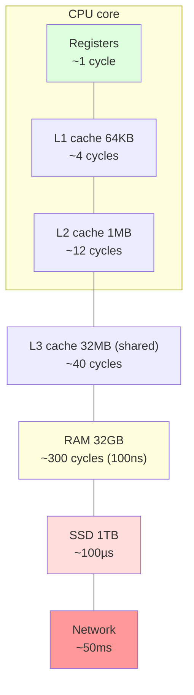
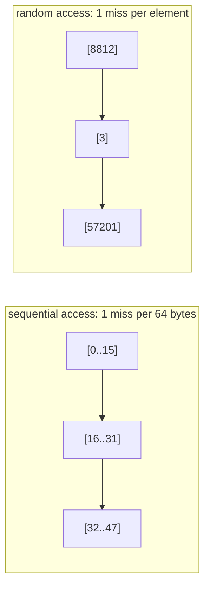
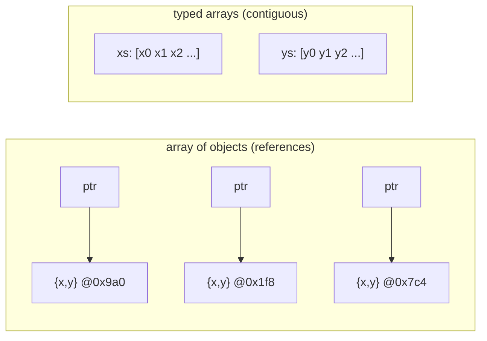

# Module 2.2 — المعالج، السجلات، التعليمات، الكاش، الذاكرة، التخزين
## CPU, Registers, Instructions, Cache, RAM, Storage — the Memory Hierarchy

> **المستوى:** Level 2 | **الموقع:** [2 من 13]
> **السابق:** [M2.1 — Bits & Bytes](module-2.1-bits-bytes-encoding.md) | **التالي:** [M2.3 — Memory: Stack, Heap, GC](module-2.3-memory-stack-heap-gc.md)

---

## 1. المتطلبات
- [ ] CPU/RAM/Storage ودورهم، وجدول الكمون الأولي — [L0-M0.1](../level-0-absolute-foundations/module-01-what-is-a-computer.md)
- [ ] الكود المصدري → machine code، JIT — [L0-M0.2](../level-0-absolute-foundations/module-02-programs-and-code.md)
- [ ] البتات والبايتات — [M2.1](module-2.1-bits-bytes-encoding.md)
- [ ] الحلقات المتداخلة وتكلفتها — [L1-M1.3](../level-1-programming/module-1.3-loops.md)

## 2. أهداف التعلّم
- وصف **دورة التعليمة** (fetch → decode → execute) و**السجلات** و**عدّاد البرنامج**.
- رسم **التسلسل الهرمي للذاكرة** (registers → L1/L2/L3 cache → RAM → SSD → network) بأرقام تقريبية.
- شرح **المحلية** (locality) الزمانية والمكانية، و**خطوط الكاش**، ولماذا ترتيب الوصول للبيانات يغيّر السرعة 10×.
- التمييز بين CPU-bound وmemory-bound وI/O-bound وقياس الفرق في Node.
- فهم ما يعنيه "النواة" (core)، و"الساعة" (clock)، و**لماذا لم تعد المعالجات تتسارع** بل تتكاثر (تمهيد الخيوط M2.6).
- ربط هذا كله بقرارات برمجية: هياكل البيانات (L3)، الفهارس (L3-M13)، الكاش (L5-M8).

---

## 3. شرح للمبتدئ

### ماذا يفعل المعالج فعلًا؟
المعالج آلة بسيطة بشكل مخادع تكرر إلى الأبد:
1. **Fetch:** اجلب التعليمة التالية من الذاكرة (عنوانها في **عدّاد البرنامج** PC/IP).
2. **Decode:** افهم ما هي (جمع؟ نسخ؟ قفز؟).
3. **Execute:** نفّذها على **السجلات** (registers) — خانات تخزين صغيرة جدًا (64 بت) داخل المعالج، بضع عشرات منها، أسرع شيء في الحاسوب.
4. زِد PC وارجع إلى 1 (أو اقفز إن كانت التعليمة قفزًا = هذا هو `if` و`for` بعد الترجمة).

```
;  x = a + b   (بعد الترجمة إلى تعليمات تقريبية)
LOAD  R1, [addr_a]     ; اجلب a من الذاكرة إلى السجل R1
LOAD  R2, [addr_b]
ADD   R3, R1, R2       ; R3 = R1 + R2        ← هذا سريع جدًا
STORE [addr_x], R3     ; اكتب النتيجة
```
مليارات من هذه في الثانية (3 GHz = 3 مليار دورة ساعة/ثانية). `ADD` يستغرق دورة واحدة تقريبًا. **`LOAD` من RAM يستغرق ~300 دورة.** هنا القصة كلها.

### المشكلة: المعالج أسرع من الذاكرة بـ 100×
المعالج ينتظر الذاكرة معظم الوقت ما لم نفعل شيئًا. الحل: **الكاش** (cache) — ذاكرة صغيرة وسريعة جدًا **داخل** المعالج تحتفظ بنسخ مما استُخدم مؤخرًا.

| المستوى | الحجم التقريبي | الكمون التقريبي | تشبيه |
|---|---|---|---|
| Registers | بضع مئات بايت | <1 ns (دورة) | ما في يدك |
| L1 cache | 32–64 KB لكل نواة | ~1 ns (4 دورات) | على مكتبك |
| L2 cache | 256 KB–2 MB لكل نواة | ~4 ns | رف خلفك |
| L3 cache | 8–64 MB مشترك | ~10–20 ns | خزانة في الغرفة |
| **RAM** | 8–128 GB | **~100 ns** | مكتبة في المبنى المجاور |
| SSD (NVMe) | TB | ~20–100 µs (= 20,000–100,000 ns) | مستودع في مدينة أخرى |
| HDD | TB | ~5–10 ms | ... بالبريد |
| شبكة محلية / إنترنت | — | 0.5 ms / 50–150 ms | قارة أخرى |

لو كانت دورة الساعة ثانية واحدة: L1 = 4 ثوانٍ، RAM = 5 دقائق، SSD = يوم كامل، HDD = شهور، طلب إنترنت = **سنوات**. هذا الجدول هو **أهم جدول في هذا الكورس** — يفسّر async (L1-M1.11)، الفهارس، الكاش، وتصميم كل نظام كبير.

### كيف يعمل الكاش؟ المحلية (Locality)
الكاش لا يعرف المستقبل؛ يراهن على نمطين يتكرران في كل البرامج:
- **محلية زمانية** (temporal): ما استُخدم الآن سيُستخدم قريبًا مجددًا (متغير الحلقة، `this.config`).
- **محلية مكانية** (spatial): ما بجوار ما استُخدم سيُستخدم قريبًا (العنصر التالي في المصفوفة).

لذلك عندما يجلب المعالج بايتًا من RAM، يجلب **خط كاش** كاملًا (64 بايت متجاورة). إن مررت على مصفوفة بالترتيب: جلبة واحدة لكل 64 بايت = 16 عددًا صحيحًا 32-بت "مجانًا". إن قفزت عشوائيًا: جلبة لكل عنصر = **أبطأ 10–50×** لنفس عدد العمليات.

**Cache hit** = وجدناه في الكاش. **Cache miss** = اذهب إلى المستوى التالي وانتظر. برنامجان بنفس عدد التعليمات قد يختلفان 20× بسبب نسبة الـ misses.

### لماذا يهمك هذا وأنت تكتب TypeScript؟
1. **مصفوفة من أرقام** (`number[]` متجانسة أو `Float64Array`) متجاورة في الذاكرة → سريعة. **مصفوفة من كائنات** = مصفوفة من **مراجع** (L1-M1.6) إلى أماكن متفرقة في heap → كل عنصر cache miss محتمل. لهذا "struct of arrays" أسرع من "array of structs" في الحلقات الساخنة.
2. **الوصول المتسلسل > العشوائي** على كل مستوى: الكاش، RAM، القرص (lowering "random reads" هو جوهر تصميم قواعد البيانات — L3-M10/13).
3. **بيانات العمل الصغيرة** (working set) التي تدخل في L2/L3 = أسرع بمراحل من نفس الخوارزمية على بيانات أكبر من الكاش. "لماذا أصبح بطيئًا فجأة عند 10× البيانات؟" — سقط من الكاش.
4. **Big-O** (L3-M8) تخبرك بالاتجاه؛ **التسلسل الهرمي** يخبرك بالثوابت. خوارزمية O(n) تقفز عشوائيًا قد تخسر أمام O(n log n) متسلسلة.

### أنواع الاختناق (Bottleneck)
| | يقضي الوقت في | تسريعه | مثال |
|---|---|---|---|
| **CPU-bound** | حساب في السجلات/L1 | خوارزمية أفضل، نوى أكثر (M2.6) | hashing، ضغط، JSON.parse ضخم |
| **Memory-bound** | انتظار RAM (misses) | محلية أفضل، بيانات أصغر/متجاورة | المرور على ملايين الكائنات |
| **I/O-bound** | انتظار قرص/شبكة | async، تزامن، كاش، دفعات | خادم ويب، DB، `fetch` |

معظم خوادم الويب I/O-bound (لهذا Node نموذج معقول). معظم "الكود البطيء" في معالجة البيانات memory-bound لا CPU-bound — والمبرمجون يحسّنون الحساب ويتجاهلون الوصول للذاكرة.

### النوى والساعة: لماذا توقفت السرعة
حتى ~2005 تضاعفت سرعة الساعة كل سنتين. ثم اصطدمنا بجدار **الحرارة والطاقة**: 4 GHz تقريبًا هو السقف العملي. الحل: **نوى متعددة** (multi-core) — 4، 8، 64 معالجًا مستقلًا على شريحة واحدة، كلٌّ بسجلاته وL1/L2 خاصين، ويتشاركون L3 وRAM. النتيجة الكبرى على البرمجة: **البرنامج أحادي الخيط لا يستفيد من 7 نوى من 8.** للاستفادة: خيوط/عمليات متعددة (M2.6/2.7) — ومعها مشاكل الذاكرة المشتركة.

تفاصيل أعمق (pipelining، التنفيذ خارج الترتيب، التنبؤ بالقفزات branch prediction، SIMD) موجودة وتُحدث فرقًا 2–10× في الكود الساخن، لكنها ⚪ الآن. اعرف فقط: المعالج **يخمّن** اتجاه `if` قبل معرفة النتيجة، والتخمين الخاطئ يكلّف ~15 دورة — لذلك البيانات **المرتّبة** قد تجعل نفس الحلقة أسرع بشكل مدهش.

---

## 4. النموذج الذهني

```
CPU: fetch → decode → execute (على السجلات)   ×  مليارات/ثانية
                 ↑ لكن LOAD من RAM ≈ 300 دورة انتظار

Registers (1) → L1 (4) → L2 (12) → L3 (40) → RAM (300) → SSD (100,000) → Network (100,000,000)   [دورات تقريبًا]

Cache يراهن على المحلية: زمانية (أعد استخدامه) + مكانية (الجار التالي) → خطوط 64 بايت
متسلسل > عشوائي      متجاور > مبعثر      صغير يدخل الكاش > كبير يسقط منه

Bottleneck: CPU-bound / memory-bound / I/O-bound → العلاج مختلف لكل منها
نوى كثيرة ≠ برنامجك أسرع تلقائيًا
```

## 5. الرسم التوضيحي







## 6. مثال بسيط

```typescript
// نفس عدد العمليات، ترتيب وصول مختلف — قِس الفرق بنفسك
const N = 1 << 24;                                  // 16M عنصر × 4 بايت = 64MB (أكبر من L3)
const data = new Int32Array(N).fill(1);
const idx = Int32Array.from({ length: N }, (_, i) => i);
const rnd = idx.slice().sort(() => Math.random() - 0.5);   // تبديل عشوائي (بطيء لكنه خارج القياس)

function sum(order: Int32Array) { let s = 0; for (let i = 0; i < order.length; i++) s += data[order[i]!]!; return s; }

console.time("sequential"); sum(idx); console.timeEnd("sequential");   // ~15 ms
console.time("random");     sum(rnd); console.timeEnd("random");       // ~150–400 ms  ← نفس العمل!
```

## 7. مثال كود

```typescript
// src/locality.ts — ثلاث تجارب تربط النظرية بالكود اليومي
const N = 2_000_000;

// تجربة 1: array of objects vs struct of arrays
type P = { x: number; y: number };
const aos: P[] = Array.from({ length: N }, (_, i) => ({ x: i, y: i * 2 }));
const xs = new Float64Array(N), ys = new Float64Array(N);
for (let i = 0; i < N; i++) { xs[i] = i; ys[i] = i * 2; }

function bench(label: string, f: () => number) {
  f();                                              // تسخين JIT (L0-M0.2) — القياس الأول دائمًا مضلّل
  const t = performance.now(); const r = f(); const ms = performance.now() - t;
  console.log(`${label.padEnd(28)} ${ms.toFixed(1).padStart(7)} ms  (result ${r})`);
}
bench("AoS: sum x+y", () => { let s = 0; for (const p of aos) s += p.x + p.y; return s; });
bench("SoA: sum x+y", () => { let s = 0; for (let i = 0; i < N; i++) s += xs[i]! + ys[i]!; return s; });

// تجربة 2: مصفوفة ثنائية — صفوف أولًا vs أعمدة أولًا (نفس عدد الجمع بالضبط)
const R = 4096, C = 4096;
const grid = new Int32Array(R * C).fill(1);
bench("row-major (friendly)", () => { let s = 0; for (let r = 0; r < R; r++) for (let c = 0; c < C; c++) s += grid[r * C + c]!; return s; });
bench("column-major (hostile)", () => { let s = 0; for (let c = 0; c < C; c++) for (let r = 0; r < R; r++) s += grid[r * C + c]!; return s; });

// تجربة 3: التنبؤ بالقفزات — بيانات مرتّبة vs عشوائية بنفس المحتوى
const vals = Int32Array.from({ length: N }, () => (Math.random() * 256) | 0);
const sorted = vals.slice().sort();
const cond = (a: Int32Array) => { let s = 0; for (let i = 0; i < a.length; i++) if (a[i]! >= 128) s += a[i]!; return s; };
bench("branch: random data", () => cond(vals));
bench("branch: sorted data", () => cond(sorted));
```
النتائج النموذجية على جهاز حديث: SoA أسرع 2–4×، row-major أسرع 5–15×، المرتّب أسرع 2–5× — **بدون تغيير سطر منطق واحد**. لا تحفظ الأرقام؛ احفظ الفكرة: **الوصول للذاكرة يحكم الأداء أكثر من عدد العمليات.**

## 8. مثال من العالم الحقيقي
- قواعد البيانات تخزّن الصفوف في صفحات 8KB وتقرأها كاملة، وتبني B-trees لتقليل القفزات العشوائية على القرص (L3-M13) — نفس منطق خط الكاش على مستوى أعلى.
- محركات الألعاب تصمّم "Entity Component Systems" بـ SoA لأن 60 إطارًا/ثانية لا تتسامح مع cache misses.
- Redis يحتفظ بكل شيء في RAM لأن 100ns ≫ 100µs: "الكاش" على مستوى النظام = نفس الفكرة.

## 9. مثال من الإنتاج
**حادثة "التقرير الذي أصبح أبطأ 40× بعد تغيير بريء":** مهمة تجميع كانت تمرّ على مصفوفة أرقام متجاورة. مطوّر "حسّنها" بتحويل كل سجل إلى كائن `{id, amount, meta}` لقابلية القراءة، مع إضافة حقل `meta` كبير. الآن كل سجل في مكان مختلف من heap، وحجم بيانات العمل تضاعف 8× وسقط من L3. نفس Big-O، نفس عدد العمليات، 40× أبطأ. **الإصلاح:** إبقاء الحقول الساخنة (`amount`) في `Float64Array` منفصلة، والـ `meta` خارج المسار الساخن. **الدرس:** "قابلية القراءة" و"محلية الذاكرة" قرار تبادلي — قِسه في المسارات الساخنة فقط، لا في كل مكان.

## 10. مفاهيم خاطئة شائعة

| ❌ | ✅ |
|---|---|
| "GHz أعلى = أسرع" | الاختناق غالبًا الذاكرة لا الحساب؛ الكاش والذاكرة أهم للكثير من الأحمال. |
| "RAM سريعة" | سريعة مقارنة بالقرص؛ **بطيئة 100×** مقارنة بالمعالج. |
| "8 نوى = برنامجي أسرع 8×" | فقط إن كان متعدد الخيوط ومتوازيًا فعلًا (M2.6/2.7). |
| "Big-O يكفي للتنبؤ بالسرعة" | يتنبأ بالاتجاه؛ الثوابت (المحلية) قد تقلب الترتيب لأحجام واقعية. |
| "التحسين الدقيق مهم في كل مكان" | في المسارات الساخنة فقط؛ قِس أولًا (M1.12). |

## 11. أخطاء شائعة
1. تحسين الحساب بينما الاختناق I/O (النتيجة: صفر).
2. قياس بلا تسخين JIT، أو قياس مرة واحدة.
3. مصفوفات كائنات ضخمة في حلقات ساخنة بينما typed arrays تكفي.
4. المرور على بيانات ثنائية الأبعاد بالاتجاه الخاطئ.
5. الظن أن "الكاش" = شيء تضيفه (Redis) وليس شيئًا موجودًا أصلًا في كل مستوى.

## 12. تمرين تصحيح

```typescript
// "دالة التشابه" بطيئة جدًا: 10,000 مستخدم × 10,000 = 100M مقارنة تستغرق 90 ثانية. CPU عند 100%.
type User = { id: string; vector: number[] /* 128 عددًا */ };
function similarity(a: User, b: User) { let s = 0; for (let i = 0; i < 128; i++) s += a.vector[i]! * b.vector[i]!; return s; }
function allPairs(users: User[]) {
  const out: number[] = [];
  for (const a of users) for (const b of users) out.push(similarity(a, b));
  return out;
}
```
المطوّر يقول "CPU 100% إذًا CPU-bound، سأشتري معالجًا أسرع". ما رأيك؟ ما التجارب التي تجريها قبل أي قرار؟

<details><summary>💡 الحل</summary>

CPU 100% **لا يعني** CPU-bound — المعالج "مشغول" أيضًا وهو ينتظر الذاكرة (الانتظار يُحتسب نشاطًا). الأدلة المشبوهة: `vector: number[]` داخل كائن داخل مصفوفة = ثلاث قفزات مؤشرات لكل متجه؛ 10,000 × 128 × 8 بايت = 10MB من المتجهات مبعثرة في heap؛ الحلقة الداخلية تمرّ على **كل** المستخدمين لكل مستخدم فتطرد الكاش باستمرار.

التجارب (غيّر شيئًا واحدًا كل مرة، M1.12): (1) انسخ كل المتجهات إلى `Float64Array(10000 × 128)` واحدة متجاورة وقِس — إن تحسّن 5–10× فالاختناق كان الذاكرة. (2) **التجزئة** (tiling/blocking): قارن كتلة من 256 مستخدمًا مع كتلة من 256 حتى تبقى الكتلتان في L2. (3) `out.push` لـ 100M عدد = 800MB وتوسيع مصفوفة متكرر — خصّص `Float64Array(N*N)` مسبقًا أو لا تخزّن الكل. (4) **خوارزميًا**: التشابه متماثل (`sim(a,b) = sim(b,a)`) → نصف العمل مجانًا؛ وربما لا تحتاج كل الأزواج أصلًا (L3). (5) أخيرًا، النوى: قسّم الكتل على worker threads (M2.6). شراء معالج أسرع يعطي 1.2×؛ ما سبق يعطي 50×.
</details>

## 13. تمرين معماري
خدمة تحسب "المنتجات المشابهة" لـ 5M منتج ليلًا. اكتب ACTRR يجيب: هل الحمل CPU/memory/I/O-bound ولماذا؟ كيف تقيس ذلك على عينة قبل بناء أي شيء؟ ما تخطيط البيانات (layout) الذي تختاره للمسار الساخن؟ متى تنتقل من "نواة واحدة بتخطيط جيد" إلى "عدة نوى" إلى "عدة آلات"، وما تكلفة كل انتقال؟

## 14. الصلة بعصر AI
AI يكتب الحلقات بالاتجاه الطبيعي للكود لا للذاكرة، ويقترح "استخدم worker threads" قبل أن يسأل عن تخطيط البيانات. اطلب منه **تحليل الاختناق أولًا**: *"هل هذا CPU أم memory أم I/O-bound؟ ما بيانات العمل وهل تدخل في الكاش؟"* ثم قِس بنفسك — أرقام الـ AI عن الأداء تخمينات حتى تُقاس.

## 15–17. Master / Understand / Defer
- 🔴 دورة التعليمة والسجلات؛ **جدول التسلسل الهرمي بأرقامه التقريبية**؛ المحلية الزمانية/المكانية وخطوط الكاش؛ متسلسل > عشوائي؛ CPU/memory/I/O-bound والفرق في العلاج؛ نوى كثيرة ≠ أسرع تلقائيًا.
- 🟠 AoS vs SoA وtyped arrays؛ row-major؛ التنبؤ بالقفزات؛ كيف تقيس (تسخين، تكرار)؛ لماذا توقفت الساعة عند ~4GHz.
- ⚪ pipelining، out-of-order، SIMD، NUMA، تفاصيل سياسات الكاش، prefetching؛ assembly الحقيقي.

## 18. الخلاصة
1. المعالج يكرر fetch/decode/execute على السجلات؛ **الذاكرة أبطأ منه 100×**.
2. الكاش يسدّ الفجوة بالرهان على **المحلية**؛ خط الكاش 64 بايت.
3. **ترتيب الوصول للبيانات يحكم الأداء** أكثر من عدد العمليات: متسلسل > عشوائي، متجاور > مبعثر، صغير > كبير.
4. حدّد نوع الاختناق قبل العلاج: CPU/memory/I/O.
5. النوى تكاثرت لأن الساعة توقفت؛ الاستفادة منها تحتاج تصميمًا (M2.6/2.7).
6. هذا الجدول سيعود في الفهارس والكاش وتصميم الأنظمة — احفظه.

## 19. مراجع رسمية
- "Latency Numbers Every Programmer Should Know" (Jeff Dean / Peter Norvig): https://colin-scott.github.io/personal_website/research/interactive_latency.html
- Ulrich Drepper — "What Every Programmer Should Know About Memory": https://people.freebsd.org/~lstewart/articles/cpumemory.pdf
- MDN — Typed arrays: https://developer.mozilla.org/en-US/docs/Web/JavaScript/Guide/Typed_arrays
- Node.js — `performance.now()`: https://nodejs.org/api/perf_hooks.html

## المصطلحات
| العربية | English |
|---|---|
| دورة التعليمة | Instruction cycle (fetch/decode/execute) |
| سجل | Register |
| عدّاد البرنامج | Program counter |
| ذاكرة مخبّئة (كاش) | Cache |
| خط الكاش | Cache line |
| إصابة / إخفاق الكاش | Cache hit / miss |
| محلية زمانية / مكانية | Temporal / Spatial locality |
| التسلسل الهرمي للذاكرة | Memory hierarchy |
| كمون / إنتاجية | Latency / Throughput |
| اختناق | Bottleneck |
| مرتبط بالمعالج / الذاكرة / الإدخال-الإخراج | CPU-bound / Memory-bound / I/O-bound |
| نواة | Core |
| تردد الساعة | Clock rate |
| التنبؤ بالقفزات | Branch prediction |
| بيانات العمل | Working set |
| مصفوفة مكتوبة النوع | Typed array |

> **التالي:** [Module 2.3 — Memory: Stack, Heap, References, GC, Leaks](module-2.3-memory-stack-heap-gc.md)
