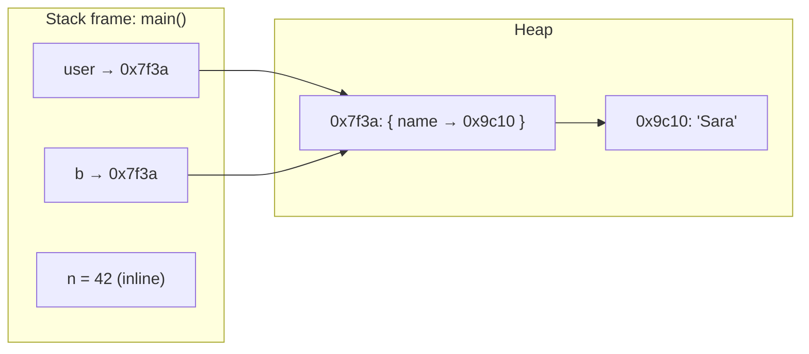
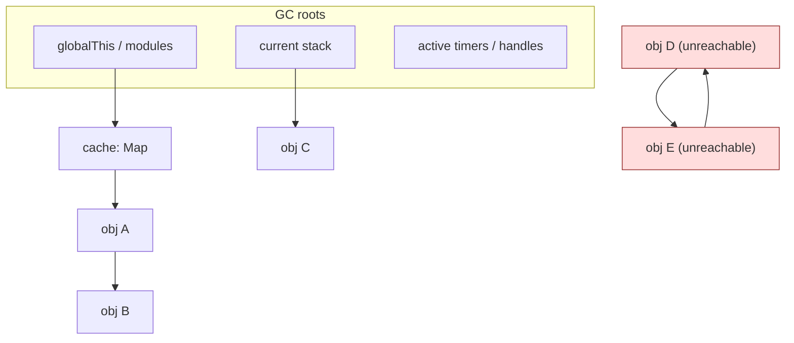
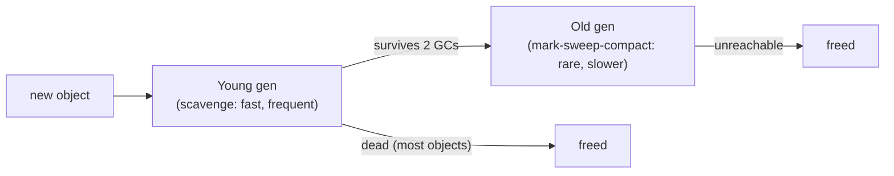
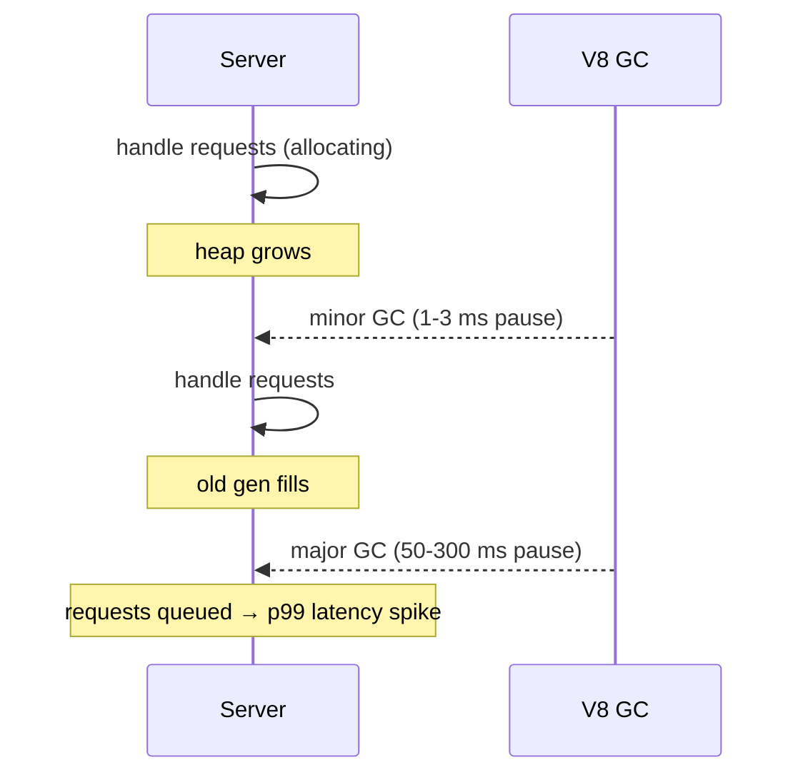

# Module 2.3 — الذاكرة: المكدس، الكومة، المراجع، جامع القمامة، التسريبات
## Memory: Stack, Heap, References, Allocation, Garbage Collection, Leaks

> **المستوى:** Level 2 | **الموقع:** [3 من 13]
> **السابق:** [M2.2 — CPU, Cache, RAM](module-2.2-cpu-cache-ram.md) | **التالي:** [M2.4 — Operating Systems](module-2.4-operating-systems.md)

---

## 1. المتطلبات
> **قبل أن تتعلم هذا، يجب أن تفهم:**
- [ ] مكدس الاستدعاء والإطارات والإغلاقات — [L1-M1.4](../level-1-programming/module-1.4-functions-scope-closures.md)
- [ ] القيمة vs المرجع (الممارسة) — [L1-M1.6](../level-1-programming/module-1.6-objects-references.md)
- [ ] الحالة العالمية وخطرها — [L1-M1.7](../level-1-programming/module-1.7-state-side-effects-immutability.md)
- [ ] OOM "heap out of memory" كعَرَض — [L0-M0.3](../level-0-absolute-foundations/module-03-running-a-program.md)، [Checkpoint 1 §3.6](../level-1-programming/checkpoint-1.md)

## 2. أهداف التعلّم
- رسم **تخطيط ذاكرة العملية**: code، static، heap، stack — ولماذا المكدس سريع ومحدود والكومة مرنة وأبطأ.
- شرح بدقة أين يعيش `const user = {...}`: المرجع على المكدس، الكائن على الكومة — ولماذا `const` لا تجمّد المحتوى.
- شرح **جامع القمامة** (GC) بنموذج mark-and-sweep و**قابلية الوصول** (reachability)، والأجيال (young/old) في V8.
- تعريف **تسرّب الذاكرة** في لغة بـ GC (= مراجع منسية لا ذاكرة غير محرّرة)، والتعرف على أنماطه الخمسة.
- قياس الذاكرة في Node (`process.memoryUsage`, `--max-old-space-size`) وأخذ **heap snapshot** ومقارنة لقطتين.
- فهم تكلفة التخصيص (allocation) وتوقفات GC وأثرها على خادم.

---

## 3. شرح للمبتدئ

### ذاكرة العملية: أربع مناطق
عندما يشغّل OS برنامجك (L0-M0.3)، يعطيه **فضاء عناوين** خاصًا (M2.4 يشرح أنه افتراضي). داخله:

```
عناوين عالية ┌──────────────────┐
             │   Stack  ↓       │  إطارات الدوال: معاملات، متغيرات محلية بدائية، عناوين عودة
             │   (ينمو للأسفل)   │  سريع جدًا: push/pop مؤشر واحد. محدود (~1MB–8MB)
             │        ...       │
             │   Heap   ↑       │  الكائنات والمصفوفات والنصوص والإغلاقات: كل ما حجمه/عمره غير معروف مسبقًا
             │   (ينمو للأعلى)   │  مرن، كبير (GBs)، أبطأ: يحتاج "إيجاد مكان" وتنظيفًا
             │   Static/Data    │  الثوابت العالمية، الكود المترجم
عناوين منخفضة └──────────────────┘
```

**المكدس** (stack): كل استدعاء دالة = **إطار** يُدفع (push) فوق السابق؛ `return` = يُسحب (pop). التخصيص والتحرير = تحريك مؤشر واحد = شبه مجاني. لكن الحجم محدود → استدعاء ذاتي بلا نهاية = `RangeError: Maximum call stack size exceeded` (**stack overflow** — L1-M1.4). والبيانات على المكدس تموت مع الإطار.

**الكومة** (heap): "بحر" من الذاكرة تطلب منه قطعة بالحجم الذي تريد (`{}` أو `[]` أو `"text"` أو إنشاء إغلاق) وتعيش حتى **لا يعود أحد يشير إليها**. مرنة، لكن كل تخصيص يكلّف: إيجاد مكان، وتتبّع، وتنظيف لاحق.

### أين يعيش `const user = { name: "Sara" }`؟
- `user` **نفسه** (المتغير) في إطار الدالة على المكدس: 8 بايت تحوي **عنوانًا** (مرجعًا) مثل `0x7f3a…`.
- الكائن `{ name: "Sara" }` على **الكومة** عند ذلك العنوان.
- `const` تجمّد **الخانة على المكدس** (لا يمكن أن تحمل عنوانًا آخر). الكائن عند العنوان حرّ التغيير. **هذا** هو السبب الفيزيائي لكل ما تعلمته في L1-M1.6.
- `let b = user` ينسخ **العنوان** (8 بايت) لا الكائن. `b.name = "X"` يذهب للعنوان نفسه.
- البدائيات الصغيرة (أعداد صحيحة صغيرة، booleans) تُخزَّن غالبًا **داخل الخانة مباشرة** (V8: Smi)؛ النصوص والعشريات الكبيرة على الكومة لكنها **ثابتة** (immutable) فتبدو كقيم.



### جامع القمامة (Garbage Collector): من ينظّف الكومة؟
في C أنت تطلب (`malloc`) وتحرّر (`free`) يدويًا — ونسيان التحرير = تسرّب، والتحرير مرتين = انهيار/ثغرة. في JavaScript/Java/Go/Python يفعلها **GC** تلقائيًا.

السؤال الذي يجيب عنه GC: **"هل يمكن الوصول إلى هذا الكائن؟"** (reachability). يبدأ من **الجذور** (roots): المكدس الحالي، المتغيرات العالمية (`globalThis`)، الوحدات المحمّلة، المؤقّتات النشطة. يتبع كل المراجع ويضع علامة (**mark**) على ما يصله. ما لم تصله علامة = قمامة → يُحرَّر (**sweep**). ليس "عدّ المراجع" (reference counting)؛ لذلك الدورات (`a.b = b; b.a = a`) لا تسرّب في JS — إن لم يصلهما جذر، يُجمعان معًا.

**V8 بالأجيال** (generational): ملاحظة تجريبية — معظم الكائنات تموت صغيرة (نتيجة وسيطة في `map`، كائن طلب HTTP). لذلك:
- **Young generation** (مساحة صغيرة، ~16MB): تخصيص سريع جدًا؛ تُجمع كثيرًا وبسرعة (**Scavenge**، أجزاء ملّي ثانية). ما ينجو مرتين يُرقَّى.
- **Old generation** (كبيرة): تُجمع نادرًا بـ **Mark-Sweep-Compact**؛ أبطأ (عشرات–مئات ملّي ثانية على heap كبير)، تجري غالبًا بالتوازي/تزايديًا لتقليل **التوقف** (stop-the-world pause).

النتيجة العملية: **التخصيص الكثيف** في المسار الساخن (كائنات مؤقتة في حلقة لـ 10M عنصر) = عمل كثير لـ GC = توقفات = كمون متقطع في خادمك (p99 سيئ) حتى لو كان متوسط الطلب سريعًا.

### تسرّب الذاكرة في لغة بـ GC
لا يمكنك "نسيان التحرير" — لكن يمكنك **نسيان مرجع**: كائن لم تعد تحتاجه لكن شيئًا ما **لا يزال يشير إليه** من جذر، فلا يستطيع GC لمسه. ينمو heap حتى `FATAL ERROR: Reached heap limit`. الأنماط الخمسة (90% من الحالات):

| # | النمط | مثال | العلاج |
|---|---|---|---|
| 1 | **مجموعة عالمية تنمو** | `const cache = new Map()` بلا حد؛ `log.push(...)` "للسجل" | حد أقصى + إخلاء (LRU)، أو `WeakMap` |
| 2 | **مستمعون لا يُزالون** | `emitter.on("data", h)` لكل طلب دون `off` | `once`، أو `off` عند الإغلاق، أو `AbortSignal` |
| 3 | **مؤقّتات حية** | `setInterval` يلتقط كائنات كبيرة ولا يُلغى | `clearInterval` في مسار الإغلاق |
| 4 | **إغلاقات تلتقط أكثر مما تحتاج** | callback صغير يحتفظ بـ buffer 50MB لأنه في نفس النطاق | استخرج ما تحتاجه فقط قبل إنشاء الإغلاق |
| 5 | **مراجع في هياكل طويلة العمر** | كائن الطلب يُخزَّن في `sessions[id].lastRequest` | خزّن معرّفات/قيمًا صغيرة لا كائنات ثقيلة |

تذكير: `WeakMap`/`WeakRef` تسمح بالإشارة إلى كائن **دون منع** جمعه — مثالية للكاش المرتبط بكائنات (metadata لكائن ما دام حيًا).

### القياس — لا تخمّن
```typescript
const m = process.memoryUsage();
// rss: كل ما تحجزه العملية من OS (heap + buffers + code + stack)
// heapTotal: ما حجزه V8 للكومة؛ heapUsed: ما تستخدمه كائناتك فعلًا
// external: Buffers وذاكرة C++ خارج heap V8 (ملفات، سوكتات)
console.log(Object.fromEntries(Object.entries(m).map(([k, v]) => [k, (v / 1024 / 1024).toFixed(1) + " MB"])));
```
- `node --max-old-space-size=4096 app.js` يرفع حد heap (الافتراضي ~2–4GB حسب الإصدار/الجهاز) — **علاج للعرض لا للتسرّب**.
- `node --expose-gc` + `global.gc()` لإجبار الجمع في تجربة (لا في الإنتاج).
- **Heap snapshot**: `node --inspect app.js` → Chrome `chrome://inspect` → Memory → Take snapshot. أو برمجيًا `v8.writeHeapSnapshot()`. المنهج: لقطة A → شغّل الحمل المشتبه به → لقطة B → **Comparison** → رتّب حسب `# Delta` → ما ينمو؟ → **Retainers** يريك السلسلة من الجذر إلى الكائن = **من يمسك به**.

---

## 4. النموذج الذهني

```
Stack: إطارات، سريع، محدود، يموت مع return      ← هنا "المتغير" (الخانة/المرجع)
Heap:  كائنات، مرن، GC                           ← هنا "الكائن"

const user = {...}:  [stack: user → 0x7f3a]  →  [heap 0x7f3a: {...}]
const تجمّد الخانة لا الكائن

GC = reachability من الجذور: mark (ما يُوصَل) → sweep (الباقي)
     young (كثير وسريع) / old (نادر وبطيء) → توقفات

Leak في GC-language = مرجع منسي من جذر:  مجموعة تنمو / listener / timer / closure / هيكل طويل العمر
القياس: memoryUsage → snapshot A/B → Delta → Retainers
```

## 5. الرسم التوضيحي







## 6. مثال بسيط

```typescript
// node --expose-gc src/gc-demo.ts  (أو npx tsx --expose-gc ...)
const mb = () => (process.memoryUsage().heapUsed / 1048576).toFixed(1) + " MB";
console.log("start", mb());
let big: number[] | null = Array.from({ length: 5_000_000 }, (_, i) => i);   // ~40MB
console.log("allocated", mb());
big = null;                           // لم يعد أحد يشير للمصفوفة → قابلة للجمع
globalThis.gc?.();                    // اجبر GC (للتجربة فقط)
console.log("after gc", mb());        // عادت للأسفل
```

## 7. مثال كود

```typescript
// src/leak-lab.ts — تسرّب حقيقي مصغّر، كشفه بالقياس، ثم إصلاحه
import { EventEmitter } from "node:events";
import { writeHeapSnapshot } from "node:v8";

const mb = () => (process.memoryUsage().heapUsed / 1048576).toFixed(1);
const bus = new EventEmitter();
bus.setMaxListeners(0);                       // كتم تحذير Node — خطأ شائع يخفي التسرّب!

// النمط 1+2+4 معًا: كاش عالمي بلا حد + مستمع لكل طلب + إغلاق يلتقط payload كبيرًا
const cache = new Map<string, unknown>();
function handleRequest(id: number, leaky: boolean) {
  const payload = Buffer.alloc(100 * 1024, 1);               // 100KB لكل طلب
  const summary = { id, size: payload.length };

  if (leaky) {
    cache.set(`req:${id}`, { summary, payload });            // (1) ينمو للأبد ويحمل payload
    bus.on("flush", () => { void payload.length; });        // (2)+(4) مستمع جديد كل طلب يلتقط payload
  } else {
    if (cache.size >= 100) cache.delete(cache.keys().next().value!);   // حد + إخلاء الأقدم (LRU بدائي)
    cache.set(`req:${id}`, summary);                         // خزّن الخلاصة لا الحمولة
    bus.once("flush", () => { void summary.id; });           // once + إغلاق صغير
  }
}

const leaky = process.argv[2] === "leak";
console.log(`mode=${leaky ? "LEAK" : "fixed"}  start ${mb()} MB`);
for (let round = 1; round <= 5; round++) {
  for (let i = 0; i < 1000; i++) handleRequest(round * 1000 + i, leaky);
  globalThis.gc?.();
  console.log(`round ${round}: heapUsed ${mb()} MB, listeners ${bus.listenerCount("flush")}, cache ${cache.size}`);
  if (round === 1 || round === 5) console.log("  snapshot:", writeHeapSnapshot());   // قارنهما في Chrome DevTools
}
```

```bash
npx tsx --expose-gc src/leak-lab.ts leak
# round 1: heapUsed 108.3 MB, listeners 1000, cache 1000
# round 5: heapUsed 512.9 MB, listeners 5000, cache 5000     ← خطي مع الطلبات = تسرّب
npx tsx --expose-gc src/leak-lab.ts
# round 5: heapUsed 14.1 MB, listeners 0, cache 100           ← مستقر
```
ثم افتح اللقطتين في Chrome → Memory → Comparison: `Buffer`/`(closure)` بـ `# Delta` +4000، و**Retainers** يُظهر `bus._events.flush[]` و`cache` — السلسلة من الجذر إلى الكائن. هذا المنهج يعمل على أي تسرّب حقيقي.

## 8. مثال من العالم الحقيقي
- متصفحك بعد 50 تبويبًا: كل تبويب heap منفصل؛ "صفحة تستهلك 2GB" = تسرّب في JS الموقع غالبًا (مستمعون في SPA).
- خادم Node "يُعاد تشغيله كل ليلة لأنه يبطؤ" = تسرّب لم يُشخَّص؛ إعادة التشغيل تخفيه.
- Java/Go/C#: نفس المفاهيم بأسماء مختلفة؛ Rust/C++: بدون GC، بقواعد ملكية بدلًا منه.

## 9. مثال من الإنتاج
**حادثة "p99 يقفز كل 40 ثانية":** خادم API بمتوسط 8ms لكن p99 يصل 600ms دوريًا. لا تسرّب (heap مستقر). السبب: كل طلب يبني **~30,000 كائن مؤقت** (تحويلات `map` متسلسلة على استجابة DB كبيرة، نسخ `{...obj}` في كل طبقة) → young gen يمتلئ 20 مرة/ثانية (مقبول) لكن ما ينجو يُرقَّى للـ old gen بسرعة → major GC كل 40 ثانية بتوقف 500ms **يجمّد حلقة الأحداث** (L1-M1.11) وتتكدس الطلبات. **الإصلاح:** تقليل التخصيص في المسار الساخن (مرور واحد بدل 5 `map`، تجنّب النسخ الدفاعي للكائنات الكبيرة، streaming الاستجابة)، وضبط `--max-semi-space-size` لتوسيع young gen. **الدرس:** الذاكرة ليست "هل تكفي؟" فقط بل "كم تخصّص وتحرّر في الثانية؟" — ضغط التخصيص (allocation pressure) هو تكلفة خفية للكود "النظيف" المفرط في النسخ.

## 10. مفاهيم خاطئة شائعة

| ❌ | ✅ |
|---|---|
| "GC يعني لا تسرّبات" | يمنع نسيان `free`؛ لا يمنع نسيان **المراجع**. |
| "`const` يضع الكائن في مكان ثابت/للقراءة" | يجمّد خانة المكدس؛ الكائن على الكومة قابل للتغيير. |
| "`x = null` يحرّر الذاكرة فورًا" | يزيل مرجعًا؛ التحرير عند GC القادم **إن** لم يبقَ مرجع آخر. |
| "الدورات المرجعية تسرّب في JS" | لا؛ GC بالوصول لا بالعدّ. (كانت مشكلة في IE6 القديم.) |
| "زيادة `--max-old-space-size` تحلّ OOM" | تؤجّله إن كان تسرّبًا؛ تحلّه فقط إن كانت بيانات العمل الشرعية كبيرة. |
| "الثبات (immutability) يضر الذاكرة دائمًا" | الكائنات الصغيرة قصيرة العمر رخيصة في young gen؛ القياس يحسم في المسار الساخن فقط. |

## 11. أخطاء شائعة
1. `setMaxListeners(0)` لإسكات تحذير `MaxListenersExceededWarning` — التحذير كان الدليل.
2. كاش `Map` بلا حد ولا TTL.
3. `setInterval` في وحدة لا يُلغى أبدًا → العملية لا تخرج و الذاكرة محجوزة.
4. تخزين كائن `req`/`res`/`socket` كاملًا في هيكل طويل العمر.
5. التشخيص بـ `console.log(memoryUsage())` مرة واحدة بدل **اتجاه** عبر الزمن تحت حمل ثابت.
6. الحكم من `rss` وحده (يشمل Buffers ولا ينكمش بسهولة) بدل `heapUsed` + `external`.

## 12. تمرين تصحيح

```typescript
// خادم WebSocket: الذاكرة تنمو 50MB/ساعة ثم OOM بعد يومين. عدد الاتصالات المتزامنة ثابت (~500).
const clients = new Map<string, { socket: WebSocket; history: Message[] }>();
wss.on("connection", (socket) => {
  const id = randomUUID();
  clients.set(id, { socket, history: [] });
  socket.on("message", (raw) => {
    const msg = parse(raw);
    clients.get(id)!.history.push(msg);                       // "لإعادة الإرسال عند إعادة الاتصال"
    for (const c of clients.values()) c.socket.send(raw);
  });
  socket.on("close", () => { /* TODO */ });
  const ping = setInterval(() => socket.ping(), 30_000);
});
```
الاتصالات ثابتة لكن الذاكرة تنمو. حدّد التسرّبات (ثلاثة)، واقترح كيف **تثبت** كل واحد بلقطتين قبل الإصلاح.

<details><summary>💡 الحل</summary>

1. **`close` فارغ** → عند انقطاع العميل يبقى `clients.get(id)` بالكامل (socket + history) في الـ Map للأبد. 500 متزامن ثابت لكن **آلاف** الاتصالات المنتهية مخزّنة. إثبات: snapshot Comparison يُظهر `# Delta` موجبًا لـ `WebSocket` رغم ثبات الاتصالات؛ Retainers → `clients`. إصلاح: `clients.delete(id)` في `close`.
2. **`history.push` بلا حد** حتى للاتصالات الحية: مستخدم نشط ليوم = آلاف الرسائل. إثبات: Delta لـ `Message`/`Array` ضخم. إصلاح: حد (آخر N) أو تخزين خارجي (Redis/DB).
3. **`setInterval(ping)` لا يُلغى** → المؤقّت جذر يبقي `socket` (والإغلاق) حيًا حتى بعد `close`، **ويمنع** الجمع حتى لو نُفّذ `clients.delete`. إثبات: Retainers يُظهر `Timeout` → closure → socket. إصلاح: `clearInterval(ping)` في `close`.

منهج عام: ثبّت الحمل (500 اتصال، معدل رسائل ثابت)، لقطة عند t=5min و t=15min، Comparison مرتّبًا بـ Size Delta، ثم Retainers لأعلى 3. أصلح واحدًا، أعد القياس (M1.12: تغيير واحد).
</details>

## 13. تمرين معماري
خدمة تعالج صورًا: كل طلب يحمّل صورة 20MB، يعالجها، ويعيدها. 50 طلبًا متزامنًا. اكتب ACTRR: كم heap/`external` تتوقع في الذروة؟ أين تعيش الـ Buffers (heap V8 أم خارجه) وما أثر ذلك على `--max-old-space-size`؟ هل تعالج في الذاكرة أم تدفّق (stream) من القرص؟ كيف تحدّ التزامن لتضمن حدًا أعلى للذاكرة (تذكّر `mapLimit` من L1-M1.11)؟ ما الذي تراقبه في الإنتاج لتكتشف التسرّب قبل OOM (L6-M6)؟

## 14. الصلة بعصر AI
AI ينشئ كاشات `Map` بلا حدود، ويضيف مستمعين بلا إزالة، ويقترح `--max-old-space-size` كأول "حل" لـ OOM. **تحقق:** كل `Map`/`Set`/مصفوفة على مستوى الوحدة — ما حدّها الأقصى؟ كل `on(` — أين `off`/`once`؟ كل `setInterval` — أين `clear`؟ وعند التشخيص، اطلب منه قراءة **Retainers** من لقطتك لا تخمين السبب.

## 15. ما يجب إتقانه (Must Master) 🔴
- 🔴 stack vs heap ولماذا؛ أين يعيش `const user = {...}`؛ GC بالوصول من الجذور (mark & sweep)؛ تعريف التسرّب في GC-language والأنماط الخمسة؛ `process.memoryUsage` وقراءته؛ منهج لقطتين + Delta + Retainers.

## 16. ما يجب فهمه (Should Understand) 🟠
- 🟠 الأجيال young/old وتوقفات GC وأثرها على p99؛ ضغط التخصيص؛ `WeakMap`/`WeakRef`؛ `external` وBuffers؛ `--max-old-space-size` كمسكّن.

## 17. ما يمكن تأجيله (Can Defer) ⚪
- ⚪ خوارزميات GC المتقدمة (incremental/concurrent marking، Orinoco)، hidden classes/inline caches في V8، تفاصيل Smi/HeapNumber، ملكية Rust.

## 18. الخلاصة
1. **المكدس** للإطارات (سريع، محدود)؛ **الكومة** للكائنات (مرن، GC).
2. المتغير خانة على المكدس تحمل **مرجعًا**؛ الكائن على الكومة — لذلك `const` لا تجمّد المحتوى.
3. GC يحرّر ما **لا يمكن الوصول إليه** من الجذور؛ الدورات ليست مشكلة.
4. التسرّب = مرجع منسي: مجموعة تنمو، listener، timer، closure، هيكل طويل العمر.
5. التخصيص الكثيف = توقفات GC = p99 سيئ حتى بلا تسرّب.
6. قِس: `memoryUsage` عبر الزمن تحت حمل ثابت → snapshots → Delta → Retainers.

## 19. مراجع رسمية
- MDN — Memory management (GC, reachability): https://developer.mozilla.org/en-US/docs/Web/JavaScript/Guide/Memory_management
- V8 — Trash talk: the Orinoco garbage collector: https://v8.dev/blog/trash-talk
- Node.js — `process.memoryUsage()`: https://nodejs.org/api/process.html#processmemoryusage
- Node.js — Memory diagnostics / heap snapshots: https://nodejs.org/en/learn/diagnostics/memory
- Chrome DevTools — Record heap snapshots: https://developer.chrome.com/docs/devtools/memory-problems/heap-snapshots
- MDN — WeakMap: https://developer.mozilla.org/en-US/docs/Web/JavaScript/Reference/Global_Objects/WeakMap

## المصطلحات
| العربية | English |
|---|---|
| فضاء العناوين | Address space |
| مكدس / كومة | Stack / Heap |
| تخصيص / تحرير | Allocation / Deallocation |
| فيض المكدس | Stack overflow |
| جامع القمامة | Garbage Collector (GC) |
| قابلية الوصول / جذور | Reachability / Roots |
| تعليم وكنس | Mark and sweep |
| الأجيال (صغير/قديم) | Generational (young/old) |
| توقف العالم | Stop-the-world pause |
| ضغط التخصيص | Allocation pressure |
| تسرّب ذاكرة | Memory leak |
| ممسِك (سلسلة الاحتفاظ) | Retainer (retaining path) |
| لقطة الكومة | Heap snapshot |
| مرجع ضعيف | Weak reference (`WeakMap`) |
| حجم الإقامة | RSS (Resident Set Size) |

> **التالي:** [Module 2.4 — Operating Systems](module-2.4-operating-systems.md)
