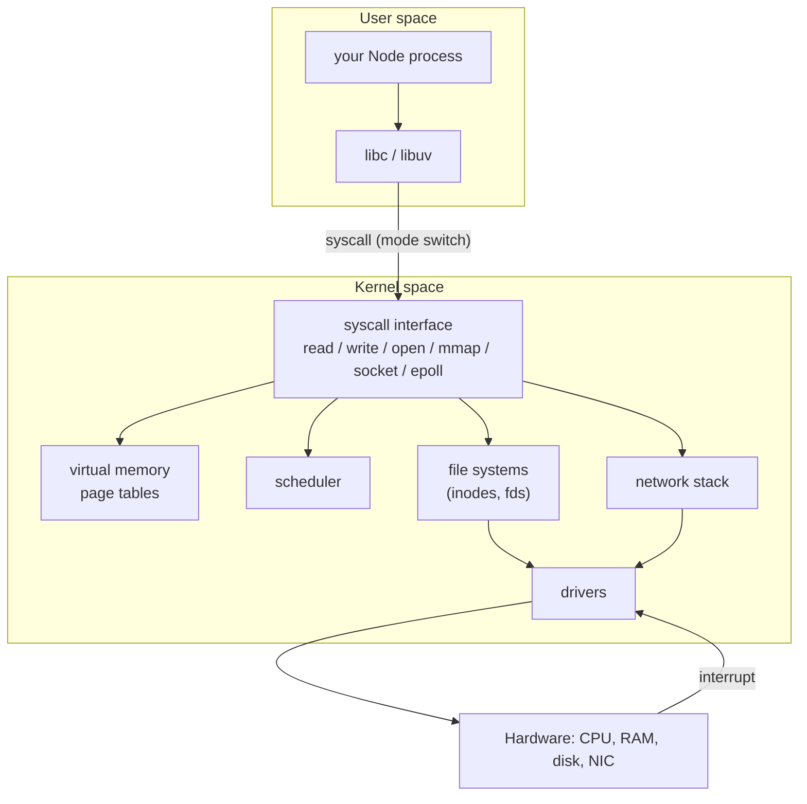
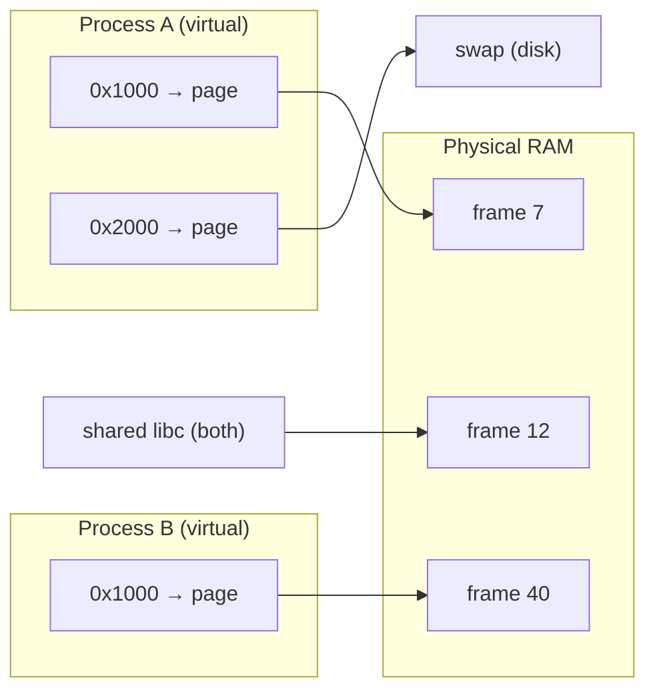
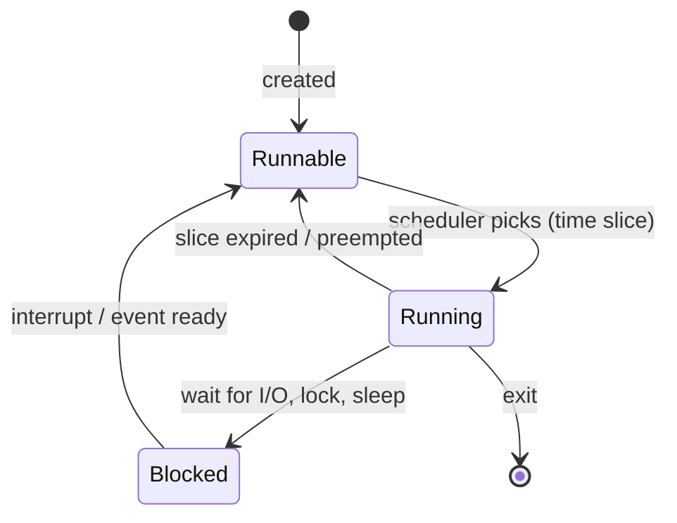

# Module 2.4 — نظام التشغيل: ماذا يفعل فعلًا؟
## Operating Systems: processes, virtual memory, files, permissions, devices, syscalls

> **المستوى:** Level 2 | **الموقع:** [4 من 13]
> **السابق:** [M2.3 — Memory](module-2.3-memory-stack-heap-gc.md) | **التالي:** [M2.5 — Process Deep Dive](module-2.5-process-deep-dive.md)

---

## 1. المتطلبات
> **قبل أن تتعلم هذا، يجب أن تفهم:**
- [ ] مهام OS الست وsyscall كفكرة، `node app.js` خطوة بخطوة — [L0-M0.3](../level-0-absolute-foundations/module-03-running-a-program.md)
- [ ] الملفات والمسارات والأذونات الأولية — [L0-M0.4](../level-0-absolute-foundations/module-04-files-terminal-shell.md)
- [ ] تخطيط ذاكرة العملية — [M2.3](module-2.3-memory-stack-heap-gc.md)

## 2. أهداف التعلّم
- شرح **النواة** (kernel) مقابل **فضاء المستخدم**، و**syscall** كبوابة وحيدة بينهما، وتكلفتها.
- شرح **الذاكرة الافتراضية** (virtual memory): لماذا ترى كل عملية فضاءً خاصًا، كيف تُترجم العناوين (pages)، وما **page fault** و**swap** و**OOM killer**.
- وصف **المجدوِل** (scheduler): كيف تتشارك 200 عملية 8 نوى، وما **تبديل السياق** (context switch) وتكلفته.
- فهم **نظام الملفات** كطبقة تجريد: inodes، واصفات الملفات (file descriptors)، `stdin/stdout/stderr` = 0/1/2، الأذونات `rwx`.
- التعرف على **الأجهزة والسائقين** و**المقاطعات** (interrupts) كآلية "أخبرني عندما تنتهي" — الأساس الفيزيائي لـ async.
- استخدام أدوات التشخيص: `ps`, `top/htop`, `lsof`, `strace`, `ulimit`, `df`, `free`.

---

## 3. شرح للمبتدئ

### النواة وفضاء المستخدم: لماذا لا يلمس برنامجك العتاد
لو استطاع أي برنامج الكتابة في أي عنوان ذاكرة أو أي قطاع قرص، لأفسد برنامج واحد سيئ كل شيء. لذلك المعالج نفسه يملك **وضعين**: **kernel mode** (كل شيء مسموح) و**user mode** (محدود). النواة تعمل في الأول؛ برامجك في الثاني.

عندما يحتاج برنامجك شيئًا خارج صلاحياته — قراءة ملف، فتح سوكت، حجز ذاكرة، إنشاء عملية — يطلب من النواة عبر **syscall** (استدعاء نظام): تعليمة خاصة تنقل المعالج إلى kernel mode، تنفّذ النواة الطلب **بعد فحص الأذونات**، ثم تعود. أمثلة: `open`, `read`, `write`, `mmap`, `fork`, `execve`, `socket`, `connect`, `epoll_wait`.

كل `readFile` في Node = عدة syscalls. كل `console.log` = `write(1, ...)`. **التكلفة:** الانتقال بين الوضعين ~100ns–1µs + إفساد الكاش — رخيص لمرات، مكلف لملايين المرات. لذلك القراءة في **كتل كبيرة** (64KB) أسرع بمراحل من بايت-بايت، ولذلك `console.log` في حلقة ساخنة يبطّئ البرنامج 100×.

### الذاكرة الافتراضية: الوهم المفيد
في M2.3 رأيت عنوان `0x7f3a…`. هذا **عنوان افتراضي** — ليس مكانًا فيزيائيًا في شريحة RAM. كل عملية ترى فضاء عناوين **خاصًا وكاملًا** (على 64 بت: 128TB نظريًا) يبدأ من الصفر. النواة + وحدة في المعالج (**MMU**) تترجم كل عنوان افتراضي إلى فيزيائي عبر **جداول الصفحات** (page tables)، بوحدات **صفحات** 4KB.

لماذا؟
1. **العزل:** عمليتان تستخدمان "نفس" العنوان الافتراضي تصلان إلى صفحتين فيزيائيتين مختلفتين. عملية لا تستطيع حتى **التعبير** عن عنوان في ذاكرة غيرها. (هذا جواب L0: "لماذا الذاكرة معزولة".)
2. **الكسل:** `malloc(1GB)` لا يلمس RAM؛ النواة تسجّل الوعد فقط. أول كتابة في صفحة → **page fault** → النواة تخصّص صفحة فيزيائية حينها. لهذا `heapTotal` ≠ `rss`.
3. **المشاركة:** مكتبة مشتركة (`libc`) محمّلة مرة واحدة فيزيائيًا وممثّلة في فضاء كل عملية. و**copy-on-write**: `fork` لا ينسخ الذاكرة؛ يشاركها حتى يكتب أحدهما.
4. **التجاوز:** عندما تمتلئ RAM، تُنقل صفحات غير مستخدمة إلى القرص (**swap**). الوصول إليها لاحقًا = page fault + قراءة قرص = **أبطأ 100,000×** (جدول M2.2). خادم "يبدأ بالسباحة" في swap = thrashing: كل شيء يتجمد.
5. **OOM killer** (Linux): عندما لا يبقى حتى swap، تختار النواة عملية (الأكبر عادةً) و**تقتلها** بـ SIGKILL. سجل `dmesg` يقول `Out of memory: Killed process 1234 (node)`. هذا غير `heap out of memory` من V8 (M2.3): الأول من OS للعملية كلها، الثاني من V8 لحده الخاص.

### المجدوِل: 200 عملية على 8 نوى
في أي لحظة تعمل 8 خيوط فقط (نواة لكل منها). الباقي **ينتظر** في طوابير. المجدوِل يعطي كل خيط **شريحة زمنية** (time slice، بضع ملّي ثوانٍ) ثم يبدّل إلى غيره — بسرعة تجعلك تظنها متزامنة. حالات الخيط:
- **Running** (على نواة)، **Runnable** (جاهز وينتظر نواة)، **Blocked/Sleeping** (ينتظر I/O أو قفلًا أو مؤقّتًا — لا يستهلك CPU).

**تبديل السياق** (context switch): حفظ سجلات الخيط الحالي + تحميل سجلات التالي + تبديل جداول الصفحات (للعمليات) + **خسارة محتوى الكاش** = 1–10 µs **مباشرة** وأكثر بكثير بشكل غير مباشر. 1000 خيط تتبدّل باستمرار = النظام مشغول بالتبديل لا بالعمل. هذا أحد أسباب نموذج Node (خيط واحد + event loop، M2.7) وثريد-بولات محدودة بدل خيط لكل طلب.

أرقام `top`: **load average** = متوسط عدد الخيوط Runnable+uninterruptible؛ على 8 نوى، 8.0 = مشبع، 20 = طابور طويل. `%wa` (iowait) مرتفع = الاختناق القرص. `%sy` مرتفع = وقت كثير في النواة (syscalls/تبديل) = شبهة.

### نظام الملفات: كل شيء "ملف"
النواة تجرّد القرص (وأشياء أخرى) خلف واجهة موحّدة:
- **inode**: البنية التي تمثل الملف فعلًا (الحجم، الأذونات، المالك، مواقع الكتل). **الاسم** مجرد مدخل في مجلد يشير إلى inode — لهذا يمكن لملف أن يملك أسماء متعددة (hard links)، ولهذا **حذف ملف مفتوح لا يحرّر مساحته** حتى يُغلق (`df` ممتلئ لكن `du` لا يجد الملفات!).
- **واصف الملف** (file descriptor, fd): عدد صحيح صغير تعيده النواة عند `open`؛ البرنامج يقرأ/يكتب عبره. **0 = stdin، 1 = stdout، 2 = stderr** (L0-M0.4 الآن له معنى فيزيائي: `2>/dev/null` = وجّه fd 2 إلى جهاز العدم). **السوكتات والأنابيب أيضًا fds** — لهذا نفس `read/write` تعمل على الشبكة.
- **حد الـ fds**: `ulimit -n` (غالبًا 1024 افتراضيًا). خادم بـ 2000 اتصال متزامن = `EMFILE: too many open files`. ارفعه، و**أغلق** ما تفتح (تسرّب fds = تسرّب موارد لا يراه GC!).
- **الأذونات**: `rwx` لثلاث فئات (owner/group/others) = 9 بتات (`755` = `rwxr-xr-x` — M2.1). `EACCES` = النواة رفضت في syscall. الملفات التنفيذية تحتاج `x`؛ المجلدات تحتاج `x` للدخول.
- `/proc` (Linux): نظام ملفات وهمي يعرض حالة النواة كملفات (`/proc/1234/status`, `/proc/meminfo`). `ps` و`top` تقرأه.

### الأجهزة والمقاطعات: أصل "async"
القرص وبطاقة الشبكة أبطأ من المعالج بملايين المرات. لو انتظرها المعالج **بالاستطلاع** (polling: "انتهيت؟ انتهيت؟") لضاعت قدرته. بدلًا من ذلك: المعالج يرسل الأمر للجهاز ويذهب لعمل آخر؛ عندما ينتهي الجهاز يرسل **مقاطعة** (interrupt) — إشارة كهربائية تجعل المعالج يوقف ما يفعله مؤقتًا، ينفّذ **معالج المقاطعة** في النواة (يعلّم الخيط المنتظر Runnable)، ويعود. **السائق** (driver) هو كود النواة الذي يعرف لغة الجهاز.

هذه السلسلة — **جهاز → مقاطعة → نواة → توقظ الخيط/تعلم epoll → libuv → callback في JS** — هي ما يحدث تحت كل `await readFile`. async ليس سحر JavaScript؛ هو انعكاس لحقيقة أن العتاد يُخطرك عند الانتهاء (M2.7 يكمل الصورة).

---

## 4. النموذج الذهني

```
user mode (برامجك)  ──syscall──▶  kernel mode (النواة)  ──drivers──▶  العتاد
                     ◀──interrupt (الجهاز يُخطر)──

Virtual memory: كل عملية فضاء خاص → عزل + كسل (page fault) + مشاركة (COW) + swap (بطيء جدًا) + OOM killer
Scheduler: Running / Runnable / Blocked؛ شريحة زمنية؛ context switch مكلف → لا تُكثر الخيوط
Files: الاسم → inode؛ fd (0,1,2 = stdin/out/err)؛ سوكتات وأنابيب = fds؛ ulimit -n؛ rwx
Devices: polling سيئ → interrupts → الأساس الفيزيائي لـ async
```

## 5. الرسم التوضيحي







## 6. مثال بسيط

```bash
# شاهد الـ syscalls التي يصدرها برنامج بسيط (Linux)
echo 'console.log("hi")' > hi.js
strace -c node hi.js 2>&1 | tail -15          # ملخص: عدد كل syscall ووقته — لاحظ mmap, read, write, futex, epoll
strace -e trace=write node hi.js              # write(1, "hi\n", 3) = 3   ← console.log هو write إلى fd 1

# fds لعملية حية
node -e "setInterval(()=>{},1000)" & PID=$!
ls -l /proc/$PID/fd                           # 0,1,2 + eventfd/pipe الخاصة بـ libuv
lsof -p $PID | head; kill $PID

# الذاكرة الافتراضية مقابل الفيزيائية
node -e "const a=new Array(50_000_000); setInterval(()=>{},1e3)" & PID=$!
grep -E "VmSize|VmRSS" /proc/$PID/status      # VmSize (افتراضي) ≫ VmRSS (مقيم) — الوعد vs اللمس
kill $PID
ulimit -n                                      # حد fds للجلسة
```

## 7. مثال كود

```typescript
// src/os-probe.ts — ما يراه برنامجك من OS، ومحاكاة حدين شهيرين: EMFILE و EACCES
import os from "node:os";
import { open, writeFile, chmod, readFile, mkdtemp } from "node:fs/promises";
import { tmpdir } from "node:os";
import path from "node:path";

const mb = (b: number) => (b / 1048576).toFixed(0) + " MB";
console.log({
  platform: process.platform, arch: process.arch, kernel: os.release(),
  cpus: os.cpus().length, loadavg: os.loadavg().map(x => x.toFixed(2)),
  totalRam: mb(os.totalmem()), freeRam: mb(os.freemem()),
  pid: process.pid, ppid: process.ppid, uid: process.getuid?.(), cwd: process.cwd(),
  rss: mb(process.memoryUsage().rss),
});

// 1) تسرّب واصفات ملفات: نفتح ولا نغلق حتى نصطدم بـ ulimit -n
const dir = await mkdtemp(path.join(tmpdir(), "osprobe-"));
const f = path.join(dir, "a.txt");
await writeFile(f, "x");
const handles = [];
try {
  for (let i = 0; ; i++) {
    handles.push(await open(f, "r"));                 // بلا close() — كل واحد fd من النواة
    if (i % 500 === 0) console.log(`open fds so far: ${handles.length}`);
  }
} catch (e) {
  const err = e as NodeJS.ErrnoException;
  console.log(`\n${err.code} after ${handles.length} opens  ← هذا هو ulimit -n (${err.message})`);
} finally {
  await Promise.all(handles.map(h => h.close()));      // الدرس: كل open يقابله close (أو استخدم readFile/using)
}

// 2) الأذونات: النواة ترفض في syscall، لا Node
await chmod(f, 0o000);                                 // ---------- (M2.1: 9 بتات)
try { await readFile(f, "utf8"); }
catch (e) { console.log(`\nread after chmod 000 → ${(e as NodeJS.ErrnoException).code}`); }   // EACCES (إلا إن كنت root!)
await chmod(f, 0o644);
console.log(`read after chmod 644 → "${await readFile(f, "utf8")}"`);
```
ملاحظة: إن شغّلته كـ root فلن ترى `EACCES` — root يتجاوز أذونات الملفات. وهذا بحد ذاته درس أمني: **لا تشغّل خدماتك كـ root** (L5-M11).

## 8. مثال من العالم الحقيقي
- Docker (L5-M11) ليس آلة افتراضية: **عمليات عادية** على نفس النواة معزولة بـ namespaces (ترى PIDs/شبكة/ملفات خاصة) ومحدودة بـ cgroups (ذاكرة/CPU). "الحاوية قُتلت بـ OOM" = cgroup limit + OOM killer.
- المتصفح يعزل كل تبويب في عملية — لنفس سبب عزل الذاكرة الافتراضية.
- "لماذا الخادم بطيء رغم أن CPU 20%؟" → `top` يُظهر `%wa` 60% = ينتظر القرص؛ أو swap مستخدم.

## 9. مثال من الإنتاج
**حادثة "القرص ممتلئ لكن لا ملفات":** خادم توقف بـ `ENOSPC: no space left on device`. `df -h` يقول 100%؛ `du -sh /*` يجد 40% فقط. السبب: عملية Node تكتب في `app.log` المفتوح؛ أحدهم "نظّف" بـ `rm app.log`؛ **الاسم** اختفى لكن الـ inode بقي حيًا لأن fd مفتوح، والعملية استمرت تكتب في ملف بلا اسم حتى امتلأ القرص. الدليل: `lsof +L1` يُظهر ملفات محذوفة مفتوحة. **الإصلاح:** `truncate` بدل `rm` (أو إعادة تشغيل العملية/إشارة لإعادة فتح السجل — logrotate). **الدرس:** الاسم ≠ الملف؛ fd يُبقي الـ inode حيًا.

## 10. مفاهيم خاطئة شائعة

| ❌ | ✅ |
|---|---|
| "العنوان الذي أطبعه هو مكان في RAM" | افتراضي؛ النواة/MMU تترجمه، وقد يكون على swap أو غير مخصص بعد. |
| "`heapTotal` = RAM المستهلكة" | `rss` أقرب؛ وحتى هو يشمل صفحات مشتركة. الافتراضي ≫ الفيزيائي. |
| "OOM = خطأ V8 دائمًا" | هناك OOM من V8 (حد heap) وOOM killer من OS (RAM/cgroup). رسالتان مختلفتان، علاجان مختلفان. |
| "خيوط أكثر = إنتاجية أكثر" | حتى حد؛ بعدها تبديل السياق يأكل المكاسب. |
| "`rm` يحرّر المساحة فورًا" | عند إغلاق آخر fd. |
| "root للراحة في الخادم" | يتجاوز كل الأذونات؛ ثغرة واحدة = النظام كله. |

## 11. أخطاء شائعة
1. فتح ملفات/سوكتات بلا إغلاق → `EMFILE`.
2. `console.log` في حلقة ساخنة (syscall لكل سطر) — اجمع واكتب دفعة، أو سجّل بمستويات.
3. قراءة بايت-بايت أو بأحجام صغيرة؛ استخدم streams بكتل افتراضية (64KB).
4. تجاهل `load average` و`%wa` و`swap` عند تشخيص "البطء".
5. تشغيل الخدمة كـ root.
6. الاعتماد على `/tmp` بلا تنظيف → امتلاء القرص.

## 12. تمرين تصحيح

```
$ node server.js
Listening on :3000
# بعد ساعة تحت حمل متوسط:
Error: EMFILE: too many open files, open '/app/templates/page.html'
# وفي الوقت نفسه `top` يُظهر: load average 14.2 على 4 نوى، %sy 45%
```
الكود: لكل طلب `fs.readFile("templates/page.html")` + فتح اتصال DB جديد (`new Client().connect()`) بلا إغلاق + `setTimeout` للمهلة لا يُلغى. ما السلسلة السببية الكاملة؟ ما أول شيء تتحقق منه؟

<details><summary>💡 الحل</summary>

1. **`EMFILE`**: اتصالات DB لا تُغلق = سوكتات = fds تتراكم حتى `ulimit -n`. ثم تفشل حتى قراءة القالب لأن النواة ترفض `open` جديدًا. تحقق أولًا: `ls /proc/$PID/fd | wc -l` و`lsof -p $PID | awk '{print $5}' | sort | uniq -c` (كم `IPv4`/sockets مقابل `REG` files؟).
2. **load 14 و`%sy` 45%**: مئات الاتصالات + مؤقّتات + كل طلب يقرأ القالب من القرص = syscalls كثيرة + خيوط libuv (M2.7) تتنافس = وقت في النواة وتبديل سياق. ليس "CPU مشغول بمنطقك".
3. الإصلاح: **connection pool** واحد للـ DB (L5-M7)، قالب يُقرأ مرة ويُخزَّن في الذاكرة (كاش في العملية)، `clearTimeout` في مسار النجاح. ثم `ulimit -n 65536` كضبط معقول — لكنه **ليس** الحل.
4. اختبر بتغيير واحد كل مرة وراقب عدد fds عبر الزمن تحت حمل ثابت (نفس منهج M2.3 للذاكرة — fds مورد مثل الذاكرة لكن GC لا يحرّره).
</details>

## 13. تمرين معماري
خدمتك ستعمل في حاوية بحدّ 512MB ذاكرة ونصف نواة CPU. اكتب ACTRR: كيف تضبط `--max-old-space-size` بالنسبة لحد الحاوية (ولماذا ليس 512)؟ ماذا يحدث عند تجاوزه (من يقتل من)؟ كم اتصالًا متزامنًا تسمح به بالنظر إلى fds والذاكرة لكل اتصال؟ ما الذي تراقبه (RSS، fds، load، iowait) وما العتبات؟ هل نصف نواة تكفي لـ GC + حلقة الأحداث؟

## 14. الصلة بعصر AI
AI يقترح "ارفع `ulimit`" و"زد الذاكرة" و"أضف خيوطًا" كحلول أولى لأنها الأكثر شيوعًا في النصوص. اطلب **التشخيص قبل الوصفة**: *"ما الـ syscalls/fds/الذاكرة الافتراضية مقابل المقيمة هنا؟ ما الذي يُثبت أن الاختناق هو X؟"* وأعطه مخرجات `top`/`lsof`/`strace -c` الحقيقية بدل وصفك — يقرؤها جيدًا إن أُعطيها.

## 15. ما يجب إتقانه (Must Master) 🔴
- 🔴 kernel/user mode وsyscall وتكلفته؛ الذاكرة الافتراضية = عزل + كسل + swap؛ OOM V8 vs OOM killer؛ حالات الخيط والمجدوِل وتبديل السياق؛ fd (0/1/2، سوكتات = fds، `ulimit -n`، أغلق ما تفتح)؛ الاسم ≠ inode؛ المقاطعات كأساس async.

## 16. ما يجب فهمه (Should Understand) 🟠
- 🟠 قراءة `top` (load، %wa، %sy)؛ `strace -c`، `lsof`، `/proc`؛ copy-on-write؛ `rss` vs `heapTotal` vs VmSize؛ root وتجاوز الأذونات؛ Docker = namespaces + cgroups.

## 17. ما يمكن تأجيله (Can Defer) ⚪
- ⚪ تفاصيل جداول الصفحات متعددة المستويات وTLB؛ خوارزميات الجدولة (CFS)؛ أنظمة ملفات محددة (ext4/xfs/journaling)؛ eBPF؛ real-time OS.

## 18. الخلاصة
1. برنامجك في user mode؛ كل شيء خارجه يمرّ عبر **syscall** — بوابة محمية ومكلفة نسبيًا.
2. **الذاكرة الافتراضية** تعطي كل عملية فضاءً خاصًا: عزل، تخصيص كسول، مشاركة، swap (بطيء جدًا)، OOM killer.
3. **المجدوِل** يقسّم النوى بشرائح زمنية؛ تبديل السياق مكلف → خيوط قليلة + انتظار غير محجوب.
4. كل شيء fd: ملفات، سوكتات، أنابيب؛ **أغلق ما تفتح**؛ الاسم ≠ inode.
5. **المقاطعات** هي سبب إمكان async: العتاد يُخطر، لا يُستطلع.
6. أدواتك: `top`, `ps`, `lsof`, `strace`, `ulimit`, `/proc`, `dmesg`.

## 19. مراجع رسمية
- Linux man-pages — `syscalls(2)`: https://man7.org/linux/man-pages/man2/syscalls.2.html
- Linux man-pages — `proc(5)`: https://man7.org/linux/man-pages/man5/proc.5.html
- OSTEP (كتاب مجاني) — Virtual Memory & Scheduling: https://pages.cs.wisc.edu/~remzi/OSTEP/
- Node.js — `process.memoryUsage()`, `os` module: https://nodejs.org/api/os.html
- Brendan Gregg — Linux Performance (أدوات): https://www.brendangregg.com/linuxperf.html
- Linux kernel docs — OOM killer: https://www.kernel.org/doc/gorman/html/understand/understand016.html

## المصطلحات
| العربية | English |
|---|---|
| النواة / فضاء المستخدم | Kernel / User space |
| استدعاء نظام | System call (syscall) |
| ذاكرة افتراضية | Virtual memory |
| صفحة / جدول صفحات | Page / Page table |
| خطأ صفحة | Page fault |
| تبديل إلى القرص | Swap |
| قاتل نفاد الذاكرة | OOM killer |
| النسخ عند الكتابة | Copy-on-write |
| مجدوِل | Scheduler |
| شريحة زمنية | Time slice |
| تبديل السياق | Context switch |
| متوسط الحمل | Load average |
| عقدة فهرس | inode |
| واصف ملف | File descriptor (fd) |
| مقاطعة | Interrupt |
| سائق | Driver |
| استطلاع | Polling |

> **التالي:** [Module 2.5 — Process Deep Dive: lifecycle, signals, graceful shutdown](module-2.5-process-deep-dive.md)
