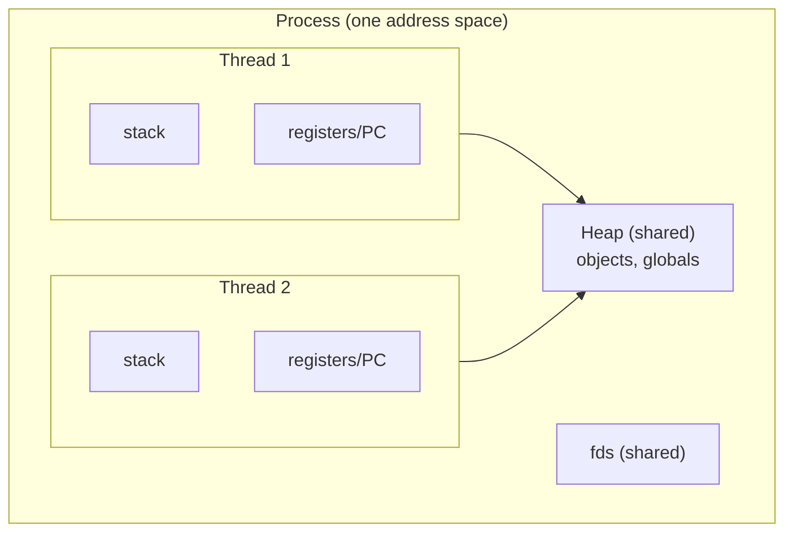
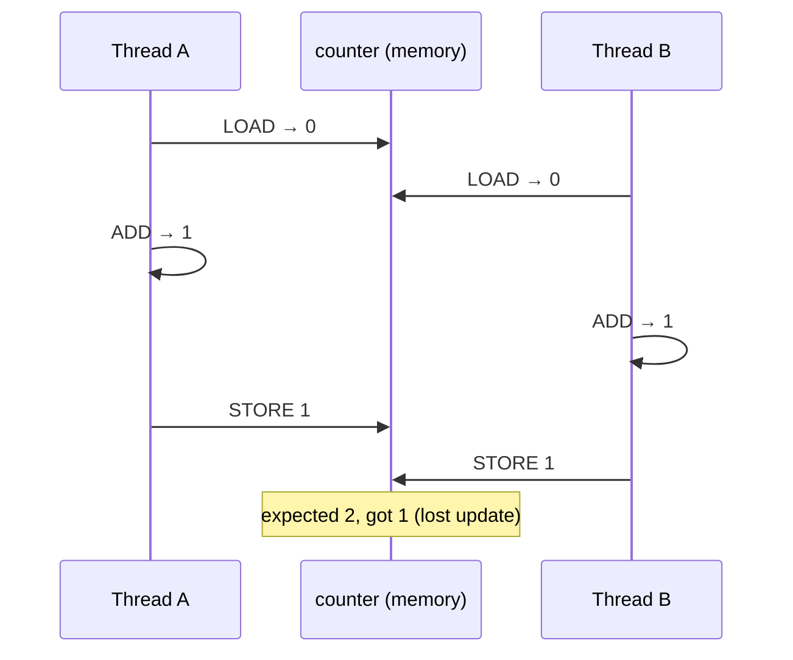
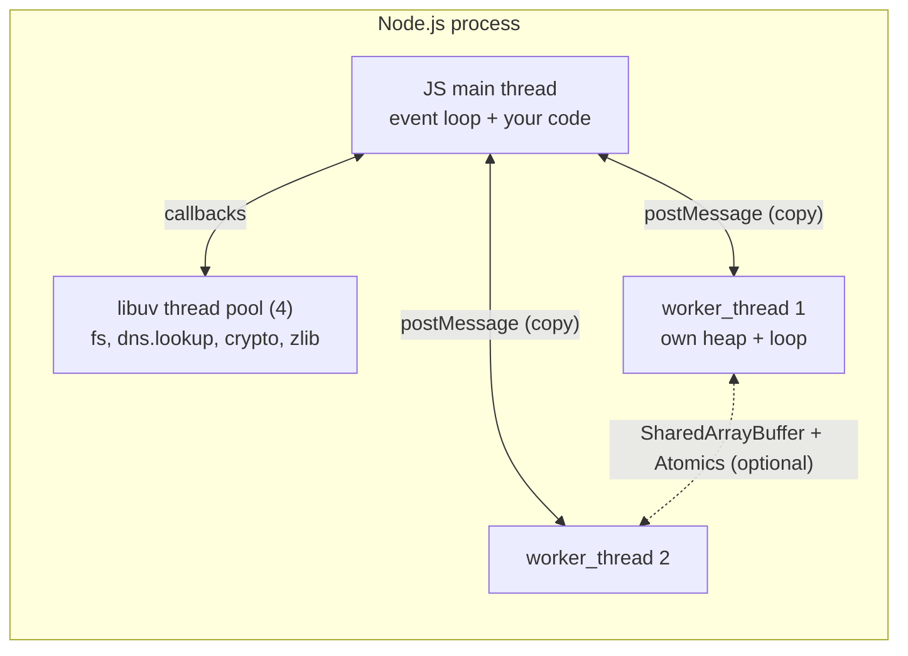

# Module 2.6 — الخيوط
## Threads: process → thread, shared memory, races, locks, worker_threads in Node

> **المستوى:** Level 2 | **الموقع:** [6 من 13]
> **السابق:** [M2.5 — Process Deep Dive](module-2.5-process-deep-dive.md) | **التالي:** [M2.7 — Concurrency, Parallelism, Event Loop](module-2.7-concurrency-event-loop.md)

---

## 1. المتطلبات
> **قبل أن تتعلم هذا، يجب أن تفهم:**
- [ ] النوى المتعددة ولماذا توقفت الساعة — [M2.2](module-2.2-cpu-cache-ram.md)
- [ ] المكدس والكومة — [M2.3](module-2.3-memory-stack-heap-gc.md)
- [ ] المجدوِل وتبديل السياق — [M2.4](module-2.4-operating-systems.md)
- [ ] العمليات والأبناء — [M2.5](module-2.5-process-deep-dive.md)
- [ ] read-modify-write race — [L0-M0.7](../level-0-absolute-foundations/module-07-database-api-web-app.md)، [L1-M1.12](../level-1-programming/module-1.12-debugging.md)

## 2. أهداف التعلّم
- تعريف **الخيط** (thread) بدقة: وحدة تنفيذ داخل عملية، لها مكدسها، وتشارك الكومة والـ fds مع إخوتها.
- مقارنة **عملية vs خيط**: العزل، تكلفة الإنشاء، تكلفة الاتصال، نمط الفشل.
- شرح لماذا **الذاكرة المشتركة + الكتابة المتزامنة = سباق** (data race)، وما **القسم الحرج** و**القفل** (mutex) و**الذرّية** (atomics) و**الجمود** (deadlock).
- فهم نموذج Node: خيط JS واحد، + **thread pool** لـ libuv، + **worker_threads** للحساب الثقيل — ومتى تستخدم كلًّا منها.
- استخدام `worker_threads` مع تمرير رسائل (نسخ) و`SharedArrayBuffer` + `Atomics` (مشاركة) بوعي.
- التمييز بين "خيوط لا تحتاجها" (I/O-bound) و"خيوط تحتاجها" (CPU-bound).

---

## 3. شرح للمبتدئ

### من العملية إلى الخيط
العملية (M2.5) = فضاء عناوين + fds + **خيط تنفيذ واحد على الأقل**. **الخيط** = "مؤشر تنفيذ": عدّاد برنامج + سجلات + **مكدس خاص**. عملية بـ 4 خيوط = 4 مكدسات، 4 مواضع تنفيذ، لكن **كومة واحدة** و**fds واحدة** وكود واحد.

| | عمليتان | خيطان في عملية |
|---|---|---|
| الذاكرة | معزولة (M2.4) — لا يرى أحدهما الآخر | **مشتركة** — نفس الكومة، نفس المتغيرات العالمية |
| الاتصال | عبر النواة: أنابيب، سوكتات، ملفات (نسخ، بطيء نسبيًا) | مباشر: اكتب في متغير، يراه الآخر فورًا (سريع، **خطر**) |
| الإنشاء | ~1 ms، MBs | ~10–50 µs، KBs (مكدس فقط) |
| تبديل السياق | أغلى (تبديل جداول الصفحات) | أرخص (نفس الفضاء) |
| الفشل | انهيار أحدهما لا يمسّ الآخر | انهيار خيط (segfault) = **انهيار العملية كلها** |
| الاستفادة من النوى | نعم | نعم |

الخلاصة: الخيوط **أرخص وأسرع في التواصل** لأنها تشارك كل شيء — وهذا بالضبط ما يجعلها **أصعب في الصواب**.

### المشكلة الجوهرية: الذاكرة المشتركة
```
counter = 0
Thread A: counter = counter + 1      Thread B: counter = counter + 1
```
تبدو ذرّية؛ لكنها 3 تعليمات (M2.2): `LOAD R1,[counter]` → `ADD R1,1` → `STORE [counter],R1`. المجدوِل (M2.4) قد يبدّل الخيط **بين** أي اثنتين — أو ينفّذهما على نواتين **في نفس اللحظة**:

```
A: LOAD  R1 ← 0
B: LOAD  R1 ← 0        ← كلاهما قرأ 0
A: ADD, STORE → 1
B: ADD, STORE → 1      ← الناتج 1 لا 2؛ ضاعت زيادة
```
هذا **data race**: نتيجة تعتمد على توقيت لا تتحكم به. يظهر "أحيانًا"، يختفي تحت المصحّح، ويزداد تحت الحمل. (نفس البنية التي رأيتها في L0-M0.7 مع DB وفي L1-M1.12 عبر `await` — لكن هنا على مستوى تعليمة المعالج، بلا أي `await` يحذّرك.)

**وأسوأ**: المعالج والمترجم **يعيدان ترتيب** القراءات والكتابات لأسباب أداء (M2.2 out-of-order)، وكل نواة لها كاش L1 خاص — خيط قد يرى كتابة الآخر **متأخرة**. "الذاكرة المشتركة" ليست لوحة واحدة يراها الجميع في نفس اللحظة. هذا يُسمّى **نموذج الذاكرة** (memory model)، وهو ⚪ الآن — لكن استنتاجه 🔴: **لا تشارك بيانات قابلة للتغيير بين خيوط بلا آلية مزامنة صريحة. أبدًا.**

### الأدوات: القسم الحرج، القفل، الذرّية
- **القسم الحرج** (critical section): كود يلمس حالة مشتركة ويجب ألا ينفّذه خيطان معًا.
- **القفل / Mutex** (mutual exclusion): "خذ المفتاح → ادخل → اخرج → أعد المفتاح". خيط واحد داخل القسم في أي لحظة. التكلفة: الآخرون **ينتظرون** (Blocked، M2.4) — قفل كبير حول كل شيء = عدت إلى خيط واحد عمليًا (هذا هو GIL في Python).
- **عمليات ذرّية** (atomics): تعليمات معالج خاصة تقرأ-تعدّل-تكتب **كوحدة** (`compare-and-swap`). للعدّادات والأعلام البسيطة؛ أرخص من القفل.
- **Deadlock** (الجمود): A يحمل القفل 1 وينتظر 2؛ B يحمل 2 وينتظر 1 → للأبد. الوقاية الكلاسيكية: **ترتيب ثابت** لأخذ الأقفال، ومهلات.
- **القنوات/الرسائل** (message passing): بدل مشاركة الذاكرة، أرسل **نسخة** من البيانات. "لا تتواصل بمشاركة الذاكرة؛ شارك الذاكرة بالتواصل" (شعار Go). أبطأ قليلًا، أسلم كثيرًا — **وهذا نموذج Node الافتراضي**.

### نموذج Node: ثلاث طبقات من الخيوط
1. **خيط JavaScript الرئيسي** (واحد): كل كودك، حلقة الأحداث (M2.7). **لا يوجد data race في JS نفسه** لأن خيطًا واحدًا فقط يلمس كائناتك — هذه هدية ضخمة ثمنها أن الحساب الثقيل يحجب كل شيء.
2. **thread pool لـ libuv** (4 افتراضيًا، `UV_THREADPOOL_SIZE` حتى 1024): ينفّذ **لحسابك** عمليات لا يدعمها OS بشكل غير محجوب: `fs.*` (معظمه)، `dns.lookup`، `crypto.pbkdf2/scrypt`، `zlib`. تحصل على النتيجة كـ callback — **لا تلمس خيوطه أبدًا**. (السوكتات **لا** تمرّ به؛ تستخدم epoll/kqueue مباشرة — M2.7.)
3. **`worker_threads`**: خيوط JS حقيقية تنشئها أنت، كلٌّ بحلقة أحداث وheap **خاصين** (V8 isolate منفصل). التواصل افتراضيًا بـ **رسائل** (`postMessage` ينسخ بـ structured clone — L1-M1.6)، أو اختياريًا بـ `SharedArrayBuffer` + `Atomics` إن أردت المشاركة الحقيقية (ومعها كل المخاطر أعلاه).

| الحاجة | الأداة |
|---|---|
| I/O (ملفات، شبكة، DB) | **لا خيوط**: async/await (حلقة الأحداث + libuv). خيوط هنا إهدار. |
| حساب ثقيل مرة واحدة (hash 1M كلمة سر، تحليل صورة، JSON 500MB) | `worker_threads` أو عملية ابن |
| استغلال كل النوى لخادم HTTP | `cluster` / عدة عمليات خلف موازن (M2.7) — عزل أفضل من الخيوط |
| حساب مشترك على مصفوفة ضخمة بين عمّال | `SharedArrayBuffer` + `Atomics` (نادر، متقدم) |

**القاعدة:** ابدأ بخيط واحد + async. أضف عمّالًا فقط عندما **تقيس** أن حلقة الأحداث محجوبة بحساب (M2.7 يعلّمك القياس).

---

## 4. النموذج الذهني

```
Process = فضاء عناوين + fds + ≥1 thread
Thread  = PC + سجلات + مكدس خاص   ← يشارك الكومة مع إخوته

Shared mutable + concurrent write = data race  (LOAD/ADD/STORE ليست ذرّية)
  → mutex (واحد في القسم الحرج) | atomics | message passing (انسخ بدل أن تشارك)
  → deadlock: ترتيب ثابت للأقفال + مهلات

Node:  [JS main thread: كودك، لا races]  +  [libuv pool ×4: fs/dns/crypto/zlib]  +  [worker_threads: حساب ثقيل، رسائل]
I/O-bound → لا خيوط.  CPU-bound → workers/processes.  قِس قبل أن تضيف.
```

## 5. الرسم التوضيحي







## 6. مثال بسيط

```typescript
// src/race-demo.ts — سباق حقيقي بين خيطين على ذاكرة مشتركة، ثم إصلاحه بـ Atomics
import { Worker, isMainThread, workerData, parentPort } from "node:worker_threads";
import { fileURLToPath } from "node:url";

const N = 30_000_000;                                           // كبير بما يكفي ليتداخل العاملان زمنيًا
if (isMainThread) {
  for (const atomic of [false, true]) {
    const sab = new SharedArrayBuffer(4);                      // 4 بايت مشتركة فعلًا بين الخيوط
    const view = new Int32Array(sab);
    const workers = [0, 1].map(() => new Worker(fileURLToPath(import.meta.url), { workerData: { sab, atomic } }));
    await Promise.all(workers.map(w => new Promise(res => w.on("exit", res))));
    console.log(`${atomic ? "Atomics.add" : "view[0]++   "} → expected ${2 * N}, got ${Atomics.load(view, 0)}`);
  }
} else {
  const view = new Int32Array(workerData.sab as SharedArrayBuffer);
  for (let i = 0; i < N; i++) {
    if (workerData.atomic) Atomics.add(view, 0, 1);
    else view[0] = (view[0] ?? 0) + 1;                   // LOAD / ADD / STORE — ثلاث خطوات غير ذرّية
  }
  parentPort?.close();
}
// view[0]++    → expected 60000000, got 31827419   ← يختلف كل تشغيل (تحديثات ضائعة)
// Atomics.add  → expected 60000000, got 60000000
```

## 7. مثال كود

```typescript
// src/hash-pool.ts — متى تحتاج الخيوط فعلًا: hashing كلمات سر (CPU-bound) دون حجب خادمك
// النمط: pool من العمّال + طابور مهام + رسائل (نسخ) — لا ذاكرة مشتركة
import { Worker, isMainThread, parentPort } from "node:worker_threads";
import { scryptSync, randomBytes } from "node:crypto";
import { fileURLToPath } from "node:url";
import os from "node:os";

type Job = { id: number; password: string };
type Done = { id: number; hash: string; ms: number };

if (!isMainThread) {
  // ---- كود العامل: يستقبل مهمة، يحسب (محجوب هنا لكن في خيطه الخاص)، يعيد النتيجة
  parentPort!.on("message", (job: Job) => {
    const t = performance.now();
    const salt = randomBytes(16);
    const hash = salt.toString("hex") + ":" + scryptSync(job.password, salt, 64, { N: 2 ** 14 }).toString("hex");
    parentPort!.postMessage({ id: job.id, hash, ms: Math.round(performance.now() - t) } satisfies Done);
  });
} else {
  // ---- الخيط الرئيسي: pool بحجم عدد النوى، يوزّع المهام ويبقى حرًا
  const size = Math.max(1, os.availableParallelism() - 1);
  const idle: Worker[] = Array.from({ length: size }, () => new Worker(fileURLToPath(import.meta.url)));
  const queue: Array<{ job: Job; resolve: (d: Done) => void }> = [];

  function pump() {
    while (idle.length && queue.length) {
      const w = idle.pop()!, { job, resolve } = queue.shift()!;
      w.once("message", (d: Done) => { resolve(d); idle.push(w); pump(); });
      w.postMessage(job);
    }
  }
  const hashAsync = (job: Job) => new Promise<Done>(resolve => { queue.push({ job, resolve }); pump(); });

  // دليل أن الخيط الرئيسي حرّ: مؤقّت يطبع أثناء الحساب
  const tick = setInterval(() => process.stdout.write("."), 100);

  const jobs: Job[] = Array.from({ length: 24 }, (_, i) => ({ id: i, password: `pw-${i}` }));
  console.time(`\n${jobs.length} hashes on ${size} workers`);
  const results = await Promise.all(jobs.map(hashAsync));
  console.timeEnd(`\n${jobs.length} hashes on ${size} workers`);
  console.log("avg per hash", Math.round(results.reduce((s, r) => s + r.ms, 0) / results.length), "ms");

  clearInterval(tick);
  await Promise.all(idle.map(w => w.terminate()));            // أغلق العمّال وإلا لم تخرج العملية (M2.5)

  // للمقارنة: نفس العمل على الخيط الرئيسي — لاحظ أن النقاط تختفي (محجوب)
  const tick2 = setInterval(() => process.stdout.write("."), 100);
  console.time("\nsame on main thread (blocking)");
  for (const j of jobs) scryptSync(j.password, randomBytes(16), 64, { N: 2 ** 14 });
  console.timeEnd("\nsame on main thread (blocking)");
  clearInterval(tick2);
}
```
النتيجة النموذجية على 8 نوى: ~0.5s مع العمّال والنقاط تُطبع بانتظام؛ ~3s على الخيط الرئيسي **بلا نقاط** (كل شيء متجمد — لو كان خادمًا لما استجاب لأي طلب). ملاحظة: `crypto.scrypt` (غير المتزامن) يستخدم thread pool libuv أصلًا — في الواقع ستستخدمه مباشرة؛ المثال يوضّح الآلية التي يخفيها.

## 8. مثال من العالم الحقيقي
- المتصفح: Web Workers = نفس فكرة `worker_threads`؛ واجهة المستخدم على خيط واحد، الحساب الثقيل في عامل.
- قواعد البيانات (PostgreSQL: عملية لكل اتصال؛ MySQL: خيط لكل اتصال) — نفس المقايضة عزل/تكلفة.
- Python's GIL: قفل واحد كبير يمنع تنفيذ bytecode بالتوازي → الخيوط لا تسرّع CPU-bound في CPython؛ لذلك `multiprocessing`.
- Go goroutines / Java virtual threads: خيوط "خفيفة" تجدولها بيئة التشغيل فوق خيوط OS — حل آخر لنفس المشكلة.

## 9. مثال من الإنتاج
**حادثة "التقرير الذي يتجمّد فيه الموقع":** خادم Node واحد يخدم API + يولّد تقارير Excel (CPU 3–8 ثوانٍ). كل تقرير = الموقع كله يتجمّد لثوانٍ، وموازن الحمل يسحب الخادم من الخدمة (health check مهلة 2s). "الحل" الأول: `UV_THREADPOOL_SIZE=64` — لم يغيّر شيئًا (التوليد JS خالص، ليس في pool libuv). الحل الفعلي: نقل التوليد إلى `worker_threads` pool بحجم `cores - 1`، ثم لاحقًا إلى **خدمة عاملة منفصلة** تسحب من طابور (L5-M9) لأن الذاكرة لكل تقرير كبيرة والعزل أهم. **الدرس:** اعرف **أي خيط** يحجبه كودك قبل أن تضبط أي معامل.

## 10. مفاهيم خاطئة شائعة

| ❌ | ✅ |
|---|---|
| "Node أحادي الخيط" | كود JS على خيط واحد؛ العملية فيها خيوط libuv وGC وworkers. |
| "لا يوجد race في Node" | لا data race على كائنات JS؛ لكن **logical races** عبر `await` (L1-M1.11) وrace مع `SharedArrayBuffer` موجودة. |
| "`counter++` ذرّي" | ثلاث تعليمات؛ غير ذرّي حتى في لغات بخيوط حقيقية. |
| "خيوط أكثر = أسرع" | حتى عدد النوى لـ CPU-bound؛ بعدها تبديل سياق (M2.4). لـ I/O-bound: صفر خيوط إضافية. |
| "رفع `UV_THREADPOOL_SIZE` يسرّع كل شيء" | يؤثر فقط على fs/dns.lookup/crypto/zlib؛ لا على الشبكة ولا على JS. |
| "worker_threads تشارك المتغيرات" | heap منفصل؛ تمرير رسائل **ينسخ**؛ المشاركة فقط عبر SharedArrayBuffer. |

## 11. أخطاء شائعة
1. إنشاء Worker **لكل طلب** (10–50ms + heap جديد) بدل pool.
2. نسيان `terminate()` → العملية لا تخرج.
3. تمرير كائنات ضخمة بـ `postMessage` في حلقة ساخنة (نسخ) — استخدم `transferList` (نقل ملكية ArrayBuffer) أو SharedArrayBuffer.
4. استخدام SharedArrayBuffer بلا `Atomics` → سباق صامت.
5. وضع I/O داخل worker "ليكون متوازيًا" — لا يضيف شيئًا؛ async كان يكفي.
6. الاعتماد على `isMainThread` بملف واحد دون فهم أن الملف **يُنفَّذ كاملًا** في كل عامل.

## 12. تمرين تصحيح

```typescript
// خدمة تغيير حجم صور: "أضفنا 16 عاملًا والأداء ساء، والذاكرة انفجرت"
import { Worker } from "node:worker_threads";
app.post("/resize", async (req, res) => {
  const buf = await readBody(req);                               // حتى 20MB
  const worker = new Worker("./resize-worker.js");
  worker.postMessage({ buf, width: req.query.w });
  worker.on("message", out => { res.send(out); });
});
// الجهاز: 4 نوى، 2GB RAM. الحمل: 30 طلبًا متزامنًا.
```

<details><summary>💡 الحل</summary>

1. **Worker لكل طلب**: 30 متزامنًا = 30 خيطًا بـ 30 heap + 30 isolate على 4 نوى → تبديل سياق مستمر + ~30×(heap أساسي ~10MB) + كل الصور في الذاكرة مرتين (نسخة في الرئيسي + **نسخة** بعد `postMessage` لأنه ينسخ) → 30 × 20MB × 2 = 1.2GB + heaps → OOM. الحل: **pool ثابت** بحجم `cores - 1` = 3، وطابور للباقي (حد التزامن = حد الذاكرة، L1-M1.11).
2. **لا `terminate`/لا إعادة استخدام** → تسرّب خيوط حتى لو انتهت المهام (الـ Worker يبقى حيًا بمستمعه).
3. **نسخ 20MB**: مرّر `buf.buffer` في `transferList` (نقل ملكية بلا نسخ)، أو اقرأ الملف داخل العامل من القرص/stream.
4. لا معالجة خطأ (`worker.on("error")`) → طلب معلّق للأبد عند فشل عامل.
5. **16 > 4 نوى** لعمل CPU-bound خالص = أبطأ من 3–4 بسبب تبديل السياق وتنافس الكاش (M2.2/M2.4). "أكثر" ليس "أسرع".
6. على المدى الأبعد: هذا عمل يستحق خدمة/طابورًا منفصلًا (L5-M9) — عزل الذاكرة والفشل عن خادم API.
</details>

## 13. تمرين معماري
قارن ثلاثة تصاميم لخدمة تحويل فيديو (CPU-bound، دقائق لكل مهمة، 100 مهمة/ساعة): (أ) worker_threads داخل خادم API؛ (ب) عملية ابن لكل مهمة؛ (ج) خدمة عاملة منفصلة + طابور. لكل تصميم: العزل عند الانهيار/OOM، استغلال النوى، التوسّع الأفقي (آلات إضافية)، تعقيد النشر، وما يحدث عند SIGTERM في منتصف مهمة (M2.5). ACTRR مع توصية مرحلية (ماذا الآن، ماذا عند 10×).

## 14. الصلة بعصر AI
AI يقترح `worker_threads` لتسريع I/O (لا يفيد) ويعطيك SharedArrayBuffer بلا Atomics و`new Worker` داخل معالج الطلب. اسأله دائمًا: *"هل هذا CPU-bound أم I/O-bound؟ أي خيط يُحجب؟"* وارفض أي ذاكرة مشتركة بلا مزامنة صريحة. وفي المقابل، AI ممتاز في شرح **لماذا** سباق معيّن يحدث إن أعطيته تسلسل التعليمات.

## 15. ما يجب إتقانه (Must Master) 🔴
- 🔴 الخيط = مكدس خاص + كومة مشتركة؛ جدول عملية vs خيط؛ **لماذا `counter++` يسبّب سباقًا**؛ mutex/atomics/message passing كخيارات؛ طبقات Node الثلاث وأي عمل يذهب لأيها؛ I/O-bound → لا خيوط.

## 16. ما يجب فهمه (Should Understand) 🟠
- 🟠 deadlock والوقاية؛ worker pool + طابور؛ `transferList` vs نسخ؛ `UV_THREADPOOL_SIZE` وحدوده؛ لماذا GIL/goroutines موجودة؛ `availableParallelism`.

## 17. ما يمكن تأجيله (Can Defer) ⚪
- ⚪ نماذج الذاكرة (happens-before، memory barriers)؛ lock-free structures؛ false sharing؛ thread affinity؛ تفاصيل `Atomics.wait/notify`.

## 18. الخلاصة
1. الخيط وحدة تنفيذ **تشارك الكومة** مع إخوتها — رخيص وسريع التواصل، وخطر لنفس السبب.
2. ذاكرة مشتركة + كتابة متزامنة = **data race**؛ `x++` ليست ذرّية.
3. الأدوات: قفل (قسم حرج واحد)، ذرّيات، أو **رسائل بنسخ** (الأسلم، والافتراضي في Node).
4. Node: خيط JS واحد (لا races على كائناتك) + pool libuv (fs/dns/crypto/zlib) + workers (حسابك الثقيل).
5. I/O → async بلا خيوط؛ CPU ثقيل → worker pool بحجم النوى، أو عملية/خدمة منفصلة للعزل.
6. قِس أي خيط يُحجب قبل أن تضيف خيوطًا أو تضبط معاملات.

## 19. مراجع رسمية
- Node.js — `worker_threads`: https://nodejs.org/api/worker_threads.html
- Node.js — Don't block the event loop (worker pool section): https://nodejs.org/en/learn/asynchronous-work/dont-block-the-event-loop
- libuv — Thread pool: https://docs.libuv.org/en/v1.x/threadpool.html
- MDN — `SharedArrayBuffer` & `Atomics`: https://developer.mozilla.org/en-US/docs/Web/JavaScript/Reference/Global_Objects/Atomics
- OSTEP — Concurrency chapters (threads, locks, deadlock): https://pages.cs.wisc.edu/~remzi/OSTEP/
- Linux man-pages — `pthreads(7)`: https://man7.org/linux/man-pages/man7/pthreads.7.html

## المصطلحات
| العربية | English |
|---|---|
| خيط | Thread |
| ذاكرة مشتركة | Shared memory |
| سباق بيانات | Data race |
| تحديث ضائع | Lost update |
| قسم حرج | Critical section |
| قفل / استبعاد متبادل | Lock / Mutex |
| عملية ذرّية | Atomic operation |
| مقارنة وتبديل | Compare-and-swap (CAS) |
| جمود | Deadlock |
| تمرير الرسائل | Message passing |
| مجمّع خيوط | Thread pool |
| خيط عامل | Worker thread |
| نموذج الذاكرة | Memory model |
| قفل المفسّر العالمي | GIL (Global Interpreter Lock) |
| قائمة النقل | Transfer list |

> **التالي:** [Module 2.7 — Concurrency vs Parallelism; the Node.js Event Loop](module-2.7-concurrency-event-loop.md)
