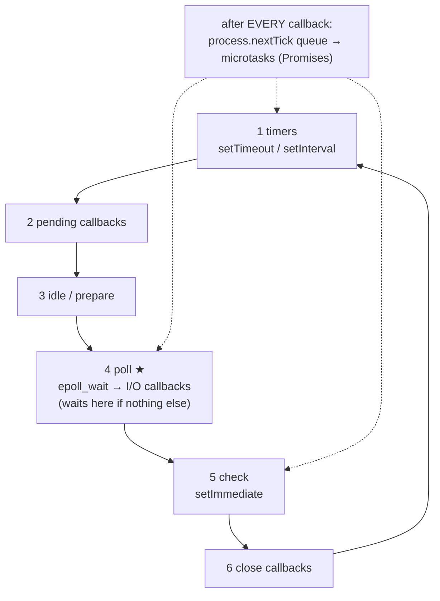
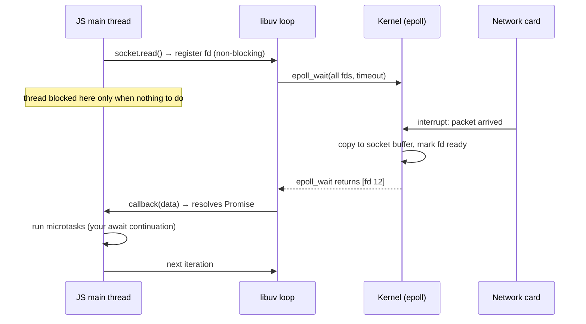
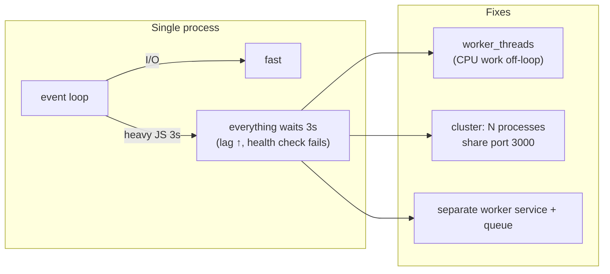

# Module 2.7 — التزامن مقابل التوازي، وحلقة أحداث Node من الداخل
## Concurrency vs Parallelism; the Node.js Event Loop, libuv, epoll, phases, blocking

> **المستوى:** Level 2 | **الموقع:** [7 من 13]
> **السابق:** [M2.6 — Threads](module-2.6-threads.md) | **التالي:** [M2.8 — Networking from Zero](module-2.8-networking-from-zero.md)

---

## 1. المتطلبات
- [ ] async/await، Promise، حلقة الأحداث كصورة مبسّطة، microtasks — [L1-M1.11](../level-1-programming/module-1.11-async-event-loop.md)
- [ ] المقاطعات، syscalls، Blocked vs Running — [M2.4](module-2.4-operating-systems.md)
- [ ] الخيوط وطبقات Node الثلاث — [M2.6](module-2.6-threads.md)

## 2. أهداف التعلّم
- التمييز بدقة بين **التزامن** (concurrency: التعامل مع أشياء كثيرة) و**التوازي** (parallelism: فعل أشياء كثيرة في اللحظة نفسها)، ولماذا Node متزامن جدًا ومتوازٍ قليلًا.
- شرح كيف تنتظر عملية واحدة 10,000 سوكت بلا 10,000 خيط: **I/O متعدد الإرسال** (`epoll`/`kqueue`/IOCP) = syscall واحد "أيقظني عندما يجهز أيٌّ منها".
- رسم **مراحل حلقة الأحداث** الحقيقية (timers → pending → poll → check → close) + صفوف **microtasks** و`process.nextTick` بينها، والتنبؤ بترتيب التنفيذ.
- قياس **تأخر حلقة الأحداث** (event loop lag) وفهم ما يحجبها (حساب JS، JSON ضخم، regex كارثي، `*Sync`) وما لا يحجبها.
- اختيار بين: async، worker_threads، cluster، خدمات منفصلة — بناءً على نوع العمل.

---

## 3. شرح للمبتدئ

### التزامن ≠ التوازي
- **التزامن** (concurrency): بنية برنامجك تسمح بالتعامل مع مهام متعددة **قيد التقدم** في الوقت نفسه — تتبادل الأدوار. نادل واحد يخدم 10 طاولات: يأخذ طلبًا، وبينما المطبخ يطبخ، يأخذ طلب طاولة أخرى. مهمة واحدة **تُنفَّذ** في أي لحظة، لكن 10 **قيد التقدم**.
- **التوازي** (parallelism): مهام تُنفَّذ **في اللحظة نفسها فعلًا** — يحتاج أكثر من نواة. 4 نُدُل.

Node (خيط JS واحد) = نادل واحد **ممتاز** في التزامن: لأن معظم عمل الخادم هو **انتظار** (DB، شبكة، قرص — I/O-bound، M2.2)، نادل واحد يكفي لآلاف الطاولات طالما **لا يطبخ بنفسه**. لحظة يطبخ (حساب JS ثقيل)، كل الطاولات تنتظر. التوازي الحقيقي تحصل عليه بـ workers (M2.6) أو عمليات متعددة (`cluster`).

### كيف ينتظر خيط واحد 10,000 سوكت؟
الطريقة الساذجة: خيط لكل اتصال، كل خيط يستدعي `read()` **محجوبًا** (Blocked حتى تصل بيانات). 10,000 اتصال = 10,000 خيط = GBs من المكدسات + تبديل سياق قاتل (M2.4). هذه كانت "مشكلة C10K" في 1999.

الحل الذي بُني عليه Node (وnginx وRedis): **I/O غير محجوب + متعدد الإرسال** (non-blocking I/O + multiplexing):
1. اجعل كل سوكت **غير محجوب**: `read()` يعيد `EAGAIN` فورًا إن لم تكن بيانات بدل الانتظار.
2. سجّل كل الـ fds لدى النواة: `epoll_ctl(ADD, fd)` (Linux؛ `kqueue` على macOS/BSD؛ IOCP على Windows).
3. استدعِ **`epoll_wait()`** — syscall **واحد** يحجب الخيط حتى **يجهز أيّ** fd (وصلت بيانات، أو صار قابلًا للكتابة، أو انتهت مهلة). يعيد **قائمة الجاهزين فقط**. التكلفة O(عدد الجاهزين) لا O(عدد المسجّلين).
4. لكل جاهز: اقرأ (لن يحجب لأنه جاهز)، استدعِ الـ callback الخاص به. عد إلى 3.

من أين تعرف النواة أن fd جاهز؟ **المقاطعات** (M2.4): بطاقة الشبكة تقاطع، النواة تضع البيانات في مخزن السوكت وتعلّمه جاهزًا وتوقظ `epoll_wait`. **هذه هي السلسلة الكاملة لـ await:** عتاد → مقاطعة → نواة → epoll → libuv → callback → Promise resolve → كودك. لا سحر؛ هندسة.

**هذا هو جوهر حلقة الأحداث**: حلقة `while(true) { events = epoll_wait(timeout); for e in events: callback(e) }`. مكتبة **libuv** (C) هي من تنفّذها لـ Node وتخفي اختلافات epoll/kqueue/IOCP. ما لا يدعمه OS بشكل غير محجوب (ملفات عادية غالبًا، `getaddrinfo` للـ DNS، crypto، zlib) يذهب إلى **thread pool** (M2.6) ثم تُدمج نتيجته في نفس الحلقة.

### مراحل حلقة الأحداث الحقيقية
في L1-M1.11 رأيت "macrotasks ثم microtasks". الصورة الدقيقة — كل **دورة** (tick) تمرّ بمراحل بالترتيب:

```
   ┌─▶ 1. timers      : setTimeout / setInterval التي حان وقتها
   │   2. pending     : بعض callbacks I/O مؤجّلة من الدورة السابقة (أخطاء TCP مثلًا)
   │   3. idle/prepare: داخلي
   │   4. poll        : ★ epoll_wait — استقبال I/O جديد وتنفيذ callbacks؛ هنا "تنتظر" الحلقة إن لا شيء آخر
   │   5. check       : setImmediate
   └── 6. close       : socket.on("close") ...
   بين كل callback وما يليه (أي callback، في أي مرحلة):
        → تفريغ process.nextTick queue بالكامل
        → ثم تفريغ microtask queue (Promise.then / await / queueMicrotask) بالكامل
        → (وإن أضاف أحدها المزيد، يُفرَّغ أيضًا — قبل العودة لأي مرحلة)
```

قواعد تكفيك 95%:
- **microtasks و`nextTick` قبل أي شيء آخر**، دائمًا، وتُفرَّغ حتى النهاية. حلقة لا نهائية من `nextTick`/Promise = حلقة الأحداث **لا تتقدم أبدًا** (I/O يتجمد) — "starvation".
- `setTimeout(fn, 0)` vs `setImmediate(fn)`: داخل callback I/O، `setImmediate` دائمًا أولًا (check يأتي بعد poll). في الكود الرئيسي: غير محدد (يعتمد على سرعة المعالج والـ 1ms الأدنى للمؤقّت).
- **المؤقّتات غير دقيقة**: `setTimeout(fn, 100)` = "ليس قبل 100ms، وعندما تصل الحلقة لمرحلة timers". إن كانت الحلقة محجوبة 2 ثانية، يتأخر 2 ثانية. **هذا هو event loop lag**.
- **ماذا يُبقي العملية حية؟** عدّاد المقابض النشطة (handles: servers, sockets, timers غير `unref()`). عندما يصل صفرًا، تخرج الحلقة والعملية. لهذا خادم لا يخرج، وسكربت ينتهي "وحده"، و`unref()` في M2.5.

### ما يحجب الحلقة (الأعداء)
كل ما ينفّذ JS طويلًا على الخيط الرئيسي **بين** callbacks:
1. **حلقات/حساب ثقيل** (فرز مليون عنصر، تحويل صور، حساب hash متزامن).
2. **`JSON.parse/stringify` لكائنات ضخمة** (10MB = عشرات ms؛ 500MB = ثوانٍ) — وهذه **الأكثر شيوعًا** في الخوادم الحقيقية.
3. **Regex كارثي** (catastrophic backtracking): `/^(a+)+$/` على `"aaaaaaaaaaaaaaaaaaaaaaaa!"` = ثوانٍ → **ReDoS** (هجوم حرمان خدمة).
4. **`*Sync`** (`readFileSync`, `execSync`, `scryptSync`) خارج التهيئة.
5. **`console.log` ضخم/كثير** (syscalls متزامنة).
6. **GC pauses** لكومة ضخمة (M2.3) — ليس كودك مباشرة لكنه نتيجة تخصيصك.

ما **لا** يحجب: أي شيء بـ `await` على I/O حقيقي، مؤقّتات، 10,000 اتصال خامل (مجرد fds مسجّلة في epoll).

### القياس: event loop lag
الأهم من أي نظرية. المبدأ: جدوِل مؤقّتًا لـ N ms وقِس كم تأخر فعليًا. Node يوفّر `perf_hooks.monitorEventLoopDelay()` (مُدرَّج دقيق). **lag p99 > 50–100ms في خادم = مشكلة** تظهر كبطء عشوائي في **كل** الطلبات (حتى الخفيفة) — لأن نادلًا واحدًا كان يطبخ. راقبه كمقياس أساسي (L6-M6).

### شجرة القرار
```
ما نوع العمل؟
├─ انتظار شبكة/DB/ملف (I/O-bound) ─▶ async/await على الخيط الرئيسي. انتهى. (99% من كود الخادم)
├─ حساب ثقيل عرضي (CPU-bound) ─▶ worker_threads pool (M2.6)؛ أو قسّمه (chunking + setImmediate) إن كان قابلًا
├─ تريد استغلال كل النوى لنفس خادم HTTP ─▶ cluster / N عمليات خلف موازن (عزل + إعادة تشغيل مستقلة)
└─ عمل طويل/ضخم الذاكرة/يجب ألا يُسقط API ─▶ خدمة عاملة منفصلة + طابور (L5-M9)
```
`cluster`: العملية الرئيسية تـ`fork` (M2.5) N عمّال، كلٌّ بحلقته، ويتشاركون **منفذًا واحدًا** (الرئيسي يوزّع الاتصالات). عزل حقيقي: انهيار عامل لا يُسقط الباقين؛ لكن **لا ذاكرة مشتركة** (كاش في العملية = N نسخ؛ جلسات في الذاكرة = تختفي بين العمّال — L5-M8 يحل هذا بـ Redis).

---

## 4. النموذج الذهني

```
Concurrency = التعامل مع كثير (نادل واحد)؛ Parallelism = تنفيذ كثير معًا (نُدُل كثر)
Node = تزامن عالٍ (epoll + loop)، توازٍ عبر workers/cluster فقط

epoll_wait(fds) → قائمة الجاهزين → callbacks → كرر   ← الحلقة
مراحل: timers → pending → poll(★) → check(setImmediate) → close
بين كل callback: nextTick ثم microtasks حتى النهاية (قد تجوّع الحلقة)
timers = "ليس قبل" + "عندما تصل الحلقة"؛ lag = مقياسك الأول

يحجب: JS ثقيل، JSON ضخم، regex كارثي، *Sync، GC. لا يحجب: await على I/O، اتصالات خاملة.
I/O → async | CPU → workers | كل النوى → cluster | ثقيل/معزول → خدمة+طابور
```

## 5. الرسم التوضيحي







## 6. مثال بسيط

```typescript
// src/order.ts — تنبّأ بالترتيب قبل التشغيل، ثم فسّر
import { readFile } from "node:fs";
console.log("1 sync");
setTimeout(() => console.log("5 timeout 0"), 0);
setImmediate(() => console.log("6 immediate"));
Promise.resolve().then(() => console.log("4 microtask"));
process.nextTick(() => console.log("3 nextTick"));
readFile(import.meta.filename, () => {
  console.log("7 readFile cb (poll phase)");
  setTimeout(() => console.log("9 timeout inside I/O"), 0);
  setImmediate(() => console.log("8 immediate inside I/O  ← دائمًا قبل timeout هنا"));
});
console.log("2 sync end");
// 1 2 3 4 (5/6 بترتيب غير مضمون في الكود الرئيسي) 7 8 9
```

## 7. مثال كود

```typescript
// src/lag-lab.ts — قِس تأخر حلقة الأحداث، واحجبها بأربع طرق، وأصلح واحدة بالتقسيم
import { monitorEventLoopDelay } from "node:perf_hooks";
import { setTimeout as sleep, setImmediate as yieldLoop } from "node:timers/promises";

const h = monitorEventLoopDelay({ resolution: 10 });
h.enable();
const report = async (label: string) => {
  const ms = (n: number) => (n / 1e6).toFixed(1);
  console.log(`${label.padEnd(28)} lag p50 ${ms(h.percentile(50))}ms  p99 ${ms(h.percentile(99))}ms  max ${ms(h.max)}ms`);
  h.reset(); await sleep(50);                 // دع المِسبار يأخذ عيّنة نظيفة قبل الحجب التالي
};

// "خادم" يفترض أنه يستجيب كل 20ms
const heartbeat = setInterval(() => {}, 20);

await sleep(300); await report("idle");

// 1) حساب ثقيل متزامن
let x = 0; for (let i = 0; i < 3e8; i++) x += i & 1;
await sleep(100); await report("busy loop (3e8)");

// 2) JSON ضخم — أكثر الحالات شيوعًا في الخوادم
const big = Array.from({ length: 400_000 }, (_, i) => ({ id: i, name: "item " + i, tags: ["a", "b"] }));
const s = JSON.stringify(big); JSON.parse(s);
await sleep(100); await report(`JSON ${(s.length / 1e6).toFixed(0)}MB round-trip`);

// 3) regex كارثي (ReDoS) — مدخل خبيث صغير
const evil = "a".repeat(26) + "!";
/^(a+)+$/.test(evil);
await sleep(100); await report("catastrophic regex");

// 4) الإصلاح بالتقسيم: نفس الحساب الثقيل لكن نُعيد التحكم للحلقة كل chunk
async function sumChunked(n: number, chunk = 5e6) {
  let acc = 0;
  for (let start = 0; start < n; start += chunk) {
    const end = Math.min(start + chunk, n);
    for (let i = start; i < end; i++) acc += i & 1;
    await yieldLoop();                       // setImmediate: دع poll/timers تعمل (مرحلة check ثم دورة جديدة)
  }
  return acc;
}
await sumChunked(3e8);
await sleep(100); await report("same loop, chunked");

clearInterval(heartbeat); h.disable();
console.log("\n(x =", x, ") chunking يوزّع الحمل؛ للتخلص منه كليًا انقله إلى worker_threads (M2.6)");
```
نتيجة نموذجية: idle p99 ~1ms؛ busy loop max ~300–600ms؛ JSON ~200–400ms؛ regex ~1–3 **ثوانٍ** من 27 حرفًا؛ chunked p99 ~10–20ms. لاحظ: الطلبات في خادم حقيقي كانت ستنتظر هذه الأرقام **كلها**.

## 8. مثال من العالم الحقيقي
- nginx وRedis وNode وDeno وBun: كلها حلقة أحداث + epoll/kqueue. Redis **أحادي الخيط** لأوامره ويخدم 100k+ عملية/ثانية — لأن العمل في الذاكرة وقصير.
- المتصفح: نفس الحلقة (مع مراحل rendering)؛ JS طويل = "الصفحة لا تستجيب".
- Go: goroutines + scheduler فوق epoll = نفس الفكرة لكن بتوازٍ تلقائي عبر النوى.

## 9. مثال من الإنتاج
**حادثة "p99 يقفز كل دقيقة":** API يستجيب في 5ms عادةً، لكن p99 1.8 ثانية بنمط دوري. لا شيء في الـ DB. `monitorEventLoopDelay` كشف lag max 1.7s كل 60 ثانية. السبب: مهمة مجدولة (`setInterval` كل دقيقة) تحمّل 80MB من التهيئة وتفعل `JSON.parse` + `Array.prototype.sort` بمقارن مخصّص على الخيط الرئيسي. **كل** الطلبات التي وصلت خلال تلك الـ 1.7s انتظرت — حتى `/health`، ما جعل موازن الحمل يسحب الخادم أحيانًا (فترة توقف إضافية). الإصلاح: نقل المهمة إلى worker (M2.6) وإرسال النتيجة بـ `postMessage`؛ لاحقًا إلى خدمة منفصلة. **الدرس:** p99 سيئ مع متوسط ممتاز = ابحث عن حجب دوري؛ قِس الـ lag أولًا.

## 10. مفاهيم خاطئة شائعة

| ❌ | ✅ |
|---|---|
| "async يجعل الكود أسرع" | يجعله **لا ينتظر** I/O؛ لا يسرّع حسابًا. `await heavyCompute()` يحجب بنفس القدر إن كان الحساب متزامنًا داخله. |
| "Node يعالج الطلبات بالتوازي" | بالتزامن؛ التوازي يحتاج workers/cluster. |
| "`setTimeout(fn, 0)` يُنفَّذ فورًا/بعد 0ms" | في الدورة القادمة على الأقل، وبعد كل microtasks، ومتأخرًا بقدر الـ lag. |
| "10,000 اتصال مفتوح يرهق Node" | خاملة = fds في epoll، رخيصة. ما يرهق: عمل JS لكل منها. |
| "لتسريع الخادم أضف `await` أكثر" | `await` على عملية غير I/O (أو Promise محلولة) لا يفيد؛ هو نقطة تسليم فقط. |
| "`cluster` يشارك الكاش/الجلسات" | كل عامل عملية بذاكرتها؛ شارك عبر Redis/DB. |

## 11. أخطاء شائعة
1. `JSON.parse` لجسم طلب ضخم بلا حد حجم (حجب + OOM + DoS).
2. Regex على مدخلات المستخدم بلا فحص (ReDoS) — استخدم أنماطًا خطية أو مكتبة آمنة، وحدّ الطول.
3. `*Sync` في معالج طلب.
4. حلقة `nextTick`/Promise تكرارية بلا `setImmediate` → تجويع I/O.
5. عدم مراقبة الـ lag؛ تشخيص "البطء" في DB بينما الحجب في العملية.
6. `for await` تسلسلي حيث يصلح `Promise.all` بحد تزامن (L1-M1.11) — عكس المشكلة: تزامن أقل من اللازم.

## 12. تمرين تصحيح

```
# خادم Node: الطلبات البسيطة تستغرق أحيانًا 4 ثوانٍ. CPU 100% على نواة واحدة، 7 نوى خاملة. DB سريعة.
# في الكود:
app.get("/search", (req, res) => {
  const q = req.query.q;                                       // من المستخدم
  const re = new RegExp(`^(${q}+)*$`);                          // "مرونة في البحث"
  const hits = ALL_PRODUCTS.filter(p => re.test(p.name));      // 2M منتج في الذاكرة
  res.json(hits.slice(0, 50));
});
app.post("/import", async (req, res) => {
  const data = JSON.parse(await readBody(req));                // ملفات 300MB
  for (const row of data) await db.insert(row);               // 1M صف
  res.send("ok");
});
```
فسّر "4 ثوانٍ أحيانًا"، "نواة واحدة 100%"، وقدّم إصلاحًا لكل مسار.

<details><summary>💡 الحل</summary>

- **نواة واحدة 100% و7 خاملة** = حجب خيط JS الرئيسي (لا توازٍ). "أحيانًا" = عندما يتزامن طلب مع حجب.
- **`/search`**: (1) **ReDoS** — `q` يبني regex بتداخل `(…+)*`؛ مدخل مثل `a` مع أسماء طويلة = ثوانٍ، ومدخل خبيث = دقائق. (2) حتى بلا ذلك، `filter` على 2M عنصر في كل طلب = عشرات ms من الحجب. الإصلاح: **لا تبنِ regex من مدخلات المستخدم** (اهرب الرموز `escapeRegExp` أو استخدم `includes` + `toLowerCase`)، حدّ طول `q`، وابنِ **فهرسًا** (L3) أو فوّض البحث إلى DB.
- **`/import`**: `JSON.parse` لـ 300MB = ثوانٍ من الحجب + ~1–2GB ذاكرة (M2.3). الإصلاح: **حد حجم الجسم**، معالجة **متدفقة** (stream JSON parser سطرًا/عنصرًا، L1-M1.10)، أو احفظ الملف وأرسل المهمة إلى **خدمة عاملة + طابور** (الاستيراد ليس عمل خادم HTTP). و`await` في حلقة لمليون صف = بطيء لكن **غير محجوب** — المشكلة هنا الزمن لا الحجب؛ `batch insert` + `Promise.all` بحد.
- **قِس**: `monitorEventLoopDelay` + تسجيل lag p99 في المقاييس؛ أضف `cluster` لاستغلال النوى الـ 7 **بعد** إزالة الحجب (وإلا كررت المشكلة 8 مرات).
</details>

## 13. تمرين معماري
خادم API يحتاج أيضًا: (1) تجميع تقارير CPU-ثقيلة كل 5 دقائق، (2) ضغط ملفات مرفوعة، (3) 20k اتصال WebSocket خامل غالبًا، (4) إرسال 50k إشعار عند حدث. لكل مهمة: أين تعمل (الحلقة الرئيسية / worker pool / cluster / خدمة+طابور) ولماذا؟ ما مقاييس الحلقة التي تضيفها وعتباتها؟ كيف يؤثر `cluster` على WebSocket (الالتصاق) وعلى الكاش في الذاكرة؟ ACTRR.

## 14. الصلة بعصر AI
AI يكتب `await` في كل مكان (حتى على حسابات متزامنة) ويخلط التزامن بالتوازي في شروحه، ويولّد regex من نصوص المستخدم بلا تردد. عند مراجعة كود مولَّد لخادم اسأل: *"أين يُنفَّذ JS ثقيل على الحلقة؟ أي regex يُبنى من مدخل خارجي؟ ما حد حجم الجسم؟"* وفي المقابل، اطلب منه **حساب ترتيب التنفيذ** لتسلسل معيّن — جيد في ذلك، وتحقق أنت بالتشغيل.

## 15–17. Master / Understand / Defer
- 🔴 التزامن vs التوازي؛ epoll_wait كجوهر الحلقة وسلسلة مقاطعة→callback؛ المراحل الست + nextTick/microtasks بينها؛ المؤقّتات = "ليس قبل"؛ قائمة ما يحجب (JS ثقيل، JSON ضخم، ReDoS، Sync، GC)؛ **قياس lag**؛ شجرة القرار.
- 🟠 `setImmediate` vs `setTimeout` داخل I/O؛ تجويع بـ nextTick؛ عدّاد handles و`unref`؛ chunking؛ `cluster` وحدوده (لا ذاكرة مشتركة)؛ thread pool لأي عمليات.
- ⚪ تفاصيل libuv الداخلية؛ io_uring؛ IOCP؛ المقارنة الدقيقة مع goroutines/virtual threads؛ Reactor vs Proactor.

## 18. الخلاصة
1. **التزامن** = التعامل مع كثير بالتناوب؛ **التوازي** = التنفيذ المتزامن فعلًا. Node = الأول بامتياز؛ الثاني عبر workers/cluster.
2. حلقة الأحداث = `epoll_wait` + callbacks؛ تنتظر آلاف السوكتات بخيط واحد لأن النواة **تُخطر** (مقاطعات).
3. مراحل: timers → pending → poll → check → close؛ nextTick ثم microtasks **بعد كل callback** حتى النهاية.
4. المؤقّتات تقريبية؛ **lag** هو ما يراه مستخدموك في p99.
5. يحجب: حساب JS، JSON ضخم، regex كارثي، `*Sync`، GC. لا يحجب: await على I/O حقيقي.
6. قِس الـ lag، ثم: I/O → async؛ CPU → workers؛ النوى → cluster؛ المعزول → خدمة + طابور.

## 19. مراجع رسمية
- Node.js — The Event Loop, Timers, and `process.nextTick()`: https://nodejs.org/en/learn/asynchronous-work/event-loop-timers-and-nexttick
- Node.js — Don't Block the Event Loop (incl. ReDoS): https://nodejs.org/en/learn/asynchronous-work/dont-block-the-event-loop
- Node.js — `perf_hooks.monitorEventLoopDelay`: https://nodejs.org/api/perf_hooks.html#perf_hooksmonitoreventloopdelayoptions
- Node.js — `cluster`: https://nodejs.org/api/cluster.html
- libuv — Design overview: https://docs.libuv.org/en/v1.x/design.html
- Linux man-pages — `epoll(7)`: https://man7.org/linux/man-pages/man7/epoll.7.html
- The C10K problem (تاريخي): http://www.kegel.com/c10k.html

## المصطلحات
| العربية | English |
|---|---|
| تزامن | Concurrency |
| توازٍ | Parallelism |
| إدخال/إخراج غير محجوب | Non-blocking I/O |
| تعدد إرسال I/O | I/O multiplexing |
| حلقة الأحداث | Event loop |
| مرحلة (الحلقة) | Phase |
| مرحلة الاستطلاع | Poll phase |
| تأخر حلقة الأحداث | Event loop lag/delay |
| تجويع | Starvation |
| مقبض نشط | Active handle |
| تقسيم العمل | Chunking |
| تراجع كارثي (regex) | Catastrophic backtracking |
| حرمان خدمة عبر regex | ReDoS |
| عنقود (Node) | Cluster |
| مشكلة C10K | C10K problem |

> **التالي:** [Module 2.8 — Networking from Zero: IP, ports, packets](module-2.8-networking-from-zero.md)
