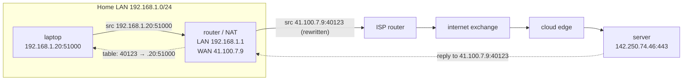
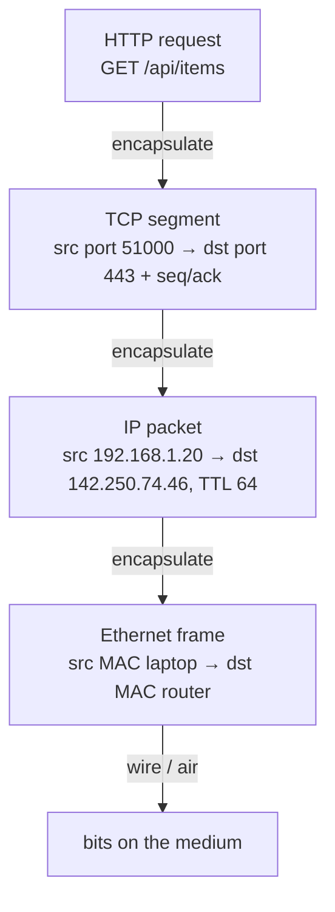
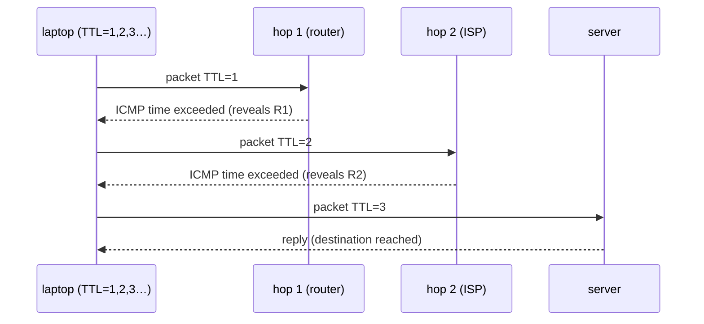

# Module 2.8 — الشبكات من الصفر: الحزم، IP، المنافذ، الطبقات
## Networking from Zero: packets, IP addresses, routing, ports, the layered model, NAT

> **المستوى:** Level 2 | **الموقع:** [8 من 13]
> **السابق:** [M2.7 — Concurrency & Event Loop](module-2.7-concurrency-event-loop.md) | **التالي:** [M2.9 — TCP & UDP](module-2.9-tcp-udp.md)

---

## 1. المتطلبات
> **قبل أن تتعلم هذا، يجب أن تفهم:**
- [ ] IP = آلة، Port = عملية، localhost، `0.0.0.0` — [L0-M0.5](../level-0-absolute-foundations/module-05-processes-ports-localhost.md)
- [ ] العميل/الخادم والشبكة تفشل بشكل طبيعي — [L0-M0.6](../level-0-absolute-foundations/module-06-network-client-server.md)
- [ ] البايتات والـ Buffer — [M2.1](module-2.1-bits-bytes-encoding.md)
- [ ] السوكت = fd، epoll — [M2.4](module-2.4-operating-systems.md)، [M2.7](module-2.7-concurrency-event-loop.md)

## 2. أهداف التعلّم
- شرح الشبكة كـ **تبديل حزم** (packet switching): بياناتك تُقطَّع إلى حزم مستقلة قد تضيع، تتأخر، تتكرر، أو تصل بترتيب مختلف.
- قراءة **عنوان IP** (v4/v6)، **قناع الشبكة/CIDR**، الفرق بين عنوان خاص وعام، وما **NAT** ولماذا لا يمكن لجهازك المنزلي استقبال اتصالات مباشرة.
- وصف **التوجيه** (routing): كيف تجد الحزمة طريقها عبر 15 موجّهًا، وما TTL و`traceroute`.
- رسم **الطبقات** (Link → IP → Transport → Application) وما تضيفه كل طبقة (encapsulation) ولماذا الطبقات تجعل الإنترنت ممكنًا.
- فهم **المنفذ** كحقل في ترويسة طبقة النقل، و**الرباعية** (4-tuple) التي تعرّف اتصالًا، ولماذا 65,535 منفذًا تكفي لملايين الاتصالات.
- استخدام `ip addr`, `ping`, `traceroute`, `ss`/`netstat`, `tcpdump` للتشخيص الأولي.

---

## 3. شرح للمبتدئ

### الفكرة الأم: الحزم لا الأنابيب
لا يوجد "خط" بين حاسوبك والخادم. بياناتك (رسالة 1MB) تُقطَّع إلى **حزم** (packets) صغيرة (~1,500 بايت كحد أقصى — **MTU**)، كل حزمة تحمل **عنوان المصدر والوجهة** وتسافر **مستقلة**: قد تمرّ من طريق مختلف، تصل متأخرة، تصل **بترتيب مختلف**، تُكرَّر، أو **تضيع** (موجّه مزدحم يرميها ببساطة). الإنترنت **لا يَعِد بشيء** سوى "سأحاول" — **best effort**. كل ما يبدو موثوقًا (TCP، M2.9) مبنيّ فوق هذا الأساس غير الموثوق بالبرمجيات. L0-M0.6 قال "الشبكة تفشل بشكل طبيعي" — هذا هو السبب الفيزيائي.

لماذا صُمّم هكذا؟ **المرونة**: لا حالة في الوسط، موجّه يسقط فالحزم تسلك طريقًا آخر؛ و**المشاركة**: ملايين المحادثات تتقاسم نفس الكوابل بحزم متداخلة.

### العناوين: IP
- **IPv4**: 32 بت (M2.1) = 4 أرقام 0–255: `142.250.74.46`. ~4.3 مليار — **نفدت**.
- **IPv6**: 128 بت، hex بـ 8 مجموعات: `2a00:1450:4007:80e::200e` (`::` = أصفار مضغوطة). كافية للأبد؛ الاعتماد تدريجي.
- **CIDR**: `10.0.0.0/8` = أول 8 بتات ثابتة (الشبكة)، الباقي للأجهزة (16M عنوان). `/24` = 256 عنوان. `/32` = جهاز واحد. ستراه في قواعد الجدار الناري وVPC (L5-M13).
- **نطاقات خاصة** (لا تُوجَّه على الإنترنت): `10.0.0.0/8`, `172.16.0.0/12`, `192.168.0.0/16`. **`127.0.0.0/8`** = loopback (الجهاز نفسه؛ لا يغادر). **`0.0.0.0`** = "كل الواجهات" عند الاستماع (L0-M0.5).
- جهازك له **عدة واجهات** (interfaces)، كلٌّ بعنوان: `lo` (127.0.0.1)، `eth0`/`wlan0` (192.168.1.x)، `docker0` (172.17.0.1)… `ip addr` يعرضها.

### NAT: لماذا جهازك مخفي
شبكتك المنزلية/شركتك تستخدم عناوين خاصة؛ الموجّه (router) لديه **عنوان عام واحد**. عندما يرسل `192.168.1.20:51000` حزمة إلى `142.250.74.46:443`، الموجّه **يستبدل** المصدر بـ `<public-ip>:<port-X>` ويسجّل الخريطة في جدول؛ الرد يأتي إلى `port-X` فيُعاد توجيهه إليك. هذا **NAT** (Network Address Translation).

النتائج التي ستصطدم بها:
- **لا أحد من الخارج يستطيع بدء اتصال إليك** (لا مدخل في جدول NAT) → "لماذا لا يصل صديقي إلى خادمي على 192.168.1.20:3000؟" (L0-M0.5). الحلول: port forwarding، أو نفق (ngrok)، أو انشر على خادم بعنوان عام.
- **الاتصالات الخاملة تُحذف** من جدول NAT بعد دقائق → WebSocket يموت صامتًا بلا FIN → **keepalive/heartbeat** (M2.9، M2.12).
- السحابة نفسها تستخدم NAT (الحاويات، VPC NAT gateway) — نفس القواعد.

### التوجيه: كيف تجد الحزمة طريقها
كل جهاز/موجّه لديه **جدول توجيه** (routing table): "الوجهة في `192.168.1.0/24`؟ أرسل مباشرة عبر `eth0`. أي شيء آخر (`0.0.0.0/0` = **default gateway**)؟ أرسل إلى الموجّه `192.168.1.1`". الموجّه يفعل الشيء نفسه بجدول أكبر، وهكذا **قفزة بقفزة** (hop by hop) — لا أحد يعرف الطريق كاملًا؛ كل موجّه يعرف "الخطوة التالية الأفضل" فقط. موجّهات الإنترنت الكبرى تتبادل جداولها بـ **BGP** (⚪؛ لكن اعلم أن "انقطاع BGP" هو سبب حوادث إنترنت شهيرة مثل Facebook 2021).

**TTL** (Time To Live): عدّاد في كل حزمة (مثلًا 64) ينقص 1 عند كل موجّه؛ عند 0 تُرمى ويُرسَل خطأ ICMP "time exceeded" للمصدر. يمنع الحزم من الدوران للأبد — و**`traceroute` يستغله**: يرسل حزمًا بـ TTL=1، 2، 3… فيكشف كل موجّه بالترتيب.

**ICMP**: بروتوكول رسائل التحكم: `ping` (echo request/reply)، "destination unreachable"، "time exceeded". ليس له منافذ؛ كثير من الجدران النارية تحجبه (ping يفشل ≠ الخادم ميت!).

### الطبقات: لماذا يعمل الإنترنت أصلًا
كل طبقة تحل مشكلة واحدة وتعتمد على التي تحتها دون معرفة تفاصيلها:

| الطبقة | المشكلة | الوحدة | العنوان | أمثلة |
|---|---|---|---|---|
| **4. Application** | معنى البيانات | رسالة | URL/اسم | HTTP, DNS, TLS, SMTP |
| **3. Transport** | **أي عملية**؟ موثوقية؟ | segment/datagram | **Port** | TCP, UDP, QUIC |
| **2. Internet (IP)** | **أي جهاز** عبر العالم؟ | packet | **IP** | IPv4, IPv6, ICMP |
| **1. Link** | أي جهاز على **نفس السلك/الهواء**؟ | frame | **MAC** | Ethernet, Wi-Fi, ARP |

**التغليف** (encapsulation): طلب HTTP يُغلَّف داخل segment TCP (يضيف ترويسة بالمنافذ)، داخل packet IP (يضيف ترويسة بالعناوين)، داخل frame Ethernet (يضيف MAC). عند الاستقبال يُفكّ العكس. لذلك عندما تقرأ `tcpdump` ترى الترويسات متداخلة. و**لهذا يمكن استبدال طبقة بأخرى دون تغيير البقية**: HTTP نفسه فوق TCP أو QUIC؛ IP نفسه فوق Wi-Fi أو ألياف أو 5G.

**MAC** (48 بت، `aa:bb:cc:dd:ee:ff`) يعمل فقط داخل الشبكة المحلية؛ **ARP** يسأل "من يملك IP 192.168.1.1؟ أعطني MAC" — وهو أول ما يحدث قبل أي حزمة تغادر جهازك.

### المنافذ والرباعية
المنفذ (16 بت = 0–65535) حقل في ترويسة **طبقة النقل**، لا IP. الاتصال يُعرَّف بـ **4-tuple**: `(src IP, src port, dst IP, dst port)` (+ البروتوكول). لذلك:
- خادم واحد على `:443` يخدم ملايين الاتصالات: كلها تشترك في `dst port 443` لكن تختلف في `src IP/port`.
- العميل يحصل على **منفذ مؤقّت** (ephemeral، عادة 32768–60999) تختاره النواة لكل اتصال صادر — لهذا ترى `51000` عشوائيًا في `ss`.
- منافذ **< 1024** تحتاج صلاحيات root (أو `CAP_NET_BIND_SERVICE`) — لهذا تطوّر على 3000/8080 وتضع proxy على 80/443.
- **Well-known**: 22 SSH، 53 DNS، 80 HTTP، 443 HTTPS، 5432 PostgreSQL، 6379 Redis، 3306 MySQL.

**الجدار الناري** (firewall): قواعد على `(IP, port, protocol)` تسمح/ترفض. `ECONNREFUSED` = وصلت لكن لا أحد يستمع (أو رفض صريح)؛ `ETIMEDOUT` = حُذفت صامتةً (جدار ناري/NAT/مسار ميت) — نفس ثلاثية L0-M0.5 الآن بسببها الفيزيائي.

---

## 4. النموذج الذهني

```
بياناتك → حزم مستقلة ≤1500B → best effort: ضياع/تأخير/ترتيب/تكرار   ← الموثوقية تُبنى فوقه (TCP)
IP = أي جهاز (v4 32b نفدت، v6 128b) | CIDR /n | خاص 10/172.16/192.168 | 127 loopback
NAT: خاص↔عام عبر جدول → لا اتصالات واردة + الخامل يُحذف → keepalive
Routing: قفزة بقفزة بجداول؛ default gateway؛ TTL ينقص؛ traceroute يستغله؛ ping = ICMP (قد يُحجب)
Layers: Link(MAC) → IP(address) → Transport(port) → App(meaning) — تغليف؛ استبدال طبقة بلا مسّ البقية
Port في طبقة النقل؛ اتصال = 4-tuple؛ ephemeral للعميل؛ <1024 root
```

## 5. الرسم التوضيحي







## 6. مثال بسيط

```bash
ip addr                             # واجهاتك وعناوينها (lo, eth0/wlan0, docker0) — macOS: ifconfig
ip route                            # جدول التوجيه: default via 192.168.1.1 dev wlan0
ping -c 3 1.1.1.1                   # ICMP: زمن الذهاب والإياب (RTT)؛ فشله لا يعني موت الخادم
traceroute -n 1.1.1.1               # القفزات (TTL)؛ * = موجّه لا يرد على ICMP
ss -tulpn                           # من يستمع على أي منفذ (-l listening، -p process) — netstat -tulpn قديمًا
ss -tn state established            # الاتصالات الحية: لاحظ الرباعية والمنافذ المؤقتة
curl -s ifconfig.me; echo           # عنوانك العام (بعد NAT) ≠ ip addr
sudo tcpdump -i any -n port 3000 -c 10   # شاهد حزمًا حقيقية (شغّل خادمًا على 3000 واطلبه)
```

## 7. مثال كود

```typescript
// src/net-probe.ts — ما يراه Node من الشبكة، وتجربة الثلاثية ECONNREFUSED / ETIMEDOUT / نجاح على مستوى الحزم
import os from "node:os";
import net from "node:net";
import { isIP } from "node:net";

// 1) الواجهات والعناوين: الجهاز له عدة عناوين، وليس "عنوان واحد"
for (const [name, addrs] of Object.entries(os.networkInterfaces())) {
  for (const a of addrs ?? []) console.log(`${name.padEnd(10)} ${a.family.padEnd(5)} ${a.address.padEnd(40)} ${a.internal ? "(loopback)" : a.cidr}`);
}

// 2) تصنيف عناوين (يفيد في قواعد الأمان: لا تسمح لخادمك بطلب عناوين داخلية — SSRF, L5-M4)
const isPrivate = (ip: string) => {
  if (isIP(ip) !== 4) return ip === "::1" || ip.startsWith("fc") || ip.startsWith("fd") || ip.startsWith("fe80");
  const [a, b] = ip.split(".").map(Number) as [number, number];
  return a === 10 || a === 127 || (a === 172 && b >= 16 && b <= 31) || (a === 192 && b === 168) || (a === 169 && b === 254);
};
for (const ip of ["8.8.8.8", "10.0.0.5", "172.20.1.1", "192.168.1.20", "127.0.0.1", "169.254.169.254", "::1"]) console.log(ip.padEnd(18), isPrivate(ip) ? "private/internal" : "public");

// 3) الثلاثية على مستوى TCP (M2.9 يشرح الآلية؛ هنا نراقب فقط)
async function probe(host: string, port: number, timeoutMs = 2000) {
  const t = performance.now();
  return new Promise<string>(resolve => {
    const s = net.connect({ host, port });
    s.setTimeout(timeoutMs);
    s.once("connect", () => { const local = s.localPort; s.destroy(); resolve(`connected in ${(performance.now() - t).toFixed(0)}ms  (src port ${local} = ephemeral)`); });
    s.once("timeout", () => { s.destroy(); resolve(`ETIMEDOUT after ${timeoutMs}ms  (حزمنا رُميت صامتة: جدار ناري/NAT/مسار ميت)`); });
    s.once("error", (e: NodeJS.ErrnoException) => resolve(`${e.code}  (${e.code === "ECONNREFUSED" ? "وصلت الحزمة، لا أحد يستمع → RST" : e.message})`));
  });
}
console.log("\n127.0.0.1:1       →", await probe("127.0.0.1", 1));          // ECONNREFUSED فورًا
console.log("1.1.1.1:443       →", await probe("1.1.1.1", 443));          // connected (إن كان الإنترنت متاحًا)
console.log("10.255.255.1:80   →", await probe("10.255.255.1", 80));      // ETIMEDOUT غالبًا (خاص، لا طريق)
```

## 8. مثال من العالم الحقيقي
- "يعمل على جهازي" للخادم المحلي وصديقك لا يصل: NAT + جدار ناري. ngrok/Cloudflare Tunnel ينشئان اتصالًا **صادرًا** من جهازك (مسموح) ويمرّران الطلبات عبره.
- Docker: كل حاوية في شبكة `172.17.0.0/16` خلف NAT من `docker0`؛ `-p 8080:3000` = port forwarding. وداخل Compose، أسماء الخدمات تُحل إلى IPs خاصة (M2.10).
- VPC في السحابة: شبكات خاصة بـ CIDR تختاره، subnets عامة/خاصة، NAT gateway للصادر، security groups = جدار ناري على الرباعية (L5-M13).
- `169.254.169.254`: عنوان **metadata** في السحابة (بيانات اعتماد!) — سبب هجمات SSRF شهيرة (Capital One 2019). لذلك دالة `isPrivate` أعلاه ليست تمرينًا نظريًا.

## 9. مثال من الإنتاج
**حادثة "WebSocket يموت بعد 5 دقائق من الصمت":** تطبيق دردشة؛ المستخدمون الخاملون يتوقفون عن استقبال رسائل بلا أي خطأ في الخادم أو العميل. السبب: NAT في شبكة الشركة (وموازن الحمل السحابي، مهلته 350s) **يحذف** مدخل الاتصال الخامل؛ الطرفان يظنان الاتصال حيًا (لا FIN، لا RST — الحزم تختفي فقط). أول رسالة بعدها تضيع، وTCP يعيد المحاولة لدقائق قبل أن يعلن الفشل. الإصلاح: **ping/pong كل 30 ثانية** على مستوى WebSocket + مهلة على العميل لإعادة الاتصال عند غياب pong، + `keepAlive` TCP كشبكة أمان. **الدرس:** الاتصال "المفتوح" ادّعاء محلي؛ الشبكة لا تضمن إبلاغك بموته.

## 10. مفاهيم خاطئة شائعة

| ❌ | ✅ |
|---|---|
| "هناك اتصال/خط بيننا" | حزم مستقلة؛ "الاتصال" حالة في الطرفين فقط (TCP). |
| "ping يفشل = الخادم ميت" | ICMP محجوب غالبًا؛ جرّب المنفذ الفعلي. |
| "IP الخاص بي هو 192.168.x" | هذا الخاص؛ العام مختلف (NAT)؛ وقد يتغير. |
| "المنفذ جزء من عنوان IP" | المنفذ في طبقة النقل (TCP/UDP)؛ ICMP لا منافذ له. |
| "65k منفذ = 65k اتصال كحد أقصى للخادم" | الحد على الرباعية؛ خادم على منفذ واحد يخدم ملايين. الحد الفعلي: fds/ذاكرة. |
| "ETIMEDOUT وECONNREFUSED نفس الشيء" | رُفض صراحةً (وصل) vs لا جواب (رُمي). تشخيصان مختلفان. |

## 11. أخطاء شائعة
1. الاستماع على `127.0.0.1` داخل حاوية/VM ثم الاستغراب أن الخارج لا يصل (L0-M0.5).
2. حجب ICMP كليًا → كسر Path MTU Discovery (حزم كبيرة تختفي بغموض).
3. السماح للخادم بطلب أي URL يعطيه المستخدم بلا فحص العناوين الخاصة → SSRF.
4. اعتبار IP المصدر هوية موثوقة (NAT: آلاف المستخدمين خلف IP واحد؛ والعكس).
5. نسيان أن كل قفزة تضيف زمنًا: RTT 1ms محليًا، 20ms داخل القارة، 150–300ms عبر المحيطات — صمّم عدد الرحلات لا الحجم فقط (M2.12).

## 12. تمرين تصحيح

```
$ curl http://10.0.2.15:3000/health      # من حاوية أخرى في نفس الـ VPC
curl: (28) Connection timed out after 30001 ms
$ # على الخادم المستهدف:
$ ss -tulpn | grep 3000
tcp  LISTEN 0 511  127.0.0.1:3000  0.0.0.0:*  users:(("node",pid=812))
$ ping 10.0.2.15                           # من المصدر
3 packets transmitted, 0 received
```
ما السببان المحتملان المنفصلان؟ أيهما يفسّر timeout (لا refused)؟ ما ترتيب التحقق؟

<details><summary>💡 الحل</summary>

1. **الخادم يستمع على `127.0.0.1` فقط** → من الخارج يجب أن ترى `ECONNREFUSED` (الحزمة تصل، النواة ترد RST)... **لكن** رأينا **timeout** → إذن الحزم **لا تصل أصلًا**: السبب الثاني.
2. **جدار ناري/security group** يرمي الحزم (وأيضًا يحجب ICMP → ping 0 received). الـ timeout دليل الرمي الصامت، لا الرفض.
3. الترتيب: (أ) أصلح security group ليسمح بـ TCP 3000 من CIDR المصدر → ستنتقل من timeout إلى **ECONNREFUSED** (تقدّم!)؛ (ب) ثم غيّر الاستماع إلى `0.0.0.0` → نجاح. ping قد يبقى فاشلًا إن بقي ICMP محجوبًا — لا تعتمد عليه.
4. أداة التأكيد في كل خطوة: `tcpdump -i any port 3000` على الخادم — هل تصل حزم SYN؟ هذا يفصل "لا تصل" عن "تصل وتُرفض" بلا تخمين.
</details>

## 13. تمرين معماري
صمّم شبكة لتطبيقك في السحابة: subnet عام لموازن الحمل، subnet خاص للخوادم، subnet خاص للـ DB. ما قواعد الجدار الناري (مصدر/وجهة/منفذ) بين الطبقات الثلاث بأقل صلاحيات؟ كيف تخرج الخوادم إلى الإنترنت (تحديثات، APIs خارجية) دون أن تكون قابلة للوصول (NAT gateway)؟ كيف يدخل المطورون (bastion/VPN)؟ أين تضع فحص `isPrivate` لمنع SSRF؟ ACTRR.

## 14. الصلة بعصر AI
AI يولّد إعدادات شبكة تفتح `0.0.0.0/0` على كل المنافذ "ليعمل الآن"، ويخلط IP الخاص بالعام في الشروح. عند أي إعداد بنية تحتية مولَّد، افحص كل قاعدة تحتوي `0.0.0.0/0` واسأل "لماذا؟". أما لتشخيص `ETIMEDOUT` vs `ECONNREFUSED`، أعطه مخرجات `ss`/`tcpdump` الحقيقية — يحلّلها جيدًا.

## 15. ما يجب إتقانه (Must Master) 🔴
- 🔴 الحزم المستقلة وbest effort؛ IPv4/v6 وCIDR والنطاقات الخاصة وloopback؛ NAT ونتيجتاه (لا وارد، الخامل يُحذف)؛ الطبقات الأربع والتغليف؛ المنفذ في طبقة النقل والرباعية؛ `ETIMEDOUT` (رُمي) vs `ECONNREFUSED` (رُفض).

## 16. ما يجب فهمه (Should Understand) 🟠
- 🟠 التوجيه قفزة بقفزة وdefault gateway؛ TTL/traceroute/ICMP؛ MAC/ARP؛ المنافذ المؤقتة و<1024؛ أدوات `ip`, `ss`, `tcpdump`؛ SSRF والعناوين الداخلية؛ RTT حسب المسافة.

## 17. ما يمكن تأجيله (Can Defer) ⚪
- ⚪ BGP؛ تفاصيل IPv6 (SLAAC، NDP)؛ MTU/PMTUD وتجزئة الحزم؛ VLANs؛ SDN؛ الطبقات السبع لـ OSI (اعرف أن الناس يقولون "Layer 7 = HTTP، Layer 4 = TCP").

## 18. الخلاصة
1. الإنترنت = **حزم مستقلة** بجهد أفضل؛ كل موثوقية تُبنى فوقه برمجيًا.
2. IP يحدد الجهاز (CIDR للنطاقات، خاص vs عام، 127 لنفسك)؛ **NAT** يخفي الخاص ويحذف الخامل.
3. التوجيه قفزة بقفزة بجداول؛ TTL يمنع الدوران ويمكّن traceroute.
4. **الطبقات**: Link → IP → Transport → Application، بالتغليف؛ لذلك يمكن تبديل طبقة بلا مسّ البقية.
5. المنفذ حقل في طبقة النقل؛ الاتصال = رباعية؛ خادم واحد على منفذ واحد يخدم ملايين.
6. `ETIMEDOUT` = رُميت صامتة؛ `ECONNREFUSED` = وصلت ورُفضت. `tcpdump` يحسم.

## 19. مراجع رسمية
- RFC 791 — Internet Protocol: https://www.rfc-editor.org/rfc/rfc791
- RFC 1918 — Private Address Space: https://www.rfc-editor.org/rfc/rfc1918
- RFC 4632 — CIDR: https://www.rfc-editor.org/rfc/rfc4632
- MDN — How the Internet works: https://developer.mozilla.org/en-US/docs/Learn_web_development/Howto/Web_mechanics/How_does_the_Internet_work
- Cloudflare Learning — What is NAT? / What is routing?: https://www.cloudflare.com/learning/network-layer/what-is-routing/
- Linux man-pages — `ip(8)`, `ss(8)`, `tcpdump(1)`: https://man7.org/linux/man-pages/man8/ss.8.html

## المصطلحات
| العربية | English |
|---|---|
| تبديل الحزم | Packet switching |
| حزمة | Packet |
| جهد أفضل | Best effort |
| وحدة الإرسال القصوى | MTU |
| قناع الشبكة / CIDR | Subnet mask / CIDR |
| عنوان خاص / عام | Private / Public address |
| ترجمة عناوين الشبكة | NAT |
| واجهة شبكة | Network interface |
| حلقة رجوع | Loopback |
| توجيه / جدول توجيه | Routing / Routing table |
| البوابة الافتراضية | Default gateway |
| قفزة | Hop |
| مدة البقاء | TTL (Time To Live) |
| تغليف | Encapsulation |
| طبقة الربط / الإنترنت / النقل / التطبيق | Link / Internet / Transport / Application layer |
| عنوان MAC | MAC address |
| الرباعية | 4-tuple |
| منفذ مؤقت | Ephemeral port |
| جدار ناري | Firewall |
| زمن الذهاب والإياب | RTT (Round-Trip Time) |
| تزوير طلب من جهة الخادم | SSRF |

> **التالي:** [Module 2.9 — TCP & UDP](module-2.9-tcp-udp.md)
