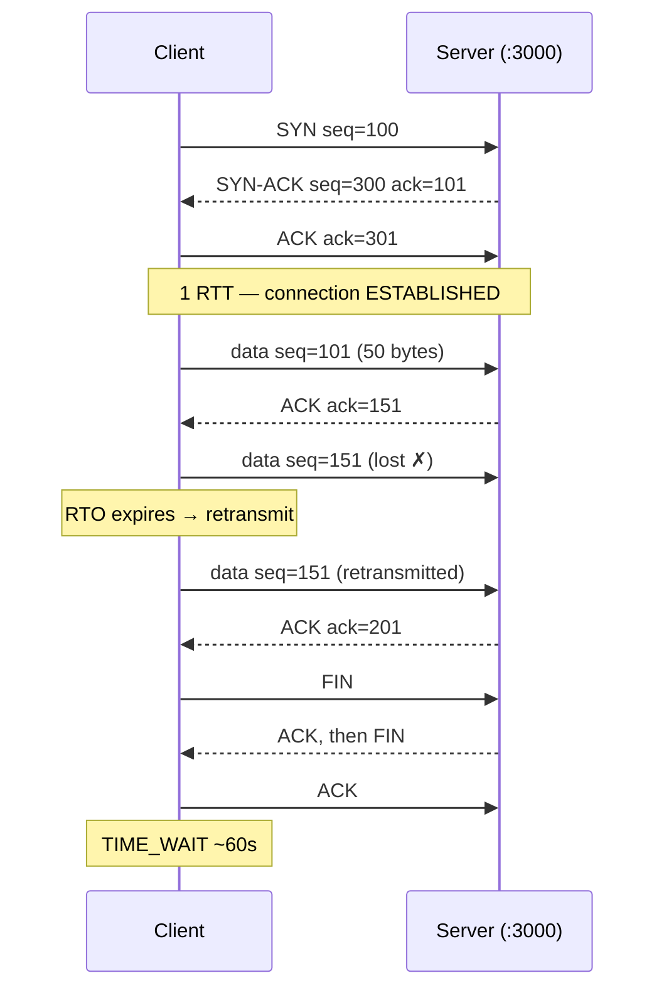
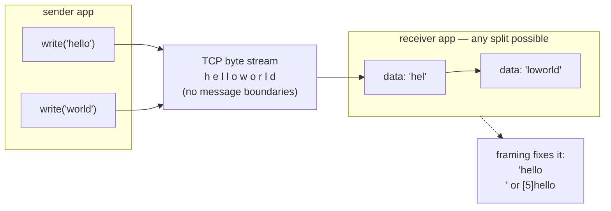
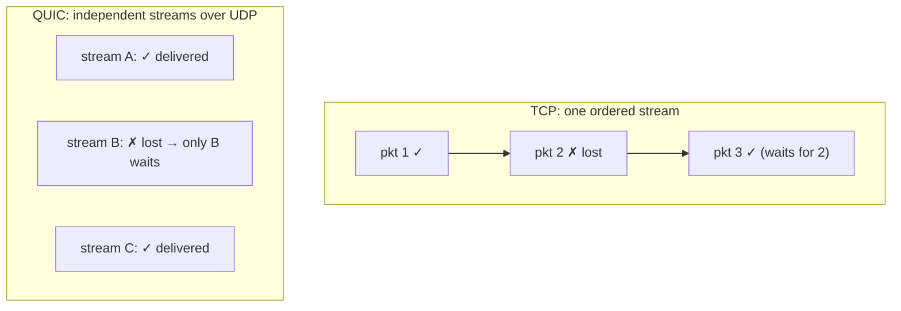

# Module 2.9 — TCP و UDP: كيف تُبنى الموثوقية فوق حزم غير موثوقة
## TCP & UDP: handshake, sequence/ack, retransmission, flow/congestion control, streams vs datagrams, QUIC

> **المستوى:** Level 2 | **الموقع:** [9 من 13]
> **السابق:** [M2.8 — Networking from Zero](module-2.8-networking-from-zero.md) | **التالي:** [M2.10 — DNS](module-2.10-dns.md)

---

## 1. المتطلبات
> **قبل أن تتعلم هذا، يجب أن تفهم:**
- [ ] الحزم المستقلة، best effort، الرباعية، المنافذ — [M2.8](module-2.8-networking-from-zero.md)
- [ ] السوكت = fd، epoll، non-blocking — [M2.4](module-2.4-operating-systems.md)، [M2.7](module-2.7-concurrency-event-loop.md)
- [ ] Buffer والبايتات — [M2.1](module-2.1-bits-bytes-encoding.md)

## 2. أهداف التعلّم
- شرح **المصافحة الثلاثية** (SYN/SYN-ACK/ACK) ولماذا تكلّف **رحلة كاملة** (1 RTT) قبل أول بايت، وتفسير `ECONNREFUSED` (RST) و`ETIMEDOUT` (SYN بلا رد) على مستوى الحزم.
- وصف كيف يحوّل TCP حزمًا غير موثوقة إلى **تيار بايتات** موثوق مرتّب: أرقام تسلسل، إقرارات (ACK)، إعادة الإرسال بمهلة (RTO).
- فهم **التحكم بالتدفق** (نافذة المستقبِل) و**التحكم بالازدحام** (slow start) ولماذا الاتصال الجديد بطيء ولماذا الضياع يقلّص السرعة.
- استيعاب أهم حقيقة عملية: **TCP تيار بلا حدود رسائل** — `data` قد يصل مقسّمًا أو مدموجًا، وعليك **التأطير** (framing) بنفسك.
- فهم الإغلاق (FIN/RST)، `TIME_WAIT`، نصف-مفتوح، keepalive، ولماذا الاتصال الميت قد يبدو حيًا.
- مقارنة **UDP** (رسائل مستقلة، بلا ضمانات، بلا مصافحة) ومتى يُفضَّل (DNS، صوت/فيديو، ألعاب)، و**QUIC** كـ "TCP+TLS فوق UDP".
- كتابة خادم وعميل TCP بـ `node:net` مع تأطير صحيح.

---

## 3. شرح للمبتدئ

### المشكلة والحلّان
M2.8: الحزم تضيع وتتأخر وتتكرر وتصل بترتيب مختلف. طبقة النقل تقدّم خيارين:
- **UDP** (User Datagram Protocol): أضف **منافذ** و**checksum** فقط. أرسل datagram → قد يصل أو لا، مرة أو أكثر، بأي ترتيب. **بلا اتصال، بلا مصافحة، بلا حالة**. 8 بايت ترويسة. الأبسط والأسرع.
- **TCP** (Transmission Control Protocol): ابنِ فوق الحزم **تيار بايتات موثوقًا مرتّبًا ثنائي الاتجاه** بين عمليتين. يحتاج **اتصالًا** (حالة في الطرفين) ومصافحة وإقرارات وإعادة إرسال. 20+ بايت ترويسة ورحلات إضافية.

### المصافحة الثلاثية: ثمن "الاتصال"
```
Client ──SYN (seq=x)──────────▶ Server     "أريد اتصالًا، رقمي الأول x"
Client ◀─SYN-ACK (seq=y, ack=x+1)─ Server  "موافق، رقمي y، استلمت x"
Client ──ACK (ack=y+1)────────▶ Server     "استلمت y"  (+ يمكن إرسال بيانات الآن)
```
- **1 RTT كامل** قبل أول بايت بيانات. على مسافة 150ms = 150ms ضائعة لكل اتصال جديد. **لهذا keep-alive و connection pools مهمة** (M2.12): أعد استخدام الاتصال بدل إعادة المصافحة.
- **`ECONNREFUSED`**: SYN وصل إلى جهاز، لكن **لا عملية تستمع على المنفذ** → النواة ترد بـ **RST** (reset) فورًا. سريع وحاسم.
- **`ETIMEDOUT`**: SYN رُمي (جدار ناري/NAT/جهاز مطفأ). العميل يعيد SYN بفواصل متزايدة (1s, 2s, 4s… ~2 دقيقة على Linux افتراضيًا) ثم يستسلم. **لهذا تضع مهلة اتصال خاصة بك** (L0-M0.6 AbortController) — لا تنتظر النواة.
- **backlog**: الاتصالات المصافَحة تنتظر في طابور حتى يستدعي الخادم `accept()`؛ إن امتلأ (الخادم محجوب، M2.7!) تُرمى SYNs الجديدة → العملاء يرون timeout رغم أن الخادم "يعمل".

### الموثوقية: التسلسل، الإقرار، إعادة الإرسال
كل بايت له **رقم تسلسل** (sequence number). المستقبِل يرسل **ACK** = "استلمت كل شيء حتى الرقم N". المرسل يحتفظ بما لم يُقرّ به؛ إن لم يصل ACK خلال **RTO** (retransmission timeout، يُحسب من RTT المقاس) → **يعيد الإرسال**. حزمة وصلت بترتيب خاطئ؟ تُخزَّن ولا تُسلَّم للتطبيق حتى تصل الفجوة (**head-of-line blocking** — تذكر هذا لـ QUIC). حزمة مكررة؟ تُرمى (الرقم مرئي). النتيجة: التطبيق يرى تيارًا مثاليًا، و**لا يرى أبدًا** أن 3% من الحزم أُعيد إرسالها — إلا كزمن أطول.

### التحكم بالتدفق والازدحام: لماذا السرعة تتغير
- **Flow control** (نافذة المستقبِل، rwnd): المستقبِل يعلن "لديّ مكان لـ 64KB فقط". إن لم يقرأ التطبيق (`socket.pause()`، أو حلقة محجوبة)، تمتلئ النافذة ويتوقف المرسل. هذا هو **backpressure** الحقيقي (L1-M1.10 `pipe/pipeline`): الضغط العكسي يمتد من مستهلك بطيء عبر TCP إلى منتج بعيد. **لهذا `write()` يعيد `false`** و`drain` موجود.
- **Congestion control** (نافذة الازدحام، cwnd): المرسل لا يعرف سعة الطريق، فيبدأ صغيرًا (**slow start**: ~10 حزم ≈ 14KB) ويضاعف كل RTT حتى يحدث ضياع، ثم يقلّص بشدة ويعاود النمو ببطء (AIMD، أو خوارزميات أحدث: CUBIC، BBR). النتائج: **الاتصال الجديد بطيء في أول رحلاته** (سبب آخر لإعادة الاستخدام)، **الضياع = انهيار السرعة** (Wi-Fi سيئ)، و"عرض النطاق" ليس رقمًا ثابتًا بل نتيجة تفاوض مستمر.

**عمليًا**: زمن طلب HTTP صغير على اتصال جديد = DNS + 1 RTT (TCP) + 1–2 RTT (TLS) + 1 RTT (الطلب) — **3–4 رحلات** قبل أن ترى بايتًا. على 100ms RTT = 300–400ms رغم أن البيانات 2KB. **قلّل الرحلات لا البايتات** (M2.12).

### الحقيقة الأهم للمبرمج: TCP تيار، لا رسائل
ترسل `socket.write("hello")` ثم `socket.write("world")`. الطرف الآخر قد يستلم: `"helloworld"` في حدث واحد، أو `"hel"` ثم `"loworld"`، أو أي تقسيم. **TCP لا يحفظ حدود الكتابات** — هو أنبوب بايتات. كل بروتوكول فوق TCP يجب أن يعرّف **التأطير** (framing): كيف يعرف المستقبِل أين تنتهي الرسالة؟ ثلاث طرق كلاسيكية:
1. **محدِّد** (delimiter): سطر جديد `\n` (Redis القديم، SMTP، سطور HTTP headers).
2. **بادئة طول** (length prefix): أول 4 بايت = طول الرسالة (بروتوكولات ثنائية، HTTP/2 frames، `Content-Length` في HTTP/1.1 للجسم).
3. **إغلاق الاتصال** = نهاية الرسالة (HTTP/1.0).

**كل** مشروع HTTP الذي ستبنيه في Project 3 يدور حول هذا: تجميع chunks حتى `\r\n\r\n` ثم قراءة `Content-Length` بايت. من يفترض أن `data` واحدًا = طلب واحد يكتب خادمًا يعمل محليًا (حزم صغيرة سريعة) وينهار في الإنتاج.

### الإغلاق وحالاته
- **FIN**: "انتهيت من الإرسال" (كل طرف يرسل FIN خاصًا به → **إغلاق نصفي** ممكن: أغلقتُ الإرسال وما زلت أقرأ). `socket.end()` = FIN. حدث `end` = استلمت FIN من الطرف الآخر.
- **RST**: إنهاء فوري/خطأ: كتابة على اتصال أغلقه الآخر، أو عملية ماتت، أو منفذ مغلق. ترى `ECONNRESET` — وغالبًا يعني **"الطرف الآخر أسقط الاتصال بلا FIN"** (انهار، قُتل، أو مهلة proxy).
- **TIME_WAIT**: من يغلق أولًا ينتظر ~60s قبل إعادة استخدام الرباعية (لضمان موت الحزم المتأخرة). خادم يفتح/يغلق آلاف الاتصالات الصادرة بسرعة (بلا pool!) يستنفد المنافذ المؤقتة: `EADDRNOTAVAIL`. الحل: **pool وkeep-alive** — مرة أخرى.
- **نصف-مفتوح/ميت**: إن انقطع الكابل أو حُذف مدخل NAT (M2.8)، **لا FIN ولا RST** يصل؛ الطرفان يظنان الاتصال حيًا. يُكتشف فقط عند **محاولة الكتابة** (إعادة إرسال تفشل بعد دقائق) أو بـ **TCP keepalive** (`socket.setKeepAlive(true, 30_000)`: مسبارات دورية) أو بـ heartbeat في طبقة التطبيق. **القراءة وحدها لا تكشف الموت أبدًا.**

### UDP: متى تريد "لا ضمانات"
لأن TCP يدفع ثمن الترتيب (head-of-line blocking) وإعادة الإرسال، بعض التطبيقات تفضّل خسارة حزمة على انتظارها:
- **DNS** (M2.10): سؤال واحد صغير وجواب — المصافحة أغلى من الرسالة نفسها؛ إن ضاع، أعد السؤال.
- **صوت/فيديو مباشر، ألعاب**: إطار متأخر 200ms عديم القيمة؛ الأفضل تخطّيه.
- **مقاييس/سجلات بحجم ضخم** (StatsD): فقدان 0.1% مقبول مقابل صفر ضغط عكسي.
- التطبيق يضيف ما يحتاج فقط (أرقام تسلسل خاصة، FEC، إعادة إرسال انتقائية).

**القيود**: حجم الرسالة الآمن ~1,200–1,400 بايت (أكبر = تجزئة IP = ضياع أكثر)، لا backpressure (ترسل بأسرع ما تريد والشبكة ترمي)، والجدران النارية/NAT أقل ودًّا معه.

### QUIC وHTTP/3: إعادة بناء TCP فوق UDP
TCP في النواة ويتطور ببطء، وله head-of-line blocking على مستوى الاتصال، ومصافحته منفصلة عن TLS. **QUIC** (2021، RFC 9000) يعيد بناء الموثوقية والتحكم بالازدحام **في فضاء المستخدم فوق UDP**، مع TLS 1.3 مدمج: **0–1 RTT** للاتصال الآمن، **تيارات مستقلة** (ضياع حزمة في تيار لا يوقف الآخرين)، و**هجرة الاتصال** (تنتقل من Wi-Fi إلى 4G بلا قطع). **HTTP/3 = HTTP فوق QUIC** (M2.12). الدرس المعماري: الطبقات (M2.8) سمحت باستبدال النقل دون مسّ HTTP دلاليًا.

---

## 4. النموذج الذهني

```
UDP: datagrams مستقلة، منافذ+checksum، لا اتصال/ترتيب/ضمان، 0 RTT → DNS، صوت/فيديو، مقاييس
TCP: تيار بايتات موثوق مرتّب ثنائي الاتجاه؛ حالة في الطرفين
  handshake SYN/SYN-ACK/ACK = 1 RTT   (RST فوري = ECONNREFUSED؛ لا رد = ETIMEDOUT)
  seq + ACK + RTO retransmit + reorder buffer  → التطبيق يرى تيارًا مثاليًا (أبطأ فقط)
  rwnd (flow = backpressure حقيقي) + cwnd (slow start؛ ضياع = تباطؤ) → الاتصال الجديد بطيء → أعد الاستخدام
  ★ تيار بلا حدود رسائل → التأطير: delimiter | length-prefix | close
  FIN (end) / RST (ECONNRESET) / TIME_WAIT (استنفاد منافذ بلا pool) / نصف-مفتوح لا يُكتشف إلا بكتابة أو keepalive
QUIC = موثوقية + TLS 1.3 فوق UDP؛ تيارات مستقلة؛ HTTP/3
```

## 5. الرسم التوضيحي







## 6. مثال بسيط

```bash
# شاهد المصافحة والإغلاق بعينيك
sudo tcpdump -i lo -n 'tcp port 3000' &
node -e "require('node:net').createServer(s=>{s.end('hi\n')}).listen(3000)" &
sleep 0.5; printf '' | nc 127.0.0.1 3000       # [S] → [S.] → [.] ثم بيانات ثم [F.] … [R] إن وُجد
kill %1 %2

ss -tan | awk '{print $1}' | sort | uniq -c   # حالات الاتصالات: ESTAB, TIME-WAIT, CLOSE-WAIT (كثير = تسرّب: لم تُغلق سوكتات)
cat /proc/sys/net/ipv4/tcp_keepalive_time     # 7200s افتراضيًا على Linux! (لهذا تضبطه من التطبيق)
```

## 7. مثال كود

```typescript
// src/framing.ts — خادم TCP بتأطير length-prefix + عميل يرسل 3 رسائل دفعة واحدة ليثبت أن TCP تيار
// (نفس المهارة التي يحتاجها Project 3 لتجميع طلب HTTP من chunks)
import net from "node:net";

// --- ترميز: [uint32 BE length][payload utf8]
const encode = (msg: string) => { const body = Buffer.from(msg, "utf8"); const head = Buffer.alloc(4); head.writeUInt32BE(body.length, 0); return Buffer.concat([head, body]); };

// --- فك: يتعامل مع أي تقسيم (رسالة في 3 chunks، أو 3 رسائل في chunk)
function createDecoder(onMessage: (msg: string) => void, maxLen = 1 << 20) {
  let buf = Buffer.alloc(0);
  return (chunk: Buffer) => {
    buf = Buffer.concat([buf, chunk]);                       // 1) جمّع
    for (;;) {
      if (buf.length < 4) return;                             // 2) لا طول كامل بعد → انتظر chunk آخر
      const len = buf.readUInt32BE(0);
      if (len > maxLen) throw new Error(`frame too large: ${len}`);   // حماية من DoS: لا تخصّص GBs لمدخل خبيث
      if (buf.length < 4 + len) return;                       // 3) الجسم غير مكتمل → انتظر
      onMessage(buf.subarray(4, 4 + len).toString("utf8"));  // 4) رسالة كاملة
      buf = buf.subarray(4 + len);                            // 5) ابقِ الباقي (قد يبدأ رسالة تالية)
    }
  };
}

const server = net.createServer(sock => {
  const peer = `${sock.remoteAddress}:${sock.remotePort}`;
  console.log(`[server] connection from ${peer} (4-tuple complete)`);
  let chunks = 0;
  const show = (m: string) => m.length > 40 ? `${m.slice(0, 12)}… (${m.length} chars)` : m;
  const decode = createDecoder(msg => { console.log(`[server] message: "${show(msg)}"`); sock.write(encode(msg.toUpperCase())); });
  sock.on("data", chunk => { chunks++; console.log(`[server] chunk #${chunks} of ${chunk.length} bytes`); decode(chunk); });
  sock.on("end", () => { console.log(`[server] FIN from ${peer} after ${chunks} chunk(s)`); sock.end(); });
  sock.on("error", e => console.log(`[server] ${(e as NodeJS.ErrnoException).code}`));   // ECONNRESET شائع — لا تدع العملية تنهار بسببه
  sock.setKeepAlive(true, 30_000);
  sock.setTimeout(60_000, () => { console.log("[server] idle timeout → destroy"); sock.destroy(); });   // لا تترك اتصالات ميتة
});

server.listen(0, "127.0.0.1", async () => {
  const { port } = server.address() as net.AddressInfo;
  const client = net.connect(port, "127.0.0.1");
  const replies: string[] = [];
  client.on("data", createDecoder(m => replies.push(m)));
  await new Promise(r => client.once("connect", r));
  console.log(`[client] connected, local ephemeral port ${client.localPort}`);

  // ثلاث رسائل في كتابة واحدة: الخادم قد يراها كـ chunk واحد — بلا تأطير لن يفرّقها
  client.write(Buffer.concat([encode("hello"), encode("tcp is a stream"), encode("not messages")]));
  // ورسالة واحدة مقسّمة على كتابتين (مع فاصل زمني): الخادم يرى chunk ناقصًا ثم تتمته
  const big = encode("x".repeat(20_000));
  client.write(big.subarray(0, 7));
  setTimeout(() => client.write(big.subarray(7)), 50);

  setTimeout(() => {
    console.log(`[client] got ${replies.length} replies: ${replies.map(r => r.length > 20 ? r.length + " chars" : `"${r}"`).join(", ")}`);
    client.end();                                               // FIN
    server.close();
  }, 300);
});
```

## 8. مثال من العالم الحقيقي
- متصفحك يفتح ~6 اتصالات TCP لكل مضيف في HTTP/1.1 (كل منها بمصافحة وslow start)؛ HTTP/2 يستخدم واحدًا بتيارات؛ HTTP/3 يستخدم QUIC (M2.12).
- `ECONNRESET` في سجلات الخادم عند النشر = العملاء الذين قُطعوا بلا إغلاق رشيق (M2.5).
- Redis/PostgreSQL/MySQL: بروتوكولات ثنائية خاصة فوق TCP بـ length-prefix؛ مكتبة العميل تفعل التأطير لك.
- WebRTC (مكالمات الفيديو) يستخدم UDP؛ عندما يُحجب يسقط إلى TCP وتسوء الجودة.

## 9. مثال من الإنتاج
**حادثة "EADDRNOTAVAIL كل مساء":** خدمة تستدعي API داخلية 2,000 مرة/ثانية؛ كل استدعاء `fetch` باتصال جديد (`Connection: close` بسبب إعداد agent خاطئ). كل اتصال مغلق يترك TIME_WAIT 60s → 2,000 × 60 = 120,000 رباعية مشغولة > ~28,000 منفذ مؤقت متاح → النواة ترفض فتح اتصالات جديدة: `connect EADDRNOTAVAIL`. ومع ذلك "الشبكة سليمة" و"الخادم المستهدف بخير". الإصلاح: **keep-alive agent + pool** (في Node 18+ `fetch` يستخدم undici بـ keep-alive افتراضيًا — لكن إعدادًا يدويًا كان يعطّله)؛ الاتصالات انخفضت إلى ~50 ثابتة، وزمن الاستجابة انخفض 40% لتوفير المصافحات وslow start. **الدرس:** الاتصال مورد مكلف الإنشاء وله ما بعد الموت؛ أعد استخدامه.

## 10. مفاهيم خاطئة شائعة

| ❌ | ✅ |
|---|---|
| "`write('msg')` يصل كرسالة واحدة" | تيار؛ أي تقسيم ممكن. أطّر بنفسك. |
| "TCP موثوق = الرسالة وصلت للتطبيق" | وصلت إلى **نواة** الطرف الآخر؛ قد تنهار العملية قبل القراءة. الموثوقية التطبيقية (ack في طبقتك) شيء آخر. |
| "الاتصال المفتوح حي" | قد يكون ميتًا منذ دقائق؛ القراءة لا تكشف؛ keepalive/heartbeat أو كتابة فقط. |
| "UDP سيئ لأنه غير موثوق" | أداة لحالات يفضَّل فيها التخطّي على الانتظار؛ وQUIC/HTTP/3 مبنية عليه. |
| "عرض النطاق ثابت" | cwnd يتفاوض باستمرار؛ الضياع يقلّصه؛ الاتصال الجديد يبدأ بطيئًا. |
| "ECONNRESET خطأ في كودي" | غالبًا الطرف الآخر أسقط الاتصال (نشر، proxy مهلة، انهيار). تعامل معه بهدوء وأعد المحاولة إن كان آمنًا (idempotency). |

## 11. أخطاء شائعة
1. افتراض `data` واحد = رسالة واحدة (يعمل محليًا، يفشل في الإنتاج).
2. لا حد لحجم الإطار → مدخل بـ length = 4GB يُسقط الخادم.
3. عدم معالجة `error` على السوكت → `ECONNRESET` غير ملتقط يُنهي العملية (M2.5).
4. اتصال جديد لكل طلب صادر (TIME_WAIT، مصافحات، slow start) → استخدم pool/keep-alive.
5. الاعتماد على keepalive النواة الافتراضي (ساعتان) → اضبطه من التطبيق أو heartbeat.
6. تجاهل `write()` يعيد `false` → تراكم في الذاكرة (backpressure مكسور، L1-M1.10).
7. datagrams UDP > 1,400 بايت → تجزئة وضياع.

## 12. تمرين تصحيح

```typescript
// خادم "دردشة" TCP: يعمل في الاختبار، وفي الإنتاج: رسائل مدموجة، رسائل ناقصة، وأحيانًا تنهار العملية
const server = net.createServer(sock => {
  sock.on("data", (chunk) => {
    const msg = JSON.parse(chunk.toString());          // ← 1
    broadcast(msg);
  });
  clients.add(sock);
  sock.on("end", () => clients.delete(sock));          // ← 2
});
function broadcast(msg) { for (const c of clients) c.write(JSON.stringify(msg)); }   // ← 3
```
السجل: `SyntaxError: Unexpected token { in JSON at position 41`، `SyntaxError: Unexpected end of JSON input`، `Error: write ECONNRESET` (ثم العملية تموت). اشرح الثلاثة واقترح الإصلاح.

<details><summary>💡 الحل</summary>

1. **`Unexpected token {` عند الموضع 41** = رسالتان مدموجتان في chunk واحد (`{"a":1}{"b":2}`)؛ **`Unexpected end`** = رسالة مقسّمة على chunks. السبب: TCP تيار، والكود يفترض chunk = رسالة. الإصلاح: **تأطير** — أبسطه هنا `\n` بعد كل JSON (newline-delimited JSON): جمّع في buffer لكل سوكت، قسّم عند `\n`، احتفظ بالباقي. وأضف حدًا للطول.
2. **`write ECONNRESET` يقتل العملية**: لا معالج `error` على السوكتات؛ العميل الذي أُغلق بلا FIN (موبايل فقد الشبكة) يبقى في `clients`؛ الكتابة إليه تولّد خطأً غير ملتقط. الإصلاح: `sock.on("error", …)` يحذف من المجموعة؛ احذف أيضًا على `close` (لا `end` فقط — `end` لا يأتي عند RST).
3. **broadcast بلا backpressure**: عميل بطيء يجعل `write` يعيد `false` وتتراكم البيانات في ذاكرة الخادم لكل عميل بطيء (M2.3 تسرّب). الإصلاح: افصل العميل الذي يتجاوز `writableLength` حدًا معينًا، أو أسقط الرسائل له.
4. إضافة: `setKeepAlive` + `setTimeout` لاكتشاف الميتين بدل انتظارهم للأبد؛ وعند التوسّع، WebSocket فوق HTTP يعطيك التأطير جاهزًا (M2.12).
</details>

## 13. تمرين معماري
تصمّم بروتوكول اتصال بين خدمة جمع مقاييس (100k حدث/ثانية من 500 خادم) والمجمّع المركزي. TCP أم UDP أم QUIC؟ لكل خيار: ماذا يحدث عند ازدحام المجمّع (backpressure vs ضياع)، تكلفة الاتصالات (500 اتصال دائم vs datagrams)، ماذا تفقد عند انهيار المجمّع 30 ثانية، كيف تؤطّر وتجمّع (batching) الرسائل، وكيف تكتشف الاتصالات الميتة. ACTRR مع توصية وما تراقبه (إعادة إرسال، TIME_WAIT، datagrams مرمية).

## 14. الصلة بعصر AI
AI يكتب خوادم TCP بـ `on("data", chunk => JSON.parse(chunk))` باستمرار — لأن معظم الأمثلة على الإنترنت تفعل ذلك. عند أي كود شبكة منخفض المستوى اطلب صراحةً: *"تأطير يتعامل مع التقسيم والدمج، حد حجم، معالج error، مهلة خمول"*. وعند تفسير أخطاء الإنتاج، أعطه حالات `ss` وعدّادات `netstat -s` (إعادة إرسال، RST) — يربطها بالأسباب جيدًا.

## 15. ما يجب إتقانه (Must Master) 🔴
- 🔴 المصافحة = 1 RTT وتفسير RST/timeout؛ seq/ACK/retransmit كفكرة؛ **TCP تيار → التأطير الثلاثي**؛ flow control = backpressure؛ slow start → أعد استخدام الاتصالات؛ FIN vs RST/`ECONNRESET`؛ الاتصال الميت لا يُكتشف بالقراءة؛ UDP ومتى؛ QUIC = TCP+TLS فوق UDP.

## 16. ما يجب فهمه (Should Understand) 🟠
- 🟠 backlog والخادم المحجوب؛ TIME_WAIT واستنفاد المنافذ؛ `setKeepAlive/setTimeout`؛ head-of-line blocking؛ تيارات QUIC المستقلة؛ قراءة `tcpdump` للأعلام؛ CLOSE_WAIT كعلامة تسرّب.

## 17. ما يمكن تأجيله (Can Defer) ⚪
- ⚪ خوارزميات الازدحام (CUBIC/BBR) بالتفصيل؛ Nagle/`TCP_NODELAY`؛ SACK؛ TCP Fast Open؛ ضبط معاملات النواة؛ تفاصيل QUIC الداخلية.

## 18. الخلاصة
1. UDP = datagrams بلا ضمانات؛ TCP = تيار موثوق مرتّب فوق نفس الحزم غير الموثوقة، بثمن: مصافحة (1 RTT)، حالة، إعادة إرسال، تباطؤ عند الضياع.
2. `ECONNREFUSED` = RST فوري؛ `ETIMEDOUT` = SYN بلا رد؛ ضع مهلاتك الخاصة.
3. **TCP لا يعرف الرسائل** — أطّر بمحدِّد أو بادئة طول أو إغلاق، وبحد حجم.
4. نافذة المستقبِل = backpressure؛ slow start وTIME_WAIT = **أعد استخدام الاتصالات** (keep-alive/pool).
5. الاتصال قد يكون ميتًا بصمت؛ keepalive/heartbeat/مهلة خمول، وعالج `error` دائمًا.
6. QUIC يعيد بناء TCP+TLS فوق UDP بتيارات مستقلة؛ HTTP/3 فوقه. الطبقات سمحت بذلك.

## 19. مراجع رسمية
- RFC 9293 — TCP (2022 consolidated): https://www.rfc-editor.org/rfc/rfc9293
- RFC 768 — UDP: https://www.rfc-editor.org/rfc/rfc768
- RFC 9000 — QUIC: https://www.rfc-editor.org/rfc/rfc9000
- Node.js — `net` module (sockets, keepAlive, timeout, backpressure): https://nodejs.org/api/net.html
- Node.js — `dgram` (UDP): https://nodejs.org/api/dgram.html
- Linux man-pages — `tcp(7)`: https://man7.org/linux/man-pages/man7/tcp.7.html
- High Performance Browser Networking (Ilya Grigorik) — TCP/UDP chapters (مجاني): https://hpbn.co/

## المصطلحات
| العربية | English |
|---|---|
| مصافحة ثلاثية | Three-way handshake |
| رقم تسلسل / إقرار | Sequence number / Acknowledgement (ACK) |
| إعادة إرسال / مهلة إعادة الإرسال | Retransmission / RTO |
| تحكم بالتدفق / نافذة المستقبِل | Flow control / Receive window |
| تحكم بالازدحام / نافذة الازدحام | Congestion control / Congestion window |
| البداية البطيئة | Slow start |
| حجب رأس الطابور | Head-of-line blocking |
| تيار بايتات | Byte stream |
| تأطير | Framing |
| محدِّد / بادئة طول | Delimiter / Length prefix |
| إعادة ضبط (RST) | Reset |
| إغلاق نصفي | Half-close |
| اتصال نصف-مفتوح | Half-open connection |
| إبقاء الاتصال حيًا | Keepalive |
| طابور الانتظار (backlog) | Backlog |
| datagram | Datagram |
| QUIC | QUIC |

> **التالي:** [Module 2.10 — DNS](module-2.10-dns.md)
