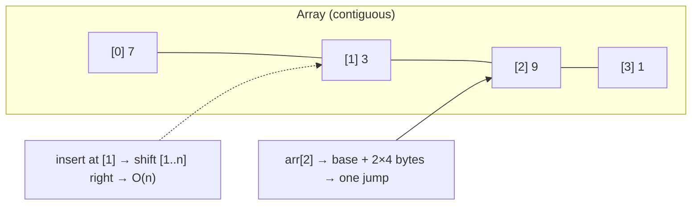
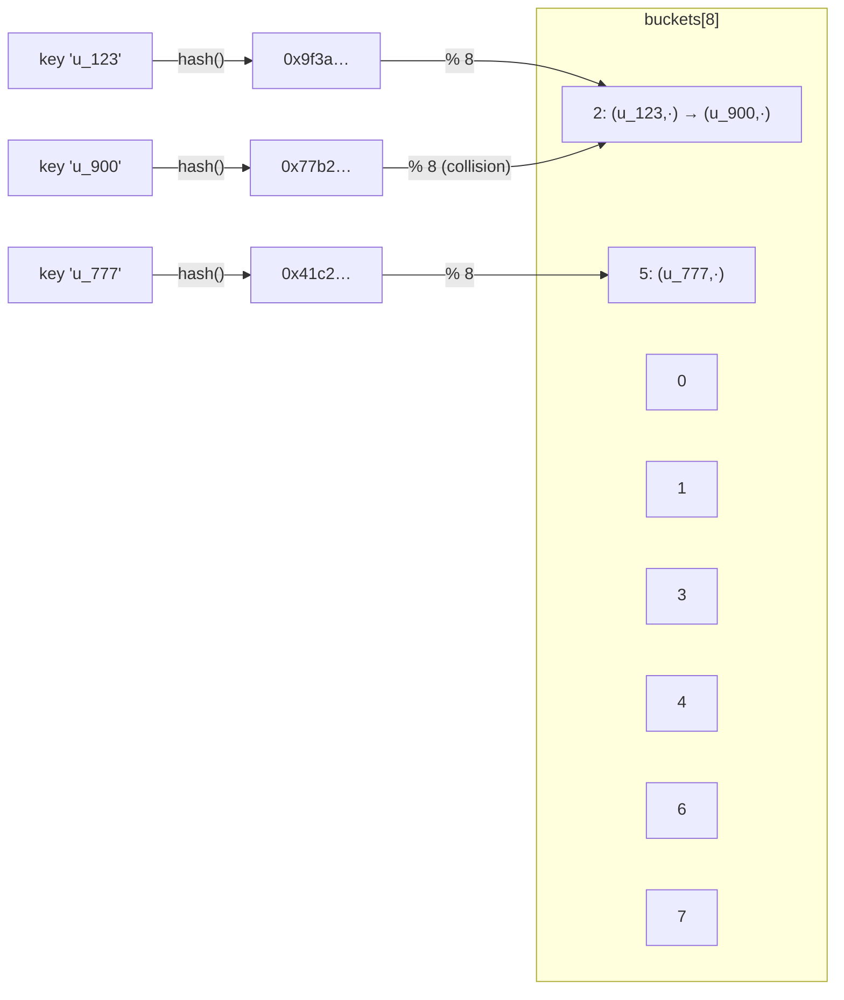
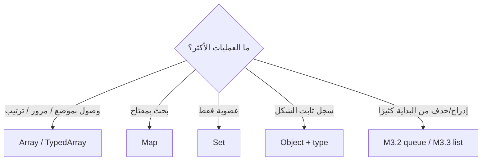

# Module 3.1 — المصفوفات وخرائط التجزئة بعمق
## Arrays & Hash Maps (Deep): contiguous memory, O(1) index, hashing, collisions, `Map` vs `Object`

> **المستوى:** Level 3 | **الموقع:** [1 من 14]
> **السابق:** [Checkpoint 2](../level-2-computer-systems/checkpoint-2.md) | **التالي:** [M3.2 — Sets, Stacks, Queues](module-3.2-sets-stacks-queues.md)

---

## 1. المتطلبات
- [ ] المصفوفات والكائنات في JS، `includes`/`find`/`indexOf` — [L1-M1.5](../level-1-programming/module-1.5-arrays.md)، [L1-M1.6](../level-1-programming/module-1.6-objects-references.md)
- [ ] خط الكاش 64B، المحلية، AoS vs SoA — [L2-M2.2](../level-2-computer-systems/module-2.2-cpu-cache-ram.md)
- [ ] الكومة والمراجع — [L2-M2.3](../level-2-computer-systems/module-2.3-memory-stack-heap-gc.md)

## 2. أهداف التعلّم
- شرح لماذا `arr[i]` **O(1)**: ذاكرة متجاورة + حساب عنوان = `base + i × size`.
- تقدير تكلفة كل عملية مصفوفة: الوصول، الإلحاق في النهاية (amortized O(1))، الإدراج/الحذف في البداية/الوسط (O(n))، البحث عن قيمة (O(n)).
- شرح **خريطة التجزئة** (hash map) كفكرة: دالة تجزئة → فهرس في مصفوفة من الدِلاء (buckets) → O(1) متوسطًا للإدراج/البحث/الحذف، مع التصادمات وإعادة التحجيم.
- اختيار بين `Map`/`Object`/`Array` بناءً على **العمليات المطلوبة**، والتعرف على **`includes` داخل حلقة** كأشهر O(n²) مخفي.
- معرفة ما يحدث في V8: المصفوفات المعبّأة vs ذات الثقوب، أنواع العناصر، التحول إلى "وضع القاموس".

---

## 3. شرح للمبتدئ

### القاعدة التي تحكم Level 3 كله
> **هيكل البيانات = اختيار يجعل عمليات معينة رخيصة على حساب أخرى.** لا يوجد هيكل "أفضل"؛ يوجد هيكل مناسب لـ **العمليات التي ستنفّذها أكثر**.

لذلك السؤال الأول دائمًا: *ما العمليات؟* (وصول بالفهرس؟ بحث بالمفتاح؟ إدراج في البداية؟ أصغر عنصر؟ ترتيب؟) ثم: *كم مرة، وعلى كم عنصر؟*

### المصفوفة: صفٌّ من الصناديق المتجاورة
المصفوفة (array) في أبسط صورها (C، `Int32Array` في JS) = كتلة ذاكرة **متجاورة** بحجم `n × size`. لذلك:
- **الوصول `arr[i]` = O(1)**: المعالج يحسب `base + i × 4` ويقفز. لا بحث. لا فرق بين `arr[0]` و`arr[1_000_000]`.
- **المرور التسلسلي سريع جدًا**: خط كاش واحد (64B) يجلب 16 عددًا دفعة واحدة (L2-M2.2) — المصفوفة هي الهيكل **الأكثر صداقة للكاش** على الإطلاق.
- **الإلحاق في النهاية `push` = O(1) amortized**: عند الامتلاء تُحجز كتلة أكبر (×1.5–2) وتُنسخ الكل مرة واحدة؛ موزّعة على n إلحاق = ثابت لكل واحد.
- **الإدراج/الحذف في البداية أو الوسط = O(n)**: `unshift`/`shift`/`splice(i, 1)` تزيح كل ما بعد الموضع. `shift()` في حلقة على 100k عنصر = 5 مليارات نقلة. (**هذا سبب وجود القوائم المرتبطة والطوابير الدائرية** — M3.2/M3.3.)
- **البحث عن قيمة `includes`/`indexOf`/`find` = O(n)**: لا طريق مختصر؛ فحص عنصر عنصر.

### في JavaScript: المصفوفة "تتظاهر"
`[]` في V8 ليست دائمًا كتلة متجاورة بسيطة، لكن V8 يجتهد أن يجعلها كذلك:
- **أنواع العناصر** (elements kinds): `[1,2,3]` تُخزَّن كـ `PACKED_SMI_ELEMENTS` (أعداد صغيرة متجاورة)؛ أضف `1.5` → `PACKED_DOUBLE`؛ أضف `"x"` → `PACKED_ELEMENTS` (مؤشرات). الانتقال أحادي الاتجاه ويُبطئ قليلًا. **احتفظ بمصفوفات متجانسة.**
- **الثقوب**: `const a = []; a[1000] = 1;` → `HOLEY`، وكل وصول يفحص الثقب. و`a[1e6] = 1` قد يحوّلها إلى **وضع القاموس** (hash داخليًا!) — فتخسر O(1) الحقيقي. لا تستخدم المصفوفة كخريطة بمفاتيح متفرقة.
- `delete arr[i]` يصنع ثقبًا؛ استخدم `splice` أو فلترة.
- `TypedArray` (`Int32Array`, `Float64Array`) = مصفوفة C حقيقية: حجم ثابت، نوع واحد، أسرع وأوفر للبيانات الرقمية الكبيرة (L2-M2.2 الـ benchmark).

### خريطة التجزئة: O(1) بالمفتاح — كيف؟
تريد `users.get("u_123")` بسرعة ثابتة بغض النظر عن عدد المستخدمين. الفكرة العبقرية البسيطة:
1. **دالة تجزئة** (hash function) تحوّل المفتاح (أي شيء) إلى عدد كبير يبدو عشوائيًا، بثبات (نفس المفتاح → نفس العدد).
2. `index = hash(key) % buckets.length` → موضع في **مصفوفة من الدِلاء**.
3. ضع `(key, value)` في ذلك الدلو. للبحث: احسب الفهرس نفسه → اذهب مباشرة.

**التصادم** (collision): مفتاحان مختلفان → نفس الدلو. حتمي (مفاتيح لا نهائية، دِلاء محدودة). الحل: الدلو قائمة صغيرة (chaining) أو البحث في الدِلاء المجاورة (open addressing). طالما الدِلاء كافية (**load factor** < ~0.75)، كل دلو يحوي عنصرًا أو اثنين → O(1) **متوسطًا**. عند الامتلاء: **إعادة تحجيم** (ضاعف الدِلاء وأعد توزيع كل شيء، O(n) مرة واحدة = amortized O(1)).

**الثمن** الذي تدفعه مقابل O(1) بالمفتاح:
- **لا ترتيب طبيعي** (`Map` في JS يحفظ ترتيب الإدراج، لكن لا يمكنك "أعطني أصغر مفتاح" بسرعة — ذلك عمل الأشجار M3.4 والأكوام M3.5).
- **ذاكرة أكثر** (دِلاء فارغة، مؤشرات).
- **غير صديق للكاش** (قفزة عشوائية لكل بحث؛ لكن قفزة واحدة O(1) تهزم مسح O(n) بدءًا من بضع عشرات العناصر).
- **الأسوأ O(n)** إن كانت دالة التجزئة سيئة أو خبيثة (HashDoS — لهذا V8 يستخدم بذرة عشوائية).

### `Map` vs `Object` vs `Array` — جدول القرار
| تحتاج | استخدم | لماذا |
|---|---|---|
| وصول بموضع رقمي متسلسل، مرور، ترتيب | `Array` | O(1) فهرس، كاش |
| بحث/إدراج/حذف بمفتاح (نص/عدد/كائن)، حجم متغير | **`Map`** | O(1)، أي نوع مفتاح، `.size`، ترتيب إدراج، لا prototype |
| سجل ثابت الشكل (DTO، إعدادات) | `Object` + نوع TS | أنواع محددة، JSON، قراءة |
| عضوية فقط (هل رأيته؟) | `Set` (M3.2) | O(1) بلا قيمة |
| مفاتيح كائنات بلا منع GC | `WeakMap` | التسرّب (L2-M2.3) |

لماذا `Object` كخريطة فكرة سيئة؟ المفاتيح نصوص فقط (`obj[1]` → `"1"`)، `__proto__`/`constructor` مفاتيح موجودة مسبقًا (ثغرة prototype pollution مع مدخلات المستخدم)، لا `.size`، والحذف الكثير يحوّله لوضع القاموس البطيء.

### أشهر O(n²) في الكود الحقيقي
```javascript
for (const order of orders)                              // n
  if (users.find(u => u.id === order.userId)) ...        // × n  = n²
```
10k طلب × 10k مستخدم = 100M مقارنة = ثوانٍ. الإصلاح (الذي ستكرره عشرات المرات في حياتك): **ابنِ `Map` مرة واحدة ثم ابحث فيها**: `const byId = new Map(users.map(u => [u.id, u]))` → O(n) بناء + O(1) لكل بحث. هذا هو **N+1 داخل الذاكرة**، وأخوه N+1 في قاعدة البيانات يأتي في M3.11.

---

## 4. النموذج الذهني

```
هيكل = عمليات رخيصة مقابل عمليات غالية. اسأل: ما العمليات؟ كم مرة؟ على كم عنصر؟

Array: [■■■■■■■■] متجاور → arr[i] O(1)، مرور سريع (كاش)، push O(1)*، shift/splice O(n)، includes O(n)
Map:   key → hash → % buckets → [ ][ ][k,v][ ][k,v→k,v][ ]   → get/set/delete O(1) متوسطًا
       الثمن: لا ترتيب بالقيمة، ذاكرة، قفزة كاش؛ تصادم → chaining؛ امتلاء → rehash
القاعدة الذهبية: "بحث داخل حلقة" = ابنِ Map أولًا (n² → n)
```

## 5. الرسم التوضيحي







## 6. مثال بسيط

```typescript
// src/lookup.ts — نفس المسألة بثلاث طرق: includes في حلقة vs Set vs Map
const N = 50_000;
const users = Array.from({ length: N }, (_, i) => ({ id: `u_${i}`, name: `User ${i}` }));
const orders = Array.from({ length: N }, (_, i) => ({ id: i, userId: `u_${(i * 7919) % N}` }));

console.time("find in loop (n²)");
let hits = 0;
for (const o of orders) if (users.find(u => u.id === o.userId)) hits++;
console.timeEnd("find in loop (n²)");                    // ~ثوانٍ

console.time("Map build + lookup (n)");
const byId = new Map(users.map(u => [u.id, u] as const));
let hits2 = 0;
for (const o of orders) if (byId.has(o.userId)) hits2++;
console.timeEnd("Map build + lookup (n)");               // ~ms

console.log(hits === hits2, hits);
```

## 7. مثال كود

```typescript
// src/hashmap.ts — خريطة تجزئة من الصفر (تعليمية) لتفهم ما يفعله Map: hash → bucket → chaining → rehash
class SimpleHashMap<V> {
  private buckets: Array<Array<[string, V]>>;
  private count = 0;
  constructor(initial = 8) { this.buckets = Array.from({ length: initial }, () => []); }

  private hash(key: string): number {                       // FNV-1a: بسيطة، توزيع جيد — ليست للأمن
    let h = 0x811c9dc5;
    for (let i = 0; i < key.length; i++) { h ^= key.charCodeAt(i); h = Math.imul(h, 0x01000193); }
    return h >>> 0;
  }
  private bucketOf(key: string) { return this.buckets[this.hash(key) % this.buckets.length]!; }

  get size() { return this.count; }
  get loadFactor() { return this.count / this.buckets.length; }

  set(key: string, value: V): this {
    const b = this.bucketOf(key);
    const hit = b.find(e => e[0] === key);
    if (hit) { hit[1] = value; return this; }
    b.push([key, value]); this.count++;
    if (this.loadFactor > 0.75) this.rehash();               // دِلاء مزدحمة → O(1) يتدهور → ضاعف
    return this;
  }
  get(key: string): V | undefined { return this.bucketOf(key).find(e => e[0] === key)?.[1]; }
  has(key: string) { return this.bucketOf(key).some(e => e[0] === key); }
  delete(key: string): boolean {
    const b = this.bucketOf(key); const i = b.findIndex(e => e[0] === key);
    if (i < 0) return false; b.splice(i, 1); this.count--; return true;
  }
  private rehash() {
    const old = this.buckets;
    this.buckets = Array.from({ length: old.length * 2 }, () => []);
    for (const b of old) for (const [k, v] of b) this.bucketOf(k).push([k, v]);   // O(n) مرة كل تضاعف = amortized O(1)
  }
  stats() {
    const sizes = this.buckets.map(b => b.length);
    return { buckets: this.buckets.length, items: this.count, load: this.loadFactor.toFixed(2), longestChain: sizes.reduce((m, x) => (x > m ? x : m), 0), empty: sizes.filter(s => s === 0).length };
  }
}

const m = new SimpleHashMap<number>();
for (let i = 0; i < 100_000; i++) m.set(`user:${i}`, i);
console.log(m.get("user:4242"), m.has("user:999999"), m.stats());
// { buckets: 262144, items: 100000, load: '0.38', longestChain: 5, empty: ~179k }  ← سلاسل قصيرة = O(1) عمليًا

// قارن بـ Map الحقيقي (أسرع بكثير: C++، تجزئة محسّنة، لكن نفس الفكرة)
console.time("SimpleHashMap 1M get"); for (let i = 0; i < 1_000_000; i++) m.get(`user:${i % 100_000}`); console.timeEnd("SimpleHashMap 1M get");
const real = new Map<string, number>(); for (let i = 0; i < 100_000; i++) real.set(`user:${i}`, i);
console.time("Map 1M get"); for (let i = 0; i < 1_000_000; i++) real.get(`user:${i % 100_000}`); console.timeEnd("Map 1M get");
```

## 8. مثال من العالم الحقيقي
- فهرس قاعدة البيانات بالتجزئة (`CREATE INDEX … USING hash`) = نفس الفكرة على القرص؛ B-Tree (M3.13) يفوز غالبًا لأنه يدعم النطاقات.
- Redis: `HSET/HGET` خريطة تجزئة في الذاكرة؛ `KEYS *` مسح O(n) يُحذَّر منه في الإنتاج.
- `node_modules` resolution، كاش الوحدات في Node (`require.cache`) = خرائط بمفاتيح مسارات.
- `JSON.parse` لمصفوفة 1M عنصر ثم `.find` في كل طلب = حادثة L2-M2.7 بثوب جديد.

## 9. مثال من الإنتاج
**حادثة "التقرير يستغرق 40 دقيقة":** مهمة ليلية تطابق 200k معاملة بنكية مع 150k فاتورة بـ `invoices.find(inv => inv.ref === tx.ref)` — 30 مليار مقارنة. "الحل" الأول المقترح: خادم أكبر. الفعلي: `Map` بالمرجع (`ref → invoice[]` لأن المراجع قد تتكرر) → 4 ثوانٍ. بعد ذلك ظهرت المشكلة التالية: 3% من المراجع بمسافات/حالة أحرف مختلفة لم تتطابق — فالمفتاح **يجب تطبيعه** (`trim().toUpperCase()`) قبل التجزئة، وهذا قرار **عمل** لا تقنية (هل `"INV-1 "` = `"inv-1"`؟). **الدرسان:** بحث داخل حلقة = Map؛ ومفتاح الخريطة قرار دلالي.

## 10. مفاهيم خاطئة شائعة

| ❌ | ✅ |
|---|---|
| "`Map` دائمًا أسرع من المصفوفة" | لأقل من ~20–50 عنصرًا المصفوفة أسرع (كاش، لا تجزئة). Map تفوز بالنمو. |
| "`Object` خريطة جيدة" | مفاتيح نصية فقط، prototype pollution، لا size، وضع القاموس. `Map` للخرائط الديناميكية. |
| "`includes` O(1)" | O(n). داخل حلقة = O(n²). |
| "التصادمات نادرة فلا تهم" | حتمية؛ التصميم الجيد يجعلها رخيصة. تجزئة سيئة = O(n). |
| "`arr[1e6] = x` مجرد مصفوفة كبيرة" | ثقوب/وضع قاموس؛ استخدم Map للمفاتيح المتفرقة. |
| "`delete arr[i]` يحذف العنصر" | يترك `undefined` ثقبًا؛ `splice`/`filter`. |

## 11. أخطاء شائعة
1. `find/includes/indexOf` داخل حلقة على مجموعة كبيرة.
2. مفتاح Map كائن `{id:1}` جديد كل مرة (المقارنة بالمرجع، L1-M1.6) → لا تطابق أبدًا؛ استخدم مفتاحًا بدائيًا أو `JSON.stringify` مستقرًا.
3. عدم تطبيع المفاتيح (مسافات/حالة/أصفار بادئة).
4. `shift()` في حلقة لمعالجة طابور (O(n²)) — M3.2.
5. مصفوفات مختلطة الأنواع في مسار ساخن.
6. `Object.keys(obj).length` في كل تكرار "لمعرفة الحجم".

## 12. تمرين تصحيح

```typescript
// دمج قائمتين: 80k سجل عميل من CRM و 120k من نظام الفوترة بالبريد الإلكتروني. "يأخذ 15 دقيقة ويخرج 9% بلا تطابق"
const merged = crm.map(c => ({ ...c, billing: billing.find(b => b.email === c.email) }));
```
أعراض: (1) بطيء جدًا؛ (2) 9% بلا تطابق رغم أن الدعم يؤكد وجودهم؛ (3) أحيانًا ينهار بـ "heap out of memory" عند التشغيل على الخادم الصغير.

<details><summary>💡 الحل</summary>

1. **O(n²)**: 80k × 120k = 9.6 مليار مقارنة. ابنِ `Map<email, billing>` مرة (O(120k)) ثم `get` (O(1)) → ثوانٍ.
2. **9% بلا تطابق**: بريد `"Ali@Example.com "` vs `"ali@example.com"` — طبّع المفتاح (`trim().toLowerCase()`) **في الجهتين**؛ وقرّر مع العمل ما يُعتبر نفس البريد (`+tag`؟ النقاط في Gmail؟). أضف تقريرًا بالفاقد (L1 Project 2: قل بصدق كم رفضت).
3. **OOM**: `{...c, billing}` ينسخ كل سجل + سجلات billing ضخمة (كل الحقول) → ضعف الذاكرة؛ احتفظ بالحقول المطلوبة فقط، أو خزّن المرجع فقط، أو عالج بالتدفق مع Map للجانب الأصغر (80k) وامرر على الأكبر — **Hash Join** بالضبط كما تفعل قاعدة البيانات (M3.11).
</details>

## 13. تمرين معماري
خدمة تخزّن 5M جلسة مستخدم نشطة في ذاكرة عملية Node بـ `Map<sessionId, Session>`: احسب الذاكرة التقريبية (مفتاح 32 حرفًا + كائن 10 حقول)، ماذا يحدث لـ GC (L2-M2.3 كومة ضخمة)، ماذا يحدث مع `cluster` (L2-M2.7)، وكيف تنتقل إلى Redis (نفس O(1) لكن عبر الشبكة: +0.5ms لكل بحث — متى يُقبل ذلك؟). ACTRR.

## 14. الصلة بعصر AI
AI يكتب `find` داخل حلقات بلا تردد لأنه "واضح"، ويستخدم `Object` كخريطة بمفاتيح من المستخدم (prototype pollution). عند مراجعة كود مولَّد ابحث آليًا عن `for … find(`/`includes(` على مجموعات قد تكبر، واطلب: *"ما تعقيد هذا مع n = 100k؟"* — AI يجيب بدقة إن سُئل، ولا يفعل إن لم يُسأل.

## 15–17. Master / Understand / Defer
- 🔴 لماذا `arr[i]` O(1) وشكل تكاليف المصفوفة؛ فكرة التجزئة (hash → bucket) وO(1) متوسطًا؛ جدول القرار Map/Object/Array/Set؛ **بحث في حلقة → Map**؛ تطبيع المفاتيح؛ مقارنة المفاتيح بالمرجع.
- 🟠 التصادمات وload factor وrehash؛ amortized O(1)؛ أنواع العناصر والثقوب في V8؛ TypedArray؛ prototype pollution؛ HashDoS.
- ⚪ open addressing vs chaining بالتفصيل؛ دوال تجزئة تشفيرية vs غير تشفيرية؛ Robin Hood/Swiss tables؛ consistent hashing (L7).

## 18. الخلاصة
1. هيكل البيانات = مقايضة عمليات. ابدأ من **العمليات** لا من الاسم.
2. المصفوفة: متجاورة → فهرس O(1) ومرور سريع؛ إدراج/حذف في الوسط وبحث بالقيمة O(n).
3. خريطة التجزئة: hash → دلو → O(1) متوسطًا بالمفتاح؛ الثمن ترتيب وذاكرة وكاش؛ التصادم طبيعي.
4. `Map` للخرائط الديناميكية، `Object` للسجلات الثابتة، `Array` للتسلسل، `Set` للعضوية.
5. **بحث داخل حلقة = ابنِ Map أولًا** — وطبّع المفتاح.

## 19. مراجع رسمية
- MDN — `Map` (and "Objects vs. Maps"): https://developer.mozilla.org/en-US/docs/Web/JavaScript/Reference/Global_Objects/Map#objects_vs._maps
- MDN — Typed arrays: https://developer.mozilla.org/en-US/docs/Web/JavaScript/Guide/Typed_arrays
- V8 blog — Elements kinds in V8: https://v8.dev/blog/elements-kinds
- V8 blog — Fast properties / dictionary mode: https://v8.dev/blog/fast-properties
- OWASP — Prototype Pollution: https://cheatsheetseries.owasp.org/cheatsheets/Prototype_Pollution_Prevention_Cheat_Sheet.html
- Open Data Structures (مجاني) — Array-based lists & Hash tables: https://opendatastructures.org/

## المصطلحات
| العربية | English |
|---|---|
| هيكل بيانات | Data structure |
| ذاكرة متجاورة | Contiguous memory |
| وصول عشوائي | Random access |
| تكلفة مُستهلكة (مطفأة) | Amortized cost |
| خريطة تجزئة | Hash map / Hash table |
| دالة تجزئة | Hash function |
| دلو | Bucket |
| تصادم | Collision |
| سَلسلة (للتصادمات) | Chaining |
| معامل الحمل | Load factor |
| إعادة التجزئة / التحجيم | Rehash / Resize |
| تطبيع المفتاح | Key normalization |
| تلويث النموذج الأولي | Prototype pollution |
| مصفوفة مكتوبة النوع | Typed array |
| أنواع العناصر (V8) | Elements kinds |
| وضع القاموس | Dictionary mode |

> **التالي:** [Module 3.2 — Sets, Stacks, Queues](module-3.2-sets-stacks-queues.md)
