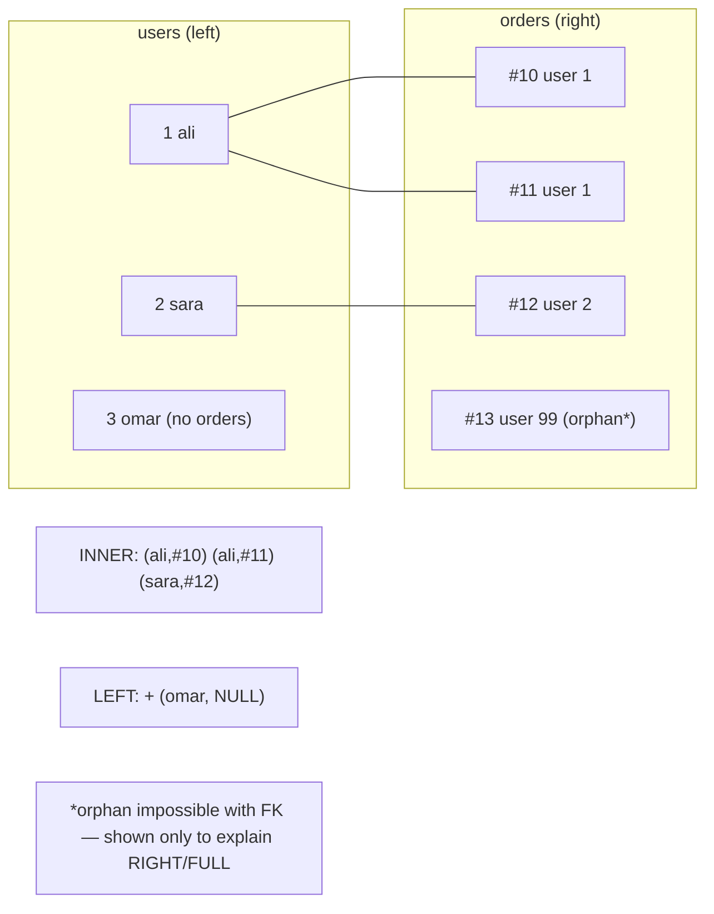
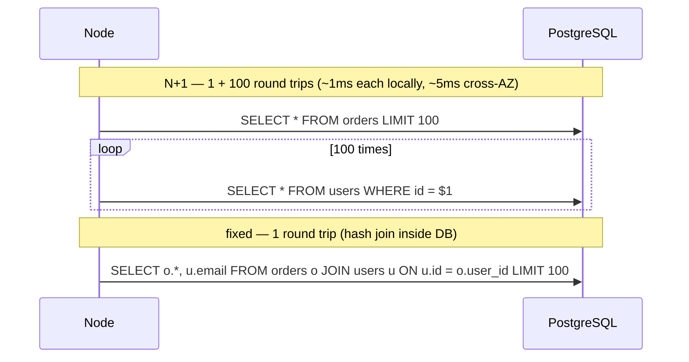
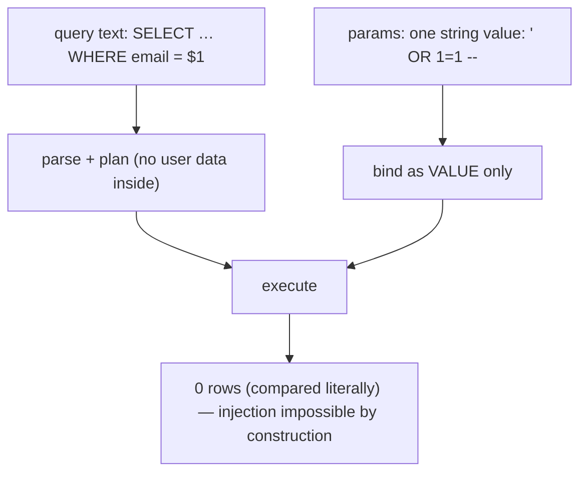

# Module 3.11 — SQL من الصفر
## SQL From Zero: SELECT/WHERE/ORDER BY/LIMIT, JOINs (and what they really do), GROUP BY, INSERT/UPDATE/DELETE, the N+1 problem, SQL injection

> **المستوى:** Level 3 | **الموقع:** [11 من 14]
> **السابق:** [M3.10 — Databases From Zero](module-3.10-databases-from-zero.md) | **التالي:** [M3.12 — Database Design](module-3.12-database-design.md)

---

## 1. المتطلبات
- [ ] الجداول الخمسة (`schema.sql`) وPostgreSQL يعمل محليًا، `pg` Pool — [M3.10](module-3.10-databases-from-zero.md)
- [ ] hash join وmerge join كأفكار (Map لربط قائمتين؛ مؤشران على مرتّبين) — [M3.1](module-3.1-arrays-hash-maps.md), [M3.7](module-3.7-algorithmic-thinking.md)
- [ ] N+1 كشكل من "استعلام داخل حلقة" — [M3.8](module-3.8-big-o.md)

## 2. أهداف التعلّم
- كتابة **استعلامات القراءة** بثقة: `SELECT` أعمدة محددة، `WHERE` (مع `AND/OR/IN/BETWEEN/LIKE/IS NULL`)، `ORDER BY` (مع tie-break)، `LIMIT/OFFSET`، والدوال الشائعة.
- فهم **JOIN** كعملية ربط صفوف بشرط: `INNER` (التقاطع)، `LEFT` (كل اليسار + مطابق أو NULL)، ومتى تحتاج كلًّا؛ وأن DB تنفذها بـ hash/merge/nested loop — نفس خوارزمياتك.
- استخدام **`GROUP BY` والتجميعات** (`COUNT/SUM/AVG/MIN/MAX`)، `HAVING`، وفخ "عمود غير مجمَّع"، والفرق بين `COUNT(*)` و`COUNT(col)`.
- كتابة **الكتابات** `INSERT ... RETURNING`، `UPDATE ... WHERE` (ذري: `stock = stock - 1`)، `DELETE`، `INSERT ... ON CONFLICT` (upsert) — ولماذا `UPDATE` بلا `WHERE` كارثة.
- التعرف على **N+1** في كود Node وإصلاحه بـ `JOIN`/`IN`/`json_agg`؛ وفهم **حقن SQL** ولماذا `$1` ليس اختياريًا.
- ترجمة "ذهنية JS" إلى SQL: `filter→WHERE`, `map→SELECT`, `sort→ORDER BY`, `slice→LIMIT`, `Map lookup→JOIN`, `reduce/groupBy→GROUP BY`.

---

## 3. شرح للمبتدئ

### SQL تصريحية: تقول ماذا، لا كيف
في JS تكتب **كيف**: حلقة، شرط، push. في SQL تكتب **ماذا**: "الصفوف من `orders` حيث `status = 'paid'` مرتبة بالأحدث، أول 20". **المخطط** (planner) يقرر الكيف: فهرس أم مسح كامل، hash join أم merge (M3.13 سترى قراره بـ `EXPLAIN`). لذلك SQL يبقى صحيحًا عندما ينمو الجدول ×1000 — فقط الخطة تتغير.

**ترتيب التنفيذ المنطقي** (ليس ترتيب الكتابة): `FROM/JOIN` → `WHERE` → `GROUP BY` → `HAVING` → `SELECT` → `ORDER BY` → `LIMIT`. يفسّر لماذا لا تستطيع استخدام alias من `SELECT` داخل `WHERE`، ولماذا `HAVING` للتجميعات.

### القراءة
```sql
SELECT id, email, created_at              -- أعمدة محددة (لا * في كود التطبيق: نقل أقل، لا تنكسر عند إضافة عمود)
FROM users
WHERE organization_id = $1                -- $1 معامل: يُرسل منفصلًا عن النص (حقن مستحيل)
  AND created_at >= now() - interval '30 days'
  AND email ILIKE '%@example.com'         -- ILIKE بلا حساسية؛ '%' أي شيء؛ بادئة 'abc%' فقط تستفيد من فهرس B-Tree
  AND deleted_at IS NULL                  -- NULL: IS NULL / IS NOT NULL، أبدًا = NULL
ORDER BY created_at DESC, id DESC         -- tie-break دائمًا → ترتيب كلي حتمي (keyset pagination M3.9)
LIMIT 20;
```
أدوات: `IN ($1, $2)` أو `= ANY($1)` بمصفوفة من Node؛ `BETWEEN`؛ `COALESCE(x, 0)`؛ `CASE WHEN`؛ `DISTINCT`؛ `date_trunc('day', created_at)`؛ `::text` للتحويل؛ `||` لدمج النصوص؛ `count(*) OVER()` لعدد كلي مع صفحة (مكلف).

### JOIN: ربط الصفوف — وهو ما كنت تفعله بـ Map
"طلبات مع بريد صاحبها": في JS تبني `Map<userId, user>` ثم لكل طلب `map.get` (M3.1). في SQL:
```sql
SELECT o.id, o.status, u.email
FROM orders o
JOIN users u ON u.id = o.user_id;        -- INNER: فقط الطلبات التي لها مستخدم مطابق
```
- **INNER JOIN**: الصفوف التي تطابق في **الطرفين**. مستخدم بلا طلبات لا يظهر.
- **LEFT JOIN**: **كل** صفوف اليسار + المطابق من اليمين أو `NULL`. "كل المستخدمين مع عدد طلباتهم (حتى 0)" → `LEFT JOIN` + `COUNT(o.id)` (لا `COUNT(*)` — يعدّ الصف الفارغ 1). نمط "ليس له": `LEFT JOIN ... WHERE o.id IS NULL` (أو `NOT EXISTS` الأوضح).
- **RIGHT/FULL**: نادرة (اقلب الترتيب بدل RIGHT). **CROSS**: كل التركيبات (n×m — نادرًا مقصودة؛ غالبًا خطأ شرط `ON` منسي).
- **تكاثر الصفوف** (fan-out): طلب بـ 3 بنود ينتج 3 صفوف عند `JOIN order_items`؛ `SUM` فوقها يضاعف الإجماليات — أشهر خطأ تقارير. الحل: جمّع كل جدول في استعلام فرعي/CTE **قبل** الربط، أو `json_agg` للأبناء.
- **كيف تُنفَّذ**: صغير×كبير → **Hash Join** (ابنِ Map من الصغير، امسح الكبير — خوارزميتك من M3.1)؛ مرتّبان/مفهرسان → **Merge Join** (مؤشران، M3.7)؛ قليل من الصفوف بفهرس على الطرف الآخر → **Nested Loop** مع Index Scan (الحالة الوحيدة التي يكون فيها "استعلام لكل صف" رخيصًا — لأنه داخل DB بلا رحلة شبكة). ستراها بالاسم في `EXPLAIN` (M3.13).

### GROUP BY والتجميعات
```sql
SELECT u.id, u.email, COUNT(o.id) AS orders_count, COALESCE(SUM(oi.quantity * oi.unit_price_cents), 0) AS revenue_cents
FROM users u
LEFT JOIN orders o ON o.user_id = u.id AND o.status = 'paid'     -- الشرط في ON ليحافظ LEFT على المستخدمين بلا طلبات
LEFT JOIN order_items oi ON oi.order_id = o.id
GROUP BY u.id                                                      -- كل عمود غير مجمَّع في SELECT يجب أن يكون هنا (أو يعتمد وظيفيًا على PK)
HAVING COUNT(o.id) >= 1                                            -- فلتر بعد التجميع (WHERE قبله)
ORDER BY revenue_cents DESC
LIMIT 10;                                                          -- top-N heapsort (M3.5)
```
(تنبيه: `COUNT(o.id)` هنا يعدّ **البنود** لا الطلبات بسبب التكاثر — استخدم `COUNT(DISTINCT o.id)` أو جمّع البنود أولًا. هذا هو الفخ عمليًا.) الدوال: `COUNT(*)` كل الصفوف، `COUNT(col)` غير NULL، `SUM/AVG/MIN/MAX`، `string_agg`, `array_agg`, `json_agg`, `bool_or`, `percentile_cont` للـ p99.

### الكتابة
- `INSERT INTO products (name, price_cents) VALUES ($1, $2), ($3, $4) RETURNING id` — دفعة في جملة واحدة (M3.9 batching)، و`RETURNING` يوفّر استعلامًا ثانيًا.
- `UPDATE products SET stock = stock - $2 WHERE id = $1 AND stock >= $2 RETURNING stock` — **ذري في DB**: لا read-modify-write في Node (L0-M0.7)؛ `rowCount === 0` = مخزون غير كافٍ.
- `DELETE FROM sessions WHERE expires_at < now()`. **بلا `WHERE` = كل الجدول**؛ psql لا يسأل. (عادة: اكتب `WHERE` أولًا؛ في الإنتاج داخل معاملة مع `SELECT count(*)` قبل `COMMIT` — M3.14.)
- **Upsert**: `INSERT ... ON CONFLICT (lower(email)) DO UPDATE SET display_name = EXCLUDED.display_name` — إدراج أو تحديث ذريًا بلا سباق "تحقق ثم أدرج".
- **Soft delete**: `deleted_at timestamptz` + `WHERE deleted_at IS NULL` في كل قراءة (ويُفضَّل view).

### N+1: المشكلة التي ستراها في كل مشروع
```typescript
const orders = await pool.query("SELECT * FROM orders LIMIT 100");            // 1
for (const o of orders.rows) o.user = (await pool.query("SELECT * FROM users WHERE id = $1", [o.user_id])).rows[0];   // + 100
```
101 رحلة شبكة × 1ms = 100ms (وعلى RDS عبر منطقة أخرى × 5ms = نصف ثانية) لصفحة واحدة؛ مع البنود = 1 + 100 + 300. **التشخيص**: سجّل عدد الاستعلامات لكل طلب HTTP — إن كان يتناسب مع حجم النتيجة فهو N+1. **الإصلاح**: (أ) `JOIN` واحد؛ (ب) استعلامان: الطلبات ثم `WHERE id = ANY($1)` بمعرّفات المستخدمين + `Map` في Node (DataLoader M3.9)؛ (ج) `json_agg` لإرجاع الأبناء متداخلين في صف واحد. ORMs تخلقها بـ lazy loading (`order.user` يستعلم عند الوصول) — لهذا تبدأ بـ SQL خام.

### حقن SQL: لماذا `$1` غير قابل للتفاوض
```typescript
pool.query(`SELECT * FROM users WHERE email = '${email}'`);   // email = "' OR 1=1 --"  → كل المستخدمين؛ "'; DROP TABLE users; --"
```
النص والبيانات امتزجا؛ DB لا تميّز. **المعاملات** `$1` ترسل الاستعلام والقيم **منفصلين** في البروتوكول — القيمة لا تُفسَّر أبدًا كـ SQL. ما لا يمكن تمريره كمعامل (اسم عمود للفرز، اتجاه `ASC/DESC`): **قائمة بيضاء** في الكود (`const allowed = {created_at: "created_at"}`)، أبدًا نص المستخدم. ينطبق على `LIKE`: `WHERE name ILIKE $1` مع `['%' + term + '%']` ومع تهريب `%`/`_` إن لزم.

---

## 4. النموذج الذهني

```
JS → SQL: filter→WHERE | map→SELECT cols | sort→ORDER BY (+tie-break) | slice→LIMIT | Map lookup→JOIN | groupBy/reduce→GROUP BY
التنفيذ المنطقي: FROM/JOIN → WHERE → GROUP BY → HAVING → SELECT → ORDER BY → LIMIT
INNER = التقاطع | LEFT = كل اليسار + NULL | fan-out يضاعف SUM → جمّع قبل الربط / json_agg
الكتابة: INSERT…RETURNING (دفعات) | UPDATE ذري (stock = stock - 1 WHERE stock >= n) | DELETE مع WHERE دائمًا | ON CONFLICT
N+1 = استعلام في حلقة → JOIN / = ANY($ids) / json_agg ; عدّ الاستعلامات لكل طلب HTTP
حقن = نص+بيانات ممزوجان → $1 دائمًا ؛ ما لا يُمرَّر كمعامل → قائمة بيضاء
```

## 5. الرسم التوضيحي







## 6. مثال بسيط

```sql
-- queries.sql — شغّل كل واحد في psql على schema.sql من M3.10 (أدخل بيانات تجريبية أولًا بـ seed أدناه)
-- seed (يبدأ بتفريغ الجداول وإعادة العدّادات: التسلسلات لا تتراجع مع ROLLBACK، فبعد تجربة db.ts قد يبدأ id من 2)
TRUNCATE organizations, users, products, orders, order_items RESTART IDENTITY CASCADE;
INSERT INTO organizations (name) VALUES ('Acme'), ('Globex');
INSERT INTO users (organization_id, email) VALUES (1,'ali@x.com'), (1,'sara@x.com'), (2,'omar@y.com');
INSERT INTO products (name, price_cents, stock) VALUES ('Pen',150,100), ('Notebook',900,20), ('Bag',4500,5);
INSERT INTO orders (user_id, status) VALUES (1,'paid'), (1,'pending'), (2,'paid');
INSERT INTO order_items VALUES (1,1,10,150), (1,2,1,900), (2,3,1,4500), (3,2,2,900);

-- 1) قراءة مع فلاتر وترتيب وصفحة
SELECT id, status, created_at FROM orders WHERE status IN ('paid','shipped') ORDER BY created_at DESC, id DESC LIMIT 20;

-- 2) INNER vs LEFT: من لم يطلب شيئًا؟
SELECT u.email, o.id AS order_id FROM users u JOIN orders o ON o.user_id = u.id ORDER BY u.id;          -- omar لا يظهر
SELECT u.email, o.id AS order_id FROM users u LEFT JOIN orders o ON o.user_id = u.id ORDER BY u.id;     -- omar, NULL
SELECT u.email FROM users u WHERE NOT EXISTS (SELECT 1 FROM orders o WHERE o.user_id = u.id);          -- "ليس له" الأوضح

-- 3) إجمالي كل طلب (fan-out مقصود هنا لأننا نجمّع البنود فقط)
SELECT o.id, SUM(oi.quantity * oi.unit_price_cents) AS total_cents, COUNT(*) AS lines
FROM orders o JOIN order_items oi ON oi.order_id = o.id GROUP BY o.id ORDER BY o.id;                   -- 1: 2400/2, 2: 4500/1, 3: 1800/1

-- 4) الفخ: إيراد كل مستخدم — خطأ (يعدّ البنود كطلبات) ثم صحيح (جمّع قبل الربط)
SELECT u.email, COUNT(o.id) AS orders, SUM(oi.quantity*oi.unit_price_cents) AS revenue
FROM users u LEFT JOIN orders o ON o.user_id = u.id AND o.status='paid' LEFT JOIN order_items oi ON oi.order_id = o.id
GROUP BY u.id ORDER BY u.id;                                                                            -- ali: orders=2 ✗ (طلب واحد مدفوع ببندين)
WITH paid AS (SELECT o.user_id, o.id, SUM(oi.quantity*oi.unit_price_cents) AS total
              FROM orders o JOIN order_items oi ON oi.order_id = o.id WHERE o.status='paid' GROUP BY o.id)
SELECT u.email, COUNT(p.id) AS orders, COALESCE(SUM(p.total),0) AS revenue FROM users u LEFT JOIN paid p ON p.user_id = u.id
GROUP BY u.id ORDER BY u.id;                                                                            -- ali: 1/2400, sara: 1/1800, omar: 0/0 ✓

-- 5) الكتابة الذرية: خصم مخزون بلا سباق، upsert، حذف بحذر
UPDATE products SET stock = stock - 2 WHERE id = 3 AND stock >= 2 RETURNING stock;                     -- 0 rows = غير كافٍ
INSERT INTO users (organization_id, email) VALUES (1, 'ALI@x.com')
  ON CONFLICT (lower(email)) DO UPDATE SET created_at = users.created_at RETURNING id;                  -- يعيد id الموجود (1)
BEGIN; DELETE FROM orders WHERE status = 'cancelled' AND created_at < now() - interval '1 year'; SELECT count(*) FROM orders; ROLLBACK;  -- جرّب ثم قرر (M3.14)
```

## 7. مثال كود

```typescript
// src/orders-repo.ts — نفس الاستعلامات من Node: N+1 vs JOIN vs json_agg، وبناء ORDER BY بقائمة بيضاء (لا حقن)
import { pool } from "./db.js";

// ✗ N+1: يعمل، ويقتل الأداء عند 100 صف × رحلة
export async function listOrdersNPlus1(limit = 100) {
  const orders = (await pool.query<{ id: number; user_id: number; status: string }>("SELECT id, user_id, status FROM orders ORDER BY id LIMIT $1", [limit])).rows;
  return Promise.all(orders.map(async o => ({ ...o, user: (await pool.query("SELECT id, email FROM users WHERE id = $1", [o.user_id])).rows[0] })));
}
// ✓ استعلامان + Map (مفيد عندما لا تريد fan-out أو عبر خدمتين)
export async function listOrdersTwoQueries(limit = 100) {
  const orders = (await pool.query<{ id: number; user_id: number; status: string }>("SELECT id, user_id, status FROM orders ORDER BY id LIMIT $1", [limit])).rows;
  const ids = [...new Set(orders.map(o => o.user_id))];
  const users = new Map((await pool.query<{ id: number; email: string }>("SELECT id, email FROM users WHERE id = ANY($1::bigint[])", [ids])).rows.map(u => [u.id, u]));
  return orders.map(o => ({ ...o, user: users.get(o.user_id) }));
}
// ✓ استعلام واحد: الطلب + المستخدم + البنود متداخلة (json_agg) — لا fan-out في Node
const SORTABLE = { created_at: "o.created_at", id: "o.id", status: "o.status" } as const;    // قائمة بيضاء: المستخدم يختار مفتاحًا لا نصًا
export async function listOrdersJoined(opts: { limit?: number; sort?: keyof typeof SORTABLE; dir?: "asc" | "desc"; status?: string } = {}) {
  const limit = Math.min(opts.limit ?? 20, 100), col = SORTABLE[opts.sort ?? "created_at"], dir = opts.dir === "asc" ? "ASC" : "DESC";
  const { rows } = await pool.query(
    `SELECT o.id, o.status, o.created_at,
            json_build_object('id', u.id, 'email', u.email) AS "user",
            COALESCE(json_agg(json_build_object('productId', oi.product_id, 'quantity', oi.quantity, 'unitPriceCents', oi.unit_price_cents))
                     FILTER (WHERE oi.order_id IS NOT NULL), '[]') AS items,
            COALESCE(SUM(oi.quantity * oi.unit_price_cents), 0)::bigint AS total_cents
     FROM orders o
     JOIN users u ON u.id = o.user_id
     LEFT JOIN order_items oi ON oi.order_id = o.id
     WHERE ($2::text IS NULL OR o.status = $2)                 -- فلتر اختياري بمعامل (لا تركيب نصي)
     GROUP BY o.id, u.id
     ORDER BY ${col} ${dir}, o.id ${dir}                       -- الوحيد المركّب نصيًا، ومصدره القائمة البيضاء فقط
     LIMIT $1`, [limit, opts.status ?? null]);
  return rows;
}

// قياس: عدّ الاستعلامات لكل دالة (في Project 4 ستربطه بكل طلب HTTP كمقياس)
let queries = 0; const orig = pool.query.bind(pool);
(pool as unknown as { query: typeof orig }).query = ((...a: Parameters<typeof orig>) => { queries++; return orig(...a); }) as typeof orig;
for (const fn of [listOrdersNPlus1, listOrdersTwoQueries, () => listOrdersJoined({ limit: 100 })]) { queries = 0; const t = performance.now(); const r = await fn(); console.log(fn.name || "joined", { rows: r.length, queries, ms: +(performance.now() - t).toFixed(1) }); }
await pool.end();
// listOrdersNPlus1 { rows: 3, queries: 4 } ← مع 100 طلب: 101 ; listOrdersTwoQueries { queries: 2 } ; joined { queries: 1 }
```

## 8. مثال من العالم الحقيقي
- **Rails/Django/Prisma N+1**: `bullet` gem وPrisma `relationLoadStrategy: 'join'` وُجدت لأن N+1 أشهر مشكلة أداء في تطبيقات الويب.
- **Postgres `json_agg`** هو ما تولّده Hasura/PostGraphile لإرجاع GraphQL متداخل باستعلام واحد.
- **حقن SQL**: ما زال في OWASP Top 10 (A03). حوادث: Heartland (130M بطاقة)، Sony Pictures، MOVEit 2023 — كلها نص + بيانات ممزوجة.
- **`UPDATE` بلا WHERE**: حوادث GitLab/Stripe-style "حدّثت كل الصفوف" تتكرر؛ لهذا أدوات مثل `pg_safeupdate` و"dry run في معاملة".

## 9. مثال من الإنتاج
**حادثة "لوحة الإدارة تستغرق 9 ثوانٍ وتسقط DB في ساعة الذروة":** صفحة طلبات بـ ORM: 50 طلبًا → لكل طلب المستخدم (50) → لكل طلب البنود (50) → لكل بند المنتج (~150) → لكل مستخدم المؤسسة (50) = **~350 استعلامًا لصفحة واحدة**، كل واحد 3ms عبر الشبكة ≈ 1s، و×5 مشرفين متزامنين = 1750 استعلام/ثانية على DB لا تحتاج أكثر من 5. اكتُشفت بعدّاد "queries per request" في السجلات (p50 = 353). الإصلاح: استعلام واحد بـ `JOIN` + `json_agg` (12ms)، وقاعدة في مراجعة الكود: أي معالج يتجاوز 10 استعلامات يحتاج تبريرًا، وتنبيه عند `queries_per_request p99 > 20`. **الدرس:** N+1 غير مرئي في التطوير (3 طلبات) وقاتل في الإنتاج؛ قِس عدد الاستعلامات لكل طلب كما تقيس الزمن.

## 10. مفاهيم خاطئة شائعة

| ❌ | ✅ |
|---|---|
| "JOIN بطيء؛ أجلب وأربط في JS" | JOIN داخل DB بلا رحلات شبكة وبفهارس؛ الربط في JS = N+1 أو نقل بيانات ضخم. |
| "`WHERE = NULL` يجد الفارغ" | `IS NULL`. |
| "تهريب علامات الاقتباس يمنع الحقن" | المعاملات `$1` فقط؛ التهريب اليدوي يُكسر دائمًا. |
| "`COUNT(*)` مع LEFT JOIN يعطي 0 لمن ليس له" | يعطي 1 (الصف الفارغ)؛ `COUNT(child.id)`. |
| "`SELECT *` مريح" | نقل أعمدة لا تحتاجها، وينكسر الترتيب عند تغيير الجدول، ويمنع index-only scans (M3.13). |

## 11. أخطاء شائعة
1. استعلام داخل حلقة (N+1) — بما فيه `Promise.all` على 100 استعلام (أسرع لكنه ما زال 100 رحلة واستنزاف pool).
2. `SUM` فوق fan-out.
3. `ORDER BY` بلا tie-break → صفحات تتكرر.
4. `UPDATE/DELETE` بلا `WHERE`؛ أو `WHERE id = $1` بـ `undefined` → `null` → 0 صفوف بصمت (تحقق من `rowCount`).
5. تركيب `ORDER BY ${req.query.sort}` نصيًا.
6. `LIKE '%term%'` وتوقّع فهرس (لا يعمل؛ M3.13: `pg_trgm` أو بحث نصي).

## 12. تمرين تصحيح

```typescript
// تقرير "أفضل العملاء": الأرقام مضاعفة لبعض العملاء، وعميل بحرف ' في اسمه يكسر الصفحة، والفرز بالمعامل يُسقط الخادم أحيانًا
const { rows } = await pool.query(`
  SELECT u.email, COUNT(*) AS orders, SUM(oi.quantity * oi.unit_price_cents) AS revenue
  FROM users u
  LEFT JOIN orders o ON o.user_id = u.id
  LEFT JOIN order_items oi ON oi.order_id = o.id
  WHERE u.display_name LIKE '%${req.query.q}%'
  GROUP BY u.email
  ORDER BY ${req.query.sort} DESC LIMIT 10`);
```

<details><summary>💡 الحل</summary>

1. **مضاعفة**: `COUNT(*)` يعدّ صفوف fan-out (بنود لا طلبات)، ويعدّ 1 لمن ليس له طلبات. استخدم `COUNT(DISTINCT o.id)`، أو جمّع البنود لكل طلب في CTE ثم اربط.
2. **حرف `'` يكسر الصفحة**: حقن SQL حرفيًا (خطأ صياغة الآن؛ `' OR 1=1 --` لاحقًا). `WHERE u.display_name ILIKE $1` مع `['%' + q + '%']`.
3. **الفرز يُسقط**: `ORDER BY ${sort}` — حقن ثانٍ، أو عمود غير موجود → خطأ 500؛ أو `sort = "(SELECT pg_sleep(10))"`. قائمة بيضاء.
4. `GROUP BY u.email` بدل `u.id` (بريدان متطابقان؟ لا بفضل القيد، لكن اجمع بالمفتاح دائمًا)، وأضف tie-break في `ORDER BY`.
5. حد طول `q` (M3.8) و`LIMIT` مُقيَّد.
</details>

## 13. تمرين معماري
Project 4 يحتاج `GET /orders/:id` يعيد الطلب مع المستخدم والبنود وأسماء المنتجات **الحالية** (قد تتغير) مع الأسعار **التاريخية** (لقطة). اكتب الاستعلام الواحد (`json_agg`) مقابل 3 استعلامات؛ قرّر ماذا يحدث لمنتج محذوف (soft delete؟ LEFT JOIN؟)، كيف تمنع fan-out في الإجمالي، وكيف تجعل الاستجابة مستقرة (أسماء أعمدة camelCase عبر alias أم تحويل في Node؟). ثم: كيف تكتشف N+1 تلقائيًا في الاختبارات (عدّاد استعلامات + حد)؟ ACTRR.

## 14. الصلة بعصر AI
AI يكتب SQL ممتازًا — ويكتب أيضًا `${}` في الاستعلامات و`COUNT(*)` فوق fan-out وORM lazy loading. اطلب: *"معاملات فقط، لا تركيب نصي؛ عدّاد استعلامات لكل طلب ≤ 3؛ جمّع قبل الربط؛ tie-break في ORDER BY"*. واستخدم AI لشرح استعلام معقّد تقرأه — ثم تحقق على بيانات صغيرة تعرف إجابتها (كما في §6: ali = 2400).

## 15–17. Master / Understand / Defer
- 🔴 ترجمة JS→SQL؛ `SELECT/WHERE/ORDER BY/LIMIT` مع NULL وtie-break؛ INNER vs LEFT ونمط "ليس له"؛ `GROUP BY` وفخ fan-out؛ `INSERT RETURNING`، `UPDATE` ذري بشرط، `DELETE` مع `WHERE`؛ N+1 واكتشافه وإصلاحه؛ `$1` دائمًا وقائمة بيضاء لما لا يُمرَّر.
- 🟠 ترتيب التنفيذ المنطقي؛ `ON CONFLICT`؛ CTE (`WITH`)؛ `json_agg`/`FILTER`؛ `= ANY($1)`؛ `EXISTS`؛ `COUNT(DISTINCT)`؛ hash/merge/nested loop كأسماء ستراها في EXPLAIN.
- ⚪ window functions (`OVER`)، `LATERAL`، `WITH RECURSIVE` تفصيليًا (M3.4 الأشجار)، `pg_trgm`/full-text search، `MERGE`.

## 18. الخلاصة
1. SQL تصريحية: تصف النتيجة؛ المخطط يختار الخوارزمية (نفس hash/merge/sort التي تعلمتها).
2. `WHERE/ORDER BY (+tie-break)/LIMIT` للقراءة؛ `IS NULL` لا `= NULL`؛ أعمدة محددة لا `*`.
3. JOIN يربط صفوفًا بشرط: INNER تقاطع، LEFT كل اليسار؛ fan-out يضاعف التجميعات → جمّع قبل الربط أو `json_agg`.
4. الكتابة ذرية في DB: `UPDATE ... SET x = x - n WHERE x >= n`، `ON CONFLICT`، `RETURNING`؛ `WHERE` قبل أي `DELETE`.
5. N+1 = استعلام في حلقة → استعلام واحد أو اثنان؛ قِس الاستعلامات لكل طلب. حقن SQL مستحيل بـ `$1` — واجعله مستحيلًا.

## 19. مراجع رسمية
- PostgreSQL — Queries (SELECT, JOIN, GROUP BY, HAVING): https://www.postgresql.org/docs/current/queries.html
- PostgreSQL — `INSERT ... ON CONFLICT` / `RETURNING`: https://www.postgresql.org/docs/current/sql-insert.html
- PostgreSQL — JSON functions (`json_agg`, `json_build_object`): https://www.postgresql.org/docs/current/functions-json.html
- node-postgres — Queries & parameterized values: https://node-postgres.com/features/queries
- OWASP — SQL Injection Prevention Cheat Sheet: https://cheatsheetseries.owasp.org/cheatsheets/SQL_Injection_Prevention_Cheat_Sheet.html

## المصطلحات
| العربية | English |
|---|---|
| لغة تصريحية | Declarative language |
| مخطط الاستعلام | Query planner |
| ربط داخلي / يساري | INNER / LEFT JOIN |
| تكاثر الصفوف | Fan-out (row multiplication) |
| تجميع | Aggregation |
| تعبير جدول مشترك | Common Table Expression (CTE) |
| إدراج أو تحديث | Upsert (`ON CONFLICT`) |
| حذف ناعم | Soft delete |
| مشكلة N+1 | N+1 query problem |
| التحميل الكسول | Lazy loading |
| حقن SQL | SQL injection |
| قائمة بيضاء | Allowlist |
| عدد الصفوف المتأثرة | Row count |

> **التالي:** [Module 3.12 — Database Design](module-3.12-database-design.md)
