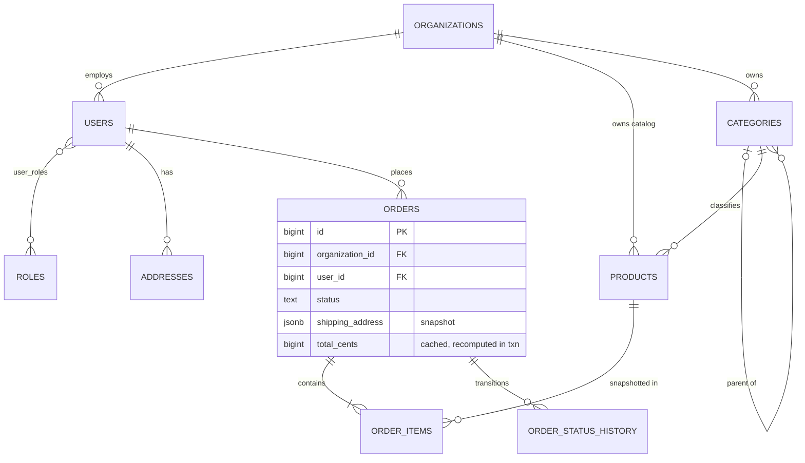
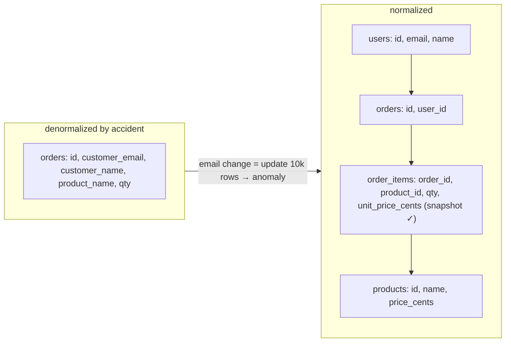
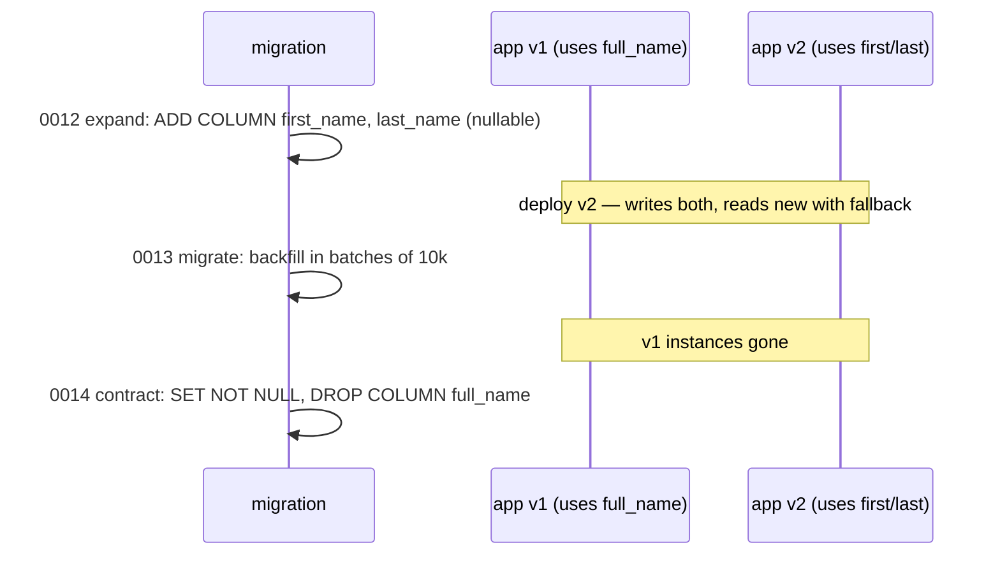

# Module 3.12 — تصميم قواعد البيانات
## Database Design: from requirements to schema — entities, normalization (1NF–3NF, by intuition), deliberate denormalization, migrations, and the store schema for Project 4

> **المستوى:** Level 3 | **الموقع:** [12 من 14]
> **السابق:** [M3.11 — SQL From Zero](module-3.11-sql-from-zero.md) | **التالي:** [M3.13 — Indexes](module-3.13-indexes.md)

---

## 1. المتطلبات
- [ ] الجداول، PK/FK، القيود، العلاقات الثلاث — [M3.10](module-3.10-databases-from-zero.md)
- [ ] JOIN/GROUP BY وfan-out، N+1 — [M3.11](module-3.11-sql-from-zero.md)
- [ ] الأشجار في جدول (`parent_id`)، الترتيب الطوبولوجي للـ migrations — [M3.4](module-3.4-trees.md), [M3.6](module-3.6-graphs.md)

## 2. أهداف التعلّم
- تحويل **متطلبات نصية** إلى **كيانات وعلاقات** (ERD) بطريقة منهجية: الأسماء → جداول، الصفات → أعمدة، الأفعال/"له" → علاقات، "لكل X عدة Y؟" → اتجاه FK.
- تطبيق **التطبيع** (normalization) بالحدس لا بالتعريفات: 1NF (لا قوائم في خلية)، 2NF/3NF (كل حقيقة في مكان واحد وتعتمد على المفتاح فقط) — واكتشاف **شذوذ التحديث** الذي يمنعه.
- اتخاذ قرار **إلغاء التطبيع المقصود** (denormalization): لقطات تاريخية، عدّادات مخبّأة، جداول تقارير — مع قاعدة "اكتب السبب وآلية الاتساق".
- اختيار الأنماط الشائعة: `status` + سجل انتقالات، soft delete، `created_at/updated_at`، multi-tenancy بـ `organization_id`، سجل تدقيق (audit log)، `jsonb` لما هو فعلًا متغير الشكل.
- إدارة التغيير بـ **migrations**: ملفات SQL مرقّمة تُطبَّق مرة واحدة بالترتيب (جدول `schema_migrations`)، تغييرات **متوافقة مع الإصدار السابق** (expand → migrate → contract) لأن الكود القديم والجديد يعملان معًا أثناء النشر.

---

## 3. شرح للمبتدئ

### من المتطلبات إلى الكيانات (الطريقة)
المتطلب: *"متجر بعدة مؤسسات (tenants). لكل مؤسسة مستخدمون بأدوار. المستخدم يطلب منتجات من كتالوج المؤسسة؛ الطلب يحوي بنودًا بكميات وأسعار وقت الشراء، له حالة تتغير (pending→paid→shipped) وعنوان شحن. المنتجات مصنّفة بشجرة تصنيفات. نحتاج تقرير مبيعات شهري."*
1. **الأسماء المتكررة = كيانات**: Organization, User, Role, Product, Category, Order, OrderItem, Address. (ليس كل اسم جدولًا: "الكمية" صفة، "الحالة" عمود + ربما جدول تاريخ.)
2. **الصفات = أعمدة** بنوعها وقيدها (M3.10).
3. **"له/يحوي/ينتمي" = علاقات**، واسأل في الاتجاهين: "مؤسسة لها عدة مستخدمين؟ نعم. مستخدم ينتمي لعدة مؤسسات؟" إن نعم → N:M (`memberships`)؛ إن لا → 1:N (FK في `users`). الإجابة **قرار منتج** — اسأل، لا تخمّن (L4-M4.2 requirements).
4. **ما يتغيّر عبر الزمن ويجب تذكّره = لقطة أو جدول تاريخ**: سعر البند، عنوان الشحن، حالة الطلب.
5. **أسئلة التقارير** تُملي ما تحتاج فهرسته أو تجميعه مسبقًا (M3.13، وليس تغيير النموذج لها).
6. ارسم ERD (Mermaid `erDiagram`)، ثم اكتب `schema.sql`، ثم **اختبره بالاستعلامات الخمسة الأكثر أهمية** قبل أي كود.

### التطبيع بالحدس: "كل حقيقة في مكان واحد"
التطبيع = ترتيب الأعمدة في جداول بحيث **لا تتكرر الحقيقة الواحدة**. لماذا؟ **شذوذ التحديث** (update anomaly): إن خزّنت `customer_email` في كل طلب، فتغيير البريد يتطلب تحديث 10k صف — وستنسى صفًا وتصبح لديك حقيقتان متناقضتان. بالحدس:
- **1NF**: لا قوائم داخل خلية. `tags = 'a,b,c'` أو `product_ids = '1,5,9'` → جدول صفوف. (استثناء مدروس: `text[]`/`jsonb` لما لا تستعلم عنه بشرط ولا تربطه بـ FK.)
- **2NF/3NF**: كل عمود يصف **مفتاح الجدول** فقط، لا شيئًا آخر. `order_items.product_name` يصف المنتج لا البند → ينتمي لـ `products`. `users.organization_name` يصف المؤسسة → `organizations`. الاختبار: "إذا تغيّر هذا، كم صفًا يجب تحديثه؟" إن كان الجواب > 1 فالحقيقة في المكان الخطأ.
- ما بعد 3NF (BCNF, 4NF…) نادرًا يغيّر قرارك عمليًا — تأجَّل.

### إلغاء التطبيع المقصود (وليس الكسول)
أحيانًا تكرر عمدًا، بشرط **توثيق السبب وآلية الاتساق**:
- **لقطات تاريخية**: `order_items.unit_price_cents`، `orders.shipping_address` (jsonb أو أعمدة) — ليست تكرارًا؛ هي **حقيقة مختلفة** ("السعر وقت الشراء") لا تتغير.
- **عدّادات/مجاميع مخبّأة**: `orders.total_cents`, `products.review_count` — لتجنّب `SUM` في كل عرض. الاتساق: تُحدَّث في نفس المعاملة (M3.14) أو بـ trigger، وتُعاد بوظيفة "إعادة حساب" للتصحيح.
- **جداول تقارير** (`daily_sales(day, product_id, revenue)`) تُملأ ليليًا/تدريجيًا — القراءة الثقيلة لا تلمس الجداول الحية.
القاعدة: **طبّع أولًا، ألغِ التطبيع عند قياس**، واكتب التعليق بجانب العمود.

### أنماط ستستخدمها في كل schema
- `created_at timestamptz NOT NULL DEFAULT now()`, `updated_at` (trigger أو التطبيق).
- **الحالة**: `status text CHECK (...)` + جدول `order_status_history(order_id, from, to, at, by)` عندما تهم "متى ولماذا".
- **Soft delete**: `deleted_at` — عندما يُشار إلى الصف من مكان آخر أو يلزم للتدقيق؛ وإلا احذف فعلًا. (`UNIQUE` يحتاج `WHERE deleted_at IS NULL` جزئيًا.)
- **Multi-tenancy**: `organization_id` في **كل** جدول خاص بالمستأجر (حتى `order_items` أحيانًا) → كل استعلام يفلتر به، وفهرس مركّب يبدأ به (M3.13)، وفي L5 Row-Level Security.
- **Audit log**: `audit_events(id, at, actor_id, action, entity, entity_id, data jsonb)` append-only.
- **`jsonb`**: للخصائص متغيرة الشكل حقًا (مواصفات منتج تختلف بالفئة، payload خارجي) — ليس لتجنّب تصميم الأعمدة. يمكن فهرسته (GIN) لكنه بلا FK ولا CHECK سهل.
- **المعرّفات**: `bigint identity` داخليًا؛ `public_id uuid` إن كانت تُعرض في URLs (M3.9).

### Migrations: الـ schema كود له تاريخ
`schema.sql` واحد يكفي لليوم الأول. بعده كل تغيير = **ملف migration** مرقّم (`0007_add_orders_shipping_address.sql`) يُطبَّق **مرة واحدة** بالترتيب على كل بيئة، وجدول `schema_migrations(version, applied_at)` يتذكّر ما طُبّق. المبادئ:
1. **لا تعدّل migration بعد نشره**؛ أضف جديدًا.
2. **كل migration داخل معاملة** (PostgreSQL يدعم DDL transactional — ميزة كبيرة) ما لم يكن `CREATE INDEX CONCURRENTLY` (لا يعمل داخل معاملة).
3. **التوافق مع الإصدار السابق**: أثناء النشر (L5) يعمل الكود القديم والجديد معًا على نفس DB. لذلك إعادة تسمية عمود = **expand** (أضف العمود الجديد) → **migrate** (انسخ/اكتب في الاثنين) → **contract** (أزل القديم بعد نشر الكود الذي لا يستخدمه). حذف عمود يستخدمه كود يعمل = انقطاع.
4. **الأقفال**: `ALTER TABLE ... ADD COLUMN ... DEFAULT` رخيص في PG ≥ 11؛ `ADD COLUMN NOT NULL` على جدول ضخم بلا default يعيد كتابة الجدول؛ `CREATE INDEX` بلا `CONCURRENTLY` يقفل الكتابة. ضع `SET lock_timeout = '5s'` في بداية migrations الإنتاج.
5. **Down migrations** اختيارية؛ الأهم خطة "التراجع للأمام" (fix forward) ونسخة احتياطية قبل الكبيرة.
الأدوات (node-pg-migrate، Prisma Migrate، Flyway، dbmate) تفعل هذا؛ في Project 4 تكتب الـ runner بنفسك (30 سطرًا) لتفهمه.

---

## 4. النموذج الذهني

```
متطلبات → أسماء = كيانات ; صفات = أعمدة ; "له" = علاقة (اسأل الاتجاهين) ; ما يتغيّر ويُتذكَّر = لقطة/تاريخ
تطبيع = كل حقيقة في مكان واحد ; اختبار: "إذا تغيّر هذا، كم صفًا أحدّث؟" > 1 = مكان خطأ
إلغاء تطبيع مقصود: لقطات | عدّادات مخبّأة (+آلية اتساق) | جداول تقارير — موثّق، بعد قياس
أنماط: timestamps | status + history | soft delete | organization_id في كل جدول | audit log | jsonb للمتغير حقًا
Migrations: ملفات مرقّمة تُطبَّق مرة + جدول versions ; معاملة ; expand→migrate→contract ; lock_timeout
```

## 5. الرسم التوضيحي







## 6. مثال بسيط

```sql
-- migrations/0001_init.sql — schema المتجر لـ Project 4 (مؤسسات متعددة، لقطات، تاريخ حالات)
BEGIN;
CREATE TABLE organizations (id bigint GENERATED ALWAYS AS IDENTITY PRIMARY KEY, name text NOT NULL, created_at timestamptz NOT NULL DEFAULT now());
CREATE TABLE users (
  id bigint GENERATED ALWAYS AS IDENTITY PRIMARY KEY,
  organization_id bigint NOT NULL REFERENCES organizations(id),
  email text NOT NULL, display_name text NOT NULL CHECK (length(display_name) BETWEEN 1 AND 100),
  created_at timestamptz NOT NULL DEFAULT now(), deleted_at timestamptz
);
CREATE UNIQUE INDEX users_email_active ON users (lower(email)) WHERE deleted_at IS NULL;   -- فريد بين الأحياء فقط
CREATE TABLE roles (id smallint PRIMARY KEY, name text NOT NULL UNIQUE);
INSERT INTO roles VALUES (1,'owner'), (2,'staff'), (3,'customer');
CREATE TABLE user_roles (user_id bigint REFERENCES users(id) ON DELETE CASCADE, role_id smallint REFERENCES roles(id), PRIMARY KEY (user_id, role_id));
CREATE TABLE categories (
  id bigint GENERATED ALWAYS AS IDENTITY PRIMARY KEY, organization_id bigint NOT NULL REFERENCES organizations(id),
  parent_id bigint REFERENCES categories(id), name text NOT NULL, CHECK (parent_id <> id)      -- شجرة (M3.4)؛ الدورات الأعمق تُمنع في التطبيق/trigger
);
CREATE TABLE products (
  id bigint GENERATED ALWAYS AS IDENTITY PRIMARY KEY, organization_id bigint NOT NULL REFERENCES organizations(id),
  category_id bigint REFERENCES categories(id), name text NOT NULL,
  price_cents bigint NOT NULL CHECK (price_cents >= 0), stock integer NOT NULL DEFAULT 0 CHECK (stock >= 0),
  attributes jsonb NOT NULL DEFAULT '{}'::jsonb,                                              -- متغير الشكل حقًا (لون/مقاس/…)
  created_at timestamptz NOT NULL DEFAULT now(), updated_at timestamptz NOT NULL DEFAULT now(), deleted_at timestamptz
);
CREATE TABLE addresses (id bigint GENERATED ALWAYS AS IDENTITY PRIMARY KEY, user_id bigint NOT NULL REFERENCES users(id) ON DELETE CASCADE, line1 text NOT NULL, city text NOT NULL, country char(2) NOT NULL);
CREATE TABLE orders (
  id bigint GENERATED ALWAYS AS IDENTITY PRIMARY KEY, organization_id bigint NOT NULL REFERENCES organizations(id),
  user_id bigint NOT NULL REFERENCES users(id),
  status text NOT NULL DEFAULT 'pending' CHECK (status IN ('pending','paid','shipped','cancelled')),
  shipping_address jsonb NOT NULL,                                                             -- لقطة مقصودة: العنوان وقت الطلب
  total_cents bigint NOT NULL DEFAULT 0,                                                       -- مخبّأ مقصود: يُعاد حسابه في نفس المعاملة (M3.14)
  created_at timestamptz NOT NULL DEFAULT now(), updated_at timestamptz NOT NULL DEFAULT now()
);
CREATE TABLE order_items (
  order_id bigint NOT NULL REFERENCES orders(id) ON DELETE CASCADE, product_id bigint NOT NULL REFERENCES products(id),
  quantity integer NOT NULL CHECK (quantity > 0), unit_price_cents bigint NOT NULL CHECK (unit_price_cents >= 0),  -- لقطة
  PRIMARY KEY (order_id, product_id)
);
CREATE TABLE order_status_history (
  id bigint GENERATED ALWAYS AS IDENTITY PRIMARY KEY, order_id bigint NOT NULL REFERENCES orders(id) ON DELETE CASCADE,
  from_status text, to_status text NOT NULL, changed_by bigint REFERENCES users(id), changed_at timestamptz NOT NULL DEFAULT now(), reason text
);
CREATE TABLE audit_events (id bigint GENERATED ALWAYS AS IDENTITY PRIMARY KEY, at timestamptz NOT NULL DEFAULT now(), actor_id bigint, action text NOT NULL, entity text NOT NULL, entity_id bigint, data jsonb);
COMMIT;
```

## 7. مثال كود

```typescript
// src/migrate.ts — runner بسيط: يطبّق ملفات migrations/*.sql مرة واحدة بالترتيب، كل ملف في معاملة، مع قفل ضد التشغيل المتزامن
import { readdir, readFile } from "node:fs/promises"; import { join } from "node:path";
import { pool } from "./db.js";

export async function migrate(dir = "migrations") {
  const client = await pool.connect();
  try {
    await client.query("SELECT pg_advisory_lock(727)");                   // نسختان من التطبيق تقلعان معًا → واحدة فقط تهاجر
    await client.query("CREATE TABLE IF NOT EXISTS schema_migrations (version text PRIMARY KEY, applied_at timestamptz NOT NULL DEFAULT now())");
    const applied = new Set((await client.query<{ version: string }>("SELECT version FROM schema_migrations")).rows.map(r => r.version));
    const files = (await readdir(dir)).filter(f => /^\d{4}_.+\.sql$/.test(f)).sort();   // الترتيب بالرقم = الترتيب الطوبولوجي الضمني (M3.6)
    for (const f of files) {
      const version = f.slice(0, 4);
      if (applied.has(version)) continue;
      const sql = await readFile(join(dir, f), "utf8");
      const concurrently = /CONCURRENTLY/i.test(sql);                      // لا يمكن داخل معاملة
      console.log("applying", f, concurrently ? "(no txn)" : "");
      try {
        if (!concurrently) await client.query("BEGIN");
        await client.query("SET lock_timeout = '5s'");                     // لا تجمّد الإنتاج بانتظار قفل
        await client.query(sql);
        await client.query("INSERT INTO schema_migrations (version) VALUES ($1)", [version]);
        if (!concurrently) await client.query("COMMIT");
      } catch (e) { if (!concurrently) await client.query("ROLLBACK"); throw new Error(`migration ${f} failed: ${(e as Error).message}`); }   // فشل = توقف؛ لا تكمل فوق schema نصفي
    }
    console.log("migrations up to date");
  } finally { await client.query("SELECT pg_advisory_unlock(727)"); client.release(); }
}
if (process.argv[1]?.endsWith("migrate.ts") || process.argv[1]?.endsWith("migrate.js")) { await migrate(); await pool.end(); }
```

```sql
-- migrations/0002_users_split_name.sql — expand (آمن مع v1 الذي يقرأ display_name)
ALTER TABLE users ADD COLUMN first_name text, ADD COLUMN last_name text;
-- migrations/0003_users_backfill_name.sql — migrate: دفعات (لا UPDATE واحد على 50M صف يقفل الجدول دقائق)
UPDATE users SET first_name = split_part(display_name, ' ', 1), last_name = NULLIF(substr(display_name, length(split_part(display_name,' ',1)) + 2), '')
WHERE first_name IS NULL AND id IN (SELECT id FROM users WHERE first_name IS NULL ORDER BY id LIMIT 10000);   -- يُكرَّر حتى 0 صف (سكربت)
-- migrations/0004_users_contract_name.sql — contract: فقط بعد اختفاء كل نسخ v1
ALTER TABLE users ALTER COLUMN first_name SET NOT NULL;
ALTER TABLE users DROP COLUMN display_name;
```

## 8. مثال من العالم الحقيقي
- **Shopify/GitHub/Stripe**: كلها multi-tenant على PostgreSQL/MySQL بـ `shop_id`/`account_id` في كل جدول؛ Shopify يشرح "pods" لاحقًا (L7).
- **Rails `schema_migrations`، Django `django_migrations`، Prisma `_prisma_migrations`**: نفس الجدول الذي كتبته.
- **GitHub `gh-ost`، Percona `pt-online-schema-change`، PG `pg_repack`**: أدوات لتغييرات schema بلا قفل على جداول ضخمة — نفس مبدأ expand/contract.
- **Stripe API versioning**: لقطات (`order_items` snapshot) على مستوى البيانات والـ API.
- **PostgreSQL Wiki "Don't Do This"**: قائمة الأخطاء الشائعة (timestamp بلا tz، `char(n)`، `money`, `serial`).

## 9. مثال من الإنتاج
**حادثة "إعادة تسمية عمود أسقطت الموقع 11 دقيقة":** migration واحد: `ALTER TABLE orders RENAME COLUMN total TO total_cents` نُشر مع كود جديد. أثناء النشر المتدرّج (L5) كانت 6 نسخ من الكود **القديم** تعمل → كل استعلام فيها `column "total" does not exist` → 500 لـ 60% من الطلبات حتى اكتمل النشر؛ ثم فشل rollback لأن الكود القديم لا يعرف العمود الجديد. أضف: `ALTER` على جدول بـ 80M صف انتظر قفل `ACCESS EXCLUSIVE` خلف استعلام تقارير طويل، وخلفه اصطفت **كل** الكتابات (بلا `lock_timeout`). الإصلاح: expand/migrate/contract على ثلاث نشرات، `lock_timeout` في كل migration، فحص CI يرفض `RENAME`/`DROP COLUMN` بلا وسم موافقة، وقاعدة: migration لا يُنشر أبدًا مع الكود الذي يحتاجه في نفس الخطوة. **الدرس:** الـ schema واجهة مشتركة بين إصدارين يعملان معًا؛ غيّرها كما تغيّر API عامًا.

## 10. مفاهيم خاطئة شائعة

| ❌ | ✅ |
|---|---|
| "التطبيع نظرية أكاديمية" | = "كل حقيقة في مكان واحد"؛ اختبار "كم صفًا أحدّث؟". |
| "تكرار السعر في البند خطأ تطبيع" | لقطة = حقيقة مختلفة (السعر وقت الشراء)؛ مقصودة. |
| "jsonb يغنيني عن التصميم" | للمتغير الشكل فقط؛ لا FK، لا CHECK سهل، استعلامات أثقل. |
| "migration = تشغيل SQL على الإنتاج" | = ملف مرقّم، يُطبَّق مرة، في معاملة، متوافق مع الإصدار السابق، بـ lock_timeout. |
| "أحذف العمود القديم في نفس النشر" | الكود القديم يعمل أثناء النشر؛ contract في نشر لاحق. |

## 11. أخطاء شائعة
1. `product_name` في `order_items` **بلا** قرار (إن كان لقطة فسمّه ووثّقه؛ وإلا احذفه).
2. `organization_id` ناقص في جدول → تسريب بيانات بين المستأجرين عند نسيان JOIN (L5).
3. `UNIQUE(email)` مع soft delete → لا يمكن إعادة التسجيل؛ فهرس جزئي.
4. `status` بلا `CHECK` ولا تاريخ؛ أو تاريخ بلا `changed_by`.
5. backfill بـ `UPDATE` واحد على ملايين الصفوف (قفل + WAL ضخم) بدل دفعات.
6. تعديل migration منشور؛ أو migrations بلا جدول تتبّع ("شغّلته يدويًا على staging").

## 12. تمرين تصحيح

```sql
-- تصميم "اشتراكات": تكرار فواتير، أسعار قديمة تتغيّر بأثر رجعي، وعميل لا يستطيع العودة بعد الإلغاء
CREATE TABLE subscriptions (
  id bigint GENERATED ALWAYS AS IDENTITY PRIMARY KEY,
  user_email text NOT NULL UNIQUE,
  plan_name text NOT NULL, plan_price numeric(10,2) NOT NULL,
  features text NOT NULL,              -- 'api,export,sso'
  status text NOT NULL,
  invoices jsonb NOT NULL DEFAULT '[]'
);
```
<details><summary>💡 الحل</summary>

1. **`user_email` كمعرّف + UNIQUE**: البريد يتغيّر، والعميل الملغى لا يستطيع العودة (اشتراك ثانٍ بنفس البريد ممنوع). → `user_id FK`، وسمح بعدة اشتراكات تاريخية مع فهرس جزئي `UNIQUE (user_id) WHERE status = 'active'`.
2. **`plan_name/plan_price` مكرران في كل اشتراك**: تغيير سعر الخطة يتطلب تحديث كل الصفوف → **شذوذ**؛ لكن السعر الذي **اشترك به** العميل لقطة مشروعة. الحل: جدول `plans(id, name, price_cents)` + `subscriptions.plan_id` + `subscriptions.price_cents_at_signup` (لقطة موثّقة) — وبديل أنظف: `plan_prices` بفترات صلاحية.
3. **`features` قائمة في خلية** (1NF) → `plan_features(plan_id, feature)`؛ الاستعلام "من لديه sso؟" يصبح JOIN بفهرس بدل `LIKE '%sso%'`.
4. **`invoices jsonb`**: الفواتير كيان مالي بتجميعات وتقارير وتفرّد → جدول `invoices(id, subscription_id, period_start, period_end, amount_cents, status)` مع `UNIQUE (subscription_id, period_start)` لمنع **تكرار الفواتير** (السبب الأول في الشكوى).
5. `status` بلا `CHECK` ولا تاريخ؛ المال `numeric(10,2)` مقبول لكن السنتات أبسط؛ لا `created_at`.
</details>

## 13. تمرين معماري
وسّع schema المتجر لدعم: **خصومات/كوبونات** (نسبة أو مبلغ، حد استخدام كلي ولكل مستخدم، فترة صلاحية، تُطبَّق على طلب أو بند؟)، و**مرتجعات** جزئية. لكل كيان: الجدول، القيود، ما يُلتقط كلقطة في الطلب (الخصم المطبّق يجب ألا يتغيّر إذا عُدّل الكوبون لاحقًا)، وكيف تمنع تجاوز حد الاستخدام تحت التزامن (تلميح: عدّاد + `CHECK` + `UPDATE ... WHERE used < max` — M3.14). ثم اكتب migrations الثلاثة (expand/migrate/contract) لتحويل `orders.shipping_address jsonb` إلى FK على `addresses` — هل هذا تحسين أصلًا؟ ACTRR.

## 14. الصلة بعصر AI
AI يولّد ERDs معقولة بسرعة — استخدمه كمسودة ثم طبّق اختبار "كم صفًا أحدّث؟" على كل عمود، واسأل عن كل تكرار: لقطة مقصودة أم خطأ؟ في migrations، اطلب صراحةً *"expand/migrate/contract، lock_timeout، backfill بدفعات، لا RENAME/DROP في نفس نشر الكود"* — AI يعرف هذه المصطلحات لكنه لا يطبّقها تلقائيًا. وراجع كل `CASCADE` وكل `jsonb` بسؤال "لماذا".

## 15–17. Master / Understand / Defer
- 🔴 الطريقة من المتطلبات إلى ERD؛ التطبيع كـ "حقيقة في مكان واحد" واختبار التحديث؛ اللقطات مقابل التكرار الكسول؛ `organization_id` في كل جدول؛ migrations: مرقّمة/مرة واحدة/معاملة/متوافقة مع السابق.
- 🟠 status history، soft delete بفهرس جزئي، audit log، jsonb بانضباط؛ expand/migrate/contract بالتفصيل؛ backfill بدفعات؛ `lock_timeout`؛ advisory lock للـ runner.
- ⚪ BCNF/4NF؛ temporal tables وفترات الصلاحية؛ partitioning؛ sharding بالمستأجر (L7)؛ أدوات online schema change.

## 18. الخلاصة
1. من المتطلبات: أسماء → كيانات، صفات → أعمدة، "له" → علاقات بسؤال الاتجاهين، ما يتغيّر ويُتذكَّر → لقطة/تاريخ.
2. التطبيع = كل حقيقة في مكان واحد؛ اختبار "كم صفًا أحدّث؟" يكشف المكان الخطأ.
3. ألغِ التطبيع عمدًا وموثَّقًا: لقطات، عدّادات مع آلية اتساق، جداول تقارير — بعد القياس.
4. أنماط ثابتة: timestamps، status + history، soft delete، `organization_id` في كل جدول، audit log، jsonb للمتغير فقط.
5. الـ schema واجهة بين إصدارين يعملان معًا: migrations مرقّمة في معاملات، expand→migrate→contract، `lock_timeout`، backfill بدفعات.

## 19. مراجع رسمية
- PostgreSQL — `ALTER TABLE` (locks, fast ADD COLUMN DEFAULT): https://www.postgresql.org/docs/current/sql-altertable.html
- PostgreSQL — Explicit Locking (lock levels, `lock_timeout`): https://www.postgresql.org/docs/current/explicit-locking.html
- PostgreSQL Wiki — Don't Do This: https://wiki.postgresql.org/wiki/Don%27t_Do_This
- Mermaid — Entity Relationship Diagrams: https://mermaid.js.org/syntax/entityRelationshipDiagram.html
- Braintree — Safe Operations for High Volume PostgreSQL (expand/contract patterns): https://medium.com/paypal-tech/postgresql-at-scale-database-schema-changes-without-downtime-20d3749ed680

## المصطلحات
| العربية | English |
|---|---|
| كيان | Entity |
| مخطط الكيانات والعلاقات | Entity-Relationship Diagram (ERD) |
| تطبيع / إلغاء التطبيع | Normalization / Denormalization |
| شذوذ التحديث | Update anomaly |
| الشكل الطبيعي الأول/الثالث | 1NF / 3NF |
| لقطة | Snapshot |
| عدّاد مخبّأ | Cached counter / Materialized aggregate |
| تعدد المستأجرين | Multi-tenancy |
| سجل تدقيق | Audit log |
| ترحيل المخطط | Schema migration |
| توسيع → ترحيل → تقليص | Expand → Migrate → Contract |
| ملء لاحق | Backfill |
| مهلة القفل | Lock timeout |
| قفل استشاري | Advisory lock |

> **التالي:** [Module 3.13 — Indexes](module-3.13-indexes.md)
