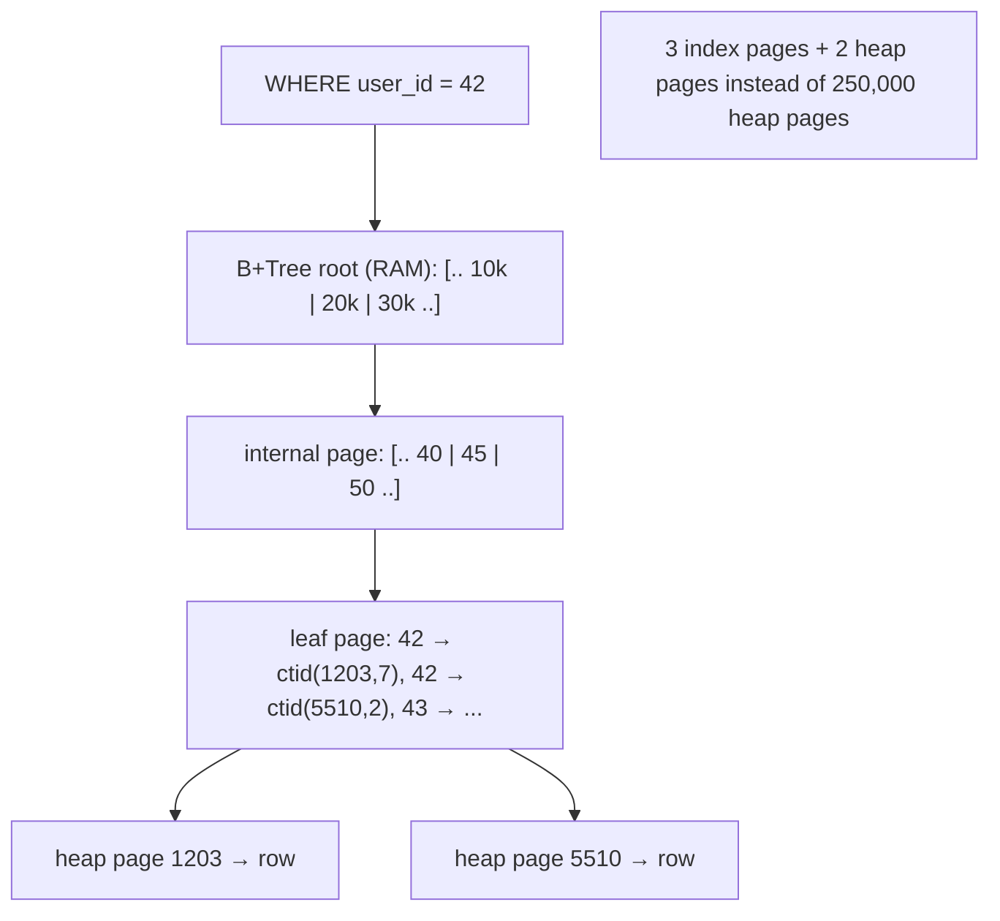
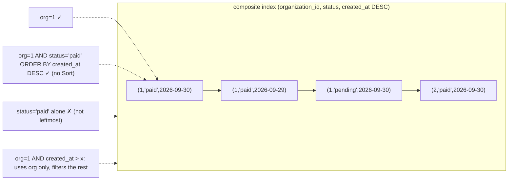
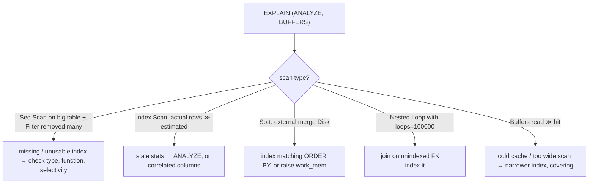

# Module 3.13 — الفهارس
## Indexes: the B+Tree you already understand, reading EXPLAIN, composite/partial/covering indexes, and the write/space cost

> **المستوى:** Level 3 | **الموقع:** [13 من 14]
> **السابق:** [M3.12 — Database Design](module-3.12-database-design.md) | **التالي:** [M3.14 — Transactions & ACID](module-3.14-transactions-acid.md)

---

## 1. المتطلبات
- [ ] B+Tree: عقدة = صفحة، تفرّع كبير، 3–4 مستويات، أوراق مربوطة — [M3.4](module-3.4-trees.md)
- [ ] Big-O والقياس بأحجام ×10؛ hash/merge/nested loop — [M3.8](module-3.8-big-o.md), [M3.11](module-3.11-sql-from-zero.md)
- [ ] جدول الكمون: RAM ns، SSD μs، وعدد الرحلات يحكم — [L2-M2.2](../level-2-computer-systems/module-2.2-cpu-cache-ram.md)

## 2. أهداف التعلّم
- شرح **الفهرس** كهيكل منفصل (B+Tree) مرتّب بعمود/أعمدة، أوراقه تشير إلى الصفوف، يحوّل `WHERE col = x` من مسح كامل O(n) إلى O(log n) + قراءة الصفوف — وأن PK/UNIQUE ينشئان فهارس تلقائيًا بينما **FK لا**.
- قراءة **`EXPLAIN (ANALYZE, BUFFERS)`**: `Seq Scan` vs `Index Scan` vs `Index Only Scan` vs `Bitmap Heap Scan`، `rows` المقدّر vs الفعلي، `cost`، `Buffers: shared hit/read`، `Sort`/`Hash Join`/`Nested Loop` — وتشخيص "لماذا لم يُستخدم فهرسي؟".
- تصميم **فهارس مركّبة** بقاعدة "الأعمدة بالترتيب: مساواة، ثم نطاق/ترتيب" (leftmost prefix)، و**جزئية** (`WHERE deleted_at IS NULL`)، و**تغطية** (`INCLUDE`) لـ index-only scans، و**وظيفية** (`lower(email)`).
- فهم **التكلفة**: كل فهرس يُحدَّث عند كل كتابة (أبطأ INSERT/UPDATE)، يشغل مساحة، وقد يُهمل إن كان الاستعلام يعيد نسبة كبيرة من الجدول (الانتقائية) — وبالتالي "فهرس على كل عمود" خطأ، و`CREATE INDEX CONCURRENTLY` في الإنتاج.
- معرفة حدود B-Tree (`LIKE '%x%'`، JSONB، بحث نصي، مصفوفات) وأن لها فهارس أخرى (GIN، trigram) كأسماء.

---

## 3. شرح للمبتدئ

### ما الفهرس فعلًا؟
الجدول (heap في مصطلح PG — غير heap الذاكرة!) = صفحات 8KB تحوي صفوفًا **بلا ترتيب**. `SELECT * FROM orders WHERE user_id = 42` بلا فهرس = **Seq Scan**: اقرأ **كل** الصفحات (20M صف ≈ 2GB ≈ ثوانٍ، وتطرد كاش DB لغيرها). الفهرس = **هيكل ثانٍ** على القرص: B+Tree (M3.4) مفاتيحه قيم `user_id` مرتبة، وفي أوراقه **مؤشرات** (`ctid` = رقم الصفحة + الموضع) إلى الصفوف. البحث: 3–4 صفحات من الفهرس (الجذر والمستويات العليا في RAM دائمًا) + صفحة لكل صف مطابق. 20M صف → ~4 قراءات + k. هذا الفرق بين 3 ثوانٍ و0.3ms.

**ما الذي يُفهرَس تلقائيًا؟** PK وUNIQUE (القيد يحتاج الفهرس ليُفرض). **FK لا يُفهرَس تلقائيًا في PostgreSQL** — و`orders.user_id`، `order_items.order_id`، `products.organization_id` هي بالضبط ما تربط به وتفلتر به. أول فهارسك في Project 4: **كل FK تستعلم به**. (وحذف صف من `users` يحتاج فحص `orders.user_id` — بلا فهرس = Seq Scan لكل حذف!)

### قراءة EXPLAIN: الأداة التي تجعلك ترى الخوارزمية
```sql
EXPLAIN (ANALYZE, BUFFERS) SELECT id, status FROM orders WHERE user_id = 42 ORDER BY created_at DESC LIMIT 20;
```
- **`Seq Scan on orders`**: مسح كامل. مقبول لجداول صغيرة (< بضعة آلاف صف — DB تختاره عمدًا لأن قراءة 10 صفحات متتالية أرخص من قفزات الفهرس) أو لاستعلام يعيد معظم الجدول.
- **`Index Scan using idx on orders`**: بحث في الفهرس ثم قراءة كل صف من الجدول (قفزة عشوائية لكل صف). **`Index Only Scan`**: كل الأعمدة المطلوبة في الفهرس → لا يلمس الجدول (الأسرع؛ يحتاج `VACUUM` حديثًا لـ visibility map). **`Bitmap Heap Scan`**: عدة آلاف تطابق → اجمع المواضع من الفهرس، رتّبها، ثم اقرأ الصفحات بترتيب فيزيائي (وسط بين الاثنين).
- **`rows=1200` (estimated) vs `rows=85000` (actual)**: فجوة كبيرة = إحصاءات قديمة (`ANALYZE orders`) أو ارتباط بين أعمدة؛ تقديرات خاطئة = خطط خاطئة (nested loop على مليون).
- **`cost=0.56..8.60`**: وحدات نسبية (بدء..إجمالي) يستخدمها المخطط للمقارنة — ليست ms.
- **`actual time=0.03..0.41 ms`, `loops=`**: الزمن الحقيقي؛ اضرب في `loops` للعقد الداخلية.
- **`Buffers: shared hit=4 read=120`**: صفحات من الكاش vs من القرص. `read` كبير = cold أو مسح واسع. هذا الرقم هو تكلفتك الحقيقية.
- **`Sort Method: top-N heapsort`** (M3.5) vs `external merge Disk:` (تجاوز `work_mem` — قرص!)؛ **`Hash Join`/`Merge Join`/`Nested Loop`** (M3.11) — الأخير مع `Index Scan` داخلي ممتاز لصفوف قليلة، كارثي لـ 100k × 100k.
- **`Filter: ... Rows Removed by Filter: 90000`**: الفهرس وجد الكثير ثم أُسقط معظمه — الفهرس غير انتقائي أو ينقصه عمود.

**لماذا لم يُستخدم فهرسي؟** (1) الجدول صغير؛ (2) الاستعلام يعيد > ~5–10% من الصفوف (الانتقائية ضعيفة: `status = 'paid'` حيث 90% مدفوعة)؛ (3) النوع لا يطابق (`WHERE id = '42'` نص vs bigint، أو `user_id::text`); (4) دالة على العمود (`lower(email) = ...` بلا فهرس وظيفي، `date(created_at) = ...` → استخدم نطاقًا `>= AND <`); (5) `LIKE '%x'` أو بادئة متغيرة؛ (6) `OR` بين أعمدة مختلفة (bitmap OR أحيانًا)؛ (7) إحصاءات قديمة؛ (8) `ORDER BY` لا يطابق اتجاه الفهرس.

### تصميم الفهارس المركّبة والمتخصصة
- **مركّب** `(organization_id, created_at)`: مرتّب بالأول ثم الثاني — كدليل هاتف (الاسم الأخير ثم الأول). يخدم `WHERE org = 1`، `WHERE org = 1 AND created_at > x`، `WHERE org = 1 ORDER BY created_at` — **ولا** يخدم `WHERE created_at > x` وحده (leftmost prefix). القاعدة: **أعمدة المساواة أولًا، ثم عمود النطاق/الترتيب الواحد**. `(org, status, created_at DESC)` يخدم صفحة "طلبات المؤسسة المدفوعة بالأحدث" بـ Index Scan بلا Sort — وهو فهرس keyset pagination من M3.9 بالضبط (`(created_at, id)` للـ tie-break).
- **جزئي** `CREATE INDEX ... ON users (lower(email)) WHERE deleted_at IS NULL`: أصغر، وفريد بين الأحياء فقط (M3.12). و`ON orders (created_at) WHERE status = 'pending'` لطابور معالجة صغير فوق جدول ضخم.
- **تغطية** `(user_id) INCLUDE (status, total_cents)`: أعمدة إضافية في الأوراق بلا ترتيب → Index Only Scan لاستعلام القائمة.
- **وظيفي** `(lower(email))`, `((attributes->>'color'))`.
- **أنواع أخرى** (أسماء الآن): **GIN** لـ `jsonb @>`, المصفوفات، البحث النصي؛ **`pg_trgm` GIN** لـ `LIKE '%term%'`/`ILIKE`؛ **BRIN** للجداول الضخمة المرتّبة فيزيائيًا بالزمن (سجلات)؛ **Hash** نادرًا.

### الثمن: الكتابة والمساحة والصيانة
كل فهرس = B+Tree يجب تحديثه عند كل `INSERT`/`DELETE`/`UPDATE` لعمود مفهرَس (وفي PG حتى UPDATE لعمود آخر قد يلمس الفهارس ما لم يحدث HOT update). جدول بـ 8 فهارس: الإدراج يكتب 9 أماكن + WAL. المساحة: فهرس على `bigint` لـ 100M صف ≈ 2–3GB. لذلك: فهرس لما **تستعلم به فعلًا** (`pg_stat_user_indexes.idx_scan = 0` بعد أسابيع = احذفه)، لا على أعمدة منخفضة الانتقائية وحدها (`boolean`, `status` بثلاث قيم) إلا جزئيًا، وفي الإنتاج دائمًا **`CREATE INDEX CONCURRENTLY`** (بلا قفل كتابة، خارج المعاملة — M3.12 runner)، و`REINDEX CONCURRENTLY` للمتضخّم. و`ANALYZE` بعد تحميل بيانات كبيرة.

---

## 4. النموذج الذهني

```
Index = B+Tree منفصل مرتّب بالعمود، أوراقه → صفوف ; Seq Scan O(n) → Index Scan O(log n)+k
تلقائي: PK/UNIQUE ; غير تلقائي: FK ← أول فهارسك ; EXPLAIN (ANALYZE, BUFFERS) = ترى الخوارزمية
اقرأ: نوع المسح | rows est vs actual | Buffers hit/read | Sort method | Join type | Rows Removed by Filter
مركّب: مساواة أولًا ثم نطاق/ترتيب واحد (leftmost prefix) ; جزئي WHERE ; INCLUDE للتغطية ; وظيفي lower()
لم يُستخدم؟ صغير | غير انتقائي | نوع مختلف | دالة على العمود | LIKE '%x' | إحصاءات قديمة
الثمن: كل كتابة تحدّث كل فهرس + مساحة ; فهرس لما تستعلم به ; CONCURRENTLY في الإنتاج ; احذف غير المستخدم
```

## 5. الرسم التوضيحي







## 6. مثال بسيط

```sql
-- index-lab.sql — جدول كبير مزيّف، ثم شاهد الفرق (شغّله في psql مع \timing on)
CREATE TABLE big_orders AS
SELECT g AS id, (random()*100000)::bigint AS user_id, (ARRAY['pending','paid','shipped'])[1+(random()*2)::int] AS status,
       now() - (random()*365 || ' days')::interval AS created_at, (random()*10000)::bigint AS total_cents
FROM generate_series(1, 2000000) g;                                   -- 2M طلب (~150MB)
ANALYZE big_orders;

EXPLAIN (ANALYZE, BUFFERS) SELECT id, status FROM big_orders WHERE user_id = 4242;
-- Seq Scan on big_orders  (cost=0.00..42000 rows=20) (actual time=0.3..180 ms rows=19)  Rows Removed by Filter: 1999981  Buffers: shared read=14000
CREATE INDEX big_orders_user_id ON big_orders (user_id);             -- في الإنتاج: CREATE INDEX CONCURRENTLY
EXPLAIN (ANALYZE, BUFFERS) SELECT id, status FROM big_orders WHERE user_id = 4242;
-- Bitmap Heap Scan / Index Scan using big_orders_user_id (actual time=0.05..0.2 ms rows=19)  Buffers: shared hit=22   ← ×1000

-- الانتقائية: status بثلاث قيم → الفهرس لا يُستخدم (يعيد ثلث الجدول)
CREATE INDEX big_orders_status ON big_orders (status);
EXPLAIN SELECT count(*) FROM big_orders WHERE status = 'paid';        -- Seq Scan رغم الفهرس — صحيح!
-- لكن الجزئي لطابور صغير ممتاز:
UPDATE big_orders SET status = 'shipped' WHERE status = 'pending' AND id % 1000 <> 0;   -- اجعل pending نادرة (~0.03%)
DROP INDEX big_orders_status; ANALYZE big_orders;
CREATE INDEX big_orders_pending ON big_orders (created_at) WHERE status = 'pending';
EXPLAIN (ANALYZE) SELECT id FROM big_orders WHERE status = 'pending' ORDER BY created_at LIMIT 100;   -- Index Scan، بلا Sort

-- المركّب لصفحة المستخدم بالأحدث (keyset M3.9): بلا Sort، Index Only مع INCLUDE
CREATE INDEX big_orders_user_created ON big_orders (user_id, created_at DESC, id DESC) INCLUDE (status, total_cents);
VACUUM big_orders;                                                    -- يحدّث خريطة الرؤية؛ بدونه Index Only Scan يزور الجدول (Heap Fetches > 0)
EXPLAIN (ANALYZE, BUFFERS) SELECT id, status, total_cents, created_at FROM big_orders WHERE user_id = 4242 ORDER BY created_at DESC, id DESC LIMIT 20;
-- Index Only Scan using big_orders_user_created ... Heap Fetches: 0 (بعد VACUUM)

-- "لماذا لم يُستخدم؟" — دالة على العمود ونوع مختلف
CREATE INDEX big_orders_created ON big_orders (created_at);
EXPLAIN SELECT * FROM big_orders WHERE date(created_at) = current_date;              -- Seq Scan: دالة على العمود
EXPLAIN SELECT * FROM big_orders WHERE created_at >= current_date AND created_at < current_date + 1;   -- نطاق → Index/Bitmap Scan على big_orders_created
EXPLAIN SELECT * FROM big_orders WHERE user_id::text = '4242';                      -- Seq Scan: التحويل يعطّل الفهرس
```

## 7. مثال كود

```typescript
// src/explain-guard.ts — اختبار أداء في CI: الاستعلامات الحرجة يجب ألا تمسح الجداول الكبيرة مسحًا كاملًا، مع عدّ الصفحات
import { pool } from "./db.js";

type Plan = { Plan: PlanNode }; type PlanNode = { "Node Type": string; "Relation Name"?: string; "Actual Rows"?: number; "Plan Rows"?: number; "Shared Hit Blocks"?: number; "Shared Read Blocks"?: number; Plans?: PlanNode[]; "Sort Method"?: string };
const walk = (n: PlanNode, out: PlanNode[] = []): PlanNode[] => (out.push(n), n.Plans?.forEach(c => walk(c, out)), out);

export async function explain(sql: string, params: unknown[] = []) {
  const { rows } = await pool.query(`EXPLAIN (ANALYZE, BUFFERS, FORMAT JSON) ${sql}`, params);   // JSON بدل النص: قابل للفحص آليًا
  const root = (rows[0]!["QUERY PLAN"] as Plan[])[0]!.Plan, nodes = walk(root);
  return {
    seqScansOn: nodes.filter(n => n["Node Type"] === "Seq Scan").map(n => n["Relation Name"]!),
    pagesTouched: nodes.reduce((s, n) => s + (n["Shared Hit Blocks"] ?? 0) + (n["Shared Read Blocks"] ?? 0), 0),
    misestimates: nodes.filter(n => n["Actual Rows"] !== undefined && n["Plan Rows"] && (n["Actual Rows"]! / n["Plan Rows"]! > 10 || n["Plan Rows"]! / Math.max(1, n["Actual Rows"]!) > 10)).map(n => `${n["Node Type"]} est=${n["Plan Rows"]} act=${n["Actual Rows"]}`),
    diskSorts: nodes.filter(n => n["Sort Method"]?.includes("external")).length,
  };
}

const BIG_TABLES = new Set(["big_orders", "orders", "order_items", "audit_events"]);
const critical: [string, string, unknown[], number][] = [                 // [اسم، SQL، معاملات، ميزانية صفحات]
  ["orders by user (page)", "SELECT id, status, total_cents, created_at FROM big_orders WHERE user_id = $1 ORDER BY created_at DESC, id DESC LIMIT 20", [4242], 50],      // Index Only: ~10 صفحات
  ["pending queue", "SELECT id FROM big_orders WHERE status = 'pending' ORDER BY created_at LIMIT 100", [], 300],   // 100 صف متفرّقة = ~100 صفحة heap + الفهرس
];
let failed = 0;
for (const [name, sql, params, maxPages] of critical) {
  const r = await explain(sql, params);
  const badScan = r.seqScansOn.filter(t => BIG_TABLES.has(t));
  const ok = badScan.length === 0 && r.pagesTouched <= maxPages && r.diskSorts === 0;
  console.log(ok ? "✓" : "✗", name, r);
  if (!ok) failed++;
}
await pool.end();
process.exitCode = failed ? 1 : 0;     // CI يفشل عندما يفقد استعلام حرج فهرسه (migration حذفته؟ تغيّر الشرط؟)
```

## 8. مثال من العالم الحقيقي
- **Use The Index, Luke** (Markus Winand): المرجع الحر الأشهر؛ قاعدة "المساواة أولًا ثم النطاق" منه.
- **pganalyze، pg_stat_statements، Datadog DBM**: تجمع أبطأ الاستعلامات وتقترح فهارس من `EXPLAIN` — نفس القراءة التي تعلمتها.
- **Rails `strong_migrations`، `pg_hint_plan`**: الأول يمنع `CREATE INDEX` بلا `CONCURRENTLY`.
- **GitLab**: وثّق حوادث فهارس مفقودة على FKs ولديه فحص CI آلي "كل FK له فهرس".
- **SQLite `EXPLAIN QUERY PLAN`، MySQL `EXPLAIN FORMAT=JSON`**: نفس المفاهيم بأسماء أخرى (MySQL InnoDB: الجدول نفسه B+Tree مرتّب بالـ PK — clustered — فالفهارس الثانوية تحمل PK).

## 9. مثال من الإنتاج
**حادثة "DB عند 100% CPU بعد نمو هادئ":** جدول `orders` بلغ 30M صف خلال سنتين. استعلام صفحة "طلباتي" `WHERE user_id = $1 ORDER BY created_at DESC LIMIT 20` كان يستخدم فهرس `(user_id)` ثم يفرز ~400 صف لكل مستخدم — مقبول. مستخدمو B2B الكبار وصلوا 300k طلب → الفهرس يعيد 300k ctid، bitmap heap scan لـ 300k صفحة عشوائية + Sort على القرص لكل تحديث للصفحة، ×مئات الطلبات/ثانية = قرص وCPU مشبعان، وطرد كاش DB لكل الاستعلامات الأخرى (الجميع تباطأ، لا الكبار فقط). `EXPLAIN (ANALYZE, BUFFERS)` أظهر `Buffers: shared read=310000` و`Sort Method: external merge Disk: 9800kB`. الإصلاح: فهرس مركّب `(user_id, created_at DESC, id DESC) INCLUDE (status, total_cents)` أُنشئ `CONCURRENTLY` → `Index Only Scan`، 22 صفحة، 0.4ms؛ وحذف فهرس `(user_id)` القديم المتضمَّن؛ وتنبيه على `pg_stat_statements` عند `shared_blks_read` مرتفع لاستعلام. **الدرس:** الفهرس الصحيح لعام 1 ليس الصحيح لعام 3؛ راقب `Buffers` لا الزمن فقط، وصمّم الفهرس **للاستعلام كاملًا** (الفلتر + الترتيب + الأعمدة).

## 10. مفاهيم خاطئة شائعة

| ❌ | ✅ |
|---|---|
| "FK يُنشئ فهرسًا" | في PostgreSQL لا؛ أنشئه بنفسك. |
| "فهرس على كل عمود = أسرع" | كل فهرس يبطّئ الكتابة ويأخذ مساحة؛ وغير الانتقائي لا يُستخدم. |
| "DB تجاهلت فهرسي = خطأ فيها" | غالبًا قرار صحيح (جدول صغير/نسبة كبيرة) أو نوع/دالة تعطّله. |
| "`cost` بالميلي ثانية" | وحدات نسبية؛ انظر `actual time` و`Buffers`. |
| "فهرس `(a, b)` يخدم `WHERE b`" | leftmost prefix: يخدم `a` و`a,b` فقط. |
| "`LIKE '%x%'` سيستخدم B-Tree" | لا؛ `pg_trgm` GIN أو بحث نصي. |

## 11. أخطاء شائعة
1. FKs بلا فهارس (`orders.user_id`, `order_items.order_id`).
2. `CREATE INDEX` بلا `CONCURRENTLY` على جدول حي (قفل الكتابة دقائق).
3. فهرس مركّب بترتيب خاطئ (`(created_at, organization_id)` لاستعلام يفلتر بالمؤسسة).
4. دالة أو تحويل نوع على العمود المفهرَس في `WHERE`.
5. فهارس مكررة/متضمَّنة (`(a)` و`(a,b)`) أو غير مستخدمة لسنوات.
6. نسيان `ANALYZE` بعد تحميل ضخم → خطط سيئة؛ `work_mem` افتراضي (4MB) مع فرز كبير → قرص.

## 12. تمرين تصحيح

```sql
-- بحث العملاء في لوحة الإدارة بطيء (3s) رغم "وجود فهرس على email"
CREATE INDEX users_email ON users (email);
-- الاستعلام الذي يرسله التطبيق:
SELECT * FROM users WHERE lower(email) = lower($1) AND organization_id = $2 AND deleted_at IS NULL;
-- EXPLAIN: Seq Scan on users (actual rows=1) Rows Removed by Filter: 4,999,999  Buffers: shared read=61000
```

<details><summary>💡 الحل</summary>

1. **`lower(email)` دالة على العمود** → فهرس `(email)` عديم الفائدة. يلزم فهرس **وظيفي** `ON users (lower(email))`.
2. الأفضل دمج الشروط: `CREATE UNIQUE INDEX users_org_email_active ON users (organization_id, lower(email)) WHERE deleted_at IS NULL` — مساواة على عمودين + جزئي للأحياء، ويفرض التفرد داخل المؤسسة (أو عالميًا حسب المتطلب — قرار منتج M3.12).
3. `SELECT *` يمنع Index Only Scan ويجلب أعمدة لا تحتاجها؛ حدّد الأعمدة.
4. تحقق بعد الإنشاء: `EXPLAIN (ANALYZE, BUFFERS)` → `Index Scan … Buffers: shared hit≈4`. ثم احذف `users_email` إن لم يستخدمه أحد (`pg_stat_user_indexes`).
5. في الإنتاج: `CREATE INDEX CONCURRENTLY` (5M صف) + `ANALYZE users`.
</details>

## 13. تمرين معماري
صمّم مجموعة الفهارس الكاملة لـ schema المتجر (M3.12) انطلاقًا من **قائمة الاستعلامات** (اكتبها أولًا: 8–10 استعلامات لواجهة العميل والإدارة والتقارير). لكل فهرس: الاستعلام الذي يخدمه، ترتيب الأعمدة ولماذا، جزئي؟ INCLUDE؟، تكلفته على الكتابة (أي جدول يُكتب أكثر؟)، وما **لن** تفهرسه ولماذا. ثم: كيف تكتشف بعد 6 أشهر الفهارس غير المستخدمة والاستعلامات التي فقدت فهرسها (pg_stat_statements + فحص CI من §7)؟ ACTRR.

## 14. الصلة بعصر AI
AI يقترح فهارس بسخاء (وغالبًا `(status)` و`(created_at)` منفردين) — اطلب منه **خطة EXPLAIN قبل وبعد** واطلب "فهرس للاستعلام كاملًا: فلتر + ترتيب + أعمدة". والصق له مخرجات `EXPLAIN (ANALYZE, BUFFERS)` الحقيقية ليفسّرها — هذا من أفضل استخداماته — ثم تحقق أنت من `Buffers` والنوع. ولا تدع AI ينفّذ `CREATE INDEX` على الإنتاج بلا `CONCURRENTLY`.

## 15–17. Master / Understand / Defer
- 🔴 الفهرس = B+Tree منفصل، O(log n)+k؛ FK بلا فهرس تلقائي؛ قراءة `EXPLAIN (ANALYZE, BUFFERS)` (نوع المسح، est vs actual، Buffers، Sort، Join)؛ قاعدة المركّب (مساواة ثم نطاق/ترتيب، leftmost)؛ أسباب "لم يُستخدم" الثمانية؛ تكلفة الكتابة و`CONCURRENTLY`.
- 🟠 جزئي/INCLUDE/وظيفي؛ Bitmap scan؛ visibility map وVACUUM؛ `work_mem`؛ `pg_stat_user_indexes`/`pg_stat_statements`؛ فحص CI للخطط؛ GIN/trigram/BRIN كأسماء.
- ⚪ بنية صفحات B-Tree داخليًا، HOT updates، تضخّم الفهارس وREINDEX، clustered indexes (InnoDB)، LSM trees مقابل B-Tree (كتابات ثقيلة — L7).

## 18. الخلاصة
1. الفهرس B+Tree منفصل: يحوّل المسح الكامل إلى 3–4 قراءات + الصفوف المطابقة؛ الثمن كتابة أبطأ ومساحة.
2. PK/UNIQUE مفهرسان تلقائيًا؛ **FK لا** — ابدأ بها.
3. `EXPLAIN (ANALYZE, BUFFERS)` يُريك الخوارزمية: Seq/Index/Index Only/Bitmap، التقدير مقابل الفعلي، الصفحات، الفرز، نوع الربط.
4. المركّب: مساواة أولًا ثم نطاق/ترتيب واحد؛ جزئي للمجموعات الصغيرة؛ INCLUDE للتغطية؛ وظيفي للدوال — وصمّم للاستعلام كاملًا.
5. لا فهرس على كل شيء؛ `CONCURRENTLY` في الإنتاج؛ راقب غير المستخدم والذي فقد فهرسه؛ راقب `Buffers` لا الزمن فقط.

## 19. مراجع رسمية
- PostgreSQL — Indexes (types, multicolumn, partial, index-only scans): https://www.postgresql.org/docs/current/indexes.html
- PostgreSQL — Using EXPLAIN: https://www.postgresql.org/docs/current/using-explain.html
- PostgreSQL — `CREATE INDEX` (CONCURRENTLY, INCLUDE): https://www.postgresql.org/docs/current/sql-createindex.html
- Use The Index, Luke — SQL Indexing and Tuning (free book): https://use-the-index-luke.com/
- PostgreSQL — The Statistics Collector (`pg_stat_user_indexes`), `pg_stat_statements`: https://www.postgresql.org/docs/current/pgstatstatements.html

## المصطلحات
| العربية | English |
|---|---|
| فهرس | Index |
| مسح تسلسلي / بالفهرس / بالفهرس فقط | Seq Scan / Index Scan / Index Only Scan |
| مسح بخريطة بتات | Bitmap Heap Scan |
| خطة الاستعلام | Query plan |
| تكلفة مقدّرة | Estimated cost |
| إحصاءات الجدول | Table statistics (`ANALYZE`) |
| انتقائية | Selectivity |
| فهرس مركّب | Composite (multicolumn) index |
| البادئة اليسرى | Leftmost prefix |
| فهرس جزئي | Partial index |
| فهرس تغطية | Covering index (`INCLUDE`) |
| فهرس وظيفي | Expression (functional) index |
| إنشاء متزامن | `CREATE INDEX CONCURRENTLY` |
| ذاكرة العمل للفرز | `work_mem` |
| فهرس مقلوب عام | GIN index |

> **التالي:** [Module 3.14 — Transactions & ACID](module-3.14-transactions-acid.md)
