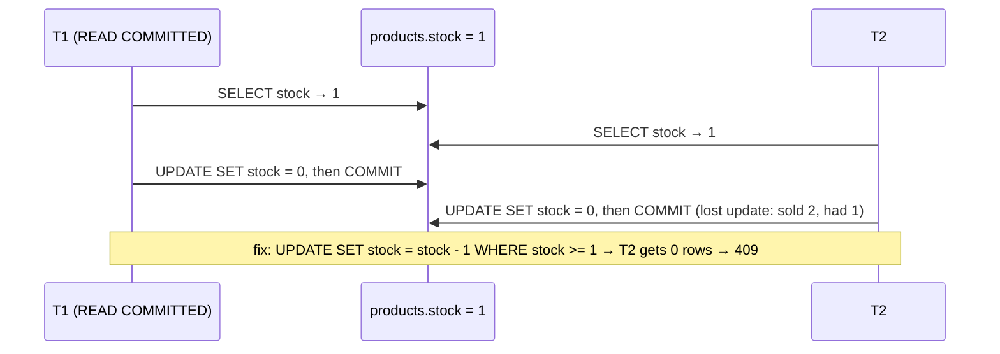
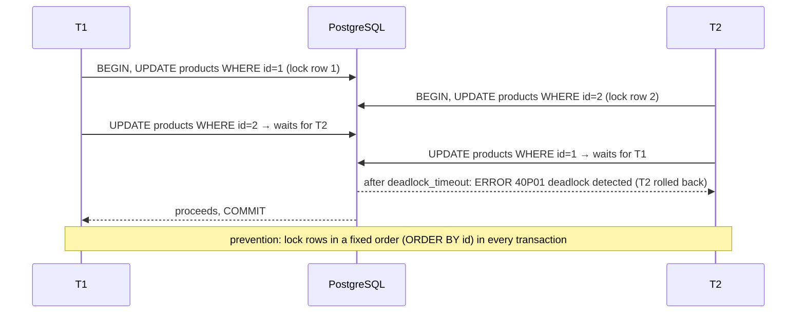
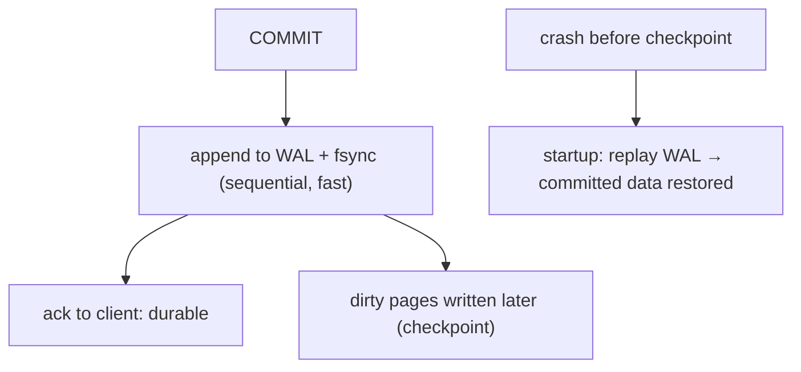

# Module 3.14 — المعاملات وACID
## Transactions & ACID: the money transfer, what each letter buys you, isolation levels by their anomalies, row locks, deadlocks, and the Project 4 order flow

> **المستوى:** Level 3 | **الموقع:** [14 من 14]
> **السابق:** [M3.13 — Indexes](module-3.13-indexes.md) | **التالي:** [Project 4 — DB-backed API](../projects/project-4-db-api/README.md) ثم [Checkpoint 3](checkpoint-3.md)

---

## 1. المتطلبات
> **قبل أن تتعلم هذا، يجب أن تفهم:**
- [ ] سباق read-modify-write و"السعر المجاني" — [L0-M0.7](../level-0-absolute-foundations/module-07-database-api-web-app.md); التحديث الذري `stock = stock - 1 WHERE stock >= 1` — [M3.11](module-3.11-sql-from-zero.md)
- [ ] الانهيار أثناء الكتابة، WAL كاسم — [M3.10](module-3.10-databases-from-zero.md); الإغلاق المتدرّج والـ pool — [L2-M2.5](../level-2-computer-systems/module-2.5-process-deep-dive.md)
- [ ] الأقفال وdeadlock بين الخيوط — [L2-M2.6](../level-2-computer-systems/module-2.6-threads.md)

## 2. أهداف التعلّم
- شرح **المعاملة** (transaction) كوحدة عمل "كلها أو لا شيء" من مثال تحويل المال، و**ACID** حرفًا حرفًا بما يشتريه كلٌّ منها (Atomicity: لا نصف تحويل؛ Consistency: القيود تصمد؛ Isolation: المتزامنون لا يرون نصف عملك؛ Durability: `COMMIT` ينجو من الانهيار — عبر WAL/fsync).
- استخدام `BEGIN/COMMIT/ROLLBACK` من Node **على نفس الاتصال** (`pool.connect()` + `client`)، مع `try/finally` و`release`، ومعرفة لماذا `pool.query("BEGIN")` خطأ.
- التعرف على **الشذوذات** (anomalies) ومستويات العزل التي تمنعها: lost update، non-repeatable read، phantom، write skew — وافتراضي PostgreSQL `READ COMMITTED`، ومتى ترفع إلى `REPEATABLE READ`/`SERIALIZABLE` (مع إعادة المحاولة على `40001`).
- اختيار أداة التزامن الصحيحة: **تحديث ذري** (الأفضل)، **`SELECT ... FOR UPDATE`** (قفل صف صريح)، **قفل تفاؤلي** بعمود `version`، **قيود** (`UNIQUE`/`CHECK` كحكم أخير)، advisory locks — وتجنّب **deadlocks** بترتيب ثابت للأقفال ومعاملات قصيرة.
- تنفيذ **تدفق "إنشاء طلب"** في Project 4 كمعاملة واحدة: خصم مخزون متعدد المنتجات، إدراج الطلب والبنود، تحديث الإجمالي، تسجيل التاريخ — مع idempotency key.

---

## 3. شرح للمبتدئ

### المثال: تحويل 100 من A إلى B
```sql
UPDATE accounts SET balance = balance - 100 WHERE id = 'A';
-- ← هنا: انهيار العملية / انقطاع الشبكة / OOM / خطأ في السطر التالي
UPDATE accounts SET balance = balance + 100 WHERE id = 'B';
```
بلا معاملة: اختفى 100 من العالم. **المعاملة** تغلّف الجملتين: إمّا تحدثان معًا أو لا تحدث أي منهما:
```sql
BEGIN;
UPDATE accounts SET balance = balance - 100 WHERE id = 'A' AND balance >= 100;   -- 0 rows → ROLLBACK
UPDATE accounts SET balance = balance + 100 WHERE id = 'B';
INSERT INTO transfers (from_id, to_id, amount_cents) VALUES ('A','B',100);
COMMIT;
```
وفي PostgreSQL **كل جملة منفردة معاملة ضمنية** — لذلك `UPDATE ... WHERE stock >= 1` من M3.11 كان ذريًا أصلًا؛ تحتاج `BEGIN` عندما تمتد الوحدة على **عدة جمل**.

### ACID: ماذا يشتري كل حرف
- **Atomicity (الذرية)**: كل الجمل أو لا شيء. `ROLLBACK` (صريح، أو تلقائي عند انقطاع الاتصال/الانهيار) يمحو كل ما فعلته المعاملة. **لا تختلط بالتزامن** — الذرية عن الفشل.
- **Consistency (الاتساق)**: المعاملة تنقل DB من حالة صالحة إلى صالحة؛ القيود (`CHECK (balance >= 0)`, FK, UNIQUE) تُفحص ويفشل الـ COMMIT إن انتُهكت. (الاتساق **قواعدك** أنت؛ DB تفرضها.) `DEFERRABLE` يسمح بفحص FK عند COMMIT للإدراجات الدائرية.
- **Isolation (العزل)**: المعاملات المتزامنة تتصرف **كأنها** متسلسلة — بدرجات (أدناه). هذا الحرف هو حيث تعيش كل حوادث التزامن.
- **Durability (الديمومة)**: بعد `COMMIT` البيانات على القرص وتنجو من انقطاع الكهرباء — عبر **WAL**: تُكتب التغييرات تسلسليًا في السجل مع `fsync` قبل أن يُعاد "تم"، وصفحات الجدول تُكتب لاحقًا؛ عند الإقلاع بعد انهيار يُعاد تشغيل السجل (replay). (`synchronous_commit = off` يبيع هذا الحرف مقابل سرعة — قرار واعٍ للسجلات غير الحرجة فقط.)

### العزل بالشذوذات (لا بالتعريفات)
فكّر بما **يمكن أن يحدث خطأً** بين معاملتين T1 وT2:
- **Dirty read**: ترى بيانات لم تُلتزم. PostgreSQL لا يسمح بها أبدًا (حتى `READ UNCOMMITTED` يعمل كـ READ COMMITTED).
- **Lost update**: T1 وT2 تقرآن `stock = 5`، كلتاهما تكتب `4`. يحدث في READ COMMITTED **إذا** قرأت في Node ثم كتبت قيمة. **الحل**: تحديث ذري (`stock = stock - 1`)، أو `FOR UPDATE`، أو قفل تفاؤلي.
- **Non-repeatable read**: T1 تقرأ صفًا، T2 تعدّله وتلتزم، T1 تقرأه ثانية فترى قيمة مختلفة. مسموح في READ COMMITTED (كل **جملة** ترى لقطة جديدة)؛ ممنوع في REPEATABLE READ (المعاملة كلها ترى **لقطة واحدة** من لحظة أول جملة — MVCC: لا قراءة تحجب كتابة ولا العكس).
- **Phantom**: T1 تعدّ الصفوف بشرط، T2 تدرج صفًا يطابق، T1 تعدّ ثانية → عدد مختلف. ممنوع في PostgreSQL من REPEATABLE READ فصاعدًا.
- **Write skew** (الأخطر لأنه غير بديهي): طبيبان مناوبان، كلٌّ يتحقق "هل يبقى طبيب إن غادرتُ؟" (يرى 2) ثم يغادر → صفر أطباء. كل معاملة قرأت لقطة صحيحة وكتبت صفًا **مختلفًا**؛ لا lost update، لا تعارض صفوف. يسمح به REPEATABLE READ! يمنعه فقط **SERIALIZABLE** (PostgreSQL SSI يكتشفه ويفشل إحداهما بـ `40001 serialization_failure` → **أعد المحاولة**)، أو قفل صريح على "الشرط" (`FOR UPDATE` على كلا الصفين/صف أب، أو قيد يعبّر عن القاعدة). أمثلة واقعية: حجز آخر مقعدين، حدّ الاستخدام الكلي لكوبون، "اسم مستخدم فريد" بـ SELECT ثم INSERT (الحل: UNIQUE).

**قاعدة عملية**: ابقَ على READ COMMITTED + **تحديثات ذرية وقيود**؛ استخدم `FOR UPDATE` عندما تحتاج "اقرأ ثم قرّر ثم اكتب" على صفوف محددة؛ ارفع إلى SERIALIZABLE مع retry للمنطق المالي المعقّد متعدد الصفوف؛ ولا تعتمد على فحص في Node أبدًا لقاعدة تفرّد أو حدّ.

### الأقفال وdeadlock
`UPDATE`/`DELETE`/`FOR UPDATE` تأخذ **قفل صف** حتى COMMIT؛ المعاملات الأخرى التي تريد نفس الصف **تنتظر** (لا خطأ). لذلك: (1) **معاملات قصيرة** — لا `await fetch()` خارجي ولا انتظار مستخدم داخل معاملة (قفل لثوانٍ = طابور)؛ (2) **ترتيب ثابت للأقفال**: T1 تقفل المنتج 1 ثم 2، وT2 تقفل 2 ثم 1 → **deadlock**؛ PostgreSQL يكتشفه بعد `deadlock_timeout` (1s) ويقتل إحداهما بـ `40P01` → أعد المحاولة. الوقاية: رتّب المعرّفات (`ORDER BY id` في `FOR UPDATE`) — نفس درس L2-M2.6؛ (3) `SET lock_timeout`/`statement_timeout` على اتصالات التطبيق كي لا ينتظر طلب HTTP إلى الأبد (المهلة التنازلية L2-M2.13)؛ (4) `FOR UPDATE SKIP LOCKED` لطابور مهام في DB: كل عامل يأخذ صفوفًا لم يقفلها غيره (M3.2 قوائم الانتظار — بديل بسيط لـ Redis queue حتى L5).

### من Node: الاتصال الواحد
المعاملة **حالة على اتصال واحد**. `pool.query("BEGIN")` ثم `pool.query("UPDATE…")` قد يذهبان إلى اتصالين مختلفين → الثاني خارج المعاملة. الصحيح: `const client = await pool.connect()` → `client.query("BEGIN")` → … → `COMMIT`/`ROLLBACK` → `client.release()` في `finally`. اكتب helper `withTransaction(fn)` مرة واحدة واستخدمه دائمًا، مع retry على `40001`/`40P01`. وأي خطأ في جملة داخل المعاملة يجعلها **مُحبَطة** (`current transaction is aborted`) حتى ROLLBACK — لا تحاول "الاستمرار".

---

## 4. النموذج الذهني

```
Transaction = عدة جمل كوحدة: BEGIN … COMMIT | ROLLBACK ; كل جملة وحدها معاملة ضمنية
A: كلها أو لا شيء (عن الفشل) | C: القيود تصمد | I: المتزامنون كأنهم متسلسلون (بدرجات) | D: COMMIT = WAL + fsync
شذوذات: lost update → تحديث ذري/FOR UPDATE/version ; non-repeatable/phantom → REPEATABLE READ ; write skew → SERIALIZABLE+retry أو قفل الشرط/قيد
أقفال صفوف حتى COMMIT: معاملات قصيرة (لا I/O خارجي)، ترتيب ثابت (deadlock 40P01 → retry)، lock/statement_timeout، SKIP LOCKED للطوابير
Node: client واحد من pool.connect() ; withTransaction(fn) + release في finally + retry 40001/40P01
```

## 5. الرسم التوضيحي







## 6. مثال بسيط

```typescript
// src/tx.ts — helper المعاملة الصحيح + إثبات lost update وحلّه
import pg from "pg"; import { pool } from "./db.js"; import { pathToFileURL } from "node:url"; import { setTimeout as sleep } from "node:timers/promises";

const RETRYABLE = new Set(["40001", "40P01"]);                                          // serialization_failure, deadlock_detected
export async function withTransaction<T>(fn: (c: pg.PoolClient) => Promise<T>, opts: { isolation?: "READ COMMITTED" | "REPEATABLE READ" | "SERIALIZABLE"; retries?: number } = {}): Promise<T> {
  for (let attempt = 1; ; attempt++) {
    const client = await pool.connect();                                                 // اتصال واحد للمعاملة كلها
    try {
      await client.query(`BEGIN ISOLATION LEVEL ${opts.isolation ?? "READ COMMITTED"}`);
      await client.query("SET LOCAL lock_timeout = '3s'; SET LOCAL statement_timeout = '5s'");   // LOCAL: لهذه المعاملة فقط
      const result = await fn(client);
      await client.query("COMMIT");
      return result;
    } catch (e) {
      await client.query("ROLLBACK").catch(() => {});                                     // قد يكون الاتصال ميتًا أصلًا
      const code = (e as pg.DatabaseError).code;
      if (code && RETRYABLE.has(code) && attempt <= (opts.retries ?? 3)) { await new Promise(r => setTimeout(r, 20 * 2 ** attempt * Math.random())); continue; }   // backoff + jitter (M3.9)
      throw e;
    } finally { client.release(); }                                                       // دائمًا، وإلا يجف الـ pool
  }
}

// العرض يعمل فقط عند تشغيل الملف مباشرة (create-order.ts يستورد withTransaction بلا آثار جانبية)
if (process.argv[1] && import.meta.url === pathToFileURL(process.argv[1]).href) await demo();
async function demo() {
  // إعداد: سخّن الـ pool (10 اتصالات مفتوحة فعلًا؛ وإلا فتحُ الاتصالات يسلسل المعاملات ويخفي السباق)، منتج بمخزون 1، ثم 10 مشترين متزامنين
  await Promise.all(Array.from({ length: 10 }, () => pool.query("SELECT 1")));
  await pool.query("UPDATE products SET stock = 1 WHERE id = 1");
  const buyNaive = () => withTransaction(async c => {                                      // ✗ اقرأ في Node ثم اكتب قيمة
    const { rows } = await c.query<{ stock: number }>("SELECT stock FROM products WHERE id = 1");
    if (rows[0]!.stock < 1) return "sold out";
    await sleep(10);                                                                        // "منطق أعمال" بين القراءة والكتابة (حساب، استدعاء خدمة…) — نافذة السباق
    await c.query("UPDATE products SET stock = $1 WHERE id = 1", [rows[0]!.stock - 1]);
    return "bought";
  });
  console.log((await Promise.all(Array.from({ length: 10 }, buyNaive))).filter(r => r === "bought").length, "bought (stock was 1) ← lost updates; CHECK(stock>=0) لم يُنتهك لأن كل واحد كتب 0");

  await pool.query("UPDATE products SET stock = 1 WHERE id = 1");
  const buyAtomic = () => withTransaction(async c => {                                     // ✓ قرار داخل DB
    const r = await c.query("UPDATE products SET stock = stock - 1 WHERE id = 1 AND stock >= 1");
    return r.rowCount ? "bought" : "sold out";
  });
  console.log((await Promise.all(Array.from({ length: 10 }, buyAtomic))).filter(r => r === "bought").length, "bought ← exactly 1");

  await pool.query("UPDATE products SET stock = 1 WHERE id = 1");
  const buyLocked = () => withTransaction(async c => {                                     // ✓ FOR UPDATE: اقرأ-قرّر-اكتب بقفل الصف
    const { rows } = await c.query<{ stock: number }>("SELECT stock FROM products WHERE id = 1 FOR UPDATE");   // الآخرون ينتظرون هنا
    if (rows[0]!.stock < 1) return "sold out";
    await c.query("UPDATE products SET stock = stock - 1 WHERE id = 1");
    return "bought";
  });
  console.log((await Promise.all(Array.from({ length: 10 }, buyLocked))).filter(r => r === "bought").length, "bought ← exactly 1 (serialized on the row)");
  await pool.end();
}
```

## 7. مثال كود

```typescript
// src/create-order.ts — تدفق Project 4: إنشاء طلب ببنود متعددة كمعاملة واحدة، idempotent، بلا deadlock
import { withTransaction } from "./tx.js"; import { pool } from "./db.js"; import { pathToFileURL } from "node:url";

type Line = { productId: number; quantity: number };
export class OutOfStock extends Error { constructor(readonly productId: number) { super(`product ${productId} out of stock`); } }

export async function createOrder(input: { orgId: number; userId: number; lines: Line[]; shippingAddress: object; idempotencyKey: string }) {
  if (input.lines.length === 0 || input.lines.length > 100) throw new RangeError("1..100 lines");   // حدود قبل أي معاملة (M3.8)
  return withTransaction(async c => {
    // 0) Idempotency: نفس المفتاح = نفس الطلب (إعادة إرسال العميل بعد timeout — L2-M2.12). UNIQUE يحسم السباق.
    const existing = await c.query<{ order_id: number }>("SELECT order_id FROM idempotency_keys WHERE key = $1 AND user_id = $2", [input.idempotencyKey, input.userId]);
    if (existing.rows[0]) return { orderId: existing.rows[0].order_id, replayed: true };

    // 1) اقفل المنتجات بترتيب ثابت (ORDER BY id) → لا deadlock بين طلبين متزامنين على نفس المنتجات بترتيب مختلف
    const ids = [...new Set(input.lines.map(l => l.productId))].sort((a, b) => a - b);
    const products = await c.query<{ id: number; price_cents: number; stock: number }>(
      "SELECT id, price_cents, stock FROM products WHERE id = ANY($1::bigint[]) AND organization_id = $2 AND deleted_at IS NULL ORDER BY id FOR UPDATE", [ids, input.orgId]);
    if (products.rowCount !== ids.length) throw new RangeError("unknown product");            // منتج من مؤسسة أخرى = غير موجود (multi-tenancy M3.12)
    const byId = new Map(products.rows.map(p => [p.id, p]));                                  // M3.1

    // 2) خصم المخزون ذريًا لكل بند (الشرط في SQL هو الحكم، حتى مع FOR UPDATE)
    for (const l of input.lines) {
      const r = await c.query("UPDATE products SET stock = stock - $2, updated_at = now() WHERE id = $1 AND stock >= $2", [l.productId, l.quantity]);
      if (!r.rowCount) throw new OutOfStock(l.productId);                                    // → ROLLBACK لكل شيء (الذرية)
    }
    // 3) الطلب + البنود بلقطة السعر + الإجمالي المخبّأ (M3.12) — في نفس المعاملة فلا يختلفان أبدًا
    const total = input.lines.reduce((s, l) => s + l.quantity * byId.get(l.productId)!.price_cents, 0);
    const order = await c.query<{ id: number }>(
      "INSERT INTO orders (organization_id, user_id, status, shipping_address, total_cents) VALUES ($1, $2, 'pending', $3, $4) RETURNING id",
      [input.orgId, input.userId, JSON.stringify(input.shippingAddress), total]);
    const orderId = order.rows[0]!.id;
    await c.query(                                                                            // دفعة واحدة (M3.9 batching) عبر unnest
      "INSERT INTO order_items (order_id, product_id, quantity, unit_price_cents) SELECT $1, * FROM unnest($2::bigint[], $3::int[], $4::bigint[])",
      [orderId, input.lines.map(l => l.productId), input.lines.map(l => l.quantity), input.lines.map(l => byId.get(l.productId)!.price_cents)]);
    await c.query("INSERT INTO order_status_history (order_id, from_status, to_status, changed_by) VALUES ($1, NULL, 'pending', $2)", [orderId, input.userId]);
    await c.query("INSERT INTO idempotency_keys (key, user_id, order_id) VALUES ($1, $2, $3)", [input.idempotencyKey, input.userId, orderId]);   // UNIQUE(key,user_id)
    return { orderId, replayed: false };
  });
  // ملاحظات: لا await لأي شيء خارج DB داخل المعاملة (بريد، دفع) — تلك تأتي بعد COMMIT أو عبر outbox (L5-M5.9)
  // في طبقة HTTP: OutOfStock → 409 ; RangeError → 400/422 ; 23505 على idempotency_keys (سباق إعادة إرسال) → أعد قراءة المفتاح وأعد نفس الاستجابة
}

// عرض (يعمل مباشرة فقط) على schema Project 4 بعد كل migrations (0001–0004 من M3.12 + 0005 أدناه): idempotency، تراجع كامل عند نفاد المخزون، وطلبان متزامنان بترتيب معكوس بلا deadlock
if (process.argv[1] && import.meta.url === pathToFileURL(process.argv[1]).href) {
  const org = (await pool.query<{ id: number }>("INSERT INTO organizations (name) VALUES ('Demo') RETURNING id")).rows[0]!.id;
  const user = (await pool.query<{ id: number }>("INSERT INTO users (organization_id, email, first_name) VALUES ($1, $2, 'Ali') RETURNING id", [org, `ali+${Date.now()}@x.com`])).rows[0]!.id;
  const [p1, p2] = (await pool.query<{ id: number }>("INSERT INTO products (organization_id, name, price_cents, stock) VALUES ($1,'Pen',150,10), ($1,'Bag',4500,1) RETURNING id", [org])).rows.map(r => r.id) as [number, number];
  const base = { orgId: org, userId: user, shippingAddress: { city: "Tlemcen" } };

  const first = await createOrder({ ...base, lines: [{ productId: p1, quantity: 2 }], idempotencyKey: "k1" });
  const again = await createOrder({ ...base, lines: [{ productId: p1, quantity: 2 }], idempotencyKey: "k1" });
  console.log("idempotent:", first.orderId === again.orderId && again.replayed);                        // true — لا خصم ثانٍ

  await createOrder({ ...base, lines: [{ productId: p1, quantity: 1 }, { productId: p2, quantity: 5 }], idempotencyKey: "k2" }).catch(e => console.log("rolled back:", e instanceof OutOfStock, e.message));
  const stock = (await pool.query<{ stock: number }>("SELECT stock FROM products WHERE id = $1", [p1])).rows[0]!.stock;
  console.log("pen stock after failed order:", stock, "(8: البند الأول لم يُخصم لأن المعاملة كلها تراجعت)");

  const r = await Promise.allSettled([                                                                      // نفس المنتجين بترتيب معكوس — ORDER BY id يمنع الـ deadlock
    createOrder({ ...base, lines: [{ productId: p1, quantity: 1 }, { productId: p2, quantity: 1 }], idempotencyKey: "k3" }),
    createOrder({ ...base, lines: [{ productId: p2, quantity: 1 }, { productId: p1, quantity: 1 }], idempotencyKey: "k4" }),
  ]);
  console.log(r.map(x => x.status === "fulfilled" ? "ok" : (x.reason as Error).message));               // ['ok', 'product <id> out of stock'] — واحد يفوز بالحقيبة الوحيدة، بلا 40P01
  await pool.end();
}
```

```sql
-- migrations/0005_idempotency_keys.sql
CREATE TABLE idempotency_keys (key text NOT NULL, user_id bigint NOT NULL REFERENCES users(id), order_id bigint NOT NULL REFERENCES orders(id), created_at timestamptz NOT NULL DEFAULT now(), PRIMARY KEY (key, user_id));
-- طابور مهام بسيط في DB (بديل Redis حتى L5): كل عامل يأخذ ما لم يقفله غيره
-- SELECT id FROM jobs WHERE status='queued' ORDER BY created_at LIMIT 10 FOR UPDATE SKIP LOCKED;
```

## 8. مثال من العالم الحقيقي
- **Stripe idempotency keys**: نفس النمط (مفتاح + استجابة محفوظة) — توثيقهم مرجع التصميم.
- **PostgreSQL SSI** (Serializable Snapshot Isolation، 2011): أول تنفيذ عملي يكتشف write skew بلا أقفال؛ ورقة Cahill/Ports.
- **MySQL InnoDB** افتراضيه REPEATABLE READ (بأقفال فجوات)؛ **Oracle/SQL Server** READ COMMITTED — نفس الكود يتصرف مختلفًا: اعرف افتراضي محرّكك.
- **Rails `with_lock`، Django `select_for_update`، Prisma `$transaction` interactive**: كلها `FOR UPDATE` وclient واحد خلف الكواليس.
- **Graphile Worker، pg-boss، Que، Oban**: طوابير مهام فوق `SKIP LOCKED`.
- **Jepsen** (Kyle Kingsbury): اختبارات تكشف قواعد بيانات تدّعي عزلًا لا تقدّمه — قراءة ممتعة في L7.

## 9. مثال من الإنتاج
**حادثة "بيع مزدوج لآخر قطعة + طلبات بلا بنود + طابور معلّق":** ثلاث مشكلات في أسبوع واحد بعد إطلاق حملة. (1) فحص المخزون في Node ثم تحديث بقيمة → lost update → 7 عملاء اشتروا 3 قطع. (2) إدراج الطلب ثم البنود في استدعاءين `pool.query` منفصلين؛ عند خطأ في البنود بقي الطلب بلا بنود (لا معاملة؛ أو `BEGIN` على pool فذهب لاتصال آخر). (3) بعد إضافة `FOR UPDATE` على المنتجات بترتيب إدخال العميل، ظهرت `deadlock detected` تحت الحمل (طلبان بنفس المنتجين بترتيب معكوس)، والأسوأ: استدعاء بوابة الدفع (`await fetch`, 8s timeout) كان **داخل** المعاملة → أقفال الصفوف محجوزة 8 ثوانٍ → كل طلب على نفس المنتج ينتظر → pool جاف → 503 للموقع كله. الإصلاح: `withTransaction` على client واحد، تحديث ذري بشرط، `ORDER BY id FOR UPDATE`، إخراج الدفع من المعاملة (أنشئ الطلب `pending` → COMMIT → ادفع → معاملة ثانية تحوّله `paid` أو تلغيه وتعيد المخزون)، `statement_timeout`، وidempotency key لأن إعادة إرسال نموذج الدفع كانت تنشئ طلبين. **الدرس:** المعاملة تحمي ما بداخلها فقط إذا كانت على اتصال واحد، قصيرة، بترتيب أقفال ثابت، وبلا I/O خارجي.

## 10. مفاهيم خاطئة شائعة

| ❌ | ✅ |
|---|---|
| "المعاملة تحل كل مشاكل التزامن" | تحل الذرية؛ التزامن يحتاج تحديثًا ذريًا/أقفالًا/عزلًا أعلى. lost update ممكن داخل معاملة. |
| "`pool.query('BEGIN')` يبدأ معاملة" | على اتصال عشوائي؛ الجمل التالية قد تذهب لغيره. `pool.connect()`. |
| "REPEATABLE READ يمنع كل الشذوذات" | يسمح بـ write skew؛ SERIALIZABLE + retry أو قفل الشرط. |
| "SERIALIZABLE بطيء فلا أستخدمه" | على معاملات قصيرة قليلة التعارض تكلفته صغيرة؛ المشكلة الحقيقية نسيان retry على 40001. |
| "القفل يرمي خطأً" | ينتظر؛ الخطأ فقط عند deadlock أو lock_timeout. |
| "COMMIT نجح = الكود بعده سينفّذ" | العملية قد تموت بعد COMMIT وقبل إرسال البريد؛ لذا outbox/idempotency. |

## 11. أخطاء شائعة
1. `await fetch()`/انتظار مستخدم داخل معاملة.
2. أقفال بترتيب غير ثابت → deadlock متقطّع.
3. نسيان `release()` → pool يجف بصمت بعد N أخطاء.
4. متابعة الاستعلام بعد خطأ داخل المعاملة (`current transaction is aborted`).
5. عدم إعادة المحاولة على `40001`/`40P01`؛ أو إعادة محاولة عملية غير idempotent خارج المعاملة.
6. معاملات طويلة تمنع VACUUM وتضخّم الجداول (بسبب MVCC: الصفوف القديمة لا تُحذف ما دامت معاملة قد تراها).

## 12. تمرين تصحيح

```typescript
// تحويل رصيد بين محفظتين: أحيانًا يختفي المال، وأحيانًا "deadlock detected"، وأحيانًا الرصيد سالب
async function transfer(from: number, to: number, cents: number) {
  await pool.query("BEGIN");
  const a = await pool.query("SELECT balance FROM wallets WHERE id = $1", [from]);
  if (a.rows[0].balance < cents) { await pool.query("ROLLBACK"); throw new Error("insufficient"); }
  await pool.query("UPDATE wallets SET balance = $2 WHERE id = $1", [from, a.rows[0].balance - cents]);
  await notifyUser(to, cents);
  await pool.query("UPDATE wallets SET balance = balance + $2 WHERE id = $1", [to, cents]);
  await pool.query("COMMIT");
}
```

<details><summary>💡 الحل</summary>

1. **`pool.query` لكل جملة** → ليست معاملة واحدة أصلًا (اتصالات مختلفة)؛ `BEGIN` معلّق على اتصال، والتحديثات ملتزمة فورًا كلٌّ وحده → "يختفي المال" عند فشل الجملة الثانية. استخدم `withTransaction` بـ client واحد.
2. **رصيد سالب**: اقرأ ثم اكتب قيمة → lost update بين تحويلين متزامنين من نفس المحفظة. `UPDATE wallets SET balance = balance - $2 WHERE id = $1 AND balance >= $2` وتحقق من `rowCount`؛ و`CHECK (balance >= 0)` كحكم أخير.
3. **deadlock**: A→B وB→A متزامنان يقفلان بترتيب معكوس. اقفل بترتيب ثابت: `SELECT ... WHERE id IN ($1,$2) ORDER BY id FOR UPDATE` أولًا، أو نفّذ التحديثين بترتيب `min(id)` ثم `max(id)`.
4. **`notifyUser` داخل المعاملة**: I/O خارجي يطيل الأقفال، وإن فشل يُلغى التحويل (هل هذا مقصود؟). أخرجه بعد COMMIT (أو outbox) — وإن مات الخادم بعد COMMIT وقبله يضيع الإشعار: idempotent + إعادة محاولة.
5. أضف سجل `transfers` بـ idempotency key، و`statement_timeout`، وretry على 40001/40P01.
</details>

## 13. تمرين معماري
صمّم "إلغاء الطلب" لـ Project 4: إعادة المخزون، تغيير الحالة مع التاريخ، استرداد الدفع (خدمة خارجية قد تفشل أو تتأخر)، منع الإلغاء بعد الشحن، وإلغاءان متزامنان لنفس الطلب. ما داخل المعاملة وما خارجها؟ أي مستوى عزل؟ أي صفوف تُقفل وبأي ترتيب؟ كيف تضمن أن الاسترداد يحدث **مرة واحدة** رغم إعادة المحاولة (outbox table + عامل `SKIP LOCKED`)؟ ماذا يحدث عند SIGTERM في منتصف كل خطوة (L2-M2.5)؟ ACTRR.

## 14. الصلة بعصر AI
AI يكتب `pool.query("BEGIN")` وفحوصات في Node ويضع `fetch` داخل المعاملات بانتظام — لأن الكود يبدو صحيحًا ويعمل في الاختبار اليدوي (لا تزامن). اطلب: *"client واحد، withTransaction، تحديثات ذرية بشرط، FOR UPDATE بترتيب id، لا I/O خارجي داخل المعاملة، retry على 40001/40P01، idempotency key"* — واختبر **بـ `Promise.all` × 50** على نفس المورد قبل الدمج. اختبار التزامن هو ما يفضح الكود المقنع.

## 15. ما يجب إتقانه (Must Master) 🔴
- 🔴 المعاملة من مثال التحويل؛ ACID بما يشتريه كل حرف؛ lost update وحلوله الثلاثة؛ client واحد + `withTransaction` + release؛ معاملات قصيرة بلا I/O خارجي؛ ترتيب الأقفال؛ القيود كحكم أخير؛ idempotency key في تدفق الطلب.

## 16. ما يجب فهمه (Should Understand) 🟠
- 🟠 مستويات العزل بالشذوذات (non-repeatable، phantom، write skew)؛ SERIALIZABLE + retry 40001؛ `SKIP LOCKED`؛ `SET LOCAL` timeouts؛ WAL/fsync؛ MVCC والمعاملات الطويلة؛ outbox كفكرة.

## 17. ما يمكن تأجيله (Can Defer) ⚪
- ⚪ SSI داخليًا؛ two-phase commit والمعاملات الموزّعة (L7: sagas بدلها)؛ `synchronous_commit` وreplication lag؛ advisory locks المتقدمة؛ Jepsen.

## 18. الخلاصة
1. المعاملة = عدة جمل كوحدة واحدة؛ ACID: ذرية عن الفشل، اتساق بالقيود، عزل عن المتزامنين، ديمومة بـ WAL.
2. العزل بالشذوذات: lost update (تحديث ذري/`FOR UPDATE`/version)، non-repeatable/phantom (REPEATABLE READ)، write skew (SERIALIZABLE + retry أو قفل الشرط/قيد).
3. الأقفال تنتظر حتى COMMIT: معاملات قصيرة، لا I/O خارجي، ترتيب ثابت، timeouts، `SKIP LOCKED` للطوابير.
4. من Node: client واحد، `withTransaction`، `release` في `finally`، retry على 40001/40P01.
5. تدفق الطلب في Project 4: idempotency key → قفل المنتجات بترتيب → خصم ذري → إدراج الطلب/البنود/التاريخ → COMMIT → ثم الدفع/الإشعارات خارجها.

## 19. مراجع رسمية
- PostgreSQL — Transaction Isolation (anomalies table, SSI): https://www.postgresql.org/docs/current/transaction-iso.html
- PostgreSQL — Explicit Locking (row locks, FOR UPDATE, SKIP LOCKED, deadlocks): https://www.postgresql.org/docs/current/explicit-locking.html
- PostgreSQL — Reliability and the Write-Ahead Log: https://www.postgresql.org/docs/current/wal-intro.html
- node-postgres — Transactions (single client): https://node-postgres.com/features/transactions
- Stripe — Idempotent requests: https://docs.stripe.com/api/idempotent_requests

## المصطلحات
| العربية | English |
|---|---|
| معاملة | Transaction |
| التزام / تراجع | Commit / Rollback |
| ذرية / اتساق / عزل / ديمومة | Atomicity / Consistency / Isolation / Durability |
| مستوى العزل | Isolation level |
| قراءة قذرة | Dirty read |
| تحديث مفقود | Lost update |
| قراءة غير قابلة للتكرار | Non-repeatable read |
| صف شبح | Phantom read |
| انحراف الكتابة | Write skew |
| قابل للتسلسل | Serializable |
| فشل التسلسل (40001) | Serialization failure |
| قفل صف | Row lock (`FOR UPDATE`) |
| تجاوز المقفول | `SKIP LOCKED` |
| جمود (قفل متبادل) | Deadlock (40P01) |
| قفل تفاؤلي | Optimistic locking (version column) |
| تحكم تزامن متعدد الإصدارات | MVCC |
| صندوق الصادر | Outbox pattern |

> **التالي:** [Project 4 — Store API on PostgreSQL](../projects/project-4-db-api/README.md) → [Checkpoint 3](checkpoint-3.md)
