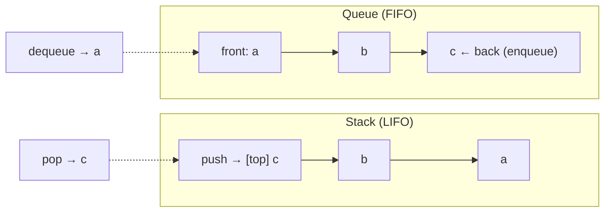
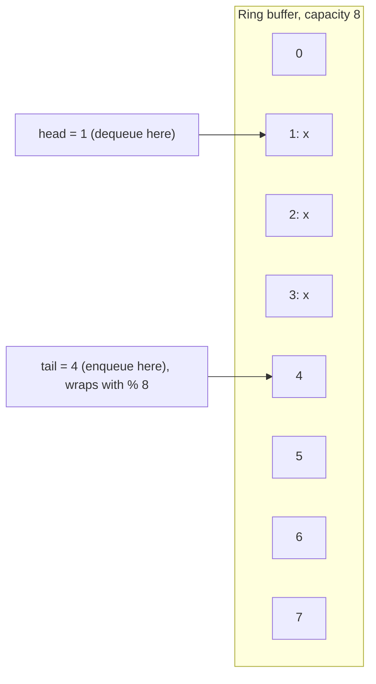
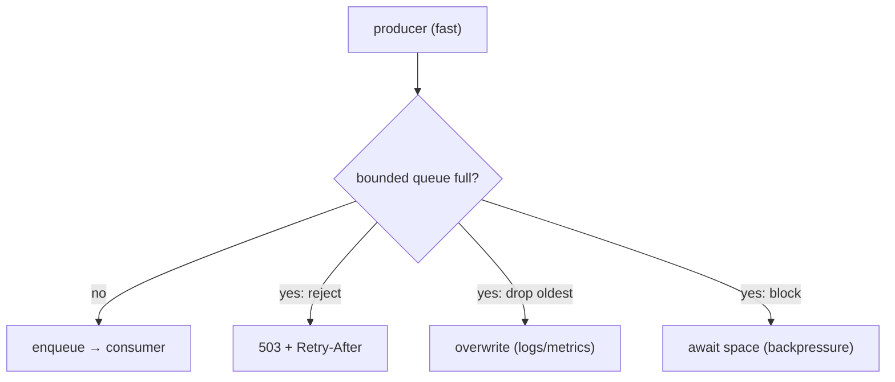

# Module 3.2 — المجموعات، المكدسات، الطوابير
## Sets, Stacks, Queues (and Deques): membership, LIFO, FIFO — and where you already use them

> **المستوى:** Level 3 | **الموقع:** [2 من 14]
> **السابق:** [M3.1 — Arrays & Hash Maps](module-3.1-arrays-hash-maps.md) | **التالي:** [M3.3 — Linked Lists](module-3.3-linked-lists.md)

---

## 1. المتطلبات
- [ ] تكاليف المصفوفة (`push/pop` O(1)، `shift/unshift` O(n))، فكرة التجزئة — [M3.1](module-3.1-arrays-hash-maps.md)
- [ ] مكدس الاستدعاء — [L2-M2.3](../level-2-computer-systems/module-2.3-memory-stack-heap-gc.md)
- [ ] حلقة الأحداث وطوابيرها — [L2-M2.7](../level-2-computer-systems/module-2.7-concurrency-event-loop.md)

## 2. أهداف التعلّم
- استخدام **`Set`** لعمليات العضوية وإزالة التكرار والفروق/التقاطعات بـ O(1) لكل عنصر، ومعرفة متى `Set` خطأ (تحتاج عدًّا؟ ترتيبًا بالقيمة؟).
- شرح **المكدس** (stack, LIFO) بأمثلته الحقيقية: مكدس الاستدعاء، التراجع (undo)، مطابقة الأقواس/تحليل JSON، DFS، التنقل في المتصفح.
- شرح **الطابور** (queue, FIFO) وأمثلته: طوابير المهام، BFS، buffers، معالجة الطلبات، rate limiting بنافذة منزلقة — وتنفيذه بشكل صحيح (**ليس `shift()`**).
- فهم **الطابور ذي الطرفين** (deque) و**الطابور الدائري** (ring buffer) ومتى تحتاجهما (سجل ثابت الحجم، نافذة منزلقة).
- التعرف على **Bounded queue** و**backpressure** كقرار معماري: ماذا تفعل عندما يمتلئ الطابور؟

---

## 3. شرح للمبتدئ

### Set: "هل رأيت هذا من قبل؟"
`Set` = خريطة تجزئة بلا قيم (M3.1). العمليات: `add/has/delete` O(1)، `size`، مرور بترتيب الإدراج. استخدمه عندما السؤال **عضوية** لا ربط:
- إزالة التكرار: `[...new Set(emails)]` (بعد التطبيع!).
- "تمت معالجته؟": `seen.has(id)` بدل `processed.includes(id)` (O(n²) الكلاسيكي).
- عمليات المجموعات (ES2025 مدمجة في Node 22): `a.union(b)`, `a.intersection(b)`, `a.difference(b)`, `a.isSubsetOf(b)` — "أي الصلاحيات ينقص هذا المستخدم؟" = `required.difference(granted)`.
- `WeakSet` لوسم كائنات دون منع GC.

**متى ليس Set؟** تحتاج **عدد المرات** → `Map<K, number>`؛ تحتاج **ترتيبًا بالقيمة أو نطاقًا** → مصفوفة مرتبة/شجرة (M3.4)؛ العناصر **كائنات** تريد مقارنتها بالمحتوى → استخدم مفتاحًا بدائيًا (`Set<string>` من `id`) لأن Set تقارن بالمرجع.

### المكدس (Stack): آخر من يدخل أول من يخرج
عمليتان فقط: `push` (ضع فوق) و`pop` (خذ من فوق)، + `peek`. كلاهما O(1) — ومصفوفة JS **هي** مكدس ممتاز (`push/pop` في النهاية). أين يعيش المكدس حولك؟
- **مكدس الاستدعاء** (L2-M2.3): كل استدعاء دالة push، كل عودة pop؛ `RangeError: Maximum call stack` = امتلاء.
- **Undo/Redo**: مكدسان؛ كل عملية push على undo؛ تراجع = pop من undo وpush على redo.
- **مطابقة الأقواس / تحليل التعبيرات / JSON parser**: عند `{` أو `[` push؛ عند `}`/`]` pop وتحقق من التطابق. Project 3 framer وأي محلّل تكتبه.
- **DFS** (M3.6) و**التكرار → حلقة** (M3.7): أي دالة تكرارية يمكن تحويلها لحلقة بمكدس صريح — وهذا ما تفعله عند "Maximum call stack" على شجرة عميقة.
- تاريخ التنقل، التراجع في المحرر، تقييم RPN، تتبّع المسار في file system walker.

### الطابور (Queue): أول من يدخل أول من يخرج
`enqueue` (أضف للخلف) و`dequeue` (خذ من الأمام)، O(1) كلاهما **في التنفيذ الصحيح**. أين؟
- **حلقة الأحداث** (L2-M2.7): طابور الـ callbacks، طابور microtasks — FIFO حرفيًا.
- **طوابير المهام/الرسائل** (L5-M9): المنتج يضيف، العامل يسحب؛ Redis Lists، RabbitMQ، SQS = طوابير موزّعة.
- **BFS** (M3.6): زيارة الأقرب فالأقرب.
- **Buffers**: بايتات TCP في النواة (L2-M2.9)، `socket.write` المعلّقة، pipe بين عمليات.
- **Rate limiting / نافذة منزلقة**: طابور بطوابع زمنية؛ أزل من الأمام ما تجاوز النافذة.
- **Worker pool** (L2-M2.6): `queue.shift()` حين يتفرغ عامل — تذكر؟ الآن تعرف أنه O(n).

**الفخ:** `arr.shift()` يزيح كل العناصر = O(n). طابور بـ 100k عنصر يُستهلك بـ `shift` = 5 مليارات نقلة. (V8 يحسّن `shift` للمصفوفات الصغيرة، لكن لا تعتمد عليه.) الحلول:
1. **مؤشر رأس** (head index): `items[head++]` ثم تنظيف دوري — O(1) بسطرين.
2. **الطابور الدائري** (ring buffer): مصفوفة ثابتة الحجم مع `head` و`tail` يلتفّان بـ `% capacity`. O(1)، ذاكرة ثابتة، صديق للكاش — **الأفضل للحجم المحدود** (سجلات آخر N حدث، عيّنات مقاييس، buffers صوت).
3. **قائمة مرتبطة** (M3.3): O(1) بلا حجم مسبق، أسوأ للكاش.

### Deque: الطرفان معًا
`pushFront/pushBack/popFront/popBack` كلها O(1). استخدامات: نافذة منزلقة للحد الأقصى (monotonic deque)، work-stealing schedulers (العامل يأخذ من طرف، السارق من الآخر)، تاريخ محدود الحجم (أضف من الخلف، أسقط من الأمام). يُبنى كطابور دائري قابل للنمو.

### الطابور المحدود (Bounded) و backpressure — قرار معماري
الطابور غير المحدود في الذاكرة = **تسرّب مؤجَّل**: منتج أسرع من المستهلك → الطابور ينمو → OOM بعد ساعة (L2-M2.3). الطابور المحدود يجبرك على **القرار** عند الامتلاء:
- **ارفض** (503/`Retry-After`، "القناة ممتلئة") — الأصدق للطلبات الحية.
- **أسقط الأقدم** (ring buffer يستبدل) — للسجلات/المقاييس حيث الحداثة أهم.
- **احجب المنتج** (`await` حتى يتوفر مكان) — backpressure الحقيقي (L1-M1.10 streams، L2-M2.9 TCP).
- **أسقط الأحدث** (tail drop) — نادرًا الصحيح.
لا يوجد خيار محايد؛ "لا حد" هو اختيار الخيار الأسوأ ضمنيًا.

---

## 4. النموذج الذهني

```
Set   = Map بلا قيم: has/add/delete O(1)؛ dedup، seen، union/intersection/difference؛ ليس للعدّ ولا للترتيب
Stack = LIFO: push/pop O(1) (مصفوفة!)؛ call stack، undo، أقواس/parsers، DFS، recursion→loop
Queue = FIFO: enqueue/dequeue O(1) — لا shift()! → head index | ring buffer | linked list
        event loop، task/message queues، BFS، buffers، sliding window
Deque = الطرفان O(1)؛ Ring buffer = حجم ثابت يلتف؛ Bounded queue → قرار: ارفض | أسقط الأقدم | احجب
```

## 5. الرسم التوضيحي







## 6. مثال بسيط

```typescript
// src/basics.ts
// Set: dedup + عمليات مجموعات (Node 22؛ في tsconfig أضف "lib": ["es2023", "esnext.collection"] كي يعرف TypeScript union/difference)
const granted = new Set(["read", "write"]), required = new Set(["read", "write", "admin"]);
console.log([...required.difference(granted)]);                 // ["admin"]  ← ما ينقص
console.log(new Set(["a@x.com", "A@x.com "].map(e => e.trim().toLowerCase())).size);   // 1 — طبّع قبل dedup

// Stack: مطابقة أقواس (نواة كل parser)
function balanced(src: string): boolean {
  const pairs: Record<string, string> = { ")": "(", "]": "[", "}": "{" }, stack: string[] = [];
  for (const ch of src) {
    if ("([{".includes(ch)) stack.push(ch);
    else if (ch in pairs) { if (stack.pop() !== pairs[ch]) return false; }
  }
  return stack.length === 0;
}
console.log(balanced("{a:[1,(2)]}"), balanced("{a:[1,(2])}"));   // true false

// Queue: الطريقة الخاطئة والصحيحة
const N = 200_000;
console.time("shift()"); { const q = Array.from({ length: N }, (_, i) => i); let s = 0; while (q.length) s += q.shift()!; } console.timeEnd("shift()");
console.time("head index"); { const q = Array.from({ length: N }, (_, i) => i); let head = 0, s = 0; while (head < q.length) s += q[head++]!; } console.timeEnd("head index");
```

## 7. مثال كود

```typescript
// src/ring-queue.ts — طابور دائري محدود + ثلاث سياسات امتلاء، ومثال rate limiter بنافذة منزلقة
export class RingQueue<T> {
  private buf: (T | undefined)[]; private head = 0; private tail = 0; private _size = 0;
  constructor(readonly capacity: number, readonly onFull: "reject" | "dropOldest" = "reject") { this.buf = new Array(capacity); }
  get size() { return this._size; }
  get isFull() { return this._size === this.capacity; }

  enqueue(item: T): boolean {
    if (this.isFull) {
      if (this.onFull === "reject") return false;                 // المنتج يقرر (503 / retry / backpressure)
      this.dequeue();                                              // dropOldest: الأقدم يُضحّى به
    }
    this.buf[this.tail] = item; this.tail = (this.tail + 1) % this.capacity; this._size++;
    return true;
  }
  dequeue(): T | undefined {
    if (this._size === 0) return undefined;
    const item = this.buf[this.head]; this.buf[this.head] = undefined;   // حرّر المرجع (GC، L2-M2.3)
    this.head = (this.head + 1) % this.capacity; this._size--; return item;
  }
  peek(): T | undefined { return this._size ? this.buf[this.head] : undefined; }
  *[Symbol.iterator]() { for (let i = 0; i < this._size; i++) yield this.buf[(this.head + i) % this.capacity] as T; }
}

// 1) سجل "آخر 1000 خطأ" في الذاكرة: حجم ثابت، الأقدم يُستبدل — لا ينمو أبدًا
const recentErrors = new RingQueue<{ t: number; msg: string }>(1000, "dropOldest");
for (let i = 0; i < 5000; i++) recentErrors.enqueue({ t: i, msg: `e${i}` });
console.log(recentErrors.size, recentErrors.peek()?.t);          // 1000 4000

// 2) طابور مهام محدود يرفض عند الامتلاء (الخادم يعيد 503 بدل OOM)
const jobs = new RingQueue<string>(3, "reject");
console.log(["a", "b", "c", "d"].map(j => jobs.enqueue(j)));     // [true,true,true,false] ← الرابع مرفوض صراحةً

// 3) Sliding-window rate limiter: طابور طوابع زمنية لكل عميل (الحد: 5 طلبات / 1000ms)
class SlidingWindowLimiter {
  private windows = new Map<string, number[]>();                   // deque بسيط: push للخلف، إزالة من الأمام بمؤشر
  constructor(private limit: number, private windowMs: number) {}
  allow(client: string, now = Date.now()): boolean {
    let q = this.windows.get(client); if (!q) this.windows.set(client, (q = []));
    let head = 0; while (head < q.length && q[head]! <= now - this.windowMs) head++;   // أسقط ما خرج من النافذة
    if (head) q.splice(0, head);                                   // تنظيف دفعة واحدة (لا shift في حلقة)
    if (q.length >= this.limit) return false;
    q.push(now); return true;
  }
}
const rl = new SlidingWindowLimiter(5, 1000);
console.log(Array.from({ length: 7 }, (_, i) => rl.allow("ip1", 1000 + i * 100)));   // 5 true ثم 2 false
console.log(rl.allow("ip1", 2150));                                 // true — الأقدم خرج من النافذة
```

## 8. مثال من العالم الحقيقي
- `Array.prototype.push/pop` كمكدس في كل محلّل JSON/HTML؛ V8 نفسه يستخدم مكدسًا لتقييم bytecode.
- Redis `LPUSH/BRPOP` = طابور؛ `SADD/SISMEMBER` = Set موزّع (dedup للأحداث، idempotency keys — L7).
- Kafka/SQS = طوابير **محدودة بالاحتفاظ** (retention) مع سياسات عند الامتلاء — نفس القرار الثلاثي.
- Nginx `listen backlog`، TCP accept queue (L2-M2.9) — طوابير محدودة: عند الامتلاء تُرمى SYNs.
- أدوات المراقبة تحتفظ بـ ring buffers للعيّنات الأخيرة (p99 في آخر دقيقة).

## 9. مثال من الإنتاج
**حادثة "OOM بعد 6 ساعات من الذروة":** خدمة إشعارات تستقبل أحداثًا وتدفعها إلى `pending: Event[]` ثم عامل يرسل بـ `pending.shift()`. في الذروة الإرسال (200/ث) أبطأ من الاستقبال (350/ث). النتيجة: (1) الطابور ينمو 150/ث → 3.2M عنصر بعد 6 ساعات → OOM (L2-M2.3)؛ (2) `shift()` على مصفوفة بملايين = كل إرسال يزيح ملايين المراجع → العامل يبطؤ أكثر → حلقة مفرغة. الإصلاح: طابور **محدود** (100k) بسياسة **ارفض** → المنتج يعيد 429 للمرسل مع `Retry-After` (الحمل الزائد يصبح **مرئيًا** بدل أن يُخفى في الذاكرة)، وتنفيذ بـ head index، ومقياس `queue_depth` مع تنبيه عند 70%. لاحقًا: طابور خارجي (L5-M9) يفصل الإنتاج عن الاستهلاك. **الدرس:** الطابور غير المحدود يخفي المشكلة حتى تنفجر؛ الامتلاء يجب أن يكون **قرارًا صريحًا ومقاسًا**.

## 10. مفاهيم خاطئة شائعة

| ❌ | ✅ |
|---|---|
| "`shift()` O(1) مثل `pop()`" | O(n) من حيث المبدأ؛ استخدم head index/ring/list للطوابير الكبيرة. |
| "Set يقارن الكائنات بالمحتوى" | بالمرجع. `new Set([{a:1},{a:1}]).size === 2`. استخدم مفاتيح بدائية. |
| "طابور بلا حد = مرونة" | = OOM مؤجَّل + كمون متزايد. الحد قرار تصميمي. |
| "المكدس مفهوم أكاديمي" | أنت داخل واحد الآن (call stack)، وكل parser وundo يستخدمه. |
| "Set يحفظ ترتيب الفرز" | يحفظ ترتيب **الإدراج** فقط. |

## 11. أخطاء شائعة
1. `processed.includes(id)` بدل `Set`.
2. `queue.shift()` في حلقة ساخنة.
3. Set/Map بمفاتيح كائنات عابرة.
4. طابور في الذاكرة بلا حد ولا مقياس عمق.
5. استخدام مكدس حيث يلزم طابور (معالجة الأحداث بترتيب عكسي بالخطأ!) أو العكس.
6. نسيان تحرير المراجع في ring buffer (تسرّب بحجم السعة لكائنات كبيرة).

## 12. تمرين تصحيح

```typescript
// محرر نصوص: undo يعمل، لكن "redo" أحيانًا يعيد تغييرًا قديمًا لا علاقة له، والذاكرة تنمو بلا حد في جلسة طويلة
const undo: Edit[] = [], redo: Edit[] = [];
function apply(e: Edit) { doEdit(e); undo.push(e); }
function undoLast() { const e = undo.pop(); if (e) { revert(e); redo.push(e); } }
function redoLast() { const e = redo.shift(); if (e) { doEdit(e); undo.push(e); } }
```

<details><summary>💡 الحل</summary>

1. **redo يعيد تغييرًا قديمًا**: `redo.shift()` يأخذ من **الأمام** (الأقدم) بينما redo مكدس يجب أن يُؤخذ من **الأعلى** (`pop`) — آخر ما تراجعت عنه هو أول ما تعيده (LIFO). خلط stack/queue.
2. **خطأ منطقي ثانٍ**: عند `apply` تغيير جديد بعد undo يجب **تفريغ redo** (`redo.length = 0`) — وإلا "redo" يعيد تغييرًا من فرع تاريخ لم يعد صالحًا. هذا هو السلوك القياسي لكل محرر.
3. **الذاكرة**: undo بلا حد؛ اجعله ring buffer `dropOldest` بسعة (مثلًا 500) — التراجع لأكثر من ذلك نادر، والـ Edits قد تحمل نصوصًا كبيرة.
4. اختبار: خاصية "apply(a), apply(b), undo, undo, redo, redo ≡ apply(a), apply(b)"، و"apply(a), undo, apply(c), redo → لا شيء".
</details>

## 13. تمرين معماري
صمّم طابور الأحداث داخل خدمة تستقبل 2k حدث/ثانية وتكتبها دفعات إلى DB: الحجم الأقصى (احسبه من الذاكرة المتاحة وحجم الحدث)، السياسة عند الامتلاء لكل نوع حدث (أحداث دفع vs أحداث نقرات)، كيف تُظهر العمق كمقياس وما العتبات، ماذا يحدث عند SIGTERM (L2-M2.5: تفريغ الطابور ضمن المهلة أم فقدانه؟)، ومتى تنتقل من الذاكرة إلى طابور خارجي. ACTRR.

## 14. الصلة بعصر AI
AI يولّد طوابير بـ `shift()` ومصفوفات `seen` بـ `includes` وطوابير بلا حد باستمرار — لأنها الأكثر شيوعًا في بيانات تدريبه. أضف لمواصفاتك: *"طابور محدود بسياسة امتلاء صريحة ومقياس عمق"*، وفي المراجعة ابحث عن `.shift()` و`.includes(` في حلقات و`push` بلا حد.

## 15–17. Master / Understand / Defer
- 🔴 Set للعضوية/dedup/الفروق ومقارنته بالمرجع؛ المكدس وأين يعيش (call stack، undo، parsers)؛ الطابور وأين يعيش (event loop، مهام، BFS، buffers)؛ **`shift()` O(n)** والبدائل؛ الطابور المحدود والسياسات الثلاث.
- 🟠 ring buffer بالتفصيل؛ deque والنافذة المنزلقة؛ عمليات Set المدمجة؛ WeakSet؛ تفريغ redo؛ مقياس العمق.
- ⚪ monotonic deque؛ work-stealing؛ lock-free queues؛ طوابير الأولوية (M3.5 التالي بعد واحدة).

## 18. الخلاصة
1. **Set** = عضوية O(1): dedup، seen، فروق مجموعات — بمفاتيح بدائية مطبَّعة.
2. **Stack** (LIFO) = مصفوفة `push/pop`؛ مكدس الاستدعاء، undo/redo، المحلّلات، DFS.
3. **Queue** (FIFO) = event loop، مهام، BFS، buffers؛ **لا تستخدم `shift()`** على الكبير: head index أو ring buffer.
4. **Ring buffer** = حجم ثابت يلتف؛ مثالي لـ "آخر N".
5. **الطابور المحدود** يحوّل الحمل الزائد من OOM صامت إلى قرار صريح: ارفض / أسقط الأقدم / احجب.

## 19. مراجع رسمية
- MDN — `Set` (incl. set methods union/intersection/difference): https://developer.mozilla.org/en-US/docs/Web/JavaScript/Reference/Global_Objects/Set
- MDN — `Array.prototype.shift()` (complexity note): https://developer.mozilla.org/en-US/docs/Web/JavaScript/Reference/Global_Objects/Array/shift
- Node.js — Backpressuring in Streams: https://nodejs.org/en/learn/modules/backpressuring-in-streams
- Open Data Structures — ArrayQueue / ArrayDeque: https://opendatastructures.org/ods-java/2_3_ArrayQueue_Array_Based_.html
- Wikipedia — Circular buffer: https://en.wikipedia.org/wiki/Circular_buffer

## المصطلحات
| العربية | English |
|---|---|
| مجموعة | Set |
| عضوية | Membership |
| إزالة التكرار | Deduplication |
| اتحاد / تقاطع / فرق | Union / Intersection / Difference |
| مكدس (آخر داخل أول خارج) | Stack (LIFO) |
| طابور (أول داخل أول خارج) | Queue (FIFO) |
| إضافة / إزالة من الطابور | Enqueue / Dequeue |
| طابور ذو طرفين | Deque |
| طابور دائري | Ring buffer / Circular buffer |
| طابور محدود | Bounded queue |
| سياسة الامتلاء | Overflow policy |
| إسقاط الأقدم | Drop oldest |
| نافذة منزلقة | Sliding window |
| عمق الطابور | Queue depth |

> **التالي:** [Module 3.3 — Linked Lists](module-3.3-linked-lists.md)
