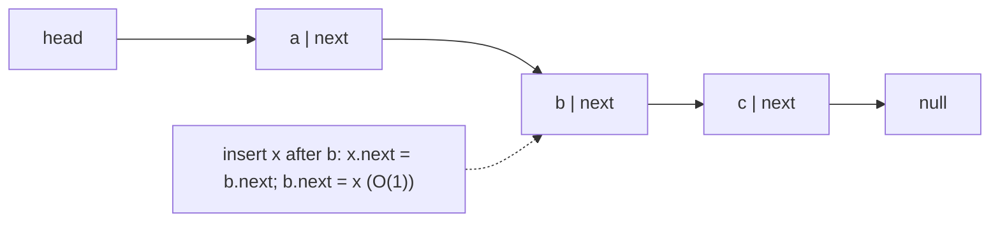
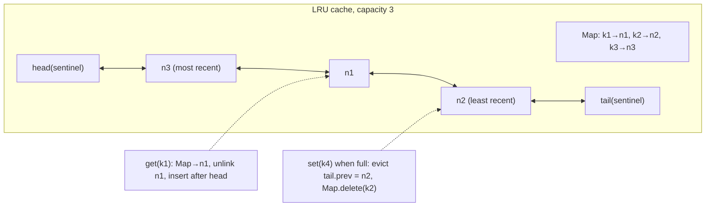
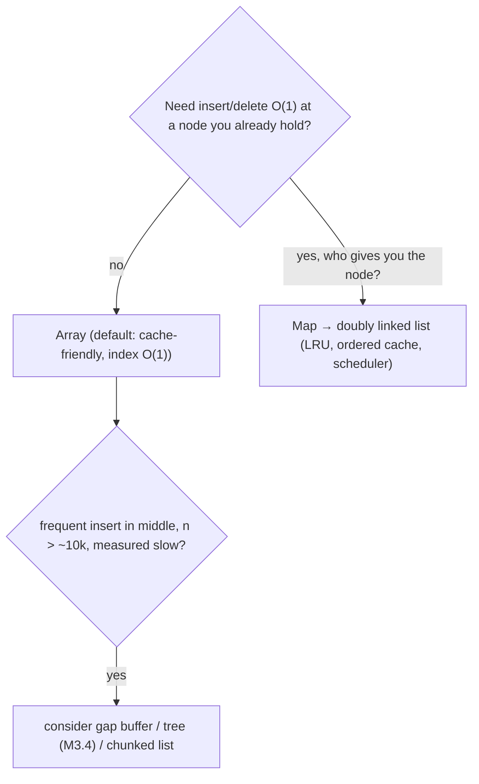

# Module 3.3 — القوائم المرتبطة
## Linked Lists: why they exist, where they lose to arrays, and the one place you will actually write one (LRU cache)

> **المستوى:** Level 3 | **الموقع:** [3 من 14]
> **السابق:** [M3.2 — Sets, Stacks, Queues](module-3.2-sets-stacks-queues.md) | **التالي:** [M3.4 — Trees](module-3.4-trees.md)

---

## 1. المتطلبات
- [ ] المراجع والكائنات في الـ heap — [L1-M1.6](../level-1-programming/module-1.6-objects-references.md)
- [ ] خطوط الكاش والذاكرة المتجاورة — [L2-M2.2](../level-2-computer-systems/module-2.2-cpu-cache-ram.md)
- [ ] تكلفة إدراج/حذف المصفوفة، `Map` — [M3.1](module-3.1-arrays-hash-maps.md)

## 2. أهداف التعلّم
- شرح **القائمة المرتبطة** (linked list) كعُقد في الـ heap يشير بعضها إلى بعض، و**لماذا** تجعل الإدراج/الحذف **عند عقدة معروفة** O(1) بينما الوصول بالفهرس O(n).
- معرفة لماذا تخسر القائمة أمام المصفوفة في **معظم** الحالات الحقيقية (cache misses، overhead لكل عقدة، مؤشرات) — وأن "O(1) insert" لا يعني "أسرع".
- التمييز بين **singly** و**doubly** وأثر المؤشر الخلفي (حذف O(1) بالعقدة نفسها).
- بناء **LRU cache** = `Map` + قائمة مزدوجة: الهيكل المركّب الأشهر في البرمجيات الحقيقية (Redis، DB buffer pools، كاش HTTP).
- التعرف على القوائم المرتبطة حولك: سلاسل التجزئة (M3.1)، طوابير النواة، `Map` في V8 (ترتيب الإدراج)، سلسلة الـ middleware، سلسلة النماذج الأولية (prototype chain).

---

## 3. شرح للمبتدئ

### المشكلة التي تحلها
المصفوفة (M3.1) ذاكرة متجاورة: الإدراج في المنتصف يزيح كل ما بعده O(n). القائمة المرتبطة تقول: **لا تُجاور العناصر؛ اربطها**. كل عنصر **عقدة** (node) `{ value, next }` في الـ heap (L1-M1.6)، والقائمة تعرف `head` فقط. للإدراج بعد عقدة `p`: `node.next = p.next; p.next = node` — خطوتان بغض النظر عن الطول. الحذف بعد `p`: `p.next = p.next.next`. **O(1) إذا كنت تمسك العقدة.**

### الثمن: الوصول والذاكرة والكاش
- **الوصول بالفهرس O(n)**: للوصول إلى العنصر 5000 تتبع 5000 مؤشر. لا `list[i]`.
- **البحث O(n)** كالمصفوفة غير المرتبطة، لكن أبطأ بثابت كبير.
- **الكاش** (L2-M2.2): عناصر المصفوفة متجاورة → خط كاش واحد يحمل 8–16 عنصرًا، والـ prefetcher يتوقع التالي. عقد القائمة متناثرة في الـ heap → **كل عقدة = cache miss محتمل** (~100ns بدل ~1ns). في القياس العملي، المرور على قائمة بمليون عقدة أبطأ 5–20× من مصفوفة. حتى "الإدراج في المنتصف" غالبًا **أسرع في المصفوفة** للأحجام حتى آلاف العناصر، لأن `memmove` لذاكرة متجاورة سريع جدًا بينما إيجاد موضع الإدراج في القائمة يتطلب مرورًا بـ cache misses.
- **Overhead**: كل عقدة كائن في JS: header + `value` + `next` (+ `prev`) ≈ 40–56 بايت لتخزين مرجع واحد. مصفوفة مليون رقم ≈ 8MB؛ قائمة مليون ≈ 50MB + ضغط على GC (مليون كائن حي).

**القاعدة العملية:** المصفوفة افتراضيًا. القائمة فقط عندما تحتاج **O(1) إدراج/حذف عند عقدة تمسكها بالفعل من هيكل آخر** (عادةً `Map`) — وهذا بالضبط LRU.

### Singly vs Doubly
- **Singly** `{value,next}`: للحذف تحتاج **العقدة السابقة** (لتعديل `prev.next`) → حذف عقدة معيّنة O(n) ما لم تمسك سابقتها.
- **Doubly** `{value,prev,next}`: حذف **أي عقدة تمسكها** O(1): `node.prev.next = node.next; node.next.prev = node.prev`. الثمن مؤشر إضافي. **خدعة sentinel**: عقدتا head/tail وهميتان دائمتان تلغيان كل شروط `if (node === head)` الحدّية.

### LRU cache: لماذا كل الهياكل التي تعلمتها تلتقي هنا
كاش بسعة محدودة يطرد **الأقل استخدامًا مؤخرًا** (Least Recently Used). المطلوب: `get(key)` O(1)، `set` O(1)، "اجعل هذا الأحدث" O(1)، "اطرد الأقدم" O(1). `Map` وحدها تعطي get/set لكن "انقل للأحدث" يتطلب حذفًا وإعادة إدراج (في JS عمليًا `map.delete + map.set` يعيد الترتيب — يعمل، لكن لنفهم الآلية العامة). الحل الكلاسيكي: **`Map<key, Node>` + قائمة مزدوجة مرتّبة بالحداثة**: الخريطة تعطيك العقدة O(1)، القائمة تنقلها للمقدمة O(1) (لأنها مزدوجة) وتطرد من المؤخرة O(1). هذا الهيكل داخل Redis (approximate LRU)، buffer pool في PostgreSQL (clock-sweep قريب)، `lru-cache` npm، كاش DNS في المتصفح.

### أين تراها دون أن تكتبها
- **سلاسل التجزئة** في M3.1 (`bucket` قائمة).
- **V8 `Map`/`Set`**: تحافظ على ترتيب الإدراج عبر جدول مرتّب + روابط — لذلك `delete` ثم `set` ينقل للنهاية.
- **Prototype chain**: `obj → proto → proto → null` — قائمة مرتبطة مفردة تمشي عليها كل عملية `obj.prop` غير الموجودة محليًا.
- **سلسلة middleware** (Express/Koa `next()`), سلسلة `Promise.then` (كل `then` عقدة تنتظر السابقة).
- **النواة**: قوائم العمليات الجاهزة، قوائم `sk_buff` للحزم، free lists في المخصّص.
- **Undo غير محدود**/تاريخ المتصفح مع فروع، ومحررات النصوص (piece table/rope — أشجار لكن الفكرة نفسها).

---

## 4. النموذج الذهني

```
Array      : [a][b][c][d]   متجاور → index O(1)، كاش ممتاز، insert وسط O(n) (لكن memmove سريع)
Linked list: a→b→c→d        متناثر → index O(n)، كاش سيئ، insert/delete عند عقدة تمسكها O(1)
Doubly     : a⇄b⇄c⇄d        + حذف أي عقدة تمسكها O(1) (+ sentinels تلغي الحالات الحدّية)
القاعدة    : Array افتراضيًا. List فقط عندما Map (أو غيرها) تعطيك العقدة مباشرة → LRU cache
LRU        : Map<key,Node> + doubly list (front = الأحدث، back = الأقدم → يُطرد)
```

## 5. الرسم التوضيحي







## 6. مثال بسيط

```typescript
// src/singly.ts — قائمة مفردة بأبسط صورة: لفهم المؤشرات، لا للاستخدام اليومي
type Node<T> = { value: T; next: Node<T> | null };
class SinglyList<T> {
  head: Node<T> | null = null; size = 0;
  pushFront(value: T) { this.head = { value, next: this.head }; this.size++; }          // O(1)
  popFront(): T | undefined { const h = this.head; if (!h) return; this.head = h.next; this.size--; return h.value; }
  insertAfter(node: Node<T>, value: T) { node.next = { value, next: node.next }; this.size++; }   // O(1) — تمسك node
  at(i: number): T | undefined { let n = this.head; while (n && i-- > 0) n = n.next; return n?.value; }   // O(n)
  *[Symbol.iterator]() { for (let n = this.head; n; n = n.next) yield n.value; }
  reverse() { let prev: Node<T> | null = null, cur = this.head; while (cur) { const nx: Node<T> | null = cur.next; cur.next = prev; prev = cur; cur = nx; } this.head = prev; }
}
const l = new SinglyList<number>(); [3, 2, 1].forEach(v => l.pushFront(v));
l.insertAfter(l.head!, 99); console.log([...l]);     // [1, 99, 2, 3]
l.reverse(); console.log([...l], l.at(0));           // [3, 2, 99, 1] 3

// قياس صادق: مرور على مليون عنصر — مصفوفة vs قائمة (cache locality)
// ملاحظة: إن أنشأت العقد بالتسلسل مباشرة فسيضعها V8 متجاورة في الـ heap وتبدو القائمة سريعة (جرّب!). في heap حقيقي
// بعد ساعات من التخصيص/التحرير تكون العقد متناثرة — نحاكي ذلك بربط العقد بترتيب عشوائي للذاكرة:
const N = 1_000_000, arr = Array.from({ length: N }, (_, i) => i);
const nodes: Node<number>[] = Array.from({ length: N }, (_, i) => ({ value: i, next: null }));
for (let i = N - 1; i > 0; i--) { const j = Math.floor(Math.random() * (i + 1)); [nodes[i], nodes[j]] = [nodes[j]!, nodes[i]!]; }   // Fisher–Yates
for (let i = 0; i < N - 1; i++) nodes[i]!.next = nodes[i + 1]!;
const scattered = new SinglyList<number>(); scattered.head = nodes[0]!; scattered.size = N;
console.time("array sum");           { let s = 0; for (const v of arr) s += v; } console.timeEnd("array sum");
console.time("scattered list sum");  { let s = 0; for (const v of scattered) s += v; } console.timeEnd("scattered list sum");   // أبطأ 5–20×: cache miss لكل عقدة
```

## 7. مثال كود

```typescript
// src/lru.ts — LRU cache: Map + doubly linked list with sentinels. O(1) get/set/evict.
type LNode<K, V> = { key: K; value: V; prev: LNode<K, V>; next: LNode<K, V> };

export class LRUCache<K, V> {
  private map = new Map<K, LNode<K, V>>();
  private head: LNode<K, V>; private tail: LNode<K, V>;     // sentinels: لا تحمل بيانات، تلغي الحالات الحدّية
  hits = 0; misses = 0; evictions = 0;

  constructor(private capacity: number, private onEvict?: (key: K, value: V) => void) {
    if (capacity < 1) throw new RangeError("capacity must be >= 1");
    const h = {} as LNode<K, V>, t = {} as LNode<K, V>;
    h.next = t; t.prev = h; this.head = h; this.tail = t;
  }
  get size() { return this.map.size; }

  get(key: K): V | undefined {
    const n = this.map.get(key);
    if (!n) { this.misses++; return undefined; }
    this.hits++; this.unlink(n); this.insertFront(n);        // "استُخدم الآن" = انقله للمقدمة
    return n.value;
  }
  set(key: K, value: V): void {
    const existing = this.map.get(key);
    if (existing) { existing.value = value; this.unlink(existing); this.insertFront(existing); return; }
    if (this.map.size >= this.capacity) {
      const lru = this.tail.prev;                               // الأقدم في المؤخرة
      this.unlink(lru); this.map.delete(lru.key); this.evictions++; this.onEvict?.(lru.key, lru.value);
    }
    const n = { key, value } as LNode<K, V>; this.insertFront(n); this.map.set(key, n);
  }
  delete(key: K): boolean { const n = this.map.get(key); if (!n) return false; this.unlink(n); return this.map.delete(key); }
  *keysMostRecentFirst() { for (let n = this.head.next; n !== this.tail; n = n.next) yield n.key; }

  private unlink(n: LNode<K, V>) { n.prev.next = n.next; n.next.prev = n.prev; }
  private insertFront(n: LNode<K, V>) { n.prev = this.head; n.next = this.head.next; this.head.next.prev = n; this.head.next = n; }
}

// الاستخدام: كاش لنتائج استعلام DB (Project 4) بسعة محدودة — لا ينمو أبدًا (قارن Map بلا حد في M3.1)
const cache = new LRUCache<string, { name: string }>(2, (k) => console.log("evict", k));
cache.set("p1", { name: "Pen" }); cache.set("p2", { name: "Pad" });
cache.get("p1");                                   // p1 أصبح الأحدث
cache.set("p3", { name: "Pin" });                  // evict p2  ← الأقل استخدامًا مؤخرًا
console.log([...cache.keysMostRecentFirst()], cache.get("p2"), { hits: cache.hits, misses: cache.misses });
// ["p3","p1"] undefined { hits: 1, misses: 1 }
```

> **ملاحظة JS:** يمكن كتابة LRU بـ `Map` وحدها (`delete` + `set` ينقل للنهاية؛ `map.keys().next().value` الأقدم) — أقصر وغالبًا كافٍ. تعلّمتَ النسخة بالقائمة لأنها **الآلية العامة** التي تجدها في C/Rust/Go وفي النواة وفي DB buffer pools، ولأن `Map` وحدها لا تعطي "انقل للمنتصف" أو LFU أو TTL لكل عقدة.

## 8. مثال من العالم الحقيقي
- `lru-cache` (npm، ~200M تنزيل/أسبوع): Map + قوائم ضمنية بمصفوفات متوازية (`next[]/prev[]` كـ `Uint32Array`) — قائمة مرتبطة **بدون كائنات** لتجنّب GC وcache misses: درس "القائمة كمفهوم، والمصفوفة كتخزين".
- PostgreSQL buffer pool: clock-sweep (تقريب LRU بلا نقل عقد)؛ MySQL InnoDB: LRU بنقطة منتصف (midpoint insertion) لحماية الصفحات الساخنة من مسح كامل.
- Linux kernel `list_head`: قائمة مزدوجة دائرية مضمّنة داخل البنى — كل شيء (عمليات، ملفات، أجهزة) على قوائم.
- Prototype chain في JS؛ `Promise` chains؛ Express middleware.

## 9. مثال من الإنتاج
**حادثة "كاش LRU يسرّب رغم السعة":** فريق استبدل `Map` غير محدودة بـ LRU بسعة 10k، والذاكرة ظلّت تنمو. التحقيق (heap snapshot، L2-M2.3): (1) القيم المخزّنة كانت **استجابات كاملة** مع مراجع إلى `req`/`socket` → كل مدخل يبقي عشرات KB حية؛ 10k × 40KB = 400MB "ضمن السعة". (2) `onEvict` كان يدفع المطرودين إلى مصفوفة `evictedForMetrics` بلا حد (طابور غير محدود — M3.2 مرة أخرى). الإصلاح: خزّن **بيانات مجرّدة صغيرة** فقط (DTO)، احسب السعة **بالبايتات** لا بالعدد (`sizeCalculation` في lru-cache)، وعدّاد للمطرودين بدل قائمة. **الدرس:** الحد بالعدد لا يحدّ الذاكرة؛ وما تُمسكه القيمة يُمسكه الكاش.

## 10. مفاهيم خاطئة شائعة

| ❌ | ✅ |
|---|---|
| "القائمة أسرع للإدراج، فاستخدمها عند الإدراج الكثير" | O(1) فقط عند عقدة تمسكها؛ إيجاد الموضع O(n) بـ cache misses. المصفوفة تفوز غالبًا حتى ~10k. |
| "JS ليس فيه قوائم مرتبطة" | `Map` ترتيبها، prototype chain، Promise chains، middleware — كلها قوائم. |
| "LRU = Map + حذف وإعادة إدراج فقط" | يعمل في JS، لكن الآلية العامة Map + doubly list وهي ما تحتاجه لـ LFU/TTL/لغات أخرى. |
| "سعة الكاش بالعدد تحمي من OOM" | الحد بالعدد لا يحد البايتات؛ القيم الكبيرة/المراجع تسرّب. |

## 11. أخطاء شائعة
1. حلقة بـ `list.at(i)` → O(n²). استخدم المكرِّر.
2. نسيان تحديث `prev` في القائمة المزدوجة (نصف الروابط صحيحة = أخطاء غامضة لاحقًا).
3. حالات حدّية (قائمة فارغة/عنصر واحد/حذف head) — استخدم sentinels.
4. حلقة لا نهائية بسبب دورة (`a.next = a`) — تذكّر عند reverse/splice.
5. LRU يخزّن قيمًا تحمل مراجع ثقيلة؛ أو بلا حد بالبايتات.
6. `get` لا ينقل للمقدمة (يصبح FIFO لا LRU) — اختبر الترتيب صراحةً.

## 12. تمرين تصحيح

```typescript
// LRU بسيط بـ Map وحدها. معدّل الإصابة (hit rate) في الإنتاج 12% رغم أن 80% من الطلبات تكرر نفس 500 مفتاح، والسعة 1000
class LRU<K, V> {
  private m = new Map<K, V>();
  constructor(private cap: number) {}
  get(k: K) { return this.m.get(k); }
  set(k: K, v: V) {
    if (this.m.size >= this.cap) this.m.delete(this.m.keys().next().value!);
    this.m.set(k, v);
  }
}
```

<details><summary>💡 الحل</summary>

1. **`get` لا يحدّث الحداثة**: لا ينقل المفتاح للنهاية → الطرد بترتيب **الإدراج** (FIFO) لا الاستخدام. المفاتيح الـ500 الساخنة تُطرد بانتظام عندما تمر 500 مفاتيح باردة. الإصلاح: `const v = this.m.get(k); if (v !== undefined) { this.m.delete(k); this.m.set(k, v); } return v;`.
2. **`set` لمفتاح موجود** يطرد غيره بلا داعٍ (`size >= cap` قبل التحقق من الوجود): احذف المفتاح الموجود أولًا ثم أعد إدراجه.
3. قيمة `undefined` مخزّنة لا تُميَّز عن miss؛ استخدم `has` أو لا تخزّن `undefined`.
4. أضف عدّادات hits/misses وتنبيهًا — هكذا اكتُشفت المشكلة أصلًا؛ واختبار: "set a,b,c (cap 3); get a; set d → b مطرود لا a".
</details>

## 13. تمرين معماري
صمّم كاش في الذاكرة لـ Project 4 لنتائج `GET /products/:id`: سياسة الطرد (LRU؟ LFU؟ TTL؟ لماذا)، الحد (بالبايتات كيف تحسبه)، الإبطال عند `PUT/DELETE` (ماذا يحدث مع عدة نسخ من الخادم — L2-M2.13 stateless؟)، المقاييس (hit rate، evictions/s)، ومتى تنقله إلى Redis (L5-M5.8). ACTRR.

## 14. الصلة بعصر AI
اطلب من AI "LRU cache" وستحصل غالبًا على نسخة صحيحة — المشكلة في **التكامل**: ما يُخزَّن، كيف يُبطَل، الحد بالبايتات. راجع الحدود لا الخوارزمية. وإذا اقترح AI قائمة مرتبطة "لأن الإدراج O(1)" اسأله: من يمسك العقدة؟ إن لم يكن هناك Map أو مرجع مباشر فالمصفوفة أفضل.

## 15–17. Master / Understand / Defer
- 🔴 لماذا القائمة O(1) عند عقدة تمسكها وO(n) بالفهرس؛ لماذا تخسر أمام المصفوفة عمليًا (كاش، overhead)؛ القاعدة "Array افتراضيًا"؛ LRU = Map + قائمة مزدوجة، و`get` ينقل للمقدمة.
- 🟠 singly vs doubly، sentinels، reverse؛ أين تعيش القوائم في JS/النواة؛ الحد بالبايتات والإبطال.
- ⚪ skip lists، unrolled/chunked lists، intrusive lists، lock-free lists، piece table/rope.

## 18. الخلاصة
1. القائمة المرتبطة = عقد متناثرة مربوطة بمؤشرات: إدراج/حذف **عند عقدة تمسكها** O(1)، الوصول بالفهرس O(n).
2. عمليًا المصفوفة تفوز غالبًا (خطوط الكاش، overhead، GC) — القائمة أداة متخصصة لا بديل عام.
3. المكان الذي تكتبها فيه فعلًا: **LRU cache** (`Map` للعثور، قائمة مزدوجة للترتيب) وأقاربه (LFU، TTL، schedulers).
4. تراها كل يوم دون كتابتها: `Map` ordering، prototype chain، Promise/middleware chains، سلاسل التجزئة، قوائم النواة.
5. حدّ الكاش بالبايتات وبالقيم المجرّدة؛ `get` يجب أن يحدّث الحداثة وإلا صار FIFO.

## 19. مراجع رسمية
- MDN — Inheritance and the prototype chain: https://developer.mozilla.org/en-US/docs/Web/JavaScript/Inheritance_and_the_prototype_chain
- `lru-cache` (npm) README (design notes, sizeCalculation): https://github.com/isaacs/node-lru-cache
- MySQL docs — Buffer Pool LRU algorithm (midpoint insertion): https://dev.mysql.com/doc/refman/8.4/en/innodb-buffer-pool.html
- Open Data Structures — Linked Lists (SLList/DLList): https://opendatastructures.org/ods-java/3_Linked_Lists.html
- Bjarne Stroustrup — "Why you should avoid Linked Lists" (talk, GoingNative 2012): https://www.youtube.com/watch?v=YQs6IC-vgmo

## المصطلحات
| العربية | English |
|---|---|
| قائمة مرتبطة | Linked list |
| عقدة | Node |
| رأس / ذيل | Head / Tail |
| قائمة مفردة / مزدوجة | Singly / Doubly linked list |
| عقدة حارسة | Sentinel node |
| فك الربط | Unlink |
| كاش الأقل استخدامًا مؤخرًا | LRU (Least Recently Used) cache |
| طرد | Eviction |
| معدّل الإصابة | Hit rate |
| إبطال الكاش | Cache invalidation |
| سلسلة النماذج الأولية | Prototype chain |
| حمل زائد لكل عقدة | Per-node overhead |

> **التالي:** [Module 3.4 — Trees](module-3.4-trees.md)
